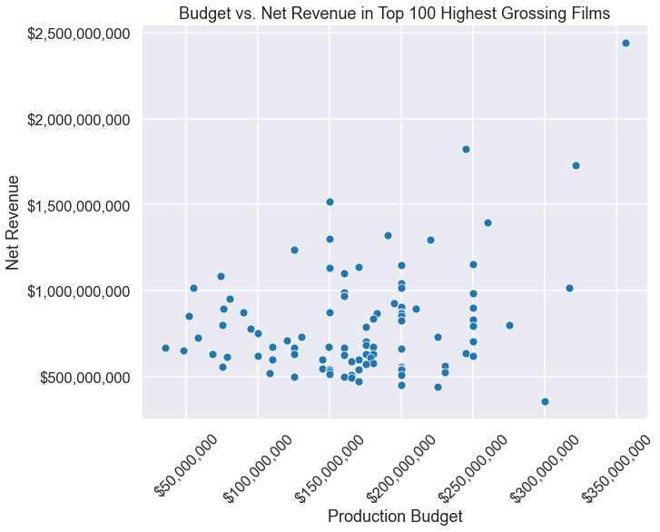
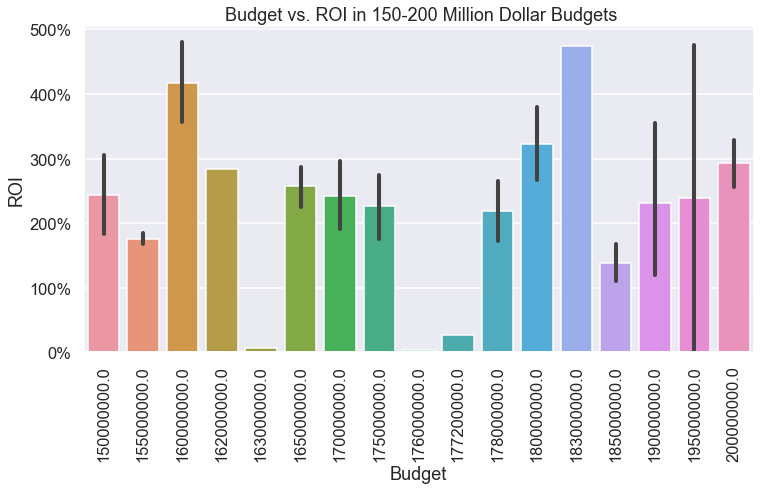
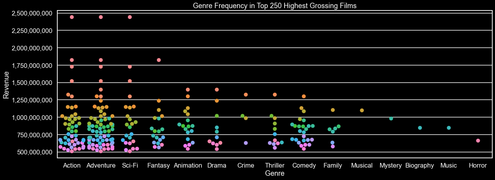
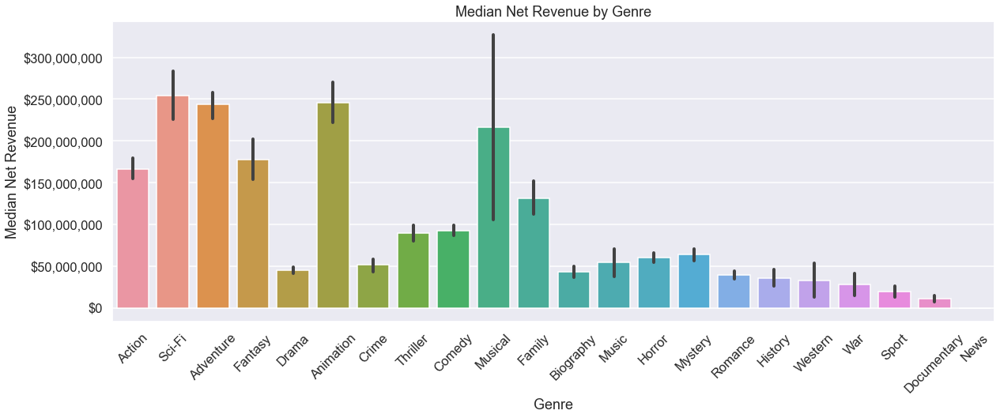
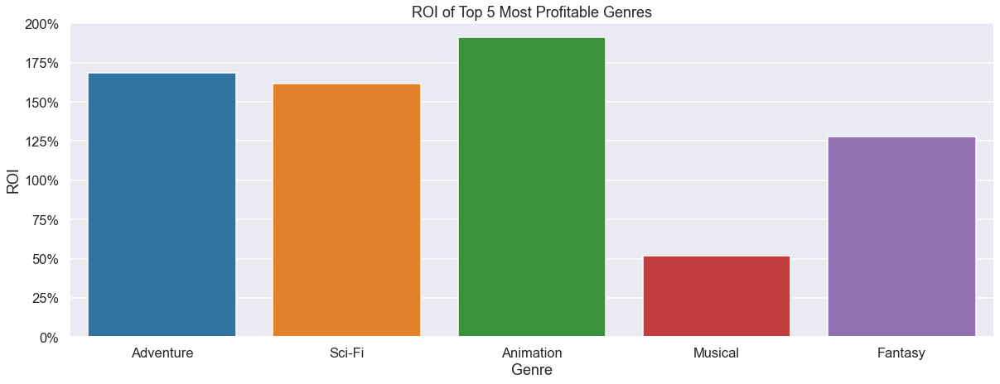
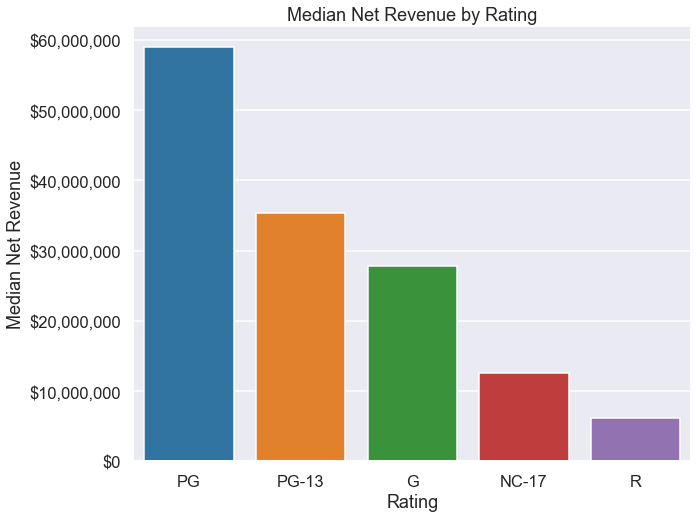
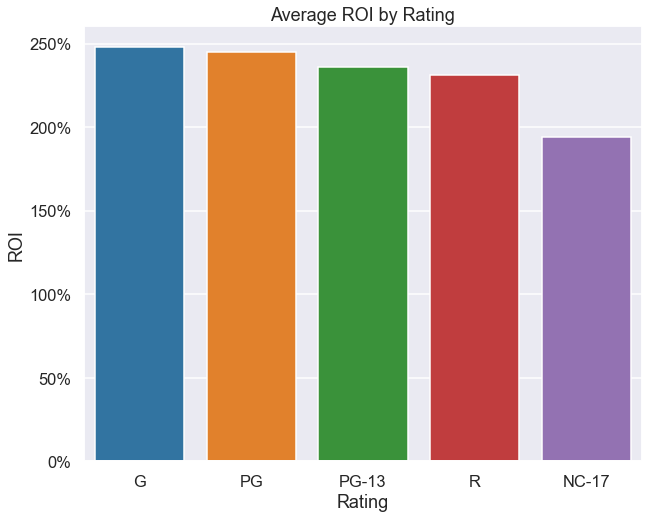
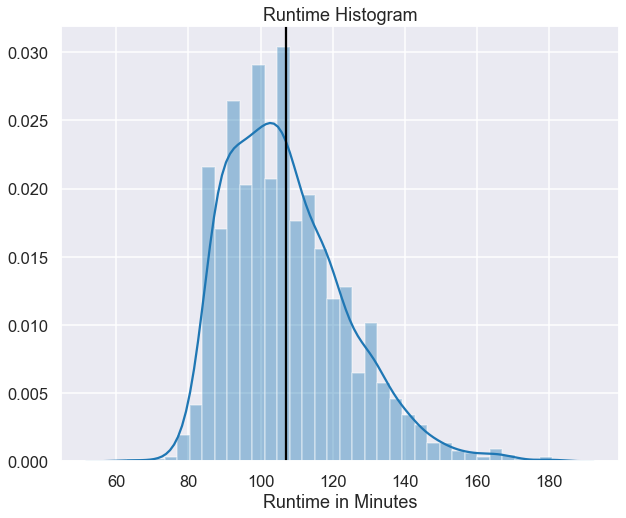
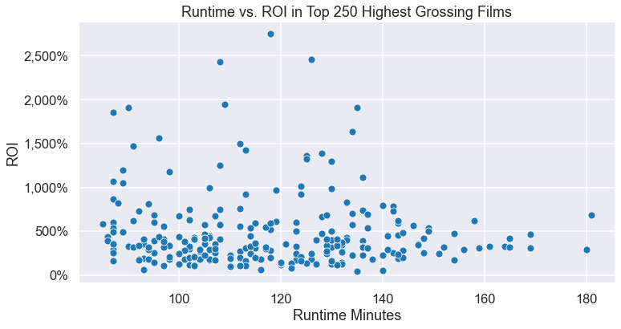
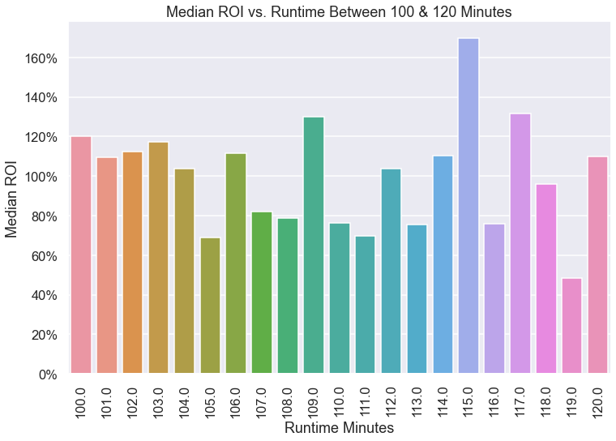

## Final Project Submission

Please fill out:
* Student name: Jeff Spagnola
* Student pace: Full Time 
* Scheduled project review date/time: Monday, August 10th, 2020 - 2:45pm
* Instructor name: James Irving
* Blog post URL:


# Introduction

## Overview

Microsoft has recognized that other large tech corporations have found ample success in the film industry by producing their own original content.  The creation of the Microsoft Studios will create an entirely new revenue stream for the company as well as provide many opportunities to synergize with existing Microsoft products.  However, with a high-dollar point of entry and Microsoft's sterling reputation on the line, this can also prove to be a risky venture.  How can we minimize this risk and maximize the return on investment by using a data-driven production system?

Over the course of this notebook, we will answer the following questions:
 - Is there a correlation between a film's budget and it's performance at the box office?
 - Do films in certain genres perform better at the box office?  If so, which genres?
 - Is there a correlation between a film's MPAA rating and it's ROI?
 - Does a film's runtime have any affect on it's worldwide gross?


## Additional Notes

### Special Thanks

This analysis could not be done without the combined efforts of the P2P Study Group.  The data contained in imdb_money_ratings was scraped with 'test_requests.py' (found in the notebook) which was written by Sam Stoltenberg with the combined computing strength of the group.   

### List of Functions


```python
# Gets info from the csv

def get_info (csv_name):
    print(csv_name.shape)
    print()
    print(csv_name.describe())
    print()
    print(csv_name.info())
    print()
    print(csv_name.isna().sum())

```

# Import and Clean Provided Datasets


```python
!pip install -U plotly
```

    Requirement already up-to-date: plotly in /Users/spags/opt/anaconda3/envs/learn-env/lib/python3.6/site-packages (4.9.0)
    Requirement already satisfied, skipping upgrade: retrying>=1.3.3 in /Users/spags/opt/anaconda3/envs/learn-env/lib/python3.6/site-packages (from plotly) (1.3.3)
    Requirement already satisfied, skipping upgrade: six in /Users/spags/opt/anaconda3/envs/learn-env/lib/python3.6/site-packages (from plotly) (1.12.0)


```python
import numpy as np
import pandas as pd
import matplotlib.pyplot as plt
%matplotlib inline
import seaborn as sns
import random
import requests
from bs4 import BeautifulSoup
import time
import plotly.express as px
import matplotlib.ticker as mtick
from scipy import stats
```

    /Users/spags/opt/anaconda3/envs/learn-env/lib/python3.6/site-packages/statsmodels/tools/_testing.py:19: FutureWarning: pandas.util.testing is deprecated. Use the functions in the public API at pandas.testing instead.
      import pandas.util.testing as tm


```python
# Changes floats from scientific notation to more readable numbers. 
pd.set_option('display.float_format', lambda x: '%.2f' % x)

# Set dark background for Seaborn
plt.style.use("seaborn-darkgrid")
```

### Clean IMDB Title Basics CSV - CLEANED
This CSV contains basic information pertaining to films listed on IMDB, including title, genre, year released, and runtime.  Most importantly, it contains the 'tconst' column which is a unique code used by IMDB to organize their films.  This will be useful later in joining the different data sets. 


```python
# Imported the CSV file

imdb_title_basics_df = pd.read_csv('zippedData/imdb.title.basics.csv.gz', compression = 'gzip')
imdb_title_basics_df.head()
```


<div>
<style scoped>
    .dataframe tbody tr th:only-of-type {
        vertical-align: middle;
    }

    .dataframe tbody tr th {
        vertical-align: top;
    }

    .dataframe thead th {
        text-align: right;
    }
</style>
<table border="1" class="dataframe">
  <thead>
    <tr style="text-align: right;">
      <th></th>
      <th>tconst</th>
      <th>primary_title</th>
      <th>original_title</th>
      <th>start_year</th>
      <th>runtime_minutes</th>
      <th>genres</th>
    </tr>
  </thead>
  <tbody>
    <tr>
      <th>0</th>
      <td>tt0063540</td>
      <td>Sunghursh</td>
      <td>Sunghursh</td>
      <td>2013</td>
      <td>175.00</td>
      <td>Action,Crime,Drama</td>
    </tr>
    <tr>
      <th>1</th>
      <td>tt0066787</td>
      <td>One Day Before the Rainy Season</td>
      <td>Ashad Ka Ek Din</td>
      <td>2019</td>
      <td>114.00</td>
      <td>Biography,Drama</td>
    </tr>
    <tr>
      <th>2</th>
      <td>tt0069049</td>
      <td>The Other Side of the Wind</td>
      <td>The Other Side of the Wind</td>
      <td>2018</td>
      <td>122.00</td>
      <td>Drama</td>
    </tr>
    <tr>
      <th>3</th>
      <td>tt0069204</td>
      <td>Sabse Bada Sukh</td>
      <td>Sabse Bada Sukh</td>
      <td>2018</td>
      <td>nan</td>
      <td>Comedy,Drama</td>
    </tr>
    <tr>
      <th>4</th>
      <td>tt0100275</td>
      <td>The Wandering Soap Opera</td>
      <td>La Telenovela Errante</td>
      <td>2017</td>
      <td>80.00</td>
      <td>Comedy,Drama,Fantasy</td>
    </tr>
  </tbody>
</table>
</div>


```python
# Using a function to get basic data

get_info(imdb_title_basics_df)
```

    (146144, 6)
    
           start_year  runtime_minutes
    count   146144.00        114405.00
    mean      2014.62            86.19
    std          2.73           166.36
    min       2010.00             1.00
    25%       2012.00            70.00
    50%       2015.00            87.00
    75%       2017.00            99.00
    max       2115.00         51420.00
    
    <class 'pandas.core.frame.DataFrame'>
    RangeIndex: 146144 entries, 0 to 146143
    Data columns (total 6 columns):
     #   Column           Non-Null Count   Dtype  
    ---  ------           --------------   -----  
     0   tconst           146144 non-null  object 
     1   primary_title    146144 non-null  object 
     2   original_title   146123 non-null  object 
     3   start_year       146144 non-null  int64  
     4   runtime_minutes  114405 non-null  float64
     5   genres           140736 non-null  object 
    dtypes: float64(1), int64(1), object(4)
    memory usage: 6.7+ MB
    None
    
    tconst                 0
    primary_title          0
    original_title        21
    start_year             0
    runtime_minutes    31739
    genres              5408
    dtype: int64


```python
# Finding the median of runtime_minutes

imdb_title_basics_df['runtime_minutes'].median()
```


    87.0


```python
# Replacing the null values in runtime_minutes with the median. (side note...not sure why I couldn't pass in the 
# code to get the median as the argument.

imdb_title_basics_df['runtime_minutes'].fillna(87.0, inplace = True)
```


```python
#Finding the mode of 'genres'

imdb_title_basics_df['genres'].mode()
```


    0    Documentary
    dtype: object


```python
#Filling the null values with the mode.

imdb_title_basics_df['genres'].fillna('Documentary', inplace = True)
#imdb_title_basics_df.head()
```


```python
imdb_title_basics_df.dropna(axis = 0, inplace = True)
```


```python
#imdb_title_basics_df.head()
print(imdb_title_basics_df.shape)
```

    (146123, 6)


```python
# Getting the value counts for each column to search for weirdness.

imdb_title_basics_columns = imdb_title_basics_df.columns
for column in imdb_title_basics_columns:
    display(imdb_title_basics_df[column].value_counts())
```


    tt5930026    1
    tt1896788    1
    tt4484670    1
    tt9452304    1
    tt9106456    1
                ..
    tt6020486    1
    tt5069160    1
    tt5442308    1
    tt3527010    1
    tt1870570    1
    Name: tconst, Length: 146123, dtype: int64


    Home                                    24
    Broken                                  20
    The Return                              20
    Alone                                   16
    Homecoming                              16
                                            ..
    In Search of Voodoo: Roots to Heaven     1
    Mona, tesoro del Caribe                  1
    Searching for Katie                      1
    Lobotomiya                               1
    The Making of a Fatherless Daughter      1
    Name: primary_title, Length: 136056, dtype: int64


    Broken                                 19
    Home                                   18
    The Return                             17
    The Gift                               13
    Homecoming                             13
                                           ..
    A Mulher de Longe                       1
    The Dunning Man Soundtrack              1
    Nhung Buc Thu Tu Son My                 1
    One of Too Many: Part 3                 1
    The Making of a Fatherless Daughter     1
    Name: original_title, Length: 137773, dtype: int64


    2017    17494
    2016    17269
    2018    16846
    2015    16242
    2014    15589
    2013    14708
    2012    13786
    2011    12900
    2010    11849
    2019     8378
    2020      936
    2021       83
    2022       32
    2023        5
    2024        2
    2027        1
    2026        1
    2025        1
    2115        1
    Name: start_year, dtype: int64


    87.00       33653
    90.00        7131
    80.00        3526
    85.00        2915
    100.00       2662
                ...  
    396.00          1
    382.00          1
    14400.00        1
    724.00          1
    540.00          1
    Name: runtime_minutes, Length: 367, dtype: int64


    Documentary                       37574
    Drama                             21486
    Comedy                             9177
    Horror                             4372
    Comedy,Drama                       3519
                                      ...  
    Comedy,Sport,Thriller                 1
    History,Romance,Western               1
    Crime,Fantasy,War                     1
    Animation,Documentary,Thriller        1
    Action,Horror,Music                   1
    Name: genres, Length: 1085, dtype: int64


### Clean IMDB Title Ratings CSV - CLEANED
This CSV contains the user rating and vote numbers for each film listed.  Like earlier, this csv includes the 'tconst' column which will be used in a later merge.  


```python
# Import the CSV

imdb_title_ratings_df = pd.read_csv('zippedData/imdb.title.ratings.csv.gz', compression = 'gzip')
imdb_title_ratings_df.head()
```


<div>
<style scoped>
    .dataframe tbody tr th:only-of-type {
        vertical-align: middle;
    }

    .dataframe tbody tr th {
        vertical-align: top;
    }

    .dataframe thead th {
        text-align: right;
    }
</style>
<table border="1" class="dataframe">
  <thead>
    <tr style="text-align: right;">
      <th></th>
      <th>tconst</th>
      <th>averagerating</th>
      <th>numvotes</th>
    </tr>
  </thead>
  <tbody>
    <tr>
      <th>0</th>
      <td>tt10356526</td>
      <td>8.30</td>
      <td>31</td>
    </tr>
    <tr>
      <th>1</th>
      <td>tt10384606</td>
      <td>8.90</td>
      <td>559</td>
    </tr>
    <tr>
      <th>2</th>
      <td>tt1042974</td>
      <td>6.40</td>
      <td>20</td>
    </tr>
    <tr>
      <th>3</th>
      <td>tt1043726</td>
      <td>4.20</td>
      <td>50352</td>
    </tr>
    <tr>
      <th>4</th>
      <td>tt1060240</td>
      <td>6.50</td>
      <td>21</td>
    </tr>
  </tbody>
</table>
</div>


```python
# Using a function to get basic informationa bout the dataframe.

get_info(imdb_title_ratings_df)
```

    (73856, 3)
    
           averagerating   numvotes
    count       73856.00   73856.00
    mean            6.33    3523.66
    std             1.47   30294.02
    min             1.00       5.00
    25%             5.50      14.00
    50%             6.50      49.00
    75%             7.40     282.00
    max            10.00 1841066.00
    
    <class 'pandas.core.frame.DataFrame'>
    RangeIndex: 73856 entries, 0 to 73855
    Data columns (total 3 columns):
     #   Column         Non-Null Count  Dtype  
    ---  ------         --------------  -----  
     0   tconst         73856 non-null  object 
     1   averagerating  73856 non-null  float64
     2   numvotes       73856 non-null  int64  
    dtypes: float64(1), int64(1), object(1)
    memory usage: 1.7+ MB
    None
    
    tconst           0
    averagerating    0
    numvotes         0
    dtype: int64


```python
# Getting an idea for the value counts to search for any weirdness.

imdb_title_ratings_columns = imdb_title_ratings_df.columns
for column in imdb_title_ratings_columns:
    display(imdb_title_ratings_df[column].value_counts())
```


    tt1683919    1
    tt2691690    1
    tt1626184    1
    tt6463494    1
    tt5335682    1
                ..
    tt2762506    1
    tt2756188    1
    tt2583942    1
    tt7115980    1
    tt1870570    1
    Name: tconst, Length: 73856, dtype: int64


    7.00     2262
    6.60     2251
    7.20     2249
    6.80     2239
    6.50     2221
             ... 
    9.60       18
    10.00      16
    9.80       15
    9.70       12
    9.90        5
    Name: averagerating, Length: 91, dtype: int64


    6        2875
    5        2699
    7        2476
    8        2167
    9        1929
             ... 
    18286       1
    16289       1
    1958        1
    4007        1
    4098        1
    Name: numvotes, Length: 7349, dtype: int64


# Import Additional Data With Web Scraping 

## Box Office Results of Movie Franchises - FUTURE WORK

Address this in the future.  Link for scrape = https://www.the-numbers.com/movies/franchises#franchise_overview=od1


```python
#franchise_page = requests.get('https://www.the-numbers.com/movies/franchises') 
#soup = BeautifulSoup(franchise_page.content, 'html.parser') 
```


```python
#soup.prettify
```


```python
# franchise_data = soup.findAll('table')
# franchise_data

```


```python
#from html.parser import HTMLParser
```


```python
# edited_franchise = franchise_data.text
# edited_franchise
```

## IMDB Scraped with Group

This scrape was a group effort with the core P2P study group team.  Each person took on a section of IMDB 'tconst' codes to scrape useful monetary and rating data.  The combined computing power allowed us to cut scrape time from 11 days down to around 9 hours.  To see the code for the scrape, please refer to 'test_requests.py'.


```python
#Import the CSV

imdb_money_ratings = pd.read_csv('budget_ratings.csv')
imdb_money_ratings.head()
```


<div>
<style scoped>
    .dataframe tbody tr th:only-of-type {
        vertical-align: middle;
    }

    .dataframe tbody tr th {
        vertical-align: top;
    }

    .dataframe thead th {
        text-align: right;
    }
</style>
<table border="1" class="dataframe">
  <thead>
    <tr style="text-align: right;">
      <th></th>
      <th>Unnamed: 0</th>
      <th>tconst</th>
      <th>budget</th>
      <th>gross</th>
      <th>ww_gross</th>
      <th>rating</th>
    </tr>
  </thead>
  <tbody>
    <tr>
      <th>0</th>
      <td>0</td>
      <td>tt2200832</td>
      <td>nan</td>
      <td>nan</td>
      <td>nan</td>
      <td>NotRated</td>
    </tr>
    <tr>
      <th>1</th>
      <td>1</td>
      <td>tt2200860</td>
      <td>nan</td>
      <td>nan</td>
      <td>1924766.00</td>
      <td>NaN</td>
    </tr>
    <tr>
      <th>2</th>
      <td>2</td>
      <td>tt2200908</td>
      <td>nan</td>
      <td>nan</td>
      <td>105367.00</td>
      <td>NaN</td>
    </tr>
    <tr>
      <th>3</th>
      <td>3</td>
      <td>tt2200926</td>
      <td>nan</td>
      <td>nan</td>
      <td>5784.00</td>
      <td>NaN</td>
    </tr>
    <tr>
      <th>4</th>
      <td>4</td>
      <td>tt2200955</td>
      <td>nan</td>
      <td>nan</td>
      <td>nan</td>
      <td>Comedy</td>
    </tr>
  </tbody>
</table>
</div>


```python
# Get info on the csv using a function.

get_info(imdb_money_ratings)
```

    (52943, 6)
    
           Unnamed: 0       budget        gross      ww_gross
    count    52943.00     19396.00      6233.00      20921.00
    mean     26471.00   6315791.47  17489603.72   16321566.20
    std      15283.47  31223176.17  55195072.21   85632102.24
    min          0.00         0.00        72.00          0.00
    25%      13235.50      5000.00     24094.00      34829.00
    50%      26471.00    186500.00    175232.00     327453.00
    75%      39706.50   1000000.00   4033574.00    2935188.00
    max      52942.00 900000000.00 936662225.00 2797800564.00
    
    <class 'pandas.core.frame.DataFrame'>
    RangeIndex: 52943 entries, 0 to 52942
    Data columns (total 6 columns):
     #   Column      Non-Null Count  Dtype  
    ---  ------      --------------  -----  
     0   Unnamed: 0  52943 non-null  int64  
     1   tconst      52943 non-null  object 
     2   budget      19396 non-null  float64
     3   gross       6233 non-null   float64
     4   ww_gross    20921 non-null  float64
     5   rating      35743 non-null  object 
    dtypes: float64(3), int64(1), object(2)
    memory usage: 2.4+ MB
    None
    
    Unnamed: 0        0
    tconst            0
    budget        33547
    gross         46710
    ww_gross      32022
    rating        17200
    dtype: int64


```python
# Check the unique values within the ratings.  Uh oh...

imdb_money_ratings['rating'].unique()
```


    array(['NotRated', nan, 'Comedy', 'Thriller', 'Documentary', 'R', 'TV-PG',
           'Family', 'PG-13', 'Drama,', 'TV-G', 'PG', 'Family,', 'Sci-Fi',
           'Comedy,', 'TV-MA', 'Biography,', 'Horror', 'G', 'Unrated',
           'Drama', 'Action', 'Romance', 'TV-14', 'Romance,', 'Sport',
           'Biography', 'Horror,', 'Action,', '27January2012(USA)',
           'TVMovie31October2010', 'Mystery', 'Crime,', 'Reality-TV',
           'History', 'Fantasy', 'TV-Y7', 'Animation,', '5May2012(USA)',
           'Music', 'Documentary,', 'Adventure,', 'TV-Y', 'Crime', 'NC-17',
           'Western', 'TV-Y7-FV', '2April2016(Japan)', 'Approved',
           '22March2012(Spain)', '19July2012(Portugal)', 'Adventure',
           'Musical', 'M', 'TVMovie21April2011', '12September2012(Poland)',
           'Animation', 'History,', 'TVMovie20April2012',
           '25April2014(Spain)', '5July2013(France)', 'Adult', 'Fantasy,',
           '25February2013(BurkinaFaso)', '7October2012(USA)', 'X',
           '23May2013(Argentina)', '12June2014(Italy)', 'War',
           '13August2011(Russia)', 'Mystery,', '8February2013(Germany)',
           'TVMovie', '2013(USA)', 'TVMovie24April2013',
           '25January2013(Spain)', '4April2013(Argentina)', 'Thriller,',
           'TVMovie30March2013', '16May2013(Argentina)',
           'TVMovieFebruary2013', '3May2013(Ireland)', 'TVMovie6May2012',
           'TVMovie6June2013', 'TVMovie16November2014', 'TVMovie2014',
           '5March2010(India)', '3June2010(India)', '16August2014(Poland)',
           '29July2011(India)', '19August2011(India)',
           '12March2015(Argentina)', '20February2015(Japan)',
           'TVMovie26October2013', 'TVMovie7February2015',
           '30January2015(India)', '27February2015(India)', 'TVMovie2016',
           '24October2014(Belgium)', '23October2016(Spain)',
           'TVMovie31October2015', '20June2015(Japan)', '20January2016(USA)',
           '6August2015(Thailand)', 'Music,', '20August2015(USA)',
           '2015(France)', '19October2014(India)', '30June2017(Canada)',
           'TVMovie2015', '1January2016(Spain)', 'Musical,', 'E10+',
           'TVMovie7December2014', 'Sci-Fi,', '9March2016(Mexico)',
           'TVMovie8February2010', 'E', '26July2013(India)',
           '15August2013(UK)', '30November2012(India)', '25June2014(France)',
           'January2012(UK)', '7March2014(India)', '14August2013(USA)',
           '22August2013(Argentina)', '8March2013(India)',
           '22March2013(India)', '1May2015(India)', 'December2014(India)',
           '12February2014(Germany)', '2012(Oman)', '24January2014(India)',
           '12', '11April2014(Spain)', 'Open', '9June2014(India)',
           '18April2014(India)', '4December2010(Russia)',
           '12June2014(Finland)', '30May2014(India)', 'News',
           '26August2017(USA)', '12November2015(Argentina)', 'TVMovie2013',
           '8April2014(USA)', '17April2014(USA)', '19August2014(USA)',
           '15August2014(Poland)', '23April2015(India)',
           'TVMovie23December2014', '31July2010(Japan)', '29July2010(USA)',
           'TVMovie25February2011', '6January2011(Argentina)',
           '18September2010(Japan)', 'TVMovie29December2011',
           '23November2012(Brazil)', '27August2010(Japan)',
           'November2010(Argentina)', '24November2011(NewZealand)',
           '29September2011(Indonesia)', '14November2010(USA)',
           'TVMovie11December2010', '14October2010(UK)', 'TVMovie27May2011',
           '28September2010(Japan)', '25September2011(Switzerland)',
           'TVMovie5May2012', '6March2011(USA)', 'TVMovie4November2010', 'C',
           '9December2011(Spain)', '1July2011(Colombia)', '2March2012(Spain)',
           'TVMovie23March2011', 'TVMovie12March2011', 'TVMovie27June2011',
           '2012(UK)', '7February2011(USA)', 'TVMovie15June2011',
           '10June2011(Pakistan)', 'TVMovie18June2011',
           'TVMovie28September2011', '27July2012(Spain)',
           '7July2011(Malaysia)', '26July2011(Germany)',
           '9October2011(SouthKorea)', '27October2011(Japan)',
           '1December2011(UK)', '1March2012(UK)', 'TVMovie12September2011',
           '9February2012(UK)', '15October2011(Japan)',
           'TVMovie2December2011', 'TVMovie1May2012', 'February2012(Iran)',
           'February2012(Germany)', '2011(UK)', '19March2020(USA)',
           'TVMovie10June2016', 'TVMovie5October2019', '4April2018(China)',
           '16June2017(China)', '19May2017(China)', '20July2017(Thailand)',
           '31May2017(SouthKorea)', '8November2018(Russia)',
           '21December2017(China)', '12October2018(China)',
           '4January2019(Lithuania)', '1March2019(Lithuania)',
           '6June2019(Argentina)', 'TVMovie8June2019', '10March2016(Russia)',
           '11January2019(China)', '25December2015(Russia)',
           '23March2018(Turkey)', '8March2018(SouthKorea)',
           '12April2018(Uruguay)', '19April2018(Hungary)',
           '30October2017(Colombia)', '17August2018(Turkey)',
           '15December2017(Turkey)', '10January2019(Argentina)',
           '18June2019(China)', 'T', '22November2019(USA)',
           '22December2010(Spain)', '8August2019(USA)',
           'TVMovie21October2019', '22August2019(Uruguay)',
           '29August2019(Russia)', '5September2019(Slovakia)', '2017(India)',
           '11October2019(Iceland)', '25October2019(China)',
           'TVMovie18April2020', '12October2019(USA)',
           '16November2019(China)', '8November2019(Japan)',
           '21November2019(SouthKorea)', '29November2019(Lithuania)',
           '28November2019(SouthKorea)', '5December2019(Russia)',
           '22May2020(Japan)', '20December2019(UK)',
           '26December2019(CzechRepublic)', '9January2020(Argentina)',
           '1January2020(USA)', '31January2020(USA)', 'Adult,',
           '23January2020(Germany)', '27February2020(CzechRepublic)',
           '15April2020(USA)', '20February2020(UnitedArabEmirates)', '18',
           'TVMovie5June2020', '3March2012(USA)', '7April2010(Belgium)',
           '9April2011(Argentina)', '11February2011(Spain)',
           'TVMovie22January2010', '13May2010(Russia)', '22June2012(Spain)',
           '25November2011(Spain)', '23September2011(Spain)',
           '19August2017(USA)', '22September2017(India)',
           'TVMovie23September2017', '6September2014(Russia)',
           '6October2017(UK)', '12January2016(SouthKorea)',
           '28June2017(SouthKorea)', '2February2018(India)',
           'TVMovie23January2018', '15December2017(India)',
           '30December2015(USA)', '8November2016(SouthKorea)', 'TVMovie2017',
           'TVMovie20January2018', 'December2017(Armenia)',
           '15December2015(SouthKorea)', 'TVMovie3July2020',
           '9January2018(SouthKorea)', '2015(Iran)', '7July2020(Italy)',
           'M/PG', 'MA-17', '12November2017(Poland)', '25May2018(USA)',
           '3May2016(USA)', '20May2016(Spain)', '2016(Turkey)', '2018(USA)',
           '1September2018(Argentina)', '12June2016(Italy)', '10May2015(USA)',
           '29January2015(Switzerland)', '14March2014(India)',
           '6October2017(USA)', '24March2017(Spain)', '17April2015(USA)',
           '13September2019(Ukraine)', '25January2017(USA)',
           'TVMovie6November2016', '8December2016(Brazil)',
           '10July2016(Portugal)', '24April2016(SouthKorea)',
           '14June2015(France)', '20November2016(SouthKorea)',
           '17January2016(Brazil)', '20March2016(CzechRepublic)',
           '18December2015(Lithuania)', '24January2016(UK)',
           '7December2014(France)', '5October2014(Lebanon)',
           '12June2015(Taiwan)', '7August2016(Argentina)',
           '28August2016(Argentina)', '5May2013(Venezuela)',
           '30August2015(UnitedArabEmirates)', '21June2015(France)',
           '6December2015(Thailand)', '23August2015(Sweden)',
           '28June2015(France)', '3April2016(China)', '1November2015(Italy)',
           '12July2015(China)', '26June2016(China)',
           '13November2016(Slovakia)', '27September2015(Spain)',
           '9November2014(Peru)', '13December2015(Spain)',
           '20March2016(Italy)', '16June2016(Cambodia)',
           '15January2012(UnitedArabEmirates)', '25October2015(Vietnam)',
           '13March2016(UK)', '27September2015(Colombia)',
           '27September2015(Lebanon)', '9October2011(Uruguay)',
           '20September2015(Uruguay)', '21February2016(UnitedArabEmirates)',
           '31January2016(Japan)', '2October2016(SouthKorea)',
           '20November2016(Argentina)', '27December2015(Lithuania)',
           '25October2015(Thailand)', '24January2016(Brazil)',
           '17May2015(Austria)', '24March2013(CzechRepublic)',
           '11September2016(UnitedArabEmirates)', '30October2016(Spain)',
           '12September2010(China)', '20November2016(Turkey)',
           '3November2013(Brazil)', '13March2016(Turkey)',
           '28February2016(Japan)', '7September2017(Germany)',
           '30October2017(USA)', 'TVMovie1July2017', '2015(India)',
           '12February2017(Japan)', '19March2017(Japan)', '25April2012(USA)',
           '13November2015(Lithuania)', '10January2016(India)',
           '22June2017(Greece)', '4July2017(USA)', '22July2017(Japan)'],
          dtype=object)


```python
# Removed the junk data and replaced with NaN's.

ratings = ['M/PG', 'MA-17', 'X', 'M', 'C', 'T', 'E', 'E10+', 'TV-Y7-FV', 'NC-17', 'TV-Y',
           'TV-Y7', 'TV-14', 'G', 'TV-MA', 'PG', 'TV-G', 'PG-13', 'TV-PG', 'R']
for i in imdb_money_ratings['rating']:
    if i not in ratings:
        imdb_money_ratings['rating'].replace(i, np.nan, inplace=True)
    
```


```python
imdb_money_ratings['rating'].unique()
```


    array([nan, 'R', 'TV-PG', 'PG-13', 'TV-G', 'PG', 'TV-MA', 'G', 'TV-14',
           'TV-Y7', 'TV-Y', 'NC-17', 'TV-Y7-FV', 'M', 'X', 'E10+', 'E', 'C',
           'T', 'M/PG', 'MA-17'], dtype=object)


```python
imdb_money_ratings.head()
```


<div>
<style scoped>
    .dataframe tbody tr th:only-of-type {
        vertical-align: middle;
    }

    .dataframe tbody tr th {
        vertical-align: top;
    }

    .dataframe thead th {
        text-align: right;
    }
</style>
<table border="1" class="dataframe">
  <thead>
    <tr style="text-align: right;">
      <th></th>
      <th>Unnamed: 0</th>
      <th>tconst</th>
      <th>budget</th>
      <th>gross</th>
      <th>ww_gross</th>
      <th>rating</th>
    </tr>
  </thead>
  <tbody>
    <tr>
      <th>0</th>
      <td>0</td>
      <td>tt2200832</td>
      <td>nan</td>
      <td>nan</td>
      <td>nan</td>
      <td>NaN</td>
    </tr>
    <tr>
      <th>1</th>
      <td>1</td>
      <td>tt2200860</td>
      <td>nan</td>
      <td>nan</td>
      <td>1924766.00</td>
      <td>NaN</td>
    </tr>
    <tr>
      <th>2</th>
      <td>2</td>
      <td>tt2200908</td>
      <td>nan</td>
      <td>nan</td>
      <td>105367.00</td>
      <td>NaN</td>
    </tr>
    <tr>
      <th>3</th>
      <td>3</td>
      <td>tt2200926</td>
      <td>nan</td>
      <td>nan</td>
      <td>5784.00</td>
      <td>NaN</td>
    </tr>
    <tr>
      <th>4</th>
      <td>4</td>
      <td>tt2200955</td>
      <td>nan</td>
      <td>nan</td>
      <td>nan</td>
      <td>NaN</td>
    </tr>
  </tbody>
</table>
</div>


<h5> NOTE: </h5>
Tons of missing data in here.  Decided to whittle down from 52k listings to a smaller set that will represent ACCURATELY reported data from reputable studios.  Ran a check to make sure that this did not eliminate data on mainstream content (wide releases, blockbuster movies, noteworthy films, etc.)


```python
#Dropping columns with missing information

imdb_money_ratings.dropna(axis = 0, inplace=True)
imdb_money_ratings.head()
```


<div>
<style scoped>
    .dataframe tbody tr th:only-of-type {
        vertical-align: middle;
    }

    .dataframe tbody tr th {
        vertical-align: top;
    }

    .dataframe thead th {
        text-align: right;
    }
</style>
<table border="1" class="dataframe">
  <thead>
    <tr style="text-align: right;">
      <th></th>
      <th>Unnamed: 0</th>
      <th>tconst</th>
      <th>budget</th>
      <th>gross</th>
      <th>ww_gross</th>
      <th>rating</th>
    </tr>
  </thead>
  <tbody>
    <tr>
      <th>48</th>
      <td>48</td>
      <td>tt2203939</td>
      <td>40000000.00</td>
      <td>83911193.00</td>
      <td>196710396.00</td>
      <td>PG-13</td>
    </tr>
    <tr>
      <th>67</th>
      <td>67</td>
      <td>tt2205401</td>
      <td>5000000.00</td>
      <td>17390770.00</td>
      <td>17534314.00</td>
      <td>R</td>
    </tr>
    <tr>
      <th>73</th>
      <td>73</td>
      <td>tt2205591</td>
      <td>100000.00</td>
      <td>71737.00</td>
      <td>71737.00</td>
      <td>PG</td>
    </tr>
    <tr>
      <th>92</th>
      <td>92</td>
      <td>tt2207006</td>
      <td>10000000.00</td>
      <td>110904.00</td>
      <td>110904.00</td>
      <td>PG-13</td>
    </tr>
    <tr>
      <th>121</th>
      <td>121</td>
      <td>tt2209418</td>
      <td>3000000.00</td>
      <td>8114627.00</td>
      <td>20994648.00</td>
      <td>R</td>
    </tr>
  </tbody>
</table>
</div>


```python
imdb_money_ratings.shape
```


    (2225, 6)


```python
imdb_money_ratings.head(10)
```


<div>
<style scoped>
    .dataframe tbody tr th:only-of-type {
        vertical-align: middle;
    }

    .dataframe tbody tr th {
        vertical-align: top;
    }

    .dataframe thead th {
        text-align: right;
    }
</style>
<table border="1" class="dataframe">
  <thead>
    <tr style="text-align: right;">
      <th></th>
      <th>Unnamed: 0</th>
      <th>tconst</th>
      <th>budget</th>
      <th>gross</th>
      <th>ww_gross</th>
      <th>rating</th>
    </tr>
  </thead>
  <tbody>
    <tr>
      <th>48</th>
      <td>48</td>
      <td>tt2203939</td>
      <td>40000000.00</td>
      <td>83911193.00</td>
      <td>196710396.00</td>
      <td>PG-13</td>
    </tr>
    <tr>
      <th>67</th>
      <td>67</td>
      <td>tt2205401</td>
      <td>5000000.00</td>
      <td>17390770.00</td>
      <td>17534314.00</td>
      <td>R</td>
    </tr>
    <tr>
      <th>73</th>
      <td>73</td>
      <td>tt2205591</td>
      <td>100000.00</td>
      <td>71737.00</td>
      <td>71737.00</td>
      <td>PG</td>
    </tr>
    <tr>
      <th>92</th>
      <td>92</td>
      <td>tt2207006</td>
      <td>10000000.00</td>
      <td>110904.00</td>
      <td>110904.00</td>
      <td>PG-13</td>
    </tr>
    <tr>
      <th>121</th>
      <td>121</td>
      <td>tt2209418</td>
      <td>3000000.00</td>
      <td>8114627.00</td>
      <td>20994648.00</td>
      <td>R</td>
    </tr>
    <tr>
      <th>129</th>
      <td>129</td>
      <td>tt2209764</td>
      <td>100000000.00</td>
      <td>23022309.00</td>
      <td>103039258.00</td>
      <td>PG-13</td>
    </tr>
    <tr>
      <th>209</th>
      <td>209</td>
      <td>tt2215077</td>
      <td>270000000.00</td>
      <td>54529.00</td>
      <td>306393.00</td>
      <td>R</td>
    </tr>
    <tr>
      <th>223</th>
      <td>223</td>
      <td>tt2215285</td>
      <td>20000000.00</td>
      <td>65653242.00</td>
      <td>66899242.00</td>
      <td>PG-13</td>
    </tr>
    <tr>
      <th>241</th>
      <td>241</td>
      <td>tt2215719</td>
      <td>12000000.00</td>
      <td>25326071.00</td>
      <td>32726956.00</td>
      <td>PG</td>
    </tr>
    <tr>
      <th>249</th>
      <td>249</td>
      <td>tt2216240</td>
      <td>500000.00</td>
      <td>414437.00</td>
      <td>2688444.00</td>
      <td>R</td>
    </tr>
  </tbody>
</table>
</div>


# Join Data into Single Dataframe

In this section, I've first merged the imdb_title_basics_df & imdb_title_ratings_df.  Then, merged this new dataframe with the additional data scraped from IMDB.  This left me with one extremely useful dataframe representing 2225 films. 

## Merge Dataframes


```python
#Merging the imdb_title_basics & imddb_title_ratings dataframes.

imdb_df = pd.merge(left=imdb_title_basics_df, right=imdb_title_ratings_df, how='left', left_on='tconst', right_on='tconst')
imdb_df.head()
```


<div>
<style scoped>
    .dataframe tbody tr th:only-of-type {
        vertical-align: middle;
    }

    .dataframe tbody tr th {
        vertical-align: top;
    }

    .dataframe thead th {
        text-align: right;
    }
</style>
<table border="1" class="dataframe">
  <thead>
    <tr style="text-align: right;">
      <th></th>
      <th>tconst</th>
      <th>primary_title</th>
      <th>original_title</th>
      <th>start_year</th>
      <th>runtime_minutes</th>
      <th>genres</th>
      <th>averagerating</th>
      <th>numvotes</th>
    </tr>
  </thead>
  <tbody>
    <tr>
      <th>0</th>
      <td>tt0063540</td>
      <td>Sunghursh</td>
      <td>Sunghursh</td>
      <td>2013</td>
      <td>175.00</td>
      <td>Action,Crime,Drama</td>
      <td>7.00</td>
      <td>77.00</td>
    </tr>
    <tr>
      <th>1</th>
      <td>tt0066787</td>
      <td>One Day Before the Rainy Season</td>
      <td>Ashad Ka Ek Din</td>
      <td>2019</td>
      <td>114.00</td>
      <td>Biography,Drama</td>
      <td>7.20</td>
      <td>43.00</td>
    </tr>
    <tr>
      <th>2</th>
      <td>tt0069049</td>
      <td>The Other Side of the Wind</td>
      <td>The Other Side of the Wind</td>
      <td>2018</td>
      <td>122.00</td>
      <td>Drama</td>
      <td>6.90</td>
      <td>4517.00</td>
    </tr>
    <tr>
      <th>3</th>
      <td>tt0069204</td>
      <td>Sabse Bada Sukh</td>
      <td>Sabse Bada Sukh</td>
      <td>2018</td>
      <td>87.00</td>
      <td>Comedy,Drama</td>
      <td>6.10</td>
      <td>13.00</td>
    </tr>
    <tr>
      <th>4</th>
      <td>tt0100275</td>
      <td>The Wandering Soap Opera</td>
      <td>La Telenovela Errante</td>
      <td>2017</td>
      <td>80.00</td>
      <td>Comedy,Drama,Fantasy</td>
      <td>6.50</td>
      <td>119.00</td>
    </tr>
  </tbody>
</table>
</div>


```python
#Merging the resulting dataframe with the IMDB data that was scraped.  

imdb_full_df = pd.merge(left=imdb_money_ratings, right=imdb_df, how='left', left_on='tconst', right_on='tconst')
imdb_full_df.head()
```


<div>
<style scoped>
    .dataframe tbody tr th:only-of-type {
        vertical-align: middle;
    }

    .dataframe tbody tr th {
        vertical-align: top;
    }

    .dataframe thead th {
        text-align: right;
    }
</style>
<table border="1" class="dataframe">
  <thead>
    <tr style="text-align: right;">
      <th></th>
      <th>Unnamed: 0</th>
      <th>tconst</th>
      <th>budget</th>
      <th>gross</th>
      <th>ww_gross</th>
      <th>rating</th>
      <th>primary_title</th>
      <th>original_title</th>
      <th>start_year</th>
      <th>runtime_minutes</th>
      <th>genres</th>
      <th>averagerating</th>
      <th>numvotes</th>
    </tr>
  </thead>
  <tbody>
    <tr>
      <th>0</th>
      <td>48</td>
      <td>tt2203939</td>
      <td>40000000.00</td>
      <td>83911193.00</td>
      <td>196710396.00</td>
      <td>PG-13</td>
      <td>The Other Woman</td>
      <td>The Other Woman</td>
      <td>2014.00</td>
      <td>109.00</td>
      <td>Comedy,Romance</td>
      <td>6.00</td>
      <td>122889.00</td>
    </tr>
    <tr>
      <th>1</th>
      <td>67</td>
      <td>tt2205401</td>
      <td>5000000.00</td>
      <td>17390770.00</td>
      <td>17534314.00</td>
      <td>R</td>
      <td>Addicted</td>
      <td>Addicted</td>
      <td>2014.00</td>
      <td>106.00</td>
      <td>Drama,Thriller</td>
      <td>5.20</td>
      <td>7640.00</td>
    </tr>
    <tr>
      <th>2</th>
      <td>73</td>
      <td>tt2205591</td>
      <td>100000.00</td>
      <td>71737.00</td>
      <td>71737.00</td>
      <td>PG</td>
      <td>Runaway Slave</td>
      <td>Runaway Slave</td>
      <td>2012.00</td>
      <td>108.00</td>
      <td>Documentary,History</td>
      <td>6.70</td>
      <td>269.00</td>
    </tr>
    <tr>
      <th>3</th>
      <td>92</td>
      <td>tt2207006</td>
      <td>10000000.00</td>
      <td>110904.00</td>
      <td>110904.00</td>
      <td>PG-13</td>
      <td>The Obama Effect</td>
      <td>The Obama Effect</td>
      <td>2012.00</td>
      <td>85.00</td>
      <td>Comedy,Drama</td>
      <td>2.00</td>
      <td>378.00</td>
    </tr>
    <tr>
      <th>4</th>
      <td>121</td>
      <td>tt2209418</td>
      <td>3000000.00</td>
      <td>8114627.00</td>
      <td>20994648.00</td>
      <td>R</td>
      <td>Before Midnight</td>
      <td>Before Midnight</td>
      <td>2013.00</td>
      <td>109.00</td>
      <td>Drama,Romance</td>
      <td>7.90</td>
      <td>123107.00</td>
    </tr>
  </tbody>
</table>
</div>


```python
# Dropped the old index column

imdb_full_df.drop(labels = 'Unnamed: 0', axis = 1, inplace = True)
imdb_full_df.head()
```


<div>
<style scoped>
    .dataframe tbody tr th:only-of-type {
        vertical-align: middle;
    }

    .dataframe tbody tr th {
        vertical-align: top;
    }

    .dataframe thead th {
        text-align: right;
    }
</style>
<table border="1" class="dataframe">
  <thead>
    <tr style="text-align: right;">
      <th></th>
      <th>tconst</th>
      <th>budget</th>
      <th>gross</th>
      <th>ww_gross</th>
      <th>rating</th>
      <th>primary_title</th>
      <th>original_title</th>
      <th>start_year</th>
      <th>runtime_minutes</th>
      <th>genres</th>
      <th>averagerating</th>
      <th>numvotes</th>
    </tr>
  </thead>
  <tbody>
    <tr>
      <th>0</th>
      <td>tt2203939</td>
      <td>40000000.00</td>
      <td>83911193.00</td>
      <td>196710396.00</td>
      <td>PG-13</td>
      <td>The Other Woman</td>
      <td>The Other Woman</td>
      <td>2014.00</td>
      <td>109.00</td>
      <td>Comedy,Romance</td>
      <td>6.00</td>
      <td>122889.00</td>
    </tr>
    <tr>
      <th>1</th>
      <td>tt2205401</td>
      <td>5000000.00</td>
      <td>17390770.00</td>
      <td>17534314.00</td>
      <td>R</td>
      <td>Addicted</td>
      <td>Addicted</td>
      <td>2014.00</td>
      <td>106.00</td>
      <td>Drama,Thriller</td>
      <td>5.20</td>
      <td>7640.00</td>
    </tr>
    <tr>
      <th>2</th>
      <td>tt2205591</td>
      <td>100000.00</td>
      <td>71737.00</td>
      <td>71737.00</td>
      <td>PG</td>
      <td>Runaway Slave</td>
      <td>Runaway Slave</td>
      <td>2012.00</td>
      <td>108.00</td>
      <td>Documentary,History</td>
      <td>6.70</td>
      <td>269.00</td>
    </tr>
    <tr>
      <th>3</th>
      <td>tt2207006</td>
      <td>10000000.00</td>
      <td>110904.00</td>
      <td>110904.00</td>
      <td>PG-13</td>
      <td>The Obama Effect</td>
      <td>The Obama Effect</td>
      <td>2012.00</td>
      <td>85.00</td>
      <td>Comedy,Drama</td>
      <td>2.00</td>
      <td>378.00</td>
    </tr>
    <tr>
      <th>4</th>
      <td>tt2209418</td>
      <td>3000000.00</td>
      <td>8114627.00</td>
      <td>20994648.00</td>
      <td>R</td>
      <td>Before Midnight</td>
      <td>Before Midnight</td>
      <td>2013.00</td>
      <td>109.00</td>
      <td>Drama,Romance</td>
      <td>7.90</td>
      <td>123107.00</td>
    </tr>
  </tbody>
</table>
</div>


```python
#Sorted the dataframe in descending order by worldwide gross.  

imdb_full_df.sort_values('ww_gross', ascending = False, inplace = True)
```


```python
# Dropped the original title column.  Only want the most known titles. 

imdb_full_df.drop(labels = 'original_title', axis = 1, inplace = True)
print(imdb_full_df.shape)
imdb_full_df.head()
```

    (2225, 11)


<div>
<style scoped>
    .dataframe tbody tr th:only-of-type {
        vertical-align: middle;
    }

    .dataframe tbody tr th {
        vertical-align: top;
    }

    .dataframe thead th {
        text-align: right;
    }
</style>
<table border="1" class="dataframe">
  <thead>
    <tr style="text-align: right;">
      <th></th>
      <th>tconst</th>
      <th>budget</th>
      <th>gross</th>
      <th>ww_gross</th>
      <th>rating</th>
      <th>primary_title</th>
      <th>start_year</th>
      <th>runtime_minutes</th>
      <th>genres</th>
      <th>averagerating</th>
      <th>numvotes</th>
    </tr>
  </thead>
  <tbody>
    <tr>
      <th>780</th>
      <td>tt4154796</td>
      <td>356000000.00</td>
      <td>858373000.00</td>
      <td>2797800564.00</td>
      <td>PG-13</td>
      <td>Avengers: Endgame</td>
      <td>2019.00</td>
      <td>181.00</td>
      <td>Action,Adventure,Sci-Fi</td>
      <td>8.80</td>
      <td>441135.00</td>
    </tr>
    <tr>
      <th>176</th>
      <td>tt2488496</td>
      <td>245000000.00</td>
      <td>936662225.00</td>
      <td>2068223624.00</td>
      <td>PG-13</td>
      <td>Star Wars: Episode VII - The Force Awakens</td>
      <td>2015.00</td>
      <td>136.00</td>
      <td>Action,Adventure,Fantasy</td>
      <td>8.00</td>
      <td>784780.00</td>
    </tr>
    <tr>
      <th>779</th>
      <td>tt4154756</td>
      <td>321000000.00</td>
      <td>678815482.00</td>
      <td>2048359754.00</td>
      <td>PG-13</td>
      <td>Avengers: Infinity War</td>
      <td>2018.00</td>
      <td>149.00</td>
      <td>Action,Adventure,Sci-Fi</td>
      <td>8.50</td>
      <td>670926.00</td>
    </tr>
    <tr>
      <th>1164</th>
      <td>tt0369610</td>
      <td>150000000.00</td>
      <td>652270625.00</td>
      <td>1670400637.00</td>
      <td>PG-13</td>
      <td>Jurassic World</td>
      <td>2015.00</td>
      <td>124.00</td>
      <td>Action,Adventure,Sci-Fi</td>
      <td>7.00</td>
      <td>539338.00</td>
    </tr>
    <tr>
      <th>2136</th>
      <td>tt6105098</td>
      <td>260000000.00</td>
      <td>543638043.00</td>
      <td>1656943394.00</td>
      <td>PG</td>
      <td>The Lion King</td>
      <td>2019.00</td>
      <td>87.00</td>
      <td>Adventure,Animation,Drama</td>
      <td>nan</td>
      <td>nan</td>
    </tr>
  </tbody>
</table>
</div>


## Analyze, Clean, and Alter Main Dataframe


```python
# Adding a 'net revenue' column by subtracting the budget from the worldwide gross.  

imdb_full_df['Net_Revenue'] = imdb_full_df['ww_gross'] - imdb_full_df['budget']
imdb_full_df.head()
```


<div>
<style scoped>
    .dataframe tbody tr th:only-of-type {
        vertical-align: middle;
    }

    .dataframe tbody tr th {
        vertical-align: top;
    }

    .dataframe thead th {
        text-align: right;
    }
</style>
<table border="1" class="dataframe">
  <thead>
    <tr style="text-align: right;">
      <th></th>
      <th>tconst</th>
      <th>budget</th>
      <th>gross</th>
      <th>ww_gross</th>
      <th>rating</th>
      <th>primary_title</th>
      <th>start_year</th>
      <th>runtime_minutes</th>
      <th>genres</th>
      <th>averagerating</th>
      <th>numvotes</th>
      <th>Net_Revenue</th>
    </tr>
  </thead>
  <tbody>
    <tr>
      <th>780</th>
      <td>tt4154796</td>
      <td>356000000.00</td>
      <td>858373000.00</td>
      <td>2797800564.00</td>
      <td>PG-13</td>
      <td>Avengers: Endgame</td>
      <td>2019.00</td>
      <td>181.00</td>
      <td>Action,Adventure,Sci-Fi</td>
      <td>8.80</td>
      <td>441135.00</td>
      <td>2441800564.00</td>
    </tr>
    <tr>
      <th>176</th>
      <td>tt2488496</td>
      <td>245000000.00</td>
      <td>936662225.00</td>
      <td>2068223624.00</td>
      <td>PG-13</td>
      <td>Star Wars: Episode VII - The Force Awakens</td>
      <td>2015.00</td>
      <td>136.00</td>
      <td>Action,Adventure,Fantasy</td>
      <td>8.00</td>
      <td>784780.00</td>
      <td>1823223624.00</td>
    </tr>
    <tr>
      <th>779</th>
      <td>tt4154756</td>
      <td>321000000.00</td>
      <td>678815482.00</td>
      <td>2048359754.00</td>
      <td>PG-13</td>
      <td>Avengers: Infinity War</td>
      <td>2018.00</td>
      <td>149.00</td>
      <td>Action,Adventure,Sci-Fi</td>
      <td>8.50</td>
      <td>670926.00</td>
      <td>1727359754.00</td>
    </tr>
    <tr>
      <th>1164</th>
      <td>tt0369610</td>
      <td>150000000.00</td>
      <td>652270625.00</td>
      <td>1670400637.00</td>
      <td>PG-13</td>
      <td>Jurassic World</td>
      <td>2015.00</td>
      <td>124.00</td>
      <td>Action,Adventure,Sci-Fi</td>
      <td>7.00</td>
      <td>539338.00</td>
      <td>1520400637.00</td>
    </tr>
    <tr>
      <th>2136</th>
      <td>tt6105098</td>
      <td>260000000.00</td>
      <td>543638043.00</td>
      <td>1656943394.00</td>
      <td>PG</td>
      <td>The Lion King</td>
      <td>2019.00</td>
      <td>87.00</td>
      <td>Adventure,Animation,Drama</td>
      <td>nan</td>
      <td>nan</td>
      <td>1396943394.00</td>
    </tr>
  </tbody>
</table>
</div>


```python
# Adding a 'ROI' column by dividing the net revenue with the budget

imdb_full_df['ROI'] = (imdb_full_df['Net_Revenue'] / imdb_full_df['budget']) * 100
imdb_full_df.head()
```


<div>
<style scoped>
    .dataframe tbody tr th:only-of-type {
        vertical-align: middle;
    }

    .dataframe tbody tr th {
        vertical-align: top;
    }

    .dataframe thead th {
        text-align: right;
    }
</style>
<table border="1" class="dataframe">
  <thead>
    <tr style="text-align: right;">
      <th></th>
      <th>tconst</th>
      <th>budget</th>
      <th>gross</th>
      <th>ww_gross</th>
      <th>rating</th>
      <th>primary_title</th>
      <th>start_year</th>
      <th>runtime_minutes</th>
      <th>genres</th>
      <th>averagerating</th>
      <th>numvotes</th>
      <th>Net_Revenue</th>
      <th>ROI</th>
    </tr>
  </thead>
  <tbody>
    <tr>
      <th>780</th>
      <td>tt4154796</td>
      <td>356000000.00</td>
      <td>858373000.00</td>
      <td>2797800564.00</td>
      <td>PG-13</td>
      <td>Avengers: Endgame</td>
      <td>2019.00</td>
      <td>181.00</td>
      <td>Action,Adventure,Sci-Fi</td>
      <td>8.80</td>
      <td>441135.00</td>
      <td>2441800564.00</td>
      <td>685.90</td>
    </tr>
    <tr>
      <th>176</th>
      <td>tt2488496</td>
      <td>245000000.00</td>
      <td>936662225.00</td>
      <td>2068223624.00</td>
      <td>PG-13</td>
      <td>Star Wars: Episode VII - The Force Awakens</td>
      <td>2015.00</td>
      <td>136.00</td>
      <td>Action,Adventure,Fantasy</td>
      <td>8.00</td>
      <td>784780.00</td>
      <td>1823223624.00</td>
      <td>744.17</td>
    </tr>
    <tr>
      <th>779</th>
      <td>tt4154756</td>
      <td>321000000.00</td>
      <td>678815482.00</td>
      <td>2048359754.00</td>
      <td>PG-13</td>
      <td>Avengers: Infinity War</td>
      <td>2018.00</td>
      <td>149.00</td>
      <td>Action,Adventure,Sci-Fi</td>
      <td>8.50</td>
      <td>670926.00</td>
      <td>1727359754.00</td>
      <td>538.12</td>
    </tr>
    <tr>
      <th>1164</th>
      <td>tt0369610</td>
      <td>150000000.00</td>
      <td>652270625.00</td>
      <td>1670400637.00</td>
      <td>PG-13</td>
      <td>Jurassic World</td>
      <td>2015.00</td>
      <td>124.00</td>
      <td>Action,Adventure,Sci-Fi</td>
      <td>7.00</td>
      <td>539338.00</td>
      <td>1520400637.00</td>
      <td>1013.60</td>
    </tr>
    <tr>
      <th>2136</th>
      <td>tt6105098</td>
      <td>260000000.00</td>
      <td>543638043.00</td>
      <td>1656943394.00</td>
      <td>PG</td>
      <td>The Lion King</td>
      <td>2019.00</td>
      <td>87.00</td>
      <td>Adventure,Animation,Drama</td>
      <td>nan</td>
      <td>nan</td>
      <td>1396943394.00</td>
      <td>537.29</td>
    </tr>
  </tbody>
</table>
</div>


```python
# Dealing with the genres column being a single string listing multiple genres.  

```


```python
#sum(imdb_full_df['genres'].isna())  #ran into a snag with some NaN's
```


```python
imdb_full_df['genres'].mode()
```


    0    Drama
    dtype: object


```python
imdb_full_df['genres'].fillna('Drama', inplace = True) #Fixed it
```


```python
# Splitting the genre column into a list of separate strings

imdb_full_df['genre_list'] = imdb_full_df['genres'].apply(lambda x: x.split(','))
imdb_full_df['genre_list']

```


    780       [Action, Adventure, Sci-Fi]
    176      [Action, Adventure, Fantasy]
    779       [Action, Adventure, Sci-Fi]
    1164      [Action, Adventure, Sci-Fi]
    2136    [Adventure, Animation, Drama]
                        ...              
    247            [Comedy, Crime, Drama]
    965                   [Comedy, Drama]
    122                    [Crime, Drama]
    1219         [Comedy, Drama, Romance]
    712                       [Animation]
    Name: genre_list, Length: 2225, dtype: object


```python
# Removing pre-existing genres column. 

imdb_full_df.drop('genres', axis = 1, inplace = True)
imdb_full_df.head()
```


<div>
<style scoped>
    .dataframe tbody tr th:only-of-type {
        vertical-align: middle;
    }

    .dataframe tbody tr th {
        vertical-align: top;
    }

    .dataframe thead th {
        text-align: right;
    }
</style>
<table border="1" class="dataframe">
  <thead>
    <tr style="text-align: right;">
      <th></th>
      <th>tconst</th>
      <th>budget</th>
      <th>gross</th>
      <th>ww_gross</th>
      <th>rating</th>
      <th>primary_title</th>
      <th>start_year</th>
      <th>runtime_minutes</th>
      <th>averagerating</th>
      <th>numvotes</th>
      <th>Net_Revenue</th>
      <th>ROI</th>
      <th>genre_list</th>
    </tr>
  </thead>
  <tbody>
    <tr>
      <th>780</th>
      <td>tt4154796</td>
      <td>356000000.00</td>
      <td>858373000.00</td>
      <td>2797800564.00</td>
      <td>PG-13</td>
      <td>Avengers: Endgame</td>
      <td>2019.00</td>
      <td>181.00</td>
      <td>8.80</td>
      <td>441135.00</td>
      <td>2441800564.00</td>
      <td>685.90</td>
      <td>[Action, Adventure, Sci-Fi]</td>
    </tr>
    <tr>
      <th>176</th>
      <td>tt2488496</td>
      <td>245000000.00</td>
      <td>936662225.00</td>
      <td>2068223624.00</td>
      <td>PG-13</td>
      <td>Star Wars: Episode VII - The Force Awakens</td>
      <td>2015.00</td>
      <td>136.00</td>
      <td>8.00</td>
      <td>784780.00</td>
      <td>1823223624.00</td>
      <td>744.17</td>
      <td>[Action, Adventure, Fantasy]</td>
    </tr>
    <tr>
      <th>779</th>
      <td>tt4154756</td>
      <td>321000000.00</td>
      <td>678815482.00</td>
      <td>2048359754.00</td>
      <td>PG-13</td>
      <td>Avengers: Infinity War</td>
      <td>2018.00</td>
      <td>149.00</td>
      <td>8.50</td>
      <td>670926.00</td>
      <td>1727359754.00</td>
      <td>538.12</td>
      <td>[Action, Adventure, Sci-Fi]</td>
    </tr>
    <tr>
      <th>1164</th>
      <td>tt0369610</td>
      <td>150000000.00</td>
      <td>652270625.00</td>
      <td>1670400637.00</td>
      <td>PG-13</td>
      <td>Jurassic World</td>
      <td>2015.00</td>
      <td>124.00</td>
      <td>7.00</td>
      <td>539338.00</td>
      <td>1520400637.00</td>
      <td>1013.60</td>
      <td>[Action, Adventure, Sci-Fi]</td>
    </tr>
    <tr>
      <th>2136</th>
      <td>tt6105098</td>
      <td>260000000.00</td>
      <td>543638043.00</td>
      <td>1656943394.00</td>
      <td>PG</td>
      <td>The Lion King</td>
      <td>2019.00</td>
      <td>87.00</td>
      <td>nan</td>
      <td>nan</td>
      <td>1396943394.00</td>
      <td>537.29</td>
      <td>[Adventure, Animation, Drama]</td>
    </tr>
  </tbody>
</table>
</div>


```python
# removing columns I'm not using. 

imdb_full_df.drop('averagerating', axis = 1, inplace = True)
imdb_full_df.drop('numvotes', axis = 1, inplace = True)
imdb_full_df.head()
```


<div>
<style scoped>
    .dataframe tbody tr th:only-of-type {
        vertical-align: middle;
    }

    .dataframe tbody tr th {
        vertical-align: top;
    }

    .dataframe thead th {
        text-align: right;
    }
</style>
<table border="1" class="dataframe">
  <thead>
    <tr style="text-align: right;">
      <th></th>
      <th>tconst</th>
      <th>budget</th>
      <th>gross</th>
      <th>ww_gross</th>
      <th>rating</th>
      <th>primary_title</th>
      <th>start_year</th>
      <th>runtime_minutes</th>
      <th>Net_Revenue</th>
      <th>ROI</th>
      <th>genre_list</th>
    </tr>
  </thead>
  <tbody>
    <tr>
      <th>780</th>
      <td>tt4154796</td>
      <td>356000000.00</td>
      <td>858373000.00</td>
      <td>2797800564.00</td>
      <td>PG-13</td>
      <td>Avengers: Endgame</td>
      <td>2019.00</td>
      <td>181.00</td>
      <td>2441800564.00</td>
      <td>685.90</td>
      <td>[Action, Adventure, Sci-Fi]</td>
    </tr>
    <tr>
      <th>176</th>
      <td>tt2488496</td>
      <td>245000000.00</td>
      <td>936662225.00</td>
      <td>2068223624.00</td>
      <td>PG-13</td>
      <td>Star Wars: Episode VII - The Force Awakens</td>
      <td>2015.00</td>
      <td>136.00</td>
      <td>1823223624.00</td>
      <td>744.17</td>
      <td>[Action, Adventure, Fantasy]</td>
    </tr>
    <tr>
      <th>779</th>
      <td>tt4154756</td>
      <td>321000000.00</td>
      <td>678815482.00</td>
      <td>2048359754.00</td>
      <td>PG-13</td>
      <td>Avengers: Infinity War</td>
      <td>2018.00</td>
      <td>149.00</td>
      <td>1727359754.00</td>
      <td>538.12</td>
      <td>[Action, Adventure, Sci-Fi]</td>
    </tr>
    <tr>
      <th>1164</th>
      <td>tt0369610</td>
      <td>150000000.00</td>
      <td>652270625.00</td>
      <td>1670400637.00</td>
      <td>PG-13</td>
      <td>Jurassic World</td>
      <td>2015.00</td>
      <td>124.00</td>
      <td>1520400637.00</td>
      <td>1013.60</td>
      <td>[Action, Adventure, Sci-Fi]</td>
    </tr>
    <tr>
      <th>2136</th>
      <td>tt6105098</td>
      <td>260000000.00</td>
      <td>543638043.00</td>
      <td>1656943394.00</td>
      <td>PG</td>
      <td>The Lion King</td>
      <td>2019.00</td>
      <td>87.00</td>
      <td>1396943394.00</td>
      <td>537.29</td>
      <td>[Adventure, Animation, Drama]</td>
    </tr>
  </tbody>
</table>
</div>


<b><i>Note:</b></i> 
Since we're looking to create a film studio that can compete with other large film companies, we must assume that movies will not be made with budgets under 1 million dollars, which is the Hollywood standard for a low-budget movie. (Most major studios consider $30 million to be low budget!)


```python
# remove movies where budget falls under $1 million. 

imdb_full_df = imdb_full_df[imdb_full_df['budget'] >= 1000000]  

        
imdb_full_df.shape
```


    (1968, 11)


```python
imdb_full_df.tail()
```


<div>
<style scoped>
    .dataframe tbody tr th:only-of-type {
        vertical-align: middle;
    }

    .dataframe tbody tr th {
        vertical-align: top;
    }

    .dataframe thead th {
        text-align: right;
    }
</style>
<table border="1" class="dataframe">
  <thead>
    <tr style="text-align: right;">
      <th></th>
      <th>tconst</th>
      <th>budget</th>
      <th>gross</th>
      <th>ww_gross</th>
      <th>rating</th>
      <th>primary_title</th>
      <th>start_year</th>
      <th>runtime_minutes</th>
      <th>Net_Revenue</th>
      <th>ROI</th>
      <th>genre_list</th>
    </tr>
  </thead>
  <tbody>
    <tr>
      <th>164</th>
      <td>tt2460506</td>
      <td>2100000.00</td>
      <td>3330.00</td>
      <td>3330.00</td>
      <td>R</td>
      <td>Mi America</td>
      <td>2015.00</td>
      <td>90.00</td>
      <td>-2096670.00</td>
      <td>-99.84</td>
      <td>[Crime, Drama]</td>
    </tr>
    <tr>
      <th>502</th>
      <td>tt5143890</td>
      <td>18000000.00</td>
      <td>3259.00</td>
      <td>3259.00</td>
      <td>R</td>
      <td>Justice</td>
      <td>2017.00</td>
      <td>92.00</td>
      <td>-17996741.00</td>
      <td>-99.98</td>
      <td>[Western]</td>
    </tr>
    <tr>
      <th>130</th>
      <td>tt2387589</td>
      <td>28000000.00</td>
      <td>3124.00</td>
      <td>3124.00</td>
      <td>R</td>
      <td>The Girl on the Train</td>
      <td>2013.00</td>
      <td>80.00</td>
      <td>-27996876.00</td>
      <td>-99.99</td>
      <td>[Thriller]</td>
    </tr>
    <tr>
      <th>965</th>
      <td>tt1885300</td>
      <td>1500000.00</td>
      <td>1938.00</td>
      <td>1938.00</td>
      <td>PG-13</td>
      <td>Best Man Down</td>
      <td>2012.00</td>
      <td>89.00</td>
      <td>-1498062.00</td>
      <td>-99.87</td>
      <td>[Comedy, Drama]</td>
    </tr>
    <tr>
      <th>1219</th>
      <td>tt0762138</td>
      <td>2500000.00</td>
      <td>663.00</td>
      <td>663.00</td>
      <td>R</td>
      <td>Syrup</td>
      <td>2013.00</td>
      <td>90.00</td>
      <td>-2499337.00</td>
      <td>-99.97</td>
      <td>[Comedy, Drama, Romance]</td>
    </tr>
  </tbody>
</table>
</div>


The final dataframe contains informationf or 1968 films.

# Analysis

## Q1. Is there a correlation between a film's budget and it's performance at the box office?


```python
imdb_full_df.head()
```


<div>
<style scoped>
    .dataframe tbody tr th:only-of-type {
        vertical-align: middle;
    }

    .dataframe tbody tr th {
        vertical-align: top;
    }

    .dataframe thead th {
        text-align: right;
    }
</style>
<table border="1" class="dataframe">
  <thead>
    <tr style="text-align: right;">
      <th></th>
      <th>tconst</th>
      <th>budget</th>
      <th>gross</th>
      <th>ww_gross</th>
      <th>rating</th>
      <th>primary_title</th>
      <th>start_year</th>
      <th>runtime_minutes</th>
      <th>Net_Revenue</th>
      <th>ROI</th>
      <th>genre_list</th>
    </tr>
  </thead>
  <tbody>
    <tr>
      <th>780</th>
      <td>tt4154796</td>
      <td>356000000.00</td>
      <td>858373000.00</td>
      <td>2797800564.00</td>
      <td>PG-13</td>
      <td>Avengers: Endgame</td>
      <td>2019.00</td>
      <td>181.00</td>
      <td>2441800564.00</td>
      <td>685.90</td>
      <td>[Action, Adventure, Sci-Fi]</td>
    </tr>
    <tr>
      <th>176</th>
      <td>tt2488496</td>
      <td>245000000.00</td>
      <td>936662225.00</td>
      <td>2068223624.00</td>
      <td>PG-13</td>
      <td>Star Wars: Episode VII - The Force Awakens</td>
      <td>2015.00</td>
      <td>136.00</td>
      <td>1823223624.00</td>
      <td>744.17</td>
      <td>[Action, Adventure, Fantasy]</td>
    </tr>
    <tr>
      <th>779</th>
      <td>tt4154756</td>
      <td>321000000.00</td>
      <td>678815482.00</td>
      <td>2048359754.00</td>
      <td>PG-13</td>
      <td>Avengers: Infinity War</td>
      <td>2018.00</td>
      <td>149.00</td>
      <td>1727359754.00</td>
      <td>538.12</td>
      <td>[Action, Adventure, Sci-Fi]</td>
    </tr>
    <tr>
      <th>1164</th>
      <td>tt0369610</td>
      <td>150000000.00</td>
      <td>652270625.00</td>
      <td>1670400637.00</td>
      <td>PG-13</td>
      <td>Jurassic World</td>
      <td>2015.00</td>
      <td>124.00</td>
      <td>1520400637.00</td>
      <td>1013.60</td>
      <td>[Action, Adventure, Sci-Fi]</td>
    </tr>
    <tr>
      <th>2136</th>
      <td>tt6105098</td>
      <td>260000000.00</td>
      <td>543638043.00</td>
      <td>1656943394.00</td>
      <td>PG</td>
      <td>The Lion King</td>
      <td>2019.00</td>
      <td>87.00</td>
      <td>1396943394.00</td>
      <td>537.29</td>
      <td>[Adventure, Animation, Drama]</td>
    </tr>
  </tbody>
</table>
</div>


```python
# Creating a smaller dataframe with title, budget, and net revenue.

budget_roi_df = imdb_full_df.loc[:, ['primary_title', 'budget', 'Net_Revenue', 'ROI', 'ww_gross']]
budget_roi_df.head()
                                 
```


<div>
<style scoped>
    .dataframe tbody tr th:only-of-type {
        vertical-align: middle;
    }

    .dataframe tbody tr th {
        vertical-align: top;
    }

    .dataframe thead th {
        text-align: right;
    }
</style>
<table border="1" class="dataframe">
  <thead>
    <tr style="text-align: right;">
      <th></th>
      <th>primary_title</th>
      <th>budget</th>
      <th>Net_Revenue</th>
      <th>ROI</th>
      <th>ww_gross</th>
    </tr>
  </thead>
  <tbody>
    <tr>
      <th>780</th>
      <td>Avengers: Endgame</td>
      <td>356000000.00</td>
      <td>2441800564.00</td>
      <td>685.90</td>
      <td>2797800564.00</td>
    </tr>
    <tr>
      <th>176</th>
      <td>Star Wars: Episode VII - The Force Awakens</td>
      <td>245000000.00</td>
      <td>1823223624.00</td>
      <td>744.17</td>
      <td>2068223624.00</td>
    </tr>
    <tr>
      <th>779</th>
      <td>Avengers: Infinity War</td>
      <td>321000000.00</td>
      <td>1727359754.00</td>
      <td>538.12</td>
      <td>2048359754.00</td>
    </tr>
    <tr>
      <th>1164</th>
      <td>Jurassic World</td>
      <td>150000000.00</td>
      <td>1520400637.00</td>
      <td>1013.60</td>
      <td>1670400637.00</td>
    </tr>
    <tr>
      <th>2136</th>
      <td>The Lion King</td>
      <td>260000000.00</td>
      <td>1396943394.00</td>
      <td>537.29</td>
      <td>1656943394.00</td>
    </tr>
  </tbody>
</table>
</div>


```python
budget_roi_df.describe()
```


<div>
<style scoped>
    .dataframe tbody tr th:only-of-type {
        vertical-align: middle;
    }

    .dataframe tbody tr th {
        vertical-align: top;
    }

    .dataframe thead th {
        text-align: right;
    }
</style>
<table border="1" class="dataframe">
  <thead>
    <tr style="text-align: right;">
      <th></th>
      <th>budget</th>
      <th>Net_Revenue</th>
      <th>ROI</th>
      <th>ww_gross</th>
    </tr>
  </thead>
  <tbody>
    <tr>
      <th>count</th>
      <td>1968.00</td>
      <td>1968.00</td>
      <td>1968.00</td>
      <td>1968.00</td>
    </tr>
    <tr>
      <th>mean</th>
      <td>42263441.46</td>
      <td>94500947.26</td>
      <td>235.37</td>
      <td>136764388.72</td>
    </tr>
    <tr>
      <th>std</th>
      <td>52814726.44</td>
      <td>202951502.27</td>
      <td>550.83</td>
      <td>241492763.70</td>
    </tr>
    <tr>
      <th>min</th>
      <td>1000000.00</td>
      <td>-297460960.00</td>
      <td>-99.99</td>
      <td>663.00</td>
    </tr>
    <tr>
      <th>25%</th>
      <td>8500000.00</td>
      <td>-1911619.25</td>
      <td>-31.38</td>
      <td>8156312.00</td>
    </tr>
    <tr>
      <th>50%</th>
      <td>21000000.00</td>
      <td>21635963.50</td>
      <td>107.28</td>
      <td>47198321.50</td>
    </tr>
    <tr>
      <th>75%</th>
      <td>50000000.00</td>
      <td>95508765.75</td>
      <td>303.21</td>
      <td>149306619.00</td>
    </tr>
    <tr>
      <th>max</th>
      <td>356000000.00</td>
      <td>2441800564.00</td>
      <td>10075.85</td>
      <td>2797800564.00</td>
    </tr>
  </tbody>
</table>
</div>


```python
#Checking the correlation between budget and revenue. 

budget_roi_df.corr()
```


<div>
<style scoped>
    .dataframe tbody tr th:only-of-type {
        vertical-align: middle;
    }

    .dataframe tbody tr th {
        vertical-align: top;
    }

    .dataframe thead th {
        text-align: right;
    }
</style>
<table border="1" class="dataframe">
  <thead>
    <tr style="text-align: right;">
      <th></th>
      <th>budget</th>
      <th>Net_Revenue</th>
      <th>ROI</th>
      <th>ww_gross</th>
    </tr>
  </thead>
  <tbody>
    <tr>
      <th>budget</th>
      <td>1.00</td>
      <td>0.67</td>
      <td>-0.02</td>
      <td>0.78</td>
    </tr>
    <tr>
      <th>Net_Revenue</th>
      <td>0.67</td>
      <td>1.00</td>
      <td>0.29</td>
      <td>0.99</td>
    </tr>
    <tr>
      <th>ROI</th>
      <td>-0.02</td>
      <td>0.29</td>
      <td>1.00</td>
      <td>0.24</td>
    </tr>
    <tr>
      <th>ww_gross</th>
      <td>0.78</td>
      <td>0.99</td>
      <td>0.24</td>
      <td>1.00</td>
    </tr>
  </tbody>
</table>
</div>


```python
# Dropping 5 films with NaN's for title. 

budget_roi_df = budget_roi_df.dropna()
```


```python
# Sorting by worldwide gross

budget_roi_df = budget_roi_df.sort_values('ww_gross', ascending = False) 
budget_roi_df.head()
```


<div>
<style scoped>
    .dataframe tbody tr th:only-of-type {
        vertical-align: middle;
    }

    .dataframe tbody tr th {
        vertical-align: top;
    }

    .dataframe thead th {
        text-align: right;
    }
</style>
<table border="1" class="dataframe">
  <thead>
    <tr style="text-align: right;">
      <th></th>
      <th>primary_title</th>
      <th>budget</th>
      <th>Net_Revenue</th>
      <th>ROI</th>
      <th>ww_gross</th>
    </tr>
  </thead>
  <tbody>
    <tr>
      <th>780</th>
      <td>Avengers: Endgame</td>
      <td>356000000.00</td>
      <td>2441800564.00</td>
      <td>685.90</td>
      <td>2797800564.00</td>
    </tr>
    <tr>
      <th>176</th>
      <td>Star Wars: Episode VII - The Force Awakens</td>
      <td>245000000.00</td>
      <td>1823223624.00</td>
      <td>744.17</td>
      <td>2068223624.00</td>
    </tr>
    <tr>
      <th>779</th>
      <td>Avengers: Infinity War</td>
      <td>321000000.00</td>
      <td>1727359754.00</td>
      <td>538.12</td>
      <td>2048359754.00</td>
    </tr>
    <tr>
      <th>1164</th>
      <td>Jurassic World</td>
      <td>150000000.00</td>
      <td>1520400637.00</td>
      <td>1013.60</td>
      <td>1670400637.00</td>
    </tr>
    <tr>
      <th>2136</th>
      <td>The Lion King</td>
      <td>260000000.00</td>
      <td>1396943394.00</td>
      <td>537.29</td>
      <td>1656943394.00</td>
    </tr>
  </tbody>
</table>
</div>


```python
budget_roi_df.shape
```


    (1964, 5)


```python
budget_roi_df['budget'].describe()
```


    count        1964.00
    mean     42323041.14
    std      52845338.21
    min       1000000.00
    25%       8500000.00
    50%      21000000.00
    75%      50000000.00
    max     356000000.00
    Name: budget, dtype: float64


```python
budget_roi_df['ROI'].describe()
```


    count    1964.00
    mean      235.81
    std       551.26
    min       -99.99
    25%       -31.25
    50%       107.59
    75%       303.60
    max     10075.85
    Name: ROI, dtype: float64


### Fig. 1 - Budget vs. Revenue
In the figure below, the goal is to see if there exists a "sweet spot" in terms of a production budget where we can maximize the rate of return.  The top 100 highest grossing films are represented and the larger the plot point, the higher the net profit.  As we can see, outside of a handful of "home runs", the area of the most consistent rate of return is where <b> the production budget falls between 150 and 200 million dollars. </b>


```python
#Created a scatter plot showing the relationhip between budget and revenue across the top 100 highest grossing films.

f,ax = plt.subplots(figsize = (10,8))
ax = sns.set_context("talk")
ax = sns.set_style("darkgrid")
ax = sns.scatterplot(x = 'budget', y = 'Net_Revenue', ci = 68, data = budget_roi_df.head(100));
ax.ticklabel_format(style='plain')
ax.set_title('Budget vs. Net Revenue in Top 100 Highest Grossing Films')
ax.set_xlabel('Production Budget')
ax.set_ylabel('Net Revenue')

fmt = '${x:,.0f}'
tick = mtick.StrMethodFormatter(fmt)
ax.yaxis.set_major_formatter(tick)
ax.xaxis.set_major_formatter(tick)
plt.xticks(rotation = 45);

```





```python
# Z Score Experiment - Carry on
# z = np.abs(stats.zscore(budget_roi_df['budget']))
# too_low_budget = z > 3 
# budget_roi_df.loc[too_low_budget]
```


```python
# Crudely filtering the budgets to range between 150 and 200 million - part 1 

budget_roi_df_new = budget_roi_df[budget_roi_df['budget'] >= 150000000]
budget_roi_df_new.shape
```


    (142, 5)


```python
# Crudely filtering the budgets to range between 150 and 200 million - part 2 

budget_roi_df_new = budget_roi_df_new[budget_roi_df_new['budget'] <= 200000000]
budget_roi_df_new.shape
```


    (111, 5)


```python
# Sort by ROI

budget_roi_df_new = budget_roi_df_new.sort_values('ROI', ascending = False) 
budget_roi_df_new
```


<div>
<style scoped>
    .dataframe tbody tr th:only-of-type {
        vertical-align: middle;
    }

    .dataframe tbody tr th {
        vertical-align: top;
    }

    .dataframe thead th {
        text-align: right;
    }
</style>
<table border="1" class="dataframe">
  <thead>
    <tr style="text-align: right;">
      <th></th>
      <th>primary_title</th>
      <th>budget</th>
      <th>Net_Revenue</th>
      <th>ROI</th>
      <th>ww_gross</th>
    </tr>
  </thead>
  <tbody>
    <tr>
      <th>1164</th>
      <td>Jurassic World</td>
      <td>150000000.00</td>
      <td>1520400637.00</td>
      <td>1013.60</td>
      <td>1670400637.00</td>
    </tr>
    <tr>
      <th>395</th>
      <td>Frozen II</td>
      <td>150000000.00</td>
      <td>1300026933.00</td>
      <td>866.68</td>
      <td>1450026933.00</td>
    </tr>
    <tr>
      <th>53</th>
      <td>Frozen</td>
      <td>150000000.00</td>
      <td>1130802282.00</td>
      <td>753.87</td>
      <td>1280802282.00</td>
    </tr>
    <tr>
      <th>268</th>
      <td>Furious 7</td>
      <td>190000000.00</td>
      <td>1325048151.00</td>
      <td>697.39</td>
      <td>1515048151.00</td>
    </tr>
    <tr>
      <th>255</th>
      <td>Beauty and the Beast</td>
      <td>160000000.00</td>
      <td>1103536328.00</td>
      <td>689.71</td>
      <td>1263536328.00</td>
    </tr>
    <tr>
      <th>...</th>
      <td>...</td>
      <td>...</td>
      <td>...</td>
      <td>...</td>
      <td>...</td>
    </tr>
    <tr>
      <th>1227</th>
      <td>The Wolfman</td>
      <td>150000000.00</td>
      <td>-10210235.00</td>
      <td>-6.81</td>
      <td>139789765.00</td>
    </tr>
    <tr>
      <th>1585</th>
      <td>47 Ronin</td>
      <td>175000000.00</td>
      <td>-23216161.00</td>
      <td>-13.27</td>
      <td>151783839.00</td>
    </tr>
    <tr>
      <th>610</th>
      <td>Pan</td>
      <td>150000000.00</td>
      <td>-21611680.00</td>
      <td>-14.41</td>
      <td>128388320.00</td>
    </tr>
    <tr>
      <th>1024</th>
      <td>King Arthur: Legend of the Sword</td>
      <td>175000000.00</td>
      <td>-26324934.00</td>
      <td>-15.04</td>
      <td>148675066.00</td>
    </tr>
    <tr>
      <th>1553</th>
      <td>Mars Needs Moms</td>
      <td>150000000.00</td>
      <td>-110766322.00</td>
      <td>-73.84</td>
      <td>39233678.00</td>
    </tr>
  </tbody>
</table>
<p>111 rows × 5 columns</p>
</div>


```python
budget_roi_df_new.loc[budget_roi_df_new['budget'] == 195000000.00]
```


<div>
<style scoped>
    .dataframe tbody tr th:only-of-type {
        vertical-align: middle;
    }

    .dataframe tbody tr th {
        vertical-align: top;
    }

    .dataframe thead th {
        text-align: right;
    }
</style>
<table border="1" class="dataframe">
  <thead>
    <tr style="text-align: right;">
      <th></th>
      <th>primary_title</th>
      <th>budget</th>
      <th>Net_Revenue</th>
      <th>ROI</th>
      <th>ww_gross</th>
    </tr>
  </thead>
  <tbody>
    <tr>
      <th>1639</th>
      <td>Transformers: Dark of the Moon</td>
      <td>195000000.00</td>
      <td>928794079.00</td>
      <td>476.30</td>
      <td>1123794079.00</td>
    </tr>
    <tr>
      <th>1596</th>
      <td>Jack the Giant Slayer</td>
      <td>195000000.00</td>
      <td>2687603.00</td>
      <td>1.38</td>
      <td>197687603.00</td>
    </tr>
  </tbody>
</table>
</div>


### Fig 2. - Production Budget vs. ROI in 150-200 Million Dollar Budgets 
After figuring out that the budget "sweet spot" is between 150 and 200 million dollars, I wanted to see if I could narrow that range down a bit and figure out a more exact number.  I now want to compare the ROI of films with budgets between 150 & 200 milliion dollars.  We can now see that <b>the single budget that has the highest ROI within this range is $183 million. </b>


```python
# I want to get a little tighter of a scope as far as optimal budget.

f,ax = plt.subplots(figsize = (12,6))
ax = sns.set_style("darkgrid")
ax = sns.set_context("talk")
ax = sns.barplot(x = 'budget', y = 'ROI', data = budget_roi_df_new, ci = 68)
ax.set_title(' Budget vs. ROI in 150-200 Million Dollar Budgets')
ax.set_xlabel('Budget')
ax.set_ylabel('ROI')

#fmt = '${x:,.0f}'
fmt2 = '{x:,.0f}%'
#tick1 = mtick.StrMethodFormatter(fmt)
tick2 = mtick.StrMethodFormatter(fmt2)
ax.yaxis.set_major_formatter(tick2)
#ax.xaxis.set_major_formatter(tick)
plt.xticks(rotation = 90);

```





```python
#Creating another small dataframe

genre_budget_df = imdb_full_df.loc[:, ['budget', 'genre_list']]
genre_budget_df.head()
```


<div>
<style scoped>
    .dataframe tbody tr th:only-of-type {
        vertical-align: middle;
    }

    .dataframe tbody tr th {
        vertical-align: top;
    }

    .dataframe thead th {
        text-align: right;
    }
</style>
<table border="1" class="dataframe">
  <thead>
    <tr style="text-align: right;">
      <th></th>
      <th>budget</th>
      <th>genre_list</th>
    </tr>
  </thead>
  <tbody>
    <tr>
      <th>780</th>
      <td>356000000.00</td>
      <td>[Action, Adventure, Sci-Fi]</td>
    </tr>
    <tr>
      <th>176</th>
      <td>245000000.00</td>
      <td>[Action, Adventure, Fantasy]</td>
    </tr>
    <tr>
      <th>779</th>
      <td>321000000.00</td>
      <td>[Action, Adventure, Sci-Fi]</td>
    </tr>
    <tr>
      <th>1164</th>
      <td>150000000.00</td>
      <td>[Action, Adventure, Sci-Fi]</td>
    </tr>
    <tr>
      <th>2136</th>
      <td>260000000.00</td>
      <td>[Adventure, Animation, Drama]</td>
    </tr>
  </tbody>
</table>
</div>


```python
#Explode genres

genre_budget_df = genre_budget_df.explode('genre_list')
genre_budget_df.head()
```


<div>
<style scoped>
    .dataframe tbody tr th:only-of-type {
        vertical-align: middle;
    }

    .dataframe tbody tr th {
        vertical-align: top;
    }

    .dataframe thead th {
        text-align: right;
    }
</style>
<table border="1" class="dataframe">
  <thead>
    <tr style="text-align: right;">
      <th></th>
      <th>budget</th>
      <th>genre_list</th>
    </tr>
  </thead>
  <tbody>
    <tr>
      <th>780</th>
      <td>356000000.00</td>
      <td>Action</td>
    </tr>
    <tr>
      <th>780</th>
      <td>356000000.00</td>
      <td>Adventure</td>
    </tr>
    <tr>
      <th>780</th>
      <td>356000000.00</td>
      <td>Sci-Fi</td>
    </tr>
    <tr>
      <th>176</th>
      <td>245000000.00</td>
      <td>Action</td>
    </tr>
    <tr>
      <th>176</th>
      <td>245000000.00</td>
      <td>Adventure</td>
    </tr>
  </tbody>
</table>
</div>


```python
#Group by genre list and calculate median budgets. 

genre_budget_df = genre_budget_df.groupby('genre_list')['budget'].median()
```


```python
# Put the series back into a dataframe

genre_budget_df = genre_budget_df.to_frame(name = 'budget').reset_index()
```


```python
# Sort by budget 

genre_budget_df = genre_budget_df.sort_values('budget', ascending = False) 
```


```python
genre_budget_df.head()
```


<div>
<style scoped>
    .dataframe tbody tr th:only-of-type {
        vertical-align: middle;
    }

    .dataframe tbody tr th {
        vertical-align: top;
    }

    .dataframe thead th {
        text-align: right;
    }
</style>
<table border="1" class="dataframe">
  <thead>
    <tr style="text-align: right;">
      <th></th>
      <th>genre_list</th>
      <th>budget</th>
    </tr>
  </thead>
  <tbody>
    <tr>
      <th>1</th>
      <td>Adventure</td>
      <td>90000000.00</td>
    </tr>
    <tr>
      <th>2</th>
      <td>Animation</td>
      <td>76000000.00</td>
    </tr>
    <tr>
      <th>17</th>
      <td>Sci-Fi</td>
      <td>66500000.00</td>
    </tr>
    <tr>
      <th>9</th>
      <td>Fantasy</td>
      <td>60000000.00</td>
    </tr>
    <tr>
      <th>13</th>
      <td>Musical</td>
      <td>58000000.00</td>
    </tr>
  </tbody>
</table>
</div>


### Fig. 3 - Median Budget by Genre
We'll talk more about genre in the next section, but the figure below shows the median budget by genre of films produced over the last 10 years.  <b>We can see that Adventure, Animation, and Sci Fi are among the most expensive films to make.</b>


```python
ax = plt.figure(figsize = (10,8))
ax = sns.set_style("darkgrid")
ax = sns.set_context("talk")
ax = sns.barplot(x = 'budget', y = 'genre_list', data = genre_budget_df)
ax.set_title('Median Budget by Genre')
ax.set_xlabel('Production Budget')
ax.set_ylabel('Genre')

fmt = '${x:,.0f}'
tick = mtick.StrMethodFormatter(fmt)
ax.xaxis.set_major_formatter(tick);
```





## Q2. Do movies in certain genres perform better at the box office?


```python
# Creating a smaller dataframe to work with.  Using just title, genre, and net revenue. 

genre_revenue_df = imdb_full_df.loc[:, ['primary_title', 'genre_list', 'Net_Revenue', 'ROI', 'ww_gross']]
genre_revenue_df.head()
```


<div>
<style scoped>
    .dataframe tbody tr th:only-of-type {
        vertical-align: middle;
    }

    .dataframe tbody tr th {
        vertical-align: top;
    }

    .dataframe thead th {
        text-align: right;
    }
</style>
<table border="1" class="dataframe">
  <thead>
    <tr style="text-align: right;">
      <th></th>
      <th>primary_title</th>
      <th>genre_list</th>
      <th>Net_Revenue</th>
      <th>ROI</th>
      <th>ww_gross</th>
    </tr>
  </thead>
  <tbody>
    <tr>
      <th>780</th>
      <td>Avengers: Endgame</td>
      <td>[Action, Adventure, Sci-Fi]</td>
      <td>2441800564.00</td>
      <td>685.90</td>
      <td>2797800564.00</td>
    </tr>
    <tr>
      <th>176</th>
      <td>Star Wars: Episode VII - The Force Awakens</td>
      <td>[Action, Adventure, Fantasy]</td>
      <td>1823223624.00</td>
      <td>744.17</td>
      <td>2068223624.00</td>
    </tr>
    <tr>
      <th>779</th>
      <td>Avengers: Infinity War</td>
      <td>[Action, Adventure, Sci-Fi]</td>
      <td>1727359754.00</td>
      <td>538.12</td>
      <td>2048359754.00</td>
    </tr>
    <tr>
      <th>1164</th>
      <td>Jurassic World</td>
      <td>[Action, Adventure, Sci-Fi]</td>
      <td>1520400637.00</td>
      <td>1013.60</td>
      <td>1670400637.00</td>
    </tr>
    <tr>
      <th>2136</th>
      <td>The Lion King</td>
      <td>[Adventure, Animation, Drama]</td>
      <td>1396943394.00</td>
      <td>537.29</td>
      <td>1656943394.00</td>
    </tr>
  </tbody>
</table>
</div>


```python
# Giving each listed genre it's own row, as many films have multiple genres. 

genre_revenue_df = genre_revenue_df.explode('genre_list')
genre_revenue_df
```


<div>
<style scoped>
    .dataframe tbody tr th:only-of-type {
        vertical-align: middle;
    }

    .dataframe tbody tr th {
        vertical-align: top;
    }

    .dataframe thead th {
        text-align: right;
    }
</style>
<table border="1" class="dataframe">
  <thead>
    <tr style="text-align: right;">
      <th></th>
      <th>primary_title</th>
      <th>genre_list</th>
      <th>Net_Revenue</th>
      <th>ROI</th>
      <th>ww_gross</th>
    </tr>
  </thead>
  <tbody>
    <tr>
      <th>780</th>
      <td>Avengers: Endgame</td>
      <td>Action</td>
      <td>2441800564.00</td>
      <td>685.90</td>
      <td>2797800564.00</td>
    </tr>
    <tr>
      <th>780</th>
      <td>Avengers: Endgame</td>
      <td>Adventure</td>
      <td>2441800564.00</td>
      <td>685.90</td>
      <td>2797800564.00</td>
    </tr>
    <tr>
      <th>780</th>
      <td>Avengers: Endgame</td>
      <td>Sci-Fi</td>
      <td>2441800564.00</td>
      <td>685.90</td>
      <td>2797800564.00</td>
    </tr>
    <tr>
      <th>176</th>
      <td>Star Wars: Episode VII - The Force Awakens</td>
      <td>Action</td>
      <td>1823223624.00</td>
      <td>744.17</td>
      <td>2068223624.00</td>
    </tr>
    <tr>
      <th>176</th>
      <td>Star Wars: Episode VII - The Force Awakens</td>
      <td>Adventure</td>
      <td>1823223624.00</td>
      <td>744.17</td>
      <td>2068223624.00</td>
    </tr>
    <tr>
      <th>...</th>
      <td>...</td>
      <td>...</td>
      <td>...</td>
      <td>...</td>
      <td>...</td>
    </tr>
    <tr>
      <th>965</th>
      <td>Best Man Down</td>
      <td>Comedy</td>
      <td>-1498062.00</td>
      <td>-99.87</td>
      <td>1938.00</td>
    </tr>
    <tr>
      <th>965</th>
      <td>Best Man Down</td>
      <td>Drama</td>
      <td>-1498062.00</td>
      <td>-99.87</td>
      <td>1938.00</td>
    </tr>
    <tr>
      <th>1219</th>
      <td>Syrup</td>
      <td>Comedy</td>
      <td>-2499337.00</td>
      <td>-99.97</td>
      <td>663.00</td>
    </tr>
    <tr>
      <th>1219</th>
      <td>Syrup</td>
      <td>Drama</td>
      <td>-2499337.00</td>
      <td>-99.97</td>
      <td>663.00</td>
    </tr>
    <tr>
      <th>1219</th>
      <td>Syrup</td>
      <td>Romance</td>
      <td>-2499337.00</td>
      <td>-99.97</td>
      <td>663.00</td>
    </tr>
  </tbody>
</table>
<p>5019 rows × 5 columns</p>
</div>


```python
genre_revenue_df.nunique()
```


    primary_title    1960
    genre_list         22
    Net_Revenue      1968
    ROI              1968
    ww_gross         1967
    dtype: int64


```python
genre_revenue_df.isna().sum()
```


    primary_title    4
    genre_list       0
    Net_Revenue      0
    ROI              0
    ww_gross         0
    dtype: int64


```python
# Drop remaining null values 

genre_revenue_df.dropna()
```


<div>
<style scoped>
    .dataframe tbody tr th:only-of-type {
        vertical-align: middle;
    }

    .dataframe tbody tr th {
        vertical-align: top;
    }

    .dataframe thead th {
        text-align: right;
    }
</style>
<table border="1" class="dataframe">
  <thead>
    <tr style="text-align: right;">
      <th></th>
      <th>primary_title</th>
      <th>genre_list</th>
      <th>Net_Revenue</th>
      <th>ROI</th>
      <th>ww_gross</th>
    </tr>
  </thead>
  <tbody>
    <tr>
      <th>780</th>
      <td>Avengers: Endgame</td>
      <td>Action</td>
      <td>2441800564.00</td>
      <td>685.90</td>
      <td>2797800564.00</td>
    </tr>
    <tr>
      <th>780</th>
      <td>Avengers: Endgame</td>
      <td>Adventure</td>
      <td>2441800564.00</td>
      <td>685.90</td>
      <td>2797800564.00</td>
    </tr>
    <tr>
      <th>780</th>
      <td>Avengers: Endgame</td>
      <td>Sci-Fi</td>
      <td>2441800564.00</td>
      <td>685.90</td>
      <td>2797800564.00</td>
    </tr>
    <tr>
      <th>176</th>
      <td>Star Wars: Episode VII - The Force Awakens</td>
      <td>Action</td>
      <td>1823223624.00</td>
      <td>744.17</td>
      <td>2068223624.00</td>
    </tr>
    <tr>
      <th>176</th>
      <td>Star Wars: Episode VII - The Force Awakens</td>
      <td>Adventure</td>
      <td>1823223624.00</td>
      <td>744.17</td>
      <td>2068223624.00</td>
    </tr>
    <tr>
      <th>...</th>
      <td>...</td>
      <td>...</td>
      <td>...</td>
      <td>...</td>
      <td>...</td>
    </tr>
    <tr>
      <th>965</th>
      <td>Best Man Down</td>
      <td>Comedy</td>
      <td>-1498062.00</td>
      <td>-99.87</td>
      <td>1938.00</td>
    </tr>
    <tr>
      <th>965</th>
      <td>Best Man Down</td>
      <td>Drama</td>
      <td>-1498062.00</td>
      <td>-99.87</td>
      <td>1938.00</td>
    </tr>
    <tr>
      <th>1219</th>
      <td>Syrup</td>
      <td>Comedy</td>
      <td>-2499337.00</td>
      <td>-99.97</td>
      <td>663.00</td>
    </tr>
    <tr>
      <th>1219</th>
      <td>Syrup</td>
      <td>Drama</td>
      <td>-2499337.00</td>
      <td>-99.97</td>
      <td>663.00</td>
    </tr>
    <tr>
      <th>1219</th>
      <td>Syrup</td>
      <td>Romance</td>
      <td>-2499337.00</td>
      <td>-99.97</td>
      <td>663.00</td>
    </tr>
  </tbody>
</table>
<p>5015 rows × 5 columns</p>
</div>


```python
# Filtering the info further by dropping the title, giving me just the genre and how much money earned. 

genre_revenue_df.drop('primary_title', axis = 1, inplace = True)
genre_revenue_df.head()
```


<div>
<style scoped>
    .dataframe tbody tr th:only-of-type {
        vertical-align: middle;
    }

    .dataframe tbody tr th {
        vertical-align: top;
    }

    .dataframe thead th {
        text-align: right;
    }
</style>
<table border="1" class="dataframe">
  <thead>
    <tr style="text-align: right;">
      <th></th>
      <th>genre_list</th>
      <th>Net_Revenue</th>
      <th>ROI</th>
      <th>ww_gross</th>
    </tr>
  </thead>
  <tbody>
    <tr>
      <th>780</th>
      <td>Action</td>
      <td>2441800564.00</td>
      <td>685.90</td>
      <td>2797800564.00</td>
    </tr>
    <tr>
      <th>780</th>
      <td>Adventure</td>
      <td>2441800564.00</td>
      <td>685.90</td>
      <td>2797800564.00</td>
    </tr>
    <tr>
      <th>780</th>
      <td>Sci-Fi</td>
      <td>2441800564.00</td>
      <td>685.90</td>
      <td>2797800564.00</td>
    </tr>
    <tr>
      <th>176</th>
      <td>Action</td>
      <td>1823223624.00</td>
      <td>744.17</td>
      <td>2068223624.00</td>
    </tr>
    <tr>
      <th>176</th>
      <td>Adventure</td>
      <td>1823223624.00</td>
      <td>744.17</td>
      <td>2068223624.00</td>
    </tr>
  </tbody>
</table>
</div>


```python
# Sorting by worldwide gross in descending order.

genre_revenue_df = genre_revenue_df.sort_values('ww_gross', ascending = False) 
genre_revenue_df.head()
```


<div>
<style scoped>
    .dataframe tbody tr th:only-of-type {
        vertical-align: middle;
    }

    .dataframe tbody tr th {
        vertical-align: top;
    }

    .dataframe thead th {
        text-align: right;
    }
</style>
<table border="1" class="dataframe">
  <thead>
    <tr style="text-align: right;">
      <th></th>
      <th>genre_list</th>
      <th>Net_Revenue</th>
      <th>ROI</th>
      <th>ww_gross</th>
    </tr>
  </thead>
  <tbody>
    <tr>
      <th>780</th>
      <td>Action</td>
      <td>2441800564.00</td>
      <td>685.90</td>
      <td>2797800564.00</td>
    </tr>
    <tr>
      <th>780</th>
      <td>Sci-Fi</td>
      <td>2441800564.00</td>
      <td>685.90</td>
      <td>2797800564.00</td>
    </tr>
    <tr>
      <th>780</th>
      <td>Adventure</td>
      <td>2441800564.00</td>
      <td>685.90</td>
      <td>2797800564.00</td>
    </tr>
    <tr>
      <th>176</th>
      <td>Action</td>
      <td>1823223624.00</td>
      <td>744.17</td>
      <td>2068223624.00</td>
    </tr>
    <tr>
      <th>176</th>
      <td>Fantasy</td>
      <td>1823223624.00</td>
      <td>744.17</td>
      <td>2068223624.00</td>
    </tr>
  </tbody>
</table>
</div>


```python
# Creating one last dataframe that combines all films of a specific genre and adds their net revenue.

final_genre_revenue_df = genre_revenue_df.groupby('genre_list')['Net_Revenue'].median()
```


```python
final_genre_revenue_df
```


    genre_list
    Action         55366737.00
    Adventure     120953723.00
    Animation     134040103.00
    Biography       8189571.50
    Comedy         29779728.00
    Crime           7753365.00
    Documentary     -107198.00
    Drama           7553763.00
    Family         52744032.50
    Fantasy        51921761.00
    History         1478892.50
    Horror         33854305.00
    Music           9122090.00
    Musical        17673631.00
    Mystery        33036609.00
    News            -107198.00
    Romance        12332018.50
    Sci-Fi        111937877.50
    Sport            698679.00
    Thriller       26020018.50
    War            -1315295.00
    Western        -3081122.50
    Name: Net_Revenue, dtype: float64


```python
#change from groupby back into a dataframe
final_genre_revenue_df = final_genre_revenue_df.to_frame(name = 'Net_Revenue').reset_index()
```


```python
final_genre_revenue_df = final_genre_revenue_df.sort_values('Net_Revenue', ascending = False) 
```


```python
final_genre_revenue_df
```


<div>
<style scoped>
    .dataframe tbody tr th:only-of-type {
        vertical-align: middle;
    }

    .dataframe tbody tr th {
        vertical-align: top;
    }

    .dataframe thead th {
        text-align: right;
    }
</style>
<table border="1" class="dataframe">
  <thead>
    <tr style="text-align: right;">
      <th></th>
      <th>genre_list</th>
      <th>Net_Revenue</th>
    </tr>
  </thead>
  <tbody>
    <tr>
      <th>2</th>
      <td>Animation</td>
      <td>134040103.00</td>
    </tr>
    <tr>
      <th>1</th>
      <td>Adventure</td>
      <td>120953723.00</td>
    </tr>
    <tr>
      <th>17</th>
      <td>Sci-Fi</td>
      <td>111937877.50</td>
    </tr>
    <tr>
      <th>0</th>
      <td>Action</td>
      <td>55366737.00</td>
    </tr>
    <tr>
      <th>8</th>
      <td>Family</td>
      <td>52744032.50</td>
    </tr>
    <tr>
      <th>9</th>
      <td>Fantasy</td>
      <td>51921761.00</td>
    </tr>
    <tr>
      <th>11</th>
      <td>Horror</td>
      <td>33854305.00</td>
    </tr>
    <tr>
      <th>14</th>
      <td>Mystery</td>
      <td>33036609.00</td>
    </tr>
    <tr>
      <th>4</th>
      <td>Comedy</td>
      <td>29779728.00</td>
    </tr>
    <tr>
      <th>19</th>
      <td>Thriller</td>
      <td>26020018.50</td>
    </tr>
    <tr>
      <th>13</th>
      <td>Musical</td>
      <td>17673631.00</td>
    </tr>
    <tr>
      <th>16</th>
      <td>Romance</td>
      <td>12332018.50</td>
    </tr>
    <tr>
      <th>12</th>
      <td>Music</td>
      <td>9122090.00</td>
    </tr>
    <tr>
      <th>3</th>
      <td>Biography</td>
      <td>8189571.50</td>
    </tr>
    <tr>
      <th>5</th>
      <td>Crime</td>
      <td>7753365.00</td>
    </tr>
    <tr>
      <th>7</th>
      <td>Drama</td>
      <td>7553763.00</td>
    </tr>
    <tr>
      <th>10</th>
      <td>History</td>
      <td>1478892.50</td>
    </tr>
    <tr>
      <th>18</th>
      <td>Sport</td>
      <td>698679.00</td>
    </tr>
    <tr>
      <th>6</th>
      <td>Documentary</td>
      <td>-107198.00</td>
    </tr>
    <tr>
      <th>15</th>
      <td>News</td>
      <td>-107198.00</td>
    </tr>
    <tr>
      <th>20</th>
      <td>War</td>
      <td>-1315295.00</td>
    </tr>
    <tr>
      <th>21</th>
      <td>Western</td>
      <td>-3081122.50</td>
    </tr>
  </tbody>
</table>
</div>


### Fig. 4 - Median Net Revenue by Genre
The figure below represents the total net revenue for each major genre over the past 10 years.  We can see that <b>the genres with the highest median net revenue are Sci Fi, Adventure, Fantasy, Musical and Animation. </b>  


```python
ax = plt.figure(figsize = (20,7))
ax = sns.set_context("talk")
ax = sns.set_style("darkgrid")
ax = sns.barplot(x = 'genre_list', y = 'Net_Revenue', data = genre_revenue_df, ci = 68 );
ax.set_title('Median Net Revenue by Genre')
ax.set_xlabel('Genre')
ax.set_ylabel('Median Net Revenue')

fmt = '${x:,.0f}'
tick = mtick.StrMethodFormatter(fmt)
ax.yaxis.set_major_formatter(tick)
plt.xticks(rotation = 45);

```





```python
# New dataframe of genres and median ROI
genre_roi_df = genre_revenue_df.groupby('genre_list')['ROI'].median()
```


```python
genre_roi_df = genre_roi_df.to_frame(name = 'ROI').reset_index()
```


```python
# Sort dataframe by ROI
genre_roi_df = genre_roi_df.sort_values('ROI', ascending = False) 
```


```python
#Created a plot representing the ROI by genre. Not important.

# plt.figure(figsize = (20,7))
# sns.set_context("talk")
# #with sns.plotting_context(font_scale = 1):
# ax = sns.barplot(x = 'genre_list', y = 'ROI', data = genre_revenue_df, ci = 68)
# ax.set_title('ROI by Genre')
# ax.set_xlabel('Genre')
# ax.set_ylabel('Median ROI')


# fmt = '{x:,.0f}%'
# tick = mtick.StrMethodFormatter(fmt)
# ax.yaxis.set_major_formatter(tick) 
# plt.xticks(rotation=45);
```


```python
# Creating a dataframe of the top 5 genre's by revenue to compare ROI

top_genre_roi_df1 = genre_roi_df.loc[genre_roi_df['genre_list'] == 'Adventure']
top_genre_roi_df2 = genre_roi_df.loc[genre_roi_df['genre_list'] == 'Sci-Fi']
top_genre_roi_df3 = genre_roi_df.loc[genre_roi_df['genre_list'] == 'Animation']
top_genre_roi_df4 = genre_roi_df.loc[genre_roi_df['genre_list'] == 'Musical']
top_genre_roi_df5 = genre_roi_df.loc[genre_roi_df['genre_list'] == 'Fantasy']

top_genre_roi_df = pd.concat([top_genre_roi_df1, top_genre_roi_df2, top_genre_roi_df3, 
                              top_genre_roi_df4, top_genre_roi_df5])

top_genre_roi_df
```


<div>
<style scoped>
    .dataframe tbody tr th:only-of-type {
        vertical-align: middle;
    }

    .dataframe tbody tr th {
        vertical-align: top;
    }

    .dataframe thead th {
        text-align: right;
    }
</style>
<table border="1" class="dataframe">
  <thead>
    <tr style="text-align: right;">
      <th></th>
      <th>genre_list</th>
      <th>ROI</th>
    </tr>
  </thead>
  <tbody>
    <tr>
      <th>1</th>
      <td>Adventure</td>
      <td>168.43</td>
    </tr>
    <tr>
      <th>17</th>
      <td>Sci-Fi</td>
      <td>161.74</td>
    </tr>
    <tr>
      <th>2</th>
      <td>Animation</td>
      <td>191.34</td>
    </tr>
    <tr>
      <th>13</th>
      <td>Musical</td>
      <td>52.07</td>
    </tr>
    <tr>
      <th>9</th>
      <td>Fantasy</td>
      <td>128.07</td>
    </tr>
  </tbody>
</table>
</div>


### Fig. 5 - ROI of Top 5 Most Profitable Genres
After seeing that the top 5 genres by net revenue are Adventure, Sci-Fi, Animation, Musical, and Fantasy, I wanted to check the ROI across these 5 genres.  Surprisingly, <b>of these genres, Animation has the highest ROI.<b>


```python
ax = plt.figure(figsize = (20,7))
ax = sns.set_context("talk")
ax = sns.set_style("darkgrid")
ax = sns.barplot(x = 'genre_list', y = 'ROI', data = top_genre_roi_df, ci = 68)
ax.set_title('ROI of Top 5 Most Profitable Genres')
ax.set_xlabel('Genre')
ax.set_ylabel('ROI')


fmt = '{x:,.0f}%'
tick = mtick.StrMethodFormatter(fmt)
ax.yaxis.set_major_formatter(tick);
```





## Q3. What is the relationship between a film's MPAA rating and it's performance at the box office?


```python
# Created smaller rating dataframe.

rating_revenue_df = imdb_full_df.loc[:, ['primary_title', 'rating', 'Net_Revenue', 'ww_gross', 'ROI']]
rating_revenue_df.head()
```


<div>
<style scoped>
    .dataframe tbody tr th:only-of-type {
        vertical-align: middle;
    }

    .dataframe tbody tr th {
        vertical-align: top;
    }

    .dataframe thead th {
        text-align: right;
    }
</style>
<table border="1" class="dataframe">
  <thead>
    <tr style="text-align: right;">
      <th></th>
      <th>primary_title</th>
      <th>rating</th>
      <th>Net_Revenue</th>
      <th>ww_gross</th>
      <th>ROI</th>
    </tr>
  </thead>
  <tbody>
    <tr>
      <th>780</th>
      <td>Avengers: Endgame</td>
      <td>PG-13</td>
      <td>2441800564.00</td>
      <td>2797800564.00</td>
      <td>685.90</td>
    </tr>
    <tr>
      <th>176</th>
      <td>Star Wars: Episode VII - The Force Awakens</td>
      <td>PG-13</td>
      <td>1823223624.00</td>
      <td>2068223624.00</td>
      <td>744.17</td>
    </tr>
    <tr>
      <th>779</th>
      <td>Avengers: Infinity War</td>
      <td>PG-13</td>
      <td>1727359754.00</td>
      <td>2048359754.00</td>
      <td>538.12</td>
    </tr>
    <tr>
      <th>1164</th>
      <td>Jurassic World</td>
      <td>PG-13</td>
      <td>1520400637.00</td>
      <td>1670400637.00</td>
      <td>1013.60</td>
    </tr>
    <tr>
      <th>2136</th>
      <td>The Lion King</td>
      <td>PG</td>
      <td>1396943394.00</td>
      <td>1656943394.00</td>
      <td>537.29</td>
    </tr>
  </tbody>
</table>
</div>


```python
# Checked the value counts.  Ew there's still TV ratings.

rating_revenue_df['rating'].value_counts()
```


    R        869
    PG-13    764
    PG       289
    G         26
    TV-MA     12
    TV-14      6
    NC-17      1
    TV-PG      1
    Name: rating, dtype: int64


```python
# Removing irrelevant ratings

ratings_list = ['R', 'PG-13', 'PG', 'G', 'NC-17']
for i in rating_revenue_df['rating']:
    if i not in ratings_list:
        rating_revenue_df['rating'].replace(i, np.nan, inplace=True)
    
rating_revenue_df['rating'].value_counts()
```


    R        869
    PG-13    764
    PG       289
    G         26
    NC-17      1
    Name: rating, dtype: int64


<h5> Note: </h5>
While this seems weird to keep movies with TV ratings, each of those listings does have a box office gross.  Upon further research, I learned that movies produced for television can open theatrically in some cases.  However, for the purposes of this analysis, I want to make the assumption that Microsoft will not be producing films for television.  For more information, <a href="https://help.imdb.com/article/imdb/discover-watch/how-do-you-decide-if-a-title-is-a-film-a-tv-movie-or-a-miniseries/GKUQEMEFSM54T2KT?ref_=helpart_nav_21#"> click here.</a> 


```python
#Getting an overview of info using the function...again.

get_info(rating_revenue_df)
```

    (1968, 5)
    
            Net_Revenue      ww_gross      ROI
    count       1968.00       1968.00  1968.00
    mean    94500947.26  136764388.72   235.37
    std    202951502.27  241492763.70   550.83
    min   -297460960.00        663.00   -99.99
    25%     -1911619.25    8156312.00   -31.38
    50%     21635963.50   47198321.50   107.28
    75%     95508765.75  149306619.00   303.21
    max   2441800564.00 2797800564.00 10075.85
    
    <class 'pandas.core.frame.DataFrame'>
    Int64Index: 1968 entries, 780 to 1219
    Data columns (total 5 columns):
     #   Column         Non-Null Count  Dtype  
    ---  ------         --------------  -----  
     0   primary_title  1964 non-null   object 
     1   rating         1949 non-null   object 
     2   Net_Revenue    1968 non-null   float64
     3   ww_gross       1968 non-null   float64
     4   ROI            1968 non-null   float64
    dtypes: float64(3), object(2)
    memory usage: 92.2+ KB
    None
    
    primary_title     4
    rating           19
    Net_Revenue       0
    ww_gross          0
    ROI               0
    dtype: int64


```python
# Getting the mode of rating_revenue_df.

rating_revenue_df['rating'].mode()

```


    0    R
    dtype: object


```python
# Filling the nan's with the mode.

rating_revenue_df['rating'].fillna('R', inplace = True)
```


```python
# Dropping the titles from the dataframe. 

rating_revenue_df.drop('primary_title', axis = 1, inplace = True)
```


```python
rating_revenue_df.head()
```


<div>
<style scoped>
    .dataframe tbody tr th:only-of-type {
        vertical-align: middle;
    }

    .dataframe tbody tr th {
        vertical-align: top;
    }

    .dataframe thead th {
        text-align: right;
    }
</style>
<table border="1" class="dataframe">
  <thead>
    <tr style="text-align: right;">
      <th></th>
      <th>rating</th>
      <th>Net_Revenue</th>
      <th>ww_gross</th>
      <th>ROI</th>
    </tr>
  </thead>
  <tbody>
    <tr>
      <th>780</th>
      <td>PG-13</td>
      <td>2441800564.00</td>
      <td>2797800564.00</td>
      <td>685.90</td>
    </tr>
    <tr>
      <th>176</th>
      <td>PG-13</td>
      <td>1823223624.00</td>
      <td>2068223624.00</td>
      <td>744.17</td>
    </tr>
    <tr>
      <th>779</th>
      <td>PG-13</td>
      <td>1727359754.00</td>
      <td>2048359754.00</td>
      <td>538.12</td>
    </tr>
    <tr>
      <th>1164</th>
      <td>PG-13</td>
      <td>1520400637.00</td>
      <td>1670400637.00</td>
      <td>1013.60</td>
    </tr>
    <tr>
      <th>2136</th>
      <td>PG</td>
      <td>1396943394.00</td>
      <td>1656943394.00</td>
      <td>537.29</td>
    </tr>
  </tbody>
</table>
</div>


```python
# Grouping the each instance of the rating into a single value and adding the net revenues. 
# Then turning it back from a series to a dataframe. 

final_rating_revenue_df = rating_revenue_df.groupby('rating')['Net_Revenue'].median()
final_rating_revenue_df.to_frame(name = 'Net_Revenue').reset_index()


```


<div>
<style scoped>
    .dataframe tbody tr th:only-of-type {
        vertical-align: middle;
    }

    .dataframe tbody tr th {
        vertical-align: top;
    }

    .dataframe thead th {
        text-align: right;
    }
</style>
<table border="1" class="dataframe">
  <thead>
    <tr style="text-align: right;">
      <th></th>
      <th>rating</th>
      <th>Net_Revenue</th>
    </tr>
  </thead>
  <tbody>
    <tr>
      <th>0</th>
      <td>G</td>
      <td>27840755.50</td>
    </tr>
    <tr>
      <th>1</th>
      <td>NC-17</td>
      <td>12623767.00</td>
    </tr>
    <tr>
      <th>2</th>
      <td>PG</td>
      <td>58943453.00</td>
    </tr>
    <tr>
      <th>3</th>
      <td>PG-13</td>
      <td>35347211.50</td>
    </tr>
    <tr>
      <th>4</th>
      <td>R</td>
      <td>6129757.50</td>
    </tr>
  </tbody>
</table>
</div>


```python
type(final_rating_revenue_df)
```


    pandas.core.series.Series


```python
type(final_genre_revenue_df)
```


    pandas.core.frame.DataFrame


```python
final_rating_revenue_df.to_frame()
```


<div>
<style scoped>
    .dataframe tbody tr th:only-of-type {
        vertical-align: middle;
    }

    .dataframe tbody tr th {
        vertical-align: top;
    }

    .dataframe thead th {
        text-align: right;
    }
</style>
<table border="1" class="dataframe">
  <thead>
    <tr style="text-align: right;">
      <th></th>
      <th>Net_Revenue</th>
    </tr>
    <tr>
      <th>rating</th>
      <th></th>
    </tr>
  </thead>
  <tbody>
    <tr>
      <th>G</th>
      <td>27840755.50</td>
    </tr>
    <tr>
      <th>NC-17</th>
      <td>12623767.00</td>
    </tr>
    <tr>
      <th>PG</th>
      <td>58943453.00</td>
    </tr>
    <tr>
      <th>PG-13</th>
      <td>35347211.50</td>
    </tr>
    <tr>
      <th>R</th>
      <td>6129757.50</td>
    </tr>
  </tbody>
</table>
</div>


```python
final_rating_revenue_df
```


    rating
    G       27840755.50
    NC-17   12623767.00
    PG      58943453.00
    PG-13   35347211.50
    R        6129757.50
    Name: Net_Revenue, dtype: float64


```python
# Took a second, but figured out how to get it to be a dataframe. 

final_rating_revenue_df = final_rating_revenue_df.to_frame(name = 'Net_Revenue').reset_index()
type(final_rating_revenue_df)
```


    pandas.core.frame.DataFrame


```python
# Sorting the dataframe by Net Revenue

final_rating_revenue_df = final_rating_revenue_df.sort_values('Net_Revenue', ascending = False) 
```


```python
final_rating_revenue_df
```


<div>
<style scoped>
    .dataframe tbody tr th:only-of-type {
        vertical-align: middle;
    }

    .dataframe tbody tr th {
        vertical-align: top;
    }

    .dataframe thead th {
        text-align: right;
    }
</style>
<table border="1" class="dataframe">
  <thead>
    <tr style="text-align: right;">
      <th></th>
      <th>rating</th>
      <th>Net_Revenue</th>
    </tr>
  </thead>
  <tbody>
    <tr>
      <th>2</th>
      <td>PG</td>
      <td>58943453.00</td>
    </tr>
    <tr>
      <th>3</th>
      <td>PG-13</td>
      <td>35347211.50</td>
    </tr>
    <tr>
      <th>0</th>
      <td>G</td>
      <td>27840755.50</td>
    </tr>
    <tr>
      <th>1</th>
      <td>NC-17</td>
      <td>12623767.00</td>
    </tr>
    <tr>
      <th>4</th>
      <td>R</td>
      <td>6129757.50</td>
    </tr>
  </tbody>
</table>
</div>


```python
# Trying a few different plots
#px.box(data_frame = rating_revenue_df, x = 'rating', y = 'Net_Revenue')
```

### Fig. 6 - Median Net Revenue by Rating
The figure below represents the median net revenue of movies with particular MPAA ratings over the last 10 years.  <b> Films that are rated PG make up a large portion of the total profits of the entire film industry.</b>  


```python
#Plotting out this information on a bar plot. 
ax = sns.set_style("darkgrid")
ax = plt.figure(figsize = (10,8))
ax = sns.set_context("talk")
ax = sns.barplot(x = 'rating', y = 'Net_Revenue', data = final_rating_revenue_df, ci = 68)
ax.set_title('Median Net Revenue by Rating')
ax.set_xlabel('Rating')
ax.set_ylabel('Median Net Revenue');

fmt = '${x:,.0f}'
tick = mtick.StrMethodFormatter(fmt)
ax.yaxis.set_major_formatter(tick) 
```





```python
rating_roi_df = rating_revenue_df.groupby('rating')['ROI'].mean()
```


```python
rating_roi_df = rating_roi_df.to_frame(name = 'ROI').reset_index()
```


```python
rating_roi_df = rating_roi_df.sort_values('ROI', ascending = False) 
rating_roi_df
```


<div>
<style scoped>
    .dataframe tbody tr th:only-of-type {
        vertical-align: middle;
    }

    .dataframe tbody tr th {
        vertical-align: top;
    }

    .dataframe thead th {
        text-align: right;
    }
</style>
<table border="1" class="dataframe">
  <thead>
    <tr style="text-align: right;">
      <th></th>
      <th>rating</th>
      <th>ROI</th>
    </tr>
  </thead>
  <tbody>
    <tr>
      <th>0</th>
      <td>G</td>
      <td>247.89</td>
    </tr>
    <tr>
      <th>2</th>
      <td>PG</td>
      <td>244.83</td>
    </tr>
    <tr>
      <th>3</th>
      <td>PG-13</td>
      <td>235.92</td>
    </tr>
    <tr>
      <th>4</th>
      <td>R</td>
      <td>231.50</td>
    </tr>
    <tr>
      <th>1</th>
      <td>NC-17</td>
      <td>194.21</td>
    </tr>
  </tbody>
</table>
</div>


### Fig. 7 - Average ROI by Rating
In terms of return on investment, we can see that <b>there's little difference in the average ROI between G, PG, PG-13 and R rated movies </b> with G rated movies edging out the others in this category.  Therefore, <b>we can still say that making a PG rated movie is the safest bet. </b>


```python
plt.figure(figsize = (10,8))
ax = sns.set_context("talk")
ax = sns.set_style("darkgrid")
ax = sns.barplot(x = 'rating', y = 'ROI', data = rating_roi_df, ci = 68)
ax.set_title('Average ROI by Rating')
ax.set_xlabel('Rating')
ax.set_ylabel('ROI')


fmt = '{x:,.0f}%'
tick = mtick.StrMethodFormatter(fmt)
ax.yaxis.set_major_formatter(tick) 
#plt.xticks(rotation=45);
```





## Q4. Does the length of a film affect the worldwide gross? 


```python
imdb_full_df.head()
```


<div>
<style scoped>
    .dataframe tbody tr th:only-of-type {
        vertical-align: middle;
    }

    .dataframe tbody tr th {
        vertical-align: top;
    }

    .dataframe thead th {
        text-align: right;
    }
</style>
<table border="1" class="dataframe">
  <thead>
    <tr style="text-align: right;">
      <th></th>
      <th>tconst</th>
      <th>budget</th>
      <th>gross</th>
      <th>ww_gross</th>
      <th>rating</th>
      <th>primary_title</th>
      <th>start_year</th>
      <th>runtime_minutes</th>
      <th>Net_Revenue</th>
      <th>ROI</th>
      <th>genre_list</th>
    </tr>
  </thead>
  <tbody>
    <tr>
      <th>780</th>
      <td>tt4154796</td>
      <td>356000000.00</td>
      <td>858373000.00</td>
      <td>2797800564.00</td>
      <td>PG-13</td>
      <td>Avengers: Endgame</td>
      <td>2019.00</td>
      <td>181.00</td>
      <td>2441800564.00</td>
      <td>685.90</td>
      <td>[Action, Adventure, Sci-Fi]</td>
    </tr>
    <tr>
      <th>176</th>
      <td>tt2488496</td>
      <td>245000000.00</td>
      <td>936662225.00</td>
      <td>2068223624.00</td>
      <td>PG-13</td>
      <td>Star Wars: Episode VII - The Force Awakens</td>
      <td>2015.00</td>
      <td>136.00</td>
      <td>1823223624.00</td>
      <td>744.17</td>
      <td>[Action, Adventure, Fantasy]</td>
    </tr>
    <tr>
      <th>779</th>
      <td>tt4154756</td>
      <td>321000000.00</td>
      <td>678815482.00</td>
      <td>2048359754.00</td>
      <td>PG-13</td>
      <td>Avengers: Infinity War</td>
      <td>2018.00</td>
      <td>149.00</td>
      <td>1727359754.00</td>
      <td>538.12</td>
      <td>[Action, Adventure, Sci-Fi]</td>
    </tr>
    <tr>
      <th>1164</th>
      <td>tt0369610</td>
      <td>150000000.00</td>
      <td>652270625.00</td>
      <td>1670400637.00</td>
      <td>PG-13</td>
      <td>Jurassic World</td>
      <td>2015.00</td>
      <td>124.00</td>
      <td>1520400637.00</td>
      <td>1013.60</td>
      <td>[Action, Adventure, Sci-Fi]</td>
    </tr>
    <tr>
      <th>2136</th>
      <td>tt6105098</td>
      <td>260000000.00</td>
      <td>543638043.00</td>
      <td>1656943394.00</td>
      <td>PG</td>
      <td>The Lion King</td>
      <td>2019.00</td>
      <td>87.00</td>
      <td>1396943394.00</td>
      <td>537.29</td>
      <td>[Adventure, Animation, Drama]</td>
    </tr>
  </tbody>
</table>
</div>


```python
#Creating a separate dataframe with specific columns. 

runtime_gross_df = imdb_full_df.loc[:, ['primary_title', 'runtime_minutes', 'ww_gross', 'ROI', 'Net_Revenue']]
runtime_gross_df.head()
```


<div>
<style scoped>
    .dataframe tbody tr th:only-of-type {
        vertical-align: middle;
    }

    .dataframe tbody tr th {
        vertical-align: top;
    }

    .dataframe thead th {
        text-align: right;
    }
</style>
<table border="1" class="dataframe">
  <thead>
    <tr style="text-align: right;">
      <th></th>
      <th>primary_title</th>
      <th>runtime_minutes</th>
      <th>ww_gross</th>
      <th>ROI</th>
      <th>Net_Revenue</th>
    </tr>
  </thead>
  <tbody>
    <tr>
      <th>780</th>
      <td>Avengers: Endgame</td>
      <td>181.00</td>
      <td>2797800564.00</td>
      <td>685.90</td>
      <td>2441800564.00</td>
    </tr>
    <tr>
      <th>176</th>
      <td>Star Wars: Episode VII - The Force Awakens</td>
      <td>136.00</td>
      <td>2068223624.00</td>
      <td>744.17</td>
      <td>1823223624.00</td>
    </tr>
    <tr>
      <th>779</th>
      <td>Avengers: Infinity War</td>
      <td>149.00</td>
      <td>2048359754.00</td>
      <td>538.12</td>
      <td>1727359754.00</td>
    </tr>
    <tr>
      <th>1164</th>
      <td>Jurassic World</td>
      <td>124.00</td>
      <td>1670400637.00</td>
      <td>1013.60</td>
      <td>1520400637.00</td>
    </tr>
    <tr>
      <th>2136</th>
      <td>The Lion King</td>
      <td>87.00</td>
      <td>1656943394.00</td>
      <td>537.29</td>
      <td>1396943394.00</td>
    </tr>
  </tbody>
</table>
</div>


```python
#Checking for nan's

runtime_gross_df.isna().sum()
```


    primary_title      4
    runtime_minutes    4
    ww_gross           0
    ROI                0
    Net_Revenue        0
    dtype: int64


```python
# Dropping a few without a title. 
runtime_gross_df = runtime_gross_df.dropna()

```


```python
# Sorting the films by runtime 

runtime_gross_df = runtime_gross_df.sort_values('ww_gross', ascending = False) 
runtime_gross_df.head()
```


<div>
<style scoped>
    .dataframe tbody tr th:only-of-type {
        vertical-align: middle;
    }

    .dataframe tbody tr th {
        vertical-align: top;
    }

    .dataframe thead th {
        text-align: right;
    }
</style>
<table border="1" class="dataframe">
  <thead>
    <tr style="text-align: right;">
      <th></th>
      <th>primary_title</th>
      <th>runtime_minutes</th>
      <th>ww_gross</th>
      <th>ROI</th>
      <th>Net_Revenue</th>
    </tr>
  </thead>
  <tbody>
    <tr>
      <th>780</th>
      <td>Avengers: Endgame</td>
      <td>181.00</td>
      <td>2797800564.00</td>
      <td>685.90</td>
      <td>2441800564.00</td>
    </tr>
    <tr>
      <th>176</th>
      <td>Star Wars: Episode VII - The Force Awakens</td>
      <td>136.00</td>
      <td>2068223624.00</td>
      <td>744.17</td>
      <td>1823223624.00</td>
    </tr>
    <tr>
      <th>779</th>
      <td>Avengers: Infinity War</td>
      <td>149.00</td>
      <td>2048359754.00</td>
      <td>538.12</td>
      <td>1727359754.00</td>
    </tr>
    <tr>
      <th>1164</th>
      <td>Jurassic World</td>
      <td>124.00</td>
      <td>1670400637.00</td>
      <td>1013.60</td>
      <td>1520400637.00</td>
    </tr>
    <tr>
      <th>2136</th>
      <td>The Lion King</td>
      <td>87.00</td>
      <td>1656943394.00</td>
      <td>537.29</td>
      <td>1396943394.00</td>
    </tr>
  </tbody>
</table>
</div>


### Fig. 8 - Runtime Histogram
The histogram below shows the range of the runtime of all the movies in the dataset.  We can see that the runtime of most films falls between 80 minutes and 140 minutes with a mean of 107 minutes. 


```python
round(runtime_gross_df['runtime_minutes'].mean())
```


    107


```python
# Plotting a histogram
ax = sns.set_style("darkgrid")
ax = sns.set_context("talk")
ax = plt.figure(figsize = (10, 8))
ax = sns.distplot(runtime_gross_df['runtime_minutes'])
ax.set_title('Runtime Histogram')
ax.set_xlabel('Runtime in Minutes')
ax.axvline(runtime_gross_df['runtime_minutes'].mean(), color = 'black');
```





### Fig. 9 - Runtime vs. ROI in Top 100 Highest Grossing Films
The figure below represents the relationship between the length of the top 250 highest grossing movies and each movie's ROI.  Taking a look at the results, we see that, while close <b> the densest area of the scatterplot coincides with the area between 100 and 120 minutes in length. </b>  


```python
f,ax = plt.subplots(figsize = (12,6))
ax = sns.set_style("darkgrid")
ax = sns.set_context("talk")
ax = sns.scatterplot(x = 'runtime_minutes', y = 'ROI', ci = 68, data = runtime_gross_df.head(250));
ax.ticklabel_format(style='plain')
ax.set_title('Runtime vs. ROI in Top 250 Highest Grossing Films')
ax.set_xlabel('Runtime Minutes')
ax.set_ylabel('ROI')

fmt = '{x:,.0f}%'
tick = mtick.StrMethodFormatter(fmt)
ax.yaxis.set_major_formatter(tick);
```





```python
# Limiting dataframe to films longer than 100 minutes...

runtime_gross_df_new = runtime_gross_df[runtime_gross_df['runtime_minutes'] >= 100]
runtime_gross_df_new.shape
```


    (1250, 5)


```python
#...but shorter than 120 minutes

runtime_gross_df_new = runtime_gross_df_new[runtime_gross_df_new['runtime_minutes']<= 120]
runtime_gross_df_new.shape
```


    (878, 5)


```python
runtime_gross_df_new.head()
```


<div>
<style scoped>
    .dataframe tbody tr th:only-of-type {
        vertical-align: middle;
    }

    .dataframe tbody tr th {
        vertical-align: top;
    }

    .dataframe thead th {
        text-align: right;
    }
</style>
<table border="1" class="dataframe">
  <thead>
    <tr style="text-align: right;">
      <th></th>
      <th>primary_title</th>
      <th>runtime_minutes</th>
      <th>ww_gross</th>
      <th>ROI</th>
      <th>Net_Revenue</th>
    </tr>
  </thead>
  <tbody>
    <tr>
      <th>53</th>
      <td>Frozen</td>
      <td>102.00</td>
      <td>1280802282.00</td>
      <td>753.87</td>
      <td>1130802282.00</td>
    </tr>
    <tr>
      <th>670</th>
      <td>Incredibles 2</td>
      <td>118.00</td>
      <td>1242805359.00</td>
      <td>521.40</td>
      <td>1042805359.00</td>
    </tr>
    <tr>
      <th>1031</th>
      <td>Toy Story 4</td>
      <td>100.00</td>
      <td>1073394593.00</td>
      <td>436.70</td>
      <td>873394593.00</td>
    </tr>
    <tr>
      <th>1177</th>
      <td>Toy Story 3</td>
      <td>103.00</td>
      <td>1066969703.00</td>
      <td>433.48</td>
      <td>866969703.00</td>
    </tr>
    <tr>
      <th>1320</th>
      <td>Alice in Wonderland</td>
      <td>108.00</td>
      <td>1025467110.00</td>
      <td>412.73</td>
      <td>825467110.00</td>
    </tr>
  </tbody>
</table>
</div>


```python
runtime_gross_df_new = genre_revenue_df.groupby(runtime_gross_df_new['runtime_minutes'])['ROI'].median()
```


```python
runtime_gross_df_new = runtime_gross_df_new.to_frame(name = 'ROI').reset_index()
```


```python
runtime_gross_df_new = runtime_gross_df_new.sort_values('ROI', ascending = False) 
```

### Fig. 10 - Median ROI vs. Runtime Between 100 & 120 Minutes
To further narrow this down to find the perfect intersection of runtime and ROI, the figure below compares the Median ROI of films with a specific runtime between 100 and 120 minutes.  As we can see, <b> the highest ROI occurs when a film is 115 minutes long. </b>


```python
f,ax = plt.subplots(figsize = (12,8))
ax = sns.set_style("darkgrid")
ax = sns.set_context("talk")
ax = sns.barplot(x = 'runtime_minutes', y = 'ROI', data = runtime_gross_df_new)
ax.set_title('Median ROI vs. Runtime Between 100 & 120 Minutes')
ax.set_xlabel('Runtime Minutes')
ax.set_ylabel('Median ROI')

fmt = '{x:,.0f}%'
tick = mtick.StrMethodFormatter(fmt)
ax.yaxis.set_major_formatter(tick)
plt.xticks(rotation = 90);
```





# Conclusion

Microsoft has recognized that other large tech corporations have found ample success in the film industry by producing their own original content.  The creation of the Microsoft Movie Studio will create an entirely new revenue stream for the company as well as provide many opportunities to synergize with existing Microsoft products.  However, with a high-dollar point of entry and Microsoft's sterling reputation on the line, this can also prove to be a risky venture.  How can we minimize this risk and maximize the return on investment by using a data-driven production system?

<h5>Throughout this notebook, we've answered the following questions:</h5>
 - Is there a correlation between a film's budget and it's performance at the box office?<br>
 - Do films in certain genres perform better at the box office?  If so, which genres?<br>
 - Is there a correlation between a film's MPAA rating and it's ROI?<br>
 - Does a film's runtime have any affect on it's worldwide gross?<br>
 
<h5>Based on the analysis provided above, I recommend taking the following actions:</h5>
 - The film should be made with a production budget of 183 million dollars. <br>
 - The genre of the film should be Animation. <br>
 - This film should be rated PG. <br>
 - This film should be 115 minutes in length. <br>
<br>

### Future Work
There are a variety of other aspects of this that I would like to tackle in the future.  These include: <br>
 - Are established film franchises more of a "sure-thing"?
 - Do major award nominations affect overal earnings?
 - Is it worth exploring creating and producing content for streaming platforms?

<center><h5> Thank you for your time. </h5> </center>
