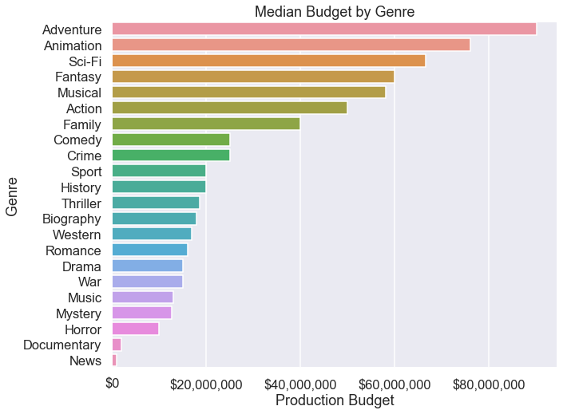

## Final Project Submission

Please fill out:
* Student name: Jeff Spagnola
* Student pace: Full Time 
* Scheduled project review date/time: Monday, August 3rd, 2020 - 2:00pm
* Instructor name: James Irving
* Blog post URL:


# Introduction

## Overview

Microsoft has recognized that other large tech corporations have found ample success in the film industry by producing their own original content.  The creation of the Microsoft Movie Studio will create an entirely new revenue stream for the company as well as provide many opportunities to synergize with existing Microsoft products.  However, with a high-dollar point of entry and Microsoft's sterling reputation on the line, this can also prove to be a risky venture.  How can we minimize this risk and maximize the return on investment by using a data-driven production system?

Over the course of this notebook, we will answer the following questions:
 - Is there a correlation between a film's budget and it's performance at the box office?
 - Do films in certain genres perform better at the box office?  If so, which genres?
 - Is there a correlation between a film's MPAA rating and it's ROI?
 - Does a film's runtime have any affect on it's worldwide gross?


## Additional Notes

### Special Thanks

This analysis could not be done without the combined efforts of the P2P Study Group.  The data contained in imdb_money_ratings was scraped with 'test_requests.py' (found in the notebook) which was written by Sam Stoltenberg with the combined computing strength of the group.   

### List of Functions


```python
# Gets info from the csv

def get_info (csv_name):
    print(csv_name.shape)
    print()
    print(csv_name.describe())
    print()
    print(csv_name.info())
    print()
    print(csv_name.isna().sum())

```

# Import and Clean Provided Datasets


```python
!pip install -U plotly
```

    Collecting plotly
    [?25l  Downloading https://files.pythonhosted.org/packages/bf/5f/47ab0d9d843c5be0f5c5bd891736a4c84fa45c3b0a0ddb6b6df7c098c66f/plotly-4.9.0-py2.py3-none-any.whl (12.9MB)
         |████████████████████████████████| 12.9MB 208kB/s eta 0:00:01
    [?25hRequirement already satisfied, skipping upgrade: six in /Users/spags/opt/anaconda3/envs/learn-env/lib/python3.6/site-packages (from plotly) (1.12.0)
    Requirement already satisfied, skipping upgrade: retrying>=1.3.3 in /Users/spags/opt/anaconda3/envs/learn-env/lib/python3.6/site-packages (from plotly) (1.3.3)
    Installing collected packages: plotly
      Found existing installation: plotly 4.1.1
        Uninstalling plotly-4.1.1:
          Successfully uninstalled plotly-4.1.1
    Successfully installed plotly-4.9.0


```python
import numpy as np
import pandas as pd
import matplotlib.pyplot as plt
%matplotlib inline
import seaborn as sns
import random
import requests
from bs4 import BeautifulSoup
import time
import plotly.express as px
import matplotlib.ticker as mtick
```


```python
# Changes floats from scientific notation to more readable numbers. 
pd.set_option('display.float_format', lambda x: '%.2f' % x)

# Set dark background for Seaborn
plt.style.use("dark_background")
```

### Clean IMDB Title Basics CSV - CLEANED
This CSV contains basic information pertaining to films listed on IMDB, including title, genre, year released, and runtime.  Most importantly, it contains the 'tconst' column which is a unique code used by IMDB to organize their films.  This will be useful later in joining the different data sets. 


```python
# Imported the CSV file

imdb_title_basics_df = pd.read_csv('zippedData/imdb.title.basics.csv.gz', compression = 'gzip')
imdb_title_basics_df.head()
```


<div>
<style scoped>
    .dataframe tbody tr th:only-of-type {
        vertical-align: middle;
    }

    .dataframe tbody tr th {
        vertical-align: top;
    }

    .dataframe thead th {
        text-align: right;
    }
</style>
<table border="1" class="dataframe">
  <thead>
    <tr style="text-align: right;">
      <th></th>
      <th>tconst</th>
      <th>primary_title</th>
      <th>original_title</th>
      <th>start_year</th>
      <th>runtime_minutes</th>
      <th>genres</th>
    </tr>
  </thead>
  <tbody>
    <tr>
      <th>0</th>
      <td>tt0063540</td>
      <td>Sunghursh</td>
      <td>Sunghursh</td>
      <td>2013</td>
      <td>175.0</td>
      <td>Action,Crime,Drama</td>
    </tr>
    <tr>
      <th>1</th>
      <td>tt0066787</td>
      <td>One Day Before the Rainy Season</td>
      <td>Ashad Ka Ek Din</td>
      <td>2019</td>
      <td>114.0</td>
      <td>Biography,Drama</td>
    </tr>
    <tr>
      <th>2</th>
      <td>tt0069049</td>
      <td>The Other Side of the Wind</td>
      <td>The Other Side of the Wind</td>
      <td>2018</td>
      <td>122.0</td>
      <td>Drama</td>
    </tr>
    <tr>
      <th>3</th>
      <td>tt0069204</td>
      <td>Sabse Bada Sukh</td>
      <td>Sabse Bada Sukh</td>
      <td>2018</td>
      <td>NaN</td>
      <td>Comedy,Drama</td>
    </tr>
    <tr>
      <th>4</th>
      <td>tt0100275</td>
      <td>The Wandering Soap Opera</td>
      <td>La Telenovela Errante</td>
      <td>2017</td>
      <td>80.0</td>
      <td>Comedy,Drama,Fantasy</td>
    </tr>
  </tbody>
</table>
</div>


```python
# Using a function to get basic data

get_info(imdb_title_basics_df)
```

    (146144, 6)
    
              start_year  runtime_minutes
    count  146144.000000    114405.000000
    mean     2014.621798        86.187247
    std         2.733583       166.360590
    min      2010.000000         1.000000
    25%      2012.000000        70.000000
    50%      2015.000000        87.000000
    75%      2017.000000        99.000000
    max      2115.000000     51420.000000
    
    <class 'pandas.core.frame.DataFrame'>
    RangeIndex: 146144 entries, 0 to 146143
    Data columns (total 6 columns):
     #   Column           Non-Null Count   Dtype  
    ---  ------           --------------   -----  
     0   tconst           146144 non-null  object 
     1   primary_title    146144 non-null  object 
     2   original_title   146123 non-null  object 
     3   start_year       146144 non-null  int64  
     4   runtime_minutes  114405 non-null  float64
     5   genres           140736 non-null  object 
    dtypes: float64(1), int64(1), object(4)
    memory usage: 6.7+ MB
    None
    
    tconst                 0
    primary_title          0
    original_title        21
    start_year             0
    runtime_minutes    31739
    genres              5408
    dtype: int64


```python
# Finding the median of runtime_minutes

imdb_title_basics_df['runtime_minutes'].median()
```


    87.0


```python
# Replacing the null values in runtime_minutes with the median. (side note...not sure why I couldn't pass in the 
# code to get the median as the argument.

imdb_title_basics_df['runtime_minutes'].fillna(87.0, inplace = True)
```


```python
#Finding the mode of 'genres'

imdb_title_basics_df['genres'].mode()
```


    0    Documentary
    dtype: object


```python
#Filling the null values with the mode.

imdb_title_basics_df['genres'].fillna('Documentary', inplace = True)
#imdb_title_basics_df.head()
```


```python
imdb_title_basics_df.dropna(axis = 0, inplace = True)
```


```python
#imdb_title_basics_df.head()
print(imdb_title_basics_df.shape)
```

    (146123, 6)


```python
# Getting the value counts for each column to search for weirdness.

imdb_title_basics_columns = imdb_title_basics_df.columns
for column in imdb_title_basics_columns:
    display(imdb_title_basics_df[column].value_counts())
```


    tt6771402     1
    tt5768380     1
    tt1422778     1
    tt2090626     1
    tt7241578     1
                 ..
    tt6140946     1
    tt1843148     1
    tt2093979     1
    tt2291284     1
    tt10340452    1
    Name: tconst, Length: 146123, dtype: int64


    Home                        24
    Broken                      20
    The Return                  20
    Alone                       16
    Homecoming                  16
                                ..
    Holland Road                 1
    Gijs                         1
    Anne Frank, Then and Now     1
    Without Powder               1
    Warning Label                1
    Name: primary_title, Length: 136056, dtype: int64


    Broken                                              19
    Home                                                18
    The Return                                          17
    Freedom                                             13
    Alone                                               13
                                                        ..
    Bowie: The Man Who Changed the World                 1
    Pinku no genba: Ikajima Yutaka 100-ponme no eiga     1
    Ace on Fire                                          1
    Yuriko no aroma                                      1
    Ice                                                  1
    Name: original_title, Length: 137773, dtype: int64


    2017    17494
    2016    17269
    2018    16846
    2015    16242
    2014    15589
    2013    14708
    2012    13786
    2011    12900
    2010    11849
    2019     8378
    2020      936
    2021       83
    2022       32
    2023        5
    2024        2
    2027        1
    2026        1
    2025        1
    2115        1
    Name: start_year, dtype: int64


    87.0       33653
    90.0        7131
    80.0        3526
    85.0        2915
    100.0       2662
               ...  
    396.0          1
    382.0          1
    14400.0        1
    724.0          1
    540.0          1
    Name: runtime_minutes, Length: 367, dtype: int64


    Documentary                 37574
    Drama                       21486
    Comedy                       9177
    Horror                       4372
    Comedy,Drama                 3519
                                ...  
    Short,Thriller                  1
    History,Musical,Romance         1
    Action,Sport,Thriller           1
    Comedy,Music,Mystery            1
    Action,Animation,Mystery        1
    Name: genres, Length: 1085, dtype: int64


### Clean IMDB Title Ratings CSV - CLEANED
This CSV contains the user rating and vote numbers for each film listed.  Like earlier, this csv includes the 'tconst' column which will be used in a later merge.  


```python
# Import the CSV

imdb_title_ratings_df = pd.read_csv('zippedData/imdb.title.ratings.csv.gz', compression = 'gzip')
imdb_title_ratings_df.head()
```


<div>
<style scoped>
    .dataframe tbody tr th:only-of-type {
        vertical-align: middle;
    }

    .dataframe tbody tr th {
        vertical-align: top;
    }

    .dataframe thead th {
        text-align: right;
    }
</style>
<table border="1" class="dataframe">
  <thead>
    <tr style="text-align: right;">
      <th></th>
      <th>tconst</th>
      <th>averagerating</th>
      <th>numvotes</th>
    </tr>
  </thead>
  <tbody>
    <tr>
      <th>0</th>
      <td>tt10356526</td>
      <td>8.3</td>
      <td>31</td>
    </tr>
    <tr>
      <th>1</th>
      <td>tt10384606</td>
      <td>8.9</td>
      <td>559</td>
    </tr>
    <tr>
      <th>2</th>
      <td>tt1042974</td>
      <td>6.4</td>
      <td>20</td>
    </tr>
    <tr>
      <th>3</th>
      <td>tt1043726</td>
      <td>4.2</td>
      <td>50352</td>
    </tr>
    <tr>
      <th>4</th>
      <td>tt1060240</td>
      <td>6.5</td>
      <td>21</td>
    </tr>
  </tbody>
</table>
</div>


```python
# Using a function to get basic informationa bout the dataframe.

get_info(imdb_title_ratings_df)
```

    (73856, 3)
    
           averagerating      numvotes
    count   73856.000000  7.385600e+04
    mean        6.332729  3.523662e+03
    std         1.474978  3.029402e+04
    min         1.000000  5.000000e+00
    25%         5.500000  1.400000e+01
    50%         6.500000  4.900000e+01
    75%         7.400000  2.820000e+02
    max        10.000000  1.841066e+06
    
    <class 'pandas.core.frame.DataFrame'>
    RangeIndex: 73856 entries, 0 to 73855
    Data columns (total 3 columns):
     #   Column         Non-Null Count  Dtype  
    ---  ------         --------------  -----  
     0   tconst         73856 non-null  object 
     1   averagerating  73856 non-null  float64
     2   numvotes       73856 non-null  int64  
    dtypes: float64(1), int64(1), object(1)
    memory usage: 1.7+ MB
    None
    
    tconst           0
    averagerating    0
    numvotes         0
    dtype: int64


```python
# Getting an idea for the value counts to search for any weirdness.

imdb_title_ratings_columns = imdb_title_ratings_df.columns
for column in imdb_title_ratings_columns:
    display(imdb_title_ratings_df[column].value_counts())
```


    tt1582478    1
    tt1381402    1
    tt3037588    1
    tt8092252    1
    tt1584937    1
                ..
    tt5503824    1
    tt1305798    1
    tt2104857    1
    tt2120832    1
    tt4241034    1
    Name: tconst, Length: 73856, dtype: int64


    7.0     2262
    6.6     2251
    7.2     2249
    6.8     2239
    6.5     2221
            ... 
    9.6       18
    10.0      16
    9.8       15
    9.7       12
    9.9        5
    Name: averagerating, Length: 91, dtype: int64


    6        2875
    5        2699
    7        2476
    8        2167
    9        1929
             ... 
    18286       1
    16289       1
    1958        1
    4007        1
    4098        1
    Name: numvotes, Length: 7349, dtype: int64


# Import Additional Data With Web Scraping 

## Box Office Results of Movie Franchises - FUTURE WORK

Address this in the future.  Link for scrape = https://www.the-numbers.com/movies/franchises#franchise_overview=od1


```python
franchise_page = requests.get('https://www.the-numbers.com/movies/franchises') 
soup = BeautifulSoup(franchise_page.content, 'html.parser') 
```


```python
soup.prettify
```


    <bound method Tag.prettify of <!DOCTYPE html>
    
    <html xmlns:fb="http://www.facebook.com/2008/fbml" xmlns:og="http://ogp.me/ns#">
    <head>
    <!-- Global site tag (gtag.js) - Google Analytics -->
    <script async="" src="https://www.googletagmanager.com/gtag/js?id=UA-1343128-1"></script>
    <script>
      window.dataLayer = window.dataLayer || [];
      function gtag(){dataLayer.push(arguments);}
      gtag('js', new Date());
    
      gtag('config', 'UA-1343128-1');
    </script>
    <meta content='(PICS-1.1 "https://www.icra.org/ratingsv02.html" l gen true for "https://www.the-numbers.com/" r (cb 1 lz 1 nz 1 oz 1 vz 1) "https://www.rsac.org/ratingsv01.html" l gen true for "https://www.the-numbers.com/" r (n 0 s 0 v 0 l 0))' http-equiv="PICS-Label"/>
    <!--<meta http-equiv="Content-Type" content="text/html; charset=ISO-8859-1" >-->
    <meta content="text/html; charset=utf-8" http-equiv="Content-Type"/>
    <meta content="telephone=no" name="format-detection"/> <!-- for apple mobile -->
    <meta content="521546213" property="fb:admins">
    <script crossorigin="anonymous" integrity="sha256-FgpCb/KJQlLNfOu91ta32o/NMZxltwRo8QtmkMRdAu8=" src="https://code.jquery.com/jquery-3.3.1.min.js"></script>
    <meta content="initial-scale=1" name="viewport"/>
    <meta content="Top-grossing and longest running movie franchises" name="description"/>
    <meta content="NOODP" name="robots"/>
    <meta content="movies, box office, The Numbers, Numbers, daily box office, weekly box office, movie stars, dvd sales, Blu-ray sales, release schedule" name="keywords"/>
    <meta content="Movie Franchises - Box Office History - The Numbers" property="og:title"/>
    <meta content="article" property="og:type"/>
    <meta content="https://www.the-numbers.com/movies/franchises" property="og:url"/>
    <meta content="Top-grossing and longest running movie franchises" property="og:description"/>
    <meta content="The Numbers" property="og:site_name"/>
    <meta content="https://www.the-numbers.com/images/the-numbers-833x200.jpg" property="og:image"/>
    <meta content="833" property="og:image:width"/>
    <meta content="200" property="og:image:height"/>
    <meta content="The-Numbers Image" property="og:image:alt"/>
    <meta content="summary_large_image" name="twitter:card"/>
    <meta content="@MovieNumbers" name="twitter:site"/>
    <meta content="Movie Franchises - Box Office History - The Numbers" name="twitter:title"/>
    <meta content="Top-grossing and longest running movie franchises" name="twitter:description"/>
    <meta content="https://www.the-numbers.com/movies/franchises" name="twitter:url"/>
    <meta content="https://www.the-numbers.com/images/the-numbers-833x200.jpg" name="twitter:image"/>
    <meta content="1585976611658631" property="fb:app_id"/>
    <title>Movie Franchises - Box Office History - The Numbers</title>
    <link href="/resources/the-numbers-desktop-combined.css" rel="stylesheet" type="text/css"/>
    <link href="https://m.the-numbers.com/movies/franchises" media="only screen and (max-width: 640px)" rel="alternate"/>
    <script type="text/javascript">
    	if (screen.width <= 640)
    	{
            window.location = "https://m.the-numbers.com/movies/franchises";
        }
    </script>
    <!-- Begin comScore Tag -->
    <script async="">
    var _comscore = _comscore || [];
    _comscore.push({ c1: "2", c2: "9873768" });
    (function() {
     var s = document.createElement("script"), el = document.getElementsByTagName("script")[0]; s.async = true;
     s.src = (document.location.protocol == "https:" ? "https://sb" : "http://b") + ".scorecardresearch.com/beacon.js";
     el.parentNode.insertBefore(s, el);
     })();
    </script>
    <noscript>
    
    </noscript>
    <!-- End comScore Tag -->
    <!-- Header Tag Code -->
    <script data-cfasync="false" type="text/javascript">
    /*<![CDATA[*/(function (a, c, s, u){'Insticator'in a || (a.Insticator={ad:{loadAd: function (b){Insticator.ad.q.push(b)}, q: []}, helper:{}, embed:{}, version: "3.0", q: [], load: function (t, o){Insticator.q.push({t: t, o: o})}}); var b=c.createElement(s); b.src=u; b.async=!0; var d=c.getElementsByTagName(s)[0]; d.parentNode.insertBefore(b, d)})(window, document, 'script', '//d2na2p72vtqyok.cloudfront.net/client-embed/65b21a35-f662-4947-80ea-07d6b99277bf.js');/*
    ]]>*/
    </script>
    <!-- End Header Tag Code -->
    <script async="" src="//pagead2.googlesyndication.com/pagead/js/adsbygoogle.js"></script>
    <script>
         (adsbygoogle = window.adsbygoogle || []).push({
              google_ad_client: "ca-pub-0505053220181058",
              enable_page_level_ads: true
         });
    </script>
    <link href="https://cdn.datatables.net/v/dt/dt-1.10.18/datatables.min.css" rel="stylesheet" type="text/css">
    <script src="https://cdn.datatables.net/v/dt/dt-1.10.18/datatables.min.js" type="text/javascript"></script>
    <script src="https://cdn.rawgit.com/jhyland87/DataTables-Keep-Conditions/118c5e107f1f603b1b91475dc139df6f53917e38/dist/dataTables.keepConditions.min.js" type="text/javascript"></script>
    </link></meta></head>
    <body>
    <script>
      window.fbAsyncInit = function() {
        FB.init({
          appId            : '1585976611658631',
          autoLogAppEvents : true,
          xfbml            : true,
          version          : 'v2.9'
        });
        FB.AppEvents.logPageView();
      };
    
      (function(d, s, id){
         var js, fjs = d.getElementsByTagName(s)[0];
         if (d.getElementById(id)) {return;}
         js = d.createElement(s); js.id = id;
         js.src = "//connect.facebook.net/en_US/sdk.js";
         fjs.parentNode.insertBefore(js, fjs);
       }(document, 'script', 'facebook-jssdk'));
    </script>
    <div id="wrap">
    <div id="header">
    <a href="/">®
    <br/>    Where Data and the Movie Business Meet
    </a>
    </div>
    <div id="header_right" style="background: #663366; width:200px; height: 96px;">
    <div style="float:right;">
    Follow us on
    <a href="https://www.facebook.com/TheNumbers" target="_blank"></a>
    <a href="https://www.twitter.com/MovieNumbers" target="_blank" title="Follow The Numbers on Twitter"></a>
    </div>
    </div>
    <div id="nav">
    <ul>
    <li><a href="/news">News</a>
    <ul>
    <li><a href="/news">Latest News</a></li>
    <li><a href="/rss-feed">RSS Feed</a></li>
    <li><a href="/movies/release-schedule">Release Schedule</a></li>
    <li><a href="/on-this-day">On This Day</a></li>
    <li><a href="/oscars">Oscars</a></li>
    </ul>
    </li>
    <li><a href="/box-office">Box Office</a>
    <ul>
    <li><a href="/daily-box-office-chart">Daily Chart</a></li>
    <li><a href="/weekend-box-office-chart">Weekend Chart</a></li>
    <li><a href="/weekly-box-office-chart">Weekly Chart</a></li>
    <li><a href="/market/">Theatrical Market</a></li>
    <li><a href="/international-charts-overview">International Charts</a></li>
    <li><a href="/box-office-records/">Records</a></li>
    <li><a href="/box-office">Chart Index</a></li>
    <li><a href="/movies/release-schedule">Release Schedule</a></li>
    <li><a href="/box-office-records/domestic/all-movies/cumulative/released-in-2020">2020 Domestic</a></li>
    <li><a href="/box-office-records/worldwide/all-movies/cumulative/released-in-2020">2020 Worldwide</a></li>
    </ul>
    </li>
    <li><a href="/weekly-dvd-sales-chart">Home Video</a>
    <ul>
    <li><a href="/weekly-dvd-sales-chart">Weekly DVD Chart</a></li>
    <li><a href="/weekly-bluray-sales-chart">Weekly Blu-ray Chart</a></li>
    <li><a href="/weekly-video-sales-chart">Weekly Combined DVD+Blu-ray Chart</a></li>
    <li><a href="/weekly-deg-watched-at-home-chart">DEG Watched at Home Top 20 Chart</a></li>
    <li><a href="/netflix-top-10">Netflix Daily Top 10</a></li>
    <li><a href="/home-market/dvd-sales/2020">2020 DVD Chart</a></li>
    <li><a href="/home-market/bluray-sales/2020">2020 Blu-ray Chart</a></li>
    <li><a href="/home-market/packaged-media-sales/2020">2020 Combined Chart</a></li>
    <li><a href="/alltime-bluray-sales-chart">All-Time Blu-ray</a></li>
    <li><a href="/home-market/release-schedule">Release Schedule</a></li>
    <li><a href="/home-market/distributors">Distributors</a></li>
    </ul>
    </li>
    <li><a href="/movies">Movies</a>
    <ul>
    <li><a href="/movie/budgets">Budgets and Finances</a></li>
    <li><a href="/movies/franchises">Franchises</a></li>
    <li><a href="/movies/keywords">Keywords</a></li>
    <li><a href="/movies">Movie Index</a></li>
    <li><a href="/movies/release-schedule">Release Schedule</a></li>
    <li><a href="/movies/most-anticipated">Most Anticipated</a></li>
    <li><a href="/movies/trending">Trending Movies</a></li>
    <li><a href="/movies/production-companies/">Production Companies</a></li>
    <li><a href="/movies/production-countries/">Production Countries</a></li>
    <li><a href="/movies/languages">Languages</a></li>
    <li><a href="/movies/comparisons">Comparisons</a></li>
    <li><a href="/movies/report-builder">Report Builder</a></li>
    </ul>
    </li>
    <li><a href="/people-index">People</a>
    <ul>
    <li><a href="/bankability">Bankability</a></li>
    <li><a href="/box-office-star-records/">Records</a></li>
    <li><a href="/people-index">People Index</a></li>
    <li><a href="/people/trending">Trending People</a></li>
    <li><a href="/box-office-star-records/domestic/yearly-acting/highest-grossing-2020-stars">Highest Grossing Stars of 2020</a></li>
    </ul>
    </li>
    <li><a href="/research-tools">Research Tools</a>
    <ul>
    <li><a href="/movies/report-builder">Report Builder</a></li>
    <li><a href="/movies/keywords">Keyword Analysis</a></li>
    <li><a href="/movies/custom-comparisons">Movie Comparison</a></li>
    <li><a href="/custom-search">Search</a></li>
    </ul>
    </li>
    <li><a href="/our-services">Our Services</a>
    <ul>
    <li><a href="/research-services">Research Services</a></li>
    <li><a href="/data-services">Data Services</a></li>
    <li><a href="/bankability">Bankability</a></li>
    <li><a href="/about-us">About Us</a></li>
    <li><a href="/support-us">Support Us</a></li>
    <li><a href="/contact">Contact</a></li>
    </ul>
    </li>
    <li><a href="/users/my-numbers">My Numbers</a>
    <ul>
    <li><a href="/users/register">Register</a></li>
    <li><a href="/users/login">Login</a></li>
    <li><a href="/users/forgot-password">Forgot Password</a></li>
    </ul>
    </li>
    <li style="background: #ffcc00;"><a href="https://m.the-numbers.com/movies/franchises?from_desktop=Yes" rel="nofollow" style="background: #ffcc00;">Mobile Website</a></li>
    <li><a href="/users/register">Register</a></li>
    <li><a href="/users/login?backtopage=/movies/franchises">Login</a></li>
    </ul>
    </div></div></body></html>
    
    <div id="banneradnew">
    <center>
    <script type="text/javascript"><!--
    e9 = new Object();
    e9.size = "728x90,970x250";
    //--></script>
    <script src="//tags.expo9.exponential.com/tags/TheNumbers/ROS/tags.js" type="text/javascript"></script>
    </center>
    </div>
    <div id="main">
    <div id="page_filling_chart">
    <h1>Movie Franchises</h1>
    <script src="https://www.gstatic.com/charts/loader.js" type="text/javascript"></script>
    <script type="text/javascript">
          google.charts.load('current', {packages:['corechart']});
    	google.setOnLoadCallback(drawChart);
    
    function drawChart() {
    var data = new google.visualization.DataTable();
    data.addColumn('number', 'Year');
    data.addColumn('number', 'Marvel Cinematic Universe');
    data.addColumn('number', 'Star Wars');
    data.addColumn('number', 'James Bond');
    data.addColumn('number', 'Batman');
    data.addColumn('number', 'Harry Potter');
    data.addRows(61);
    data.setValue(0, 0, 1960);
    data.setValue(1, 0, 1961);
    data.setValue(2, 0, 1962);
    data.setValue(3, 0, 1963);
    data.setValue(4, 0, 1964);
    data.setValue(5, 0, 1965);
    data.setValue(6, 0, 1966);
    data.setValue(7, 0, 1967);
    data.setValue(8, 0, 1968);
    data.setValue(9, 0, 1969);
    data.setValue(10, 0, 1970);
    data.setValue(11, 0, 1971);
    data.setValue(12, 0, 1972);
    data.setValue(13, 0, 1973);
    data.setValue(14, 0, 1974);
    data.setValue(15, 0, 1975);
    data.setValue(16, 0, 1976);
    data.setValue(17, 0, 1977);
    data.setValue(18, 0, 1978);
    data.setValue(19, 0, 1979);
    data.setValue(20, 0, 1980);
    data.setValue(21, 0, 1981);
    data.setValue(22, 0, 1982);
    data.setValue(23, 0, 1983);
    data.setValue(24, 0, 1984);
    data.setValue(25, 0, 1985);
    data.setValue(26, 0, 1986);
    data.setValue(27, 0, 1987);
    data.setValue(28, 0, 1988);
    data.setValue(29, 0, 1989);
    data.setValue(30, 0, 1990);
    data.setValue(31, 0, 1991);
    data.setValue(32, 0, 1992);
    data.setValue(33, 0, 1993);
    data.setValue(34, 0, 1994);
    data.setValue(35, 0, 1995);
    data.setValue(36, 0, 1996);
    data.setValue(37, 0, 1997);
    data.setValue(38, 0, 1998);
    data.setValue(39, 0, 1999);
    data.setValue(40, 0, 2000);
    data.setValue(41, 0, 2001);
    data.setValue(42, 0, 2002);
    data.setValue(43, 0, 2003);
    data.setValue(44, 0, 2004);
    data.setValue(45, 0, 2005);
    data.setValue(46, 0, 2006);
    data.setValue(47, 0, 2007);
    data.setValue(48, 0, 2008);
    data.setValue(49, 0, 2009);
    data.setValue(50, 0, 2010);
    data.setValue(51, 0, 2011);
    data.setValue(52, 0, 2012);
    data.setValue(53, 0, 2013);
    data.setValue(54, 0, 2014);
    data.setValue(55, 0, 2015);
    data.setValue(56, 0, 2016);
    data.setValue(57, 0, 2017);
    data.setValue(58, 0, 2018);
    data.setValue(59, 0, 2019);
    data.setValue(60, 0, 2020);
    data.setValue(0, 1, 0);
    data.setValue(1, 1, 0);
    data.setValue(2, 1, 0);
    data.setValue(3, 1, 0);
    data.setValue(4, 1, 0);
    data.setValue(5, 1, 0);
    data.setValue(6, 1, 0);
    data.setValue(7, 1, 0);
    data.setValue(8, 1, 0);
    data.setValue(9, 1, 0);
    data.setValue(10, 1, 0);
    data.setValue(11, 1, 0);
    data.setValue(12, 1, 0);
    data.setValue(13, 1, 0);
    data.setValue(14, 1, 0);
    data.setValue(15, 1, 0);
    data.setValue(16, 1, 0);
    data.setValue(17, 1, 0);
    data.setValue(18, 1, 0);
    data.setValue(19, 1, 0);
    data.setValue(20, 1, 0);
    data.setValue(21, 1, 0);
    data.setValue(22, 1, 0);
    data.setValue(23, 1, 0);
    data.setValue(24, 1, 0);
    data.setValue(25, 1, 0);
    data.setValue(26, 1, 0);
    data.setValue(27, 1, 0);
    data.setValue(28, 1, 0);
    data.setValue(29, 1, 0);
    data.setValue(30, 1, 0);
    data.setValue(31, 1, 0);
    data.setValue(32, 1, 0);
    data.setValue(33, 1, 0);
    data.setValue(34, 1, 0);
    data.setValue(35, 1, 0);
    data.setValue(36, 1, 0);
    data.setValue(37, 1, 0);
    data.setValue(38, 1, 0);
    data.setValue(39, 1, 0);
    data.setValue(40, 1, 0);
    data.setValue(41, 1, 0);
    data.setValue(42, 1, 0);
    data.setValue(43, 1, 0);
    data.setValue(44, 1, 0);
    data.setValue(45, 1, 0);
    data.setValue(46, 1, 0);
    data.setValue(47, 1, 0);
    data.setValue(48, 1, 575045292);
    data.setValue(49, 1, 575045292);
    data.setValue(50, 1, 936010694);
    data.setValue(51, 1, 1346920096);
    data.setValue(52, 1, 2060335993);
    data.setValue(53, 1, 2746601895);
    data.setValue(54, 1, 3410857089);
    data.setValue(55, 1, 4101752647);
    data.setValue(56, 1, 4773883318);
    data.setValue(57, 1, 5827853955);
    data.setValue(58, 1, 7427210882);
    data.setValue(59, 1, 9102945806);
    data.setValue(60, 1, 9102945806);
    data.setValue(0, 2, 0);
    data.setValue(1, 2, 0);
    data.setValue(2, 2, 0);
    data.setValue(3, 2, 0);
    data.setValue(4, 2, 0);
    data.setValue(5, 2, 0);
    data.setValue(6, 2, 0);
    data.setValue(7, 2, 0);
    data.setValue(8, 2, 0);
    data.setValue(9, 2, 0);
    data.setValue(10, 2, 0);
    data.setValue(11, 2, 0);
    data.setValue(12, 2, 0);
    data.setValue(13, 2, 0);
    data.setValue(14, 2, 0);
    data.setValue(15, 2, 0);
    data.setValue(16, 2, 0);
    data.setValue(17, 2, 799590221);
    data.setValue(18, 2, 916531301);
    data.setValue(19, 2, 954080671);
    data.setValue(20, 2, 1568256738);
    data.setValue(21, 2, 1632606571);
    data.setValue(22, 2, 1968963386);
    data.setValue(23, 2, 2690051070);
    data.setValue(24, 2, 2698724491);
    data.setValue(25, 2, 2720816942);
    data.setValue(26, 2, 2720816942);
    data.setValue(27, 2, 2720816942);
    data.setValue(28, 2, 2720816942);
    data.setValue(29, 2, 2720816942);
    data.setValue(30, 2, 2720816942);
    data.setValue(31, 2, 2720816942);
    data.setValue(32, 2, 2720816942);
    data.setValue(33, 2, 2720816942);
    data.setValue(34, 2, 2720816942);
    data.setValue(35, 2, 2720816942);
    data.setValue(36, 2, 2720816942);
    data.setValue(37, 2, 3224311045);
    data.setValue(38, 2, 3224311045);
    data.setValue(39, 2, 3996228147);
    data.setValue(40, 2, 3997318204);
    data.setValue(41, 2, 3997318204);
    data.setValue(42, 2, 4484455048);
    data.setValue(43, 2, 4484455048);
    data.setValue(44, 2, 4484455048);
    data.setValue(45, 2, 5024901990);
    data.setValue(46, 2, 5024901990);
    data.setValue(47, 2, 5024901990);
    data.setValue(48, 2, 5069515045);
    data.setValue(49, 2, 5069515045);
    data.setValue(50, 2, 5069515045);
    data.setValue(51, 2, 5069515045);
    data.setValue(52, 2, 5119249669);
    data.setValue(53, 2, 5119249669);
    data.setValue(54, 2, 5119249669);
    data.setValue(55, 2, 5921328368);
    data.setValue(56, 2, 6573710718);
    data.setValue(57, 2, 7207864195);
    data.setValue(58, 2, 7524594721);
    data.setValue(59, 2, 7915300957);
    data.setValue(60, 2, 8039797265);
    data.setValue(0, 3, 0);
    data.setValue(1, 3, 0);
    data.setValue(2, 3, 0);
    data.setValue(3, 3, 172200809);
    data.setValue(4, 3, 915694346);
    data.setValue(5, 3, 1489353752);
    data.setValue(6, 3, 1489353752);
    data.setValue(7, 3, 1989224890);
    data.setValue(8, 3, 1989224890);
    data.setValue(9, 3, 2135498129);
    data.setValue(10, 3, 2135498129);
    data.setValue(11, 3, 2377327215);
    data.setValue(12, 3, 2377327215);
    data.setValue(13, 3, 2559527215);
    data.setValue(14, 3, 2661832023);
    data.setValue(15, 3, 2661832023);
    data.setValue(16, 3, 2661832023);
    data.setValue(17, 3, 2853019466);
    data.setValue(18, 3, 2853019466);
    data.setValue(19, 3, 3108172054);
    data.setValue(20, 3, 3108172054);
    data.setValue(21, 3, 3287750469);
    data.setValue(22, 3, 3287750469);
    data.setValue(23, 3, 3638698370);
    data.setValue(24, 3, 3644260298);
    data.setValue(25, 3, 3773411766);
    data.setValue(26, 3, 3773411766);
    data.setValue(27, 3, 3892668881);
    data.setValue(28, 3, 3892668881);
    data.setValue(29, 3, 3971820879);
    data.setValue(30, 3, 3971820879);
    data.setValue(31, 3, 3971820879);
    data.setValue(32, 3, 3971820879);
    data.setValue(33, 3, 3971820879);
    data.setValue(34, 3, 3971820879);
    data.setValue(35, 3, 4167973090);
    data.setValue(36, 3, 4194288610);
    data.setValue(37, 3, 4377745262);
    data.setValue(38, 3, 4441595138);
    data.setValue(39, 3, 4652984835);
    data.setValue(40, 3, 4668286984);
    data.setValue(41, 3, 4668286984);
    data.setValue(42, 3, 4909397519);
    data.setValue(43, 3, 4920231787);
    data.setValue(44, 3, 4920231787);
    data.setValue(45, 3, 4920231787);
    data.setValue(46, 3, 5133971636);
    data.setValue(47, 3, 5152096500);
    data.setValue(48, 3, 5363758604);
    data.setValue(49, 3, 5366853590);
    data.setValue(50, 3, 5366853590);
    data.setValue(51, 3, 5366853590);
    data.setValue(52, 3, 5706537978);
    data.setValue(53, 3, 5715004684);
    data.setValue(54, 3, 5715004684);
    data.setValue(55, 3, 5928006414);
    data.setValue(56, 3, 5931136027);
    data.setValue(57, 3, 5931136027);
    data.setValue(58, 3, 5931136027);
    data.setValue(59, 3, 5931136027);
    data.setValue(60, 3, 5931136027);
    data.setValue(0, 4, 0);
    data.setValue(1, 4, 0);
    data.setValue(2, 4, 0);
    data.setValue(3, 4, 0);
    data.setValue(4, 4, 0);
    data.setValue(5, 4, 0);
    data.setValue(6, 4, 0);
    data.setValue(7, 4, 0);
    data.setValue(8, 4, 0);
    data.setValue(9, 4, 0);
    data.setValue(10, 4, 0);
    data.setValue(11, 4, 0);
    data.setValue(12, 4, 0);
    data.setValue(13, 4, 0);
    data.setValue(14, 4, 0);
    data.setValue(15, 4, 0);
    data.setValue(16, 4, 0);
    data.setValue(17, 4, 0);
    data.setValue(18, 4, 0);
    data.setValue(19, 4, 0);
    data.setValue(20, 4, 0);
    data.setValue(21, 4, 0);
    data.setValue(22, 4, 0);
    data.setValue(23, 4, 0);
    data.setValue(24, 4, 0);
    data.setValue(25, 4, 0);
    data.setValue(26, 4, 0);
    data.setValue(27, 4, 0);
    data.setValue(28, 4, 0);
    data.setValue(29, 4, 573516561);
    data.setValue(30, 4, 573516561);
    data.setValue(31, 4, 573516561);
    data.setValue(32, 4, 930965813);
    data.setValue(33, 4, 940628134);
    data.setValue(34, 4, 942056764);
    data.setValue(35, 4, 1327464442);
    data.setValue(36, 4, 1327464442);
    data.setValue(37, 4, 1540478060);
    data.setValue(38, 4, 1540478060);
    data.setValue(39, 4, 1540478060);
    data.setValue(40, 4, 1540478060);
    data.setValue(41, 4, 1540478060);
    data.setValue(42, 4, 1540478060);
    data.setValue(43, 4, 1540478060);
    data.setValue(44, 4, 1599454496);
    data.setValue(45, 4, 1891292526);
    data.setValue(46, 4, 1891292526);
    data.setValue(47, 4, 1891292526);
    data.setValue(48, 4, 2565028516);
    data.setValue(49, 4, 2567875427);
    data.setValue(50, 4, 2567875427);
    data.setValue(51, 4, 2567875427);
    data.setValue(52, 4, 3080758233);
    data.setValue(53, 4, 3080758233);
    data.setValue(54, 4, 3080758233);
    data.setValue(55, 4, 3080758233);
    data.setValue(56, 4, 3432662465);
    data.setValue(57, 4, 3611155888);
    data.setValue(58, 4, 3612135852);
    data.setValue(59, 4, 3945908363);
    data.setValue(60, 4, 3947587163);
    data.setValue(0, 5, 0);
    data.setValue(1, 5, 0);
    data.setValue(2, 5, 0);
    data.setValue(3, 5, 0);
    data.setValue(4, 5, 0);
    data.setValue(5, 5, 0);
    data.setValue(6, 5, 0);
    data.setValue(7, 5, 0);
    data.setValue(8, 5, 0);
    data.setValue(9, 5, 0);
    data.setValue(10, 5, 0);
    data.setValue(11, 5, 0);
    data.setValue(12, 5, 0);
    data.setValue(13, 5, 0);
    data.setValue(14, 5, 0);
    data.setValue(15, 5, 0);
    data.setValue(16, 5, 0);
    data.setValue(17, 5, 0);
    data.setValue(18, 5, 0);
    data.setValue(19, 5, 0);
    data.setValue(20, 5, 0);
    data.setValue(21, 5, 0);
    data.setValue(22, 5, 0);
    data.setValue(23, 5, 0);
    data.setValue(24, 5, 0);
    data.setValue(25, 5, 0);
    data.setValue(26, 5, 0);
    data.setValue(27, 5, 0);
    data.setValue(28, 5, 0);
    data.setValue(29, 5, 0);
    data.setValue(30, 5, 0);
    data.setValue(31, 5, 0);
    data.setValue(32, 5, 0);
    data.setValue(33, 5, 0);
    data.setValue(34, 5, 0);
    data.setValue(35, 5, 0);
    data.setValue(36, 5, 0);
    data.setValue(37, 5, 0);
    data.setValue(38, 5, 0);
    data.setValue(39, 5, 0);
    data.setValue(40, 5, 0);
    data.setValue(41, 5, 483513141);
    data.setValue(42, 5, 905723307);
    data.setValue(43, 5, 920664809);
    data.setValue(44, 5, 1286735638);
    data.setValue(45, 5, 1677758766);
    data.setValue(46, 5, 1698455019);
    data.setValue(47, 5, 2085106640);
    data.setValue(48, 5, 2085106640);
    data.setValue(49, 5, 2451886409);
    data.setValue(50, 5, 2779261265);
    data.setValue(51, 5, 3231270413);
    data.setValue(52, 5, 3231270413);
    data.setValue(53, 5, 3231270413);
    data.setValue(54, 5, 3231270413);
    data.setValue(55, 5, 3231270413);
    data.setValue(56, 5, 3467608875);
    data.setValue(57, 5, 3479148211);
    data.setValue(58, 5, 3638724729);
    data.setValue(59, 5, 3640245838);
    data.setValue(60, 5, 3640245838);
    
        var options = {
    	vAxis: {minValue: 0, format: '$#,###', textPosition: 'in', viewWindow: {min:0} },
        title: 'Cumulative Inflation Adjusted Domestic Box Office',
    	interpolateNulls: true,
        legend: { position: 'right' }, 
    			width:680,
    			height:360,
    			
    	chartArea: {left:0, width: '80%', height: '100%'},
    	titlePosition: 'in', axisTitlesPosition: 'in',
    	hAxis: {textPosition: 'in', format: ''}};
    
            var chart = new google.visualization.LineChart(document.getElementById('franchise_chart_div'));
    
    		var formatter = new google.visualization.NumberFormat( {prefix: '$', fractionDigits: 0});
    		formatter.format(data, 1);
    formatter.format(data, 2);
    formatter.format(data, 3);
    formatter.format(data, 4);
    formatter.format(data, 5);
    
    		var formatter2 = new google.visualization.NumberFormat( {prefix: 'Year: ', fractionDigits: 0, groupingSymbol: ''});
    		formatter2.format(data, 0);
    		
            chart.draw(data, options);
    	
    }
    </script>
    <div id="franchise_chart_div" style="width: 760px; height: 360px; align: center;"></div>
    <br/>
    <table class="display compact" id="franchise_overview">
    <thead><tr><th>Franchise</th><th>No. of Movies</th><th>Domestic Box Office</th><th>Infl. Adj. Dom. Box Office</th><th>Worldwide Box Office</th><th>First Year</th><th>Last Year</th><th>No. of Years</th></tr></thead>
    <tbody>
    <tr>
    <td><b><a href="/movies/franchise/Marvel-Cinematic-Universe">Marvel Cinematic Universe</a></b></td></tr></tbody></table></div></div>
    <td align="right">31</td>
    <td align="right">$8,545,426,433</td>
    <td align="right">$9,102,945,801</td>
    <td align="right">$22,574,869,342</td>
    <td align="right">2008</td>
    <td align="right">2022</td>
    <td align="right" data-sort="14">14</td>
    
    <tr>
    <td><b><a href="/movies/franchise/Star-Wars">Star Wars</a></b></td></tr>
    <td align="right">15</td>
    <td align="right">$5,079,119,579</td>
    <td align="right">$8,039,797,255</td>
    <td align="right">$10,320,603,993</td>
    <td align="right">1977</td>
    <td align="right">2027</td>
    <td align="right" data-sort="50">50</td>
    
    <tr>
    <td><b><a href="/movies/franchise/James-Bond">James Bond</a></b></td></tr>
    <td align="right">27</td>
    <td align="right">$2,136,666,623</td>
    <td align="right">$5,931,136,027</td>
    <td align="right">$7,119,553,846</td>
    <td align="right">1963</td>
    <td align="right">2020</td>
    <td align="right" data-sort="57">57</td>
    
    <tr>
    <td><b><a href="/movies/franchise/Batman">Batman</a></b></td></tr>
    <td align="right">22</td>
    <td align="right">$2,783,757,158</td>
    <td align="right">$3,947,211,566</td>
    <td align="right">$6,042,598,186</td>
    <td align="right">1989</td>
    <td align="right">2021</td>
    <td align="right" data-sort="32">32</td>
    
    <tr>
    <td><b><a href="/movies/franchise/Harry-Potter">Harry Potter</a></b></td></tr>
    <td align="right">12</td>
    <td align="right">$2,786,938,291</td>
    <td align="right">$3,638,704,111</td>
    <td align="right">$9,257,276,258</td>
    <td align="right">2001</td>
    <td align="right">2021</td>
    <td align="right" data-sort="20">20</td>
    
    <tr>
    <td><b><a href="/movies/franchise/Spider-Man">Spider-Man</a></b></td></tr>
    <td align="right">11</td>
    <td align="right">$2,711,115,724</td>
    <td align="right">$3,292,639,145</td>
    <td align="right">$7,220,254,380</td>
    <td align="right">2002</td>
    <td align="right">2020</td>
    <td align="right" data-sort="18">18</td>
    
    <tr>
    <td><b><a href="/movies/franchise/X-Men">X-Men</a></b></td></tr>
    <td align="right">14</td>
    <td align="right">$2,434,609,696</td>
    <td align="right">$2,878,961,702</td>
    <td align="right">$6,031,864,658</td>
    <td align="right">2000</td>
    <td align="right">2020</td>
    <td align="right" data-sort="20">20</td>
    
    <tr>
    <td><b><a href="/movies/franchise/Avengers">Avengers</a></b></td></tr>
    <td align="right">4</td>
    <td align="right">$2,619,552,260</td>
    <td align="right">$2,746,635,625</td>
    <td align="right">$7,757,359,731</td>
    <td align="right">2012</td>
    <td align="right">2019</td>
    <td align="right" data-sort="7">7</td>
    
    <tr>
    <td><b><a href="/movies/franchise/Jurassic-Park">Jurassic Park</a></b></td></tr>
    <td align="right">6</td>
    <td align="right">$1,882,766,527</td>
    <td align="right">$2,705,746,069</td>
    <td align="right">$5,009,038,251</td>
    <td align="right">1993</td>
    <td align="right">2021</td>
    <td align="right" data-sort="28">28</td>
    
    <tr>
    <td><b><a href="/movies/franchise/Star-Trek">Star Trek</a></b></td></tr>
    <td align="right">13</td>
    <td align="right">$1,400,952,879</td>
    <td align="right">$2,594,747,188</td>
    <td align="right">$2,267,036,257</td>
    <td align="right">1979</td>
    <td align="right">2016</td>
    <td align="right" data-sort="37">37</td>
    
    <tr>
    <td><b><a href="/movies/franchise/Peter-Jacksons-Lord-of-the-Rings">Peter Jackson's Lord of the Rings</a></b></td></tr>
    <td align="right">7</td>
    <td align="right">$1,852,304,517</td>
    <td align="right">$2,520,333,945</td>
    <td align="right">$5,857,898,221</td>
    <td align="right">2001</td>
    <td align="right">2018</td>
    <td align="right" data-sort="17">17</td>
    
    <tr>
    <td><b><a href="/movies/franchise/DC-Extended-Universe">DC Extended Universe</a></b></td></tr>
    <td align="right">26</td>
    <td align="right">$2,147,685,393</td>
    <td align="right">$2,227,584,552</td>
    <td align="right">$5,473,666,734</td>
    <td align="right">2013</td>
    <td align="right">2022</td>
    <td align="right" data-sort="9">9</td>
    
    <tr>
    <td><b><a href="/movies/franchise/Indiana-Jones">Indiana Jones</a></b></td></tr>
    <td align="right">5</td>
    <td align="right">$919,839,275</td>
    <td align="right">$2,063,482,532</td>
    <td align="right">$1,961,339,569</td>
    <td align="right">1981</td>
    <td align="right">2022</td>
    <td align="right" data-sort="41">41</td>
    
    <tr>
    <td><b><a href="/movies/franchise/Superman">Superman</a></b></td></tr>
    <td align="right">10</td>
    <td align="right">$1,152,698,852</td>
    <td align="right">$2,050,758,403</td>
    <td align="right">$2,553,272,239</td>
    <td align="right">1978</td>
    <td align="right">2020</td>
    <td align="right" data-sort="42">42</td>
    
    <tr>
    <td><b><a href="/movies/franchise/Fast-and-the-Furious">Fast and the Furious</a></b></td></tr>
    <td align="right">11</td>
    <td align="right">$1,690,752,038</td>
    <td align="right">$1,993,550,748</td>
    <td align="right">$5,901,253,359</td>
    <td align="right">2001</td>
    <td align="right">2021</td>
    <td align="right" data-sort="20">20</td>
    
    <tr>
    <td><b><a href="/movies/franchise/Shrek">Shrek</a></b></td></tr>
    <td align="right">8</td>
    <td align="right">$1,419,598,493</td>
    <td align="right">$1,952,505,259</td>
    <td align="right">$3,545,629,858</td>
    <td align="right">2001</td>
    <td align="right">2022</td>
    <td align="right" data-sort="21">21</td>
    
    <tr>
    <td><b><a href="/movies/franchise/Rocky">Rocky</a></b></td></tr>
    <td align="right">8</td>
    <td align="right">$792,039,875</td>
    <td align="right">$1,942,429,850</td>
    <td align="right">$1,513,939,512</td>
    <td align="right">1976</td>
    <td align="right">2018</td>
    <td align="right" data-sort="42">42</td>
    
    <tr>
    <td><b><a href="/movies/franchise/Pirates-of-the-Caribbean">Pirates of the Caribbean</a></b></td></tr>
    <td align="right">5</td>
    <td align="right">$1,451,769,807</td>
    <td align="right">$1,912,071,782</td>
    <td align="right">$4,517,852,068</td>
    <td align="right">2003</td>
    <td align="right">2017</td>
    <td align="right" data-sort="14">14</td>
    
    <tr>
    <td><b><a href="/movies/franchise/Transformers">Transformers</a></b></td></tr>
    <td align="right">7</td>
    <td align="right">$1,582,401,601</td>
    <td align="right">$1,863,419,555</td>
    <td align="right">$4,846,579,018</td>
    <td align="right">1986</td>
    <td align="right">2018</td>
    <td align="right" data-sort="32">32</td>
    
    <tr>
    <td><b><a href="/movies/franchise/Toy-Story">Toy Story</a></b></td></tr>
    <td align="right">5</td>
    <td align="right">$1,317,393,746</td>
    <td align="right">$1,787,870,306</td>
    <td align="right">$3,054,044,631</td>
    <td align="right">1995</td>
    <td align="right">2019</td>
    <td align="right" data-sort="24">24</td>
    
    <tr>
    <td><b><a href="/movies/franchise/Jaws">Jaws</a></b></td></tr>
    <td align="right">4</td>
    <td align="right">$420,895,891</td>
    <td align="right">$1,714,929,704</td>
    <td align="right">$737,573,891</td>
    <td align="right">1974</td>
    <td align="right">1987</td>
    <td align="right" data-sort="13">13</td>
    
    <tr>
    <td><b><a href="/movies/franchise/Hunger-Games">Hunger Games</a></b></td></tr>
    <td align="right">5</td>
    <td align="right">$1,451,538,526</td>
    <td align="right">$1,622,424,771</td>
    <td align="right">$2,958,353,344</td>
    <td align="right">2012</td>
    <td align="right">2015</td>
    <td align="right" data-sort="3">3</td>
    
    <tr>
    <td><b><a href="/movies/franchise/Twilight">Twilight</a></b></td></tr>
    <td align="right">6</td>
    <td align="right">$1,365,922,346</td>
    <td align="right">$1,610,862,622</td>
    <td align="right">$3,317,470,739</td>
    <td align="right">2008</td>
    <td align="right">2012</td>
    <td align="right" data-sort="4">4</td>
    
    <tr>
    <td><b><a href="/movies/franchise/Mission-Impossible">Mission: Impossible</a></b></td></tr>
    <td align="right">8</td>
    <td align="right">$1,154,492,507</td>
    <td align="right">$1,593,972,703</td>
    <td align="right">$3,577,423,206</td>
    <td align="right">1996</td>
    <td align="right">2022</td>
    <td align="right" data-sort="26">26</td>
    
    <tr>
    <td><b><a href="/movies/franchise/Dark-Knight-Trilogy">Dark Knight Trilogy</a></b></td></tr>
    <td align="right">3</td>
    <td align="right">$1,187,203,820</td>
    <td align="right">$1,481,303,737</td>
    <td align="right">$2,441,619,599</td>
    <td align="right">2005</td>
    <td align="right">2012</td>
    <td align="right" data-sort="7">7</td>
    
    <tr>
    <td><b><a href="/movies/franchise/Peter-Pan">Peter Pan</a></b></td></tr>
    <td align="right">6</td>
    <td align="right">$355,579,537</td>
    <td align="right">$1,467,907,310</td>
    <td align="right">$708,714,979</td>
    <td align="right">1953</td>
    <td align="right">2009</td>
    <td align="right" data-sort="56">56</td>
    
    <tr>
    <td><b><a href="/movies/franchise/Planet-of-the-Apes">Planet of the Apes</a></b></td></tr>
    <td align="right">9</td>
    <td align="right">$793,882,111</td>
    <td align="right">$1,374,716,792</td>
    <td align="right">$2,115,122,115</td>
    <td align="right">1968</td>
    <td align="right">2017</td>
    <td align="right" data-sort="49">49</td>
    
    <tr>
    <td><b><a href="/movies/franchise/Lion-King-The">The Lion King</a></b></td></tr>
    <td align="right">4</td>
    <td align="right">$965,423,326</td>
    <td align="right">$1,371,188,452</td>
    <td align="right">$2,643,028,600</td>
    <td align="right">1994</td>
    <td align="right">2019</td>
    <td align="right" data-sort="25">25</td>
    
    <tr>
    <td><b><a href="/movies/franchise/Despicable-Me">Despicable Me</a></b></td></tr>
    <td align="right">6</td>
    <td align="right">$1,220,249,440</td>
    <td align="right">$1,334,741,729</td>
    <td align="right">$3,712,982,597</td>
    <td align="right">2010</td>
    <td align="right">2021</td>
    <td align="right" data-sort="11">11</td>
    
    <tr>
    <td><b><a href="/movies/franchise/Lady-and-the-Tramp">Lady and the Tramp</a></b></td></tr>
    <td align="right">2</td>
    <td align="right">$93,600,000</td>
    <td align="right">$1,275,667,761</td>
    <td align="right">$93,600,000</td>
    <td align="right">1955</td>
    <td align="right">2001</td>
    <td align="right" data-sort="46">46</td>
    
    <tr>
    <td><b><a href="/movies/franchise/Exorcist">Exorcist</a></b></td></tr>
    <td align="right">5</td>
    <td align="right">$322,436,443</td>
    <td align="right">$1,274,216,475</td>
    <td align="right">$522,446,253</td>
    <td align="right">1973</td>
    <td align="right">2005</td>
    <td align="right" data-sort="32">32</td>
    
    <tr>
    <td><b><a href="/movies/franchise/Billy-Jack">Billy Jack</a></b></td></tr>
    <td align="right">3</td>
    <td align="right">$223,000,000</td>
    <td align="right">$1,247,956,316</td>
    <td align="right">$223,000,000</td>
    <td align="right">1967</td>
    <td align="right">1974</td>
    <td align="right" data-sort="7">7</td>
    
    <tr>
    <td><b><a href="/movies/franchise/Iron-Man">Iron Man</a></b></td></tr>
    <td align="right">3</td>
    <td align="right">$1,040,029,729</td>
    <td align="right">$1,223,260,072</td>
    <td align="right">$2,421,720,208</td>
    <td align="right">2008</td>
    <td align="right">2013</td>
    <td align="right" data-sort="5">5</td>
    
    <tr>
    <td><b><a href="/movies/franchise/Mary-Poppins">Mary Poppins</a></b></td></tr>
    <td align="right">2</td>
    <td align="right">$274,230,583</td>
    <td align="right">$1,173,785,575</td>
    <td align="right">$451,400,758</td>
    <td align="right">1964</td>
    <td align="right">2018</td>
    <td align="right" data-sort="54">54</td>
    
    <tr>
    <td><b><a href="/movies/franchise/King-Kong">King Kong</a></b></td></tr>
    <td align="right">6</td>
    <td align="right">$453,458,502</td>
    <td align="right">$1,111,360,749</td>
    <td align="right">$1,216,915,731</td>
    <td align="right">1933</td>
    <td align="right">2020</td>
    <td align="right" data-sort="87">87</td>
    
    <tr>
    <td><b><a href="/movies/franchise/Alien">Alien</a></b></td></tr>
    <td align="right">8</td>
    <td align="right">$591,630,347</td>
    <td align="right">$1,110,876,434</td>
    <td align="right">$1,648,542,927</td>
    <td align="right">1979</td>
    <td align="right">2017</td>
    <td align="right" data-sort="38">38</td>
    
    <tr>
    <td><b><a href="/movies/franchise/Men-in-Black">Men in Black</a></b></td></tr>
    <td align="right">5</td>
    <td align="right">$704,184,140</td>
    <td align="right">$1,087,370,156</td>
    <td align="right">$1,940,818,524</td>
    <td align="right">1997</td>
    <td align="right">2019</td>
    <td align="right" data-sort="22">22</td>
    
    <tr>
    <td><b><a href="/movies/franchise/Terminator">Terminator</a></b></td></tr>
    <td align="right">6</td>
    <td align="right">$669,177,934</td>
    <td align="right">$1,079,869,666</td>
    <td align="right">$2,074,485,040</td>
    <td align="right">1984</td>
    <td align="right">2019</td>
    <td align="right" data-sort="35">35</td>
    
    <tr>
    <td><b><a href="/movies/franchise/Finding-Nemo">Finding Nemo</a></b></td></tr>
    <td align="right">2</td>
    <td align="right">$866,824,931</td>
    <td align="right">$1,072,101,012</td>
    <td align="right">$1,961,544,638</td>
    <td align="right">2003</td>
    <td align="right">2016</td>
    <td align="right" data-sort="13">13</td>
    
    <tr>
    <td><b><a href="/movies/franchise/Beverly-Hills-Cop">Beverly Hills Cop</a></b></td></tr>
    <td align="right">4</td>
    <td align="right">$431,012,375</td>
    <td align="right">$1,070,632,480</td>
    <td align="right">$712,145,974</td>
    <td align="right">1984</td>
    <td align="right">2011</td>
    <td align="right" data-sort="27">27</td>
    
    <tr>
    <td><b><a href="/movies/franchise/Home-Alone">Home Alone</a></b></td></tr>
    <td align="right">5</td>
    <td align="right">$490,039,196</td>
    <td align="right">$1,059,275,216</td>
    <td align="right">$866,371,962</td>
    <td align="right">1990</td>
    <td align="right">2013</td>
    <td align="right" data-sort="23">23</td>
    
    <tr>
    <td><b><a href="/movies/franchise/Lethal-Weapon">Lethal Weapon</a></b></td></tr>
    <td align="right">4</td>
    <td align="right">$487,622,466</td>
    <td align="right">$1,059,196,096</td>
    <td align="right">$952,592,350</td>
    <td align="right">1987</td>
    <td align="right">1998</td>
    <td align="right" data-sort="11">11</td>
    
    <tr>
    <td><b><a href="/movies/franchise/Bourne">Bourne</a></b></td></tr>
    <td align="right">5</td>
    <td align="right">$800,424,270</td>
    <td align="right">$1,050,357,628</td>
    <td align="right">$1,665,926,127</td>
    <td align="right">2002</td>
    <td align="right">2016</td>
    <td align="right" data-sort="14">14</td>
    
    <tr>
    <td><b><a href="/movies/franchise/Ice-Age">Ice Age</a></b></td></tr>
    <td align="right">5</td>
    <td align="right">$793,676,582</td>
    <td align="right">$1,039,113,501</td>
    <td align="right">$3,179,639,301</td>
    <td align="right">2002</td>
    <td align="right">2016</td>
    <td align="right" data-sort="14">14</td>
    
    <tr>
    <td><b><a href="/movies/franchise/Ghostbusters">Ghostbusters</a></b></td></tr>
    <td align="right">4</td>
    <td align="right">$483,057,779</td>
    <td align="right">$1,014,646,830</td>
    <td align="right">$739,721,125</td>
    <td align="right">1984</td>
    <td align="right">2021</td>
    <td align="right" data-sort="37">37</td>
    
    <tr>
    <td><b><a href="/movies/franchise/Cinderella">Cinderella</a></b></td></tr>
    <td align="right">2</td>
    <td align="right">$85,000,000</td>
    <td align="right">$994,868,983</td>
    <td align="right">$263,591,415</td>
    <td align="right">1950</td>
    <td align="right">2007</td>
    <td align="right" data-sort="57">57</td>
    
    <tr>
    <td><b><a href="/movies/franchise/Incredibles-The">The Incredibles</a></b></td></tr>
    <td align="right">2</td>
    <td align="right">$870,022,836</td>
    <td align="right">$991,665,033</td>
    <td align="right">$1,874,246,451</td>
    <td align="right">2004</td>
    <td align="right">2018</td>
    <td align="right" data-sort="14">14</td>
    
    <tr>
    <td><b><a href="/movies/franchise/Airport">Airport</a></b></td></tr>
    <td align="right">4</td>
    <td align="right">$190,774,302</td>
    <td align="right">$990,713,247</td>
    <td align="right">$190,774,302</td>
    <td align="right">1970</td>
    <td align="right">1979</td>
    <td align="right" data-sort="9">9</td>
    
    <tr>
    <td><b><a href="/movies/franchise/Back-to-the-Future">Back to the Future</a></b></td></tr>
    <td align="right">3</td>
    <td align="right">$418,765,047</td>
    <td align="right">$984,628,869</td>
    <td align="right">$961,584,653</td>
    <td align="right">1985</td>
    <td align="right">1990</td>
    <td align="right" data-sort="5">5</td>
    
    <tr>
    <td><b><a href="/movies/franchise/Jumanji">Jumanji</a></b></td></tr>
    <td align="right">4</td>
    <td align="right">$849,844,012</td>
    <td align="right">$972,808,539</td>
    <td align="right">$2,082,379,717</td>
    <td align="right">1995</td>
    <td align="right">2019</td>
    <td align="right" data-sort="24">24</td>
    
    <tr>
    <td><b><a href="/movies/franchise/Jack-Ryan">Jack Ryan</a></b></td></tr>
    <td align="right">5</td>
    <td align="right">$495,058,617</td>
    <td align="right">$957,998,127</td>
    <td align="right">$910,977,412</td>
    <td align="right">1990</td>
    <td align="right">2014</td>
    <td align="right" data-sort="24">24</td>
    
    <tr>
    <td><b><a href="/movies/franchise/Matrix">Matrix</a></b></td></tr>
    <td align="right">3</td>
    <td align="right">$594,220,988</td>
    <td align="right">$943,073,177</td>
    <td align="right">$1,631,299,148</td>
    <td align="right">1999</td>
    <td align="right">2003</td>
    <td align="right" data-sort="4">4</td>
    
    <tr>
    <td><b><a href="/movies/franchise/Teenage-Mutant-Ninja-Turtles">Teenage Mutant Ninja Turtles</a></b></td></tr>
    <td align="right">7</td>
    <td align="right">$583,601,790</td>
    <td align="right">$926,554,360</td>
    <td align="right">$1,149,359,568</td>
    <td align="right">1990</td>
    <td align="right">2019</td>
    <td align="right" data-sort="29">29</td>
    
    <tr>
    <td><b><a href="/movies/franchise/Frozen">Frozen</a></b></td></tr>
    <td align="right">3</td>
    <td align="right">$878,111,587</td>
    <td align="right">$925,846,206</td>
    <td align="right">$2,715,778,547</td>
    <td align="right">2013</td>
    <td align="right">2019</td>
    <td align="right" data-sort="6">6</td>
    
    <tr>
    <td><b><a href="/movies/franchise/Jungle-Book">Jungle Book</a></b></td></tr>
    <td align="right">2</td>
    <td align="right">$189,744,582</td>
    <td align="right">$925,674,588</td>
    <td align="right">$281,767,202</td>
    <td align="right">1967</td>
    <td align="right">2003</td>
    <td align="right" data-sort="36">36</td>
    
    <tr>
    <td><b><a href="/movies/franchise/Captain-America">Captain America</a></b></td></tr>
    <td align="right">3</td>
    <td align="right">$844,485,812</td>
    <td align="right">$922,359,159</td>
    <td align="right">$2,238,256,014</td>
    <td align="right">2011</td>
    <td align="right">2016</td>
    <td align="right" data-sort="5">5</td>
    
    <tr>
    <td><b><a href="/movies/franchise/Hobbit-The">The Hobbit</a></b></td></tr>
    <td align="right">3</td>
    <td align="right">$816,364,878</td>
    <td align="right">$918,336,838</td>
    <td align="right">$2,922,819,276</td>
    <td align="right">2012</td>
    <td align="right">2014</td>
    <td align="right" data-sort="2">2</td>
    
    <tr>
    <td><b><a href="/movies/franchise/Avatar">Avatar</a></b></td></tr>
    <td align="right">5</td>
    <td align="right">$760,507,625</td>
    <td align="right">$899,243,135</td>
    <td align="right">$2,788,701,337</td>
    <td align="right">2009</td>
    <td align="right">2028</td>
    <td align="right" data-sort="19">19</td>
    
    <tr>
    <td><b><a href="/movies/franchise/Pink-Panther">Pink Panther</a></b></td></tr>
    <td align="right">11</td>
    <td align="right">$267,433,670</td>
    <td align="right">$898,966,099</td>
    <td align="right">$378,233,670</td>
    <td align="right">1964</td>
    <td align="right">2009</td>
    <td align="right" data-sort="45">45</td>
    
    <tr>
    <td><b><a href="/movies/franchise/Die-Hard">Die Hard</a></b></td></tr>
    <td align="right">5</td>
    <td align="right">$500,565,220</td>
    <td align="right">$897,077,962</td>
    <td align="right">$1,431,562,382</td>
    <td align="right">1988</td>
    <td align="right">2013</td>
    <td align="right" data-sort="25">25</td>
    
    <tr>
    <td><b><a href="/movies/franchise/Mummy">Mummy</a></b></td></tr>
    <td align="right">4</td>
    <td align="right">$550,464,904</td>
    <td align="right">$875,863,376</td>
    <td align="right">$1,423,076,742</td>
    <td align="right">1999</td>
    <td align="right">2008</td>
    <td align="right" data-sort="9">9</td>
    
    <tr>
    <td><b><a href="/movies/franchise/Dirty-Harry">Dirty Harry</a></b></td></tr>
    <td align="right">5</td>
    <td align="right">$224,579,600</td>
    <td align="right">$857,982,853</td>
    <td align="right">$224,579,600</td>
    <td align="right">1971</td>
    <td align="right">1988</td>
    <td align="right" data-sort="17">17</td>
    
    <tr>
    <td><b><a href="/movies/franchise/Meet-the-Parents">Meet the Parents</a></b></td></tr>
    <td align="right">3</td>
    <td align="right">$593,831,215</td>
    <td align="right">$855,870,826</td>
    <td align="right">$1,157,643,189</td>
    <td align="right">2000</td>
    <td align="right">2010</td>
    <td align="right" data-sort="10">10</td>
    
    <tr>
    <td><b><a href="/movies/franchise/Friday-the-13th">Friday the 13th</a></b></td></tr>
    <td align="right">12</td>
    <td align="right">$382,746,073</td>
    <td align="right">$847,682,323</td>
    <td align="right">$466,198,282</td>
    <td align="right">1980</td>
    <td align="right">2009</td>
    <td align="right" data-sort="29">29</td>
    
    <tr>
    <td><b><a href="/movies/franchise/Madagascar">Madagascar</a></b></td></tr>
    <td align="right">5</td>
    <td align="right">$673,512,794</td>
    <td align="right">$843,850,836</td>
    <td align="right">$2,270,104,142</td>
    <td align="right">2005</td>
    <td align="right">2019</td>
    <td align="right" data-sort="14">14</td>
    
    <tr>
    <td><b><a href="/movies/franchise/National-Lampoon">National Lampoon</a></b></td></tr>
    <td align="right">12</td>
    <td align="right">$269,614,312</td>
    <td align="right">$841,081,607</td>
    <td align="right">$287,550,376</td>
    <td align="right">1978</td>
    <td align="right">2009</td>
    <td align="right" data-sort="31">31</td>
    
    <tr>
    <td><b><a href="/movies/franchise/Karate-Kid">Karate Kid</a></b></td></tr>
    <td align="right">5</td>
    <td align="right">$430,055,661</td>
    <td align="right">$840,880,375</td>
    <td align="right">$612,338,981</td>
    <td align="right">1984</td>
    <td align="right">2010</td>
    <td align="right" data-sort="26">26</td>
    
    <tr>
    <td><b><a href="/movies/franchise/Halloween">Halloween</a></b></td></tr>
    <td align="right">13</td>
    <td align="right">$467,782,306</td>
    <td align="right">$840,345,005</td>
    <td align="right">$618,690,596</td>
    <td align="right">1978</td>
    <td align="right">2020</td>
    <td align="right" data-sort="42">42</td>
    
    <tr>
    <td><b><a href="/movies/franchise/Sting-The">The Sting</a></b></td></tr>
    <td align="right">2</td>
    <td align="right">$165,963,399</td>
    <td align="right">$839,884,225</td>
    <td align="right">$165,963,399</td>
    <td align="right">1973</td>
    <td align="right">1983</td>
    <td align="right" data-sort="10">10</td>
    
    <tr>
    <td><b><a href="/movies/franchise/Rush-Hour">Rush Hour</a></b></td></tr>
    <td align="right">3</td>
    <td align="right">$507,477,118</td>
    <td align="right">$823,271,256</td>
    <td align="right">$849,311,714</td>
    <td align="right">1998</td>
    <td align="right">2007</td>
    <td align="right" data-sort="9">9</td>
    
    <tr>
    <td><b><a href="/movies/franchise/Wizard-of-Oz">Wizard of Oz</a></b></td></tr>
    <td align="right">4</td>
    <td align="right">$280,075,700</td>
    <td align="right">$812,610,260</td>
    <td align="right">$535,927,346</td>
    <td align="right">1939</td>
    <td align="right">2013</td>
    <td align="right" data-sort="74">74</td>
    
    <tr>
    <td><b><a href="/movies/franchise/Austin-Powers">Austin Powers</a></b></td></tr>
    <td align="right">3</td>
    <td align="right">$473,041,863</td>
    <td align="right">$810,605,103</td>
    <td align="right">$676,406,139</td>
    <td align="right">1997</td>
    <td align="right">2002</td>
    <td align="right" data-sort="5">5</td>
    
    <tr>
    <td><b><a href="/movies/franchise/Around-the-World-in-80-Days">Around the World in 80 Days</a></b></td></tr>
    <td align="right">2</td>
    <td align="right">$66,004,159</td>
    <td align="right">$800,453,830</td>
    <td align="right">$114,004,159</td>
    <td align="right">1956</td>
    <td align="right">2004</td>
    <td align="right" data-sort="48">48</td>
    
    <tr>
    <td><b><a href="/movies/franchise/Alvin-and-the-Chipmunks">Alvin and the Chipmunks</a></b></td></tr>
    <td align="right">5</td>
    <td align="right">$655,935,962</td>
    <td align="right">$791,922,124</td>
    <td align="right">$1,404,694,725</td>
    <td align="right">2007</td>
    <td align="right">2015</td>
    <td align="right" data-sort="8">8</td>
    
    <tr>
    <td><b><a href="/movies/franchise/Oceans-Eleven">Ocean's Eleven</a></b></td></tr>
    <td align="right">4</td>
    <td align="right">$566,311,960</td>
    <td align="right">$772,548,980</td>
    <td align="right">$1,422,578,046</td>
    <td align="right">2001</td>
    <td align="right">2018</td>
    <td align="right" data-sort="17">17</td>
    
    <tr>
    <td><b><a href="/movies/franchise/Muppets">Muppets</a></b></td></tr>
    <td align="right">8</td>
    <td align="right">$351,116,453</td>
    <td align="right">$768,453,425</td>
    <td align="right">$452,036,800</td>
    <td align="right">1979</td>
    <td align="right">2014</td>
    <td align="right" data-sort="35">35</td>
    
    <tr>
    <td><b><a href="/movies/franchise/Guardians-of-the-Galaxy">Guardians of the Galaxy</a></b></td></tr>
    <td align="right">3</td>
    <td align="right">$722,985,213</td>
    <td align="right">$767,398,360</td>
    <td align="right">$1,639,959,365</td>
    <td align="right">2014</td>
    <td align="right">2019</td>
    <td align="right" data-sort="5">5</td>
    
    <tr>
    <td><b><a href="/movies/franchise/Smokey-and-the-Bandit">Smokey and the Bandit</a></b></td></tr>
    <td align="right">3</td>
    <td align="right">$199,870,054</td>
    <td align="right">$761,958,286</td>
    <td align="right">$199,870,054</td>
    <td align="right">1977</td>
    <td align="right">1983</td>
    <td align="right" data-sort="6">6</td>
    
    <tr>
    <td><b><a href="/movies/franchise/Thor">Thor</a></b></td></tr>
    <td align="right">3</td>
    <td align="right">$702,451,053</td>
    <td align="right">$759,105,391</td>
    <td align="right">$1,947,887,423</td>
    <td align="right">2011</td>
    <td align="right">2017</td>
    <td align="right" data-sort="6">6</td>
    
    <tr>
    <td><b><a href="/movies/franchise/Hangover">Hangover</a></b></td></tr>
    <td align="right">3</td>
    <td align="right">$643,986,880</td>
    <td align="right">$754,908,304</td>
    <td align="right">$1,413,951,960</td>
    <td align="right">2009</td>
    <td align="right">2013</td>
    <td align="right" data-sort="4">4</td>
    
    <tr>
    <td><b><a href="/movies/franchise/Saturday-Night-Fever">Saturday Night Fever</a></b></td></tr>
    <td align="right">2</td>
    <td align="right">$203,327,598</td>
    <td align="right">$754,134,591</td>
    <td align="right">$408,441,474</td>
    <td align="right">1977</td>
    <td align="right">1983</td>
    <td align="right" data-sort="6">6</td>
    
    <tr>
    <td><b><a href="/movies/franchise/Hannibal-Lecter">Hannibal Lecter</a></b></td></tr>
    <td align="right">5</td>
    <td align="right">$425,065,056</td>
    <td align="right">$752,161,620</td>
    <td align="right">$921,486,656</td>
    <td align="right">1986</td>
    <td align="right">2007</td>
    <td align="right" data-sort="21">21</td>
    
    <tr>
    <td><b><a href="/movies/franchise/Monsters-Inc">Monsters, Inc.</a></b></td></tr>
    <td align="right">2</td>
    <td align="right">$557,911,754</td>
    <td align="right">$750,487,657</td>
    <td align="right">$1,303,346,048</td>
    <td align="right">2001</td>
    <td align="right">2013</td>
    <td align="right" data-sort="12">12</td>
    
    <tr>
    <td><b><a href="/movies/franchise/Rambo">Rambo</a></b></td></tr>
    <td align="right">5</td>
    <td align="right">$338,917,404</td>
    <td align="right">$749,588,812</td>
    <td align="right">$817,962,398</td>
    <td align="right">1982</td>
    <td align="right">2019</td>
    <td align="right" data-sort="37">37</td>
    
    <tr>
    <td><b><a href="/movies/franchise/Herbie">Herbie</a></b></td></tr>
    <td align="right">5</td>
    <td align="right">$193,352,588</td>
    <td align="right">$744,997,453</td>
    <td align="right">$271,452,588</td>
    <td align="right">1969</td>
    <td align="right">2005</td>
    <td align="right" data-sort="36">36</td>
    
    <tr>
    <td><b><a href="/movies/franchise/Independence-Day">Independence Day</a></b></td></tr>
    <td align="right">2</td>
    <td align="right">$409,313,541</td>
    <td align="right">$739,670,562</td>
    <td align="right">$1,201,570,302</td>
    <td align="right">1996</td>
    <td align="right">2016</td>
    <td align="right" data-sort="20">20</td>
    
    <tr>
    <td><b><a href="/movies/franchise/Cars">Cars</a></b></td></tr>
    <td align="right">3</td>
    <td align="right">$588,434,972</td>
    <td align="right">$714,706,976</td>
    <td align="right">$1,405,327,310</td>
    <td align="right">2006</td>
    <td align="right">2017</td>
    <td align="right" data-sort="11">11</td>
    
    <tr>
    <td><b><a href="/movies/franchise/Chronicles-of-Narnia">Chronicles of Narnia</a></b></td></tr>
    <td align="right">3</td>
    <td align="right">$537,719,397</td>
    <td align="right">$712,451,467</td>
    <td align="right">$1,556,067,810</td>
    <td align="right">2005</td>
    <td align="right">2010</td>
    <td align="right" data-sort="5">5</td>
    
    <tr>
    <td><b><a href="/movies/franchise/Godfather">Godfather</a></b></td></tr>
    <td align="right">3</td>
    <td align="right">$258,786,940</td>
    <td align="right">$710,386,604</td>
    <td align="right">$392,320,529</td>
    <td align="right">1972</td>
    <td align="right">1990</td>
    <td align="right" data-sort="18">18</td>
    
    <tr>
    <td><b><a href="/movies/franchise/Scary-Movie">Scary Movie</a></b></td></tr>
    <td align="right">5</td>
    <td align="right">$461,023,680</td>
    <td align="right">$708,319,180</td>
    <td align="right">$830,913,702</td>
    <td align="right">2000</td>
    <td align="right">2013</td>
    <td align="right" data-sort="13">13</td>
    
    <tr>
    <td><b><a href="/movies/franchise/Crocodile-Dundee">Crocodile Dundee</a></b></td></tr>
    <td align="right">3</td>
    <td align="right">$309,699,835</td>
    <td align="right">$707,025,906</td>
    <td align="right">$607,202,827</td>
    <td align="right">1986</td>
    <td align="right">2001</td>
    <td align="right" data-sort="15">15</td>
    
    <tr>
    <td><b><a href="/movies/franchise/Deadpool">Deadpool</a></b></td></tr>
    <td align="right">3</td>
    <td align="right">$687,662,444</td>
    <td align="right">$706,970,247</td>
    <td align="right">$1,571,706,150</td>
    <td align="right">2016</td>
    <td align="right">2018</td>
    <td align="right" data-sort="2">2</td>
    
    <tr>
    <td><b><a href="/movies/franchise/Conjuring-The">The Conjuring</a></b></td></tr>
    <td align="right">8</td>
    <td align="right">$672,572,612</td>
    <td align="right">$705,873,804</td>
    <td align="right">$1,904,166,807</td>
    <td align="right">2013</td>
    <td align="right">2020</td>
    <td align="right" data-sort="7">7</td>
    
    <tr>
    <td><b><a href="/movies/franchise/Nightmare-on-Elm-Street">Nightmare on Elm Street</a></b></td></tr>
    <td align="right">9</td>
    <td align="right">$361,659,872</td>
    <td align="right">$701,256,107</td>
    <td align="right">$448,268,230</td>
    <td align="right">1984</td>
    <td align="right">2010</td>
    <td align="right" data-sort="26">26</td>
    
    <tr>
    <td><b><a href="/movies/franchise/Grease">Grease</a></b></td></tr>
    <td align="right">2</td>
    <td align="right">$196,110,853</td>
    <td align="right">$695,826,100</td>
    <td align="right">$401,805,180</td>
    <td align="right">1978</td>
    <td align="right">1982</td>
    <td align="right" data-sort="4">4</td>
    
    <tr>
    <td><b><a href="/movies/franchise/Fantasia">Fantasia</a></b></td></tr>
    <td align="right">2</td>
    <td align="right">$152,930,858</td>
    <td align="right">$693,182,606</td>
    <td align="right">$152,938,634</td>
    <td align="right">1940</td>
    <td align="right">1999</td>
    <td align="right" data-sort="59">59</td>
    
    <tr>
    <td><b><a href="/movies/franchise/Hulk">Hulk</a></b></td></tr>
    <td align="right">3</td>
    <td align="right">$582,042,436</td>
    <td align="right">$690,649,707</td>
    <td align="right">$1,364,563,827</td>
    <td align="right">2003</td>
    <td align="right">2017</td>
    <td align="right" data-sort="14">14</td>
    
    <tr>
    <td><b><a href="/movies/franchise/Night-at-the-Museum">Night at the Museum</a></b></td></tr>
    <td align="right">3</td>
    <td align="right">$541,853,610</td>
    <td align="right">$680,500,848</td>
    <td align="right">$1,335,434,091</td>
    <td align="right">2006</td>
    <td align="right">2014</td>
    <td align="right" data-sort="8">8</td>
    
    <tr>
    <td><b><a href="/movies/franchise/Santa-Clause">Santa Clause</a></b></td></tr>
    <td align="right">3</td>
    <td align="right">$368,559,333</td>
    <td align="right">$658,150,147</td>
    <td align="right">$470,125,976</td>
    <td align="right">1994</td>
    <td align="right">2006</td>
    <td align="right" data-sort="12">12</td>
    
    <tr>
    <td><b><a href="/movies/franchise/Butch-Cassidy-and-the-Sundance-Kid">Butch Cassidy and the Sundance Kid</a></b></td></tr>
    <td align="right">2</td>
    <td align="right">$102,308,900</td>
    <td align="right">$656,362,026</td>
    <td align="right">$102,310,653</td>
    <td align="right">1969</td>
    <td align="right">1979</td>
    <td align="right" data-sort="10">10</td>
    
    <tr>
    <td><b><a href="/movies/franchise/Madea">Madea</a></b></td></tr>
    <td align="right">10</td>
    <td align="right">$555,578,144</td>
    <td align="right">$650,958,913</td>
    <td align="right">$558,593,220</td>
    <td align="right">2005</td>
    <td align="right">2019</td>
    <td align="right" data-sort="14">14</td>
    
    <tr>
    <td><b><a href="/movies/franchise/Every-Which-Why-But-Loose">Every Which Way But Loose</a></b></td></tr>
    <td align="right">2</td>
    <td align="right">$174,956,071</td>
    <td align="right">$639,631,503</td>
    <td align="right">$174,956,071</td>
    <td align="right">1978</td>
    <td align="right">1980</td>
    <td align="right" data-sort="2">2</td>
    
    <tr>
    <td><b><a href="/movies/franchise/American-Pie">American Pie</a></b></td></tr>
    <td align="right">8</td>
    <td align="right">$408,010,808</td>
    <td align="right">$638,714,672</td>
    <td align="right">$884,447,474</td>
    <td align="right">1999</td>
    <td align="right">2012</td>
    <td align="right" data-sort="13">13</td>
    
    <tr>
    <td><b><a href="/movies/franchise/Lego">Lego</a></b></td></tr>
    <td align="right">12</td>
    <td align="right">$598,623,165</td>
    <td align="right">$631,950,889</td>
    <td align="right">$1,091,612,973</td>
    <td align="right">2014</td>
    <td align="right">2020</td>
    <td align="right" data-sort="6">6</td>
    
    <tr>
    <td><b><a href="/movies/franchise/Godzilla">Godzilla</a></b></td></tr>
    <td align="right">9</td>
    <td align="right">$462,370,508</td>
    <td align="right">$624,983,253</td>
    <td align="right">$1,376,960,447</td>
    <td align="right">1954</td>
    <td align="right">2020</td>
    <td align="right" data-sort="66">66</td>
    
    <tr>
    <td><b><a href="/movies/franchise/American-Graffiti">American Graffiti</a></b></td></tr>
    <td align="right">2</td>
    <td align="right">$123,100,000</td>
    <td align="right">$621,291,451</td>
    <td align="right">$148,100,000</td>
    <td align="right">1973</td>
    <td align="right">1979</td>
    <td align="right" data-sort="6">6</td>
    
    <tr>
    <td><b><a href="/movies/franchise/Kung-Fu-Panda">Kung Fu Panda</a></b></td></tr>
    <td align="right">4</td>
    <td align="right">$524,212,273</td>
    <td align="right">$614,343,691</td>
    <td align="right">$1,817,918,903</td>
    <td align="right">2008</td>
    <td align="right">2016</td>
    <td align="right" data-sort="8">8</td>
    
    <tr>
    <td><b><a href="/movies/franchise/How-to-Train-Your-Dragon">How to Train Your Dragon</a></b></td></tr>
    <td align="right">3</td>
    <td align="right">$555,383,661</td>
    <td align="right">$609,392,479</td>
    <td align="right">$1,631,635,208</td>
    <td align="right">2010</td>
    <td align="right">2019</td>
    <td align="right" data-sort="9">9</td>
    
    <tr>
    <td><b><a href="/movies/franchise/Police-Academy">Police Academy</a></b></td></tr>
    <td align="right">7</td>
    <td align="right">$239,379,689</td>
    <td align="right">$604,488,148</td>
    <td align="right">$239,379,689</td>
    <td align="right">1984</td>
    <td align="right">1994</td>
    <td align="right" data-sort="10">10</td>
    
    <tr>
    <td><b><a href="/movies/franchise/Scream">Scream</a></b></td></tr>
    <td align="right">4</td>
    <td align="right">$331,728,968</td>
    <td align="right">$602,539,709</td>
    <td align="right">$603,237,630</td>
    <td align="right">1996</td>
    <td align="right">2011</td>
    <td align="right" data-sort="15">15</td>
    
    <tr>
    <td><b><a href="/movies/franchise/National-Lampoons-Vacation">National Lampoon's Vacation</a></b></td></tr>
    <td align="right">5</td>
    <td align="right">$277,474,199</td>
    <td align="right">$599,451,419</td>
    <td align="right">$320,896,511</td>
    <td align="right">1983</td>
    <td align="right">2015</td>
    <td align="right" data-sort="32">32</td>
    
    <tr>
    <td><b><a href="/movies/franchise/Saw">Saw</a></b></td></tr>
    <td align="right">8</td>
    <td align="right">$454,735,710</td>
    <td align="right">$597,979,789</td>
    <td align="right">$982,362,408</td>
    <td align="right">2004</td>
    <td align="right">2017</td>
    <td align="right" data-sort="13">13</td>
    
    <tr>
    <td><b><a href="/movies/franchise/Wolverine">Wolverine</a></b></td></tr>
    <td align="right">3</td>
    <td align="right">$538,717,077</td>
    <td align="right">$596,842,187</td>
    <td align="right">$1,405,511,044</td>
    <td align="right">2009</td>
    <td align="right">2017</td>
    <td align="right" data-sort="8">8</td>
    
    <tr>
    <td><b><a href="/movies/franchise/Bad-Boys">Bad Boys</a></b></td></tr>
    <td align="right">4</td>
    <td align="right">$408,606,138</td>
    <td align="right">$551,204,826</td>
    <td align="right">$832,494,629</td>
    <td align="right">1995</td>
    <td align="right">2020</td>
    <td align="right" data-sort="25">25</td>
    
    <tr>
    <td><b><a href="/movies/franchise/Psycho">Psycho</a></b></td></tr>
    <td align="right">4</td>
    <td align="right">$78,481,606</td>
    <td align="right">$550,598,725</td>
    <td align="right">$78,481,606</td>
    <td align="right">1960</td>
    <td align="right">1993</td>
    <td align="right" data-sort="33">33</td>
    
    <tr>
    <td><b><a href="/movies/franchise/Secret-Life-of-Pets-The">The Secret Life of Pets</a></b></td></tr>
    <td align="right">2</td>
    <td align="right">$527,258,725</td>
    <td align="right">$546,849,098</td>
    <td align="right">$1,321,045,552</td>
    <td align="right">2016</td>
    <td align="right">2019</td>
    <td align="right" data-sort="3">3</td>
    
    <tr>
    <td><b><a href="/movies/franchise/Cheech-and-Chong">Cheech &amp; Chong</a></b></td></tr>
    <td align="right">6</td>
    <td align="right">$160,716,246</td>
    <td align="right">$544,974,530</td>
    <td align="right">$160,716,246</td>
    <td align="right">1978</td>
    <td align="right">1984</td>
    <td align="right" data-sort="6">6</td>
    
    <tr>
    <td><b><a href="/movies/franchise/It">It</a></b></td></tr>
    <td align="right">2</td>
    <td align="right">$540,422,102</td>
    <td align="right">$544,186,173</td>
    <td align="right">$1,171,286,853</td>
    <td align="right">2017</td>
    <td align="right">2019</td>
    <td align="right" data-sort="2">2</td>
    
    <tr>
    <td><b><a href="/movies/franchise/National-Treasure">National Treasure</a></b></td></tr>
    <td align="right">3</td>
    <td align="right">$392,966,503</td>
    <td align="right">$541,491,568</td>
    <td align="right">$788,649,214</td>
    <td align="right">2004</td>
    <td align="right">2007</td>
    <td align="right" data-sort="3">3</td>
    
    <tr>
    <td><b><a href="/movies/franchise/Three-Men-and-a-Baby">Three Men and a Baby</a></b></td></tr>
    <td align="right">2</td>
    <td align="right">$239,390,281</td>
    <td align="right">$536,488,739</td>
    <td align="right">$239,390,281</td>
    <td align="right">1987</td>
    <td align="right">1990</td>
    <td align="right" data-sort="3">3</td>
    
    <tr>
    <td><b><a href="/movies/franchise/Spy-Kids">Spy Kids</a></b></td></tr>
    <td align="right">4</td>
    <td align="right">$348,835,365</td>
    <td align="right">$529,085,195</td>
    <td align="right">$565,946,536</td>
    <td align="right">2001</td>
    <td align="right">2011</td>
    <td align="right" data-sort="10">10</td>
    
    <tr>
    <td><b><a href="/movies/franchise/Hotel-Transylvania">Hotel Transylvania</a></b></td></tr>
    <td align="right">3</td>
    <td align="right">$485,513,250</td>
    <td align="right">$520,544,103</td>
    <td align="right">$1,375,109,305</td>
    <td align="right">2012</td>
    <td align="right">2018</td>
    <td align="right" data-sort="6">6</td>
    
    <tr>
    <td><b><a href="/movies/franchise/Fugitive">Fugitive</a></b></td></tr>
    <td align="right">2</td>
    <td align="right">$241,709,363</td>
    <td align="right">$516,953,254</td>
    <td align="right">$411,548,920</td>
    <td align="right">1993</td>
    <td align="right">1998</td>
    <td align="right" data-sort="5">5</td>
    
    <tr>
    <td><b><a href="/movies/franchise/2001">2001</a></b></td></tr>
    <td align="right">2</td>
    <td align="right">$100,936,321</td>
    <td align="right">$507,902,670</td>
    <td align="right">$112,923,560</td>
    <td align="right">1968</td>
    <td align="right">1984</td>
    <td align="right" data-sort="16">16</td>
    
    <tr>
    <td><b><a href="/movies/franchise/MonsterVerse">MonsterVerse</a></b></td></tr>
    <td align="right">4</td>
    <td align="right">$479,229,019</td>
    <td align="right">$504,940,718</td>
    <td align="right">$1,473,448,043</td>
    <td align="right">2014</td>
    <td align="right">2020</td>
    <td align="right" data-sort="6">6</td>
    
    <tr>
    <td><b><a href="/movies/franchise/Da-Vinci-Code">Da Vinci Code</a></b></td></tr>
    <td align="right">3</td>
    <td align="right">$385,255,558</td>
    <td align="right">$500,730,440</td>
    <td align="right">$1,478,215,672</td>
    <td align="right">2006</td>
    <td align="right">2016</td>
    <td align="right" data-sort="10">10</td>
    
    <tr>
    <td><b><a href="/movies/franchise/Bruce-Almighty">Bruce Almighty</a></b></td></tr>
    <td align="right">2</td>
    <td align="right">$342,994,685</td>
    <td align="right">$499,470,080</td>
    <td align="right">$658,599,937</td>
    <td align="right">2003</td>
    <td align="right">2007</td>
    <td align="right" data-sort="4">4</td>
    
    <tr>
    <td><b><a href="/movies/franchise/Gremlins">Gremlins</a></b></td></tr>
    <td align="right">2</td>
    <td align="right">$189,644,556</td>
    <td align="right">$491,267,809</td>
    <td align="right">$190,426,728</td>
    <td align="right">1984</td>
    <td align="right">1990</td>
    <td align="right" data-sort="6">6</td>
    
    <tr>
    <td><b><a href="/movies/franchise/Porkys">Porky's</a></b></td></tr>
    <td align="right">3</td>
    <td align="right">$163,769,750</td>
    <td align="right">$489,564,896</td>
    <td align="right">$163,769,750</td>
    <td align="right">1982</td>
    <td align="right">1985</td>
    <td align="right" data-sort="3">3</td>
    
    <tr>
    <td><b><a href="/movies/franchise/Predator">Predator</a></b></td></tr>
    <td align="right">6</td>
    <td align="right">$313,156,619</td>
    <td align="right">$483,866,517</td>
    <td align="right">$741,185,941</td>
    <td align="right">1987</td>
    <td align="right">2018</td>
    <td align="right" data-sort="31">31</td>
    
    <tr>
    <td><b><a href="/movies/franchise/Naked-Gun">Naked Gun</a></b></td></tr>
    <td align="right">3</td>
    <td align="right">$216,014,096</td>
    <td align="right">$476,596,728</td>
    <td align="right">$216,014,096</td>
    <td align="right">1988</td>
    <td align="right">1994</td>
    <td align="right" data-sort="6">6</td>
    
    <tr>
    <td><b><a href="/movies/franchise/Nutty-Professor">Nutty Professor</a></b></td></tr>
    <td align="right">2</td>
    <td align="right">$252,121,964</td>
    <td align="right">$473,907,776</td>
    <td align="right">$440,121,964</td>
    <td align="right">1996</td>
    <td align="right">2000</td>
    <td align="right" data-sort="4">4</td>
    
    <tr>
    <td><b><a href="/movies/franchise/Alice-in-Wonderland">Alice in Wonderland</a></b></td></tr>
    <td align="right">3</td>
    <td align="right">$411,233,491</td>
    <td align="right">$467,005,202</td>
    <td align="right">$1,302,419,222</td>
    <td align="right">1933</td>
    <td align="right">2016</td>
    <td align="right" data-sort="83">83</td>
    
    <tr>
    <td><b><a href="/movies/franchise/Paranormal-Activity">Paranormal Activity</a></b></td></tr>
    <td align="right">6</td>
    <td align="right">$401,360,355</td>
    <td align="right">$466,205,753</td>
    <td align="right">$890,417,130</td>
    <td align="right">2009</td>
    <td align="right">2015</td>
    <td align="right" data-sort="6">6</td>
    
    <tr>
    <td><b><a href="/movies/franchise/Sherlock-Holmes">Sherlock Holmes</a></b></td></tr>
    <td align="right">4</td>
    <td align="right">$395,877,097</td>
    <td align="right">$464,114,152</td>
    <td align="right">$1,034,101,655</td>
    <td align="right">2009</td>
    <td align="right">2021</td>
    <td align="right" data-sort="12">12</td>
    
    <tr>
    <td><b><a href="/movies/franchise/Doctor-Dolittle">Doctor Dolittle</a></b></td></tr>
    <td align="right">5</td>
    <td align="right">$257,107,326</td>
    <td align="right">$461,812,765</td>
    <td align="right">$470,258,326</td>
    <td align="right">1998</td>
    <td align="right">2009</td>
    <td align="right" data-sort="11">11</td>
    
    <tr>
    <td><b><a href="/movies/franchise/Amityville">Amityville</a></b></td></tr>
    <td align="right">5</td>
    <td align="right">$169,327,766</td>
    <td align="right">$459,834,000</td>
    <td align="right">$220,971,236</td>
    <td align="right">1979</td>
    <td align="right">2017</td>
    <td align="right" data-sort="38">38</td>
    
    <tr>
    <td><b><a href="/movies/franchise/Fantastic-Four">Fantastic Four</a></b></td></tr>
    <td align="right">3</td>
    <td align="right">$342,735,366</td>
    <td align="right">$455,182,152</td>
    <td align="right">$790,462,628</td>
    <td align="right">2005</td>
    <td align="right">2015</td>
    <td align="right" data-sort="10">10</td>
    
    <tr>
    <td><b><a href="/movies/franchise/Jackass">Jackass</a></b></td></tr>
    <td align="right">6</td>
    <td align="right">$356,293,735</td>
    <td align="right">$451,665,364</td>
    <td align="right">$497,149,836</td>
    <td align="right">2002</td>
    <td align="right">2014</td>
    <td align="right" data-sort="12">12</td>
    
    <tr>
    <td><b><a href="/movies/franchise/My-Big-Fat-Greek-Wedding">My Big Fat Greek Wedding</a></b></td></tr>
    <td align="right">2</td>
    <td align="right">$301,127,813</td>
    <td align="right">$440,661,068</td>
    <td align="right">$466,986,592</td>
    <td align="right">2002</td>
    <td align="right">2016</td>
    <td align="right" data-sort="14">14</td>
    
    <tr>
    <td><b><a href="/movies/franchise/Look-Whos-Talking">Look Who's Talking</a></b></td></tr>
    <td align="right">3</td>
    <td align="right">$196,875,385</td>
    <td align="right">$440,432,525</td>
    <td align="right">$353,886,572</td>
    <td align="right">1989</td>
    <td align="right">1993</td>
    <td align="right" data-sort="4">4</td>
    
    <tr>
    <td><b><a href="/movies/franchise/Top-Gun">Top Gun</a></b></td></tr>
    <td align="right">2</td>
    <td align="right">$179,800,601</td>
    <td align="right">$433,527,354</td>
    <td align="right">$356,799,634</td>
    <td align="right">1986</td>
    <td align="right">2020</td>
    <td align="right" data-sort="34">34</td>
    
    <tr>
    <td><b><a href="/movies/franchise/Sister-Act">Sister Act</a></b></td></tr>
    <td align="right">2</td>
    <td align="right">$196,924,179</td>
    <td align="right">$432,859,153</td>
    <td align="right">$288,919,029</td>
    <td align="right">1992</td>
    <td align="right">1993</td>
    <td align="right" data-sort="1">1</td>
    
    <tr>
    <td><b><a href="/movies/franchise/Taken">Taken</a></b></td></tr>
    <td align="right">3</td>
    <td align="right">$374,111,700</td>
    <td align="right">$432,629,828</td>
    <td align="right">$932,405,413</td>
    <td align="right">2008</td>
    <td align="right">2015</td>
    <td align="right" data-sort="7">7</td>
    
    <tr>
    <td><b><a href="/movies/franchise/Honey-I-Shrunk-the-Kids">Honey I Shrunk the Kids</a></b></td></tr>
    <td align="right">2</td>
    <td align="right">$189,386,624</td>
    <td align="right">$427,245,153</td>
    <td align="right">$281,362,452</td>
    <td align="right">1989</td>
    <td align="right">1992</td>
    <td align="right" data-sort="3">3</td>
    
    <tr>
    <td><b><a href="/movies/franchise/Wonder-Woman">Wonder Woman</a></b></td></tr>
    <td align="right">2</td>
    <td align="right">$412,563,408</td>
    <td align="right">$419,002,525</td>
    <td align="right">$821,133,378</td>
    <td align="right">2017</td>
    <td align="right">2020</td>
    <td align="right" data-sort="3">3</td>
    
    <tr>
    <td><b><a href="/movies/franchise/Wreck-It-Ralph">Wreck-It Ralph</a></b></td></tr>
    <td align="right">2</td>
    <td align="right">$390,504,388</td>
    <td align="right">$417,608,161</td>
    <td align="right">$1,025,802,351</td>
    <td align="right">2012</td>
    <td align="right">2018</td>
    <td align="right" data-sort="6">6</td>
    
    <tr>
    <td><b><a href="/movies/franchise/Unbreakable">Unbreakable</a></b></td></tr>
    <td align="right">3</td>
    <td align="right">$344,189,196</td>
    <td align="right">$411,510,170</td>
    <td align="right">$774,062,988</td>
    <td align="right">2000</td>
    <td align="right">2019</td>
    <td align="right" data-sort="19">19</td>
    
    <tr>
    <td><b><a href="/movies/franchise/Ant-Man">Ant-Man</a></b></td></tr>
    <td align="right">3</td>
    <td align="right">$396,850,903</td>
    <td align="right">$411,386,778</td>
    <td align="right">$1,142,003,109</td>
    <td align="right">2015</td>
    <td align="right">2022</td>
    <td align="right" data-sort="7">7</td>
    
    <tr>
    <td><b><a href="/movies/franchise/Dumb-and-Dumber">Dumb and Dumber</a></b></td></tr>
    <td align="right">3</td>
    <td align="right">$239,598,230</td>
    <td align="right">$411,239,465</td>
    <td align="right">$431,939,950</td>
    <td align="right">1994</td>
    <td align="right">2014</td>
    <td align="right" data-sort="20">20</td>
    
    <tr>
    <td><b><a href="/movies/franchise/Guns-of-Navarone">Guns of Navarone</a></b></td></tr>
    <td align="right">2</td>
    <td align="right">$36,000,000</td>
    <td align="right">$409,205,212</td>
    <td align="right">$36,019,576</td>
    <td align="right">1961</td>
    <td align="right">1978</td>
    <td align="right" data-sort="17">17</td>
    
    <tr>
    <td><b><a href="/movies/franchise/Fantastic-Beasts-and-Where-to-Find-Them">Fantastic Beasts and Where to Find Them</a></b></td></tr>
    <td align="right">3</td>
    <td align="right">$393,593,476</td>
    <td align="right">$405,612,520</td>
    <td align="right">$1,465,694,422</td>
    <td align="right">2016</td>
    <td align="right">2021</td>
    <td align="right" data-sort="5">5</td>
    
    <tr>
    <td><b><a href="/movies/franchise/Pokemon">Pokemon</a></b></td></tr>
    <td align="right">17</td>
    <td align="right">$293,126,288</td>
    <td align="right">$402,928,617</td>
    <td align="right">$1,095,724,041</td>
    <td align="right">1999</td>
    <td align="right">2019</td>
    <td align="right" data-sort="20">20</td>
    
    <tr>
    <td><b><a href="/movies/franchise/300">300</a></b></td></tr>
    <td align="right">2</td>
    <td align="right">$317,194,990</td>
    <td align="right">$397,723,733</td>
    <td align="right">$784,941,986</td>
    <td align="right">2007</td>
    <td align="right">2014</td>
    <td align="right" data-sort="7">7</td>
    
    <tr>
    <td><b><a href="/movies/franchise/48-Hrs">48 Hrs.</a></b></td></tr>
    <td align="right">2</td>
    <td align="right">$155,983,678</td>
    <td align="right">$397,506,369</td>
    <td align="right">$228,683,678</td>
    <td align="right">1982</td>
    <td align="right">1990</td>
    <td align="right" data-sort="8">8</td>
    
    <tr>
    <td><b><a href="/movies/franchise/Fifty-Shades-of-Grey">Fifty Shades of Grey</a></b></td></tr>
    <td align="right">3</td>
    <td align="right">$381,009,000</td>
    <td align="right">$396,198,793</td>
    <td align="right">$1,324,381,611</td>
    <td align="right">2015</td>
    <td align="right">2018</td>
    <td align="right" data-sort="3">3</td>
    
    <tr>
    <td><b><a href="/movies/franchise/101-Dalmatians">101 Dalmatians</a></b></td></tr>
    <td align="right">2</td>
    <td align="right">$203,130,853</td>
    <td align="right">$392,047,647</td>
    <td align="right">$371,141,559</td>
    <td align="right">1996</td>
    <td align="right">2000</td>
    <td align="right" data-sort="4">4</td>
    
    <tr>
    <td><b><a href="/movies/franchise/Ace-Ventura">Ace Ventura</a></b></td></tr>
    <td align="right">3</td>
    <td align="right">$180,577,459</td>
    <td align="right">$388,051,191</td>
    <td align="right">$319,617,396</td>
    <td align="right">1994</td>
    <td align="right">2009</td>
    <td align="right" data-sort="15">15</td>
    
    <tr>
    <td><b><a href="/movies/franchise/Beauty-and-the-Beast">Beauty and the Beast</a></b></td></tr>
    <td align="right">2</td>
    <td align="right">$206,333,165</td>
    <td align="right">$387,837,197</td>
    <td align="right">$438,707,031</td>
    <td align="right">1991</td>
    <td align="right">2002</td>
    <td align="right" data-sort="11">11</td>
    
    <tr>
    <td><b><a href="/movies/franchise/Maleficent">Maleficent</a></b></td></tr>
    <td align="right">2</td>
    <td align="right">$355,336,933</td>
    <td align="right">$383,112,067</td>
    <td align="right">$1,247,883,230</td>
    <td align="right">2014</td>
    <td align="right">2019</td>
    <td align="right" data-sort="5">5</td>
    
    <tr>
    <td><b><a href="/movies/franchise/Rugrats">Rugrats Movie</a></b></td></tr>
    <td align="right">3</td>
    <td align="right">$216,398,695</td>
    <td align="right">$381,919,396</td>
    <td align="right">$299,622,530</td>
    <td align="right">1998</td>
    <td align="right">2003</td>
    <td align="right" data-sort="5">5</td>
    
    <tr>
    <td><b><a href="/movies/franchise/Charlies-Angels">Charlie's Angels</a></b></td></tr>
    <td align="right">3</td>
    <td align="right">$243,921,179</td>
    <td align="right">$381,695,008</td>
    <td align="right">$560,081,105</td>
    <td align="right">2000</td>
    <td align="right">2019</td>
    <td align="right" data-sort="19">19</td>
    
    <tr>
    <td><b><a href="/movies/franchise/Pitch-Perfect">Pitch Perfect</a></b></td></tr>
    <td align="right">3</td>
    <td align="right">$354,194,853</td>
    <td align="right">$379,431,526</td>
    <td align="right">$589,406,227</td>
    <td align="right">2012</td>
    <td align="right">2017</td>
    <td align="right" data-sort="5">5</td>
    
    <tr>
    <td><b><a href="/movies/franchise/Divergent-Series-The">The Divergent Series</a></b></td></tr>
    <td align="right">3</td>
    <td align="right">$347,311,018</td>
    <td align="right">$378,698,746</td>
    <td align="right">$743,113,364</td>
    <td align="right">2014</td>
    <td align="right">2016</td>
    <td align="right" data-sort="2">2</td>
    
    <tr>
    <td><b><a href="/movies/franchise/Texas-Chainsaw-Massacre">Texas Chainsaw Massacre</a></b></td></tr>
    <td align="right">7</td>
    <td align="right">$194,821,820</td>
    <td align="right">$377,333,303</td>
    <td align="right">$246,541,552</td>
    <td align="right">1974</td>
    <td align="right">2013</td>
    <td align="right" data-sort="39">39</td>
    
    <tr>
    <td><b><a href="/movies/franchise/Romancing-the-Stone">Romancing the Stone</a></b></td></tr>
    <td align="right">2</td>
    <td align="right">$143,354,024</td>
    <td align="right">$376,054,177</td>
    <td align="right">$183,354,024</td>
    <td align="right">1984</td>
    <td align="right">1985</td>
    <td align="right" data-sort="1">1</td>
    
    <tr>
    <td><b><a href="/movies/franchise/Waynes-World">Wayne's World</a></b></td></tr>
    <td align="right">2</td>
    <td align="right">$169,662,323</td>
    <td align="right">$372,859,364</td>
    <td align="right">$231,062,323</td>
    <td align="right">1992</td>
    <td align="right">1993</td>
    <td align="right" data-sort="1">1</td>
    
    <tr>
    <td><b><a href="/movies/franchise/21-Jump-Street">21 Jump Street</a></b></td></tr>
    <td align="right">2</td>
    <td align="right">$330,167,004</td>
    <td align="right">$372,227,138</td>
    <td align="right">$534,146,305</td>
    <td align="right">2012</td>
    <td align="right">2014</td>
    <td align="right" data-sort="2">2</td>
    
    <tr>
    <td><b><a href="/movies/franchise/Lara-Croft">Lara Croft</a></b></td></tr>
    <td align="right">3</td>
    <td align="right">$255,048,744</td>
    <td align="right">$368,521,037</td>
    <td align="right">$703,900,629</td>
    <td align="right">2001</td>
    <td align="right">2018</td>
    <td align="right" data-sort="17">17</td>
    
    <tr>
    <td><b><a href="/movies/franchise/Omen">Omen</a></b></td></tr>
    <td align="right">3</td>
    <td align="right">$93,041,885</td>
    <td align="right">$368,256,364</td>
    <td align="right">$93,048,431</td>
    <td align="right">1976</td>
    <td align="right">1981</td>
    <td align="right" data-sort="5">5</td>
    
    <tr>
    <td><b><a href="/movies/franchise/Speed">Speed</a></b></td></tr>
    <td align="right">2</td>
    <td align="right">$169,345,226</td>
    <td align="right">$366,188,730</td>
    <td align="right">$433,668,000</td>
    <td align="right">1994</td>
    <td align="right">1997</td>
    <td align="right" data-sort="3">3</td>
    
    <tr>
    <td><b><a href="/movies/franchise/Final-Destination">Final Destination</a></b></td></tr>
    <td align="right">6</td>
    <td align="right">$263,362,372</td>
    <td align="right">$365,855,049</td>
    <td align="right">$657,627,377</td>
    <td align="right">2000</td>
    <td align="right">2011</td>
    <td align="right" data-sort="11">11</td>
    
    <tr>
    <td><b><a href="/movies/franchise/City-Slickers">City Slickers</a></b></td></tr>
    <td align="right">2</td>
    <td align="right">$167,474,738</td>
    <td align="right">$365,392,972</td>
    <td align="right">$167,474,738</td>
    <td align="right">1991</td>
    <td align="right">1994</td>
    <td align="right" data-sort="3">3</td>
    
    <tr>
    <td><b><a href="/movies/franchise/Mad-Max">Mad Max</a></b></td></tr>
    <td align="right">4</td>
    <td align="right">$223,217,405</td>
    <td align="right">$364,409,173</td>
    <td align="right">$528,850,112</td>
    <td align="right">1980</td>
    <td align="right">2015</td>
    <td align="right" data-sort="35">35</td>
    
    <tr>
    <td><b><a href="/movies/franchise/Scooby-Doo">Scooby-Doo</a></b></td></tr>
    <td align="right">8</td>
    <td align="right">$237,479,551</td>
    <td align="right">$363,862,146</td>
    <td align="right">$462,315,618</td>
    <td align="right">2002</td>
    <td align="right">2020</td>
    <td align="right" data-sort="18">18</td>
    
    <tr>
    <td><b><a href="/movies/franchise/Poltergeist">Poltergeist</a></b></td></tr>
    <td align="right">3</td>
    <td align="right">$129,816,684</td>
    <td align="right">$363,439,688</td>
    <td align="right">$176,816,684</td>
    <td align="right">1982</td>
    <td align="right">1988</td>
    <td align="right" data-sort="6">6</td>
    
    <tr>
    <td><b><a href="/movies/franchise/Minions">Minions</a></b></td></tr>
    <td align="right">2</td>
    <td align="right">$336,045,770</td>
    <td align="right">$363,152,668</td>
    <td align="right">$1,159,631,140</td>
    <td align="right">2015</td>
    <td align="right">2021</td>
    <td align="right" data-sort="6">6</td>
    
    <tr>
    <td><b><a href="/movies/franchise/Airplane">Airplane</a></b></td></tr>
    <td align="right">2</td>
    <td align="right">$108,463,033</td>
    <td align="right">$359,188,096</td>
    <td align="right">$108,463,033</td>
    <td align="right">1980</td>
    <td align="right">1982</td>
    <td align="right" data-sort="2">2</td>
    
    <tr>
    <td><b><a href="/movies/franchise/Father-of-the-Bride">Father of the Bride</a></b></td></tr>
    <td align="right">2</td>
    <td align="right">$165,904,691</td>
    <td align="right">$353,896,288</td>
    <td align="right">$165,904,691</td>
    <td align="right">1991</td>
    <td align="right">1995</td>
    <td align="right" data-sort="4">4</td>
    
    <tr>
    <td><b><a href="/movies/franchise/Flintstones">Flintstones</a></b></td></tr>
    <td align="right">2</td>
    <td align="right">$165,762,573</td>
    <td align="right">$351,002,597</td>
    <td align="right">$417,931,365</td>
    <td align="right">1994</td>
    <td align="right">2000</td>
    <td align="right" data-sort="6">6</td>
    
    <tr>
    <td><b><a href="/movies/franchise/Resident-Evil">Resident Evil</a></b></td></tr>
    <td align="right">7</td>
    <td align="right">$270,827,255</td>
    <td align="right">$349,560,547</td>
    <td align="right">$1,229,450,247</td>
    <td align="right">2002</td>
    <td align="right">2016</td>
    <td align="right" data-sort="14">14</td>
    
    <tr>
    <td><b><a href="/movies/franchise/Man-of-Steel">Man of Steel</a></b></td></tr>
    <td align="right">1</td>
    <td align="right">$330,360,194</td>
    <td align="right">$347,928,482</td>
    <td align="right">$872,395,091</td>
    <td align="right">2016</td>
    <td align="right">2016</td>
    <td> </td>
    
    <tr>
    <td><b><a href="/movies/franchise/Addams-Family">Addams Family</a></b></td></tr>
    <td align="right">2</td>
    <td align="right">$159,796,101</td>
    <td align="right">$347,683,241</td>
    <td align="right">$237,796,101</td>
    <td align="right">1991</td>
    <td align="right">1993</td>
    <td align="right" data-sort="2">2</td>
    
    <tr>
    <td><b><a href="/movies/franchise/Stuart-Little">Stuart Little</a></b></td></tr>
    <td align="right">3</td>
    <td align="right">$204,972,030</td>
    <td align="right">$346,690,124</td>
    <td align="right">$464,815,224</td>
    <td align="right">1999</td>
    <td align="right">2006</td>
    <td align="right" data-sort="7">7</td>
    
    <tr>
    <td><b><a href="/movies/franchise/Odd-Couple">Odd Couple</a></b></td></tr>
    <td align="right">2</td>
    <td align="right">$63,439,562</td>
    <td align="right">$346,387,098</td>
    <td align="right">$63,439,562</td>
    <td align="right">1968</td>
    <td align="right">1998</td>
    <td align="right" data-sort="30">30</td>
    
    <tr>
    <td><b><a href="/movies/franchise/Blade">Blade</a></b></td></tr>
    <td align="right">3</td>
    <td align="right">$204,216,153</td>
    <td align="right">$340,982,718</td>
    <td align="right">$416,929,454</td>
    <td align="right">1998</td>
    <td align="right">2004</td>
    <td align="right" data-sort="6">6</td>
    
    <tr>
    <td><b><a href="/movies/franchise/Big-Mommas-House">Big Momma's House</a></b></td></tr>
    <td align="right">3</td>
    <td align="right">$225,640,824</td>
    <td align="right">$339,842,000</td>
    <td align="right">$392,939,264</td>
    <td align="right">2000</td>
    <td align="right">2011</td>
    <td align="right" data-sort="11">11</td>
    
    <tr>
    <td><b><a href="/movies/franchise/Ring">Ring</a></b></td></tr>
    <td align="right">3</td>
    <td align="right">$232,828,769</td>
    <td align="right">$338,467,483</td>
    <td align="right">$493,077,496</td>
    <td align="right">2002</td>
    <td align="right">2017</td>
    <td align="right" data-sort="15">15</td>
    
    <tr>
    <td><b><a href="/movies/franchise/Ted">Ted</a></b></td></tr>
    <td align="right">2</td>
    <td align="right">$300,142,125</td>
    <td align="right">$338,305,517</td>
    <td align="right">$773,230,770</td>
    <td align="right">2012</td>
    <td align="right">2015</td>
    <td align="right" data-sort="3">3</td>
    
    <tr>
    <td><b><a href="/movies/franchise/Grown-Ups">Grown Ups</a></b></td></tr>
    <td align="right">2</td>
    <td align="right">$295,669,711</td>
    <td align="right">$336,831,883</td>
    <td align="right">$519,247,238</td>
    <td align="right">2010</td>
    <td align="right">2013</td>
    <td align="right" data-sort="3">3</td>
    
    <tr>
    <td><b><a href="/movies/franchise/Terms-of-Endearment">Terms of Endearment</a></b></td></tr>
    <td align="right">2</td>
    <td align="right">$121,191,304</td>
    <td align="right">$327,852,201</td>
    <td align="right">$121,191,304</td>
    <td align="right">1983</td>
    <td align="right">1996</td>
    <td align="right" data-sort="13">13</td>
    
    <tr>
    <td><b><a href="/movies/franchise/Cheaper-by-the-Dozen">Cheaper by the Dozen</a></b></td></tr>
    <td align="right">2</td>
    <td align="right">$221,185,717</td>
    <td align="right">$323,466,948</td>
    <td align="right">$325,227,443</td>
    <td align="right">2003</td>
    <td align="right">2005</td>
    <td align="right" data-sort="2">2</td>
    
    <tr>
    <td><b><a href="/movies/franchise/Underworld">Underworld</a></b></td></tr>
    <td align="right">5</td>
    <td align="right">$252,766,892</td>
    <td align="right">$322,975,354</td>
    <td align="right">$539,817,686</td>
    <td align="right">2003</td>
    <td align="right">2016</td>
    <td align="right" data-sort="13">13</td>
    
    <tr>
    <td><b><a href="/movies/franchise/G-I-Joe">G.I. Joe</a></b></td></tr>
    <td align="right">4</td>
    <td align="right">$272,724,558</td>
    <td align="right">$319,736,886</td>
    <td align="right">$678,209,722</td>
    <td align="right">2000</td>
    <td align="right">2020</td>
    <td align="right" data-sort="20">20</td>
    
    <tr>
    <td><b><a href="/movies/franchise/Blair-Witch-Project">Blair Witch Project</a></b></td></tr>
    <td align="right">3</td>
    <td align="right">$187,737,474</td>
    <td align="right">$318,568,145</td>
    <td align="right">$335,006,891</td>
    <td align="right">1999</td>
    <td align="right">2016</td>
    <td align="right" data-sort="17">17</td>
    
    <tr>
    <td><b><a href="/movies/franchise/Oh-God">Oh, God!</a></b></td></tr>
    <td align="right">3</td>
    <td align="right">$87,103,473</td>
    <td align="right">$316,111,899</td>
    <td align="right">$87,103,473</td>
    <td align="right">1977</td>
    <td align="right">1984</td>
    <td align="right" data-sort="7">7</td>
    
    <tr>
    <td><b><a href="/movies/franchise/Princess-Diaries">Princess Diaries</a></b></td></tr>
    <td align="right">2</td>
    <td align="right">$203,394,209</td>
    <td align="right">$313,806,686</td>
    <td align="right">$287,406,209</td>
    <td align="right">2001</td>
    <td align="right">2004</td>
    <td align="right" data-sort="3">3</td>
    
    <tr>
    <td><b><a href="/movies/franchise/John-Wick">John Wick</a></b></td></tr>
    <td align="right">4</td>
    <td align="right">$306,082,706</td>
    <td align="right">$312,466,894</td>
    <td align="right">$573,290,843</td>
    <td align="right">2014</td>
    <td align="right">2020</td>
    <td align="right" data-sort="6">6</td>
    
    <tr>
    <td><b><a href="/movies/franchise/Rio">Rio</a></b></td></tr>
    <td align="right">2</td>
    <td align="right">$275,158,244</td>
    <td align="right">$311,663,321</td>
    <td align="right">$980,366,100</td>
    <td align="right">2011</td>
    <td align="right">2014</td>
    <td align="right" data-sort="3">3</td>
    
    <tr>
    <td><b><a href="/movies/franchise/Benji">Benji</a></b></td></tr>
    <td align="right">5</td>
    <td align="right">$79,063,152</td>
    <td align="right">$306,769,758</td>
    <td align="right">$79,063,152</td>
    <td align="right">1974</td>
    <td align="right">2004</td>
    <td align="right" data-sort="30">30</td>
    
    <tr>
    <td><b><a href="/movies/franchise/xXx">xXx</a></b></td></tr>
    <td align="right">4</td>
    <td align="right">$213,702,345</td>
    <td align="right">$306,337,133</td>
    <td align="right">$683,307,291</td>
    <td align="right">2002</td>
    <td align="right">2020</td>
    <td align="right" data-sort="18">18</td>
    
    <tr>
    <td><b><a href="/movies/franchise/Purge-The">The Purge</a></b></td></tr>
    <td align="right">4</td>
    <td align="right">$284,566,850</td>
    <td align="right">$304,775,560</td>
    <td align="right">$458,370,786</td>
    <td align="right">2013</td>
    <td align="right">2018</td>
    <td align="right" data-sort="5">5</td>
    
    <tr>
    <td><b><a href="/movies/franchise/Grumpy-Old-Men">Grumpy Old Men</a></b></td></tr>
    <td align="right">2</td>
    <td align="right">$141,691,124</td>
    <td align="right">$304,171,677</td>
    <td align="right">$141,691,124</td>
    <td align="right">1993</td>
    <td align="right">1995</td>
    <td align="right" data-sort="2">2</td>
    
    <tr>
    <td><b><a href="/movies/franchise/Sex-and-the-City">Sex and the City</a></b></td></tr>
    <td align="right">2</td>
    <td align="right">$247,994,950</td>
    <td align="right">$303,770,117</td>
    <td align="right">$709,928,036</td>
    <td align="right">2008</td>
    <td align="right">2010</td>
    <td align="right" data-sort="2">2</td>
    
    <tr>
    <td><b><a href="/movies/franchise/Mamma-Mia">Mamma Mia</a></b></td></tr>
    <td align="right">2</td>
    <td align="right">$264,764,998</td>
    <td align="right">$303,507,481</td>
    <td align="right">$1,000,438,182</td>
    <td align="right">2008</td>
    <td align="right">2018</td>
    <td align="right" data-sort="10">10</td>
    
    <tr>
    <td><b><a href="/movies/franchise/SpongeBob-SquarePants">SpongeBob SquarePants</a></b></td></tr>
    <td align="right">3</td>
    <td align="right">$248,410,641</td>
    <td align="right">$301,286,057</td>
    <td align="right">$453,064,436</td>
    <td align="right">2004</td>
    <td align="right">2020</td>
    <td align="right" data-sort="16">16</td>
    
    <tr>
    <td><b><a href="/movies/franchise/Arthur">Arthur</a></b></td></tr>
    <td align="right">2</td>
    <td align="right">$96,145,678</td>
    <td align="right">$298,401,694</td>
    <td align="right">$96,145,678</td>
    <td align="right">1981</td>
    <td align="right">1988</td>
    <td align="right" data-sort="7">7</td>
    
    <tr>
    <td><b><a href="/movies/franchise/Legally-Blonde">Legally Blonde</a></b></td></tr>
    <td align="right">3</td>
    <td align="right">$187,132,514</td>
    <td align="right">$292,245,748</td>
    <td align="right">$267,148,323</td>
    <td align="right">2001</td>
    <td align="right">2009</td>
    <td align="right" data-sort="8">8</td>
    
    <tr>
    <td><b><a href="/movies/franchise/Mask">Mask</a></b></td></tr>
    <td align="right">2</td>
    <td align="right">$136,938,551</td>
    <td align="right">$291,803,622</td>
    <td align="right">$411,538,551</td>
    <td align="right">1994</td>
    <td align="right">2005</td>
    <td align="right" data-sort="11">11</td>
    
    <tr>
    <td><b><a href="/movies/franchise/Hancock">Hancock</a></b></td></tr>
    <td align="right">2</td>
    <td align="right">$227,946,274</td>
    <td align="right">$289,218,732</td>
    <td align="right">$624,234,272</td>
    <td align="right">2008</td>
    <td align="right">2020</td>
    <td align="right" data-sort="12">12</td>
    
    <tr>
    <td><b><a href="/movies/franchise/Smurfs-The">The Smurfs</a></b></td></tr>
    <td align="right">3</td>
    <td align="right">$258,652,224</td>
    <td align="right">$289,136,714</td>
    <td align="right">$1,109,875,432</td>
    <td align="right">2011</td>
    <td align="right">2017</td>
    <td align="right" data-sort="6">6</td>
    
    <tr>
    <td><b><a href="/movies/franchise/Under-Siege">Under Siege</a></b></td></tr>
    <td align="right">2</td>
    <td align="right">$133,587,222</td>
    <td align="right">$288,235,800</td>
    <td align="right">$260,887,222</td>
    <td align="right">1992</td>
    <td align="right">1995</td>
    <td align="right" data-sort="3">3</td>
    
    <tr>
    <td><b><a href="/movies/franchise/Cloudy-with-a-Chance-of-Meatballs">Cloudy with a Chance of Meatballs</a></b></td></tr>
    <td align="right">2</td>
    <td align="right">$244,663,842</td>
    <td align="right">$285,861,069</td>
    <td align="right">$511,220,326</td>
    <td align="right">2009</td>
    <td align="right">2013</td>
    <td align="right" data-sort="4">4</td>
    
    <tr>
    <td><b><a href="/movies/franchise/Clash-of-the-Titans">Clash of the Titans</a></b></td></tr>
    <td align="right">2</td>
    <td align="right">$246,884,971</td>
    <td align="right">$284,210,264</td>
    <td align="right">$798,484,971</td>
    <td align="right">2010</td>
    <td align="right">2012</td>
    <td align="right" data-sort="2">2</td>
    
    <tr>
    <td><b><a href="/movies/franchise/Tron">Tron</a></b></td></tr>
    <td align="right">2</td>
    <td align="right">$198,981,339</td>
    <td align="right">$281,841,737</td>
    <td align="right">$426,981,339</td>
    <td align="right">1982</td>
    <td align="right">2010</td>
    <td align="right" data-sort="28">28</td>
    
    <tr>
    <td><b><a href="/movies/franchise/French-Connection">French Connection</a></b></td></tr>
    <td align="right">3</td>
    <td align="right">$53,944,428</td>
    <td align="right">$281,569,903</td>
    <td align="right">$54,856,531</td>
    <td align="right">1971</td>
    <td align="right">2008</td>
    <td align="right" data-sort="37">37</td>
    
    <tr>
    <td><b><a href="/movies/franchise/Childs-Play">Child's Play</a></b></td></tr>
    <td align="right">8</td>
    <td align="right">$153,028,417</td>
    <td align="right">$280,019,631</td>
    <td align="right">$217,126,407</td>
    <td align="right">1988</td>
    <td align="right">2019</td>
    <td align="right" data-sort="31">31</td>
    
    <tr>
    <td><b><a href="/movies/franchise/Insidious">Insidious</a></b></td></tr>
    <td align="right">4</td>
    <td align="right">$257,559,485</td>
    <td align="right">$279,883,925</td>
    <td align="right">$555,057,527</td>
    <td align="right">2011</td>
    <td align="right">2018</td>
    <td align="right" data-sort="7">7</td>
    
    <tr>
    <td><b><a href="/movies/franchise/Annabelle">Annabelle</a></b></td></tr>
    <td align="right">3</td>
    <td align="right">$260,518,605</td>
    <td align="right">$271,808,147</td>
    <td align="right">$790,764,898</td>
    <td align="right">2014</td>
    <td align="right">2019</td>
    <td align="right" data-sort="5">5</td>
    
    <tr>
    <td><b><a href="/movies/franchise/Barbershop">Barbershop</a></b></td></tr>
    <td align="right">3</td>
    <td align="right">$194,882,105</td>
    <td align="right">$271,153,839</td>
    <td align="right">$197,310,075</td>
    <td align="right">2002</td>
    <td align="right">2016</td>
    <td align="right" data-sort="14">14</td>
    
    <tr>
    <td><b><a href="/movies/franchise/Step-Up">Step Up</a></b></td></tr>
    <td align="right">5</td>
    <td align="right">$215,725,188</td>
    <td align="right">$270,191,631</td>
    <td align="right">$668,821,858</td>
    <td align="right">2006</td>
    <td align="right">2014</td>
    <td align="right" data-sort="8">8</td>
    
    <tr>
    <td><b><a href="/movies/franchise/Basic-Instinct">Basic Instinct</a></b></td></tr>
    <td align="right">2</td>
    <td align="right">$123,673,360</td>
    <td align="right">$266,702,648</td>
    <td align="right">$388,117,162</td>
    <td align="right">1992</td>
    <td align="right">2006</td>
    <td align="right" data-sort="14">14</td>
    
    <tr>
    <td><b><a href="/movies/franchise/Daddys-Home">Daddy’s Home</a></b></td></tr>
    <td align="right">2</td>
    <td align="right">$254,386,580</td>
    <td align="right">$266,551,731</td>
    <td align="right">$417,312,172</td>
    <td align="right">2015</td>
    <td align="right">2017</td>
    <td align="right" data-sort="2">2</td>
    
    <tr>
    <td><b><a href="/movies/franchise/Anchorman">Anchorman</a></b></td></tr>
    <td align="right">2</td>
    <td align="right">$211,550,085</td>
    <td align="right">$266,097,343</td>
    <td align="right">$261,722,488</td>
    <td align="right">2004</td>
    <td align="right">2013</td>
    <td align="right" data-sort="9">9</td>
    
    <tr>
    <td><b><a href="/movies/franchise/Cannonball-Run">Cannonball Run</a></b></td></tr>
    <td align="right">2</td>
    <td align="right">$85,598,710</td>
    <td align="right">$264,609,825</td>
    <td align="right">$85,598,710</td>
    <td align="right">1981</td>
    <td align="right">1984</td>
    <td align="right" data-sort="3">3</td>
    
    <tr>
    <td><b><a href="/movies/franchise/Elf">Elf</a></b></td></tr>
    <td align="right">2</td>
    <td align="right">$174,626,840</td>
    <td align="right">$261,854,770</td>
    <td align="right">$221,464,732</td>
    <td align="right">2003</td>
    <td align="right">2015</td>
    <td align="right" data-sort="12">12</td>
    
    <tr>
    <td><b><a href="/movies/franchise/Shaft">Shaft</a></b></td></tr>
    <td align="right">5</td>
    <td align="right">$113,809,701</td>
    <td align="right">$260,740,299</td>
    <td align="right">$150,671,941</td>
    <td align="right">1971</td>
    <td align="right">2019</td>
    <td align="right" data-sort="48">48</td>
    
    <tr>
    <td><b><a href="/movies/franchise/Maze-Runner-The">The Maze Runner</a></b></td></tr>
    <td align="right">3</td>
    <td align="right">$242,157,497</td>
    <td align="right">$260,519,411</td>
    <td align="right">$924,764,559</td>
    <td align="right">2014</td>
    <td align="right">2018</td>
    <td align="right" data-sort="4">4</td>
    
    <tr>
    <td><b><a href="/movies/franchise/Mighty-Ducks">Mighty Ducks</a></b></td></tr>
    <td align="right">3</td>
    <td align="right">$119,292,816</td>
    <td align="right">$260,505,688</td>
    <td align="right">$119,292,816</td>
    <td align="right">1992</td>
    <td align="right">1996</td>
    <td align="right" data-sort="4">4</td>
    
    <tr>
    <td><b><a href="/movies/franchise/Expendables-The">The Expendables</a></b></td></tr>
    <td align="right">4</td>
    <td align="right">$227,419,260</td>
    <td align="right">$260,164,810</td>
    <td align="right">$789,708,808</td>
    <td align="right">2010</td>
    <td align="right">2019</td>
    <td align="right" data-sort="9">9</td>
    
    <tr>
    <td><b><a href="/movies/franchise/Paul-Blart-Mall-Cop">Paul Blart: Mall Cop</a></b></td></tr>
    <td align="right">2</td>
    <td align="right">$217,427,772</td>
    <td align="right">$254,575,825</td>
    <td align="right">$293,555,396</td>
    <td align="right">2009</td>
    <td align="right">2015</td>
    <td align="right" data-sort="6">6</td>
    
    <tr>
    <td><b><a href="/movies/franchise/Journey-to-the-Center-of-the-Earth">Journey to the Center of the Earth</a></b></td></tr>
    <td align="right">2</td>
    <td align="right">$205,564,660</td>
    <td align="right">$247,907,961</td>
    <td align="right">$561,327,099</td>
    <td align="right">2008</td>
    <td align="right">2012</td>
    <td align="right" data-sort="4">4</td>
    
    <tr>
    <td><b><a href="/movies/franchise/Zorro">Zorro</a></b></td></tr>
    <td align="right">2</td>
    <td align="right">$139,404,081</td>
    <td align="right">$247,028,254</td>
    <td align="right">$375,175,336</td>
    <td align="right">1998</td>
    <td align="right">2005</td>
    <td align="right" data-sort="7">7</td>
    
    <tr>
    <td><b><a href="/movies/franchise/RoboCop">RoboCop</a></b></td></tr>
    <td align="right">3</td>
    <td align="right">$109,802,064</td>
    <td align="right">$246,627,268</td>
    <td align="right">$109,802,064</td>
    <td align="right">1987</td>
    <td align="right">1993</td>
    <td align="right" data-sort="6">6</td>
    
    <tr>
    <td><b><a href="/movies/franchise/Fallen">Fallen</a></b></td></tr>
    <td align="right">3</td>
    <td align="right">$230,482,288</td>
    <td align="right">$245,732,123</td>
    <td align="right">$501,438,465</td>
    <td align="right">2013</td>
    <td align="right">2019</td>
    <td align="right" data-sort="6">6</td>
    
    <tr>
    <td><b><a href="/movies/franchise/Ride-Along">Ride Along</a></b></td></tr>
    <td align="right">2</td>
    <td align="right">$225,065,250</td>
    <td align="right">$245,337,930</td>
    <td align="right">$278,561,116</td>
    <td align="right">2014</td>
    <td align="right">2016</td>
    <td align="right" data-sort="2">2</td>
    
    <tr>
    <td><b><a href="/movies/franchise/Miss-Congeniality">Miss Congeniality</a></b></td></tr>
    <td align="right">2</td>
    <td align="right">$155,285,673</td>
    <td align="right">$244,548,694</td>
    <td align="right">$314,803,347</td>
    <td align="right">2000</td>
    <td align="right">2005</td>
    <td align="right" data-sort="5">5</td>
    
    <tr>
    <td><b><a href="/movies/franchise/Analyze-This">Analyze This</a></b></td></tr>
    <td align="right">2</td>
    <td align="right">$139,007,907</td>
    <td align="right">$241,969,116</td>
    <td align="right">$231,880,415</td>
    <td align="right">1999</td>
    <td align="right">2002</td>
    <td align="right" data-sort="3">3</td>
    
    <tr>
    <td><b><a href="/movies/franchise/Little-Mermaid-The">The Little Mermaid</a></b></td></tr>
    <td align="right">2</td>
    <td align="right">$111,543,479</td>
    <td align="right">$241,772,713</td>
    <td align="right">$222,299,758</td>
    <td align="right">1989</td>
    <td align="right">2008</td>
    <td align="right" data-sort="19">19</td>
    
    <tr>
    <td><b><a href="/movies/franchise/Beethoven">Beethoven</a></b></td></tr>
    <td align="right">5</td>
    <td align="right">$109,616,418</td>
    <td align="right">$241,195,212</td>
    <td align="right">$109,616,418</td>
    <td align="right">1992</td>
    <td align="right">2014</td>
    <td align="right" data-sort="22">22</td>
    
    <tr>
    <td><b><a href="/movies/franchise/Free-Willy">Free Willy</a></b></td></tr>
    <td align="right">3</td>
    <td align="right">$111,294,914</td>
    <td align="right">$240,948,259</td>
    <td align="right">$187,294,914</td>
    <td align="right">1993</td>
    <td align="right">1997</td>
    <td align="right" data-sort="4">4</td>
    
    <tr>
    <td><b><a href="/movies/franchise/Kingsman">Kingsman</a></b></td></tr>
    <td align="right">3</td>
    <td align="right">$228,496,562</td>
    <td align="right">$240,407,006</td>
    <td align="right">$813,365,420</td>
    <td align="right">2015</td>
    <td align="right">2020</td>
    <td align="right" data-sort="5">5</td>
    
    <tr>
    <td><b><a href="/movies/franchise/Cocoon">Cocoon</a></b></td></tr>
    <td align="right">2</td>
    <td align="right">$95,182,267</td>
    <td align="right">$238,039,518</td>
    <td align="right">$95,182,267</td>
    <td align="right">1985</td>
    <td align="right">1988</td>
    <td align="right" data-sort="3">3</td>
    
    <tr>
    <td><b><a href="/movies/franchise/Grudge">Grudge</a></b></td></tr>
    <td align="right">4</td>
    <td align="right">$170,719,349</td>
    <td align="right">$237,554,880</td>
    <td align="right">$307,528,219</td>
    <td align="right">2004</td>
    <td align="right">2019</td>
    <td align="right" data-sort="15">15</td>
    
    <tr>
    <td><b><a href="/movies/franchise/Bad-News-Bears">Bad News Bears</a></b></td></tr>
    <td align="right">2</td>
    <td align="right">$56,349,782</td>
    <td align="right">$235,634,077</td>
    <td align="right">$56,349,782</td>
    <td align="right">1976</td>
    <td align="right">1978</td>
    <td align="right" data-sort="2">2</td>
    
    <tr>
    <td><b><a href="/movies/franchise/Mulan">Mulan</a></b></td></tr>
    <td align="right">2</td>
    <td align="right">$120,620,254</td>
    <td align="right">$234,296,482</td>
    <td align="right">$303,500,000</td>
    <td align="right">1998</td>
    <td align="right">2005</td>
    <td align="right" data-sort="7">7</td>
    
    <tr>
    <td><b><a href="/movies/franchise/Hot-Shots">Hot Shots</a></b></td></tr>
    <td align="right">2</td>
    <td align="right">$106,886,158</td>
    <td align="right">$232,703,435</td>
    <td align="right">$309,716,011</td>
    <td align="right">1991</td>
    <td align="right">1993</td>
    <td align="right" data-sort="2">2</td>
    
    <tr>
    <td><b><a href="/movies/franchise/Get-Shorty">Get Shorty</a></b></td></tr>
    <td align="right">2</td>
    <td align="right">$127,870,409</td>
    <td align="right">$230,106,329</td>
    <td align="right">$209,965,025</td>
    <td align="right">1995</td>
    <td align="right">2005</td>
    <td align="right" data-sort="10">10</td>
    
    <tr>
    <td><b><a href="/movies/franchise/Lilo-and-Stitch">Lilo and Stitch</a></b></td></tr>
    <td align="right">2</td>
    <td align="right">$145,771,527</td>
    <td align="right">$228,567,741</td>
    <td align="right">$245,800,000</td>
    <td align="right">2002</td>
    <td align="right">2005</td>
    <td align="right" data-sort="3">3</td>
    
    <tr>
    <td><b><a href="/movies/franchise/Snow-White-and-the-Huntsman">Snow White and the Huntsman</a></b></td></tr>
    <td align="right">2</td>
    <td align="right">$203,139,770</td>
    <td align="right">$228,105,500</td>
    <td align="right">$566,171,048</td>
    <td align="right">2012</td>
    <td align="right">2016</td>
    <td align="right" data-sort="4">4</td>
    
    <tr>
    <td><b><a href="/movies/franchise/Flint">Flint</a></b></td></tr>
    <td align="right">2</td>
    <td align="right">$27,000,000</td>
    <td align="right">$227,825,157</td>
    <td align="right">$27,000,000</td>
    <td align="right">1965</td>
    <td align="right">1967</td>
    <td align="right" data-sort="2">2</td>
    
    <tr>
    <td><b><a href="/movies/franchise/Eddie-Felson">Eddie Felson</a></b></td></tr>
    <td align="right">2</td>
    <td align="right">$59,893,000</td>
    <td align="right">$227,814,289</td>
    <td align="right">$59,893,000</td>
    <td align="right">1961</td>
    <td align="right">1986</td>
    <td align="right" data-sort="25">25</td>
    
    <tr>
    <td><b><a href="/movies/franchise/World-War-Z">World War Z</a></b></td></tr>
    <td align="right">1</td>
    <td align="right">$202,359,711</td>
    <td align="right">$226,752,391</td>
    <td align="right">$531,514,650</td>
    <td align="right">2013</td>
    <td align="right">2013</td>
    <td> </td>
    
    <tr>
    <td><b><a href="/movies/franchise/Neighbors">Neighbors</a></b></td></tr>
    <td align="right">2</td>
    <td align="right">$205,427,530</td>
    <td align="right">$225,638,748</td>
    <td align="right">$379,702,049</td>
    <td align="right">2014</td>
    <td align="right">2016</td>
    <td align="right" data-sort="2">2</td>
    
    <tr>
    <td><b><a href="/movies/franchise/Garry-Marshall-s-Holiday-Franchise">Garry Marshall's Holiday Franchise</a></b></td></tr>
    <td align="right">3</td>
    <td align="right">$197,523,151</td>
    <td align="right">$224,419,849</td>
    <td align="right">$416,786,623</td>
    <td align="right">2010</td>
    <td align="right">2016</td>
    <td align="right" data-sort="6">6</td>
    
    <tr>
    <td><b><a href="/movies/franchise/Road-To">Road To …</a></b></td></tr>
    <td align="right">2</td>
    <td align="right">$7,700,000</td>
    <td align="right">$223,954,164</td>
    <td align="right">$7,700,000</td>
    <td align="right">1940</td>
    <td align="right">1947</td>
    <td align="right" data-sort="7">7</td>
    
    <tr>
    <td><b><a href="/movies/franchise/Thomas-Crown-Affair">Thomas Crown Affair</a></b></td></tr>
    <td align="right">3</td>
    <td align="right">$83,304,264</td>
    <td align="right">$221,640,333</td>
    <td align="right">$138,304,264</td>
    <td align="right">1968</td>
    <td align="right">2012</td>
    <td align="right" data-sort="44">44</td>
    
    <tr>
    <td><b><a href="/movies/franchise/Blues-Brothers">Blues Brothers</a></b></td></tr>
    <td align="right">2</td>
    <td align="right">$71,319,088</td>
    <td align="right">$221,183,011</td>
    <td align="right">$71,319,088</td>
    <td align="right">1980</td>
    <td align="right">1998</td>
    <td align="right" data-sort="18">18</td>
    
    <tr>
    <td><b><a href="/movies/franchise/I-Know-What-You-Did-Last-Summer">I Know What You Did Last Summer</a></b></td></tr>
    <td align="right">3</td>
    <td align="right">$112,270,713</td>
    <td align="right">$220,936,002</td>
    <td align="right">$165,270,713</td>
    <td align="right">1997</td>
    <td align="right">2006</td>
    <td align="right" data-sort="9">9</td>
    
    <tr>
    <td><b><a href="/movies/franchise/Mortal-Kombat">Mortal Kombat</a></b></td></tr>
    <td align="right">3</td>
    <td align="right">$106,360,633</td>
    <td align="right">$218,773,498</td>
    <td align="right">$173,460,633</td>
    <td align="right">1995</td>
    <td align="right">2020</td>
    <td align="right" data-sort="25">25</td>
    
    <tr>
    <td><b><a href="/movies/franchise/Death-Wish">Death Wish</a></b></td></tr>
    <td align="right">5</td>
    <td align="right">$62,808,612</td>
    <td align="right">$218,275,564</td>
    <td align="right">$62,808,612</td>
    <td align="right">1974</td>
    <td align="right">1994</td>
    <td align="right" data-sort="20">20</td>
    
    <tr>
    <td><b><a href="/movies/franchise/Equalizer-The">The Equalizer</a></b></td></tr>
    <td align="right">2</td>
    <td align="right">$203,615,100</td>
    <td align="right">$215,291,007</td>
    <td align="right">$383,279,805</td>
    <td align="right">2014</td>
    <td align="right">2018</td>
    <td align="right" data-sort="4">4</td>
    
    <tr>
    <td><b><a href="/movies/franchise/Conan">Conan</a></b></td></tr>
    <td align="right">3</td>
    <td align="right">$85,959,106</td>
    <td align="right">$214,608,916</td>
    <td align="right">$168,870,218</td>
    <td align="right">1982</td>
    <td align="right">2011</td>
    <td align="right" data-sort="29">29</td>
    
    <tr>
    <td><b><a href="/movies/franchise/Red-Curtain-Trilogy-The">The Red Curtain Trilogy</a></b></td></tr>
    <td align="right">3</td>
    <td align="right">$115,463,097</td>
    <td align="right">$213,572,134</td>
    <td align="right">$339,309,687</td>
    <td align="right">1992</td>
    <td align="right">2001</td>
    <td align="right" data-sort="9">9</td>
    
    <tr>
    <td><b><a href="/movies/franchise/Sonys-Marvel-Universe">Sony’s Marvel Universe</a></b></td></tr>
    <td align="right">2</td>
    <td align="right">$213,511,408</td>
    <td align="right">$213,511,408</td>
    <td align="right">$853,628,605</td>
    <td align="right">2018</td>
    <td align="right">2021</td>
    <td align="right" data-sort="3">3</td>
    
    <tr>
    <td><b><a href="/movies/franchise/Ghost-Rider">Ghost Rider</a></b></td></tr>
    <td align="right">2</td>
    <td align="right">$167,576,598</td>
    <td align="right">$212,591,352</td>
    <td align="right">$378,762,944</td>
    <td align="right">2007</td>
    <td align="right">2012</td>
    <td align="right" data-sort="5">5</td>
    
    <tr>
    <td><b><a href="/movies/franchise/Diary-of-a-Wimpy-Kid">Diary of a Wimpy Kid</a></b></td></tr>
    <td align="right">4</td>
    <td align="right">$186,449,546</td>
    <td align="right">$211,591,902</td>
    <td align="right">$263,488,777</td>
    <td align="right">2010</td>
    <td align="right">2017</td>
    <td align="right" data-sort="7">7</td>
    
    <tr>
    <td><b><a href="/movies/franchise/Croods-The">The Croods</a></b></td></tr>
    <td align="right">2</td>
    <td align="right">$187,168,425</td>
    <td align="right">$209,729,928</td>
    <td align="right">$573,068,425</td>
    <td align="right">2013</td>
    <td align="right">2020</td>
    <td align="right" data-sort="7">7</td>
    
    <tr>
    <td><b><a href="/movies/franchise/Crouching-Tiger-Hidden-Dragon">Crouching Tiger, Hidden Dragon</a></b></td></tr>
    <td align="right">2</td>
    <td align="right">$128,067,808</td>
    <td align="right">$207,214,821</td>
    <td align="right">$251,967,653</td>
    <td align="right">2000</td>
    <td align="right">2016</td>
    <td align="right" data-sort="16">16</td>
    
    <tr>
    <td><b><a href="/movies/franchise/Hunchback-of-Notre-Dame-The">The Hunchback of Notre Dame</a></b></td></tr>
    <td align="right">1</td>
    <td align="right">$100,138,851</td>
    <td align="right">$206,394,775</td>
    <td align="right">$325,500,000</td>
    <td align="right">1996</td>
    <td align="right">1996</td>
    <td> </td>
    
    <tr>
    <td><b><a href="/movies/franchise/Friday">Friday</a></b></td></tr>
    <td align="right">4</td>
    <td align="right">$117,897,755</td>
    <td align="right">$206,265,122</td>
    <td align="right">$121,138,920</td>
    <td align="right">1995</td>
    <td align="right">2019</td>
    <td align="right" data-sort="24">24</td>
    
    <tr>
    <td><b><a href="/movies/franchise/Hellboy">Hellboy</a></b></td></tr>
    <td align="right">3</td>
    <td align="right">$157,514,209</td>
    <td align="right">$205,783,259</td>
    <td align="right">$300,998,501</td>
    <td align="right">2004</td>
    <td align="right">2019</td>
    <td align="right" data-sort="15">15</td>
    
    <tr>
    <td><b><a href="/movies/franchise/Ernest">Ernest</a></b></td></tr>
    <td align="right">5</td>
    <td align="right">$92,317,836</td>
    <td align="right">$205,078,270</td>
    <td align="right">$92,317,836</td>
    <td align="right">1987</td>
    <td align="right">1993</td>
    <td align="right" data-sort="6">6</td>
    
    <tr>
    <td><b><a href="/movies/franchise/Kill-Bill">Kill Bill</a></b></td></tr>
    <td align="right">2</td>
    <td align="right">$136,306,058</td>
    <td align="right">$203,009,681</td>
    <td align="right">$330,005,410</td>
    <td align="right">2003</td>
    <td align="right">2004</td>
    <td align="right" data-sort="1">1</td>
    
    <tr>
    <td><b><a href="/movies/franchise/Magic-Mike">Magic Mike</a></b></td></tr>
    <td align="right">2</td>
    <td align="right">$179,734,628</td>
    <td align="right">$201,489,140</td>
    <td align="right">$294,210,350</td>
    <td align="right">2012</td>
    <td align="right">2015</td>
    <td align="right" data-sort="3">3</td>
    
    <tr>
    <td><b><a href="/movies/franchise/Cats-and-Dogs">Cats and Dogs</a></b></td></tr>
    <td align="right">2</td>
    <td align="right">$136,960,904</td>
    <td align="right">$200,616,347</td>
    <td align="right">$313,726,383</td>
    <td align="right">2001</td>
    <td align="right">2010</td>
    <td align="right" data-sort="9">9</td>
    
    <tr>
    <td><b><a href="/movies/franchise/Now-You-See-Me">Now You See Me</a></b></td></tr>
    <td align="right">3</td>
    <td align="right">$182,799,529</td>
    <td align="right">$200,450,773</td>
    <td align="right">$671,094,207</td>
    <td align="right">2013</td>
    <td align="right">2020</td>
    <td align="right" data-sort="7">7</td>
    
    <tr>
    <td><b><a href="/movies/franchise/Bridget-Jones">Bridget Jones</a></b></td></tr>
    <td align="right">3</td>
    <td align="right">$135,843,381</td>
    <td align="right">$199,469,071</td>
    <td align="right">$751,244,397</td>
    <td align="right">2001</td>
    <td align="right">2016</td>
    <td align="right" data-sort="15">15</td>
    
    <tr>
    <td><b><a href="/movies/franchise/Riddick">Riddick</a></b></td></tr>
    <td align="right">3</td>
    <td align="right">$138,972,974</td>
    <td align="right">$198,068,691</td>
    <td align="right">$255,158,597</td>
    <td align="right">2000</td>
    <td align="right">2013</td>
    <td align="right" data-sort="13">13</td>
    
    <tr>
    <td><b><a href="/movies/franchise/Kindergarten-Cop">Kindergarten Cop</a></b></td></tr>
    <td align="right">1</td>
    <td align="right">$91,457,688</td>
    <td align="right">$197,661,856</td>
    <td align="right">$202,000,000</td>
    <td align="right">1990</td>
    <td align="right">1990</td>
    <td> </td>
    
    <tr>
    <td><b><a href="/movies/franchise/Stakeout">Stakeout</a></b></td></tr>
    <td align="right">2</td>
    <td align="right">$85,780,737</td>
    <td align="right">$197,259,814</td>
    <td align="right">$85,780,737</td>
    <td align="right">1987</td>
    <td align="right">1993</td>
    <td align="right" data-sort="6">6</td>
    
    <tr>
    <td><b><a href="/movies/franchise/Fletch">Fletch</a></b></td></tr>
    <td align="right">2</td>
    <td align="right">$79,966,859</td>
    <td align="right">$195,796,556</td>
    <td align="right">$79,966,859</td>
    <td align="right">1985</td>
    <td align="right">1989</td>
    <td align="right" data-sort="4">4</td>
    
    <tr>
    <td><b><a href="/movies/franchise/Horrible-Bosses">Horrible Bosses</a></b></td></tr>
    <td align="right">2</td>
    <td align="right">$171,983,916</td>
    <td align="right">$195,690,571</td>
    <td align="right">$318,362,958</td>
    <td align="right">2011</td>
    <td align="right">2014</td>
    <td align="right" data-sort="3">3</td>
    
    <tr>
    <td><b><a href="/movies/franchise/Young-Guns">Young Guns</a></b></td></tr>
    <td align="right">2</td>
    <td align="right">$88,870,054</td>
    <td align="right">$194,433,983</td>
    <td align="right">$88,870,054</td>
    <td align="right">1988</td>
    <td align="right">1990</td>
    <td align="right" data-sort="2">2</td>
    
    <tr>
    <td><b><a href="/movies/franchise/Bad-Moms">Bad Moms</a></b></td></tr>
    <td align="right">2</td>
    <td align="right">$185,367,956</td>
    <td align="right">$192,512,939</td>
    <td align="right">$308,709,266</td>
    <td align="right">2016</td>
    <td align="right">2017</td>
    <td align="right" data-sort="1">1</td>
    
    <tr>
    <td><b><a href="/movies/franchise/Purple-Rain">Purple Rain</a></b></td></tr>
    <td align="right">2</td>
    <td align="right">$72,955,755</td>
    <td align="right">$190,219,569</td>
    <td align="right">$72,955,755</td>
    <td align="right">1984</td>
    <td align="right">1990</td>
    <td align="right" data-sort="6">6</td>
    
    <tr>
    <td><b><a href="/movies/franchise/X-Files">X-Files</a></b></td></tr>
    <td align="right">2</td>
    <td align="right">$104,880,791</td>
    <td align="right">$189,589,276</td>
    <td align="right">$257,347,215</td>
    <td align="right">1998</td>
    <td align="right">2008</td>
    <td align="right" data-sort="10">10</td>
    
    <tr>
    <td><b><a href="/movies/franchise/Blade-Runner">Blade Runner</a></b></td></tr>
    <td align="right">2</td>
    <td align="right">$124,710,487</td>
    <td align="right">$189,538,488</td>
    <td align="right">$298,708,209</td>
    <td align="right">1982</td>
    <td align="right">2017</td>
    <td align="right" data-sort="35">35</td>
    
    <tr>
    <td><b><a href="/movies/franchise/Major-League">Major League</a></b></td></tr>
    <td align="right">3</td>
    <td align="right">$83,970,444</td>
    <td align="right">$188,969,332</td>
    <td align="right">$83,970,444</td>
    <td align="right">1989</td>
    <td align="right">1998</td>
    <td align="right" data-sort="9">9</td>
    
    <tr>
    <td><b><a href="/movies/franchise/Quiet-Place-A">A Quiet Place</a></b></td></tr>
    <td align="right">2</td>
    <td align="right">$188,024,361</td>
    <td align="right">$188,024,361</td>
    <td align="right">$335,205,231</td>
    <td align="right">2018</td>
    <td align="right">2020</td>
    <td align="right" data-sort="2">2</td>
    
    <tr>
    <td><b><a href="/movies/franchise/Shanghai-Noon">Shanghai Noon</a></b></td></tr>
    <td align="right">2</td>
    <td align="right">$117,402,525</td>
    <td align="right">$187,582,252</td>
    <td align="right">$159,506,670</td>
    <td align="right">2000</td>
    <td align="right">2003</td>
    <td align="right" data-sort="3">3</td>
    
    <tr>
    <td><b><a href="/movies/franchise/Space-Jam">Space Jam</a></b></td></tr>
    <td align="right">2</td>
    <td align="right">$90,463,534</td>
    <td align="right">$186,069,810</td>
    <td align="right">$250,180,384</td>
    <td align="right">1996</td>
    <td align="right">2021</td>
    <td align="right" data-sort="25">25</td>
    
    <tr>
    <td><b><a href="/movies/franchise/Are-We-There-Yet">Are We There Yet?</a></b></td></tr>
    <td align="right">2</td>
    <td align="right">$132,336,931</td>
    <td align="right">$183,257,780</td>
    <td align="right">$156,502,539</td>
    <td align="right">2005</td>
    <td align="right">2007</td>
    <td align="right" data-sort="2">2</td>
    
    <tr>
    <td><b><a href="/movies/franchise/Shining-The">The Shining</a></b></td></tr>
    <td align="right">2</td>
    <td align="right">$76,150,343</td>
    <td align="right">$180,651,703</td>
    <td align="right">$117,181,248</td>
    <td align="right">1980</td>
    <td align="right">2019</td>
    <td align="right" data-sort="39">39</td>
    
    <tr>
    <td><b><a href="/movies/franchise/Percy-Jackson">Percy Jackson</a></b></td></tr>
    <td align="right">2</td>
    <td align="right">$157,327,857</td>
    <td align="right">$179,317,769</td>
    <td align="right">$423,910,428</td>
    <td align="right">2010</td>
    <td align="right">2013</td>
    <td align="right" data-sort="3">3</td>
    
    <tr>
    <td><b><a href="/movies/franchise/Heat-The">The Heat</a></b></td></tr>
    <td align="right">2</td>
    <td align="right">$159,581,587</td>
    <td align="right">$178,817,739</td>
    <td align="right">$229,727,774</td>
    <td align="right">2013</td>
    <td align="right">2016</td>
    <td align="right" data-sort="3">3</td>
    
    <tr>
    <td><b><a href="/movies/franchise/Boss-Baby-The">The Boss Baby</a></b></td></tr>
    <td align="right">2</td>
    <td align="right">$175,003,033</td>
    <td align="right">$177,734,406</td>
    <td align="right">$527,965,936</td>
    <td align="right">2017</td>
    <td align="right">2021</td>
    <td align="right" data-sort="4">4</td>
    
    <tr>
    <td><b><a href="/movies/franchise/Untouchables">Untouchables</a></b></td></tr>
    <td align="right">2</td>
    <td align="right">$76,270,454</td>
    <td align="right">$177,704,297</td>
    <td align="right">$76,270,454</td>
    <td align="right">1987</td>
    <td align="right">2010</td>
    <td align="right" data-sort="23">23</td>
    
    <tr>
    <td><b><a href="/movies/franchise/Cloverfield">Cloverfield</a></b></td></tr>
    <td align="right">3</td>
    <td align="right">$152,131,432</td>
    <td align="right">$177,481,940</td>
    <td align="right">$279,588,648</td>
    <td align="right">2008</td>
    <td align="right">2018</td>
    <td align="right" data-sort="10">10</td>
    
    <tr>
    <td><b><a href="/movies/franchise/Think-Like-a-Man">Think Like a Man</a></b></td></tr>
    <td align="right">2</td>
    <td align="right">$156,575,892</td>
    <td align="right">$177,283,807</td>
    <td align="right">$183,401,697</td>
    <td align="right">2012</td>
    <td align="right">2014</td>
    <td align="right" data-sort="2">2</td>
    
    <tr>
    <td><b><a href="/movies/franchise/Anaconda">Anaconda</a></b></td></tr>
    <td align="right">5</td>
    <td align="right">$97,125,300</td>
    <td align="right">$176,446,242</td>
    <td align="right">$207,325,300</td>
    <td align="right">1997</td>
    <td align="right">2009</td>
    <td align="right" data-sort="12">12</td>
    
    <tr>
    <td><b><a href="/movies/franchise/View-Askewniverse">View Askewniverse</a></b></td></tr>
    <td align="right">8</td>
    <td align="right">$106,636,675</td>
    <td align="right">$176,393,859</td>
    <td align="right">$130,921,720</td>
    <td align="right">1994</td>
    <td align="right">2019</td>
    <td align="right" data-sort="25">25</td>
    
    <tr>
    <td><b><a href="/movies/franchise/Meatballs">Meatballs</a></b></td></tr>
    <td align="right">3</td>
    <td align="right">$50,558,200</td>
    <td align="right">$175,741,420</td>
    <td align="right">$50,558,200</td>
    <td align="right">1979</td>
    <td align="right">1987</td>
    <td align="right" data-sort="8">8</td>
    
    <tr>
    <td><b><a href="/movies/franchise/Daddy-Day-Care">Daddy Day Care</a></b></td></tr>
    <td align="right">2</td>
    <td align="right">$117,384,048</td>
    <td align="right">$174,871,014</td>
    <td align="right">$182,495,459</td>
    <td align="right">2003</td>
    <td align="right">2007</td>
    <td align="right" data-sort="4">4</td>
    
    <tr>
    <td><b><a href="/movies/franchise/Pacific-Rim">Pacific Rim</a></b></td></tr>
    <td align="right">2</td>
    <td align="right">$161,677,431</td>
    <td align="right">$173,948,873</td>
    <td align="right">$701,933,054</td>
    <td align="right">2013</td>
    <td align="right">2018</td>
    <td align="right" data-sort="5">5</td>
    
    <tr>
    <td><b><a href="/movies/franchise/Bill-and-Ted">Bill &amp; Ted</a></b></td></tr>
    <td align="right">2</td>
    <td align="right">$78,022,714</td>
    <td align="right">$173,663,365</td>
    <td align="right">$78,022,714</td>
    <td align="right">1989</td>
    <td align="right">1991</td>
    <td align="right" data-sort="2">2</td>
    
    <tr>
    <td><b><a href="/movies/franchise/AVP">AVP</a></b></td></tr>
    <td align="right">2</td>
    <td align="right">$122,078,162</td>
    <td align="right">$172,490,288</td>
    <td align="right">$301,428,013</td>
    <td align="right">2004</td>
    <td align="right">2007</td>
    <td align="right" data-sort="3">3</td>
    
    <tr>
    <td><b><a href="/movies/franchise/Problem-Child">Problem Child</a></b></td></tr>
    <td align="right">2</td>
    <td align="right">$78,575,591</td>
    <td align="right">$169,755,175</td>
    <td align="right">$97,375,595</td>
    <td align="right">1990</td>
    <td align="right">1991</td>
    <td align="right" data-sort="1">1</td>
    
    <tr>
    <td><b><a href="/movies/franchise/Pet-Sematary">Pet Sematary</a></b></td></tr>
    <td align="right">2</td>
    <td align="right">$74,561,632</td>
    <td align="right">$168,735,110</td>
    <td align="right">$74,561,632</td>
    <td align="right">1989</td>
    <td align="right">1992</td>
    <td align="right" data-sort="3">3</td>
    
    <tr>
    <td><b><a href="/movies/franchise/Backdraft">Backdraft</a></b></td></tr>
    <td align="right">2</td>
    <td align="right">$77,868,585</td>
    <td align="right">$168,499,471</td>
    <td align="right">$152,368,585</td>
    <td align="right">1991</td>
    <td align="right">2019</td>
    <td align="right" data-sort="28">28</td>
    
    <tr>
    <td><b><a href="/movies/franchise/Babe">Babe</a></b></td></tr>
    <td align="right">2</td>
    <td align="right">$81,978,770</td>
    <td align="right">$168,349,630</td>
    <td align="right">$315,231,860</td>
    <td align="right">1995</td>
    <td align="right">1998</td>
    <td align="right" data-sort="3">3</td>
    
    <tr>
    <td><b><a href="/movies/franchise/Dirty-Dancing">Dirty Dancing</a></b></td></tr>
    <td align="right">2</td>
    <td align="right">$78,032,904</td>
    <td align="right">$168,039,043</td>
    <td align="right">$228,157,094</td>
    <td align="right">1987</td>
    <td align="right">2004</td>
    <td align="right" data-sort="17">17</td>
    
    <tr>
    <td><b><a href="/movies/franchise/Planes">Planes</a></b></td></tr>
    <td align="right">2</td>
    <td align="right">$149,440,312</td>
    <td align="right">$167,129,472</td>
    <td align="right">$394,459,213</td>
    <td align="right">2013</td>
    <td align="right">2014</td>
    <td align="right" data-sort="1">1</td>
    
    <tr>
    <td><b><a href="/movies/franchise/Power-Rangers">Power Rangers</a></b></td></tr>
    <td align="right">5</td>
    <td align="right">$123,149,648</td>
    <td align="right">$165,828,538</td>
    <td align="right">$182,149,496</td>
    <td align="right">1995</td>
    <td align="right">2017</td>
    <td align="right" data-sort="22">22</td>
    
    <tr>
    <td><b><a href="/movies/franchise/Black-Stallion">Black Stallion</a></b></td></tr>
    <td align="right">2</td>
    <td align="right">$47,651,322</td>
    <td align="right">$165,684,800</td>
    <td align="right">$47,651,322</td>
    <td align="right">1979</td>
    <td align="right">1983</td>
    <td align="right" data-sort="4">4</td>
    
    <tr>
    <td><b><a href="/movies/franchise/Knives-Out">Knives Out</a></b></td></tr>
    <td align="right">2</td>
    <td align="right">$165,363,254</td>
    <td align="right">$165,363,254</td>
    <td align="right">$307,452,285</td>
    <td align="right">2019</td>
    <td align="right">2019</td>
    <td> </td>
    
    <tr>
    <td><b><a href="/movies/franchise/Zombieland">Zombieland</a></b></td></tr>
    <td align="right">2</td>
    <td align="right">$148,708,416</td>
    <td align="right">$164,935,123</td>
    <td align="right">$224,502,614</td>
    <td align="right">2009</td>
    <td align="right">2019</td>
    <td align="right" data-sort="10">10</td>
    
    <tr>
    <td><b><a href="/movies/franchise/RED">RED</a></b></td></tr>
    <td align="right">2</td>
    <td align="right">$143,642,722</td>
    <td align="right">$164,033,084</td>
    <td align="right">$337,947,048</td>
    <td align="right">2010</td>
    <td align="right">2013</td>
    <td align="right" data-sort="3">3</td>
    
    <tr>
    <td><b><a href="/movies/franchise/Revenge-of-the-Nerds">Revenge of the Nerds</a></b></td></tr>
    <td align="right">4</td>
    <td align="right">$63,516,485</td>
    <td align="right">$163,577,484</td>
    <td align="right">$63,516,485</td>
    <td align="right">1984</td>
    <td align="right">1994</td>
    <td align="right" data-sort="10">10</td>
    
    <tr>
    <td><b><a href="/movies/franchise/Species">Species</a></b></td></tr>
    <td align="right">2</td>
    <td align="right">$79,272,014</td>
    <td align="right">$163,097,979</td>
    <td align="right">$140,172,014</td>
    <td align="right">1995</td>
    <td align="right">1998</td>
    <td align="right" data-sort="3">3</td>
    
    <tr>
    <td><b><a href="/movies/franchise/My-Girl">My Girl</a></b></td></tr>
    <td align="right">2</td>
    <td align="right">$74,570,585</td>
    <td align="right">$162,504,653</td>
    <td align="right">$74,570,585</td>
    <td align="right">1991</td>
    <td align="right">1994</td>
    <td align="right" data-sort="3">3</td>
    
    <tr>
    <td><b><a href="/movies/franchise/Trolls">Trolls</a></b></td></tr>
    <td align="right">2</td>
    <td align="right">$153,707,064</td>
    <td align="right">$161,746,693</td>
    <td align="right">$351,361,025</td>
    <td align="right">2016</td>
    <td align="right">2020</td>
    <td align="right" data-sort="4">4</td>
    
    <tr>
    <td><b><a href="/movies/franchise/Wall-Street">Wall Street</a></b></td></tr>
    <td align="right">2</td>
    <td align="right">$96,322,716</td>
    <td align="right">$161,460,748</td>
    <td align="right">$181,279,719</td>
    <td align="right">1987</td>
    <td align="right">2010</td>
    <td align="right" data-sort="23">23</td>
    
    <tr>
    <td><b><a href="/movies/franchise/Caddyshack">Caddyshack</a></b></td></tr>
    <td align="right">2</td>
    <td align="right">$51,644,646</td>
    <td align="right">$161,095,774</td>
    <td align="right">$51,648,066</td>
    <td align="right">1980</td>
    <td align="right">1988</td>
    <td align="right" data-sort="8">8</td>
    
    <tr>
    <td><b><a href="/movies/franchise/Italian-Job">Italian Job</a></b></td></tr>
    <td align="right">1</td>
    <td align="right">$106,126,012</td>
    <td align="right">$160,332,994</td>
    <td align="right">$176,262,839</td>
    <td align="right">2003</td>
    <td align="right">2003</td>
    <td> </td>
    
    <tr>
    <td><b><a href="/movies/franchise/American-Tail">American Tail</a></b></td></tr>
    <td align="right">2</td>
    <td align="right">$67,701,666</td>
    <td align="right">$159,766,835</td>
    <td align="right">$67,701,666</td>
    <td align="right">1986</td>
    <td align="right">1991</td>
    <td align="right" data-sort="5">5</td>
    
    <tr>
    <td><b><a href="/movies/franchise/Homeward-Bound">Homeward Bound</a></b></td></tr>
    <td align="right">2</td>
    <td align="right">$74,542,747</td>
    <td align="right">$159,470,440</td>
    <td align="right">$74,542,747</td>
    <td align="right">1993</td>
    <td align="right">1996</td>
    <td align="right" data-sort="3">3</td>
    
    <tr>
    <td><b><a href="/movies/franchise/Fish-Called-Wanda-A">A Fish Called Wanda</a></b></td></tr>
    <td align="right">2</td>
    <td align="right">$72,747,184</td>
    <td align="right">$159,102,324</td>
    <td align="right">$72,747,184</td>
    <td align="right">1988</td>
    <td align="right">1997</td>
    <td align="right" data-sort="9">9</td>
    
    <tr>
    <td><b><a href="/movies/franchise/Transporter">Transporter</a></b></td></tr>
    <td align="right">4</td>
    <td align="right">$116,137,035</td>
    <td align="right">$158,475,136</td>
    <td align="right">$315,536,842</td>
    <td align="right">2002</td>
    <td align="right">2015</td>
    <td align="right" data-sort="13">13</td>
    
    <tr>
    <td><b><a href="/movies/franchise/Gnomeo-and-Juliet">Gnomeo and Juliet</a></b></td></tr>
    <td align="right">2</td>
    <td align="right">$143,210,541</td>
    <td align="right">$158,085,930</td>
    <td align="right">$281,265,628</td>
    <td align="right">2011</td>
    <td align="right">2018</td>
    <td align="right" data-sort="7">7</td>
    
    <tr>
    <td><b><a href="/movies/franchise/American-Werewolf">American Werewolf</a></b></td></tr>
    <td align="right">2</td>
    <td align="right">$58,543,712</td>
    <td align="right">$157,237,743</td>
    <td align="right">$88,543,712</td>
    <td align="right">1981</td>
    <td align="right">1997</td>
    <td align="right" data-sort="16">16</td>
    
    <tr>
    <td><b><a href="/movies/franchise/Angry-Birds-Movie-The">The Angry Birds Movie</a></b></td></tr>
    <td align="right">2</td>
    <td align="right">$149,166,442</td>
    <td align="right">$154,883,699</td>
    <td align="right">$504,274,859</td>
    <td align="right">2016</td>
    <td align="right">2019</td>
    <td align="right" data-sort="3">3</td>
    
    <tr>
    <td><b><a href="/movies/franchise/Jack-Reacher">Jack Reacher</a></b></td></tr>
    <td align="right">2</td>
    <td align="right">$138,767,812</td>
    <td align="right">$153,084,759</td>
    <td align="right">$377,317,225</td>
    <td align="right">2012</td>
    <td align="right">2016</td>
    <td align="right" data-sort="4">4</td>
    
    <tr>
    <td><b><a href="/movies/franchise/Garfield">Garfield</a></b></td></tr>
    <td align="right">3</td>
    <td align="right">$103,794,440</td>
    <td align="right">$150,100,596</td>
    <td align="right">$366,998,428</td>
    <td align="right">2004</td>
    <td align="right">2009</td>
    <td align="right" data-sort="5">5</td>
    
    <tr>
    <td><b><a href="/movies/franchise/Crow">Crow</a></b></td></tr>
    <td align="right">3</td>
    <td align="right">$68,535,746</td>
    <td align="right">$149,955,501</td>
    <td align="right">$68,990,405</td>
    <td align="right">1994</td>
    <td align="right">2005</td>
    <td align="right" data-sort="11">11</td>
    
    <tr>
    <td><b><a href="/movies/franchise/Flatliners">Flatliners</a></b></td></tr>
    <td align="right">2</td>
    <td align="right">$78,191,268</td>
    <td align="right">$149,496,685</td>
    <td align="right">$106,481,891</td>
    <td align="right">1990</td>
    <td align="right">2017</td>
    <td align="right" data-sort="27">27</td>
    
    <tr>
    <td><b><a href="/movies/franchise/Peanuts">Peanuts</a></b></td></tr>
    <td align="right">10</td>
    <td align="right">$132,191,604</td>
    <td align="right">$147,443,665</td>
    <td align="right">$252,104,803</td>
    <td align="right">1966</td>
    <td align="right">2015</td>
    <td align="right" data-sort="49">49</td>
    
    <tr>
    <td><b><a href="/movies/franchise/Deuce-Bigelow">Deuce Bigelow</a></b></td></tr>
    <td align="right">2</td>
    <td align="right">$87,935,221</td>
    <td align="right">$147,381,580</td>
    <td align="right">$138,208,531</td>
    <td align="right">1999</td>
    <td align="right">2005</td>
    <td align="right" data-sort="6">6</td>
    
    <tr>
    <td><b><a href="/movies/franchise/Save-the-Last-Dance">Save the Last Dance</a></b></td></tr>
    <td align="right">1</td>
    <td align="right">$91,038,276</td>
    <td align="right">$146,529,804</td>
    <td align="right">$122,244,329</td>
    <td align="right">2001</td>
    <td align="right">2001</td>
    <td> </td>
    
    <tr>
    <td><b><a href="/movies/franchise/Short-Circuit">Short Circuit</a></b></td></tr>
    <td align="right">2</td>
    <td align="right">$61,579,761</td>
    <td align="right">$146,220,274</td>
    <td align="right">$61,579,761</td>
    <td align="right">1986</td>
    <td align="right">1988</td>
    <td align="right" data-sort="2">2</td>
    
    <tr>
    <td><b><a href="/movies/franchise/Sonic-The-Hedgehog">Sonic The Hedgehog</a></b></td></tr>
    <td align="right">2</td>
    <td align="right">$146,066,470</td>
    <td align="right">$146,066,470</td>
    <td align="right">$305,836,166</td>
    <td align="right">2020</td>
    <td align="right">2022</td>
    <td align="right" data-sort="2">2</td>
    
    <tr>
    <td><b><a href="/movies/franchise/Safe-House">Safe House</a></b></td></tr>
    <td align="right">1</td>
    <td align="right">$126,181,630</td>
    <td align="right">$144,411,383</td>
    <td align="right">$208,542,162</td>
    <td align="right">2012</td>
    <td align="right">2012</td>
    <td> </td>
    
    <tr>
    <td><b><a href="/movies/franchise/The-Fox-and-the-Hound">The Fox and the Hound</a></b></td></tr>
    <td align="right">2</td>
    <td align="right">$43,899,231</td>
    <td align="right">$143,856,830</td>
    <td align="right">$43,899,231</td>
    <td align="right">1981</td>
    <td align="right">2006</td>
    <td align="right" data-sort="25">25</td>
    
    <tr>
    <td><b><a href="/movies/franchise/El-Mariachi">El Mariachi</a></b></td></tr>
    <td align="right">3</td>
    <td align="right">$83,903,965</td>
    <td align="right">$143,065,472</td>
    <td align="right">$124,987,843</td>
    <td align="right">1993</td>
    <td align="right">2003</td>
    <td align="right" data-sort="10">10</td>
    
    <tr>
    <td><b><a href="/movies/franchise/Carrie">Carrie</a></b></td></tr>
    <td align="right">2</td>
    <td align="right">$43,638,397</td>
    <td align="right">$142,530,304</td>
    <td align="right">$43,644,898</td>
    <td align="right">1976</td>
    <td align="right">1999</td>
    <td align="right" data-sort="23">23</td>
    
    <tr>
    <td><b><a href="/movies/franchise/Why-Did-I-Get-Married">Why Did I Get Married</a></b></td></tr>
    <td align="right">3</td>
    <td align="right">$115,300,377</td>
    <td align="right">$142,486,084</td>
    <td align="right">$116,765,245</td>
    <td align="right">2006</td>
    <td align="right">2010</td>
    <td align="right" data-sort="4">4</td>
    
    <tr>
    <td><b><a href="/movies/franchise/Scorpion-King-">Scorpion King</a></b></td></tr>
    <td align="right">3</td>
    <td align="right">$90,580,000</td>
    <td align="right">$142,028,189</td>
    <td align="right">$165,890,634</td>
    <td align="right">2002</td>
    <td align="right">2018</td>
    <td align="right" data-sort="16">16</td>
    
    <tr>
    <td><b><a href="/movies/franchise/House-Party">House Party</a></b></td></tr>
    <td align="right">3</td>
    <td align="right">$65,018,837</td>
    <td align="right">$141,882,074</td>
    <td align="right">$65,018,837</td>
    <td align="right">1990</td>
    <td align="right">1994</td>
    <td align="right" data-sort="4">4</td>
    
    <tr>
    <td><b><a href="/movies/franchise/Brady-Bunch">Brady Bunch</a></b></td></tr>
    <td align="right">2</td>
    <td align="right">$67,989,371</td>
    <td align="right">$141,675,722</td>
    <td align="right">$67,989,371</td>
    <td align="right">1995</td>
    <td align="right">1996</td>
    <td align="right" data-sort="1">1</td>
    
    <tr>
    <td><b><a href="/movies/franchise/Ripley">Ripley</a></b></td></tr>
    <td align="right">2</td>
    <td align="right">$81,292,135</td>
    <td align="right">$141,499,326</td>
    <td align="right">$130,484,779</td>
    <td align="right">1999</td>
    <td align="right">2003</td>
    <td align="right" data-sort="4">4</td>
    
    <tr>
    <td><b><a href="/movies/franchise/Best-Man-The">The Best Man</a></b></td></tr>
    <td align="right">3</td>
    <td align="right">$104,627,975</td>
    <td align="right">$140,099,483</td>
    <td align="right">$107,408,490</td>
    <td align="right">1999</td>
    <td align="right">2016</td>
    <td align="right" data-sort="17">17</td>
    
    <tr>
    <td><b><a href="/movies/franchise/Chinatown">Chinatown</a></b></td></tr>
    <td align="right">3</td>
    <td align="right">$35,099,705</td>
    <td align="right">$138,598,092</td>
    <td align="right">$35,101,594</td>
    <td align="right">1974</td>
    <td align="right">1994</td>
    <td align="right" data-sort="20">20</td>
    
    <tr>
    <td><b><a href="/movies/franchise/Pee-Wee">Pee Wee</a></b></td></tr>
    <td align="right">3</td>
    <td align="right">$56,062,986</td>
    <td align="right">$138,581,111</td>
    <td align="right">$56,062,986</td>
    <td align="right">1985</td>
    <td align="right">2016</td>
    <td align="right" data-sort="31">31</td>
    
    <tr>
    <td><b><a href="/movies/franchise/Breakin">Breakin'</a></b></td></tr>
    <td align="right">2</td>
    <td align="right">$51,100,000</td>
    <td align="right">$137,872,890</td>
    <td align="right">$51,100,000</td>
    <td align="right">1984</td>
    <td align="right">1984</td>
    <td> </td>
    
    <tr>
    <td><b><a href="/movies/franchise/Winnie-the-Pooh">Winnie the Pooh</a></b></td></tr>
    <td align="right">6</td>
    <td align="right">$86,744,277</td>
    <td align="right">$137,600,254</td>
    <td align="right">$214,705,178</td>
    <td align="right">1977</td>
    <td align="right">2008</td>
    <td align="right" data-sort="31">31</td>
    
    <tr>
    <td><b><a href="/movies/franchise/Fly">Fly</a></b></td></tr>
    <td align="right">2</td>
    <td align="right">$57,026,528</td>
    <td align="right">$136,679,972</td>
    <td align="right">$57,026,528</td>
    <td align="right">1986</td>
    <td align="right">1989</td>
    <td align="right" data-sort="3">3</td>
    
    <tr>
    <td><b><a href="/movies/franchise/Salt">Salt</a></b></td></tr>
    <td align="right">1</td>
    <td align="right">$118,311,368</td>
    <td align="right">$136,605,397</td>
    <td align="right">$290,650,494</td>
    <td align="right">2010</td>
    <td align="right">2010</td>
    <td> </td>
    
    <tr>
    <td><b><a href="/movies/franchise/Escape-From-New-York">Escape from New York</a></b></td></tr>
    <td align="right">2</td>
    <td align="right">$50,671,561</td>
    <td align="right">$135,133,276</td>
    <td align="right">$50,672,786</td>
    <td align="right">1981</td>
    <td align="right">1996</td>
    <td align="right" data-sort="15">15</td>
    
    <tr>
    <td><b><a href="/movies/franchise/Bean">Bean</a></b></td></tr>
    <td align="right">2</td>
    <td align="right">$78,636,336</td>
    <td align="right">$134,063,598</td>
    <td align="right">$491,555,470</td>
    <td align="right">1997</td>
    <td align="right">2007</td>
    <td align="right" data-sort="10">10</td>
    
    <tr>
    <td><b><a href="/movies/franchise/Unbroken">Unbroken</a></b></td></tr>
    <td align="right">2</td>
    <td align="right">$121,854,792</td>
    <td align="right">$133,324,026</td>
    <td align="right">$169,744,721</td>
    <td align="right">2014</td>
    <td align="right">2018</td>
    <td align="right" data-sort="4">4</td>
    
    <tr>
    <td><b><a href="/movies/franchise/Goosebumps">Goosebumps</a></b></td></tr>
    <td align="right">2</td>
    <td align="right">$126,766,779</td>
    <td align="right">$133,199,777</td>
    <td align="right">$252,196,802</td>
    <td align="right">2015</td>
    <td align="right">2018</td>
    <td align="right" data-sort="3">3</td>
    
    <tr>
    <td><b><a href="/movies/franchise/Millennium-(English)">Millennium (English)</a></b></td></tr>
    <td align="right">2</td>
    <td align="right">$117,344,348</td>
    <td align="right">$132,395,701</td>
    <td align="right">$274,357,312</td>
    <td align="right">2011</td>
    <td align="right">2018</td>
    <td align="right" data-sort="7">7</td>
    
    <tr>
    <td><b><a href="/movies/franchise/Deep-Blue-Sea">Deep Blue Sea</a></b></td></tr>
    <td align="right">3</td>
    <td align="right">$73,648,228</td>
    <td align="right">$132,073,883</td>
    <td align="right">$165,048,228</td>
    <td align="right">1999</td>
    <td align="right">2020</td>
    <td align="right" data-sort="21">21</td>
    
    <tr>
    <td><b><a href="/movies/franchise/Dolphin-Tale">Dolphin Tale</a></b></td></tr>
    <td align="right">2</td>
    <td align="right">$114,311,312</td>
    <td align="right">$129,901,686</td>
    <td align="right">$153,893,257</td>
    <td align="right">2011</td>
    <td align="right">2014</td>
    <td align="right" data-sort="3">3</td>
    
    <tr>
    <td><b><a href="/movies/franchise/Brother-Bear">Brother Bear</a></b></td></tr>
    <td align="right">2</td>
    <td align="right">$85,336,277</td>
    <td align="right">$128,834,996</td>
    <td align="right">$250,397,798</td>
    <td align="right">2003</td>
    <td align="right">2006</td>
    <td align="right" data-sort="3">3</td>
    
    <tr>
    <td><b><a href="/movies/franchise/Mean-Girls">Mean Girls</a></b></td></tr>
    <td align="right">2</td>
    <td align="right">$86,047,227</td>
    <td align="right">$126,230,310</td>
    <td align="right">$130,724,541</td>
    <td align="right">2004</td>
    <td align="right">2011</td>
    <td align="right" data-sort="7">7</td>
    
    <tr>
    <td><b><a href="/movies/franchise/Jingle-All-the-Way">Jingle All the Way</a></b></td></tr>
    <td align="right">2</td>
    <td align="right">$60,592,389</td>
    <td align="right">$124,628,189</td>
    <td align="right">$129,832,389</td>
    <td align="right">1996</td>
    <td align="right">2014</td>
    <td align="right" data-sort="18">18</td>
    
    <tr>
    <td><b><a href="/movies/franchise/Inside-Man">Inside Man</a></b></td></tr>
    <td align="right">1</td>
    <td align="right">$88,634,237</td>
    <td align="right">$123,276,010</td>
    <td align="right">$185,798,265</td>
    <td align="right">2006</td>
    <td align="right">2006</td>
    <td> </td>
    
    <tr>
    <td><b><a href="/movies/franchise/Paddington">Paddington</a></b></td></tr>
    <td align="right">2</td>
    <td align="right">$117,115,169</td>
    <td align="right">$123,263,684</td>
    <td align="right">$451,524,417</td>
    <td align="right">2014</td>
    <td align="right">2017</td>
    <td align="right" data-sort="3">3</td>
    
    <tr>
    <td><b><a href="/movies/franchise/Dark-Crystal">Dark Crystal</a></b></td></tr>
    <td align="right">1</td>
    <td align="right">$40,577,001</td>
    <td align="right">$121,901,930</td>
    <td align="right">$40,577,001</td>
    <td align="right">1982</td>
    <td align="right">1982</td>
    <td> </td>
    
    <tr>
    <td><b><a href="/movies/franchise/Whole-Nine-Yards">Whole Nine Yards</a></b></td></tr>
    <td align="right">2</td>
    <td align="right">$73,586,461</td>
    <td align="right">$120,730,238</td>
    <td align="right">$111,851,836</td>
    <td align="right">2000</td>
    <td align="right">2004</td>
    <td align="right" data-sort="4">4</td>
    
    <tr>
    <td><b><a href="/movies/franchise/Sin-City">Sin City</a></b></td></tr>
    <td align="right">2</td>
    <td align="right">$87,861,624</td>
    <td align="right">$120,658,297</td>
    <td align="right">$199,178,760</td>
    <td align="right">2005</td>
    <td align="right">2014</td>
    <td align="right" data-sort="9">9</td>
    
    <tr>
    <td><b><a href="/movies/franchise/Beverly-Hills-Chihuahua">Beverly Hills Chihuahua</a></b></td></tr>
    <td align="right">3</td>
    <td align="right">$94,514,402</td>
    <td align="right">$119,880,276</td>
    <td align="right">$154,218,168</td>
    <td align="right">2008</td>
    <td align="right">2012</td>
    <td align="right" data-sort="4">4</td>
    
    <tr>
    <td><b><a href="/movies/franchise/Open-Season">Open Season</a></b></td></tr>
    <td align="right">4</td>
    <td align="right">$85,105,259</td>
    <td align="right">$118,367,770</td>
    <td align="right">$212,047,685</td>
    <td align="right">2006</td>
    <td align="right">2015</td>
    <td align="right" data-sort="9">9</td>
    
    <tr>
    <td><b><a href="/movies/franchise/Last-Picture-Show">Last Picture Show</a></b></td></tr>
    <td align="right">2</td>
    <td align="right">$22,773,266</td>
    <td align="right">$118,109,392</td>
    <td align="right">$22,773,266</td>
    <td align="right">1971</td>
    <td align="right">1990</td>
    <td align="right" data-sort="19">19</td>
    
    <tr>
    <td><b><a href="/movies/franchise/Un-homme-et-une-femme">Un homme et une femme</a></b></td></tr>
    <td align="right">2</td>
    <td align="right">$14,056,821</td>
    <td align="right">$117,148,688</td>
    <td align="right">$14,101,562</td>
    <td align="right">1966</td>
    <td align="right">1986</td>
    <td align="right" data-sort="20">20</td>
    
    <tr>
    <td><b><a href="/movies/franchise/Jeepers-Creepers">Jeepers Creepers</a></b></td></tr>
    <td align="right">3</td>
    <td align="right">$75,763,138</td>
    <td align="right">$117,098,045</td>
    <td align="right">$182,497,271</td>
    <td align="right">2001</td>
    <td align="right">2017</td>
    <td align="right" data-sort="16">16</td>
    
    <tr>
    <td><b><a href="/movies/franchise/Road-Trip">Road Trip</a></b></td></tr>
    <td align="right">2</td>
    <td align="right">$68,525,609</td>
    <td align="right">$115,819,721</td>
    <td align="right">$119,739,110</td>
    <td align="right">2000</td>
    <td align="right">2009</td>
    <td align="right" data-sort="9">9</td>
    
    <tr>
    <td><b><a href="/movies/franchise/Yogi-Bear">Yogi Bear</a></b></td></tr>
    <td align="right">1</td>
    <td align="right">$100,246,011</td>
    <td align="right">$115,545,792</td>
    <td align="right">$204,774,690</td>
    <td align="right">2010</td>
    <td align="right">2010</td>
    <td> </td>
    
    <tr>
    <td><b><a href="/movies/franchise/Bring-It-On">Bring It On</a></b></td></tr>
    <td align="right">5</td>
    <td align="right">$68,353,550</td>
    <td align="right">$115,528,911</td>
    <td align="right">$90,453,550</td>
    <td align="right">2000</td>
    <td align="right">2017</td>
    <td align="right" data-sort="17">17</td>
    
    <tr>
    <td><b><a href="/movies/franchise/Harold-and-Kumar">Harold &amp; Kumar</a></b></td></tr>
    <td align="right">3</td>
    <td align="right">$91,394,924</td>
    <td align="right">$115,366,143</td>
    <td align="right">$99,064,498</td>
    <td align="right">2004</td>
    <td align="right">2011</td>
    <td align="right" data-sort="7">7</td>
    
    <tr>
    <td><b><a href="/movies/franchise/High-School-Musical">High School Musical</a></b></td></tr>
    <td align="right">5</td>
    <td align="right">$90,559,416</td>
    <td align="right">$114,883,841</td>
    <td align="right">$279,277,272</td>
    <td align="right">2006</td>
    <td align="right">2008</td>
    <td align="right" data-sort="2">2</td>
    
    <tr>
    <td><b><a href="/movies/franchise/Dumbo">Dumbo</a></b></td></tr>
    <td align="right">2</td>
    <td align="right">$114,766,307</td>
    <td align="right">$114,766,307</td>
    <td align="right">$353,184,736</td>
    <td align="right">1941</td>
    <td align="right">2019</td>
    <td align="right" data-sort="78">78</td>
    
    <tr>
    <td><b><a href="/movies/franchise/Bad-Grandpa">Bad Grandpa</a></b></td></tr>
    <td align="right">2</td>
    <td align="right">$102,003,019</td>
    <td align="right">$114,296,501</td>
    <td align="right">$160,903,019</td>
    <td align="right">2013</td>
    <td align="right">2014</td>
    <td align="right" data-sort="1">1</td>
    
    <tr>
    <td><b><a href="/movies/franchise/Dukes-of-Hazzard">Dukes of Hazzard</a></b></td></tr>
    <td align="right">2</td>
    <td align="right">$80,270,227</td>
    <td align="right">$114,081,396</td>
    <td align="right">$109,848,461</td>
    <td align="right">2005</td>
    <td align="right">2007</td>
    <td align="right" data-sort="2">2</td>
    
    <tr>
    <td><b><a href="/movies/franchise/Old-School">Old School</a></b></td></tr>
    <td align="right">1</td>
    <td align="right">$75,155,000</td>
    <td align="right">$113,542,622</td>
    <td align="right">$86,737,464</td>
    <td align="right">2003</td>
    <td align="right">2003</td>
    <td> </td>
    
    <tr>
    <td><b><a href="/movies/franchise/Sisterhood-of-the-Traveling-Pants">Sisterhood of the Traveling Pants</a></b></td></tr>
    <td align="right">2</td>
    <td align="right">$83,143,025</td>
    <td align="right">$111,444,315</td>
    <td align="right">$85,830,248</td>
    <td align="right">2005</td>
    <td align="right">2008</td>
    <td align="right" data-sort="3">3</td>
    
    <tr>
    <td><b><a href="/movies/franchise/Urban-Legend">Urban Legend</a></b></td></tr>
    <td align="right">2</td>
    <td align="right">$59,585,514</td>
    <td align="right">$110,296,392</td>
    <td align="right">$111,146,226</td>
    <td align="right">1998</td>
    <td align="right">2000</td>
    <td align="right" data-sort="2">2</td>
    
    <tr>
    <td><b><a href="/movies/franchise/Bad-Santa">Bad Santa</a></b></td></tr>
    <td align="right">2</td>
    <td align="right">$77,842,504</td>
    <td align="right">$109,325,612</td>
    <td align="right">$100,492,144</td>
    <td align="right">2003</td>
    <td align="right">2016</td>
    <td align="right" data-sort="13">13</td>
    
    <tr>
    <td><b><a href="/movies/franchise/Starship-Troopers">Starship Troopers</a></b></td></tr>
    <td align="right">3</td>
    <td align="right">$54,768,952</td>
    <td align="right">$108,683,667</td>
    <td align="right">$121,100,000</td>
    <td align="right">1997</td>
    <td align="right">2008</td>
    <td align="right" data-sort="11">11</td>
    
    <tr>
    <td><b><a href="/movies/franchise/Land-Before-Time-The">The Land Before Time</a></b></td></tr>
    <td align="right">3</td>
    <td align="right">$48,092,846</td>
    <td align="right">$106,931,659</td>
    <td align="right">$81,972,846</td>
    <td align="right">1988</td>
    <td align="right">2016</td>
    <td align="right" data-sort="28">28</td>
    
    <tr>
    <td><b><a href="/movies/franchise/Evil-Dead">Evil Dead</a></b></td></tr>
    <td align="right">4</td>
    <td align="right">$74,065,876</td>
    <td align="right">$106,831,276</td>
    <td align="right">$154,607,509</td>
    <td align="right">1983</td>
    <td align="right">2013</td>
    <td align="right" data-sort="30">30</td>
    
    <tr>
    <td><b><a href="/movies/franchise/Hellraiser">Hellraiser</a></b></td></tr>
    <td align="right">6</td>
    <td align="right">$48,022,912</td>
    <td align="right">$106,658,742</td>
    <td align="right">$48,034,060</td>
    <td align="right">1987</td>
    <td align="right">2018</td>
    <td align="right" data-sort="31">31</td>
    
    <tr>
    <td><b><a href="/movies/franchise/Agent-Cody-Banks">Agent Cody Banks</a></b></td></tr>
    <td align="right">2</td>
    <td align="right">$71,059,307</td>
    <td align="right">$106,325,224</td>
    <td align="right">$86,943,541</td>
    <td align="right">2003</td>
    <td align="right">2004</td>
    <td align="right" data-sort="1">1</td>
    
    <tr>
    <td><b><a href="/movies/franchise/28-Days-Later">28 Days Later</a></b></td></tr>
    <td align="right">2</td>
    <td align="right">$73,703,831</td>
    <td align="right">$106,004,726</td>
    <td align="right">$147,188,347</td>
    <td align="right">2003</td>
    <td align="right">2007</td>
    <td align="right" data-sort="4">4</td>
    
    <tr>
    <td><b><a href="/movies/franchise/Dragonheart">Dragonheart</a></b></td></tr>
    <td align="right">4</td>
    <td align="right">$51,364,680</td>
    <td align="right">$105,867,018</td>
    <td align="right">$104,364,680</td>
    <td align="right">1996</td>
    <td align="right">2017</td>
    <td align="right" data-sort="21">21</td>
    
    <tr>
    <td><b><a href="/movies/franchise/Dollar-Trilogy">Dollar Trilogy</a></b></td></tr>
    <td align="right">3</td>
    <td align="right">$13,900,000</td>
    <td align="right">$105,524,155</td>
    <td align="right">$13,928,508</td>
    <td align="right">1967</td>
    <td align="right">1967</td>
    <td> </td>
    
    <tr>
    <td><b><a href="/movies/franchise/Kenneth-Branagh-s-Hercule-Poirot">Kenneth Branagh's Hercule Poirot</a></b></td></tr>
    <td align="right">2</td>
    <td align="right">$102,826,543</td>
    <td align="right">$104,396,965</td>
    <td align="right">$352,789,811</td>
    <td align="right">2017</td>
    <td align="right">2020</td>
    <td align="right" data-sort="3">3</td>
    
    <tr>
    <td><b><a href="/movies/franchise/Teen-Wolf">Teen Wolf</a></b></td></tr>
    <td align="right">2</td>
    <td align="right">$40,974,611</td>
    <td align="right">$103,285,199</td>
    <td align="right">$40,974,611</td>
    <td align="right">1985</td>
    <td align="right">1987</td>
    <td align="right" data-sort="2">2</td>
    
    <tr>
    <td><b><a href="/movies/franchise/Zoolander">Zoolander</a></b></td></tr>
    <td align="right">2</td>
    <td align="right">$74,020,943</td>
    <td align="right">$103,089,006</td>
    <td align="right">$116,129,674</td>
    <td align="right">2001</td>
    <td align="right">2016</td>
    <td align="right" data-sort="15">15</td>
    
    <tr>
    <td><b><a href="/movies/franchise/Missing-in-Action">Missing in Action</a></b></td></tr>
    <td align="right">3</td>
    <td align="right">$39,567,858</td>
    <td align="right">$102,751,371</td>
    <td align="right">$39,567,858</td>
    <td align="right">1984</td>
    <td align="right">1988</td>
    <td align="right" data-sort="4">4</td>
    
    <tr>
    <td><b><a href="/movies/franchise/Jumper">Jumper</a></b></td></tr>
    <td align="right">1</td>
    <td align="right">$80,172,128</td>
    <td align="right">$101,722,579</td>
    <td align="right">$222,640,812</td>
    <td align="right">2008</td>
    <td align="right">2008</td>
    <td> </td>
    
    <tr>
    <td><b><a href="/movies/franchise/Sicario">Sicario</a></b></td></tr>
    <td align="right">2</td>
    <td align="right">$96,955,143</td>
    <td align="right">$100,735,634</td>
    <td align="right">$160,278,945</td>
    <td align="right">2015</td>
    <td align="right">2018</td>
    <td align="right" data-sort="3">3</td>
    
    <tr>
    <td><b><a href="/movies/franchise/Nut-Job-The">The Nut Job</a></b></td></tr>
    <td align="right">2</td>
    <td align="right">$92,622,060</td>
    <td align="right">$100,457,309</td>
    <td align="right">$179,968,355</td>
    <td align="right">2014</td>
    <td align="right">2017</td>
    <td align="right" data-sort="3">3</td>
    
    <tr>
    <td><b><a href="/movies/franchise/Nanny-McPhee">Nanny McPhee</a></b></td></tr>
    <td align="right">2</td>
    <td align="right">$76,476,921</td>
    <td align="right">$99,470,250</td>
    <td align="right">$226,545,443</td>
    <td align="right">2006</td>
    <td align="right">2010</td>
    <td align="right" data-sort="4">4</td>
    
    <tr>
    <td><b><a href="/movies/franchise/Universal-Soldier">Universal Soldier</a></b></td></tr>
    <td align="right">4</td>
    <td align="right">$46,752,779</td>
    <td align="right">$98,426,499</td>
    <td align="right">$48,562,507</td>
    <td align="right">1992</td>
    <td align="right">2012</td>
    <td align="right" data-sort="20">20</td>
    
    <tr>
    <td><b><a href="/movies/franchise/Weekend-at-Bernies">Weekend at Bernie's</a></b></td></tr>
    <td align="right">2</td>
    <td align="right">$42,960,278</td>
    <td align="right">$97,033,170</td>
    <td align="right">$42,960,278</td>
    <td align="right">1989</td>
    <td align="right">1993</td>
    <td align="right" data-sort="4">4</td>
    
    <tr>
    <td><b><a href="/movies/franchise/Downton-Abbey">Downton Abbey</a></b></td></tr>
    <td align="right">2</td>
    <td align="right">$96,853,865</td>
    <td align="right">$96,853,867</td>
    <td align="right">$192,894,008</td>
    <td align="right">2019</td>
    <td align="right">2019</td>
    <td> </td>
    
    <tr>
    <td><b><a href="/movies/franchise/FX">F/X</a></b></td></tr>
    <td align="right">2</td>
    <td align="right">$41,679,546</td>
    <td align="right">$96,198,831</td>
    <td align="right">$41,679,546</td>
    <td align="right">1986</td>
    <td align="right">1991</td>
    <td align="right" data-sort="5">5</td>
    
    <tr>
    <td><b><a href="/movies/franchise/Mannequin">Mannequin</a></b></td></tr>
    <td align="right">2</td>
    <td align="right">$41,318,609</td>
    <td align="right">$95,721,184</td>
    <td align="right">$41,318,609</td>
    <td align="right">1987</td>
    <td align="right">1991</td>
    <td align="right" data-sort="4">4</td>
    
    <tr>
    <td><b><a href="/movies/franchise/Highlander">Highlander</a></b></td></tr>
    <td align="right">5</td>
    <td align="right">$46,623,898</td>
    <td align="right">$95,588,753</td>
    <td align="right">$53,623,898</td>
    <td align="right">1986</td>
    <td align="right">2008</td>
    <td align="right" data-sort="22">22</td>
    
    <tr>
    <td><b><a href="/movies/franchise/God-s-Not-Dead">God's Not Dead</a></b></td></tr>
    <td align="right">3</td>
    <td align="right">$87,257,741</td>
    <td align="right">$95,352,683</td>
    <td align="right">$94,683,139</td>
    <td align="right">2014</td>
    <td align="right">2018</td>
    <td align="right" data-sort="4">4</td>
    
    <tr>
    <td><b><a href="/movies/franchise/NeverEnding-Story">NeverEnding Story</a></b></td></tr>
    <td align="right">2</td>
    <td align="right">$38,416,963</td>
    <td align="right">$94,790,196</td>
    <td align="right">$38,509,012</td>
    <td align="right">1984</td>
    <td align="right">1991</td>
    <td align="right" data-sort="7">7</td>
    
    <tr>
    <td><b><a href="/movies/franchise/Creepshow">Creepshow</a></b></td></tr>
    <td align="right">2</td>
    <td align="right">$34,036,244</td>
    <td align="right">$94,704,007</td>
    <td align="right">$34,036,244</td>
    <td align="right">1982</td>
    <td align="right">1987</td>
    <td align="right" data-sort="5">5</td>
    
    <tr>
    <td><b><a href="/movies/franchise/White-Fang">White Fang</a></b></td></tr>
    <td align="right">2</td>
    <td align="right">$43,481,490</td>
    <td align="right">$94,692,847</td>
    <td align="right">$43,481,490</td>
    <td align="right">1991</td>
    <td align="right">1994</td>
    <td align="right" data-sort="3">3</td>
    
    <tr>
    <td><b><a href="/movies/franchise/Behind-Enemy-Lines">Behind Enemy Lines</a></b></td></tr>
    <td align="right">4</td>
    <td align="right">$58,855,732</td>
    <td align="right">$94,516,751</td>
    <td align="right">$58,855,732</td>
    <td align="right">2001</td>
    <td align="right">2014</td>
    <td align="right" data-sort="13">13</td>
    
    <tr>
    <td><b><a href="/movies/franchise/Ouija">Ouija</a></b></td></tr>
    <td align="right">2</td>
    <td align="right">$86,000,515</td>
    <td align="right">$93,720,701</td>
    <td align="right">$185,132,498</td>
    <td align="right">2014</td>
    <td align="right">2016</td>
    <td align="right" data-sort="2">2</td>
    
    <tr>
    <td><b><a href="/movies/franchise/I-Can-Only-Imagine">I Can Only Imagine</a></b></td></tr>
    <td align="right">2</td>
    <td align="right">$93,350,873</td>
    <td align="right">$93,350,873</td>
    <td align="right">$97,345,895</td>
    <td align="right">2018</td>
    <td align="right">2020</td>
    <td align="right" data-sort="2">2</td>
    
    <tr>
    <td><b><a href="/movies/franchise/His-Dark-Materials">His Dark Materials</a></b></td></tr>
    <td align="right">1</td>
    <td align="right">$70,107,728</td>
    <td align="right">$92,585,768</td>
    <td align="right">$367,262,558</td>
    <td align="right">2007</td>
    <td align="right">2007</td>
    <td> </td>
    
    <tr>
    <td><b><a href="/movies/franchise/Man-from-Snowy-River">Man from Snowy River</a></b></td></tr>
    <td align="right">2</td>
    <td align="right">$34,346,450</td>
    <td align="right">$91,437,780</td>
    <td align="right">$34,346,450</td>
    <td align="right">1982</td>
    <td align="right">1988</td>
    <td align="right" data-sort="6">6</td>
    
    <tr>
    <td><b><a href="/movies/franchise/3-Ninjas">3 Ninjas</a></b></td></tr>
    <td align="right">4</td>
    <td align="right">$41,488,660</td>
    <td align="right">$91,398,426</td>
    <td align="right">$41,488,660</td>
    <td align="right">1992</td>
    <td align="right">1998</td>
    <td align="right" data-sort="6">6</td>
    
    <tr>
    <td><b><a href="/movies/franchise/Woman-in-Black-The">The Woman in Black</a></b></td></tr>
    <td align="right">2</td>
    <td align="right">$80,834,613</td>
    <td align="right">$91,338,773</td>
    <td align="right">$173,962,590</td>
    <td align="right">2012</td>
    <td align="right">2015</td>
    <td align="right" data-sort="3">3</td>
    
    <tr>
    <td><b><a href="/movies/franchise/Gods-Must-Be-Crazy">Gods Must Be Crazy</a></b></td></tr>
    <td align="right">2</td>
    <td align="right">$36,323,227</td>
    <td align="right">$91,234,218</td>
    <td align="right">$43,923,227</td>
    <td align="right">1984</td>
    <td align="right">1990</td>
    <td align="right" data-sort="6">6</td>
    
    <tr>
    <td><b><a href="/movies/franchise/Strangers-The">The Strangers</a></b></td></tr>
    <td align="right">2</td>
    <td align="right">$77,029,082</td>
    <td align="right">$91,167,433</td>
    <td align="right">$115,195,938</td>
    <td align="right">2008</td>
    <td align="right">2018</td>
    <td align="right" data-sort="10">10</td>
    
    <tr>
    <td><b><a href="/movies/franchise/Hostel">Hostel</a></b></td></tr>
    <td align="right">3</td>
    <td align="right">$64,871,285</td>
    <td align="right">$89,055,106</td>
    <td align="right">$115,847,519</td>
    <td align="right">2006</td>
    <td align="right">2011</td>
    <td align="right" data-sort="5">5</td>
    
    <tr>
    <td><b><a href="/movies/franchise/Jarhead">Jarhead </a></b></td></tr>
    <td align="right">3</td>
    <td align="right">$62,647,540</td>
    <td align="right">$89,029,880</td>
    <td align="right">$96,947,540</td>
    <td align="right">2005</td>
    <td align="right">2016</td>
    <td align="right" data-sort="11">11</td>
    
    <tr>
    <td><b><a href="/movies/franchise/Tintin">Tintin</a></b></td></tr>
    <td align="right">2</td>
    <td align="right">$77,591,831</td>
    <td align="right">$89,024,250</td>
    <td align="right">$373,993,951</td>
    <td align="right">2011</td>
    <td align="right">2021</td>
    <td align="right" data-sort="10">10</td>
    
    <tr>
    <td><b><a href="/movies/franchise/Best-Exotic-Marigold-Hotel">Best Exotic Marigold Hotel</a></b></td></tr>
    <td align="right">2</td>
    <td align="right">$79,461,905</td>
    <td align="right">$88,831,291</td>
    <td align="right">$225,024,086</td>
    <td align="right">2012</td>
    <td align="right">2015</td>
    <td align="right" data-sort="3">3</td>
    
    <tr>
    <td><b><a href="/movies/franchise/Dogs-Purpose-A">A Dog’s Purpose</a></b></td></tr>
    <td align="right">2</td>
    <td align="right">$87,104,261</td>
    <td align="right">$88,108,168</td>
    <td align="right">$281,641,399</td>
    <td align="right">2017</td>
    <td align="right">2019</td>
    <td align="right" data-sort="2">2</td>
    
    <tr>
    <td><b><a href="/movies/franchise/Kick-Ass">Kick-Ass</a></b></td></tr>
    <td align="right">2</td>
    <td align="right">$76,867,288</td>
    <td align="right">$87,771,462</td>
    <td align="right">$160,661,043</td>
    <td align="right">2010</td>
    <td align="right">2013</td>
    <td align="right" data-sort="3">3</td>
    
    <tr>
    <td><b><a href="/movies/franchise/Iron-Eagle">Iron Eagle</a></b></td></tr>
    <td align="right">3</td>
    <td align="right">$36,677,472</td>
    <td align="right">$87,017,208</td>
    <td align="right">$36,677,472</td>
    <td align="right">1986</td>
    <td align="right">1992</td>
    <td align="right" data-sort="6">6</td>
    
    <tr>
    <td><b><a href="/movies/franchise/Soul-Food">Soul Food</a></b></td></tr>
    <td align="right">1</td>
    <td align="right">$43,492,389</td>
    <td align="right">$86,309,160</td>
    <td align="right">$43,492,389</td>
    <td align="right">1997</td>
    <td align="right">1997</td>
    <td> </td>
    
    <tr>
    <td><b><a href="/movies/franchise/Hills-Have-Eyes">Hills Have Eyes</a></b></td></tr>
    <td align="right">2</td>
    <td align="right">$62,583,029</td>
    <td align="right">$85,655,072</td>
    <td align="right">$107,822,351</td>
    <td align="right">2006</td>
    <td align="right">2007</td>
    <td align="right" data-sort="1">1</td>
    
    <tr>
    <td><b><a href="/movies/franchise/Silent-Hill">Silent Hill</a></b></td></tr>
    <td align="right">2</td>
    <td align="right">$64,512,851</td>
    <td align="right">$85,408,145</td>
    <td align="right">$150,679,899</td>
    <td align="right">2006</td>
    <td align="right">2012</td>
    <td align="right" data-sort="6">6</td>
    
    <tr>
    <td><b><a href="/movies/franchise/Without-a-Paddle">Without a Paddle</a></b></td></tr>
    <td align="right">2</td>
    <td align="right">$58,156,435</td>
    <td align="right">$85,312,599</td>
    <td align="right">$65,121,280</td>
    <td align="right">2004</td>
    <td align="right">2009</td>
    <td align="right" data-sort="5">5</td>
    
    <tr>
    <td><b><a href="/movies/franchise/Candyman">Candyman</a></b></td></tr>
    <td align="right">3</td>
    <td align="right">$39,471,013</td>
    <td align="right">$85,241,423</td>
    <td align="right">$39,471,013</td>
    <td align="right">1992</td>
    <td align="right">2020</td>
    <td align="right" data-sort="28">28</td>
    
    <tr>
    <td><b><a href="/movies/franchise/Sinister">Sinister</a></b></td></tr>
    <td align="right">2</td>
    <td align="right">$75,827,858</td>
    <td align="right">$85,012,780</td>
    <td align="right">$141,832,032</td>
    <td align="right">2012</td>
    <td align="right">2015</td>
    <td align="right" data-sort="3">3</td>
    
    <tr>
    <td><b><a href="/movies/franchise/Butterfly-Effect">Butterfly Effect</a></b></td></tr>
    <td align="right">3</td>
    <td align="right">$57,924,679</td>
    <td align="right">$84,974,846</td>
    <td align="right">$95,638,592</td>
    <td align="right">2004</td>
    <td align="right">2009</td>
    <td align="right" data-sort="5">5</td>
    
    <tr>
    <td><b><a href="/movies/franchise/Happy-Death-Day">Happy Death Day</a></b></td></tr>
    <td align="right">2</td>
    <td align="right">$83,831,975</td>
    <td align="right">$84,701,063</td>
    <td align="right">$189,696,775</td>
    <td align="right">2017</td>
    <td align="right">2019</td>
    <td align="right" data-sort="2">2</td>
    
    <tr>
    <td><b><a href="/movies/franchise/Care-Bears">Care Bears</a></b></td></tr>
    <td align="right">4</td>
    <td align="right">$33,474,346</td>
    <td align="right">$84,484,036</td>
    <td align="right">$33,474,346</td>
    <td align="right">1985</td>
    <td align="right">2007</td>
    <td align="right" data-sort="22">22</td>
    
    <tr>
    <td><b><a href="/movies/franchise/Street-Fighter">Street Fighter</a></b></td></tr>
    <td align="right">2</td>
    <td align="right">$42,165,261</td>
    <td align="right">$83,595,200</td>
    <td align="right">$112,083,287</td>
    <td align="right">1994</td>
    <td align="right">2009</td>
    <td align="right" data-sort="15">15</td>
    
    <tr>
    <td><b><a href="/movies/franchise/Benchwarmers">Benchwarmers</a></b></td></tr>
    <td align="right">2</td>
    <td align="right">$59,843,754</td>
    <td align="right">$83,233,060</td>
    <td align="right">$65,063,726</td>
    <td align="right">2006</td>
    <td align="right">2019</td>
    <td align="right" data-sort="13">13</td>
    
    <tr>
    <td><b><a href="/movies/franchise/Hoodwinked">Hoodwinked</a></b></td></tr>
    <td align="right">2</td>
    <td align="right">$61,530,390</td>
    <td align="right">$83,123,730</td>
    <td align="right">$133,196,501</td>
    <td align="right">2006</td>
    <td align="right">2011</td>
    <td align="right" data-sort="5">5</td>
    
    <tr>
    <td><b><a href="/movies/franchise/Wallace-and-Gromit">Wallace and Gromit</a></b></td></tr>
    <td align="right">4</td>
    <td align="right">$57,070,549</td>
    <td align="right">$81,746,035</td>
    <td align="right">$198,595,154</td>
    <td align="right">1995</td>
    <td align="right">2009</td>
    <td align="right" data-sort="14">14</td>
    
    <tr>
    <td><b><a href="/movies/franchise/Curious-George">Curious George</a></b></td></tr>
    <td align="right">4</td>
    <td align="right">$58,640,119</td>
    <td align="right">$81,558,997</td>
    <td align="right">$73,992,733</td>
    <td align="right">2006</td>
    <td align="right">2015</td>
    <td align="right" data-sort="9">9</td>
    
    <tr>
    <td><b><a href="/movies/franchise/Dark-Universe">Dark Universe</a></b></td></tr>
    <td align="right">2</td>
    <td align="right">$80,101,125</td>
    <td align="right">$81,351,307</td>
    <td align="right">$409,953,905</td>
    <td align="right">2017</td>
    <td align="right">2020</td>
    <td align="right" data-sort="3">3</td>
    
    <tr>
    <td><b><a href="/movies/franchise/Stomp-the-Yard">Stomp the Yard</a></b></td></tr>
    <td align="right">2</td>
    <td align="right">$61,356,221</td>
    <td align="right">$81,243,481</td>
    <td align="right">$75,525,718</td>
    <td align="right">2007</td>
    <td align="right">2010</td>
    <td align="right" data-sort="3">3</td>
    
    <tr>
    <td><b><a href="/movies/franchise/Carlitos-Way">Carlito's Way</a></b></td></tr>
    <td align="right">2</td>
    <td align="right">$36,516,012</td>
    <td align="right">$80,452,095</td>
    <td align="right">$36,516,012</td>
    <td align="right">1993</td>
    <td align="right">2005</td>
    <td align="right" data-sort="12">12</td>
    
    <tr>
    <td><b><a href="/movies/franchise/Willard">Willard</a></b></td></tr>
    <td align="right">2</td>
    <td align="right">$14,545,941</td>
    <td align="right">$80,311,218</td>
    <td align="right">$14,545,941</td>
    <td align="right">1971</td>
    <td align="right">1972</td>
    <td align="right" data-sort="1">1</td>
    
    <tr>
    <td><b><a href="/movies/franchise/Three-Flavours-Cornetto-Trilogy">Three Flavours Cornetto Trilogy</a></b></td></tr>
    <td align="right">3</td>
    <td align="right">$63,166,511</td>
    <td align="right">$80,281,037</td>
    <td align="right">$159,583,508</td>
    <td align="right">2004</td>
    <td align="right">2013</td>
    <td align="right" data-sort="9">9</td>
    
    <tr>
    <td><b><a href="/movies/franchise/White-Noise">White Noise</a></b></td></tr>
    <td align="right">2</td>
    <td align="right">$56,094,360</td>
    <td align="right">$79,722,248</td>
    <td align="right">$100,337,927</td>
    <td align="right">2005</td>
    <td align="right">2008</td>
    <td align="right" data-sort="3">3</td>
    
    <tr>
    <td><b><a href="/movies/franchise/Monty-Python">Monty Python</a></b></td></tr>
    <td align="right">4</td>
    <td align="right">$38,867,565</td>
    <td align="right">$79,542,817</td>
    <td align="right">$40,800,525</td>
    <td align="right">1975</td>
    <td align="right">1983</td>
    <td align="right" data-sort="8">8</td>
    
    <tr>
    <td><b><a href="/movies/franchise/Elizabeth">Elizabeth</a></b></td></tr>
    <td align="right">2</td>
    <td align="right">$46,367,939</td>
    <td align="right">$77,983,731</td>
    <td align="right">$157,021,508</td>
    <td align="right">1998</td>
    <td align="right">2007</td>
    <td align="right" data-sort="9">9</td>
    
    <tr>
    <td><b><a href="/movies/franchise/All-Dogs-Go-To-Heaven">All Dogs Go To Heaven</a></b></td></tr>
    <td align="right">2</td>
    <td align="right">$34,777,449</td>
    <td align="right">$77,503,543</td>
    <td align="right">$34,777,449</td>
    <td align="right">1989</td>
    <td align="right">1996</td>
    <td align="right" data-sort="7">7</td>
    
    <tr>
    <td><b><a href="/movies/franchise/Hitman-Agent-47">Hitman: Agent 47</a></b></td></tr>
    <td align="right">2</td>
    <td align="right">$62,155,144</td>
    <td align="right">$76,807,075</td>
    <td align="right">$181,318,374</td>
    <td align="right">2007</td>
    <td align="right">2015</td>
    <td align="right" data-sort="8">8</td>
    
    <tr>
    <td><b><a href="/movies/franchise/George-A-Romeros-Dead-Series">George A. Romero's Dead Series</a></b></td></tr>
    <td align="right">6</td>
    <td align="right">$44,745,768</td>
    <td align="right">$76,426,377</td>
    <td align="right">$172,338,528</td>
    <td align="right">1968</td>
    <td align="right">2010</td>
    <td align="right" data-sort="42">42</td>
    
    <tr>
    <td><b><a href="/movies/franchise/Cinderella-Story-A">A Cinderella Story</a></b></td></tr>
    <td align="right">4</td>
    <td align="right">$51,438,175</td>
    <td align="right">$75,459,214</td>
    <td align="right">$70,164,105</td>
    <td align="right">2004</td>
    <td align="right">2016</td>
    <td align="right" data-sort="12">12</td>
    
    <tr>
    <td><b><a href="/movies/franchise/Lawnmower-Man">Lawnmower Man</a></b></td></tr>
    <td align="right">2</td>
    <td align="right">$34,497,118</td>
    <td align="right">$75,406,066</td>
    <td align="right">$34,497,118</td>
    <td align="right">1992</td>
    <td align="right">1996</td>
    <td align="right" data-sort="4">4</td>
    
    <tr>
    <td><b><a href="/movies/franchise/Lost-Boys">Lost Boys</a></b></td></tr>
    <td align="right">3</td>
    <td align="right">$32,222,567</td>
    <td align="right">$75,076,102</td>
    <td align="right">$32,302,907</td>
    <td align="right">1987</td>
    <td align="right">2010</td>
    <td align="right" data-sort="23">23</td>
    
    <tr>
    <td><b><a href="/movies/franchise/Big-Fat-Liar">Big Fat Liar</a></b></td></tr>
    <td align="right">2</td>
    <td align="right">$47,811,275</td>
    <td align="right">$74,967,420</td>
    <td align="right">$52,461,017</td>
    <td align="right">2002</td>
    <td align="right">2017</td>
    <td align="right" data-sort="15">15</td>
    
    <tr>
    <td><b><a href="/movies/franchise/Happy-Feet">Happy Feet</a></b></td></tr>
    <td align="right">1</td>
    <td align="right">$64,006,466</td>
    <td align="right">$73,517,582</td>
    <td align="right">$157,956,466</td>
    <td align="right">2011</td>
    <td align="right">2011</td>
    <td> </td>
    
    <tr>
    <td><b><a href="/movies/franchise/House-on-Haunted-Hill">House on Haunted Hill</a></b></td></tr>
    <td align="right">2</td>
    <td align="right">$40,846,082</td>
    <td align="right">$73,212,816</td>
    <td align="right">$65,090,541</td>
    <td align="right">1999</td>
    <td align="right">2007</td>
    <td align="right" data-sort="8">8</td>
    
    <tr>
    <td><b><a href="/movies/franchise/Hot-Tub-Time-Machine">Hot Tub Time Machine</a></b></td></tr>
    <td align="right">2</td>
    <td align="right">$62,584,510</td>
    <td align="right">$71,350,886</td>
    <td align="right">$78,794,394</td>
    <td align="right">2010</td>
    <td align="right">2015</td>
    <td align="right" data-sort="5">5</td>
    
    <tr>
    <td><b><a href="/movies/franchise/The-Sandlot">The Sandlot</a></b></td></tr>
    <td align="right">3</td>
    <td align="right">$32,416,586</td>
    <td align="right">$71,332,147</td>
    <td align="right">$32,416,586</td>
    <td align="right">1993</td>
    <td align="right">2007</td>
    <td align="right" data-sort="14">14</td>
    
    <tr>
    <td><b><a href="/movies/franchise/Darkman">Darkman</a></b></td></tr>
    <td align="right">3</td>
    <td align="right">$32,942,739</td>
    <td align="right">$71,115,721</td>
    <td align="right">$32,942,739</td>
    <td align="right">1990</td>
    <td align="right">2010</td>
    <td align="right" data-sort="20">20</td>
    
    <tr>
    <td><b><a href="/movies/franchise/House">House</a></b></td></tr>
    <td align="right">3</td>
    <td align="right">$28,983,528</td>
    <td align="right">$69,890,434</td>
    <td align="right">$31,683,528</td>
    <td align="right">1986</td>
    <td align="right">1989</td>
    <td align="right" data-sort="3">3</td>
    
    <tr>
    <td><b><a href="/movies/franchise/Fright-Night">Fright Night</a></b></td></tr>
    <td align="right">2</td>
    <td align="right">$27,272,526</td>
    <td align="right">$69,321,561</td>
    <td align="right">$27,272,526</td>
    <td align="right">1985</td>
    <td align="right">1989</td>
    <td align="right" data-sort="4">4</td>
    
    <tr>
    <td><b><a href="/movies/franchise/Cop-and-a-Half">Cop and a Half</a></b></td></tr>
    <td align="right">2</td>
    <td align="right">$31,226,971</td>
    <td align="right">$68,714,416</td>
    <td align="right">$31,226,971</td>
    <td align="right">1993</td>
    <td align="right">2017</td>
    <td align="right" data-sort="24">24</td>
    
    <tr>
    <td><b><a href="/movies/franchise/Air-Bud">Air Bud</a></b></td></tr>
    <td align="right">13</td>
    <td align="right">$34,740,459</td>
    <td align="right">$68,523,953</td>
    <td align="right">$39,423,158</td>
    <td align="right">1997</td>
    <td align="right">2018</td>
    <td align="right" data-sort="21">21</td>
    
    <tr>
    <td><b><a href="/movies/franchise/Haunting-in-Connecticut">Haunting in Connecticut</a></b></td></tr>
    <td align="right">2</td>
    <td align="right">$55,389,516</td>
    <td align="right">$67,279,801</td>
    <td align="right">$78,758,522</td>
    <td align="right">2009</td>
    <td align="right">2013</td>
    <td align="right" data-sort="4">4</td>
    
    <tr>
    <td><b><a href="/movies/franchise/47-Meters-Down">47 Meters Down</a></b></td></tr>
    <td align="right">2</td>
    <td align="right">$66,568,093</td>
    <td align="right">$67,259,617</td>
    <td align="right">$100,198,938</td>
    <td align="right">2017</td>
    <td align="right">2019</td>
    <td align="right" data-sort="2">2</td>
    
    <tr>
    <td><b><a href="/movies/franchise/Boogeyman">Boogeyman</a></b></td></tr>
    <td align="right">3</td>
    <td align="right">$46,752,382</td>
    <td align="right">$66,445,270</td>
    <td align="right">$67,192,859</td>
    <td align="right">2005</td>
    <td align="right">2009</td>
    <td align="right" data-sort="4">4</td>
    
    <tr>
    <td><b><a href="/movies/franchise/Last-Exorcism-The">The Last Exorcism</a></b></td></tr>
    <td align="right">2</td>
    <td align="right">$56,213,653</td>
    <td align="right">$64,388,350</td>
    <td align="right">$95,614,607</td>
    <td align="right">2010</td>
    <td align="right">2013</td>
    <td align="right" data-sort="3">3</td>
    
    <tr>
    <td><b><a href="/movies/franchise/Haunted-House-A">A Haunted House</a></b></td></tr>
    <td align="right">2</td>
    <td align="right">$57,371,170</td>
    <td align="right">$64,191,683</td>
    <td align="right">$81,129,419</td>
    <td align="right">2013</td>
    <td align="right">2014</td>
    <td align="right" data-sort="1">1</td>
    
    <tr>
    <td><b><a href="/movies/franchise/Project-X">Project X</a></b></td></tr>
    <td align="right">1</td>
    <td align="right">$54,731,865</td>
    <td align="right">$62,639,103</td>
    <td align="right">$103,028,188</td>
    <td align="right">2012</td>
    <td align="right">2012</td>
    <td> </td>
    
    <tr>
    <td><b><a href="/movies/franchise/Thing-The">The Thing</a></b></td></tr>
    <td align="right">2</td>
    <td align="right">$30,782,772</td>
    <td align="right">$62,237,607</td>
    <td align="right">$41,355,916</td>
    <td align="right">1982</td>
    <td align="right">2011</td>
    <td align="right" data-sort="29">29</td>
    
    <tr>
    <td><b><a href="/movies/franchise/Baby-Geniuses">Baby Geniuses</a></b></td></tr>
    <td align="right">2</td>
    <td align="right">$36,260,812</td>
    <td align="right">$62,054,223</td>
    <td align="right">$36,506,859</td>
    <td align="right">1999</td>
    <td align="right">2004</td>
    <td align="right" data-sort="5">5</td>
    
    <tr>
    <td><b><a href="/movies/franchise/Angel">Angel</a></b></td></tr>
    <td align="right">2</td>
    <td align="right">$23,111,351</td>
    <td align="right">$61,846,077</td>
    <td align="right">$23,111,351</td>
    <td align="right">1984</td>
    <td align="right">1985</td>
    <td align="right" data-sort="1">1</td>
    
    <tr>
    <td><b><a href="/movies/franchise/Super-Troopers">Super Troopers</a></b></td></tr>
    <td align="right">2</td>
    <td align="right">$49,109,758</td>
    <td align="right">$59,613,162</td>
    <td align="right">$54,757,858</td>
    <td align="right">2002</td>
    <td align="right">2018</td>
    <td align="right" data-sort="16">16</td>
    
    <tr>
    <td><b><a href="/movies/franchise/Punisher">Punisher</a></b></td></tr>
    <td align="right">2</td>
    <td align="right">$41,715,347</td>
    <td align="right">$59,600,344</td>
    <td align="right">$64,691,308</td>
    <td align="right">2004</td>
    <td align="right">2008</td>
    <td align="right" data-sort="4">4</td>
    
    <tr>
    <td><b><a href="/movies/franchise/Howling-The">The Howling</a></b></td></tr>
    <td align="right">2</td>
    <td align="right">$17,985,000</td>
    <td align="right">$58,936,453</td>
    <td align="right">$18,095,008</td>
    <td align="right">1981</td>
    <td align="right">2012</td>
    <td align="right" data-sort="31">31</td>
    
    <tr>
    <td><b><a href="/movies/franchise/You-Got-Served">You Got Served</a></b></td></tr>
    <td align="right">2</td>
    <td align="right">$40,066,497</td>
    <td align="right">$58,777,091</td>
    <td align="right">$52,042,400</td>
    <td align="right">2004</td>
    <td align="right">2011</td>
    <td align="right" data-sort="7">7</td>
    
    <tr>
    <td><b><a href="/movies/franchise/Wild-Things">Wild Things</a></b></td></tr>
    <td align="right">2</td>
    <td align="right">$29,795,299</td>
    <td align="right">$57,875,302</td>
    <td align="right">$55,576,699</td>
    <td align="right">1998</td>
    <td align="right">2010</td>
    <td align="right" data-sort="12">12</td>
    
    <tr>
    <td><b><a href="/movies/franchise/Return-of-the-Living-Dead">Return of the Living Dead</a></b></td></tr>
    <td align="right">3</td>
    <td align="right">$23,464,804</td>
    <td align="right">$56,988,753</td>
    <td align="right">$23,464,804</td>
    <td align="right">1985</td>
    <td align="right">1993</td>
    <td align="right" data-sort="8">8</td>
    
    <tr>
    <td><b><a href="/movies/franchise/Lake-Placid">Lake Placid</a></b></td></tr>
    <td align="right">5</td>
    <td align="right">$31,770,413</td>
    <td align="right">$56,974,104</td>
    <td align="right">$31,770,413</td>
    <td align="right">1999</td>
    <td align="right">2015</td>
    <td align="right" data-sort="16">16</td>
    
    <tr>
    <td><b><a href="/movies/franchise/Viva-Pedro-Box">Viva Pedro Box</a></b></td></tr>
    <td align="right">8</td>
    <td align="right">$32,335,870</td>
    <td align="right">$56,762,752</td>
    <td align="right">$168,519,885</td>
    <td align="right">1986</td>
    <td align="right">2004</td>
    <td align="right" data-sort="18">18</td>
    
    <tr>
    <td><b><a href="/movies/franchise/VeggieTales">VeggieTales</a></b></td></tr>
    <td align="right">2</td>
    <td align="right">$38,552,620</td>
    <td align="right">$56,556,838</td>
    <td align="right">$38,857,223</td>
    <td align="right">2002</td>
    <td align="right">2008</td>
    <td align="right" data-sort="6">6</td>
    
    <tr>
    <td><b><a href="/movies/franchise/Johnny-English">Johnny English</a></b></td></tr>
    <td align="right">3</td>
    <td align="right">$40,832,390</td>
    <td align="right">$56,392,048</td>
    <td align="right">$485,801,130</td>
    <td align="right">2003</td>
    <td align="right">2018</td>
    <td align="right" data-sort="15">15</td>
    
    <tr>
    <td><b><a href="/movies/franchise/Mechanic-The">The Mechanic</a></b></td></tr>
    <td align="right">2</td>
    <td align="right">$50,339,901</td>
    <td align="right">$55,801,610</td>
    <td align="right">$202,077,028</td>
    <td align="right">2011</td>
    <td align="right">2016</td>
    <td align="right" data-sort="5">5</td>
    
    <tr>
    <td><b><a href="/movies/franchise/Tales-from-the-Crypt">Tales from the Crypt</a></b></td></tr>
    <td align="right">3</td>
    <td align="right">$26,690,431</td>
    <td align="right">$55,710,729</td>
    <td align="right">$26,690,431</td>
    <td align="right">1995</td>
    <td align="right">2001</td>
    <td align="right" data-sort="6">6</td>
    
    <tr>
    <td><b><a href="/movies/franchise/Crank">Crank</a></b></td></tr>
    <td align="right">2</td>
    <td align="right">$41,522,657</td>
    <td align="right">$55,340,562</td>
    <td align="right">$79,397,662</td>
    <td align="right">2006</td>
    <td align="right">2009</td>
    <td align="right" data-sort="3">3</td>
    
    <tr>
    <td><b><a href="/movies/franchise/Delta-Force">Delta Force</a></b></td></tr>
    <td align="right">2</td>
    <td align="right">$23,160,543</td>
    <td align="right">$55,044,770</td>
    <td align="right">$23,160,543</td>
    <td align="right">1986</td>
    <td align="right">1990</td>
    <td align="right" data-sort="4">4</td>
    
    <tr>
    <td><b><a href="/movies/franchise/Children-of-the-Corn">Children of the Corn</a></b></td></tr>
    <td align="right">3</td>
    <td align="right">$21,553,340</td>
    <td align="right">$54,885,818</td>
    <td align="right">$21,553,340</td>
    <td align="right">1984</td>
    <td align="right">2018</td>
    <td align="right" data-sort="34">34</td>
    
    <tr>
    <td><b><a href="/movies/franchise/Dracula-2000">Dracula 2000</a></b></td></tr>
    <td align="right">1</td>
    <td align="right">$33,000,377</td>
    <td align="right">$54,854,508</td>
    <td align="right">$33,000,377</td>
    <td align="right">2000</td>
    <td align="right">2000</td>
    <td> </td>
    
    <tr>
    <td><b><a href="/movies/franchise/Prom-Night">Prom Night</a></b></td></tr>
    <td align="right">2</td>
    <td align="right">$15,707,587</td>
    <td align="right">$52,232,558</td>
    <td align="right">$15,707,587</td>
    <td align="right">1980</td>
    <td align="right">1987</td>
    <td align="right" data-sort="7">7</td>
    
    <tr>
    <td><b><a href="/movies/franchise/The-Art-of-War">The Art of War</a></b></td></tr>
    <td align="right">3</td>
    <td align="right">$30,199,105</td>
    <td align="right">$51,041,526</td>
    <td align="right">$30,199,105</td>
    <td align="right">2000</td>
    <td align="right">2009</td>
    <td align="right" data-sort="9">9</td>
    
    <tr>
    <td><b><a href="/movies/franchise/Mimic">Mimic</a></b></td></tr>
    <td align="right">2</td>
    <td align="right">$25,514,166</td>
    <td align="right">$50,639,220</td>
    <td align="right">$25,514,166</td>
    <td align="right">1997</td>
    <td align="right">2001</td>
    <td align="right" data-sort="4">4</td>
    
    <tr>
    <td><b><a href="/movies/franchise/Ninja">Ninja</a></b></td></tr>
    <td align="right">4</td>
    <td align="right">$17,936,413</td>
    <td align="right">$50,497,559</td>
    <td align="right">$17,936,413</td>
    <td align="right">1983</td>
    <td align="right">2013</td>
    <td align="right" data-sort="30">30</td>
    
    <tr>
    <td><b><a href="/movies/franchise/Boy-The">The Boy</a></b></td></tr>
    <td align="right">2</td>
    <td align="right">$48,431,092</td>
    <td align="right">$50,335,946</td>
    <td align="right">$87,197,429</td>
    <td align="right">2016</td>
    <td align="right">2020</td>
    <td align="right" data-sort="4">4</td>
    
    <tr>
    <td><b><a href="/movies/franchise/Allan-Quatermain">Allan Quatermain</a></b></td></tr>
    <td align="right">2</td>
    <td align="right">$18,809,164</td>
    <td align="right">$47,355,219</td>
    <td align="right">$18,809,164</td>
    <td align="right">1985</td>
    <td align="right">1987</td>
    <td align="right" data-sort="2">2</td>
    
    <tr>
    <td><b><a href="/movies/franchise/Max">Max</a></b></td></tr>
    <td align="right">2</td>
    <td align="right">$42,656,255</td>
    <td align="right">$46,097,083</td>
    <td align="right">$43,730,696</td>
    <td align="right">2015</td>
    <td align="right">2017</td>
    <td align="right" data-sort="2">2</td>
    
    <tr>
    <td><b><a href="/movies/franchise/Death-Race">Death Race</a></b></td></tr>
    <td align="right">3</td>
    <td align="right">$36,316,032</td>
    <td align="right">$46,077,861</td>
    <td align="right">$72,516,819</td>
    <td align="right">2008</td>
    <td align="right">2013</td>
    <td align="right" data-sort="5">5</td>
    
    <tr>
    <td><b><a href="/movies/franchise/Johnson-Family">Johnson Family</a></b></td></tr>
    <td align="right">2</td>
    <td align="right">$31,203,964</td>
    <td align="right">$45,775,855</td>
    <td align="right">$31,286,759</td>
    <td align="right">2004</td>
    <td align="right">2008</td>
    <td align="right" data-sort="4">4</td>
    
    <tr>
    <td><b><a href="/movies/franchise/Honey">Honey</a></b></td></tr>
    <td align="right">2</td>
    <td align="right">$30,272,254</td>
    <td align="right">$45,670,926</td>
    <td align="right">$71,536,388</td>
    <td align="right">2003</td>
    <td align="right">2010</td>
    <td align="right" data-sort="7">7</td>
    
    <tr>
    <td><b><a href="/movies/franchise/Open-Water">Open Water</a></b></td></tr>
    <td align="right">2</td>
    <td align="right">$30,500,882</td>
    <td align="right">$44,744,448</td>
    <td align="right">$57,005,415</td>
    <td align="right">2004</td>
    <td align="right">2017</td>
    <td align="right" data-sort="13">13</td>
    
    <tr>
    <td><b><a href="/movies/franchise/Unfriended">Unfriended</a></b></td></tr>
    <td align="right">2</td>
    <td align="right">$41,656,390</td>
    <td align="right">$44,301,347</td>
    <td align="right">$80,798,786</td>
    <td align="right">2015</td>
    <td align="right">2018</td>
    <td align="right" data-sort="3">3</td>
    
    <tr>
    <td><b><a href="/movies/franchise/Joe-Dirt">Joe Dirt</a></b></td></tr>
    <td align="right">2</td>
    <td align="right">$27,087,695</td>
    <td align="right">$43,598,738</td>
    <td align="right">$30,987,695</td>
    <td align="right">2001</td>
    <td align="right">2015</td>
    <td align="right" data-sort="14">14</td>
    
    <tr>
    <td><b><a href="/movies/franchise/House-of-1000-Corpses">House of 1,000 Corpses</a></b></td></tr>
    <td align="right">2</td>
    <td align="right">$29,679,943</td>
    <td align="right">$43,313,250</td>
    <td align="right">$37,945,894</td>
    <td align="right">2003</td>
    <td align="right">2005</td>
    <td align="right" data-sort="2">2</td>
    
    <tr>
    <td><b><a href="/movies/franchise/Gettysburg">Gettysburg</a></b></td></tr>
    <td align="right">2</td>
    <td align="right">$23,614,931</td>
    <td align="right">$43,078,840</td>
    <td align="right">$23,655,933</td>
    <td align="right">1993</td>
    <td align="right">2003</td>
    <td align="right" data-sort="10">10</td>
    
    <tr>
    <td><b><a href="/movies/franchise/Sniper">Sniper</a></b></td></tr>
    <td align="right">3</td>
    <td align="right">$18,994,653</td>
    <td align="right">$41,797,409</td>
    <td align="right">$18,994,653</td>
    <td align="right">1993</td>
    <td align="right">2014</td>
    <td align="right" data-sort="21">21</td>
    
    <tr>
    <td><b><a href="/movies/franchise/Clerks">Clerks</a></b></td></tr>
    <td align="right">2</td>
    <td align="right">$27,221,496</td>
    <td align="right">$40,381,842</td>
    <td align="right">$31,236,486</td>
    <td align="right">1994</td>
    <td align="right">2006</td>
    <td align="right" data-sort="12">12</td>
    
    <tr>
    <td><b><a href="/movies/franchise/Quarantine">Quarantine</a></b></td></tr>
    <td align="right">1</td>
    <td align="right">$31,691,811</td>
    <td align="right">$40,210,638</td>
    <td align="right">$41,924,774</td>
    <td align="right">2008</td>
    <td align="right">2008</td>
    <td> </td>
    
    <tr>
    <td><b><a href="/movies/franchise/Cirque-du-Soleil">Cirque du Soleil</a></b></td></tr>
    <td align="right">3</td>
    <td align="right">$28,138,938</td>
    <td align="right">$39,940,454</td>
    <td align="right">$55,773,929</td>
    <td align="right">1999</td>
    <td align="right">2019</td>
    <td align="right" data-sort="20">20</td>
    
    <tr>
    <td><b><a href="/movies/franchise/Machete">Machete</a></b></td></tr>
    <td align="right">2</td>
    <td align="right">$34,601,807</td>
    <td align="right">$39,679,188</td>
    <td align="right">$64,643,979</td>
    <td align="right">2010</td>
    <td align="right">2013</td>
    <td align="right" data-sort="3">3</td>
    
    <tr>
    <td><b><a href="/movies/franchise/Van-Wilder">Van Wilder</a></b></td></tr>
    <td align="right">3</td>
    <td align="right">$25,566,609</td>
    <td align="right">$39,332,553</td>
    <td align="right">$43,523,216</td>
    <td align="right">2002</td>
    <td align="right">2009</td>
    <td align="right" data-sort="7">7</td>
    
    <tr>
    <td><b><a href="/movies/franchise/American-Ninja">American Ninja</a></b></td></tr>
    <td align="right">4</td>
    <td align="right">$15,759,000</td>
    <td align="right">$39,096,303</td>
    <td align="right">$15,759,000</td>
    <td align="right">1985</td>
    <td align="right">1990</td>
    <td align="right" data-sort="5">5</td>
    
    <tr>
    <td><b><a href="/movies/franchise/Dragon-Ball-Z">Dragon Ball Z</a></b></td></tr>
    <td align="right">3</td>
    <td align="right">$38,385,118</td>
    <td align="right">$39,031,100</td>
    <td align="right">$220,004,898</td>
    <td align="right">2013</td>
    <td align="right">2018</td>
    <td align="right" data-sort="5">5</td>
    
    <tr>
    <td><b><a href="/movies/franchise/Critters">Critters</a></b></td></tr>
    <td align="right">4</td>
    <td align="right">$16,167,232</td>
    <td align="right">$38,982,109</td>
    <td align="right">$16,167,232</td>
    <td align="right">1986</td>
    <td align="right">2019</td>
    <td align="right" data-sort="33">33</td>
    
    <tr>
    <td><b><a href="/movies/franchise/Space-Chimps">Space Chimps</a></b></td></tr>
    <td align="right">2</td>
    <td align="right">$30,105,968</td>
    <td align="right">$38,198,522</td>
    <td align="right">$72,590,156</td>
    <td align="right">2008</td>
    <td align="right">2010</td>
    <td align="right" data-sort="2">2</td>
    
    <tr>
    <td><b><a href="/movies/franchise/Inconvenient-Truth-An">An Inconvenient Truth</a></b></td></tr>
    <td align="right">2</td>
    <td align="right">$27,642,956</td>
    <td align="right">$37,134,802</td>
    <td align="right">$59,205,247</td>
    <td align="right">2006</td>
    <td align="right">2017</td>
    <td align="right" data-sort="11">11</td>
    
    <tr>
    <td><b><a href="/movies/franchise/Trainspotting">Trainspotting</a></b></td></tr>
    <td align="right">2</td>
    <td align="right">$18,903,789</td>
    <td align="right">$36,451,087</td>
    <td align="right">$113,650,233</td>
    <td align="right">1996</td>
    <td align="right">2017</td>
    <td align="right" data-sort="21">21</td>
    
    <tr>
    <td><b><a href="/movies/franchise/Tremors">Tremors</a></b></td></tr>
    <td align="right">3</td>
    <td align="right">$16,667,084</td>
    <td align="right">$35,980,355</td>
    <td align="right">$16,667,084</td>
    <td align="right">1990</td>
    <td align="right">2018</td>
    <td align="right" data-sort="28">28</td>
    
    <tr>
    <td><b><a href="/movies/franchise/Kickboxer">Kickboxer</a></b></td></tr>
    <td align="right">4</td>
    <td align="right">$15,745,035</td>
    <td align="right">$35,799,367</td>
    <td align="right">$15,920,982</td>
    <td align="right">1989</td>
    <td align="right">2018</td>
    <td align="right" data-sort="29">29</td>
    
    <tr>
    <td><b><a href="/movies/franchise/Joy-Ride">Joy Ride</a></b></td></tr>
    <td align="right">3</td>
    <td align="right">$21,973,182</td>
    <td align="right">$35,366,724</td>
    <td align="right">$22,204,890</td>
    <td align="right">2001</td>
    <td align="right">2014</td>
    <td align="right" data-sort="13">13</td>
    
    <tr>
    <td><b><a href="/movies/franchise/Beastmaster">Beastmaster</a></b></td></tr>
    <td align="right">2</td>
    <td align="right">$11,524,616</td>
    <td align="right">$34,987,602</td>
    <td align="right">$11,524,616</td>
    <td align="right">1982</td>
    <td align="right">1991</td>
    <td align="right" data-sort="9">9</td>
    
    <tr>
    <td><b><a href="/movies/franchise/Gate">Gate</a></b></td></tr>
    <td align="right">2</td>
    <td align="right">$15,032,973</td>
    <td align="right">$34,751,744</td>
    <td align="right">$15,032,973</td>
    <td align="right">1987</td>
    <td align="right">1992</td>
    <td align="right" data-sort="5">5</td>
    
    <tr>
    <td><b><a href="/movies/franchise/Big-Lebowski">Big Lebowski</a></b></td></tr>
    <td align="right">2</td>
    <td align="right">$17,516,973</td>
    <td align="right">$34,008,381</td>
    <td align="right">$46,254,137</td>
    <td align="right">1998</td>
    <td align="right">2019</td>
    <td align="right" data-sort="21">21</td>
    
    <tr>
    <td><b><a href="/movies/franchise/Omega-Code">Omega Code</a></b></td></tr>
    <td align="right">2</td>
    <td align="right">$18,658,243</td>
    <td align="right">$32,314,091</td>
    <td align="right">$18,726,003</td>
    <td align="right">1999</td>
    <td align="right">2001</td>
    <td align="right" data-sort="2">2</td>
    
    <tr>
    <td><b><a href="/movies/franchise/Cabin-Fever">Cabin Fever</a></b></td></tr>
    <td align="right">3</td>
    <td align="right">$21,158,188</td>
    <td align="right">$31,965,350</td>
    <td align="right">$30,351,664</td>
    <td align="right">2003</td>
    <td align="right">2014</td>
    <td align="right" data-sort="11">11</td>
    
    <tr>
    <td><b><a href="/movies/franchise/Millenium">Millenium</a></b></td></tr>
    <td align="right">3</td>
    <td align="right">$27,259,458</td>
    <td align="right">$31,640,752</td>
    <td align="right">$221,298,683</td>
    <td align="right">2009</td>
    <td align="right">2010</td>
    <td align="right" data-sort="1">1</td>
    
    <tr>
    <td><b><a href="/movies/franchise/Never-Back-Down">Never Back Down</a></b></td></tr>
    <td align="right">3</td>
    <td align="right">$24,850,922</td>
    <td align="right">$31,530,903</td>
    <td align="right">$39,319,801</td>
    <td align="right">2008</td>
    <td align="right">2016</td>
    <td align="right" data-sort="8">8</td>
    
    <tr>
    <td><b><a href="/movies/franchise/Academy-Award-Short-Film-Nominations">Academy Award Short Film Nominations</a></b></td></tr>
    <td align="right">15</td>
    <td align="right">$28,628,085</td>
    <td align="right">$30,596,048</td>
    <td align="right">$28,632,823</td>
    <td align="right">2006</td>
    <td align="right">2020</td>
    <td align="right" data-sort="14">14</td>
    
    <tr>
    <td><b><a href="/movies/franchise/Flicka">Flicka</a></b></td></tr>
    <td align="right">2</td>
    <td align="right">$21,000,147</td>
    <td align="right">$29,200,392</td>
    <td align="right">$21,896,367</td>
    <td align="right">2006</td>
    <td align="right">2011</td>
    <td align="right" data-sort="5">5</td>
    
    <tr>
    <td><b><a href="/movies/franchise/Center-Stage">Center Stage</a></b></td></tr>
    <td align="right">2</td>
    <td align="right">$17,200,925</td>
    <td align="right">$29,072,433</td>
    <td align="right">$21,395,182</td>
    <td align="right">2000</td>
    <td align="right">2009</td>
    <td align="right" data-sort="9">9</td>
    
    <tr>
    <td><b><a href="/movies/franchise/Alpha-and-Omega">Alpha and Omega</a></b></td></tr>
    <td align="right">4</td>
    <td align="right">$25,107,267</td>
    <td align="right">$28,989,505</td>
    <td align="right">$48,958,353</td>
    <td align="right">2010</td>
    <td align="right">2015</td>
    <td align="right" data-sort="5">5</td>
    
    <tr>
    <td><b><a href="/movies/franchise/Before-Sunrise">Before Sunrise</a></b></td></tr>
    <td align="right">3</td>
    <td align="right">$19,177,448</td>
    <td align="right">$28,631,373</td>
    <td align="right">$40,159,496</td>
    <td align="right">1995</td>
    <td align="right">2013</td>
    <td align="right" data-sort="18">18</td>
    
    <tr>
    <td><b><a href="/movies/franchise/Pulse">Pulse</a></b></td></tr>
    <td align="right">3</td>
    <td align="right">$20,264,436</td>
    <td align="right">$28,184,582</td>
    <td align="right">$30,241,435</td>
    <td align="right">2006</td>
    <td align="right">2008</td>
    <td align="right" data-sort="2">2</td>
    
    <tr>
    <td><b><a href="/movies/franchise/Escape-Plan">Escape Plan</a></b></td></tr>
    <td align="right">3</td>
    <td align="right">$25,135,965</td>
    <td align="right">$28,165,478</td>
    <td align="right">$122,170,725</td>
    <td align="right">2013</td>
    <td align="right">2019</td>
    <td align="right" data-sort="6">6</td>
    
    <tr>
    <td><b><a href="/movies/franchise/Warlock">Warlock</a></b></td></tr>
    <td align="right">2</td>
    <td align="right">$12,727,232</td>
    <td align="right">$27,683,185</td>
    <td align="right">$12,727,232</td>
    <td align="right">1991</td>
    <td align="right">1993</td>
    <td align="right" data-sort="2">2</td>
    
    <tr>
    <td><b><a href="/movies/franchise/Bloodsport">Bloodsport</a></b></td></tr>
    <td align="right">2</td>
    <td align="right">$12,490,470</td>
    <td align="right">$27,579,295</td>
    <td align="right">$12,490,470</td>
    <td align="right">1988</td>
    <td align="right">1996</td>
    <td align="right" data-sort="8">8</td>
    
    <tr>
    <td><b><a href="/movies/franchise/Exterminator">Exterminator</a></b></td></tr>
    <td align="right">2</td>
    <td align="right">$8,739,406</td>
    <td align="right">$27,071,768</td>
    <td align="right">$8,739,406</td>
    <td align="right">1980</td>
    <td align="right">1984</td>
    <td align="right" data-sort="4">4</td>
    
    <tr>
    <td><b><a href="/movies/franchise/Baahubali">Baahubali</a></b></td></tr>
    <td align="right">2</td>
    <td align="right">$25,723,794</td>
    <td align="right">$26,563,622</td>
    <td align="right">$290,239,579</td>
    <td align="right">2015</td>
    <td align="right">2017</td>
    <td align="right" data-sort="2">2</td>
    
    <tr>
    <td><b><a href="/movies/franchise/The-Marine">The Marine</a></b></td></tr>
    <td align="right">4</td>
    <td align="right">$18,844,784</td>
    <td align="right">$26,205,944</td>
    <td align="right">$22,165,608</td>
    <td align="right">2006</td>
    <td align="right">2015</td>
    <td align="right" data-sort="9">9</td>
    
    <tr>
    <td><b><a href="/movies/franchise/Dungeons-and-Dragons">Dungeons &amp; Dragons</a></b></td></tr>
    <td align="right">2</td>
    <td align="right">$15,185,241</td>
    <td align="right">$25,590,236</td>
    <td align="right">$34,681,787</td>
    <td align="right">2000</td>
    <td align="right">2005</td>
    <td align="right" data-sort="5">5</td>
    
    <tr>
    <td><b><a href="/movies/franchise/Vacancy">Vacancy</a></b></td></tr>
    <td align="right">2</td>
    <td align="right">$19,063,007</td>
    <td align="right">$25,241,851</td>
    <td align="right">$24,363,007</td>
    <td align="right">2007</td>
    <td align="right">2009</td>
    <td align="right" data-sort="2">2</td>
    
    <tr>
    <td><b><a href="/movies/franchise/Wild-Orchid">Wild Orchid</a></b></td></tr>
    <td align="right">2</td>
    <td align="right">$11,573,904</td>
    <td align="right">$25,006,267</td>
    <td align="right">$11,573,904</td>
    <td align="right">1990</td>
    <td align="right">1992</td>
    <td align="right" data-sort="2">2</td>
    
    <tr>
    <td><b><a href="/movies/franchise/Skyline">Skyline</a></b></td></tr>
    <td align="right">2</td>
    <td align="right">$21,416,355</td>
    <td align="right">$24,727,883</td>
    <td align="right">$68,882,159</td>
    <td align="right">2010</td>
    <td align="right">2017</td>
    <td align="right" data-sort="7">7</td>
    
    <tr>
    <td><b><a href="/movies/franchise/Class-of-1984">Class of 1984</a></b></td></tr>
    <td align="right">3</td>
    <td align="right">$8,365,510</td>
    <td align="right">$24,605,728</td>
    <td align="right">$8,365,510</td>
    <td align="right">1982</td>
    <td align="right">1994</td>
    <td align="right" data-sort="12">12</td>
    
    <tr>
    <td><b><a href="/movies/franchise/Far-From-Home">Far From Home</a></b></td></tr>
    <td align="right">2</td>
    <td align="right">$11,392,788</td>
    <td align="right">$23,861,641</td>
    <td align="right">$11,392,788</td>
    <td align="right">1989</td>
    <td align="right">1995</td>
    <td align="right" data-sort="6">6</td>
    
    <tr>
    <td><b><a href="/movies/franchise/Leprechaun">Leprechaun</a></b></td></tr>
    <td align="right">4</td>
    <td align="right">$10,750,531</td>
    <td align="right">$23,728,106</td>
    <td align="right">$10,750,531</td>
    <td align="right">1993</td>
    <td align="right">2018</td>
    <td align="right" data-sort="25">25</td>
    
    <tr>
    <td><b><a href="/movies/franchise/Pure-Country">Pure Country</a></b></td></tr>
    <td align="right">2</td>
    <td align="right">$10,839,136</td>
    <td align="right">$23,654,662</td>
    <td align="right">$10,839,136</td>
    <td align="right">1992</td>
    <td align="right">2010</td>
    <td align="right" data-sort="18">18</td>
    
    <tr>
    <td><b><a href="/movies/franchise/Wrong-Turn">Wrong Turn</a></b></td></tr>
    <td align="right">6</td>
    <td align="right">$15,417,771</td>
    <td align="right">$23,292,849</td>
    <td align="right">$28,649,556</td>
    <td align="right">2003</td>
    <td align="right">2014</td>
    <td align="right" data-sort="11">11</td>
    
    <tr>
    <td><b><a href="/movies/franchise/Waiting">Waiting</a></b></td></tr>
    <td align="right">2</td>
    <td align="right">$16,124,543</td>
    <td align="right">$22,916,469</td>
    <td align="right">$18,673,274</td>
    <td align="right">2005</td>
    <td align="right">2009</td>
    <td align="right" data-sort="4">4</td>
    
    <tr>
    <td><b><a href="/movies/franchise/Wolf-Creek">Wolf Creek</a></b></td></tr>
    <td align="right">2</td>
    <td align="right">$16,186,348</td>
    <td align="right">$22,881,888</td>
    <td align="right">$29,170,393</td>
    <td align="right">2005</td>
    <td align="right">2014</td>
    <td align="right" data-sort="9">9</td>
    
    <tr>
    <td><b><a href="/movies/franchise/American-Girl">American Girl</a></b></td></tr>
    <td align="right">6</td>
    <td align="right">$17,657,973</td>
    <td align="right">$22,404,469</td>
    <td align="right">$17,657,973</td>
    <td align="right">2004</td>
    <td align="right">2015</td>
    <td align="right" data-sort="11">11</td>
    
    <tr>
    <td><b><a href="/movies/franchise/Swan-Princess">Swan Princess</a></b></td></tr>
    <td align="right">8</td>
    <td align="right">$10,007,424</td>
    <td align="right">$22,197,508</td>
    <td align="right">$10,115,138</td>
    <td align="right">1994</td>
    <td align="right">2020</td>
    <td align="right" data-sort="26">26</td>
    
    <tr>
    <td><b><a href="/movies/franchise/Philadelphia-Experiment">Philadelphia Experiment</a></b></td></tr>
    <td align="right">2</td>
    <td align="right">$8,105,330</td>
    <td align="right">$21,975,033</td>
    <td align="right">$8,105,330</td>
    <td align="right">1984</td>
    <td align="right">1993</td>
    <td align="right" data-sort="9">9</td>
    
    <tr>
    <td><b><a href="/movies/franchise/No-Manches-Frida">No Manches Frida</a></b></td></tr>
    <td align="right">2</td>
    <td align="right">$20,799,533</td>
    <td align="right">$21,412,610</td>
    <td align="right">$49,918,736</td>
    <td align="right">2016</td>
    <td align="right">2019</td>
    <td align="right" data-sort="3">3</td>
    
    <tr>
    <td><b><a href="/movies/franchise/Les-Boys">Les Boys</a></b></td></tr>
    <td align="right">3</td>
    <td align="right">$11,572,073</td>
    <td align="right">$21,334,098</td>
    <td align="right">$11,572,073</td>
    <td align="right">1997</td>
    <td align="right">2001</td>
    <td align="right" data-sort="4">4</td>
    
    <tr>
    <td><b><a href="/movies/franchise/Happily-Never-After">Happily N'Ever After</a></b></td></tr>
    <td align="right">2</td>
    <td align="right">$15,849,032</td>
    <td align="right">$20,986,142</td>
    <td align="right">$38,711,306</td>
    <td align="right">2007</td>
    <td align="right">2009</td>
    <td align="right" data-sort="2">2</td>
    
    <tr>
    <td><b><a href="/movies/franchise/Shaun-the-Sheep">Shaun the Sheep</a></b></td></tr>
    <td align="right">3</td>
    <td align="right">$19,375,982</td>
    <td align="right">$20,938,925</td>
    <td align="right">$134,530,733</td>
    <td align="right">2015</td>
    <td align="right">2019</td>
    <td align="right" data-sort="4">4</td>
    
    <tr>
    <td><b><a href="/movies/franchise/See-No-Evil">See No Evil</a></b></td></tr>
    <td align="right">2</td>
    <td align="right">$15,032,800</td>
    <td align="right">$20,908,206</td>
    <td align="right">$18,828,036</td>
    <td align="right">2006</td>
    <td align="right">2014</td>
    <td align="right" data-sort="8">8</td>
    
    <tr>
    <td><b><a href="/movies/franchise/Arthur-and-the-Minimoys">Arthur and the Minimoys</a></b></td></tr>
    <td align="right">3</td>
    <td align="right">$15,827,035</td>
    <td align="right">$20,837,303</td>
    <td align="right">$198,502,059</td>
    <td align="right">2007</td>
    <td align="right">2015</td>
    <td align="right" data-sort="8">8</td>
    
    <tr>
    <td><b><a href="/movies/franchise/Smoke">Smoke</a></b></td></tr>
    <td align="right">2</td>
    <td align="right">$9,628,284</td>
    <td align="right">$20,164,055</td>
    <td align="right">$15,128,284</td>
    <td align="right">1995</td>
    <td align="right">1995</td>
    <td> </td>
    
    <tr>
    <td><b><a href="/movies/franchise/Undisputed">Undisputed</a></b></td></tr>
    <td align="right">4</td>
    <td align="right">$12,398,628</td>
    <td align="right">$19,440,877</td>
    <td align="right">$12,402,560</td>
    <td align="right">2002</td>
    <td align="right">2017</td>
    <td align="right" data-sort="15">15</td>
    
    <tr>
    <td><b><a href="/movies/franchise/My-Hero-Academia">My Hero Academia</a></b></td></tr>
    <td align="right">2</td>
    <td align="right">$18,981,417</td>
    <td align="right">$18,981,417</td>
    <td align="right">$57,393,941</td>
    <td align="right">2018</td>
    <td align="right">2019</td>
    <td align="right" data-sort="1">1</td>
    
    <tr>
    <td><b><a href="/movies/franchise/Belly">Belly</a></b></td></tr>
    <td align="right">2</td>
    <td align="right">$9,639,390</td>
    <td align="right">$18,705,180</td>
    <td align="right">$9,639,390</td>
    <td align="right">1998</td>
    <td align="right">2008</td>
    <td align="right" data-sort="10">10</td>
    
    <tr>
    <td><b><a href="/movies/franchise/Norm-of-the-North">Norm of the North</a></b></td></tr>
    <td align="right">3</td>
    <td align="right">$17,062,499</td>
    <td align="right">$17,969,867</td>
    <td align="right">$31,627,211</td>
    <td align="right">2016</td>
    <td align="right">2020</td>
    <td align="right" data-sort="4">4</td>
    
    <tr>
    <td><b><a href="/movies/franchise/Man-With-The-Iron-Fists-The">The Man With The Iron Fists</a></b></td></tr>
    <td align="right">2</td>
    <td align="right">$15,634,090</td>
    <td align="right">$17,892,778</td>
    <td align="right">$22,018,988</td>
    <td align="right">2012</td>
    <td align="right">2015</td>
    <td align="right" data-sort="3">3</td>
    
    <tr>
    <td><b><a href="/movies/franchise/Best-of-the-Best">Best of the Best</a></b></td></tr>
    <td align="right">2</td>
    <td align="right">$7,744,652</td>
    <td align="right">$17,182,599</td>
    <td align="right">$7,744,652</td>
    <td align="right">1989</td>
    <td align="right">1993</td>
    <td align="right" data-sort="4">4</td>
    
    <tr>
    <td><b><a href="/movies/franchise/Collector-The">The Collector</a></b></td></tr>
    <td align="right">2</td>
    <td align="right">$14,522,868</td>
    <td align="right">$17,162,356</td>
    <td align="right">$19,363,930</td>
    <td align="right">2009</td>
    <td align="right">2012</td>
    <td align="right" data-sort="3">3</td>
    
    <tr>
    <td><b><a href="/movies/franchise/Molly-Hartley">Molly Hartley</a></b></td></tr>
    <td align="right">2</td>
    <td align="right">$13,442,412</td>
    <td align="right">$17,055,760</td>
    <td align="right">$15,318,257</td>
    <td align="right">2008</td>
    <td align="right">2015</td>
    <td align="right" data-sort="7">7</td>
    
    <tr>
    <td><b><a href="/movies/franchise/Tom-yum-goong">Tom yum goong</a></b></td></tr>
    <td align="right">2</td>
    <td align="right">$12,046,550</td>
    <td align="right">$16,754,128</td>
    <td align="right">$45,131,324</td>
    <td align="right">2006</td>
    <td align="right">2013</td>
    <td align="right" data-sort="7">7</td>
    
    <tr>
    <td><b><a href="/movies/franchise/What-the-Bleep">What the Bleep</a></b></td></tr>
    <td align="right">2</td>
    <td align="right">$11,077,507</td>
    <td align="right">$16,201,333</td>
    <td align="right">$11,077,507</td>
    <td align="right">2004</td>
    <td align="right">2006</td>
    <td align="right" data-sort="2">2</td>
    
    <tr>
    <td><b><a href="/movies/franchise/Phantasm">Phantasm</a></b></td></tr>
    <td align="right">5</td>
    <td align="right">$7,282,851</td>
    <td align="right">$16,142,765</td>
    <td align="right">$7,282,851</td>
    <td align="right">1979</td>
    <td align="right">2016</td>
    <td align="right" data-sort="37">37</td>
    
    <tr>
    <td><b><a href="/movies/franchise/Trois-Couleurs">Trois Couleurs</a></b></td></tr>
    <td align="right">3</td>
    <td align="right">$6,831,974</td>
    <td align="right">$14,884,821</td>
    <td align="right">$6,845,215</td>
    <td align="right">1993</td>
    <td align="right">1994</td>
    <td align="right" data-sort="1">1</td>
    
    <tr>
    <td><b><a href="/movies/franchise/12-Rounds">12 Rounds</a></b></td></tr>
    <td align="right">3</td>
    <td align="right">$12,234,694</td>
    <td align="right">$14,861,079</td>
    <td align="right">$17,306,648</td>
    <td align="right">2009</td>
    <td align="right">2015</td>
    <td align="right" data-sort="6">6</td>
    
    <tr>
    <td><b><a href="/movies/franchise/My-Little-Pony">My Little Pony</a></b></td></tr>
    <td align="right">4</td>
    <td align="right">$5,958,456</td>
    <td align="right">$14,631,134</td>
    <td align="right">$6,502,751</td>
    <td align="right">1986</td>
    <td align="right">2015</td>
    <td align="right" data-sort="29">29</td>
    
    <tr>
    <td><b><a href="/movies/franchise/Bratz">Bratz</a></b></td></tr>
    <td align="right">5</td>
    <td align="right">$10,010,209</td>
    <td align="right">$13,254,795</td>
    <td align="right">$25,747,223</td>
    <td align="right">2006</td>
    <td align="right">2008</td>
    <td align="right" data-sort="2">2</td>
    
    <tr>
    <td><b><a href="/movies/franchise/Dhoom">Dhoom</a></b></td></tr>
    <td align="right">3</td>
    <td align="right">$10,921,297</td>
    <td align="right">$13,034,060</td>
    <td align="right">$51,639,703</td>
    <td align="right">2004</td>
    <td align="right">2013</td>
    <td align="right" data-sort="9">9</td>
    
    <tr>
    <td><b><a href="/movies/franchise/Buena-Vista-Social-Club">Buena Vista Social Club</a></b></td></tr>
    <td align="right">2</td>
    <td align="right">$7,121,065</td>
    <td align="right">$12,666,080</td>
    <td align="right">$20,152,673</td>
    <td align="right">1999</td>
    <td align="right">2017</td>
    <td align="right" data-sort="18">18</td>
    
    <tr>
    <td><b><a href="/movies/franchise/Boondock-Saints">Boondock Saints</a></b></td></tr>
    <td align="right">2</td>
    <td align="right">$10,303,658</td>
    <td align="right">$12,511,064</td>
    <td align="right">$11,041,194</td>
    <td align="right">2000</td>
    <td align="right">2009</td>
    <td align="right" data-sort="9">9</td>
    
    <tr>
    <td><b><a href="/movies/franchise/Jean-de-Florette">Jean de Florette</a></b></td></tr>
    <td align="right">2</td>
    <td align="right">$5,504,613</td>
    <td align="right">$12,350,509</td>
    <td align="right">$5,504,613</td>
    <td align="right">1987</td>
    <td align="right">1987</td>
    <td> </td>
    
    <tr>
    <td><b><a href="/movies/franchise/City-of-God">City of God</a></b></td></tr>
    <td align="right">2</td>
    <td align="right">$7,870,473</td>
    <td align="right">$11,694,889</td>
    <td align="right">$34,665,848</td>
    <td align="right">2003</td>
    <td align="right">2008</td>
    <td align="right" data-sort="5">5</td>
    
    <tr>
    <td><b><a href="/movies/franchise/Trailer-Park-Boys">Trailer Park Boys</a></b></td></tr>
    <td align="right">3</td>
    <td align="right">$8,936,791</td>
    <td align="right">$11,322,327</td>
    <td align="right">$8,944,680</td>
    <td align="right">2006</td>
    <td align="right">2014</td>
    <td align="right" data-sort="8">8</td>
    
    <tr>
    <td><b><a href="/movies/franchise/Atlas-Shrugged">Atlas Shrugged</a></b></td></tr>
    <td align="right">3</td>
    <td align="right">$8,940,096</td>
    <td align="right">$10,227,205</td>
    <td align="right">$8,940,096</td>
    <td align="right">2011</td>
    <td align="right">2014</td>
    <td align="right" data-sort="3">3</td>
    
    <tr>
    <td><b><a href="/movies/franchise/Condemned-The">The Condemned</a></b></td></tr>
    <td align="right">2</td>
    <td align="right">$7,371,706</td>
    <td align="right">$9,761,073</td>
    <td align="right">$7,371,706</td>
    <td align="right">2007</td>
    <td align="right">2015</td>
    <td align="right" data-sort="8">8</td>
    
    <tr>
    <td><b><a href="/movies/franchise/Fire-Earth-Water">Fire Earth Water</a></b></td></tr>
    <td align="right">3</td>
    <td align="right">$6,559,649</td>
    <td align="right">$9,624,470</td>
    <td align="right">$12,353,078</td>
    <td align="right">1997</td>
    <td align="right">2006</td>
    <td align="right" data-sort="9">9</td>
    
    <tr>
    <td><b><a href="/movies/franchise/Work-and-the-Glory">Work and the Glory</a></b></td></tr>
    <td align="right">3</td>
    <td align="right">$6,697,771</td>
    <td align="right">$9,485,140</td>
    <td align="right">$6,697,771</td>
    <td align="right">2004</td>
    <td align="right">2006</td>
    <td align="right" data-sort="2">2</td>
    
    <tr>
    <td><b><a href="/movies/franchise/Stepfather-The">Stepfather, The</a></b></td></tr>
    <td align="right">2</td>
    <td align="right">$4,008,536</td>
    <td align="right">$9,268,578</td>
    <td align="right">$4,008,536</td>
    <td align="right">1987</td>
    <td align="right">1989</td>
    <td align="right" data-sort="2">2</td>
    
    <tr>
    <td><b><a href="/movies/franchise/Ladron-que-roba-a-ladron">Ladron que roba a ladron</a></b></td></tr>
    <td align="right">2</td>
    <td align="right">$7,074,759</td>
    <td align="right">$8,622,032</td>
    <td align="right">$8,777,680</td>
    <td align="right">2007</td>
    <td align="right">2015</td>
    <td align="right" data-sort="8">8</td>
    
    <tr>
    <td><b><a href="/movies/franchise/Belle-de-Jour">Belle de Jour</a></b></td></tr>
    <td align="right">2</td>
    <td align="right">$4,067,177</td>
    <td align="right">$8,480,672</td>
    <td align="right">$4,081,534</td>
    <td align="right">1968</td>
    <td align="right">2007</td>
    <td align="right" data-sort="39">39</td>
    
    <tr>
    <td><b><a href="/movies/franchise/Cities-of-Love">Cities of Love</a></b></td></tr>
    <td align="right">3</td>
    <td align="right">$6,445,461</td>
    <td align="right">$8,360,766</td>
    <td align="right">$15,016,262</td>
    <td align="right">2007</td>
    <td align="right">2019</td>
    <td align="right" data-sort="12">12</td>
    
    <tr>
    <td><b><a href="/movies/franchise/Serbuan-maut">Serbuan maut</a></b></td></tr>
    <td align="right">2</td>
    <td align="right">$6,730,926</td>
    <td align="right">$7,626,099</td>
    <td align="right">$11,923,210</td>
    <td align="right">2012</td>
    <td align="right">2014</td>
    <td align="right" data-sort="2">2</td>
    
    <tr>
    <td><b><a href="/movies/franchise/Ip-Man">Ip Man</a></b></td></tr>
    <td align="right">6</td>
    <td align="right">$7,088,481</td>
    <td align="right">$7,266,128</td>
    <td align="right">$441,575,053</td>
    <td align="right">2009</td>
    <td align="right">2019</td>
    <td align="right" data-sort="10">10</td>
    
    <tr>
    <td><b><a href="/movies/franchise/Left-Behind">Left Behind</a></b></td></tr>
    <td align="right">1</td>
    <td align="right">$4,221,341</td>
    <td align="right">$6,794,411</td>
    <td align="right">$4,221,341</td>
    <td align="right">2001</td>
    <td align="right">2001</td>
    <td> </td>
    
    <tr>
    <td><b><a href="/movies/franchise/Snowman-The">The Snowman</a></b></td></tr>
    <td align="right">2</td>
    <td align="right">$6,670,765</td>
    <td align="right">$6,774,879</td>
    <td align="right">$43,254,979</td>
    <td align="right">2017</td>
    <td align="right">2018</td>
    <td align="right" data-sort="1">1</td>
    
    <tr>
    <td><b><a href="/movies/franchise/Trip-The">The Trip</a></b></td></tr>
    <td align="right">4</td>
    <td align="right">$6,070,664</td>
    <td align="right">$6,721,572</td>
    <td align="right">$11,653,198</td>
    <td align="right">2011</td>
    <td align="right">2020</td>
    <td align="right" data-sort="9">9</td>
    
    <tr>
    <td><b><a href="/movies/franchise/Ong-Bak">Ong-Bak</a></b></td></tr>
    <td align="right">3</td>
    <td align="right">$4,680,515</td>
    <td align="right">$6,626,796</td>
    <td align="right">$31,660,905</td>
    <td align="right">2005</td>
    <td align="right">2011</td>
    <td align="right" data-sort="6">6</td>
    
    <tr>
    <td><b><a href="/movies/franchise/Goal">Goal</a></b></td></tr>
    <td align="right">3</td>
    <td align="right">$4,508,322</td>
    <td align="right">$6,242,883</td>
    <td align="right">$31,869,940</td>
    <td align="right">2006</td>
    <td align="right">2008</td>
    <td align="right" data-sort="2">2</td>
    
    <tr>
    <td><b><a href="/movies/franchise/In-The-Name-of-the-King">In The Name of the King</a></b></td></tr>
    <td align="right">3</td>
    <td align="right">$4,775,656</td>
    <td align="right">$6,059,362</td>
    <td align="right">$13,233,220</td>
    <td align="right">2008</td>
    <td align="right">2014</td>
    <td align="right" data-sort="6">6</td>
    
    <tr>
    <td><b><a href="/movies/franchise/Elvis-Gratton">Elvis Gratton</a></b></td></tr>
    <td align="right">1</td>
    <td align="right">$3,316,272</td>
    <td align="right">$5,947,090</td>
    <td align="right">$3,316,272</td>
    <td align="right">1999</td>
    <td align="right">1999</td>
    <td> </td>
    
    <tr>
    <td><b><a href="/movies/franchise/No-Retreat-No-Surrender">No Retreat, No Surrender</a></b></td></tr>
    <td align="right">2</td>
    <td align="right">$2,381,199</td>
    <td align="right">$5,828,451</td>
    <td align="right">$2,381,199</td>
    <td align="right">1986</td>
    <td align="right">1989</td>
    <td align="right" data-sort="3">3</td>
    
    <tr>
    <td><b><a href="/movies/franchise/State-Property">State Property</a></b></td></tr>
    <td align="right">2</td>
    <td align="right">$3,791,425</td>
    <td align="right">$5,696,602</td>
    <td align="right">$3,791,425</td>
    <td align="right">2002</td>
    <td align="right">2005</td>
    <td align="right" data-sort="3">3</td>
    
    <tr>
    <td><b><a href="/movies/franchise/Nitro">Nitro</a></b></td></tr>
    <td align="right">2</td>
    <td align="right">$3,768,878</td>
    <td align="right">$4,990,476</td>
    <td align="right">$3,768,878</td>
    <td align="right">2007</td>
    <td align="right">2016</td>
    <td align="right" data-sort="9">9</td>
    
    <tr>
    <td><b><a href="/movies/franchise/Dabangg">Dabangg</a></b></td></tr>
    <td align="right">3</td>
    <td align="right">$4,298,223</td>
    <td align="right">$4,854,981</td>
    <td align="right">$102,737,123</td>
    <td align="right">2010</td>
    <td align="right">2019</td>
    <td align="right" data-sort="9">9</td>
    
    <tr>
    <td><b><a href="/movies/franchise/3-Hommes">3 Hommes</a></b></td></tr>
    <td align="right">2</td>
    <td align="right">$1,973,605</td>
    <td align="right">$4,822,032</td>
    <td align="right">$1,973,605</td>
    <td align="right">1986</td>
    <td align="right">2003</td>
    <td align="right" data-sort="17">17</td>
    
    <tr>
    <td><b><a href="/movies/franchise/Endless-Summer">Endless Summer</a></b></td></tr>
    <td align="right">1</td>
    <td align="right">$2,155,385</td>
    <td align="right">$4,812,631</td>
    <td align="right">$2,155,385</td>
    <td align="right">1994</td>
    <td align="right">1994</td>
    <td> </td>
    
    <tr>
    <td><b><a href="/movies/franchise/Goon">Goon</a></b></td></tr>
    <td align="right">2</td>
    <td align="right">$4,164,911</td>
    <td align="right">$4,766,625</td>
    <td align="right">$7,134,300</td>
    <td align="right">2012</td>
    <td align="right">2017</td>
    <td align="right" data-sort="5">5</td>
    
    <tr>
    <td><b><a href="/movies/franchise/Cruising-Bar">Cruising Bar</a></b></td></tr>
    <td align="right">1</td>
    <td align="right">$3,579,013</td>
    <td align="right">$4,541,053</td>
    <td align="right">$3,579,013</td>
    <td align="right">2008</td>
    <td align="right">2008</td>
    <td> </td>
    
    <tr>
    <td><b><a href="/movies/franchise/Aries-Films">Aries Films</a></b></td></tr>
    <td align="right">1</td>
    <td align="right">$2,000,022</td>
    <td align="right">$4,390,410</td>
    <td align="right">$2,000,022</td>
    <td align="right">1992</td>
    <td align="right">1992</td>
    <td> </td>
    
    <tr>
    <td><b><a href="/movies/franchise/8-Films-to-Die-For">8 Films to Die For</a></b></td></tr>
    <td align="right">2</td>
    <td align="right">$3,185,315</td>
    <td align="right">$4,371,907</td>
    <td align="right">$3,185,315</td>
    <td align="right">2006</td>
    <td align="right">2007</td>
    <td align="right" data-sort="1">1</td>
    
    <tr>
    <td><b><a href="/movies/franchise/Asterix">Asterix</a></b></td></tr>
    <td align="right">4</td>
    <td align="right">$2,643,871</td>
    <td align="right">$4,216,855</td>
    <td align="right">$195,323,996</td>
    <td align="right">1996</td>
    <td align="right">2012</td>
    <td align="right" data-sort="16">16</td>
    
    <tr>
    <td><b><a href="/movies/franchise/Nueba-Yol">Nueba Yol</a></b></td></tr>
    <td align="right">2</td>
    <td align="right">$2,022,827</td>
    <td align="right">$4,108,674</td>
    <td align="right">$2,022,827</td>
    <td align="right">1996</td>
    <td align="right">1997</td>
    <td align="right" data-sort="1">1</td>
    
    <tr>
    <td><b><a href="/movies/franchise/Poison-Ivy">Poison Ivy</a></b></td></tr>
    <td align="right">2</td>
    <td align="right">$1,829,804</td>
    <td align="right">$4,016,745</td>
    <td align="right">$1,829,804</td>
    <td align="right">1992</td>
    <td align="right">2009</td>
    <td align="right" data-sort="17">17</td>
    
    <tr>
    <td><b><a href="/movies/franchise/DC-Animated-Movie-Universe">DC Animated Movie Universe</a></b></td></tr>
    <td align="right">39</td>
    <td align="right">$3,775,000</td>
    <td align="right">$3,975,750</td>
    <td align="right">$4,428,007</td>
    <td align="right">2007</td>
    <td align="right">2020</td>
    <td align="right" data-sort="13">13</td>
    
    <tr>
    <td><b><a href="/movies/franchise/Tanu-Weds-Manu">Tanu Weds Manu</a></b></td></tr>
    <td align="right">2</td>
    <td align="right">$3,283,499</td>
    <td align="right">$3,564,706</td>
    <td align="right">$12,169,332</td>
    <td align="right">2011</td>
    <td align="right">2015</td>
    <td align="right" data-sort="4">4</td>
    
    <tr>
    <td><b><a href="/movies/franchise/Laura-Cadieux">Laura Cadieux</a></b></td></tr>
    <td align="right">2</td>
    <td align="right">$1,823,384</td>
    <td align="right">$3,411,823</td>
    <td align="right">$1,823,384</td>
    <td align="right">1998</td>
    <td align="right">1999</td>
    <td align="right" data-sort="1">1</td>
    
    <tr>
    <td><b><a href="/movies/franchise/Babar">Babar</a></b></td></tr>
    <td align="right">2</td>
    <td align="right">$1,532,561</td>
    <td align="right">$3,387,763</td>
    <td align="right">$1,532,561</td>
    <td align="right">1989</td>
    <td align="right">1999</td>
    <td align="right" data-sort="10">10</td>
    
    <tr>
    <td><b><a href="/movies/franchise/Trois">Trois</a></b></td></tr>
    <td align="right">2</td>
    <td align="right">$2,043,793</td>
    <td align="right">$3,346,586</td>
    <td align="right">$2,043,793</td>
    <td align="right">2000</td>
    <td align="right">2002</td>
    <td align="right" data-sort="2">2</td>
    
    <tr>
    <td><b><a href="/movies/franchise/BloodRayne">BloodRayne</a></b></td></tr>
    <td align="right">2</td>
    <td align="right">$2,405,420</td>
    <td align="right">$3,345,547</td>
    <td align="right">$3,711,633</td>
    <td align="right">2006</td>
    <td align="right">2011</td>
    <td align="right" data-sort="5">5</td>
    
    <tr>
    <td><b><a href="/movies/franchise/Penitentiary">Penitentiary</a></b></td></tr>
    <td align="right">2</td>
    <td align="right">$949,896</td>
    <td align="right">$3,026,023</td>
    <td align="right">$949,896</td>
    <td align="right">1980</td>
    <td align="right">1982</td>
    <td align="right" data-sort="2">2</td>
    
    <tr>
    <td><b><a href="/movies/franchise/Koi-Mil-Gaya">Koi Mil Gaya</a></b></td></tr>
    <td align="right">2</td>
    <td align="right">$2,111,700</td>
    <td align="right">$3,018,698</td>
    <td align="right">$34,183,129</td>
    <td align="right">2003</td>
    <td align="right">2006</td>
    <td align="right" data-sort="3">3</td>
    
    <tr>
    <td><b><a href="/movies/franchise/Dhamaal">Dhamaal</a></b></td></tr>
    <td align="right">3</td>
    <td align="right">$2,877,617</td>
    <td align="right">$3,012,420</td>
    <td align="right">$37,689,451</td>
    <td align="right">2007</td>
    <td align="right">2019</td>
    <td align="right" data-sort="12">12</td>
    
    <tr>
    <td><b><a href="/movies/franchise/Henry-Fool">Henry Fool</a></b></td></tr>
    <td align="right">2</td>
    <td align="right">$1,461,500</td>
    <td align="right">$2,760,503</td>
    <td align="right">$1,461,500</td>
    <td align="right">1998</td>
    <td align="right">2007</td>
    <td align="right" data-sort="9">9</td>
    
    <tr>
    <td><b><a href="/movies/franchise/Night-Watch">Night Watch</a></b></td></tr>
    <td align="right">2</td>
    <td align="right">$1,961,283</td>
    <td align="right">$2,697,189</td>
    <td align="right">$72,784,452</td>
    <td align="right">2006</td>
    <td align="right">2007</td>
    <td align="right" data-sort="1">1</td>
    
    <tr>
    <td><b><a href="/movies/franchise/Baaghi">Baaghi</a></b></td></tr>
    <td align="right">3</td>
    <td align="right">$2,479,225</td>
    <td align="right">$2,502,526</td>
    <td align="right">$34,417,124</td>
    <td align="right">2016</td>
    <td align="right">2020</td>
    <td align="right" data-sort="4">4</td>
    
    <tr>
    <td><b><a href="/movies/franchise/Detective-Chinatown">Detective Chinatown</a></b></td></tr>
    <td align="right">3</td>
    <td align="right">$2,443,816</td>
    <td align="right">$2,468,263</td>
    <td align="right">$665,904,465</td>
    <td align="right">2015</td>
    <td align="right">2020</td>
    <td align="right" data-sort="5">5</td>
    
    <tr>
    <td><b><a href="/movies/franchise/Ghost-in-the-Shell">Ghost in the Shell</a></b></td></tr>
    <td align="right">2</td>
    <td align="right">$1,487,475</td>
    <td align="right">$2,445,634</td>
    <td align="right">$1,487,475</td>
    <td align="right">1996</td>
    <td align="right">2004</td>
    <td align="right" data-sort="8">8</td>
    
    <tr>
    <td><b><a href="/movies/franchise/Dans-une-galaxie-pres-de-chez-vous">Dans une galaxie pres de chez vous</a></b></td></tr>
    <td align="right">1</td>
    <td align="right">$1,883,999</td>
    <td align="right">$2,390,418</td>
    <td align="right">$1,883,999</td>
    <td align="right">2008</td>
    <td align="right">2008</td>
    <td> </td>
    
    <tr>
    <td><b><a href="/movies/franchise/USA-Land-of-Opportunities">USA - Land of Opportunities</a></b></td></tr>
    <td align="right">3</td>
    <td align="right">$1,604,591</td>
    <td align="right">$2,348,257</td>
    <td align="right">$15,394,960</td>
    <td align="right">2004</td>
    <td align="right">2009</td>
    <td align="right" data-sort="5">5</td>
    
    <tr>
    <td><b><a href="/movies/franchise/Train-to-Busan">Train to Busan</a></b></td></tr>
    <td align="right">2</td>
    <td align="right">$2,129,768</td>
    <td align="right">$2,242,864</td>
    <td align="right">$116,785,903</td>
    <td align="right">2016</td>
    <td align="right">2020</td>
    <td align="right" data-sort="4">4</td>
    
    <tr>
    <td><b><a href="/movies/franchise/Donnie-Darko">Donnie Darko</a></b></td></tr>
    <td align="right">2</td>
    <td align="right">$1,480,006</td>
    <td align="right">$2,146,416</td>
    <td align="right">$8,549,114</td>
    <td align="right">2001</td>
    <td align="right">2009</td>
    <td align="right" data-sort="8">8</td>
    
    <tr>
    <td><b><a href="/movies/franchise/7-Up">7 Up</a></b></td></tr>
    <td align="right">4</td>
    <td align="right">$1,727,415</td>
    <td align="right">$2,115,869</td>
    <td align="right">$1,727,415</td>
    <td align="right">1999</td>
    <td align="right">2019</td>
    <td align="right" data-sort="20">20</td>
    
    <tr>
    <td><b><a href="/movies/franchise/Shiloh">Shiloh</a></b></td></tr>
    <td align="right">2</td>
    <td align="right">$1,035,175</td>
    <td align="right">$2,048,238</td>
    <td align="right">$1,035,175</td>
    <td align="right">1997</td>
    <td align="right">1999</td>
    <td align="right" data-sort="2">2</td>
    
    <tr>
    <td><b><a href="/movies/franchise/True-North-Trilogy-The">The True North Trilogy</a></b></td></tr>
    <td align="right">2</td>
    <td align="right">$1,821,983</td>
    <td align="right">$2,031,603</td>
    <td align="right">$1,910,512</td>
    <td align="right">2014</td>
    <td align="right">2016</td>
    <td align="right" data-sort="2">2</td>
    
    <tr>
    <td><b><a href="/movies/franchise/Saints-and-Soldiers">Saints and Soldiers</a></b></td></tr>
    <td align="right">2</td>
    <td align="right">$1,310,470</td>
    <td align="right">$1,914,685</td>
    <td align="right">$1,310,470</td>
    <td align="right">2004</td>
    <td align="right">2014</td>
    <td align="right" data-sort="10">10</td>
    
    <tr>
    <td><b><a href="/movies/franchise/Singham">Singham</a></b></td></tr>
    <td align="right">2</td>
    <td align="right">$1,577,445</td>
    <td align="right">$1,770,775</td>
    <td align="right">$30,050,894</td>
    <td align="right">2011</td>
    <td align="right">2014</td>
    <td align="right" data-sort="3">3</td>
    
    <tr>
    <td><b><a href="/movies/franchise/Banlieue-13">Banlieue 13</a></b></td></tr>
    <td align="right">2</td>
    <td align="right">$1,236,352</td>
    <td align="right">$1,711,022</td>
    <td align="right">$20,386,278</td>
    <td align="right">2006</td>
    <td align="right">2010</td>
    <td align="right" data-sort="4">4</td>
    
    <tr>
    <td><b><a href="/movies/franchise/Jolly-LLB">Jolly LLB</a></b></td></tr>
    <td align="right">2</td>
    <td align="right">$1,654,254</td>
    <td align="right">$1,680,075</td>
    <td align="right">$31,262,936</td>
    <td align="right">2013</td>
    <td align="right">2017</td>
    <td align="right" data-sort="4">4</td>
    
    <tr>
    <td><b><a href="/movies/franchise/Restrepo">Restrepo</a></b></td></tr>
    <td align="right">2</td>
    <td align="right">$1,432,204</td>
    <td align="right">$1,649,648</td>
    <td align="right">$1,531,913</td>
    <td align="right">2010</td>
    <td align="right">2014</td>
    <td align="right" data-sort="4">4</td>
    
    <tr>
    <td><b><a href="/movies/franchise/Visiteurs">Visiteurs</a></b></td></tr>
    <td align="right">2</td>
    <td align="right">$805,072</td>
    <td align="right">$1,641,986</td>
    <td align="right">$124,900,072</td>
    <td align="right">1996</td>
    <td align="right">1998</td>
    <td align="right" data-sort="2">2</td>
    
    <tr>
    <td><b><a href="/movies/franchise/Ren-zai-jiong-tu-Tai-jiong">Ren zai jiong tu Tai jiong</a></b></td></tr>
    <td align="right">2</td>
    <td align="right">$1,302,281</td>
    <td align="right">$1,407,322</td>
    <td align="right">$442,673,381</td>
    <td align="right">2012</td>
    <td align="right">2015</td>
    <td align="right" data-sort="3">3</td>
    
    <tr>
    <td><b><a href="/movies/franchise/Boys-Life">Boys Life</a></b></td></tr>
    <td align="right">3</td>
    <td align="right">$738,494</td>
    <td align="right">$1,371,337</td>
    <td align="right">$738,494</td>
    <td align="right">1997</td>
    <td align="right">2003</td>
    <td align="right" data-sort="6">6</td>
    
    <tr>
    <td><b><a href="/movies/franchise/Vengeance-Trilogy">Vengeance Trilogy</a></b></td></tr>
    <td align="right">3</td>
    <td align="right">$964,301</td>
    <td align="right">$1,364,022</td>
    <td align="right">$29,765,971</td>
    <td align="right">2003</td>
    <td align="right">2006</td>
    <td align="right" data-sort="3">3</td>
    
    <tr>
    <td><b><a href="/movies/franchise/Superfly">Superfly</a></b></td></tr>
    <td align="right">1</td>
    <td align="right">$610,402</td>
    <td align="right">$1,317,716</td>
    <td align="right">$610,402</td>
    <td align="right">1990</td>
    <td align="right">1990</td>
    <td> </td>
    
    <tr>
    <td><b><a href="/movies/franchise/Sarkar">Sarkar</a></b></td></tr>
    <td align="right">1</td>
    <td align="right">$1,009,065</td>
    <td align="right">$1,280,301</td>
    <td align="right">$17,722,998</td>
    <td align="right">2008</td>
    <td align="right">2008</td>
    <td> </td>
    
    <tr>
    <td><b><a href="/movies/franchise/Epic-Stories-of-the-Bible">Epic Stories of the Bible</a></b></td></tr>
    <td align="right">1</td>
    <td align="right">$952,820</td>
    <td align="right">$1,261,653</td>
    <td align="right">$1,051,907</td>
    <td align="right">2007</td>
    <td align="right">2007</td>
    <td> </td>
    
    <tr>
    <td><b><a href="/movies/franchise/Nymphomaniac">Nymphomaniac</a></b></td></tr>
    <td align="right">2</td>
    <td align="right">$1,113,063</td>
    <td align="right">$1,241,110</td>
    <td align="right">$2,742,936</td>
    <td align="right">2014</td>
    <td align="right">2014</td>
    <td> </td>
    
    <tr>
    <td><b><a href="/movies/franchise/Taxi">Taxi</a></b></td></tr>
    <td align="right">5</td>
    <td align="right">$729,844</td>
    <td align="right">$1,233,357</td>
    <td align="right">$103,552,731</td>
    <td align="right">1998</td>
    <td align="right">2018</td>
    <td align="right" data-sort="20">20</td>
    
    <tr>
    <td><b><a href="/movies/franchise/ABCD">ABCD</a></b></td></tr>
    <td align="right">2</td>
    <td align="right">$1,114,231</td>
    <td align="right">$1,212,960</td>
    <td align="right">$11,341,415</td>
    <td align="right">2013</td>
    <td align="right">2015</td>
    <td align="right" data-sort="2">2</td>
    
    <tr>
    <td><b><a href="/movies/franchise/Cremaster">Cremaster</a></b></td></tr>
    <td align="right">2</td>
    <td align="right">$665,861</td>
    <td align="right">$951,995</td>
    <td align="right">$682,654</td>
    <td align="right">2003</td>
    <td align="right">2004</td>
    <td align="right" data-sort="1">1</td>
    
    <tr>
    <td><b><a href="/movies/franchise/Generation-Iron">Generation Iron</a></b></td></tr>
    <td align="right">3</td>
    <td align="right">$849,521</td>
    <td align="right">$951,922</td>
    <td align="right">$901,649</td>
    <td align="right">2013</td>
    <td align="right">2020</td>
    <td align="right" data-sort="7">7</td>
    
    <tr>
    <td><b><a href="/movies/franchise/Cube">Cube</a></b></td></tr>
    <td align="right">1</td>
    <td align="right">$489,220</td>
    <td align="right">$950,273</td>
    <td align="right">$8,969,065</td>
    <td align="right">1998</td>
    <td align="right">1998</td>
    <td> </td>
    
    <tr>
    <td><b><a href="/movies/franchise/Cage-aux-Folles">Cage aux Folles</a></b></td></tr>
    <td align="right">2</td>
    <td align="right">$363,989</td>
    <td align="right">$915,737</td>
    <td align="right">$363,989</td>
    <td align="right">1979</td>
    <td align="right">1986</td>
    <td align="right" data-sort="7">7</td>
    
    <tr>
    <td><b><a href="/movies/franchise/Journey-to-the-West">Journey to the West</a></b></td></tr>
    <td align="right">2</td>
    <td align="right">$898,404</td>
    <td align="right">$914,216</td>
    <td align="right">$456,733,131</td>
    <td align="right">2013</td>
    <td align="right">2017</td>
    <td align="right" data-sort="4">4</td>
    
    <tr>
    <td><b><a href="/movies/franchise/Detective-Dee">Detective Dee</a></b></td></tr>
    <td align="right">3</td>
    <td align="right">$825,500</td>
    <td align="right">$906,721</td>
    <td align="right">$187,067,303</td>
    <td align="right">2011</td>
    <td align="right">2018</td>
    <td align="right" data-sort="7">7</td>
    
    <tr>
    <td><b><a href="/movies/franchise/Spanish-Apartment-The">The Spanish Apartment</a></b></td></tr>
    <td align="right">3</td>
    <td align="right">$712,899</td>
    <td align="right">$892,580</td>
    <td align="right">$32,075,112</td>
    <td align="right">2006</td>
    <td align="right">2014</td>
    <td align="right" data-sort="8">8</td>
    
    <tr>
    <td><b><a href="/movies/franchise/Ex-Files">Ex Files</a></b></td></tr>
    <td align="right">2</td>
    <td align="right">$837,791</td>
    <td align="right">$840,607</td>
    <td align="right">$344,271,614</td>
    <td align="right">2015</td>
    <td align="right">2017</td>
    <td align="right" data-sort="2">2</td>
    
    <tr>
    <td><b><a href="/movies/franchise/Student-of-the-Year">Student of the Year</a></b></td></tr>
    <td align="right">1</td>
    <td align="right">$778,566</td>
    <td align="right">$778,566</td>
    <td align="right">$1,057,980</td>
    <td align="right">2019</td>
    <td align="right">2019</td>
    <td> </td>
    
    <tr>
    <td><b><a href="/movies/franchise/Red-Cliff">Red Cliff</a></b></td></tr>
    <td align="right">2</td>
    <td align="right">$627,047</td>
    <td align="right">$755,629</td>
    <td align="right">$150,127,047</td>
    <td align="right">2009</td>
    <td align="right">2009</td>
    <td> </td>
    
    <tr>
    <td><b><a href="/movies/franchise/Monkey-King-The">The Monkey King</a></b></td></tr>
    <td align="right">1</td>
    <td align="right">$709,982</td>
    <td align="right">$747,731</td>
    <td align="right">$194,058,503</td>
    <td align="right">2016</td>
    <td align="right">2016</td>
    <td> </td>
    
    <tr>
    <td><b><a href="/movies/franchise/Zhuo-yao-ji-(Monster-Hunt)">Zhuo yao ji (Monster Hunt)</a></b></td></tr>
    <td align="right">2</td>
    <td align="right">$738,919</td>
    <td align="right">$740,653</td>
    <td align="right">$720,979,406</td>
    <td align="right">2015</td>
    <td align="right">2018</td>
    <td align="right" data-sort="3">3</td>
    
    <tr>
    <td><b><a href="/movies/franchise/Act-of-Killing-The">The Act of Killing</a></b></td></tr>
    <td align="right">2</td>
    <td align="right">$596,008</td>
    <td align="right">$663,353</td>
    <td align="right">$1,564,647</td>
    <td align="right">2013</td>
    <td align="right">2015</td>
    <td align="right" data-sort="2">2</td>
    
    <tr>
    <td><b><a href="/movies/franchise/Ai-Weiwei">Ai Weiwei</a></b></td></tr>
    <td align="right">2</td>
    <td align="right">$546,396</td>
    <td align="right">$623,644</td>
    <td align="right">$865,078</td>
    <td align="right">2012</td>
    <td align="right">2014</td>
    <td align="right" data-sort="2">2</td>
    
    <tr>
    <td><b><a href="/movies/franchise/Cold-War">Cold War</a></b></td></tr>
    <td align="right">2</td>
    <td align="right">$560,824</td>
    <td align="right">$590,647</td>
    <td align="right">$149,778,639</td>
    <td align="right">2012</td>
    <td align="right">2016</td>
    <td align="right" data-sort="4">4</td>
    
    <tr>
    <td><b><a href="/movies/franchise/Bhoothnath">Bhoothnath</a></b></td></tr>
    <td align="right">2</td>
    <td align="right">$449,776</td>
    <td align="right">$570,669</td>
    <td align="right">$11,532,795</td>
    <td align="right">2008</td>
    <td align="right">2014</td>
    <td align="right" data-sort="6">6</td>
    
    <tr>
    <td><b><a href="/movies/franchise/On-Any-Sunday">On Any Sunday</a></b></td></tr>
    <td align="right">1</td>
    <td align="right">$509,916</td>
    <td align="right">$568,582</td>
    <td align="right">$509,916</td>
    <td align="right">2014</td>
    <td align="right">2014</td>
    <td> </td>
    
    <tr>
    <td><b><a href="/movies/franchise/Attack-on-Titan">Attack on Titan</a></b></td></tr>
    <td align="right">3</td>
    <td align="right">$502,150</td>
    <td align="right">$542,646</td>
    <td align="right">$45,369,926</td>
    <td align="right">2014</td>
    <td align="right">2015</td>
    <td align="right" data-sort="1">1</td>
    
    <tr>
    <td><b><a href="/movies/franchise/SLC-Punk">SLC Punk</a></b></td></tr>
    <td align="right">2</td>
    <td align="right">$299,200</td>
    <td align="right">$536,552</td>
    <td align="right">$299,200</td>
    <td align="right">1999</td>
    <td align="right">2016</td>
    <td align="right" data-sort="17">17</td>
    
    <tr>
    <td><b><a href="/movies/franchise/Seven-Up">Seven Up!</a></b></td></tr>
    <td align="right">1</td>
    <td align="right">$300,680</td>
    <td align="right">$509,695</td>
    <td align="right">$300,680</td>
    <td align="right">1999</td>
    <td align="right">1999</td>
    <td> </td>
    
    <tr>
    <td><b><a href="/movies/franchise/Swamp-Thing">Swamp Thing</a></b></td></tr>
    <td align="right">2</td>
    <td align="right">$192,816</td>
    <td align="right">$440,232</td>
    <td align="right">$274,928</td>
    <td align="right">1982</td>
    <td align="right">1989</td>
    <td align="right" data-sort="7">7</td>
    
    <tr>
    <td><b><a href="/movies/franchise/Apu-Trilogy">Apu Trilogy</a></b></td></tr>
    <td align="right">3</td>
    <td align="right">$402,723</td>
    <td align="right">$435,203</td>
    <td align="right">$402,723</td>
    <td align="right">1956</td>
    <td align="right">1959</td>
    <td align="right" data-sort="3">3</td>
    
    <tr>
    <td><b><a href="/movies/franchise/Golmaal">Golmaal</a></b></td></tr>
    <td align="right">1</td>
    <td align="right">$313,102</td>
    <td align="right">$397,260</td>
    <td align="right">$313,102</td>
    <td align="right">2008</td>
    <td align="right">2008</td>
    <td> </td>
    
    <tr>
    <td><b><a href="/movies/franchise/Human-Centipede-The">The Human Centipede</a></b></td></tr>
    <td align="right">3</td>
    <td align="right">$337,906</td>
    <td align="right">$388,241</td>
    <td align="right">$513,014</td>
    <td align="right">2010</td>
    <td align="right">2015</td>
    <td align="right" data-sort="5">5</td>
    
    <tr>
    <td><b><a href="/movies/franchise/OSS-117">OSS 117</a></b></td></tr>
    <td align="right">1</td>
    <td align="right">$303,328</td>
    <td align="right">$384,861</td>
    <td align="right">$23,726,439</td>
    <td align="right">2008</td>
    <td align="right">2008</td>
    <td> </td>
    
    <tr>
    <td><b><a href="/movies/franchise/Red-Riding-Trilogy-The">The Red Riding Trilogy</a></b></td></tr>
    <td align="right">3</td>
    <td align="right">$300,470</td>
    <td align="right">$346,918</td>
    <td align="right">$300,470</td>
    <td align="right">2010</td>
    <td align="right">2010</td>
    <td> </td>
    
    <tr>
    <td><b><a href="/movies/franchise/Hatchet">Hatchet</a></b></td></tr>
    <td align="right">4</td>
    <td align="right">$237,281</td>
    <td align="right">$303,672</td>
    <td align="right">$302,396</td>
    <td align="right">2007</td>
    <td align="right">2017</td>
    <td align="right" data-sort="10">10</td>
    
    <tr>
    <td><b><a href="/movies/franchise/In-Search-of">In Search of</a></b></td></tr>
    <td align="right">2</td>
    <td align="right">$225,000</td>
    <td align="right">$297,924</td>
    <td align="right">$720,945</td>
    <td align="right">2006</td>
    <td align="right">2009</td>
    <td align="right" data-sort="3">3</td>
    
    <tr>
    <td><b><a href="/movies/franchise/Herb-and-Dorothy">Herb and Dorothy</a></b></td></tr>
    <td align="right">2</td>
    <td align="right">$233,654</td>
    <td align="right">$280,133</td>
    <td align="right">$233,654</td>
    <td align="right">2009</td>
    <td align="right">2013</td>
    <td align="right" data-sort="4">4</td>
    
    <tr>
    <td><b><a href="/movies/franchise/Tai-Chi-Zero">Tai Chi Zero</a></b></td></tr>
    <td align="right">2</td>
    <td align="right">$242,924</td>
    <td align="right">$277,272</td>
    <td align="right">$44,806,595</td>
    <td align="right">2012</td>
    <td align="right">2013</td>
    <td align="right" data-sort="1">1</td>
    
    <tr>
    <td><b><a href="/movies/franchise/Monsters">Monsters</a></b></td></tr>
    <td align="right">2</td>
    <td align="right">$237,301</td>
    <td align="right">$273,992</td>
    <td align="right">$5,692,480</td>
    <td align="right">2010</td>
    <td align="right">2015</td>
    <td align="right" data-sort="5">5</td>
    
    <tr>
    <td><b><a href="/movies/franchise/Eating-Out">Eating Out</a></b></td></tr>
    <td align="right">2</td>
    <td align="right">$192,284</td>
    <td align="right">$271,324</td>
    <td align="right">$192,284</td>
    <td align="right">2005</td>
    <td align="right">2006</td>
    <td align="right" data-sort="1">1</td>
    
    <tr>
    <td><b><a href="/movies/franchise/Evangelion">Evangelion</a></b></td></tr>
    <td align="right">3</td>
    <td align="right">$241,437</td>
    <td align="right">$264,569</td>
    <td align="right">$66,296,028</td>
    <td align="right">2009</td>
    <td align="right">2012</td>
    <td align="right" data-sort="3">3</td>
    
    <tr>
    <td><b><a href="/movies/franchise/Seasons-Quartet">Seasons Quartet</a></b></td></tr>
    <td align="right">1</td>
    <td align="right">$198,791</td>
    <td align="right">$221,628</td>
    <td align="right">$198,791</td>
    <td align="right">2014</td>
    <td align="right">2014</td>
    <td> </td>
    
    <tr>
    <td><b><a href="/movies/franchise/Snabba-Cash">Snabba Cash</a></b></td></tr>
    <td align="right">2</td>
    <td align="right">$188,870</td>
    <td align="right">$216,153</td>
    <td align="right">$10,212,403</td>
    <td align="right">2012</td>
    <td align="right">2014</td>
    <td align="right" data-sort="2">2</td>
    
    <tr>
    <td><b><a href="/movies/franchise/Malevolence">Malevolence</a></b></td></tr>
    <td align="right">3</td>
    <td align="right">$150,421</td>
    <td align="right">$210,832</td>
    <td align="right">$370,506</td>
    <td align="right">2004</td>
    <td align="right">2018</td>
    <td align="right" data-sort="14">14</td>
    
    <tr>
    <td><b><a href="/movies/franchise/Bolgen">Bølgen</a></b></td></tr>
    <td align="right">2</td>
    <td align="right">$183,639</td>
    <td align="right">$193,072</td>
    <td align="right">$5,786,712</td>
    <td align="right">2015</td>
    <td align="right">2018</td>
    <td align="right" data-sort="3">3</td>
    
    <tr>
    <td><b><a href="/movies/franchise/Appurushido">Appurushido</a></b></td></tr>
    <td align="right">2</td>
    <td align="right">$129,135</td>
    <td align="right">$183,521</td>
    <td align="right">$141,928</td>
    <td align="right">2005</td>
    <td align="right">2008</td>
    <td align="right" data-sort="3">3</td>
    
    <tr>
    <td><b><a href="/movies/franchise/Somm">Somm</a></b></td></tr>
    <td align="right">2</td>
    <td align="right">$153,620</td>
    <td align="right">$172,133</td>
    <td align="right">$153,620</td>
    <td align="right">2013</td>
    <td align="right">2016</td>
    <td align="right" data-sort="3">3</td>
    
    <tr>
    <td><b><a href="/movies/franchise/On-the-Run">On the Run</a></b></td></tr>
    <td align="right">2</td>
    <td align="right">$103,569</td>
    <td align="right">$151,928</td>
    <td align="right">$303,715</td>
    <td align="right">2004</td>
    <td align="right">2004</td>
    <td> </td>
    
    <tr>
    <td><b><a href="/movies/franchise/Munde-U-K-De">Munde U.K. De</a></b></td></tr>
    <td align="right">1</td>
    <td align="right">$135,000</td>
    <td align="right">$150,525</td>
    <td align="right">$135,000</td>
    <td align="right">2014</td>
    <td align="right">2014</td>
    <td> </td>
    
    <tr>
    <td><b><a href="/movies/franchise/V-H-S">V/H/S</a></b></td></tr>
    <td align="right">3</td>
    <td align="right">$124,934</td>
    <td align="right">$142,371</td>
    <td align="right">$2,007,143</td>
    <td align="right">2012</td>
    <td align="right">2014</td>
    <td align="right" data-sort="2">2</td>
    
    <tr>
    <td><b><a href="/movies/franchise/Fukrey">Fukrey</a></b></td></tr>
    <td align="right">2</td>
    <td align="right">$124,221</td>
    <td align="right">$139,192</td>
    <td align="right">$16,225,986</td>
    <td align="right">2013</td>
    <td align="right">2017</td>
    <td align="right" data-sort="4">4</td>
    
    <tr>
    <td><b><a href="/movies/franchise/Cowgirls-n-Angels">Cowgirls n' Angels</a></b></td></tr>
    <td align="right">2</td>
    <td align="right">$119,782</td>
    <td align="right">$137,078</td>
    <td align="right">$119,782</td>
    <td align="right">2012</td>
    <td align="right">2014</td>
    <td align="right" data-sort="2">2</td>
    
    <tr>
    <td><b><a href="/movies/franchise/Another-Gay-Movie">Another Gay Movie</a></b></td></tr>
    <td align="right">1</td>
    <td align="right">$104,828</td>
    <td align="right">$133,006</td>
    <td align="right">$104,828</td>
    <td align="right">2008</td>
    <td align="right">2008</td>
    <td> </td>
    
    <tr>
    <td><b><a href="/movies/franchise/Infernal-Affairs">Infernal Affairs</a></b></td></tr>
    <td align="right">3</td>
    <td align="right">$89,594</td>
    <td align="right">$131,430</td>
    <td align="right">$89,594</td>
    <td align="right">2004</td>
    <td align="right">2007</td>
    <td align="right" data-sort="3">3</td>
    
    <tr>
    <td><b><a href="/movies/franchise/America-the-Beautiful">America the Beautiful</a></b></td></tr>
    <td align="right">3</td>
    <td align="right">$88,539</td>
    <td align="right">$110,850</td>
    <td align="right">$88,539</td>
    <td align="right">2008</td>
    <td align="right">2015</td>
    <td align="right" data-sort="7">7</td>
    
    <tr>
    <td><b><a href="/movies/franchise/I-Spit-on-Your-Grave">I Spit on Your Grave</a></b></td></tr>
    <td align="right">3</td>
    <td align="right">$93,861</td>
    <td align="right">$108,336</td>
    <td align="right">$1,503,604</td>
    <td align="right">2010</td>
    <td align="right">2015</td>
    <td align="right" data-sort="5">5</td>
    
    <tr>
    <td><b><a href="/movies/franchise/Evil-Bong">Evil Bong</a></b></td></tr>
    <td align="right">1</td>
    <td align="right">$91,260</td>
    <td align="right">$104,838</td>
    <td align="right">$91,260</td>
    <td align="right">2011</td>
    <td align="right">2011</td>
    <td> </td>
    
    <tr>
    <td><b><a href="/movies/franchise/Detective-K">Detective K</a></b></td></tr>
    <td align="right">1</td>
    <td align="right">$104,012</td>
    <td align="right">$104,012</td>
    <td align="right">$18,708,399</td>
    <td align="right">2018</td>
    <td align="right">2018</td>
    <td> </td>
    
    <tr>
    <td><b><a href="/movies/franchise/Dod-sno">Dod sno</a></b></td></tr>
    <td align="right">2</td>
    <td align="right">$79,359</td>
    <td align="right">$93,141</td>
    <td align="right">$2,226,637</td>
    <td align="right">2009</td>
    <td align="right">2014</td>
    <td align="right" data-sort="5">5</td>
    
    <tr>
    <td><b><a href="/movies/franchise/Feast">Feast</a></b></td></tr>
    <td align="right">3</td>
    <td align="right">$56,131</td>
    <td align="right">$78,064</td>
    <td align="right">$690,872</td>
    <td align="right">2006</td>
    <td align="right">2009</td>
    <td align="right" data-sort="3">3</td>
    
    <tr>
    <td><b><a href="/movies/franchise/Hak-Se-Wui">Hak Se Wui</a></b></td></tr>
    <td align="right">1</td>
    <td align="right">$55,758</td>
    <td align="right">$73,827</td>
    <td align="right">$55,758</td>
    <td align="right">2007</td>
    <td align="right">2007</td>
    <td> </td>
    
    <tr>
    <td><b><a href="/movies/franchise/Three-Mothers">Three Mothers</a></b></td></tr>
    <td align="right">1</td>
    <td align="right">$54,947</td>
    <td align="right">$69,710</td>
    <td align="right">$54,947</td>
    <td align="right">2008</td>
    <td align="right">2008</td>
    <td> </td>
    
    <tr>
    <td><b><a href="/movies/franchise/Tiger-and-Bunny">Tiger &amp; Bunny</a></b></td></tr>
    <td align="right">2</td>
    <td align="right">$61,562</td>
    <td align="right">$68,644</td>
    <td align="right">$61,562</td>
    <td align="right">2014</td>
    <td align="right">2019</td>
    <td align="right" data-sort="5">5</td>
    
    <tr>
    <td><b><a href="/movies/franchise/San-Francisco-Opera-Cinemacasts">San Francisco Opera Cinemacasts 2007</a></b></td></tr>
    <td align="right">4</td>
    <td align="right">$49,088</td>
    <td align="right">$62,276</td>
    <td align="right">$49,088</td>
    <td align="right">2008</td>
    <td align="right">2008</td>
    <td> </td>
    
    <tr>
    <td><b><a href="/movies/franchise/Outrage">Outrage</a></b></td></tr>
    <td align="right">2</td>
    <td align="right">$48,623</td>
    <td align="right">$55,653</td>
    <td align="right">$15,279,572</td>
    <td align="right">2011</td>
    <td align="right">2012</td>
    <td align="right" data-sort="1">1</td>
    
    <tr>
    <td><b><a href="/movies/franchise/REC">[REC]</a></b></td></tr>
    <td align="right">4</td>
    <td align="right">$38,203</td>
    <td align="right">$43,965</td>
    <td align="right">$49,376,081</td>
    <td align="right">2007</td>
    <td align="right">2015</td>
    <td align="right" data-sort="8">8</td>
    
    <tr>
    <td><b><a href="/movies/franchise/Inbetweeners-The">The Inbetweeners</a></b></td></tr>
    <td align="right">2</td>
    <td align="right">$35,955</td>
    <td align="right">$41,141</td>
    <td align="right">$144,051,320</td>
    <td align="right">2012</td>
    <td align="right">2014</td>
    <td align="right" data-sort="2">2</td>
    
    <tr>
    <td><b><a href="/movies/franchise/Stake-Land">Stake Land</a></b></td></tr>
    <td align="right">2</td>
    <td align="right">$33,245</td>
    <td align="right">$38,189</td>
    <td align="right">$714,234</td>
    <td align="right">2011</td>
    <td align="right">2017</td>
    <td align="right" data-sort="6">6</td>
    
    <tr>
    <td><b><a href="/movies/franchise/Klovn">Klovn</a></b></td></tr>
    <td align="right">2</td>
    <td align="right">$33,700</td>
    <td align="right">$38,034</td>
    <td align="right">$7,027,221</td>
    <td align="right">2012</td>
    <td align="right">2015</td>
    <td align="right" data-sort="3">3</td>
    
    <tr>
    <td><b><a href="/movies/franchise/Girls-(China)">Girls (China)</a></b></td></tr>
    <td align="right">2</td>
    <td align="right">$37,115</td>
    <td align="right">$37,115</td>
    <td align="right">$10,281,835</td>
    <td align="right">2014</td>
    <td align="right">2018</td>
    <td align="right" data-sort="4">4</td>
    
    <tr>
    <td><b><a href="/movies/franchise/Gasland">Gasland</a></b></td></tr>
    <td align="right">2</td>
    <td align="right">$30,846</td>
    <td align="right">$35,611</td>
    <td align="right">$339,505</td>
    <td align="right">2010</td>
    <td align="right">2014</td>
    <td align="right" data-sort="4">4</td>
    
    <tr>
    <td><b><a href="/movies/franchise/ABC-s-of-Death">ABC's of Death</a></b></td></tr>
    <td align="right">2</td>
    <td align="right">$29,003</td>
    <td align="right">$32,449</td>
    <td align="right">$42,307</td>
    <td align="right">2013</td>
    <td align="right">2014</td>
    <td align="right" data-sort="1">1</td>
    
    <tr>
    <td><b><a href="/movies/franchise/As-Mil-e-Uma-Noites">As Mil e Uma Noites</a></b></td></tr>
    <td align="right">3</td>
    <td align="right">$23,160</td>
    <td align="right">$24,761</td>
    <td align="right">$54,451</td>
    <td align="right">2015</td>
    <td align="right">2015</td>
    <td> </td>
    
    <tr>
    <td><b><a href="/movies/franchise/Django">Django</a></b></td></tr>
    <td align="right">2</td>
    <td align="right">$19,391</td>
    <td align="right">$22,137</td>
    <td align="right">$19,391</td>
    <td align="right">1966</td>
    <td align="right">2020</td>
    <td align="right" data-sort="54">54</td>
    
    <tr>
    <td><b><a href="/movies/franchise/St-Trinian-s">St. Trinian's</a></b></td></tr>
    <td align="right">2</td>
    <td align="right">$15,000</td>
    <td align="right">$18,220</td>
    <td align="right">$29,830,239</td>
    <td align="right">2009</td>
    <td align="right">2009</td>
    <td> </td>
    
    <tr>
    <td><b><a href="/movies/franchise/Wedding-Party-The">The Wedding Party</a></b></td></tr>
    <td align="right">2</td>
    <td align="right">$11,140</td>
    <td align="right">$11,140</td>
    <td align="right">$73,115</td>
    <td align="right">2017</td>
    <td align="right">2017</td>
    <td> </td>
    
    <tr>
    <td><b><a href="/movies/franchise/Tomorrow-When-the-War-Began">Tomorrow, When the War Began</a></b></td></tr>
    <td align="right">1</td>
    <td align="right">$4,936</td>
    <td align="right">$5,648</td>
    <td align="right">$13,404,936</td>
    <td align="right">2012</td>
    <td align="right">2012</td>
    <td> </td>
    
    <tr>
    <td><b><a href="/movies/franchise/Donald-Strachey">Donald Strachey</a></b></td></tr>
    <td align="right">2</td>
    <td align="right">$4,269</td>
    <td align="right">$5,402</td>
    <td align="right">$4,269</td>
    <td align="right">2008</td>
    <td align="right">2008</td>
    <td> </td>
    
    <tr>
    <td><b><a href="/movies/franchise/Nuke-Em-High">Nuke 'Em High</a></b></td></tr>
    <td align="right">1</td>
    <td align="right">$4,790</td>
    <td align="right">$5,338</td>
    <td align="right">$4,790</td>
    <td align="right">2014</td>
    <td align="right">2014</td>
    <td> </td>
    
    <tr>
    <td><b><a href="/movies/franchise/Contracted">Contracted</a></b></td></tr>
    <td align="right">2</td>
    <td align="right">$3,328</td>
    <td align="right">$3,726</td>
    <td align="right">$287,928</td>
    <td align="right">2013</td>
    <td align="right">2015</td>
    <td align="right" data-sort="2">2</td>
    
    <tr>
    <td><b><a href="/movies/franchise/Hayride">Hayride</a></b></td></tr>
    <td align="right">1</td>
    <td align="right">$2,571</td>
    <td align="right">$2,769</td>
    <td align="right">$2,571</td>
    <td align="right">2015</td>
    <td align="right">2015</td>
    <td> </td>
    
    <tr>
    <td><b><a href="/movies/franchise/Barbie">Barbie</a></b></td></tr>
    <td align="right">32</td>
    <td align="right">$0</td>
    <td align="right">$0</td>
    <td align="right">$5,130,193</td>
    <td align="right">2002</td>
    <td align="right">2020</td>
    <td align="right" data-sort="18">18</td>
    
    <tr>
    <td><b><a href="/movies/franchise/Air-Buddies">Air Buddies</a></b></td></tr>
    <td align="right">9</td>
    <td align="right">$0</td>
    <td align="right">$0</td>
    <td align="right">$0</td>
    <td align="right">2006</td>
    <td align="right">2013</td>
    <td align="right" data-sort="7">7</td>
    
    <tr>
    <td><b><a href="/movies/franchise/Boonie-Bears">Boonie Bears</a></b></td></tr>
    <td align="right">8</td>
    <td align="right">$0</td>
    <td align="right">$0</td>
    <td align="right">$373,650,832</td>
    <td align="right">2015</td>
    <td align="right">2019</td>
    <td align="right" data-sort="4">4</td>
    
    <tr>
    <td><b><a href="/movies/franchise/Tinker-Bell">Tinker Bell</a></b></td></tr>
    <td align="right">6</td>
    <td align="right">$0</td>
    <td align="right">$0</td>
    <td align="right">$175,997,380</td>
    <td align="right">2008</td>
    <td align="right">2014</td>
    <td align="right" data-sort="6">6</td>
    
    <tr>
    <td><b><a href="/movies/franchise/Monster-High">Monster High</a></b></td></tr>
    <td align="right">6</td>
    <td align="right">$0</td>
    <td align="right">$0</td>
    <td align="right">$0</td>
    <td align="right">2012</td>
    <td align="right">2017</td>
    <td align="right" data-sort="5">5</td>
    
    <tr>
    <td><b><a href="/movies/franchise/Mickey-Mouse">Mickey Mouse</a></b></td></tr>
    <td align="right">5</td>
    <td align="right">$0</td>
    <td align="right">$0</td>
    <td align="right">$0</td>
    <td align="right">2001</td>
    <td align="right">2008</td>
    <td align="right" data-sort="7">7</td>
    
    <tr>
    <td><b><a href="/movies/franchise/Strawberry-Shortcake">Strawberry Shortcake</a></b></td></tr>
    <td align="right">5</td>
    <td align="right">$0</td>
    <td align="right">$0</td>
    <td align="right">$0</td>
    <td align="right">2006</td>
    <td align="right">2010</td>
    <td align="right" data-sort="4">4</td>
    
    <tr>
    <td><b><a href="/movies/franchise/Doraemon">Doraemon</a></b></td></tr>
    <td align="right">5</td>
    <td align="right">$0</td>
    <td align="right">$0</td>
    <td align="right">$203,578,370</td>
    <td align="right">2007</td>
    <td align="right">2017</td>
    <td align="right" data-sort="10">10</td>
    
    <tr>
    <td><b><a href="/movies/franchise/Sharknado">Sharknado</a></b></td></tr>
    <td align="right">5</td>
    <td align="right">$0</td>
    <td align="right">$0</td>
    <td align="right">$0</td>
    <td align="right">2013</td>
    <td align="right">2016</td>
    <td align="right" data-sort="3">3</td>
    
    <tr>
    <td><b><a href="/movies/franchise/Justice-League">Justice League</a></b></td></tr>
    <td align="right">5</td>
    <td align="right">$0</td>
    <td align="right">$0</td>
    <td align="right">$0</td>
    <td align="right">2015</td>
    <td align="right">2020</td>
    <td align="right" data-sort="5">5</td>
    
    <tr>
    <td><b><a href="/movies/franchise/RiffTrax-Live">RiffTrax Live</a></b></td></tr>
    <td align="right">4</td>
    <td align="right">$0</td>
    <td align="right">$0</td>
    <td align="right">$0</td>
    <td align="right">2013</td>
    <td align="right">2014</td>
    <td align="right" data-sort="1">1</td>
    
    <tr>
    <td><b><a href="/movies/franchise/Futurama">Futurama</a></b></td></tr>
    <td align="right">4</td>
    <td align="right">$0</td>
    <td align="right">$0</td>
    <td align="right">$0</td>
    <td align="right">2007</td>
    <td align="right">2009</td>
    <td align="right" data-sort="2">2</td>
    
    <tr>
    <td><b><a href="/movies/franchise/Sister-Street-Fighter">Sister Street Fighter</a></b></td></tr>
    <td align="right">4</td>
    <td align="right">$0</td>
    <td align="right">$0</td>
    <td align="right">$0</td>
    <td align="right">1974</td>
    <td align="right">1976</td>
    <td align="right" data-sort="2">2</td>
    
    <tr>
    <td><b><a href="/movies/franchise/Desu-Noto">Desu Noto</a></b></td></tr>
    <td align="right">4</td>
    <td align="right">$0</td>
    <td align="right">$0</td>
    <td align="right">$110,130,306</td>
    <td align="right">2008</td>
    <td align="right">2016</td>
    <td align="right" data-sort="8">8</td>
    
    <tr>
    <td><b><a href="/movies/franchise/Belle-et-Sebastien">Belle et Sebastien</a></b></td></tr>
    <td align="right">3</td>
    <td align="right">$0</td>
    <td align="right">$0</td>
    <td align="right">$50,001,801</td>
    <td align="right">2013</td>
    <td align="right">2018</td>
    <td align="right" data-sort="5">5</td>
    
    <tr>
    <td><b><a href="/movies/franchise/Bad-Ass">Bad Ass</a></b></td></tr>
    <td align="right">3</td>
    <td align="right">$0</td>
    <td align="right">$0</td>
    <td align="right">$0</td>
    <td align="right">2012</td>
    <td align="right">2015</td>
    <td align="right" data-sort="3">3</td>
    
    <tr>
    <td><b><a href="/movies/franchise/Fack-ju-Gohte">Fack ju Göhte</a></b></td></tr>
    <td align="right">3</td>
    <td align="right">$0</td>
    <td align="right">$0</td>
    <td align="right">$269,786,977</td>
    <td align="right">2013</td>
    <td align="right">2017</td>
    <td align="right" data-sort="4">4</td>
    
    <tr>
    <td><b><a href="/movies/franchise/Pororo">Pororo</a></b></td></tr>
    <td align="right">3</td>
    <td align="right">$0</td>
    <td align="right">$0</td>
    <td align="right">$8,847,201</td>
    <td align="right">2015</td>
    <td align="right">2017</td>
    <td align="right" data-sort="2">2</td>
    
    <tr>
    <td><b><a href="/movies/franchise/Police-Story">Police Story</a></b></td></tr>
    <td align="right">3</td>
    <td align="right">$0</td>
    <td align="right">$0</td>
    <td align="right">$0</td>
    <td align="right">1993</td>
    <td align="right">2015</td>
    <td align="right" data-sort="22">22</td>
    
    <tr>
    <td><b><a href="/movies/franchise/Masked-Rider">Masked Rider</a></b></td></tr>
    <td align="right">3</td>
    <td align="right">$0</td>
    <td align="right">$0</td>
    <td align="right">$13,353,789</td>
    <td align="right">2006</td>
    <td align="right">2008</td>
    <td align="right" data-sort="2">2</td>
    
    <tr>
    <td><b><a href="/movies/franchise/Argentos-Animal-Trilogy">Argento’s Animal Trilogy</a></b></td></tr>
    <td align="right">3</td>
    <td align="right">$0</td>
    <td align="right">$0</td>
    <td align="right">$0</td>
    <td align="right">1970</td>
    <td align="right">1972</td>
    <td align="right" data-sort="2">2</td>
    
    <tr>
    <td><b><a href="/movies/franchise/Shopkins">Shopkins</a></b></td></tr>
    <td align="right">3</td>
    <td align="right">$0</td>
    <td align="right">$0</td>
    <td align="right">$195,210</td>
    <td align="right">2016</td>
    <td align="right">2018</td>
    <td align="right" data-sort="2">2</td>
    
    <tr>
    <td><b><a href="/movies/franchise/Ivan-Tsarevich-i-Seryy-Volk">Ivan Tsarevich i Seryy Volk</a></b></td></tr>
    <td align="right">3</td>
    <td align="right">$0</td>
    <td align="right">$0</td>
    <td align="right">$42,039,975</td>
    <td align="right">2011</td>
    <td align="right">2019</td>
    <td align="right" data-sort="8">8</td>
    
    <tr>
    <td><b><a href="/movies/franchise/Santa-Buddies">Santa Buddies</a></b></td></tr>
    <td align="right">3</td>
    <td align="right">$0</td>
    <td align="right">$0</td>
    <td align="right">$0</td>
    <td align="right">2009</td>
    <td align="right">2012</td>
    <td align="right" data-sort="3">3</td>
    
    <tr>
    <td><b><a href="/movies/franchise/Basket-Case">Basket Case</a></b></td></tr>
    <td align="right">3</td>
    <td align="right">$0</td>
    <td align="right">$0</td>
    <td align="right">$0</td>
    <td align="right">1982</td>
    <td align="right">1991</td>
    <td align="right" data-sort="9">9</td>
    
    <tr>
    <td><b><a href="/movies/franchise/Nativity">Nativity</a></b></td></tr>
    <td align="right">3</td>
    <td align="right">$0</td>
    <td align="right">$0</td>
    <td align="right">$11,492,347</td>
    <td align="right">2010</td>
    <td align="right">2014</td>
    <td align="right" data-sort="4">4</td>
    
    <tr>
    <td><b><a href="/movies/franchise/Thomas-and-Friends">Thomas and Friends</a></b></td></tr>
    <td align="right">3</td>
    <td align="right">$0</td>
    <td align="right">$0</td>
    <td align="right">$3,649,249</td>
    <td align="right">2012</td>
    <td align="right">2019</td>
    <td align="right" data-sort="7">7</td>
    
    <tr>
    <td><b><a href="/movies/franchise/Rogue-Warfare">Rogue Warfare</a></b></td></tr>
    <td align="right">3</td>
    <td align="right">$0</td>
    <td align="right">$0</td>
    <td align="right">$0</td>
    <td align="right">2019</td>
    <td align="right">2020</td>
    <td align="right" data-sort="1">1</td>
    
    <tr>
    <td><b><a href="/movies/franchise/Smetto-Quando-Voglio">Smetto Quando Voglio</a></b></td></tr>
    <td align="right">3</td>
    <td align="right">$0</td>
    <td align="right">$0</td>
    <td align="right">$6,510,407</td>
    <td align="right">2016</td>
    <td align="right">2017</td>
    <td align="right" data-sort="1">1</td>
    
    <tr>
    <td><b><a href="/movies/franchise/Crayon-Shin-Chan">Crayon Shin Chan</a></b></td></tr>
    <td align="right">3</td>
    <td align="right">$0</td>
    <td align="right">$0</td>
    <td align="right">$23,536,978</td>
    <td align="right">2006</td>
    <td align="right">2016</td>
    <td align="right" data-sort="10">10</td>
    
    <tr>
    <td><b><a href="/movies/franchise/Toxic-Avenger-The">The Toxic Avenger</a></b></td></tr>
    <td align="right">3</td>
    <td align="right">$0</td>
    <td align="right">$0</td>
    <td align="right">$0</td>
    <td align="right">1986</td>
    <td align="right">1989</td>
    <td align="right" data-sort="3">3</td>
    
    <tr>
    <td><b><a href="/movies/franchise/Sleepaway-Camp">Sleepaway Camp</a></b></td></tr>
    <td align="right">3</td>
    <td align="right">$0</td>
    <td align="right">$0</td>
    <td align="right">$0</td>
    <td align="right">1983</td>
    <td align="right">1989</td>
    <td align="right" data-sort="6">6</td>
    
    <tr>
    <td><b><a href="/movies/franchise/Descendants">Descendants</a></b></td></tr>
    <td align="right">3</td>
    <td align="right">$0</td>
    <td align="right">$0</td>
    <td align="right">$0</td>
    <td align="right">2015</td>
    <td align="right">2019</td>
    <td align="right" data-sort="4">4</td>
    
    <tr>
    <td><b><a href="/movies/franchise/Hamiltons-The">The Hamiltons</a></b></td></tr>
    <td align="right">2</td>
    <td align="right">$0</td>
    <td align="right">$0</td>
    <td align="right">$0</td>
    <td align="right">2006</td>
    <td align="right">2012</td>
    <td align="right" data-sort="6">6</td>
    
    <tr>
    <td><b><a href="/movies/franchise/Marfa-Girl">Marfa Girl</a></b></td></tr>
    <td align="right">2</td>
    <td align="right">$0</td>
    <td align="right">$0</td>
    <td align="right">$0</td>
    <td align="right">2015</td>
    <td align="right">2018</td>
    <td align="right" data-sort="3">3</td>
    
    <tr>
    <td><b><a href="/movies/franchise/Antboy">Antboy</a></b></td></tr>
    <td align="right">2</td>
    <td align="right">$0</td>
    <td align="right">$0</td>
    <td align="right">$3,286</td>
    <td align="right">2014</td>
    <td align="right">2015</td>
    <td align="right" data-sort="1">1</td>
    
    <tr>
    <td><b><a href="/movies/franchise/What-Would-Jesus-Do">What Would Jesus Do?</a></b></td></tr>
    <td align="right">2</td>
    <td align="right">$0</td>
    <td align="right">$0</td>
    <td align="right">$0</td>
    <td align="right">2010</td>
    <td align="right">2015</td>
    <td align="right" data-sort="5">5</td>
    
    <tr>
    <td><b><a href="/movies/franchise/Top-Cat">Top Cat</a></b></td></tr>
    <td align="right">2</td>
    <td align="right">$0</td>
    <td align="right">$0</td>
    <td align="right">$11,360,838</td>
    <td align="right">2011</td>
    <td align="right">2015</td>
    <td align="right" data-sort="4">4</td>
    
    <tr>
    <td><b><a href="/movies/franchise/Gekijo-ban-Naruto">Gekijo ban Naruto</a></b></td></tr>
    <td align="right">2</td>
    <td align="right">$0</td>
    <td align="right">$0</td>
    <td align="right">$7,947,209</td>
    <td align="right">2008</td>
    <td align="right">2017</td>
    <td align="right" data-sort="9">9</td>
    
    <tr>
    <td><b><a href="/movies/franchise/Kidulthood">Kidulthood</a></b></td></tr>
    <td align="right">2</td>
    <td align="right">$0</td>
    <td align="right">$0</td>
    <td align="right">$6,774,155</td>
    <td align="right">2006</td>
    <td align="right">2008</td>
    <td align="right" data-sort="2">2</td>
    
    <tr>
    <td><b><a href="/movies/franchise/Gangster-Ka">Gangster Ka</a></b></td></tr>
    <td align="right">2</td>
    <td align="right">$0</td>
    <td align="right">$0</td>
    <td align="right">$1,588,476</td>
    <td align="right">2015</td>
    <td align="right">2015</td>
    <td> </td>
    
    <tr>
    <td><b><a href="/movies/franchise/Teen-Beach-Movie">Teen Beach Movie</a></b></td></tr>
    <td align="right">2</td>
    <td align="right">$0</td>
    <td align="right">$0</td>
    <td align="right">$0</td>
    <td align="right">2013</td>
    <td align="right">2015</td>
    <td align="right" data-sort="2">2</td>
    
    <tr>
    <td><b><a href="/movies/franchise/Kissing-Booth-The">The Kissing Booth</a></b></td></tr>
    <td align="right">2</td>
    <td align="right">$0</td>
    <td align="right">$0</td>
    <td align="right">$0</td>
    <td align="right">2020</td>
    <td align="right">2020</td>
    <td> </td>
    
    <tr>
    <td><b><a href="/movies/franchise/Vacanze">Vacanze</a></b></td></tr>
    <td align="right">2</td>
    <td align="right">$0</td>
    <td align="right">$0</td>
    <td align="right">$8,447,319</td>
    <td align="right">2011</td>
    <td align="right">2015</td>
    <td align="right" data-sort="4">4</td>
    
    <tr>
    <td><b><a href="/movies/franchise/Torrente">Torrente</a></b></td></tr>
    <td align="right">2</td>
    <td align="right">$0</td>
    <td align="right">$0</td>
    <td align="right">$39,659,408</td>
    <td align="right">2012</td>
    <td align="right">2014</td>
    <td align="right" data-sort="2">2</td>
    
    <tr>
    <td><b><a href="/movies/franchise/Maniac-Cop">Maniac Cop</a></b></td></tr>
    <td align="right">2</td>
    <td align="right">$0</td>
    <td align="right">$0</td>
    <td align="right">$0</td>
    <td align="right">1990</td>
    <td align="right">1993</td>
    <td align="right" data-sort="3">3</td>
    
    <tr>
    <td><b><a href="/movies/franchise/Bright">Bright</a></b></td></tr>
    <td align="right">2</td>
    <td align="right">$0</td>
    <td align="right">$0</td>
    <td align="right">$0</td>
    <td align="right">2017</td>
    <td align="right">2019</td>
    <td align="right" data-sort="2">2</td>
    
    <tr>
    <td><b><a href="/movies/franchise/Snezhnaya-koroleva">Snezhnaya koroleva</a></b></td></tr>
    <td align="right">2</td>
    <td align="right">$0</td>
    <td align="right">$0</td>
    <td align="right">$30,196,553</td>
    <td align="right">2012</td>
    <td align="right">2014</td>
    <td align="right" data-sort="2">2</td>
    
    <tr>
    <td><b><a href="/movies/franchise/exhibition-on-screen">exhibition on screen</a></b></td></tr>
    <td align="right">2</td>
    <td align="right">$0</td>
    <td align="right">$0</td>
    <td align="right">$264,713</td>
    <td align="right">2018</td>
    <td align="right">2020</td>
    <td align="right" data-sort="2">2</td>
    
    <tr>
    <td><b><a href="/movies/franchise/Mortadelo-y-Filemon">Mortadelo y Filemon</a></b></td></tr>
    <td align="right">2</td>
    <td align="right">$0</td>
    <td align="right">$0</td>
    <td align="right">$10,892,849</td>
    <td align="right">2008</td>
    <td align="right">2014</td>
    <td align="right" data-sort="6">6</td>
    
    <tr>
    <td><b><a href="/movies/franchise/Arn">Arn</a></b></td></tr>
    <td align="right">2</td>
    <td align="right">$0</td>
    <td align="right">$0</td>
    <td align="right">$28,403,029</td>
    <td align="right">2007</td>
    <td align="right">2008</td>
    <td align="right" data-sort="1">1</td>
    
    <tr>
    <td><b><a href="/movies/franchise/John-Clark">John Clark</a></b></td></tr>
    <td align="right">2</td>
    <td align="right">$0</td>
    <td align="right">$0</td>
    <td align="right">$0</td>
    <td align="right">2020</td>
    <td align="right">2020</td>
    <td> </td>
    
    <tr>
    <td><b><a href="/movies/franchise/Dead-The">The Dead</a></b></td></tr>
    <td align="right">2</td>
    <td align="right">$0</td>
    <td align="right">$0</td>
    <td align="right">$0</td>
    <td align="right">2012</td>
    <td align="right">2014</td>
    <td align="right" data-sort="2">2</td>
    
    <tr>
    <td><b><a href="/movies/franchise/Uncle-Kent">Uncle Kent</a></b></td></tr>
    <td align="right">2</td>
    <td align="right">$0</td>
    <td align="right">$0</td>
    <td align="right">$0</td>
    <td align="right">2010</td>
    <td align="right">2016</td>
    <td align="right" data-sort="6">6</td>
    
    <tr>
    <td><b><a href="/movies/franchise/Pumping-Iron">Pumping Iron</a></b></td></tr>
    <td align="right">2</td>
    <td align="right">$0</td>
    <td align="right">$0</td>
    <td align="right">$0</td>
    <td align="right">1977</td>
    <td align="right">1985</td>
    <td align="right" data-sort="8">8</td>
    
    <tr>
    <td><b><a href="/movies/franchise/MSG-The-Messenger-of-God">MSG The Messenger of God</a></b></td></tr>
    <td align="right">2</td>
    <td align="right">$0</td>
    <td align="right">$0</td>
    <td align="right">$27,053</td>
    <td align="right">2015</td>
    <td align="right">2015</td>
    <td> </td>
    
    <tr>
    <td><b><a href="/movies/franchise/Kiseijuu">Kiseijuu</a></b></td></tr>
    <td align="right">2</td>
    <td align="right">$0</td>
    <td align="right">$0</td>
    <td align="right">$21,992,770</td>
    <td align="right">2015</td>
    <td align="right">2015</td>
    <td> </td>
    
    <tr>
    <td><b><a href="/movies/franchise/Detective-Conan">Detective Conan</a></b></td></tr>
    <td align="right">2</td>
    <td align="right">$0</td>
    <td align="right">$0</td>
    <td align="right">$41,032,728</td>
    <td align="right">2007</td>
    <td align="right">2008</td>
    <td align="right" data-sort="1">1</td>
    
    <tr>
    <td><b><a href="/movies/franchise/Celtic-Woman">Celtic Woman</a></b></td></tr>
    <td align="right">2</td>
    <td align="right">$0</td>
    <td align="right">$0</td>
    <td align="right">$0</td>
    <td align="right">2005</td>
    <td align="right">2007</td>
    <td align="right" data-sort="2">2</td>
    
    <tr>
    <td><b><a href="/movies/franchise/Man-From-Macau-The">The Man From Macau</a></b></td></tr>
    <td align="right">2</td>
    <td align="right">$0</td>
    <td align="right">$0</td>
    <td align="right">$230,773,224</td>
    <td align="right">2014</td>
    <td align="right">2015</td>
    <td align="right" data-sort="1">1</td>
    
    <tr>
    <td><b><a href="/movies/franchise/I-Am-Vengeance">I Am Vengeance</a></b></td></tr>
    <td align="right">2</td>
    <td align="right">$0</td>
    <td align="right">$0</td>
    <td align="right">$0</td>
    <td align="right">2018</td>
    <td align="right">2020</td>
    <td align="right" data-sort="2">2</td>
    
    <tr>
    <td><b><a href="/movies/franchise/Always-(Japan)">Always</a></b></td></tr>
    <td align="right">2</td>
    <td align="right">$0</td>
    <td align="right">$0</td>
    <td align="right">$69,874,885</td>
    <td align="right">2007</td>
    <td align="right">2012</td>
    <td align="right" data-sort="5">5</td>
    
    <tr>
    <td><b><a href="/movies/franchise/Si-da-ming-bu">Si da ming bu</a></b></td></tr>
    <td align="right">2</td>
    <td align="right">$0</td>
    <td align="right">$0</td>
    <td align="right">$29,567,632</td>
    <td align="right">2012</td>
    <td align="right">2014</td>
    <td align="right" data-sort="2">2</td>
    
    <tr>
    <td><b><a href="/movies/franchise/When-Calls-the-Heart">When Calls the Heart</a></b></td></tr>
    <td align="right">2</td>
    <td align="right">$0</td>
    <td align="right">$0</td>
    <td align="right">$0</td>
    <td align="right">2013</td>
    <td align="right">2015</td>
    <td align="right" data-sort="2">2</td>
    
    <tr>
    <td><b><a href="/movies/franchise/Ryanverse">Ryanverse</a></b></td></tr>
    <td align="right">2</td>
    <td align="right">$0</td>
    <td align="right">$0</td>
    <td align="right">$0</td>
    <td align="right">2020</td>
    <td align="right">2020</td>
    <td> </td>
    
    <tr>
    <td><b><a href="/movies/franchise/Wolfcop">Wolfcop</a></b></td></tr>
    <td align="right">2</td>
    <td align="right">$0</td>
    <td align="right">$0</td>
    <td align="right">$0</td>
    <td align="right">2015</td>
    <td align="right">2017</td>
    <td align="right" data-sort="2">2</td>
    
    <tr>
    <td><b><a href="/movies/franchise/Rest-Stop">Rest Stop</a></b></td></tr>
    <td align="right">2</td>
    <td align="right">$0</td>
    <td align="right">$0</td>
    <td align="right">$0</td>
    <td align="right">2006</td>
    <td align="right">2008</td>
    <td align="right" data-sort="2">2</td>
    
    <tr>
    <td><b><a href="/movies/franchise/Woman-The">The Woman</a></b></td></tr>
    <td align="right">2</td>
    <td align="right">$0</td>
    <td align="right">$0</td>
    <td align="right">$0</td>
    <td align="right">2011</td>
    <td align="right">2019</td>
    <td align="right" data-sort="8">8</td>
    
    <tr>
    <td><b><a href="/movies/franchise/Fireangels">Fireangels</a></b></td></tr>
    <td align="right">2</td>
    <td align="right">$0</td>
    <td align="right">$0</td>
    <td align="right">$0</td>
    <td align="right">2017</td>
    <td align="right">2022</td>
    <td align="right" data-sort="5">5</td>
    
    <tr>
    <td><b><a href="/movies/franchise/Best-F(r)iends">Best F(r)iends</a></b></td></tr>
    <td align="right">2</td>
    <td align="right">$0</td>
    <td align="right">$0</td>
    <td align="right">$6,007</td>
    <td align="right">2018</td>
    <td align="right">2018</td>
    <td> </td>
    
    <tr>
    <td><b><a href="/movies/franchise/Tiny-Times">Tiny Times</a></b></td></tr>
    <td align="right">2</td>
    <td align="right">$0</td>
    <td align="right">$0</td>
    <td align="right">$75,490,000</td>
    <td align="right">2013</td>
    <td align="right">2014</td>
    <td align="right" data-sort="1">1</td>
    
    <tr>
    <td><b><a href="/movies/franchise/Fred-Figglehorn">Fred Figglehorn</a></b></td></tr>
    <td align="right">2</td>
    <td align="right">$0</td>
    <td align="right">$0</td>
    <td align="right">$0</td>
    <td align="right">2011</td>
    <td align="right">2012</td>
    <td align="right" data-sort="1">1</td>
    
    <tr>
    <td><b><a href="/movies/franchise/Spanish-Affair">Spanish Affair</a></b></td></tr>
    <td align="right">2</td>
    <td align="right">$0</td>
    <td align="right">$0</td>
    <td align="right">$117,302,855</td>
    <td align="right">2014</td>
    <td align="right">2015</td>
    <td align="right" data-sort="1">1</td>
    
    <tr>
    <td><b><a href="/movies/franchise/Bread-Factory-A">A Bread Factory</a></b></td></tr>
    <td align="right">2</td>
    <td align="right">$0</td>
    <td align="right">$0</td>
    <td align="right">$0</td>
    <td align="right">2018</td>
    <td align="right">2018</td>
    <td> </td>
    
    <tr>
    <td><b><a href="/movies/franchise/Rise-of-the-Footsoldier">Rise of the Footsoldier</a></b></td></tr>
    <td align="right">2</td>
    <td align="right">$0</td>
    <td align="right">$0</td>
    <td align="right">$8,145</td>
    <td align="right">2008</td>
    <td align="right">2015</td>
    <td align="right" data-sort="7">7</td>
    
    <tr>
    <td><b><a href="/movies/franchise/Debt-Collector">Debt Collector</a></b></td></tr>
    <td align="right">2</td>
    <td align="right">$0</td>
    <td align="right">$0</td>
    <td align="right">$0</td>
    <td align="right">2018</td>
    <td align="right">2020</td>
    <td align="right" data-sort="2">2</td>
    
    <tr>
    <td><b><a href="/movies/franchise/Crossword-Mysteries">Crossword Mysteries</a></b></td></tr>
    <td align="right">2</td>
    <td align="right">$0</td>
    <td align="right">$0</td>
    <td align="right">$0</td>
    <td align="right">2019</td>
    <td align="right">2020</td>
    <td align="right" data-sort="1">1</td>
    
    <tr>
    <td><b><a href="/movies/franchise/Wilden-Kerle">Wilden Kerle</a></b></td></tr>
    <td align="right">2</td>
    <td align="right">$0</td>
    <td align="right">$0</td>
    <td align="right">$29,700,000</td>
    <td align="right">2007</td>
    <td align="right">2008</td>
    <td align="right" data-sort="1">1</td>
    
    <tr>
    <td><b><a href="/movies/franchise/Pact-The">The Pact</a></b></td></tr>
    <td align="right">2</td>
    <td align="right">$0</td>
    <td align="right">$0</td>
    <td align="right">$6,031,199</td>
    <td align="right">2012</td>
    <td align="right">2014</td>
    <td align="right" data-sort="2">2</td>
    
    <tr>
    <td><b><a href="/movies/franchise/13-Cameras">13 Cameras</a></b></td></tr>
    <td align="right">2</td>
    <td align="right">$0</td>
    <td align="right">$0</td>
    <td align="right">$0</td>
    <td align="right">2016</td>
    <td align="right">2018</td>
    <td align="right" data-sort="2">2</td>
    
    <tr>
    <td><b><a href="/movies/franchise/When-Love-Happens">When Love Happens</a></b></td></tr>
    <td align="right">2</td>
    <td align="right">$0</td>
    <td align="right">$0</td>
    <td align="right">$7,573</td>
    <td align="right">2015</td>
    <td align="right">2016</td>
    <td align="right" data-sort="1">1</td>
    
    <tr>
    <td><b><a href="/movies/franchise/Paw-Patrol">Paw Patrol</a></b></td></tr>
    <td align="right">2</td>
    <td align="right">$0</td>
    <td align="right">$0</td>
    <td align="right">$0</td>
    <td align="right">2015</td>
    <td align="right">2021</td>
    <td align="right" data-sort="6">6</td>
    
    <tr>
    <td><b><a href="/movies/franchise/Locator-The">The Locator</a></b></td></tr>
    <td align="right">1</td>
    <td align="right">$0</td>
    <td align="right">$0</td>
    <td align="right">$0</td>
    <td align="right">2009</td>
    <td align="right">2009</td>
    <td> </td>
    
    <tr>
    <td><b><a href="/movies/franchise/Shakugan-no-Shana">Shakugan no Shana</a></b></td></tr>
    <td align="right">1</td>
    <td align="right">$0</td>
    <td align="right">$0</td>
    <td align="right">$0</td>
    <td align="right">2013</td>
    <td align="right">2013</td>
    <td> </td>
    
    <tr>
    <td><b><a href="/movies/franchise/Mirror-Mirror">Mirror Mirror</a></b></td></tr>
    <td align="right">1</td>
    <td align="right">$0</td>
    <td align="right">$0</td>
    <td align="right">$0</td>
    <td align="right">2000</td>
    <td align="right">2000</td>
    <td> </td>
    
    <tr>
    <td><b><a href="/movies/franchise/Winx-Club">Winx Club</a></b></td></tr>
    <td align="right">1</td>
    <td align="right">$0</td>
    <td align="right">$0</td>
    <td align="right">$18,523,991</td>
    <td align="right">2012</td>
    <td align="right">2012</td>
    <td> </td>
    
    <tr>
    <td><b><a href="/movies/franchise/Lupin-the-Third">Lupin III</a></b></td></tr>
    <td align="right">1</td>
    <td align="right">$0</td>
    <td align="right">$0</td>
    <td align="right">$6,801,162</td>
    <td align="right">2019</td>
    <td align="right">2019</td>
    <td> </td>
    
    <tr>
    <td><b><a href="/movies/franchise/Frankenstein">Frankenstein</a></b></td></tr>
    <td align="right">1</td>
    <td align="right">$0</td>
    <td align="right">$0</td>
    <td align="right">$0</td>
    <td align="right">1935</td>
    <td align="right">1935</td>
    <td> </td>
    
    <tr>
    <td><b><a href="/movies/franchise/King-of-Prism">King of Prism</a></b></td></tr>
    <td align="right">1</td>
    <td align="right">$0</td>
    <td align="right">$0</td>
    <td align="right">$8,708,882</td>
    <td align="right">2016</td>
    <td align="right">2016</td>
    <td> </td>
    
    <tr>
    <td><b><a href="/movies/franchise/Lalaloopsy">Lalaloopsy</a></b></td></tr>
    <td align="right">1</td>
    <td align="right">$0</td>
    <td align="right">$0</td>
    <td align="right">$0</td>
    <td align="right">2012</td>
    <td align="right">2012</td>
    <td> </td>
    
    <tr>
    <td><b><a href="/movies/franchise/Bulletproof">Bulletproof</a></b></td></tr>
    <td align="right">1</td>
    <td align="right">$0</td>
    <td align="right">$0</td>
    <td align="right">$0</td>
    <td align="right">2020</td>
    <td align="right">2020</td>
    <td> </td>
    
    <tr>
    <td><b><a href="/movies/franchise/Carl-Bessai-s-Relatives">Carl Bessai's Relatives</a></b></td></tr>
    <td align="right">1</td>
    <td align="right">$0</td>
    <td align="right">$0</td>
    <td align="right">$0</td>
    <td align="right">2011</td>
    <td align="right">2011</td>
    <td> </td>
    
    <tr>
    <td><b><a href="/movies/franchise/Action-Six-Pack">Action Six Pack</a></b></td></tr>
    <td align="right">1</td>
    <td align="right">$0</td>
    <td align="right">$0</td>
    <td align="right">$2,178</td>
    <td align="right">2016</td>
    <td align="right">2016</td>
    <td> </td>
    
    <tr>
    <td><b><a href="/movies/franchise/Jay-and-Silent-Bob">Jay and Silent Bob</a></b></td></tr>
    <td align="right">1</td>
    <td align="right">$0</td>
    <td align="right">$0</td>
    <td align="right">$0</td>
    <td align="right">2014</td>
    <td align="right">2014</td>
    <td> </td>
    
    <tr>
    <td><b><a href="/movies/franchise/Walking-Dead-The">The Walking Dead</a></b></td></tr>
    <td align="right">1</td>
    <td align="right">$0</td>
    <td align="right">$0</td>
    <td align="right">$0</td>
    <td align="right">2019</td>
    <td align="right">2019</td>
    <td> </td>
    
    <tr>
    <td><b><a href="/movies/franchise/Lighting-Dindin">Lighting Dindin</a></b></td></tr>
    <td align="right">1</td>
    <td align="right">$0</td>
    <td align="right">$0</td>
    <td align="right">$1,457,100</td>
    <td align="right">2017</td>
    <td align="right">2017</td>
    <td> </td>
    
    <tr>
    <td><b><a href="/movies/franchise/American-Psycho">American Psycho</a></b></td></tr>
    <td align="right">1</td>
    <td align="right">$0</td>
    <td align="right">$0</td>
    <td align="right">$0</td>
    <td align="right">2004</td>
    <td align="right">2004</td>
    <td> </td>
    
    <tr>
    <td><b><a href="/movies/franchise/Pyaar-Ka-Punchnama">Pyaar Ka Punchnama</a></b></td></tr>
    <td align="right">1</td>
    <td align="right">$0</td>
    <td align="right">$0</td>
    <td align="right">$2,426,641</td>
    <td align="right">2011</td>
    <td align="right">2011</td>
    <td> </td>
    
    <tr>
    <td><b><a href="/movies/franchise/Coconut-the-Little-Dragon">Coconut the Little Dragon</a></b></td></tr>
    <td align="right">1</td>
    <td align="right">$0</td>
    <td align="right">$0</td>
    <td align="right">$1,830,285</td>
    <td align="right">2018</td>
    <td align="right">2018</td>
    <td> </td>
    
    <tr>
    <td><b><a href="/movies/franchise/Digimon">Digimon</a></b></td></tr>
    <td align="right">1</td>
    <td align="right">$0</td>
    <td align="right">$0</td>
    <td align="right">$2,318,407</td>
    <td align="right">2020</td>
    <td align="right">2020</td>
    <td> </td>
    
    <tr>
    <td><b><a href="/movies/franchise/azem">azem</a></b></td></tr>
    <td align="right">1</td>
    <td align="right">$0</td>
    <td align="right">$0</td>
    <td align="right">$247,988</td>
    <td align="right">2016</td>
    <td align="right">2016</td>
    <td> </td>
    
    <tr>
    <td><b><a href="/movies/franchise/Bhoot">Bhoot</a></b></td></tr>
    <td align="right">1</td>
    <td align="right">$0</td>
    <td align="right">$0</td>
    <td align="right">$2,294,815</td>
    <td align="right">2020</td>
    <td align="right">2020</td>
    <td> </td>
    
    <tr>
    <td><b><a href="/movies/franchise/Wild-Geese">Wild Geese</a></b></td></tr>
    <td align="right">1</td>
    <td align="right">$0</td>
    <td align="right">$0</td>
    <td align="right">$0</td>
    <td align="right">1985</td>
    <td align="right">1985</td>
    <td> </td>
    
    <tr>
    <td><b><a href="/movies/franchise/Get-Smart">Get Smart</a></b></td></tr>
    <td align="right">1</td>
    <td align="right">$0</td>
    <td align="right">$0</td>
    <td align="right">$0</td>
    <td align="right">2008</td>
    <td align="right">2008</td>
    <td> </td>
    
    <tr>
    <td><b><a href="/movies/franchise/Boy-s-tenyu">Boy s tenyu</a></b></td></tr>
    <td align="right">1</td>
    <td align="right">$0</td>
    <td align="right">$0</td>
    <td align="right">$12,426,015</td>
    <td align="right">2007</td>
    <td align="right">2007</td>
    <td> </td>
    
    <tr>
    <td><b><a href="/movies/franchise/Z-O-M-B-I-E-S">Z-O-M-B-I-E-S</a></b></td></tr>
    <td align="right">1</td>
    <td align="right">$0</td>
    <td align="right">$0</td>
    <td align="right">$0</td>
    <td align="right">2020</td>
    <td align="right">2020</td>
    <td> </td>
    
    <tr>
    <td><b><a href="/movies/franchise/Daan-gyun-naam-Yu">Daan gyun naam Yu</a></b></td></tr>
    <td align="right">1</td>
    <td align="right">$0</td>
    <td align="right">$0</td>
    <td align="right">$0</td>
    <td align="right">2014</td>
    <td align="right">2014</td>
    <td> </td>
    
    <tr>
    <td><b><a href="/movies/franchise/Signed-Sealed-Delivered">Signed, Sealed, Delivered</a></b></td></tr>
    <td align="right">1</td>
    <td align="right">$0</td>
    <td align="right">$0</td>
    <td align="right">$0</td>
    <td align="right">2019</td>
    <td align="right">2019</td>
    <td> </td>
    
    <tr>
    <td><b><a href="/movies/franchise/Dino-Dana">Dino Dana</a></b></td></tr>
    <td align="right">1</td>
    <td align="right">$0</td>
    <td align="right">$0</td>
    <td align="right">$0</td>
    <td align="right">2019</td>
    <td align="right">2019</td>
    <td> </td>
    
    <tr>
    <td><b><a href="/movies/franchise/Greenstreet-Hooligans">Greenstreet Hooligans</a></b></td></tr>
    <td align="right">1</td>
    <td align="right">$0</td>
    <td align="right">$0</td>
    <td align="right">$0</td>
    <td align="right">2015</td>
    <td align="right">2015</td>
    <td> </td>
    
    <tr>
    <td><b><a href="/movies/franchise/Blind-Dead">Blind Dead</a></b></td></tr>
    <td align="right">1</td>
    <td align="right">$0</td>
    <td align="right">$0</td>
    <td align="right">$0</td>
    <td align="right">1977</td>
    <td align="right">1977</td>
    <td> </td>
    
    <tr>
    <td><b><a href="/movies/franchise/Ironclad">Ironclad</a></b></td></tr>
    <td align="right">1</td>
    <td align="right">$0</td>
    <td align="right">$0</td>
    <td align="right">$5,297,411</td>
    <td align="right">2011</td>
    <td align="right">2011</td>
    <td> </td>
    
    <tr>
    <td><b><a href="/movies/franchise/Twitches">Twitches</a></b></td></tr>
    <td align="right">1</td>
    <td align="right">$0</td>
    <td align="right">$0</td>
    <td align="right">$0</td>
    <td align="right">2006</td>
    <td align="right">2006</td>
    <td> </td>
    
    <tr>
    <td><b><a href="/movies/franchise/10-Minute-Solution">10 Minute Solution</a></b></td></tr>
    <td align="right">1</td>
    <td align="right">$0</td>
    <td align="right">$0</td>
    <td align="right">$0</td>
    <td align="right">2006</td>
    <td align="right">2006</td>
    <td> </td>
    
    <tr>
    <td><b><a href="/movies/franchise/Yolki">Yolki</a></b></td></tr>
    <td align="right">1</td>
    <td align="right">$0</td>
    <td align="right">$0</td>
    <td align="right">$11,499,494</td>
    <td align="right">2018</td>
    <td align="right">2018</td>
    <td> </td>
    
    <tr>
    <td><b><a href="/movies/franchise/Bronzes-Les">Les Bronzés</a></b></td></tr>
    <td align="right">1</td>
    <td align="right">$0</td>
    <td align="right">$0</td>
    <td align="right">$83,833,602</td>
    <td align="right">2006</td>
    <td align="right">2006</td>
    <td> </td>
    
    <tr>
    <td><b><a href="/movies/franchise/Qian-bu-gou-yong">Qian bu gou yong</a></b></td></tr>
    <td align="right">1</td>
    <td align="right">$0</td>
    <td align="right">$0</td>
    <td align="right">$1,870,552</td>
    <td align="right">2008</td>
    <td align="right">2008</td>
    <td> </td>
    
    <tr>
    <td><b><a href="/movies/franchise/Freeway">Freeway</a></b></td></tr>
    <td align="right">1</td>
    <td align="right">$0</td>
    <td align="right">$0</td>
    <td align="right">$0</td>
    <td align="right">1998</td>
    <td align="right">1998</td>
    <td> </td>
    
    <tr>
    <td><b><a href="/movies/franchise/Kocan-Kadar-Konus">Kocan Kadar Konus</a></b></td></tr>
    <td align="right">1</td>
    <td align="right">$0</td>
    <td align="right">$0</td>
    <td align="right">$6,174,554</td>
    <td align="right">2016</td>
    <td align="right">2016</td>
    <td> </td>
    
    <tr>
    <td><b><a href="/movies/franchise/Weiner-Dog">Weiner Dog</a></b></td></tr>
    <td align="right">1</td>
    <td align="right">$0</td>
    <td align="right">$0</td>
    <td align="right">$0</td>
    <td align="right">2013</td>
    <td align="right">2013</td>
    <td> </td>
    
    <tr>
    <td><b><a href="/movies/franchise/Howling">Howling</a></b></td></tr>
    <td align="right">1</td>
    <td align="right">$0</td>
    <td align="right">$0</td>
    <td align="right">$0</td>
    <td align="right">1985</td>
    <td align="right">1985</td>
    <td> </td>
    
    <tr>
    <td><b><a href="/movies/franchise/Vaxxed">Vaxxed</a></b></td></tr>
    <td align="right">1</td>
    <td align="right">$0</td>
    <td align="right">$0</td>
    <td align="right">$0</td>
    <td align="right">2020</td>
    <td align="right">2020</td>
    <td> </td>
    
    <tr>
    <td><b><a href="/movies/franchise/randonneurs-Les">Les randonneurs</a></b></td></tr>
    <td align="right">1</td>
    <td align="right">$0</td>
    <td align="right">$0</td>
    <td align="right">$1,823,846</td>
    <td align="right">2008</td>
    <td align="right">2008</td>
    <td> </td>
    
    <tr>
    <td><b><a href="/movies/franchise/Librarian-The">The Librarian</a></b></td></tr>
    <td align="right">1</td>
    <td align="right">$0</td>
    <td align="right">$0</td>
    <td align="right">$0</td>
    <td align="right">2009</td>
    <td align="right">2009</td>
    <td> </td>
    
    <tr>
    <td><b><a href="/movies/franchise/Attack-of-the-Killer-Tomatoes">Attack of the Killer Tomatoes</a></b></td></tr>
    <td align="right">1</td>
    <td align="right">$0</td>
    <td align="right">$0</td>
    <td align="right">$0</td>
    <td align="right">1978</td>
    <td align="right">1978</td>
    <td> </td>
    
    <tr>
    <td><b><a href="/movies/franchise/Yokai-Watch">Yokai Watch</a></b></td></tr>
    <td align="right">1</td>
    <td align="right">$0</td>
    <td align="right">$0</td>
    <td align="right">$53,396,284</td>
    <td align="right">2015</td>
    <td align="right">2015</td>
    <td> </td>
    
    <tr>
    <td><b><a href="/movies/franchise/Devils-Rejects-The">The Devil’s Rejects</a></b></td></tr>
    <td align="right">1</td>
    <td align="right">$0</td>
    <td align="right">$0</td>
    <td align="right">$116,296</td>
    <td align="right">2019</td>
    <td align="right">2019</td>
    <td> </td>
    
    <tr>
    <td><b><a href="/movies/franchise/Munsters-The">The Munsters</a></b></td></tr>
    <td align="right">1</td>
    <td align="right">$0</td>
    <td align="right">$0</td>
    <td align="right">$0</td>
    <td align="right">1966</td>
    <td align="right">1966</td>
    <td> </td>
    
    <tr>
    <td><b><a href="/movies/franchise/Maruko">Maruko</a></b></td></tr>
    <td align="right">1</td>
    <td align="right">$0</td>
    <td align="right">$0</td>
    <td align="right">$3,844,017</td>
    <td align="right">2016</td>
    <td align="right">2016</td>
    <td> </td>
    
    <tr>
    <td><b><a href="/movies/franchise/Against-the-Wild">Against the Wild</a></b></td></tr>
    <td align="right">1</td>
    <td align="right">$0</td>
    <td align="right">$0</td>
    <td align="right">$0</td>
    <td align="right">2014</td>
    <td align="right">2014</td>
    <td> </td>
    
    <tr>
    <td><b><a href="/movies/franchise/Few-Best-Men-A">A Few Best Men</a></b></td></tr>
    <td align="right">1</td>
    <td align="right">$0</td>
    <td align="right">$0</td>
    <td align="right">$17,224,539</td>
    <td align="right">2012</td>
    <td align="right">2012</td>
    <td> </td>
    
    <tr>
    <td><b><a href="/movies/franchise/Christmas-in-Evergreen">Christmas in Evergreen</a></b></td></tr>
    <td align="right">1</td>
    <td align="right">$0</td>
    <td align="right">$0</td>
    <td align="right">$0</td>
    <td align="right">2020</td>
    <td align="right">2020</td>
    <td> </td>
    
    <tr>
    <td><b><a href="/movies/franchise/Kitaro">Kitaro</a></b></td></tr>
    <td align="right">1</td>
    <td align="right">$0</td>
    <td align="right">$0</td>
    <td align="right">$18,836,036</td>
    <td align="right">2008</td>
    <td align="right">2008</td>
    <td> </td>
    
    <tr>
    <td><b><a href="/movies/franchise/Coeur-des-hommes-Les">Le cœur des hommes</a></b></td></tr>
    <td align="right">1</td>
    <td align="right">$0</td>
    <td align="right">$0</td>
    <td align="right">$12,130,156</td>
    <td align="right">2007</td>
    <td align="right">2007</td>
    <td> </td>
    
    <tr>
    <td><b><a href="/movies/franchise/L-E-T-H-A-L">L.E.T.H.A.L.</a></b></td></tr>
    <td align="right">1</td>
    <td align="right">$0</td>
    <td align="right">$0</td>
    <td align="right">$0</td>
    <td align="right">2020</td>
    <td align="right">2020</td>
    <td> </td>
    
    <tr>
    <td><b><a href="/movies/franchise/Jillian-Michaels-Fitness">Jillian Michaels Fitness</a></b></td></tr>
    <td align="right">1</td>
    <td align="right">$0</td>
    <td align="right">$0</td>
    <td align="right">$0</td>
    <td align="right">2015</td>
    <td align="right">2015</td>
    <td> </td>
    
    <tr>
    <td><b><a href="/movies/franchise/Christmas-Chronicles-The">The Christmas Chronicles</a></b></td></tr>
    <td align="right">1</td>
    <td align="right">$0</td>
    <td align="right">$0</td>
    <td align="right">$0</td>
    <td align="right">2020</td>
    <td align="right">2020</td>
    <td> </td>
    
    <tr>
    <td><b><a href="/movies/franchise/Troublesome-Night">Troublesome Night</a></b></td></tr>
    <td align="right">1</td>
    <td align="right">$0</td>
    <td align="right">$0</td>
    <td align="right">$7,052,423</td>
    <td align="right">2017</td>
    <td align="right">2017</td>
    <td> </td>
    
    <tr>
    <td><b><a href="/movies/franchise/Meitantei-Conan">Meitantei Conan</a></b></td></tr>
    <td align="right">1</td>
    <td align="right">$0</td>
    <td align="right">$0</td>
    <td align="right">$866,604</td>
    <td align="right">2017</td>
    <td align="right">2017</td>
    <td> </td>
    
    <tr>
    <td><b><a href="/movies/franchise/Dragons-Nest">Dragons Nest</a></b></td></tr>
    <td align="right">1</td>
    <td align="right">$0</td>
    <td align="right">$0</td>
    <td align="right">$3,858,035</td>
    <td align="right">2016</td>
    <td align="right">2016</td>
    <td> </td>
    
    <tr>
    <td><b><a href="/movies/franchise/Tales-From-Sanctuary-City">Tales From Sanctuary City</a></b></td></tr>
    <td align="right">1</td>
    <td align="right">$0</td>
    <td align="right">$0</td>
    <td align="right">$0</td>
    <td align="right">2020</td>
    <td align="right">2020</td>
    <td> </td>
    
    <tr>
    <td><b><a href="/movies/franchise/After-Porn-Ends">After Porn Ends</a></b></td></tr>
    <td align="right">1</td>
    <td align="right">$0</td>
    <td align="right">$0</td>
    <td align="right">$0</td>
    <td align="right">2017</td>
    <td align="right">2017</td>
    <td> </td>
    
    <tr>
    <td><b><a href="/movies/franchise/Iron-Sky">Iron Sky</a></b></td></tr>
    <td align="right">1</td>
    <td align="right">$0</td>
    <td align="right">$0</td>
    <td align="right">$0</td>
    <td align="right">2018</td>
    <td align="right">2018</td>
    <td> </td>
    
    <tr>
    <td><b><a href="/movies/franchise/Biggest-Loser">Biggest Loser</a></b></td></tr>
    <td align="right">1</td>
    <td align="right">$0</td>
    <td align="right">$0</td>
    <td align="right">$0</td>
    <td align="right">2006</td>
    <td align="right">2006</td>
    <td> </td>
    
    <tr>
    <td><b><a href="/movies/franchise/7-Zwerge">7 Zwerge</a></b></td></tr>
    <td align="right">1</td>
    <td align="right">$0</td>
    <td align="right">$0</td>
    <td align="right">$29,900,000</td>
    <td align="right">2006</td>
    <td align="right">2006</td>
    <td> </td>
    
    <tr>
    <td><b><a href="/movies/franchise/Ironiya-Sudby">Ironiya Sudby</a></b></td></tr>
    <td align="right">1</td>
    <td align="right">$0</td>
    <td align="right">$0</td>
    <td align="right">$54,700,664</td>
    <td align="right">2007</td>
    <td align="right">2007</td>
    <td> </td>
    
    <tr>
    <td><b><a href="/movies/franchise/Pripara">Pripara</a></b></td></tr>
    <td align="right">1</td>
    <td align="right">$0</td>
    <td align="right">$0</td>
    <td align="right">$1,668,644</td>
    <td align="right">2016</td>
    <td align="right">2016</td>
    <td> </td>
    
    <tr>
    <td><b><a href="/movies/franchise/Invoking-The">The Invoking</a></b></td></tr>
    <td align="right">1</td>
    <td align="right">$0</td>
    <td align="right">$0</td>
    <td align="right">$0</td>
    <td align="right">2014</td>
    <td align="right">2014</td>
    <td> </td>
    
    <tr>
    <td><b><a href="/movies/franchise/Tom-and-Jerry">Tom and Jerry</a></b></td></tr>
    <td align="right">1</td>
    <td align="right">$0</td>
    <td align="right">$0</td>
    <td align="right">$0</td>
    <td align="right">2015</td>
    <td align="right">2015</td>
    <td> </td>
    
    <tr>
    <td><b><a href="/movies/franchise/Chicken-Run">Chicken Run</a></b></td></tr>
    <td align="right">1</td>
    <td align="right">$0</td>
    <td align="right">$0</td>
    <td align="right">$0</td>
    <td align="right">2020</td>
    <td align="right">2020</td>
    <td> </td>
    
    <tr>
    <td><b><a href="/movies/franchise/Tanguy">Tanguy</a></b></td></tr>
    <td align="right">1</td>
    <td align="right">$0</td>
    <td align="right">$0</td>
    <td align="right">$8,033,866</td>
    <td align="right">2019</td>
    <td align="right">2019</td>
    <td> </td>
    
    <tr>
    <td><b><a href="/movies/franchise/Intrigo">Intrigo</a></b></td></tr>
    <td align="right">1</td>
    <td align="right">$0</td>
    <td align="right">$0</td>
    <td align="right">$0</td>
    <td align="right">2020</td>
    <td align="right">2020</td>
    <td> </td>
    
    <tr>
    <td><b><a href="/movies/franchise/Brightheart">Brightheart</a></b></td></tr>
    <td align="right">1</td>
    <td align="right">$0</td>
    <td align="right">$0</td>
    <td align="right">$0</td>
    <td align="right">2020</td>
    <td align="right">2020</td>
    <td> </td>
    
    
    
    <br/>
    
    <script type="text/javascript">
    				var table = $('#franchise_overview').DataTable(
    				{ 'order': [[ 3, 'desc' ]], 'paging':   false, 'pageLength': 50, 'aoColumns': [ null, { 'orderSequence': [ 'desc', 'asc' ] }, { 'orderSequence': [ 'desc', 'asc' ] }, { 'orderSequence': [ 'desc', 'asc' ] }, { 'orderSequence': [ 'desc', 'asc' ] }, { 'orderSequence': [ 'desc', 'asc' ] }, { 'orderSequence': [ 'desc', 'asc' ] }, { 'orderSequence': [ 'desc', 'asc' ] }],
    				keepConditions: true, 'bAutoWidth': true }
    				);
    				</script>
    <center>
    <div id="page_filling_chart">
    <script async="" src="//pagead2.googlesyndication.com/pagead/js/adsbygoogle.js"></script>
    <ins class="adsbygoogle" data-ad-client="ca-pub-0505053220181058" data-ad-format="autorelaxed" data-ad-slot="3875715469" style="display:block"></ins>
    <script>
         (adsbygoogle = window.adsbygoogle || []).push({});
    </script>
    </div></center>
    
    <div id="sidebar">
    <h1>Quick Links</h1>
    <ul style="display: inline-block;font-size: 100%;">
    <li><a href="/weekly-deg-watched-at-home-chart">DEG Watched at Home Top 20</a></li>
    <li><a href="/netflix-top-10">Netflix Daily Top 10</a></li>
    <li><a href="/weekly-video-sales-chart">Weekly DVD+Blu-ray Chart</a></li>
    <li><a href="/news/">News</a></li>
    <li><a href="/movies/release-schedule">Release Schedule</a></li>
    <li><a href="/daily-box-office-chart">Daily Box Office</a></li>
    <li><a href="/weekend-box-office-chart">Weekend Box Office</a></li>
    <li><a href="/weekly-box-office-chart">Weekly Box Office</a></li>
    <li><a href="/market/2020/summary">Annual Box Office</a></li>
    <li><a href="/box-office-records/">Box Office Records</a></li>
    <li><a href="/international-charts-overview">International Box Office</a></li>
    <li><a href="/market/distributors">Distributors</a></li>
    <li><a href="/box-office-star-records/">People Records</a></li>
    <li><a href="/people-ind">People Index</a></li>
    <li><a href="/market/genres">Genre Tracking</a></li>
    <li><a href="/movies/keywords">Keyword Tracking</a></li>
    <li><a href="/movies/franchises">Franchises</a></li>
    <li><a href="/research-tools">Research Tools</a></li>
    <li><a href="/bankability">Bankability Index</a></li>
    </ul>
    <center>
    <h1>Search</h1>
    <form action="/custom-search" method="get">
    <input name="searchterm" onkeyup="if (event.keyCode == 13) { this.form.submit(); return false; }" size="36" type="text" value=""/>
    </form>
    </center>
    <br/>
    <center>
    <script type="text/javascript"><!--
    e9 = new Object();
    e9.size = "300x250";
    //--></script>
    <script src="//tags.expo9.exponential.com/tags/TheNumbers/ROS/tags.js" type="text/javascript"></script>
    </center>
    <h1><a class="inh1" href="/movies/most-anticipated">Most Anticipated Movies</a></h1>
    <ul>
    <li><a href="/movie/Trump-Card#tab=summary">Trump Card</a></li>
    <li><a href="/movie/Bill-and-Ted-Face-the-Music-(2020)#tab=summary">Bill &amp; Ted Face the Music</a></li>
    <li><a href="/movie/Tenet-(2020)#tab=summary">Tenet</a></li>
    <li><a href="/movie/New-Mutants-The-(2020)#tab=summary">The New Mutants</a></li>
    <li><a href="/movie/Fatherhood-(2021)#tab=summary">Fatherhood</a></li>
    <li><a href="/movie/Candyman-(2020)#tab=summary">Candyman</a></li>
    <li><a href="/movie/Sound-of-Freedom#tab=summary">Sound of Freedom</a></li>
    <li><a href="/movie/Secret-Dare-to-Dream-The#tab=summary">The Secret: Dare to Dream</a></li>
    <li><a href="/movie/Ghostbusters-Afterlife#tab=summary">Ghostbusters: Afterlife</a></li>
    <li><a href="/movie/SpongeBob-Movie-Sponge-on-the-Run-The-(2020)#tab=summary">The SpongeBob Movie: Sponge on the Run</a></li>
    </ul>
    <center>
    <script async="" src="//pagead2.googlesyndication.com/pagead/js/adsbygoogle.js"></script>
    <!-- right panel 2 main -->
    <ins class="adsbygoogle" data-ad-client="ca-pub-0505053220181058" data-ad-format="rectangle" data-ad-slot="1574707950" style="display:block"></ins>
    <script>
    (adsbygoogle = window.adsbygoogle || []).push({});
    </script></center>
    <h1><a class="inh1" href="/movies/trending">Trending Movies</a></h1>
    <ul>
    <li><a href="/movie/Invisible-Man-The-(1933)#tab=summary">The Invisible Man</a></li>
    <li><a href="/movie/Avengers-Endgame-(2019)#tab=summary">Avengers: Endgame</a></li>
    <li><a href="/movie/Kissing-Booth-2-The-(2020-UK)#tab=summary">The Kissing Booth 2</a></li>
    <li><a href="/movie/Birds-of-Prey-(And-the-Fantabulous-Emancipation-of-One-Harley-Quinn)-(2020)#tab=summary">Birds of Prey (And the Fantabulous Emancipation of One Harley Quinn)</a></li>
    <li><a href="/movie/Scoob#tab=summary">Scoob!</a></li>
    <li><a href="/movie/Black-Panther#tab=summary">Black Panther</a></li>
    <li><a href="/movie/King-of-Staten-Island-The#tab=summary">The King of Staten Island</a></li>
    <li><a href="/movie/Frozen-II-(2019)#tab=summary">Frozen II</a></li>
    <li><a href="/movie/Dil-Bechara-(India)#tab=summary">Dil Bechara</a></li>
    <li><a href="/movie/Avatar#tab=summary">Avatar</a></li>
    </ul>
    <center>
    <!-- Insticator API Fire Widget -->
    <div id="insticator-container">
    <div id="div-insticator-ad-1"></div>
    <div id="insticator-embed"></div>
    <div id="div-insticator-ad-2"></div>
    <script data-cfasync="false" type="text/javascript">
    /*<![CDATA[*/Insticator.ad.loadAd("div-insticator-ad-1");Insticator.ad.loadAd("div-insticator-ad-2");Insticator.load("em",{id : "26fd9024-230f-4e85-8bb3-d545d8a710d4"})/*]]>*/
    </script>
    </div>
    <!-- End Insticator API Fire Widget --></center>
    <h1><a class="inh1" href="/box-office-star-records/international/lifetime-acting/top-grossing-leading-stars">Top International Leading Stars</a></h1>
    <ul>
    <ul style="display: inline-block;font-size: 100%;">
    <li><a href="/person/41500401-Jr-Downey-Robert">Robert Downey, Jr.</a></li>
    <li><a href="/person/72460401-Scarlett-Johansson">Scarlett Johansson</a></li>
    <li><a href="/person/670401-L-Jackson-Samuel">Samuel L. Jackson</a></li>
    <li><a href="/person/64300401-Chris-Hemsworth">Chris Hemsworth</a></li>
    <li><a href="/person/45600401-Chris-Evans">Chris Evans</a></li>
    </ul><ul style="display: inline-block;font-size: 100%;">
    <li><a href="/person/126330401-Zoe-Saldana">Zoe Saldana</a></li>
    <li><a href="/person/116290401-Chris-Pratt">Chris Pratt</a></li>
    <li><a href="/person/580401-Johnny-Depp">Johnny Depp</a></li>
    <li><a href="/person/39880401-Vin-Diesel">Vin Diesel</a></li>
    <li><a href="/person/125130401-Mark-Ruffalo">Mark Ruffalo</a></li>
    </ul>
    <center>
    <!-- Insticator API Fire Widget Ads Code -->
    <div id="div-insticator-ad-3"></div>
    <script data-cfasync="false" type="text/javascript">
    /*<![CDATA[*/Insticator.ad.loadAd("div-insticator-ad-3");/*]]>*/
    </script>
    <!-- End Insticator API Fire Widget Ads Code --></center>
    </ul></div>
    <div id="footer">
    <b>© 1997-2020 <a href="https://www.nashinfoservices.com" rel="nofollow">Nash Information Services, LLC</a>. All rights reserved.</b><br/>
    <b>The Numbers is a registered trademark of Nash Information Services, LLC</b><br/>
    <b>For comments or corrections, please email us at <a href="mailto:corrections@the-numbers.com">corrections@the-numbers.com</a></b>
    <br/><br/>
    <a href="/privacy">Privacy Policy</a> - <a href="/about">About Us</a> - <a href="/glossary">Glossary</a>
    </div>
    
    
    
    >


```python
franchise_data = soup.findAll('table')
franchise_data

```


    [<table class="display compact" id="franchise_overview">
     <thead><tr><th>Franchise</th><th>No. of Movies</th><th>Domestic Box Office</th><th>Infl. Adj. Dom. Box Office</th><th>Worldwide Box Office</th><th>First Year</th><th>Last Year</th><th>No. of Years</th></tr></thead>
     <tbody>
     <tr>
     <td><b><a href="/movies/franchise/Marvel-Cinematic-Universe">Marvel Cinematic Universe</a></b></td></tr></tbody></table>]


```python
from html.parser import HTMLParser
```


```python
edited_franchise = franchise_data.text
edited_franchise
```


    ---------------------------------------------------------------------------

    AttributeError                            Traceback (most recent call last)

    <ipython-input-61-820c3117840a> in <module>
    ----> 1 edited_franchise = franchise_data.text
          2 edited_franchise


    ~/opt/anaconda3/envs/learn-env/lib/python3.6/site-packages/bs4/element.py in __getattr__(self, key)
       1576     def __getattr__(self, key):
       1577         raise AttributeError(
    -> 1578             "ResultSet object has no attribute '%s'. You're probably treating a list of items like a single item. Did you call find_all() when you meant to call find()?" % key
       1579         )


    AttributeError: ResultSet object has no attribute 'text'. You're probably treating a list of items like a single item. Did you call find_all() when you meant to call find()?


## IMDB Scraped with Group

This scrape was a group effort with the core P2P study group team.  Each person took on a section of IMDB 'tconst' codes to scrape useful monetary and rating data.  The combined computing power allowed us to cut scrape time from 11 days down to around 9 hours.  To see the code for the scrape, please refer to 'test_requests.py'.


```python
#Import the CSV

imdb_money_ratings = pd.read_csv('budget_ratings.csv')
imdb_money_ratings.head()
```


<div>
<style scoped>
    .dataframe tbody tr th:only-of-type {
        vertical-align: middle;
    }

    .dataframe tbody tr th {
        vertical-align: top;
    }

    .dataframe thead th {
        text-align: right;
    }
</style>
<table border="1" class="dataframe">
  <thead>
    <tr style="text-align: right;">
      <th></th>
      <th>Unnamed: 0</th>
      <th>tconst</th>
      <th>budget</th>
      <th>gross</th>
      <th>ww_gross</th>
      <th>rating</th>
    </tr>
  </thead>
  <tbody>
    <tr>
      <th>0</th>
      <td>0</td>
      <td>tt2200832</td>
      <td>NaN</td>
      <td>NaN</td>
      <td>NaN</td>
      <td>NotRated</td>
    </tr>
    <tr>
      <th>1</th>
      <td>1</td>
      <td>tt2200860</td>
      <td>NaN</td>
      <td>NaN</td>
      <td>1924766.0</td>
      <td>NaN</td>
    </tr>
    <tr>
      <th>2</th>
      <td>2</td>
      <td>tt2200908</td>
      <td>NaN</td>
      <td>NaN</td>
      <td>105367.0</td>
      <td>NaN</td>
    </tr>
    <tr>
      <th>3</th>
      <td>3</td>
      <td>tt2200926</td>
      <td>NaN</td>
      <td>NaN</td>
      <td>5784.0</td>
      <td>NaN</td>
    </tr>
    <tr>
      <th>4</th>
      <td>4</td>
      <td>tt2200955</td>
      <td>NaN</td>
      <td>NaN</td>
      <td>NaN</td>
      <td>Comedy</td>
    </tr>
  </tbody>
</table>
</div>


```python
# Get info on the csv using a function.

get_info(imdb_money_ratings)
```

    (52943, 6)
    
             Unnamed: 0        budget         gross      ww_gross
    count  52943.000000  1.939600e+04  6.233000e+03  2.092100e+04
    mean   26471.000000  6.315791e+06  1.748960e+07  1.632157e+07
    std    15283.471988  3.122318e+07  5.519507e+07  8.563210e+07
    min        0.000000  0.000000e+00  7.200000e+01  0.000000e+00
    25%    13235.500000  5.000000e+03  2.409400e+04  3.482900e+04
    50%    26471.000000  1.865000e+05  1.752320e+05  3.274530e+05
    75%    39706.500000  1.000000e+06  4.033574e+06  2.935188e+06
    max    52942.000000  9.000000e+08  9.366622e+08  2.797801e+09
    
    <class 'pandas.core.frame.DataFrame'>
    RangeIndex: 52943 entries, 0 to 52942
    Data columns (total 6 columns):
     #   Column      Non-Null Count  Dtype  
    ---  ------      --------------  -----  
     0   Unnamed: 0  52943 non-null  int64  
     1   tconst      52943 non-null  object 
     2   budget      19396 non-null  float64
     3   gross       6233 non-null   float64
     4   ww_gross    20921 non-null  float64
     5   rating      35743 non-null  object 
    dtypes: float64(3), int64(1), object(2)
    memory usage: 2.4+ MB
    None
    
    Unnamed: 0        0
    tconst            0
    budget        33547
    gross         46710
    ww_gross      32022
    rating        17200
    dtype: int64


```python
# Check the unique values within the ratings.  Uh oh...

imdb_money_ratings['rating'].unique()
```


    array(['NotRated', nan, 'Comedy', 'Thriller', 'Documentary', 'R', 'TV-PG',
           'Family', 'PG-13', 'Drama,', 'TV-G', 'PG', 'Family,', 'Sci-Fi',
           'Comedy,', 'TV-MA', 'Biography,', 'Horror', 'G', 'Unrated',
           'Drama', 'Action', 'Romance', 'TV-14', 'Romance,', 'Sport',
           'Biography', 'Horror,', 'Action,', '27January2012(USA)',
           'TVMovie31October2010', 'Mystery', 'Crime,', 'Reality-TV',
           'History', 'Fantasy', 'TV-Y7', 'Animation,', '5May2012(USA)',
           'Music', 'Documentary,', 'Adventure,', 'TV-Y', 'Crime', 'NC-17',
           'Western', 'TV-Y7-FV', '2April2016(Japan)', 'Approved',
           '22March2012(Spain)', '19July2012(Portugal)', 'Adventure',
           'Musical', 'M', 'TVMovie21April2011', '12September2012(Poland)',
           'Animation', 'History,', 'TVMovie20April2012',
           '25April2014(Spain)', '5July2013(France)', 'Adult', 'Fantasy,',
           '25February2013(BurkinaFaso)', '7October2012(USA)', 'X',
           '23May2013(Argentina)', '12June2014(Italy)', 'War',
           '13August2011(Russia)', 'Mystery,', '8February2013(Germany)',
           'TVMovie', '2013(USA)', 'TVMovie24April2013',
           '25January2013(Spain)', '4April2013(Argentina)', 'Thriller,',
           'TVMovie30March2013', '16May2013(Argentina)',
           'TVMovieFebruary2013', '3May2013(Ireland)', 'TVMovie6May2012',
           'TVMovie6June2013', 'TVMovie16November2014', 'TVMovie2014',
           '5March2010(India)', '3June2010(India)', '16August2014(Poland)',
           '29July2011(India)', '19August2011(India)',
           '12March2015(Argentina)', '20February2015(Japan)',
           'TVMovie26October2013', 'TVMovie7February2015',
           '30January2015(India)', '27February2015(India)', 'TVMovie2016',
           '24October2014(Belgium)', '23October2016(Spain)',
           'TVMovie31October2015', '20June2015(Japan)', '20January2016(USA)',
           '6August2015(Thailand)', 'Music,', '20August2015(USA)',
           '2015(France)', '19October2014(India)', '30June2017(Canada)',
           'TVMovie2015', '1January2016(Spain)', 'Musical,', 'E10+',
           'TVMovie7December2014', 'Sci-Fi,', '9March2016(Mexico)',
           'TVMovie8February2010', 'E', '26July2013(India)',
           '15August2013(UK)', '30November2012(India)', '25June2014(France)',
           'January2012(UK)', '7March2014(India)', '14August2013(USA)',
           '22August2013(Argentina)', '8March2013(India)',
           '22March2013(India)', '1May2015(India)', 'December2014(India)',
           '12February2014(Germany)', '2012(Oman)', '24January2014(India)',
           '12', '11April2014(Spain)', 'Open', '9June2014(India)',
           '18April2014(India)', '4December2010(Russia)',
           '12June2014(Finland)', '30May2014(India)', 'News',
           '26August2017(USA)', '12November2015(Argentina)', 'TVMovie2013',
           '8April2014(USA)', '17April2014(USA)', '19August2014(USA)',
           '15August2014(Poland)', '23April2015(India)',
           'TVMovie23December2014', '31July2010(Japan)', '29July2010(USA)',
           'TVMovie25February2011', '6January2011(Argentina)',
           '18September2010(Japan)', 'TVMovie29December2011',
           '23November2012(Brazil)', '27August2010(Japan)',
           'November2010(Argentina)', '24November2011(NewZealand)',
           '29September2011(Indonesia)', '14November2010(USA)',
           'TVMovie11December2010', '14October2010(UK)', 'TVMovie27May2011',
           '28September2010(Japan)', '25September2011(Switzerland)',
           'TVMovie5May2012', '6March2011(USA)', 'TVMovie4November2010', 'C',
           '9December2011(Spain)', '1July2011(Colombia)', '2March2012(Spain)',
           'TVMovie23March2011', 'TVMovie12March2011', 'TVMovie27June2011',
           '2012(UK)', '7February2011(USA)', 'TVMovie15June2011',
           '10June2011(Pakistan)', 'TVMovie18June2011',
           'TVMovie28September2011', '27July2012(Spain)',
           '7July2011(Malaysia)', '26July2011(Germany)',
           '9October2011(SouthKorea)', '27October2011(Japan)',
           '1December2011(UK)', '1March2012(UK)', 'TVMovie12September2011',
           '9February2012(UK)', '15October2011(Japan)',
           'TVMovie2December2011', 'TVMovie1May2012', 'February2012(Iran)',
           'February2012(Germany)', '2011(UK)', '19March2020(USA)',
           'TVMovie10June2016', 'TVMovie5October2019', '4April2018(China)',
           '16June2017(China)', '19May2017(China)', '20July2017(Thailand)',
           '31May2017(SouthKorea)', '8November2018(Russia)',
           '21December2017(China)', '12October2018(China)',
           '4January2019(Lithuania)', '1March2019(Lithuania)',
           '6June2019(Argentina)', 'TVMovie8June2019', '10March2016(Russia)',
           '11January2019(China)', '25December2015(Russia)',
           '23March2018(Turkey)', '8March2018(SouthKorea)',
           '12April2018(Uruguay)', '19April2018(Hungary)',
           '30October2017(Colombia)', '17August2018(Turkey)',
           '15December2017(Turkey)', '10January2019(Argentina)',
           '18June2019(China)', 'T', '22November2019(USA)',
           '22December2010(Spain)', '8August2019(USA)',
           'TVMovie21October2019', '22August2019(Uruguay)',
           '29August2019(Russia)', '5September2019(Slovakia)', '2017(India)',
           '11October2019(Iceland)', '25October2019(China)',
           'TVMovie18April2020', '12October2019(USA)',
           '16November2019(China)', '8November2019(Japan)',
           '21November2019(SouthKorea)', '29November2019(Lithuania)',
           '28November2019(SouthKorea)', '5December2019(Russia)',
           '22May2020(Japan)', '20December2019(UK)',
           '26December2019(CzechRepublic)', '9January2020(Argentina)',
           '1January2020(USA)', '31January2020(USA)', 'Adult,',
           '23January2020(Germany)', '27February2020(CzechRepublic)',
           '15April2020(USA)', '20February2020(UnitedArabEmirates)', '18',
           'TVMovie5June2020', '3March2012(USA)', '7April2010(Belgium)',
           '9April2011(Argentina)', '11February2011(Spain)',
           'TVMovie22January2010', '13May2010(Russia)', '22June2012(Spain)',
           '25November2011(Spain)', '23September2011(Spain)',
           '19August2017(USA)', '22September2017(India)',
           'TVMovie23September2017', '6September2014(Russia)',
           '6October2017(UK)', '12January2016(SouthKorea)',
           '28June2017(SouthKorea)', '2February2018(India)',
           'TVMovie23January2018', '15December2017(India)',
           '30December2015(USA)', '8November2016(SouthKorea)', 'TVMovie2017',
           'TVMovie20January2018', 'December2017(Armenia)',
           '15December2015(SouthKorea)', 'TVMovie3July2020',
           '9January2018(SouthKorea)', '2015(Iran)', '7July2020(Italy)',
           'M/PG', 'MA-17', '12November2017(Poland)', '25May2018(USA)',
           '3May2016(USA)', '20May2016(Spain)', '2016(Turkey)', '2018(USA)',
           '1September2018(Argentina)', '12June2016(Italy)', '10May2015(USA)',
           '29January2015(Switzerland)', '14March2014(India)',
           '6October2017(USA)', '24March2017(Spain)', '17April2015(USA)',
           '13September2019(Ukraine)', '25January2017(USA)',
           'TVMovie6November2016', '8December2016(Brazil)',
           '10July2016(Portugal)', '24April2016(SouthKorea)',
           '14June2015(France)', '20November2016(SouthKorea)',
           '17January2016(Brazil)', '20March2016(CzechRepublic)',
           '18December2015(Lithuania)', '24January2016(UK)',
           '7December2014(France)', '5October2014(Lebanon)',
           '12June2015(Taiwan)', '7August2016(Argentina)',
           '28August2016(Argentina)', '5May2013(Venezuela)',
           '30August2015(UnitedArabEmirates)', '21June2015(France)',
           '6December2015(Thailand)', '23August2015(Sweden)',
           '28June2015(France)', '3April2016(China)', '1November2015(Italy)',
           '12July2015(China)', '26June2016(China)',
           '13November2016(Slovakia)', '27September2015(Spain)',
           '9November2014(Peru)', '13December2015(Spain)',
           '20March2016(Italy)', '16June2016(Cambodia)',
           '15January2012(UnitedArabEmirates)', '25October2015(Vietnam)',
           '13March2016(UK)', '27September2015(Colombia)',
           '27September2015(Lebanon)', '9October2011(Uruguay)',
           '20September2015(Uruguay)', '21February2016(UnitedArabEmirates)',
           '31January2016(Japan)', '2October2016(SouthKorea)',
           '20November2016(Argentina)', '27December2015(Lithuania)',
           '25October2015(Thailand)', '24January2016(Brazil)',
           '17May2015(Austria)', '24March2013(CzechRepublic)',
           '11September2016(UnitedArabEmirates)', '30October2016(Spain)',
           '12September2010(China)', '20November2016(Turkey)',
           '3November2013(Brazil)', '13March2016(Turkey)',
           '28February2016(Japan)', '7September2017(Germany)',
           '30October2017(USA)', 'TVMovie1July2017', '2015(India)',
           '12February2017(Japan)', '19March2017(Japan)', '25April2012(USA)',
           '13November2015(Lithuania)', '10January2016(India)',
           '22June2017(Greece)', '4July2017(USA)', '22July2017(Japan)'],
          dtype=object)


```python
# Removed the junk data and replaced with NaN's.

ratings = ['M/PG', 'MA-17', 'X', 'M', 'C', 'T', 'E', 'E10+', 'TV-Y7-FV', 'NC-17', 'TV-Y',
           'TV-Y7', 'TV-14', 'G', 'TV-MA', 'PG', 'TV-G', 'PG-13', 'TV-PG', 'R']
for i in imdb_money_ratings['rating']:
    if i not in ratings:
        imdb_money_ratings['rating'].replace(i, np.nan, inplace=True)
    
```


```python
imdb_money_ratings['rating'].unique()
```


    array([nan, 'R', 'TV-PG', 'PG-13', 'TV-G', 'PG', 'TV-MA', 'G', 'TV-14',
           'TV-Y7', 'TV-Y', 'NC-17', 'TV-Y7-FV', 'M', 'X', 'E10+', 'E', 'C',
           'T', 'M/PG', 'MA-17'], dtype=object)


```python
imdb_money_ratings.head()
```


<div>
<style scoped>
    .dataframe tbody tr th:only-of-type {
        vertical-align: middle;
    }

    .dataframe tbody tr th {
        vertical-align: top;
    }

    .dataframe thead th {
        text-align: right;
    }
</style>
<table border="1" class="dataframe">
  <thead>
    <tr style="text-align: right;">
      <th></th>
      <th>Unnamed: 0</th>
      <th>tconst</th>
      <th>budget</th>
      <th>gross</th>
      <th>ww_gross</th>
      <th>rating</th>
    </tr>
  </thead>
  <tbody>
    <tr>
      <th>0</th>
      <td>0</td>
      <td>tt2200832</td>
      <td>NaN</td>
      <td>NaN</td>
      <td>NaN</td>
      <td>NaN</td>
    </tr>
    <tr>
      <th>1</th>
      <td>1</td>
      <td>tt2200860</td>
      <td>NaN</td>
      <td>NaN</td>
      <td>1924766.0</td>
      <td>NaN</td>
    </tr>
    <tr>
      <th>2</th>
      <td>2</td>
      <td>tt2200908</td>
      <td>NaN</td>
      <td>NaN</td>
      <td>105367.0</td>
      <td>NaN</td>
    </tr>
    <tr>
      <th>3</th>
      <td>3</td>
      <td>tt2200926</td>
      <td>NaN</td>
      <td>NaN</td>
      <td>5784.0</td>
      <td>NaN</td>
    </tr>
    <tr>
      <th>4</th>
      <td>4</td>
      <td>tt2200955</td>
      <td>NaN</td>
      <td>NaN</td>
      <td>NaN</td>
      <td>NaN</td>
    </tr>
  </tbody>
</table>
</div>


<h5> NOTE: </h5>
Tons of missing data in here.  Decided to whittle down from 52k listings to a smaller set that will represent ACCURATELY reported data from reputable studios.  Ran a check to make sure that this did not eliminate data on mainstream content (wide releases, blockbuster movies, noteworthy films, etc.)


```python
#Dropping columns with missing information

imdb_money_ratings.dropna(axis = 0, inplace=True)
imdb_money_ratings.head()
```


<div>
<style scoped>
    .dataframe tbody tr th:only-of-type {
        vertical-align: middle;
    }

    .dataframe tbody tr th {
        vertical-align: top;
    }

    .dataframe thead th {
        text-align: right;
    }
</style>
<table border="1" class="dataframe">
  <thead>
    <tr style="text-align: right;">
      <th></th>
      <th>Unnamed: 0</th>
      <th>tconst</th>
      <th>budget</th>
      <th>gross</th>
      <th>ww_gross</th>
      <th>rating</th>
    </tr>
  </thead>
  <tbody>
    <tr>
      <th>48</th>
      <td>48</td>
      <td>tt2203939</td>
      <td>40000000.0</td>
      <td>83911193.0</td>
      <td>196710396.0</td>
      <td>PG-13</td>
    </tr>
    <tr>
      <th>67</th>
      <td>67</td>
      <td>tt2205401</td>
      <td>5000000.0</td>
      <td>17390770.0</td>
      <td>17534314.0</td>
      <td>R</td>
    </tr>
    <tr>
      <th>73</th>
      <td>73</td>
      <td>tt2205591</td>
      <td>100000.0</td>
      <td>71737.0</td>
      <td>71737.0</td>
      <td>PG</td>
    </tr>
    <tr>
      <th>92</th>
      <td>92</td>
      <td>tt2207006</td>
      <td>10000000.0</td>
      <td>110904.0</td>
      <td>110904.0</td>
      <td>PG-13</td>
    </tr>
    <tr>
      <th>121</th>
      <td>121</td>
      <td>tt2209418</td>
      <td>3000000.0</td>
      <td>8114627.0</td>
      <td>20994648.0</td>
      <td>R</td>
    </tr>
  </tbody>
</table>
</div>


```python
imdb_money_ratings.shape
```


    (2225, 6)


```python
imdb_money_ratings.head(10)
```


<div>
<style scoped>
    .dataframe tbody tr th:only-of-type {
        vertical-align: middle;
    }

    .dataframe tbody tr th {
        vertical-align: top;
    }

    .dataframe thead th {
        text-align: right;
    }
</style>
<table border="1" class="dataframe">
  <thead>
    <tr style="text-align: right;">
      <th></th>
      <th>Unnamed: 0</th>
      <th>tconst</th>
      <th>budget</th>
      <th>gross</th>
      <th>ww_gross</th>
      <th>rating</th>
    </tr>
  </thead>
  <tbody>
    <tr>
      <th>48</th>
      <td>48</td>
      <td>tt2203939</td>
      <td>40000000.00</td>
      <td>83911193.00</td>
      <td>196710396.00</td>
      <td>PG-13</td>
    </tr>
    <tr>
      <th>67</th>
      <td>67</td>
      <td>tt2205401</td>
      <td>5000000.00</td>
      <td>17390770.00</td>
      <td>17534314.00</td>
      <td>R</td>
    </tr>
    <tr>
      <th>73</th>
      <td>73</td>
      <td>tt2205591</td>
      <td>100000.00</td>
      <td>71737.00</td>
      <td>71737.00</td>
      <td>PG</td>
    </tr>
    <tr>
      <th>92</th>
      <td>92</td>
      <td>tt2207006</td>
      <td>10000000.00</td>
      <td>110904.00</td>
      <td>110904.00</td>
      <td>PG-13</td>
    </tr>
    <tr>
      <th>121</th>
      <td>121</td>
      <td>tt2209418</td>
      <td>3000000.00</td>
      <td>8114627.00</td>
      <td>20994648.00</td>
      <td>R</td>
    </tr>
    <tr>
      <th>129</th>
      <td>129</td>
      <td>tt2209764</td>
      <td>100000000.00</td>
      <td>23022309.00</td>
      <td>103039258.00</td>
      <td>PG-13</td>
    </tr>
    <tr>
      <th>209</th>
      <td>209</td>
      <td>tt2215077</td>
      <td>270000000.00</td>
      <td>54529.00</td>
      <td>306393.00</td>
      <td>R</td>
    </tr>
    <tr>
      <th>223</th>
      <td>223</td>
      <td>tt2215285</td>
      <td>20000000.00</td>
      <td>65653242.00</td>
      <td>66899242.00</td>
      <td>PG-13</td>
    </tr>
    <tr>
      <th>241</th>
      <td>241</td>
      <td>tt2215719</td>
      <td>12000000.00</td>
      <td>25326071.00</td>
      <td>32726956.00</td>
      <td>PG</td>
    </tr>
    <tr>
      <th>249</th>
      <td>249</td>
      <td>tt2216240</td>
      <td>500000.00</td>
      <td>414437.00</td>
      <td>2688444.00</td>
      <td>R</td>
    </tr>
  </tbody>
</table>
</div>


# Join Data into Single Dataframe

In this section, I've first merged the imdb_title_basics_df & imdb_title_ratings_df.  Then, merged this new dataframe with the additional data scraped from IMDB.  This left me with one extremely useful dataframe representing 2225 films. 

## Merge Dataframes


```python
#Merging the imdb_title_basics & imddb_title_ratings dataframes.

imdb_df = pd.merge(left=imdb_title_basics_df, right=imdb_title_ratings_df, how='left', left_on='tconst', right_on='tconst')
imdb_df.head()
```


<div>
<style scoped>
    .dataframe tbody tr th:only-of-type {
        vertical-align: middle;
    }

    .dataframe tbody tr th {
        vertical-align: top;
    }

    .dataframe thead th {
        text-align: right;
    }
</style>
<table border="1" class="dataframe">
  <thead>
    <tr style="text-align: right;">
      <th></th>
      <th>tconst</th>
      <th>primary_title</th>
      <th>original_title</th>
      <th>start_year</th>
      <th>runtime_minutes</th>
      <th>genres</th>
      <th>averagerating</th>
      <th>numvotes</th>
    </tr>
  </thead>
  <tbody>
    <tr>
      <th>0</th>
      <td>tt0063540</td>
      <td>Sunghursh</td>
      <td>Sunghursh</td>
      <td>2013</td>
      <td>175.0</td>
      <td>Action,Crime,Drama</td>
      <td>7.0</td>
      <td>77.0</td>
    </tr>
    <tr>
      <th>1</th>
      <td>tt0066787</td>
      <td>One Day Before the Rainy Season</td>
      <td>Ashad Ka Ek Din</td>
      <td>2019</td>
      <td>114.0</td>
      <td>Biography,Drama</td>
      <td>7.2</td>
      <td>43.0</td>
    </tr>
    <tr>
      <th>2</th>
      <td>tt0069049</td>
      <td>The Other Side of the Wind</td>
      <td>The Other Side of the Wind</td>
      <td>2018</td>
      <td>122.0</td>
      <td>Drama</td>
      <td>6.9</td>
      <td>4517.0</td>
    </tr>
    <tr>
      <th>3</th>
      <td>tt0069204</td>
      <td>Sabse Bada Sukh</td>
      <td>Sabse Bada Sukh</td>
      <td>2018</td>
      <td>87.0</td>
      <td>Comedy,Drama</td>
      <td>6.1</td>
      <td>13.0</td>
    </tr>
    <tr>
      <th>4</th>
      <td>tt0100275</td>
      <td>The Wandering Soap Opera</td>
      <td>La Telenovela Errante</td>
      <td>2017</td>
      <td>80.0</td>
      <td>Comedy,Drama,Fantasy</td>
      <td>6.5</td>
      <td>119.0</td>
    </tr>
  </tbody>
</table>
</div>


```python
#Merging the resulting dataframe with the IMDB data that was scraped.  

imdb_full_df = pd.merge(left=imdb_money_ratings, right=imdb_df, how='left', left_on='tconst', right_on='tconst')
imdb_full_df.head()
```


<div>
<style scoped>
    .dataframe tbody tr th:only-of-type {
        vertical-align: middle;
    }

    .dataframe tbody tr th {
        vertical-align: top;
    }

    .dataframe thead th {
        text-align: right;
    }
</style>
<table border="1" class="dataframe">
  <thead>
    <tr style="text-align: right;">
      <th></th>
      <th>Unnamed: 0</th>
      <th>tconst</th>
      <th>budget</th>
      <th>gross</th>
      <th>ww_gross</th>
      <th>rating</th>
      <th>primary_title</th>
      <th>original_title</th>
      <th>start_year</th>
      <th>runtime_minutes</th>
      <th>genres</th>
      <th>averagerating</th>
      <th>numvotes</th>
    </tr>
  </thead>
  <tbody>
    <tr>
      <th>0</th>
      <td>48</td>
      <td>tt2203939</td>
      <td>40000000.0</td>
      <td>83911193.0</td>
      <td>196710396.0</td>
      <td>PG-13</td>
      <td>The Other Woman</td>
      <td>The Other Woman</td>
      <td>2014.0</td>
      <td>109.0</td>
      <td>Comedy,Romance</td>
      <td>6.0</td>
      <td>122889.0</td>
    </tr>
    <tr>
      <th>1</th>
      <td>67</td>
      <td>tt2205401</td>
      <td>5000000.0</td>
      <td>17390770.0</td>
      <td>17534314.0</td>
      <td>R</td>
      <td>Addicted</td>
      <td>Addicted</td>
      <td>2014.0</td>
      <td>106.0</td>
      <td>Drama,Thriller</td>
      <td>5.2</td>
      <td>7640.0</td>
    </tr>
    <tr>
      <th>2</th>
      <td>73</td>
      <td>tt2205591</td>
      <td>100000.0</td>
      <td>71737.0</td>
      <td>71737.0</td>
      <td>PG</td>
      <td>Runaway Slave</td>
      <td>Runaway Slave</td>
      <td>2012.0</td>
      <td>108.0</td>
      <td>Documentary,History</td>
      <td>6.7</td>
      <td>269.0</td>
    </tr>
    <tr>
      <th>3</th>
      <td>92</td>
      <td>tt2207006</td>
      <td>10000000.0</td>
      <td>110904.0</td>
      <td>110904.0</td>
      <td>PG-13</td>
      <td>The Obama Effect</td>
      <td>The Obama Effect</td>
      <td>2012.0</td>
      <td>85.0</td>
      <td>Comedy,Drama</td>
      <td>2.0</td>
      <td>378.0</td>
    </tr>
    <tr>
      <th>4</th>
      <td>121</td>
      <td>tt2209418</td>
      <td>3000000.0</td>
      <td>8114627.0</td>
      <td>20994648.0</td>
      <td>R</td>
      <td>Before Midnight</td>
      <td>Before Midnight</td>
      <td>2013.0</td>
      <td>109.0</td>
      <td>Drama,Romance</td>
      <td>7.9</td>
      <td>123107.0</td>
    </tr>
  </tbody>
</table>
</div>


```python
# Dropped the old index column

imdb_full_df.drop(labels = 'Unnamed: 0', axis = 1, inplace = True)
imdb_full_df.head()
```


<div>
<style scoped>
    .dataframe tbody tr th:only-of-type {
        vertical-align: middle;
    }

    .dataframe tbody tr th {
        vertical-align: top;
    }

    .dataframe thead th {
        text-align: right;
    }
</style>
<table border="1" class="dataframe">
  <thead>
    <tr style="text-align: right;">
      <th></th>
      <th>tconst</th>
      <th>budget</th>
      <th>gross</th>
      <th>ww_gross</th>
      <th>rating</th>
      <th>primary_title</th>
      <th>original_title</th>
      <th>start_year</th>
      <th>runtime_minutes</th>
      <th>genres</th>
      <th>averagerating</th>
      <th>numvotes</th>
    </tr>
  </thead>
  <tbody>
    <tr>
      <th>0</th>
      <td>tt2203939</td>
      <td>40000000.0</td>
      <td>83911193.0</td>
      <td>196710396.0</td>
      <td>PG-13</td>
      <td>The Other Woman</td>
      <td>The Other Woman</td>
      <td>2014.0</td>
      <td>109.0</td>
      <td>Comedy,Romance</td>
      <td>6.0</td>
      <td>122889.0</td>
    </tr>
    <tr>
      <th>1</th>
      <td>tt2205401</td>
      <td>5000000.0</td>
      <td>17390770.0</td>
      <td>17534314.0</td>
      <td>R</td>
      <td>Addicted</td>
      <td>Addicted</td>
      <td>2014.0</td>
      <td>106.0</td>
      <td>Drama,Thriller</td>
      <td>5.2</td>
      <td>7640.0</td>
    </tr>
    <tr>
      <th>2</th>
      <td>tt2205591</td>
      <td>100000.0</td>
      <td>71737.0</td>
      <td>71737.0</td>
      <td>PG</td>
      <td>Runaway Slave</td>
      <td>Runaway Slave</td>
      <td>2012.0</td>
      <td>108.0</td>
      <td>Documentary,History</td>
      <td>6.7</td>
      <td>269.0</td>
    </tr>
    <tr>
      <th>3</th>
      <td>tt2207006</td>
      <td>10000000.0</td>
      <td>110904.0</td>
      <td>110904.0</td>
      <td>PG-13</td>
      <td>The Obama Effect</td>
      <td>The Obama Effect</td>
      <td>2012.0</td>
      <td>85.0</td>
      <td>Comedy,Drama</td>
      <td>2.0</td>
      <td>378.0</td>
    </tr>
    <tr>
      <th>4</th>
      <td>tt2209418</td>
      <td>3000000.0</td>
      <td>8114627.0</td>
      <td>20994648.0</td>
      <td>R</td>
      <td>Before Midnight</td>
      <td>Before Midnight</td>
      <td>2013.0</td>
      <td>109.0</td>
      <td>Drama,Romance</td>
      <td>7.9</td>
      <td>123107.0</td>
    </tr>
  </tbody>
</table>
</div>


```python
#Sorted the dataframe in descending order by worldwide gross.  

imdb_full_df.sort_values('ww_gross', ascending = False, inplace = True)
```


```python
# Dropped the original title column.  Only want the most known titles. 

#imdb_full_df.drop(labels = 'original_title', axis = 1, inplace = True)
#print(imdb_full_df.shape)
#imdb_full_df.head()
```

## Analyze, Clean, and Alter Main Dataframe


```python
# Adding a 'net revenue' column by subtracting the budget from the worldwide gross.  

imdb_full_df['Net_Revenue'] = imdb_full_df['ww_gross'] - imdb_full_df['budget']
imdb_full_df.head()
```


<div>
<style scoped>
    .dataframe tbody tr th:only-of-type {
        vertical-align: middle;
    }

    .dataframe tbody tr th {
        vertical-align: top;
    }

    .dataframe thead th {
        text-align: right;
    }
</style>
<table border="1" class="dataframe">
  <thead>
    <tr style="text-align: right;">
      <th></th>
      <th>tconst</th>
      <th>budget</th>
      <th>gross</th>
      <th>ww_gross</th>
      <th>rating</th>
      <th>primary_title</th>
      <th>start_year</th>
      <th>runtime_minutes</th>
      <th>averagerating</th>
      <th>numvotes</th>
      <th>Net_Revenue</th>
      <th>genre_list</th>
    </tr>
  </thead>
  <tbody>
    <tr>
      <th>780</th>
      <td>tt4154796</td>
      <td>356000000.00</td>
      <td>858373000.00</td>
      <td>2797800564.00</td>
      <td>PG-13</td>
      <td>Avengers: Endgame</td>
      <td>2019.00</td>
      <td>181.00</td>
      <td>8.80</td>
      <td>441135.00</td>
      <td>2441800564.00</td>
      <td>[Action, Adventure, Sci-Fi]</td>
    </tr>
    <tr>
      <th>176</th>
      <td>tt2488496</td>
      <td>245000000.00</td>
      <td>936662225.00</td>
      <td>2068223624.00</td>
      <td>PG-13</td>
      <td>Star Wars: Episode VII - The Force Awakens</td>
      <td>2015.00</td>
      <td>136.00</td>
      <td>8.00</td>
      <td>784780.00</td>
      <td>1823223624.00</td>
      <td>[Action, Adventure, Fantasy]</td>
    </tr>
    <tr>
      <th>779</th>
      <td>tt4154756</td>
      <td>321000000.00</td>
      <td>678815482.00</td>
      <td>2048359754.00</td>
      <td>PG-13</td>
      <td>Avengers: Infinity War</td>
      <td>2018.00</td>
      <td>149.00</td>
      <td>8.50</td>
      <td>670926.00</td>
      <td>1727359754.00</td>
      <td>[Action, Adventure, Sci-Fi]</td>
    </tr>
    <tr>
      <th>1164</th>
      <td>tt0369610</td>
      <td>150000000.00</td>
      <td>652270625.00</td>
      <td>1670400637.00</td>
      <td>PG-13</td>
      <td>Jurassic World</td>
      <td>2015.00</td>
      <td>124.00</td>
      <td>7.00</td>
      <td>539338.00</td>
      <td>1520400637.00</td>
      <td>[Action, Adventure, Sci-Fi]</td>
    </tr>
    <tr>
      <th>2136</th>
      <td>tt6105098</td>
      <td>260000000.00</td>
      <td>543638043.00</td>
      <td>1656943394.00</td>
      <td>PG</td>
      <td>The Lion King</td>
      <td>2019.00</td>
      <td>87.00</td>
      <td>nan</td>
      <td>nan</td>
      <td>1396943394.00</td>
      <td>[Adventure, Animation, Drama]</td>
    </tr>
  </tbody>
</table>
</div>


```python
# Dealing with the genres column being a single string listing multiple genres.  

```


```python
sum(imdb_full_df['genres'].isna())  #ran into a snag with some NaN's
```


    5


```python
imdb_full_df['genres'].mode()
```


    0    Drama
    dtype: object


```python
imdb_full_df['genres'].fillna('Drama', inplace = True) #Fixed it
```


```python
# Splitting the genre column into a list of separate strings

imdb_full_df['genre_list'] = imdb_full_df['genres'].apply(lambda x: x.split(','))
imdb_full_df['genre_list']

```


    780       [Action, Adventure, Sci-Fi]
    176      [Action, Adventure, Fantasy]
    779       [Action, Adventure, Sci-Fi]
    1164      [Action, Adventure, Sci-Fi]
    2136    [Adventure, Animation, Drama]
                        ...              
    247            [Comedy, Crime, Drama]
    965                   [Comedy, Drama]
    122                    [Crime, Drama]
    1219         [Comedy, Drama, Romance]
    712                       [Animation]
    Name: genre_list, Length: 2225, dtype: object


```python
# Removing pre-existing genres column. 

imdb_full_df.drop('genres', axis = 1, inplace = True)
imdb_full_df.head()
```


<div>
<style scoped>
    .dataframe tbody tr th:only-of-type {
        vertical-align: middle;
    }

    .dataframe tbody tr th {
        vertical-align: top;
    }

    .dataframe thead th {
        text-align: right;
    }
</style>
<table border="1" class="dataframe">
  <thead>
    <tr style="text-align: right;">
      <th></th>
      <th>tconst</th>
      <th>budget</th>
      <th>gross</th>
      <th>ww_gross</th>
      <th>rating</th>
      <th>primary_title</th>
      <th>start_year</th>
      <th>runtime_minutes</th>
      <th>averagerating</th>
      <th>numvotes</th>
      <th>Net_Revenue</th>
      <th>genre_list</th>
    </tr>
  </thead>
  <tbody>
    <tr>
      <th>780</th>
      <td>tt4154796</td>
      <td>356000000.0</td>
      <td>858373000.0</td>
      <td>2.797801e+09</td>
      <td>PG-13</td>
      <td>Avengers: Endgame</td>
      <td>2019.0</td>
      <td>181.0</td>
      <td>8.8</td>
      <td>441135.0</td>
      <td>2.441801e+09</td>
      <td>[Action, Adventure, Sci-Fi]</td>
    </tr>
    <tr>
      <th>176</th>
      <td>tt2488496</td>
      <td>245000000.0</td>
      <td>936662225.0</td>
      <td>2.068224e+09</td>
      <td>PG-13</td>
      <td>Star Wars: Episode VII - The Force Awakens</td>
      <td>2015.0</td>
      <td>136.0</td>
      <td>8.0</td>
      <td>784780.0</td>
      <td>1.823224e+09</td>
      <td>[Action, Adventure, Fantasy]</td>
    </tr>
    <tr>
      <th>779</th>
      <td>tt4154756</td>
      <td>321000000.0</td>
      <td>678815482.0</td>
      <td>2.048360e+09</td>
      <td>PG-13</td>
      <td>Avengers: Infinity War</td>
      <td>2018.0</td>
      <td>149.0</td>
      <td>8.5</td>
      <td>670926.0</td>
      <td>1.727360e+09</td>
      <td>[Action, Adventure, Sci-Fi]</td>
    </tr>
    <tr>
      <th>1164</th>
      <td>tt0369610</td>
      <td>150000000.0</td>
      <td>652270625.0</td>
      <td>1.670401e+09</td>
      <td>PG-13</td>
      <td>Jurassic World</td>
      <td>2015.0</td>
      <td>124.0</td>
      <td>7.0</td>
      <td>539338.0</td>
      <td>1.520401e+09</td>
      <td>[Action, Adventure, Sci-Fi]</td>
    </tr>
    <tr>
      <th>2136</th>
      <td>tt6105098</td>
      <td>260000000.0</td>
      <td>543638043.0</td>
      <td>1.656943e+09</td>
      <td>PG</td>
      <td>The Lion King</td>
      <td>2019.0</td>
      <td>87.0</td>
      <td>NaN</td>
      <td>NaN</td>
      <td>1.396943e+09</td>
      <td>[Adventure, Animation, Drama]</td>
    </tr>
  </tbody>
</table>
</div>


# Analysis

## Q1. Is the a correlation between a film's budget and it's performance at the box office?


```python
imdb_full_df.head()
```


<div>
<style scoped>
    .dataframe tbody tr th:only-of-type {
        vertical-align: middle;
    }

    .dataframe tbody tr th {
        vertical-align: top;
    }

    .dataframe thead th {
        text-align: right;
    }
</style>
<table border="1" class="dataframe">
  <thead>
    <tr style="text-align: right;">
      <th></th>
      <th>tconst</th>
      <th>budget</th>
      <th>gross</th>
      <th>ww_gross</th>
      <th>rating</th>
      <th>primary_title</th>
      <th>start_year</th>
      <th>runtime_minutes</th>
      <th>averagerating</th>
      <th>numvotes</th>
      <th>Net_Revenue</th>
      <th>genre_list</th>
    </tr>
  </thead>
  <tbody>
    <tr>
      <th>780</th>
      <td>tt4154796</td>
      <td>356000000.0</td>
      <td>858373000.0</td>
      <td>2.797801e+09</td>
      <td>PG-13</td>
      <td>Avengers: Endgame</td>
      <td>2019.0</td>
      <td>181.0</td>
      <td>8.8</td>
      <td>441135.0</td>
      <td>2.441801e+09</td>
      <td>[Action, Adventure, Sci-Fi]</td>
    </tr>
    <tr>
      <th>176</th>
      <td>tt2488496</td>
      <td>245000000.0</td>
      <td>936662225.0</td>
      <td>2.068224e+09</td>
      <td>PG-13</td>
      <td>Star Wars: Episode VII - The Force Awakens</td>
      <td>2015.0</td>
      <td>136.0</td>
      <td>8.0</td>
      <td>784780.0</td>
      <td>1.823224e+09</td>
      <td>[Action, Adventure, Fantasy]</td>
    </tr>
    <tr>
      <th>779</th>
      <td>tt4154756</td>
      <td>321000000.0</td>
      <td>678815482.0</td>
      <td>2.048360e+09</td>
      <td>PG-13</td>
      <td>Avengers: Infinity War</td>
      <td>2018.0</td>
      <td>149.0</td>
      <td>8.5</td>
      <td>670926.0</td>
      <td>1.727360e+09</td>
      <td>[Action, Adventure, Sci-Fi]</td>
    </tr>
    <tr>
      <th>1164</th>
      <td>tt0369610</td>
      <td>150000000.0</td>
      <td>652270625.0</td>
      <td>1.670401e+09</td>
      <td>PG-13</td>
      <td>Jurassic World</td>
      <td>2015.0</td>
      <td>124.0</td>
      <td>7.0</td>
      <td>539338.0</td>
      <td>1.520401e+09</td>
      <td>[Action, Adventure, Sci-Fi]</td>
    </tr>
    <tr>
      <th>2136</th>
      <td>tt6105098</td>
      <td>260000000.0</td>
      <td>543638043.0</td>
      <td>1.656943e+09</td>
      <td>PG</td>
      <td>The Lion King</td>
      <td>2019.0</td>
      <td>87.0</td>
      <td>NaN</td>
      <td>NaN</td>
      <td>1.396943e+09</td>
      <td>[Adventure, Animation, Drama]</td>
    </tr>
  </tbody>
</table>
</div>


```python
# Creating a smaller dataframe with title, budget, and net revenue.

budget_roi_df = imdb_full_df.loc[:, ['primary_title', 'budget', 'Net_Revenue']]
budget_roi_df.head()
                                 
```


<div>
<style scoped>
    .dataframe tbody tr th:only-of-type {
        vertical-align: middle;
    }

    .dataframe tbody tr th {
        vertical-align: top;
    }

    .dataframe thead th {
        text-align: right;
    }
</style>
<table border="1" class="dataframe">
  <thead>
    <tr style="text-align: right;">
      <th></th>
      <th>primary_title</th>
      <th>budget</th>
      <th>Net_Revenue</th>
    </tr>
  </thead>
  <tbody>
    <tr>
      <th>780</th>
      <td>Avengers: Endgame</td>
      <td>356000000.00</td>
      <td>2441800564.00</td>
    </tr>
    <tr>
      <th>176</th>
      <td>Star Wars: Episode VII - The Force Awakens</td>
      <td>245000000.00</td>
      <td>1823223624.00</td>
    </tr>
    <tr>
      <th>779</th>
      <td>Avengers: Infinity War</td>
      <td>321000000.00</td>
      <td>1727359754.00</td>
    </tr>
    <tr>
      <th>1164</th>
      <td>Jurassic World</td>
      <td>150000000.00</td>
      <td>1520400637.00</td>
    </tr>
    <tr>
      <th>2136</th>
      <td>The Lion King</td>
      <td>260000000.00</td>
      <td>1396943394.00</td>
    </tr>
  </tbody>
</table>
</div>


```python
budget_roi_df.describe()
```


<div>
<style scoped>
    .dataframe tbody tr th:only-of-type {
        vertical-align: middle;
    }

    .dataframe tbody tr th {
        vertical-align: top;
    }

    .dataframe thead th {
        text-align: right;
    }
</style>
<table border="1" class="dataframe">
  <thead>
    <tr style="text-align: right;">
      <th></th>
      <th>budget</th>
      <th>Net_Revenue</th>
    </tr>
  </thead>
  <tbody>
    <tr>
      <th>count</th>
      <td>2225.00</td>
      <td>2225.00</td>
    </tr>
    <tr>
      <th>mean</th>
      <td>37415217.63</td>
      <td>85327318.16</td>
    </tr>
    <tr>
      <th>std</th>
      <td>51450407.15</td>
      <td>194055588.31</td>
    </tr>
    <tr>
      <th>min</th>
      <td>0.00</td>
      <td>-297460960.00</td>
    </tr>
    <tr>
      <th>25%</th>
      <td>5000000.00</td>
      <td>-985307.00</td>
    </tr>
    <tr>
      <th>50%</th>
      <td>18000000.00</td>
      <td>15544024.00</td>
    </tr>
    <tr>
      <th>75%</th>
      <td>43000000.00</td>
      <td>80102725.00</td>
    </tr>
    <tr>
      <th>max</th>
      <td>356000000.00</td>
      <td>2441800564.00</td>
    </tr>
  </tbody>
</table>
</div>


```python
#Checking the correlation between budget and revenue. 

budget_roi_df.corr()
```


<div>
<style scoped>
    .dataframe tbody tr th:only-of-type {
        vertical-align: middle;
    }

    .dataframe tbody tr th {
        vertical-align: top;
    }

    .dataframe thead th {
        text-align: right;
    }
</style>
<table border="1" class="dataframe">
  <thead>
    <tr style="text-align: right;">
      <th></th>
      <th>budget</th>
      <th>Net_Revenue</th>
    </tr>
  </thead>
  <tbody>
    <tr>
      <th>budget</th>
      <td>1.000000</td>
      <td>0.669251</td>
    </tr>
    <tr>
      <th>Net_Revenue</th>
      <td>0.669251</td>
      <td>1.000000</td>
    </tr>
  </tbody>
</table>
</div>


```python
budget_roi_df
```


<div>
<style scoped>
    .dataframe tbody tr th:only-of-type {
        vertical-align: middle;
    }

    .dataframe tbody tr th {
        vertical-align: top;
    }

    .dataframe thead th {
        text-align: right;
    }
</style>
<table border="1" class="dataframe">
  <thead>
    <tr style="text-align: right;">
      <th></th>
      <th>primary_title</th>
      <th>budget</th>
      <th>Net_Revenue</th>
    </tr>
  </thead>
  <tbody>
    <tr>
      <th>780</th>
      <td>Avengers: Endgame</td>
      <td>356000000.00</td>
      <td>2441800564.00</td>
    </tr>
    <tr>
      <th>176</th>
      <td>Star Wars: Episode VII - The Force Awakens</td>
      <td>245000000.00</td>
      <td>1823223624.00</td>
    </tr>
    <tr>
      <th>779</th>
      <td>Avengers: Infinity War</td>
      <td>321000000.00</td>
      <td>1727359754.00</td>
    </tr>
    <tr>
      <th>1164</th>
      <td>Jurassic World</td>
      <td>150000000.00</td>
      <td>1520400637.00</td>
    </tr>
    <tr>
      <th>2136</th>
      <td>The Lion King</td>
      <td>260000000.00</td>
      <td>1396943394.00</td>
    </tr>
    <tr>
      <th>...</th>
      <td>...</td>
      <td>...</td>
      <td>...</td>
    </tr>
    <tr>
      <th>247</th>
      <td>L.A. Slasher</td>
      <td>10000.00</td>
      <td>-7579.00</td>
    </tr>
    <tr>
      <th>965</th>
      <td>Best Man Down</td>
      <td>1500000.00</td>
      <td>-1498062.00</td>
    </tr>
    <tr>
      <th>122</th>
      <td>Rhymes for Young Ghouls</td>
      <td>500000.00</td>
      <td>-498471.00</td>
    </tr>
    <tr>
      <th>1219</th>
      <td>Syrup</td>
      <td>2500000.00</td>
      <td>-2499337.00</td>
    </tr>
    <tr>
      <th>712</th>
      <td>Mummy, I'm A Zombie</td>
      <td>800000.00</td>
      <td>-799880.00</td>
    </tr>
  </tbody>
</table>
<p>2225 rows × 3 columns</p>
</div>


```python
# Dropping 5 films with NaN's for title. 

budget_roi_df = budget_roi_df.dropna()
```


```python
budget_roi_df['budget'].describe()
```


    count        2220.00
    mean     37476033.44
    std      51485746.55
    min             0.00
    25%       5000000.00
    50%      18000000.00
    75%      43250000.00
    max     356000000.00
    Name: budget, dtype: float64


### Fig. 1 - Budget vs. Revenue
In the figure below, the goal is to see if there exists a "sweet spot" in terms of a production budget where we can maximize the rate of return.  The top 250 highest grossing films are represented and the larger the plot point, the higher the net profit.  As we can see, outside of a handful of "home runs", the area of the most consistent rate of return is where <b> the production budget falls between 100 and 200 million dollars. </b>


```python
#Created a scatter plot showing the relationhip between budget and revenue across the top 250 highest grossing films.

px.scatter(budget_roi_df.head(250), x="budget", y="Net_Revenue", title = 'Budget vs. Revenue', 
           labels = {'Net_Revenue': 'Net Profit', 'budget': 'Production Budget', 'primary_title': 'Top 250 Highest Grossing Films'}, 
           color = 'primary_title', size = 'Net_Revenue', template = 'plotly_dark')

```


<div>
        
        
            <div id="9864c13c-eb75-439a-a81f-25d71f2d132f" class="plotly-graph-div" style="height:525px; width:100%;"></div>
            <script type="text/javascript">
                require(["plotly"], function(Plotly) {
                    window.PLOTLYENV=window.PLOTLYENV || {};
                    
                if (document.getElementById("9864c13c-eb75-439a-a81f-25d71f2d132f")) {
                    Plotly.newPlot(
                        '9864c13c-eb75-439a-a81f-25d71f2d132f',
                        [{"hovertemplate": "Top 250 Highest Grossing Films=Avengers: Endgame<br>Production Budget=%{x}<br>Net Profit=%{marker.size}<extra></extra>", "legendgroup": "Avengers: Endgame", "marker": {"color": "#636efa", "size": [2441800564.0], "sizemode": "area", "sizeref": 6104501.41, "symbol": "circle"}, "mode": "markers", "name": "Avengers: Endgame", "orientation": "v", "showlegend": true, "type": "scatter", "x": [356000000.0], "xaxis": "x", "y": [2441800564.0], "yaxis": "y"}, {"hovertemplate": "Top 250 Highest Grossing Films=Star Wars: Episode VII - The Force Awakens<br>Production Budget=%{x}<br>Net Profit=%{marker.size}<extra></extra>", "legendgroup": "Star Wars: Episode VII - The Force Awakens", "marker": {"color": "#EF553B", "size": [1823223624.0], "sizemode": "area", "sizeref": 6104501.41, "symbol": "circle"}, "mode": "markers", "name": "Star Wars: Episode VII - The Force Awakens", "orientation": "v", "showlegend": true, "type": "scatter", "x": [245000000.0], "xaxis": "x", "y": [1823223624.0], "yaxis": "y"}, {"hovertemplate": "Top 250 Highest Grossing Films=Avengers: Infinity War<br>Production Budget=%{x}<br>Net Profit=%{marker.size}<extra></extra>", "legendgroup": "Avengers: Infinity War", "marker": {"color": "#00cc96", "size": [1727359754.0], "sizemode": "area", "sizeref": 6104501.41, "symbol": "circle"}, "mode": "markers", "name": "Avengers: Infinity War", "orientation": "v", "showlegend": true, "type": "scatter", "x": [321000000.0], "xaxis": "x", "y": [1727359754.0], "yaxis": "y"}, {"hovertemplate": "Top 250 Highest Grossing Films=Jurassic World<br>Production Budget=%{x}<br>Net Profit=%{marker.size}<extra></extra>", "legendgroup": "Jurassic World", "marker": {"color": "#ab63fa", "size": [1520400637.0], "sizemode": "area", "sizeref": 6104501.41, "symbol": "circle"}, "mode": "markers", "name": "Jurassic World", "orientation": "v", "showlegend": true, "type": "scatter", "x": [150000000.0], "xaxis": "x", "y": [1520400637.0], "yaxis": "y"}, {"hovertemplate": "Top 250 Highest Grossing Films=The Lion King<br>Production Budget=%{x}<br>Net Profit=%{marker.size}<extra></extra>", "legendgroup": "The Lion King", "marker": {"color": "#FFA15A", "size": [1396943394.0], "sizemode": "area", "sizeref": 6104501.41, "symbol": "circle"}, "mode": "markers", "name": "The Lion King", "orientation": "v", "showlegend": true, "type": "scatter", "x": [260000000.0], "xaxis": "x", "y": [1396943394.0], "yaxis": "y"}, {"hovertemplate": "Top 250 Highest Grossing Films=The Avengers<br>Production Budget=%{x}<br>Net Profit=%{marker.size}<extra></extra>", "legendgroup": "The Avengers", "marker": {"color": "#19d3f3", "size": [1298812988.0], "sizemode": "area", "sizeref": 6104501.41, "symbol": "circle"}, "mode": "markers", "name": "The Avengers", "orientation": "v", "showlegend": true, "type": "scatter", "x": [220000000.0], "xaxis": "x", "y": [1298812988.0], "yaxis": "y"}, {"hovertemplate": "Top 250 Highest Grossing Films=Furious 7<br>Production Budget=%{x}<br>Net Profit=%{marker.size}<extra></extra>", "legendgroup": "Furious 7", "marker": {"color": "#FF6692", "size": [1325048151.0], "sizemode": "area", "sizeref": 6104501.41, "symbol": "circle"}, "mode": "markers", "name": "Furious 7", "orientation": "v", "showlegend": true, "type": "scatter", "x": [190000000.0], "xaxis": "x", "y": [1325048151.0], "yaxis": "y"}, {"hovertemplate": "Top 250 Highest Grossing Films=Frozen II<br>Production Budget=%{x}<br>Net Profit=%{marker.size}<extra></extra>", "legendgroup": "Frozen II", "marker": {"color": "#B6E880", "size": [1300026933.0], "sizemode": "area", "sizeref": 6104501.41, "symbol": "circle"}, "mode": "markers", "name": "Frozen II", "orientation": "v", "showlegend": true, "type": "scatter", "x": [150000000.0], "xaxis": "x", "y": [1300026933.0], "yaxis": "y"}, {"hovertemplate": "Top 250 Highest Grossing Films=Avengers: Age of Ultron<br>Production Budget=%{x}<br>Net Profit=%{marker.size}<extra></extra>", "legendgroup": "Avengers: Age of Ultron", "marker": {"color": "#FF97FF", "size": [1152805868.0], "sizemode": "area", "sizeref": 6104501.41, "symbol": "circle"}, "mode": "markers", "name": "Avengers: Age of Ultron", "orientation": "v", "showlegend": true, "type": "scatter", "x": [250000000.0], "xaxis": "x", "y": [1152805868.0], "yaxis": "y"}, {"hovertemplate": "Top 250 Highest Grossing Films=Harry Potter and the Deathly Hallows: Part 2<br>Production Budget=%{x}<br>Net Profit=%{marker.size}<extra></extra>", "legendgroup": "Harry Potter and the Deathly Hallows: Part 2", "marker": {"color": "#FECB52", "size": [1236871305.0], "sizemode": "area", "sizeref": 6104501.41, "symbol": "circle"}, "mode": "markers", "name": "Harry Potter and the Deathly Hallows: Part 2", "orientation": "v", "showlegend": true, "type": "scatter", "x": [125000000.0], "xaxis": "x", "y": [1236871305.0], "yaxis": "y"}, {"hovertemplate": "Top 250 Highest Grossing Films=Black Panther<br>Production Budget=%{x}<br>Net Profit=%{marker.size}<extra></extra>", "legendgroup": "Black Panther", "marker": {"color": "#636efa", "size": [1147280161.0], "sizemode": "area", "sizeref": 6104501.41, "symbol": "circle"}, "mode": "markers", "name": "Black Panther", "orientation": "v", "showlegend": true, "type": "scatter", "x": [200000000.0], "xaxis": "x", "y": [1147280161.0], "yaxis": "y"}, {"hovertemplate": "Top 250 Highest Grossing Films=Star Wars: The Last Jedi<br>Production Budget=%{x}<br>Net Profit=%{marker.size}<extra></extra>", "legendgroup": "Star Wars: The Last Jedi", "marker": {"color": "#EF553B", "size": [1015539889.0], "sizemode": "area", "sizeref": 6104501.41, "symbol": "circle"}, "mode": "markers", "name": "Star Wars: The Last Jedi", "orientation": "v", "showlegend": true, "type": "scatter", "x": [317000000.0], "xaxis": "x", "y": [1015539889.0], "yaxis": "y"}, {"hovertemplate": "Top 250 Highest Grossing Films=Jurassic World: Fallen Kingdom<br>Production Budget=%{x}<br>Net Profit=%{marker.size}<extra></extra>", "legendgroup": "Jurassic World: Fallen Kingdom", "marker": {"color": "#00cc96", "size": [1138467944.0], "sizemode": "area", "sizeref": 6104501.41, "symbol": "circle"}, "mode": "markers", "name": "Jurassic World: Fallen Kingdom", "orientation": "v", "showlegend": true, "type": "scatter", "x": [170000000.0], "xaxis": "x", "y": [1138467944.0], "yaxis": "y"}, {"hovertemplate": "Top 250 Highest Grossing Films=Frozen<br>Production Budget=%{x}<br>Net Profit=%{marker.size}<extra></extra>", "legendgroup": "Frozen", "marker": {"color": "#ab63fa", "size": [1130802282.0], "sizemode": "area", "sizeref": 6104501.41, "symbol": "circle"}, "mode": "markers", "name": "Frozen", "orientation": "v", "showlegend": true, "type": "scatter", "x": [150000000.0], "xaxis": "x", "y": [1130802282.0], "yaxis": "y"}, {"hovertemplate": "Top 250 Highest Grossing Films=Beauty and the Beast<br>Production Budget=%{x}<br>Net Profit=%{marker.size}<extra></extra>", "legendgroup": "Beauty and the Beast", "marker": {"color": "#FFA15A", "size": [1103536328.0], "sizemode": "area", "sizeref": 6104501.41, "symbol": "circle"}, "mode": "markers", "name": "Beauty and the Beast", "orientation": "v", "showlegend": true, "type": "scatter", "x": [160000000.0], "xaxis": "x", "y": [1103536328.0], "yaxis": "y"}, {"hovertemplate": "Top 250 Highest Grossing Films=Incredibles 2<br>Production Budget=%{x}<br>Net Profit=%{marker.size}<extra></extra>", "legendgroup": "Incredibles 2", "marker": {"color": "#19d3f3", "size": [1042805359.0], "sizemode": "area", "sizeref": 6104501.41, "symbol": "circle"}, "mode": "markers", "name": "Incredibles 2", "orientation": "v", "showlegend": true, "type": "scatter", "x": [200000000.0], "xaxis": "x", "y": [1042805359.0], "yaxis": "y"}, {"hovertemplate": "Top 250 Highest Grossing Films=The Fate of the Furious<br>Production Budget=%{x}<br>Net Profit=%{marker.size}<extra></extra>", "legendgroup": "The Fate of the Furious", "marker": {"color": "#FF6692", "size": [986005118.0], "sizemode": "area", "sizeref": 6104501.41, "symbol": "circle"}, "mode": "markers", "name": "The Fate of the Furious", "orientation": "v", "showlegend": true, "type": "scatter", "x": [250000000.0], "xaxis": "x", "y": [986005118.0], "yaxis": "y"}, {"hovertemplate": "Top 250 Highest Grossing Films=Iron Man 3<br>Production Budget=%{x}<br>Net Profit=%{marker.size}<extra></extra>", "legendgroup": "Iron Man 3", "marker": {"color": "#B6E880", "size": [1014811252.0], "sizemode": "area", "sizeref": 6104501.41, "symbol": "circle"}, "mode": "markers", "name": "Iron Man 3", "orientation": "v", "showlegend": true, "type": "scatter", "x": [200000000.0], "xaxis": "x", "y": [1014811252.0], "yaxis": "y"}, {"hovertemplate": "Top 250 Highest Grossing Films=Minions<br>Production Budget=%{x}<br>Net Profit=%{marker.size}<extra></extra>", "legendgroup": "Minions", "marker": {"color": "#FF97FF", "size": [1085418131.0], "sizemode": "area", "sizeref": 6104501.41, "symbol": "circle"}, "mode": "markers", "name": "Minions", "orientation": "v", "showlegend": true, "type": "scatter", "x": [74000000.0], "xaxis": "x", "y": [1085418131.0], "yaxis": "y"}, {"hovertemplate": "Top 250 Highest Grossing Films=Captain America: Civil War<br>Production Budget=%{x}<br>Net Profit=%{marker.size}<extra></extra>", "legendgroup": "Captain America: Civil War", "marker": {"color": "#FECB52", "size": [903296293.0], "sizemode": "area", "sizeref": 6104501.41, "symbol": "circle"}, "mode": "markers", "name": "Captain America: Civil War", "orientation": "v", "showlegend": true, "type": "scatter", "x": [250000000.0], "xaxis": "x", "y": [903296293.0], "yaxis": "y"}, {"hovertemplate": "Top 250 Highest Grossing Films=Aquaman<br>Production Budget=%{x}<br>Net Profit=%{marker.size}<extra></extra>", "legendgroup": "Aquaman", "marker": {"color": "#636efa", "size": [988461807.0], "sizemode": "area", "sizeref": 6104501.41, "symbol": "circle"}, "mode": "markers", "name": "Aquaman", "orientation": "v", "showlegend": true, "type": "scatter", "x": [160000000.0], "xaxis": "x", "y": [988461807.0], "yaxis": "y"}, {"hovertemplate": "Top 250 Highest Grossing Films=Spider-Man: Far from Home<br>Production Budget=%{x}<br>Net Profit=%{marker.size}<extra></extra>", "legendgroup": "Spider-Man: Far from Home", "marker": {"color": "#EF553B", "size": [971927996.0], "sizemode": "area", "sizeref": 6104501.41, "symbol": "circle"}, "mode": "markers", "name": "Spider-Man: Far from Home", "orientation": "v", "showlegend": true, "type": "scatter", "x": [160000000.0], "xaxis": "x", "y": [971927996.0], "yaxis": "y"}, {"hovertemplate": "Top 250 Highest Grossing Films=Captain Marvel<br>Production Budget=%{x}<br>Net Profit=%{marker.size}<extra></extra>", "legendgroup": "Captain Marvel", "marker": {"color": "#00cc96", "size": [968275263.0], "sizemode": "area", "sizeref": 6104501.41, "symbol": "circle"}, "mode": "markers", "name": "Captain Marvel", "orientation": "v", "showlegend": true, "type": "scatter", "x": [160000000.0], "xaxis": "x", "y": [968275263.0], "yaxis": "y"}, {"hovertemplate": "Top 250 Highest Grossing Films=Transformers: Dark of the Moon<br>Production Budget=%{x}<br>Net Profit=%{marker.size}<extra></extra>", "legendgroup": "Transformers: Dark of the Moon", "marker": {"color": "#ab63fa", "size": [928794079.0], "sizemode": "area", "sizeref": 6104501.41, "symbol": "circle"}, "mode": "markers", "name": "Transformers: Dark of the Moon", "orientation": "v", "showlegend": true, "type": "scatter", "x": [195000000.0], "xaxis": "x", "y": [928794079.0], "yaxis": "y"}, {"hovertemplate": "Top 250 Highest Grossing Films=Skyfall<br>Production Budget=%{x}<br>Net Profit=%{marker.size}<extra></extra>", "legendgroup": "Skyfall", "marker": {"color": "#FFA15A", "size": [908561013.0], "sizemode": "area", "sizeref": 6104501.41, "symbol": "circle"}, "mode": "markers", "name": "Skyfall", "orientation": "v", "showlegend": true, "type": "scatter", "x": [200000000.0], "xaxis": "x", "y": [908561013.0], "yaxis": "y"}, {"hovertemplate": "Top 250 Highest Grossing Films=Transformers: Age of Extinction<br>Production Budget=%{x}<br>Net Profit=%{marker.size}<extra></extra>", "legendgroup": "Transformers: Age of Extinction", "marker": {"color": "#19d3f3", "size": [894054072.0], "sizemode": "area", "sizeref": 6104501.41, "symbol": "circle"}, "mode": "markers", "name": "Transformers: Age of Extinction", "orientation": "v", "showlegend": true, "type": "scatter", "x": [210000000.0], "xaxis": "x", "y": [894054072.0], "yaxis": "y"}, {"hovertemplate": "Top 250 Highest Grossing Films=The Dark Knight Rises<br>Production Budget=%{x}<br>Net Profit=%{marker.size}<extra></extra>", "legendgroup": "The Dark Knight Rises", "marker": {"color": "#FF6692", "size": [831056756.0], "sizemode": "area", "sizeref": 6104501.41, "symbol": "circle"}, "mode": "markers", "name": "The Dark Knight Rises", "orientation": "v", "showlegend": true, "type": "scatter", "x": [250000000.0], "xaxis": "x", "y": [831056756.0], "yaxis": "y"}, {"hovertemplate": "Top 250 Highest Grossing Films=Joker<br>Production Budget=%{x}<br>Net Profit=%{marker.size}<extra></extra>", "legendgroup": "Joker", "marker": {"color": "#B6E880", "size": [1019251311.0], "sizemode": "area", "sizeref": 6104501.41, "symbol": "circle"}, "mode": "markers", "name": "Joker", "orientation": "v", "showlegend": true, "type": "scatter", "x": [55000000.0], "xaxis": "x", "y": [1019251311.0], "yaxis": "y"}, {"hovertemplate": "Top 250 Highest Grossing Films=Star Wars: The Rise of Skywalker<br>Production Budget=%{x}<br>Net Profit=%{marker.size}<extra></extra>", "legendgroup": "Star Wars: The Rise of Skywalker", "marker": {"color": "#FF97FF", "size": [799144248.0], "sizemode": "area", "sizeref": 6104501.41, "symbol": "circle"}, "mode": "markers", "name": "Star Wars: The Rise of Skywalker", "orientation": "v", "showlegend": true, "type": "scatter", "x": [275000000.0], "xaxis": "x", "y": [799144248.0], "yaxis": "y"}, {"hovertemplate": "Top 250 Highest Grossing Films=Toy Story 4<br>Production Budget=%{x}<br>Net Profit=%{marker.size}<extra></extra>", "legendgroup": "Toy Story 4", "marker": {"color": "#FECB52", "size": [873394593.0], "sizemode": "area", "sizeref": 6104501.41, "symbol": "circle"}, "mode": "markers", "name": "Toy Story 4", "orientation": "v", "showlegend": true, "type": "scatter", "x": [200000000.0], "xaxis": "x", "y": [873394593.0], "yaxis": "y"}, {"hovertemplate": "Top 250 Highest Grossing Films=Toy Story 3<br>Production Budget=%{x}<br>Net Profit=%{marker.size}<extra></extra>", "legendgroup": "Toy Story 3", "marker": {"color": "#636efa", "size": [866969703.0], "sizemode": "area", "sizeref": 6104501.41, "symbol": "circle"}, "mode": "markers", "name": "Toy Story 3", "orientation": "v", "showlegend": true, "type": "scatter", "x": [200000000.0], "xaxis": "x", "y": [866969703.0], "yaxis": "y"}, {"hovertemplate": "Top 250 Highest Grossing Films=Rogue One: A Star Wars Story<br>Production Budget=%{x}<br>Net Profit=%{marker.size}<extra></extra>", "legendgroup": "Rogue One: A Star Wars Story", "marker": {"color": "#EF553B", "size": [856057273.0], "sizemode": "area", "sizeref": 6104501.41, "symbol": "circle"}, "mode": "markers", "name": "Rogue One: A Star Wars Story", "orientation": "v", "showlegend": true, "type": "scatter", "x": [200000000.0], "xaxis": "x", "y": [856057273.0], "yaxis": "y"}, {"hovertemplate": "Top 250 Highest Grossing Films=Aladdin<br>Production Budget=%{x}<br>Net Profit=%{marker.size}<extra></extra>", "legendgroup": "Aladdin", "marker": {"color": "#00cc96", "size": [867693953.0], "sizemode": "area", "sizeref": 6104501.41, "symbol": "circle"}, "mode": "markers", "name": "Aladdin", "orientation": "v", "showlegend": true, "type": "scatter", "x": [183000000.0], "xaxis": "x", "y": [867693953.0], "yaxis": "y"}, {"hovertemplate": "Top 250 Highest Grossing Films=Pirates of the Caribbean: On Stranger Tides<br>Production Budget=%{x}<br>Net Profit=%{marker.size}<extra></extra>", "legendgroup": "Pirates of the Caribbean: On Stranger Tides", "marker": {"color": "#ab63fa", "size": [795713802.0], "sizemode": "area", "sizeref": 6104501.41, "symbol": "circle"}, "mode": "markers", "name": "Pirates of the Caribbean: On Stranger Tides", "orientation": "v", "showlegend": true, "type": "scatter", "x": [250000000.0], "xaxis": "x", "y": [795713802.0], "yaxis": "y"}, {"hovertemplate": "Top 250 Highest Grossing Films=Despicable Me 3<br>Production Budget=%{x}<br>Net Profit=%{marker.size}<extra></extra>", "legendgroup": "Despicable Me 3", "marker": {"color": "#FFA15A", "size": [954799409.0], "sizemode": "area", "sizeref": 6104501.41, "symbol": "circle"}, "mode": "markers", "name": "Despicable Me 3", "orientation": "v", "showlegend": true, "type": "scatter", "x": [80000000.0], "xaxis": "x", "y": [954799409.0], "yaxis": "y"}, {"hovertemplate": "Top 250 Highest Grossing Films=Finding Dory<br>Production Budget=%{x}<br>Net Profit=%{marker.size}<extra></extra>", "legendgroup": "Finding Dory", "marker": {"color": "#19d3f3", "size": [828570889.0], "sizemode": "area", "sizeref": 6104501.41, "symbol": "circle"}, "mode": "markers", "name": "Finding Dory", "orientation": "v", "showlegend": true, "type": "scatter", "x": [200000000.0], "xaxis": "x", "y": [828570889.0], "yaxis": "y"}, {"hovertemplate": "Top 250 Highest Grossing Films=Alice in Wonderland<br>Production Budget=%{x}<br>Net Profit=%{marker.size}<extra></extra>", "legendgroup": "Alice in Wonderland", "marker": {"color": "#FF6692", "size": [825467110.0], "sizemode": "area", "sizeref": 6104501.41, "symbol": "circle"}, "mode": "markers", "name": "Alice in Wonderland", "orientation": "v", "showlegend": true, "type": "scatter", "x": [200000000.0], "xaxis": "x", "y": [825467110.0], "yaxis": "y"}, {"hovertemplate": "Top 250 Highest Grossing Films=Zootopia<br>Production Budget=%{x}<br>Net Profit=%{marker.size}<extra></extra>", "legendgroup": "Zootopia", "marker": {"color": "#B6E880", "size": [873784195.0], "sizemode": "area", "sizeref": 6104501.41, "symbol": "circle"}, "mode": "markers", "name": "Zootopia", "orientation": "v", "showlegend": true, "type": "scatter", "x": [150000000.0], "xaxis": "x", "y": [873784195.0], "yaxis": "y"}, {"hovertemplate": "Top 250 Highest Grossing Films=The Hobbit: An Unexpected Journey<br>Production Budget=%{x}<br>Net Profit=%{marker.size}<extra></extra>", "legendgroup": "The Hobbit: An Unexpected Journey", "marker": {"color": "#FF97FF", "size": [837003568.0], "sizemode": "area", "sizeref": 6104501.41, "symbol": "circle"}, "mode": "markers", "name": "The Hobbit: An Unexpected Journey", "orientation": "v", "showlegend": true, "type": "scatter", "x": [180000000.0], "xaxis": "x", "y": [837003568.0], "yaxis": "y"}, {"hovertemplate": "Top 250 Highest Grossing Films=Harry Potter and the Deathly Hallows: Part 1<br>Production Budget=%{x}<br>Net Profit=%{marker.size}<extra></extra>", "legendgroup": "Harry Potter and the Deathly Hallows: Part 1", "marker": {"color": "#FECB52", "size": [980796121.0], "sizemode": "area", "sizeref": 6104501.41, "symbol": "circle"}, "mode": "markers", "name": "Harry Potter and the Deathly Hallows: Part 1", "orientation": "v", "showlegend": true, "type": "scatter", "x": [0.0], "xaxis": "x", "y": [980796121.0], "yaxis": "y"}, {"hovertemplate": "Top 250 Highest Grossing Films=Despicable Me 2<br>Production Budget=%{x}<br>Net Profit=%{marker.size}<extra></extra>", "legendgroup": "Despicable Me 2", "marker": {"color": "#636efa", "size": [894766005.0], "sizemode": "area", "sizeref": 6104501.41, "symbol": "circle"}, "mode": "markers", "name": "Despicable Me 2", "orientation": "v", "showlegend": true, "type": "scatter", "x": [76000000.0], "xaxis": "x", "y": [894766005.0], "yaxis": "y"}, {"hovertemplate": "Top 250 Highest Grossing Films=The Jungle Book<br>Production Budget=%{x}<br>Net Profit=%{marker.size}<extra></extra>", "legendgroup": "The Jungle Book", "marker": {"color": "#EF553B", "size": [791551947.0], "sizemode": "area", "sizeref": 6104501.41, "symbol": "circle"}, "mode": "markers", "name": "The Jungle Book", "orientation": "v", "showlegend": true, "type": "scatter", "x": [175000000.0], "xaxis": "x", "y": [791551947.0], "yaxis": "y"}, {"hovertemplate": "Top 250 Highest Grossing Films=Jumanji: Welcome to the Jungle<br>Production Budget=%{x}<br>Net Profit=%{marker.size}<extra></extra>", "legendgroup": "Jumanji: Welcome to the Jungle", "marker": {"color": "#00cc96", "size": [872102237.0], "sizemode": "area", "sizeref": 6104501.41, "symbol": "circle"}, "mode": "markers", "name": "Jumanji: Welcome to the Jungle", "orientation": "v", "showlegend": true, "type": "scatter", "x": [90000000.0], "xaxis": "x", "y": [872102237.0], "yaxis": "y"}, {"hovertemplate": "Top 250 Highest Grossing Films=The Hobbit: The Desolation of Smaug<br>Production Budget=%{x}<br>Net Profit=%{marker.size}<extra></extra>", "legendgroup": "The Hobbit: The Desolation of Smaug", "marker": {"color": "#ab63fa", "size": [733366855.0], "sizemode": "area", "sizeref": 6104501.41, "symbol": "circle"}, "mode": "markers", "name": "The Hobbit: The Desolation of Smaug", "orientation": "v", "showlegend": true, "type": "scatter", "x": [225000000.0], "xaxis": "x", "y": [733366855.0], "yaxis": "y"}, {"hovertemplate": "Top 250 Highest Grossing Films=The Hobbit: The Battle of the Five Armies<br>Production Budget=%{x}<br>Net Profit=%{marker.size}<extra></extra>", "legendgroup": "The Hobbit: The Battle of the Five Armies", "marker": {"color": "#FFA15A", "size": [706019788.0], "sizemode": "area", "sizeref": 6104501.41, "symbol": "circle"}, "mode": "markers", "name": "The Hobbit: The Battle of the Five Armies", "orientation": "v", "showlegend": true, "type": "scatter", "x": [250000000.0], "xaxis": "x", "y": [706019788.0], "yaxis": "y"}, {"hovertemplate": "Top 250 Highest Grossing Films=Bohemian Rhapsody<br>Production Budget=%{x}<br>Net Profit=%{marker.size}<extra></extra>", "legendgroup": "Bohemian Rhapsody", "marker": {"color": "#19d3f3", "size": [851666641.0], "sizemode": "area", "sizeref": 6104501.41, "symbol": "circle"}, "mode": "markers", "name": "Bohemian Rhapsody", "orientation": "v", "showlegend": true, "type": "scatter", "x": [52000000.0], "xaxis": "x", "y": [851666641.0], "yaxis": "y"}, {"hovertemplate": "Top 250 Highest Grossing Films=Spectre<br>Production Budget=%{x}<br>Net Profit=%{marker.size}<extra></extra>", "legendgroup": "Spectre", "marker": {"color": "#FF6692", "size": [635674609.0], "sizemode": "area", "sizeref": 6104501.41, "symbol": "circle"}, "mode": "markers", "name": "Spectre", "orientation": "v", "showlegend": true, "type": "scatter", "x": [245000000.0], "xaxis": "x", "y": [635674609.0], "yaxis": "y"}, {"hovertemplate": "Top 250 Highest Grossing Films=Spider-Man: Homecoming<br>Production Budget=%{x}<br>Net Profit=%{marker.size}<extra></extra>", "legendgroup": "Spider-Man: Homecoming", "marker": {"color": "#B6E880", "size": [705166924.0], "sizemode": "area", "sizeref": 6104501.41, "symbol": "circle"}, "mode": "markers", "name": "Spider-Man: Homecoming", "orientation": "v", "showlegend": true, "type": "scatter", "x": [175000000.0], "xaxis": "x", "y": [705166924.0], "yaxis": "y"}, {"hovertemplate": "Top 250 Highest Grossing Films=Ice Age: Continental Drift<br>Production Budget=%{x}<br>Net Profit=%{marker.size}<extra></extra>", "legendgroup": "Ice Age: Continental Drift", "marker": {"color": "#FF97FF", "size": [782244782.0], "sizemode": "area", "sizeref": 6104501.41, "symbol": "circle"}, "mode": "markers", "name": "Ice Age: Continental Drift", "orientation": "v", "showlegend": true, "type": "scatter", "x": [95000000.0], "xaxis": "x", "y": [782244782.0], "yaxis": "y"}, {"hovertemplate": "Top 250 Highest Grossing Films=The Secret Life of Pets<br>Production Budget=%{x}<br>Net Profit=%{marker.size}<extra></extra>", "legendgroup": "The Secret Life of Pets", "marker": {"color": "#FECB52", "size": [800457937.0], "sizemode": "area", "sizeref": 6104501.41, "symbol": "circle"}, "mode": "markers", "name": "The Secret Life of Pets", "orientation": "v", "showlegend": true, "type": "scatter", "x": [75000000.0], "xaxis": "x", "y": [800457937.0], "yaxis": "y"}, {"hovertemplate": "Top 250 Highest Grossing Films=Batman v Superman: Dawn of Justice<br>Production Budget=%{x}<br>Net Profit=%{marker.size}<extra></extra>", "legendgroup": "Batman v Superman: Dawn of Justice", "marker": {"color": "#636efa", "size": [623637516.0], "sizemode": "area", "sizeref": 6104501.41, "symbol": "circle"}, "mode": "markers", "name": "Batman v Superman: Dawn of Justice", "orientation": "v", "showlegend": true, "type": "scatter", "x": [250000000.0], "xaxis": "x", "y": [623637516.0], "yaxis": "y"}, {"hovertemplate": "Top 250 Highest Grossing Films=The Hunger Games: Catching Fire<br>Production Budget=%{x}<br>Net Profit=%{marker.size}<extra></extra>", "legendgroup": "The Hunger Games: Catching Fire", "marker": {"color": "#EF553B", "size": [735011746.0], "sizemode": "area", "sizeref": 6104501.41, "symbol": "circle"}, "mode": "markers", "name": "The Hunger Games: Catching Fire", "orientation": "v", "showlegend": true, "type": "scatter", "x": [130000000.0], "xaxis": "x", "y": [735011746.0], "yaxis": "y"}, {"hovertemplate": "Top 250 Highest Grossing Films=Guardians of the Galaxy Vol. 2<br>Production Budget=%{x}<br>Net Profit=%{marker.size}<extra></extra>", "legendgroup": "Guardians of the Galaxy Vol. 2", "marker": {"color": "#00cc96", "size": [663756051.0], "sizemode": "area", "sizeref": 6104501.41, "symbol": "circle"}, "mode": "markers", "name": "Guardians of the Galaxy Vol. 2", "orientation": "v", "showlegend": true, "type": "scatter", "x": [200000000.0], "xaxis": "x", "y": [663756051.0], "yaxis": "y"}, {"hovertemplate": "Top 250 Highest Grossing Films=Inside Out<br>Production Budget=%{x}<br>Net Profit=%{marker.size}<extra></extra>", "legendgroup": "Inside Out", "marker": {"color": "#ab63fa", "size": [682951174.0], "sizemode": "area", "sizeref": 6104501.41, "symbol": "circle"}, "mode": "markers", "name": "Inside Out", "orientation": "v", "showlegend": true, "type": "scatter", "x": [175000000.0], "xaxis": "x", "y": [682951174.0], "yaxis": "y"}, {"hovertemplate": "Top 250 Highest Grossing Films=Venom<br>Production Budget=%{x}<br>Net Profit=%{marker.size}<extra></extra>", "legendgroup": "Venom", "marker": {"color": "#FFA15A", "size": [756085151.0], "sizemode": "area", "sizeref": 6104501.41, "symbol": "circle"}, "mode": "markers", "name": "Venom", "orientation": "v", "showlegend": true, "type": "scatter", "x": [100000000.0], "xaxis": "x", "y": [756085151.0], "yaxis": "y"}, {"hovertemplate": "Top 250 Highest Grossing Films=Thor: Ragnarok<br>Production Budget=%{x}<br>Net Profit=%{marker.size}<extra></extra>", "legendgroup": "Thor: Ragnarok", "marker": {"color": "#19d3f3", "size": [673977126.0], "sizemode": "area", "sizeref": 6104501.41, "symbol": "circle"}, "mode": "markers", "name": "Thor: Ragnarok", "orientation": "v", "showlegend": true, "type": "scatter", "x": [180000000.0], "xaxis": "x", "y": [673977126.0], "yaxis": "y"}, {"hovertemplate": "Top 250 Highest Grossing Films=Inception<br>Production Budget=%{x}<br>Net Profit=%{marker.size}<extra></extra>", "legendgroup": "Inception", "marker": {"color": "#FF6692", "size": [669899072.0], "sizemode": "area", "sizeref": 6104501.41, "symbol": "circle"}, "mode": "markers", "name": "Inception", "orientation": "v", "showlegend": true, "type": "scatter", "x": [160000000.0], "xaxis": "x", "y": [669899072.0], "yaxis": "y"}, {"hovertemplate": "Top 250 Highest Grossing Films=The Twilight Saga: Breaking Dawn - Part 2<br>Production Budget=%{x}<br>Net Profit=%{marker.size}<extra></extra>", "legendgroup": "The Twilight Saga: Breaking Dawn - Part 2", "marker": {"color": "#B6E880", "size": [709746820.0], "sizemode": "area", "sizeref": 6104501.41, "symbol": "circle"}, "mode": "markers", "name": "The Twilight Saga: Breaking Dawn - Part 2", "orientation": "v", "showlegend": true, "type": "scatter", "x": [120000000.0], "xaxis": "x", "y": [709746820.0], "yaxis": "y"}, {"hovertemplate": "Top 250 Highest Grossing Films=Wonder Woman<br>Production Budget=%{x}<br>Net Profit=%{marker.size}<extra></extra>", "legendgroup": "Wonder Woman", "marker": {"color": "#FF97FF", "size": [672847012.0], "sizemode": "area", "sizeref": 6104501.41, "symbol": "circle"}, "mode": "markers", "name": "Wonder Woman", "orientation": "v", "showlegend": true, "type": "scatter", "x": [149000000.0], "xaxis": "x", "y": [672847012.0], "yaxis": "y"}, {"hovertemplate": "Top 250 Highest Grossing Films=Fantastic Beasts and Where to Find Them<br>Production Budget=%{x}<br>Net Profit=%{marker.size}<extra></extra>", "legendgroup": "Fantastic Beasts and Where to Find Them", "marker": {"color": "#FECB52", "size": [634038508.0], "sizemode": "area", "sizeref": 6104501.41, "symbol": "circle"}, "mode": "markers", "name": "Fantastic Beasts and Where to Find Them", "orientation": "v", "showlegend": true, "type": "scatter", "x": [180000000.0], "xaxis": "x", "y": [634038508.0], "yaxis": "y"}, {"hovertemplate": "Top 250 Highest Grossing Films=Coco<br>Production Budget=%{x}<br>Net Profit=%{marker.size}<extra></extra>", "legendgroup": "Coco", "marker": {"color": "#636efa", "size": [632082196.0], "sizemode": "area", "sizeref": 6104501.41, "symbol": "circle"}, "mode": "markers", "name": "Coco", "orientation": "v", "showlegend": true, "type": "scatter", "x": [175000000.0], "xaxis": "x", "y": [632082196.0], "yaxis": "y"}, {"hovertemplate": "Top 250 Highest Grossing Films=Untitled Jumanji: Welcome to the Jungle Sequel<br>Production Budget=%{x}<br>Net Profit=%{marker.size}<extra></extra>", "legendgroup": "Untitled Jumanji: Welcome to the Jungle Sequel", "marker": {"color": "#EF553B", "size": [671575993.0], "sizemode": "area", "sizeref": 6104501.41, "symbol": "circle"}, "mode": "markers", "name": "Untitled Jumanji: Welcome to the Jungle Sequel", "orientation": "v", "showlegend": true, "type": "scatter", "x": [125000000.0], "xaxis": "x", "y": [671575993.0], "yaxis": "y"}, {"hovertemplate": "Top 250 Highest Grossing Films=Pirates of the Caribbean: Dead Men Tell No Tales<br>Production Budget=%{x}<br>Net Profit=%{marker.size}<extra></extra>", "legendgroup": "Pirates of the Caribbean: Dead Men Tell No Tales", "marker": {"color": "#00cc96", "size": [564861794.0], "sizemode": "area", "sizeref": 6104501.41, "symbol": "circle"}, "mode": "markers", "name": "Pirates of the Caribbean: Dead Men Tell No Tales", "orientation": "v", "showlegend": true, "type": "scatter", "x": [230000000.0], "xaxis": "x", "y": [564861794.0], "yaxis": "y"}, {"hovertemplate": "Top 250 Highest Grossing Films=Mission: Impossible - Fallout<br>Production Budget=%{x}<br>Net Profit=%{marker.size}<extra></extra>", "legendgroup": "Mission: Impossible - Fallout", "marker": {"color": "#ab63fa", "size": [613115104.0], "sizemode": "area", "sizeref": 6104501.41, "symbol": "circle"}, "mode": "markers", "name": "Mission: Impossible - Fallout", "orientation": "v", "showlegend": true, "type": "scatter", "x": [178000000.0], "xaxis": "x", "y": [613115104.0], "yaxis": "y"}, {"hovertemplate": "Top 250 Highest Grossing Films=Fast & Furious 6<br>Production Budget=%{x}<br>Net Profit=%{marker.size}<extra></extra>", "legendgroup": "Fast & Furious 6", "marker": {"color": "#FFA15A", "size": [628679850.0], "sizemode": "area", "sizeref": 6104501.41, "symbol": "circle"}, "mode": "markers", "name": "Fast & Furious 6", "orientation": "v", "showlegend": true, "type": "scatter", "x": [160000000.0], "xaxis": "x", "y": [628679850.0], "yaxis": "y"}, {"hovertemplate": "Top 250 Highest Grossing Films=Deadpool 2<br>Production Budget=%{x}<br>Net Profit=%{marker.size}<extra></extra>", "legendgroup": "Deadpool 2", "marker": {"color": "#19d3f3", "size": [675794179.0], "sizemode": "area", "sizeref": 6104501.41, "symbol": "circle"}, "mode": "markers", "name": "Deadpool 2", "orientation": "v", "showlegend": true, "type": "scatter", "x": [110000000.0], "xaxis": "x", "y": [675794179.0], "yaxis": "y"}, {"hovertemplate": "Top 250 Highest Grossing Films=Deadpool<br>Production Budget=%{x}<br>Net Profit=%{marker.size}<extra></extra>", "legendgroup": "Deadpool", "marker": {"color": "#FF6692", "size": [724612155.0], "sizemode": "area", "sizeref": 6104501.41, "symbol": "circle"}, "mode": "markers", "name": "Deadpool", "orientation": "v", "showlegend": true, "type": "scatter", "x": [58000000.0], "xaxis": "x", "y": [724612155.0], "yaxis": "y"}, {"hovertemplate": "Top 250 Highest Grossing Films=Guardians of the Galaxy<br>Production Budget=%{x}<br>Net Profit=%{marker.size}<extra></extra>", "legendgroup": "Guardians of the Galaxy", "marker": {"color": "#B6E880", "size": [602782032.0], "sizemode": "area", "sizeref": 6104501.41, "symbol": "circle"}, "mode": "markers", "name": "Guardians of the Galaxy", "orientation": "v", "showlegend": true, "type": "scatter", "x": [170000000.0], "xaxis": "x", "y": [602782032.0], "yaxis": "y"}, {"hovertemplate": "Top 250 Highest Grossing Films=Fast & Furious Presents: Hobbs & Shaw<br>Production Budget=%{x}<br>Net Profit=%{marker.size}<extra></extra>", "legendgroup": "Fast & Furious Presents: Hobbs & Shaw", "marker": {"color": "#FF97FF", "size": [559056935.0], "sizemode": "area", "sizeref": 6104501.41, "symbol": "circle"}, "mode": "markers", "name": "Fast & Furious Presents: Hobbs & Shaw", "orientation": "v", "showlegend": true, "type": "scatter", "x": [200000000.0], "xaxis": "x", "y": [559056935.0], "yaxis": "y"}, {"hovertemplate": "Top 250 Highest Grossing Films=Maleficent<br>Production Budget=%{x}<br>Net Profit=%{marker.size}<extra></extra>", "legendgroup": "Maleficent", "marker": {"color": "#FECB52", "size": [578410378.0], "sizemode": "area", "sizeref": 6104501.41, "symbol": "circle"}, "mode": "markers", "name": "Maleficent", "orientation": "v", "showlegend": true, "type": "scatter", "x": [180000000.0], "xaxis": "x", "y": [578410378.0], "yaxis": "y"}, {"hovertemplate": "Top 250 Highest Grossing Films=The Amazing Spider-Man<br>Production Budget=%{x}<br>Net Profit=%{marker.size}<extra></extra>", "legendgroup": "The Amazing Spider-Man", "marker": {"color": "#636efa", "size": [527930663.0], "sizemode": "area", "sizeref": 6104501.41, "symbol": "circle"}, "mode": "markers", "name": "The Amazing Spider-Man", "orientation": "v", "showlegend": true, "type": "scatter", "x": [230000000.0], "xaxis": "x", "y": [527930663.0], "yaxis": "y"}, {"hovertemplate": "Top 250 Highest Grossing Films=The Hunger Games: Mockingjay - Part 1<br>Production Budget=%{x}<br>Net Profit=%{marker.size}<extra></extra>", "legendgroup": "The Hunger Games: Mockingjay - Part 1", "marker": {"color": "#EF553B", "size": [630356711.0], "sizemode": "area", "sizeref": 6104501.41, "symbol": "circle"}, "mode": "markers", "name": "The Hunger Games: Mockingjay - Part 1", "orientation": "v", "showlegend": true, "type": "scatter", "x": [125000000.0], "xaxis": "x", "y": [630356711.0], "yaxis": "y"}, {"hovertemplate": "Top 250 Highest Grossing Films=Shrek Forever After<br>Production Budget=%{x}<br>Net Profit=%{marker.size}<extra></extra>", "legendgroup": "Shrek Forever After", "marker": {"color": "#00cc96", "size": [587600867.0], "sizemode": "area", "sizeref": 6104501.41, "symbol": "circle"}, "mode": "markers", "name": "Shrek Forever After", "orientation": "v", "showlegend": true, "type": "scatter", "x": [165000000.0], "xaxis": "x", "y": [587600867.0], "yaxis": "y"}, {"hovertemplate": "Top 250 Highest Grossing Films=Madagascar 3: Europe's Most Wanted<br>Production Budget=%{x}<br>Net Profit=%{marker.size}<extra></extra>", "legendgroup": "Madagascar 3: Europe's Most Wanted", "marker": {"color": "#ab63fa", "size": [601921274.0], "sizemode": "area", "sizeref": 6104501.41, "symbol": "circle"}, "mode": "markers", "name": "Madagascar 3: Europe's Most Wanted", "orientation": "v", "showlegend": true, "type": "scatter", "x": [145000000.0], "xaxis": "x", "y": [601921274.0], "yaxis": "y"}, {"hovertemplate": "Top 250 Highest Grossing Films=Suicide Squad<br>Production Budget=%{x}<br>Net Profit=%{marker.size}<extra></extra>", "legendgroup": "Suicide Squad", "marker": {"color": "#FFA15A", "size": [571846894.0], "sizemode": "area", "sizeref": 6104501.41, "symbol": "circle"}, "mode": "markers", "name": "Suicide Squad", "orientation": "v", "showlegend": true, "type": "scatter", "x": [175000000.0], "xaxis": "x", "y": [571846894.0], "yaxis": "y"}, {"hovertemplate": "Top 250 Highest Grossing Films=X-Men: Days of Future Past<br>Production Budget=%{x}<br>Net Profit=%{marker.size}<extra></extra>", "legendgroup": "X-Men: Days of Future Past", "marker": {"color": "#19d3f3", "size": [546045700.0], "sizemode": "area", "sizeref": 6104501.41, "symbol": "circle"}, "mode": "markers", "name": "X-Men: Days of Future Past", "orientation": "v", "showlegend": true, "type": "scatter", "x": [200000000.0], "xaxis": "x", "y": [546045700.0], "yaxis": "y"}, {"hovertemplate": "Top 250 Highest Grossing Films=Monsters University<br>Production Budget=%{x}<br>Net Profit=%{marker.size}<extra></extra>", "legendgroup": "Monsters University", "marker": {"color": "#FF6692", "size": [543559607.0], "sizemode": "area", "sizeref": 6104501.41, "symbol": "circle"}, "mode": "markers", "name": "Monsters University", "orientation": "v", "showlegend": true, "type": "scatter", "x": [200000000.0], "xaxis": "x", "y": [543559607.0], "yaxis": "y"}, {"hovertemplate": "Top 250 Highest Grossing Films=Gravity<br>Production Budget=%{x}<br>Net Profit=%{marker.size}<extra></extra>", "legendgroup": "Gravity", "marker": {"color": "#B6E880", "size": [623192705.0], "sizemode": "area", "sizeref": 6104501.41, "symbol": "circle"}, "mode": "markers", "name": "Gravity", "orientation": "v", "showlegend": true, "type": "scatter", "x": [100000000.0], "xaxis": "x", "y": [623192705.0], "yaxis": "y"}, {"hovertemplate": "Top 250 Highest Grossing Films=Captain America: The Winter Soldier<br>Production Budget=%{x}<br>Net Profit=%{marker.size}<extra></extra>", "legendgroup": "Captain America: The Winter Soldier", "marker": {"color": "#FF97FF", "size": [544421503.0], "sizemode": "area", "sizeref": 6104501.41, "symbol": "circle"}, "mode": "markers", "name": "Captain America: The Winter Soldier", "orientation": "v", "showlegend": true, "type": "scatter", "x": [170000000.0], "xaxis": "x", "y": [544421503.0], "yaxis": "y"}, {"hovertemplate": "Top 250 Highest Grossing Films=The Twilight Saga: Breaking Dawn - Part 1<br>Production Budget=%{x}<br>Net Profit=%{marker.size}<extra></extra>", "legendgroup": "The Twilight Saga: Breaking Dawn - Part 1", "marker": {"color": "#FECB52", "size": [602205856.0], "sizemode": "area", "sizeref": 6104501.41, "symbol": "circle"}, "mode": "markers", "name": "The Twilight Saga: Breaking Dawn - Part 1", "orientation": "v", "showlegend": true, "type": "scatter", "x": [110000000.0], "xaxis": "x", "y": [602205856.0], "yaxis": "y"}, {"hovertemplate": "Top 250 Highest Grossing Films=Dawn of the Planet of the Apes<br>Production Budget=%{x}<br>Net Profit=%{marker.size}<extra></extra>", "legendgroup": "Dawn of the Planet of the Apes", "marker": {"color": "#636efa", "size": [540644566.0], "sizemode": "area", "sizeref": 6104501.41, "symbol": "circle"}, "mode": "markers", "name": "Dawn of the Planet of the Apes", "orientation": "v", "showlegend": true, "type": "scatter", "x": [170000000.0], "xaxis": "x", "y": [540644566.0], "yaxis": "y"}, {"hovertemplate": "Top 250 Highest Grossing Films=The Amazing Spider-Man 2<br>Production Budget=%{x}<br>Net Profit=%{marker.size}<extra></extra>", "legendgroup": "The Amazing Spider-Man 2", "marker": {"color": "#EF553B", "size": [508982323.0], "sizemode": "area", "sizeref": 6104501.41, "symbol": "circle"}, "mode": "markers", "name": "The Amazing Spider-Man 2", "orientation": "v", "showlegend": true, "type": "scatter", "x": [200000000.0], "xaxis": "x", "y": [508982323.0], "yaxis": "y"}, {"hovertemplate": "Top 250 Highest Grossing Films=It<br>Production Budget=%{x}<br>Net Profit=%{marker.size}<extra></extra>", "legendgroup": "It", "marker": {"color": "#00cc96", "size": [666796444.0], "sizemode": "area", "sizeref": 6104501.41, "symbol": "circle"}, "mode": "markers", "name": "It", "orientation": "v", "showlegend": true, "type": "scatter", "x": [35000000.0], "xaxis": "x", "y": [666796444.0], "yaxis": "y"}, {"hovertemplate": "Top 250 Highest Grossing Films=The Wandering Earth<br>Production Budget=%{x}<br>Net Profit=%{marker.size}<extra></extra>", "legendgroup": "The Wandering Earth", "marker": {"color": "#ab63fa", "size": [651856699.0], "sizemode": "area", "sizeref": 6104501.41, "symbol": "circle"}, "mode": "markers", "name": "The Wandering Earth", "orientation": "v", "showlegend": true, "type": "scatter", "x": [48000000.0], "xaxis": "x", "y": [651856699.0], "yaxis": "y"}, {"hovertemplate": "Top 250 Highest Grossing Films=The Twilight Saga: Eclipse<br>Production Budget=%{x}<br>Net Profit=%{marker.size}<extra></extra>", "legendgroup": "The Twilight Saga: Eclipse", "marker": {"color": "#FFA15A", "size": [630491347.0], "sizemode": "area", "sizeref": 6104501.41, "symbol": "circle"}, "mode": "markers", "name": "The Twilight Saga: Eclipse", "orientation": "v", "showlegend": true, "type": "scatter", "x": [68000000.0], "xaxis": "x", "y": [630491347.0], "yaxis": "y"}, {"hovertemplate": "Top 250 Highest Grossing Films=Mission: Impossible - Ghost Protocol<br>Production Budget=%{x}<br>Net Profit=%{marker.size}<extra></extra>", "legendgroup": "Mission: Impossible - Ghost Protocol", "marker": {"color": "#19d3f3", "size": [549713380.0], "sizemode": "area", "sizeref": 6104501.41, "symbol": "circle"}, "mode": "markers", "name": "Mission: Impossible - Ghost Protocol", "orientation": "v", "showlegend": true, "type": "scatter", "x": [145000000.0], "xaxis": "x", "y": [549713380.0], "yaxis": "y"}, {"hovertemplate": "Top 250 Highest Grossing Films=The Hunger Games<br>Production Budget=%{x}<br>Net Profit=%{marker.size}<extra></extra>", "legendgroup": "The Hunger Games", "marker": {"color": "#FF6692", "size": [616394724.0], "sizemode": "area", "sizeref": 6104501.41, "symbol": "circle"}, "mode": "markers", "name": "The Hunger Games", "orientation": "v", "showlegend": true, "type": "scatter", "x": [78000000.0], "xaxis": "x", "y": [616394724.0], "yaxis": "y"}, {"hovertemplate": "Top 250 Highest Grossing Films=Moana<br>Production Budget=%{x}<br>Net Profit=%{marker.size}<extra></extra>", "legendgroup": "Moana", "marker": {"color": "#B6E880", "size": [540860472.0], "sizemode": "area", "sizeref": 6104501.41, "symbol": "circle"}, "mode": "markers", "name": "Moana", "orientation": "v", "showlegend": true, "type": "scatter", "x": [150000000.0], "xaxis": "x", "y": [540860472.0], "yaxis": "y"}, {"hovertemplate": "Top 250 Highest Grossing Films=Mission: Impossible - Rogue Nation<br>Production Budget=%{x}<br>Net Profit=%{marker.size}<extra></extra>", "legendgroup": "Mission: Impossible - Rogue Nation", "marker": {"color": "#FF97FF", "size": [532715352.0], "sizemode": "area", "sizeref": 6104501.41, "symbol": "circle"}, "mode": "markers", "name": "Mission: Impossible - Rogue Nation", "orientation": "v", "showlegend": true, "type": "scatter", "x": [150000000.0], "xaxis": "x", "y": [532715352.0], "yaxis": "y"}, {"hovertemplate": "Top 250 Highest Grossing Films=Interstellar<br>Production Budget=%{x}<br>Net Profit=%{marker.size}<extra></extra>", "legendgroup": "Interstellar", "marker": {"color": "#FECB52", "size": [512941498.0], "sizemode": "area", "sizeref": 6104501.41, "symbol": "circle"}, "mode": "markers", "name": "Interstellar", "orientation": "v", "showlegend": true, "type": "scatter", "x": [165000000.0], "xaxis": "x", "y": [512941498.0], "yaxis": "y"}, {"hovertemplate": "Top 250 Highest Grossing Films=Doctor Strange<br>Production Budget=%{x}<br>Net Profit=%{marker.size}<extra></extra>", "legendgroup": "Doctor Strange", "marker": {"color": "#636efa", "size": [512718395.0], "sizemode": "area", "sizeref": 6104501.41, "symbol": "circle"}, "mode": "markers", "name": "Doctor Strange", "orientation": "v", "showlegend": true, "type": "scatter", "x": [165000000.0], "xaxis": "x", "y": [512718395.0], "yaxis": "y"}, {"hovertemplate": "Top 250 Highest Grossing Films=Man of Steel<br>Production Budget=%{x}<br>Net Profit=%{marker.size}<extra></extra>", "legendgroup": "Man of Steel", "marker": {"color": "#EF553B", "size": [443045518.0], "sizemode": "area", "sizeref": 6104501.41, "symbol": "circle"}, "mode": "markers", "name": "Man of Steel", "orientation": "v", "showlegend": true, "type": "scatter", "x": [225000000.0], "xaxis": "x", "y": [443045518.0], "yaxis": "y"}, {"hovertemplate": "Top 250 Highest Grossing Films=Kung Fu Panda 2<br>Production Budget=%{x}<br>Net Profit=%{marker.size}<extra></extra>", "legendgroup": "Kung Fu Panda 2", "marker": {"color": "#00cc96", "size": [515692281.0], "sizemode": "area", "sizeref": 6104501.41, "symbol": "circle"}, "mode": "markers", "name": "Kung Fu Panda 2", "orientation": "v", "showlegend": true, "type": "scatter", "x": [150000000.0], "xaxis": "x", "y": [515692281.0], "yaxis": "y"}, {"hovertemplate": "Top 250 Highest Grossing Films=The Hunger Games: Mockingjay - Part 2<br>Production Budget=%{x}<br>Net Profit=%{marker.size}<extra></extra>", "legendgroup": "The Hunger Games: Mockingjay - Part 2", "marker": {"color": "#ab63fa", "size": [498344137.0], "sizemode": "area", "sizeref": 6104501.41, "symbol": "circle"}, "mode": "markers", "name": "The Hunger Games: Mockingjay - Part 2", "orientation": "v", "showlegend": true, "type": "scatter", "x": [160000000.0], "xaxis": "x", "y": [498344137.0], "yaxis": "y"}, {"hovertemplate": "Top 250 Highest Grossing Films=Justice League<br>Production Budget=%{x}<br>Net Profit=%{marker.size}<extra></extra>", "legendgroup": "Justice League", "marker": {"color": "#FFA15A", "size": [357924295.0], "sizemode": "area", "sizeref": 6104501.41, "symbol": "circle"}, "mode": "markers", "name": "Justice League", "orientation": "v", "showlegend": true, "type": "scatter", "x": [300000000.0], "xaxis": "x", "y": [357924295.0], "yaxis": "y"}, {"hovertemplate": "Top 250 Highest Grossing Films=Big Hero 6<br>Production Budget=%{x}<br>Net Profit=%{marker.size}<extra></extra>", "legendgroup": "Big Hero 6", "marker": {"color": "#19d3f3", "size": [492827828.0], "sizemode": "area", "sizeref": 6104501.41, "symbol": "circle"}, "mode": "markers", "name": "Big Hero 6", "orientation": "v", "showlegend": true, "type": "scatter", "x": [165000000.0], "xaxis": "x", "y": [492827828.0], "yaxis": "y"}, {"hovertemplate": "Top 250 Highest Grossing Films=Fantastic Beasts: The Crimes of Grindelwald<br>Production Budget=%{x}<br>Net Profit=%{marker.size}<extra></extra>", "legendgroup": "Fantastic Beasts: The Crimes of Grindelwald", "marker": {"color": "#FF6692", "size": [454855901.0], "sizemode": "area", "sizeref": 6104501.41, "symbol": "circle"}, "mode": "markers", "name": "Fantastic Beasts: The Crimes of Grindelwald", "orientation": "v", "showlegend": true, "type": "scatter", "x": [200000000.0], "xaxis": "x", "y": [454855901.0], "yaxis": "y"}, {"hovertemplate": "Top 250 Highest Grossing Films=Thor: The Dark World<br>Production Budget=%{x}<br>Net Profit=%{marker.size}<extra></extra>", "legendgroup": "Thor: The Dark World", "marker": {"color": "#B6E880", "size": [474783140.0], "sizemode": "area", "sizeref": 6104501.41, "symbol": "circle"}, "mode": "markers", "name": "Thor: The Dark World", "orientation": "v", "showlegend": true, "type": "scatter", "x": [170000000.0], "xaxis": "x", "y": [474783140.0], "yaxis": "y"}, {"hovertemplate": "Top 250 Highest Grossing Films=Sing<br>Production Budget=%{x}<br>Net Profit=%{marker.size}<extra></extra>", "legendgroup": "Sing", "marker": {"color": "#FF97FF", "size": [559153632.0], "sizemode": "area", "sizeref": 6104501.41, "symbol": "circle"}, "mode": "markers", "name": "Sing", "orientation": "v", "showlegend": true, "type": "scatter", "x": [75000000.0], "xaxis": "x", "y": [559153632.0], "yaxis": "y"}, {"hovertemplate": "Top 250 Highest Grossing Films=The Martian<br>Production Budget=%{x}<br>Net Profit=%{marker.size}<extra></extra>", "legendgroup": "The Martian", "marker": {"color": "#FECB52", "size": [522161890.0], "sizemode": "area", "sizeref": 6104501.41, "symbol": "circle"}, "mode": "markers", "name": "The Martian", "orientation": "v", "showlegend": true, "type": "scatter", "x": [108000000.0], "xaxis": "x", "y": [522161890.0], "yaxis": "y"}, {"hovertemplate": "Top 250 Highest Grossing Films=Fast Five<br>Production Budget=%{x}<br>Net Profit=%{marker.size}<extra></extra>", "legendgroup": "Fast Five", "marker": {"color": "#636efa", "size": [501137675.0], "sizemode": "area", "sizeref": 6104501.41, "symbol": "circle"}, "mode": "markers", "name": "Fast Five", "orientation": "v", "showlegend": true, "type": "scatter", "x": [125000000.0], "xaxis": "x", "y": [501137675.0], "yaxis": "y"}, {"hovertemplate": "Top 250 Highest Grossing Films=Men in Black 3<br>Production Budget=%{x}<br>Net Profit=%{marker.size}<extra></extra>", "legendgroup": "Men in Black 3", "marker": {"color": "#EF553B", "size": [399026776.0], "sizemode": "area", "sizeref": 6104501.41, "symbol": "circle"}, "mode": "markers", "name": "Men in Black 3", "orientation": "v", "showlegend": true, "type": "scatter", "x": [225000000.0], "xaxis": "x", "y": [399026776.0], "yaxis": "y"}, {"hovertemplate": "Top 250 Highest Grossing Films=Iron Man 2<br>Production Budget=%{x}<br>Net Profit=%{marker.size}<extra></extra>", "legendgroup": "Iron Man 2", "marker": {"color": "#00cc96", "size": [423933331.0], "sizemode": "area", "sizeref": 6104501.41, "symbol": "circle"}, "mode": "markers", "name": "Iron Man 2", "orientation": "v", "showlegend": true, "type": "scatter", "x": [200000000.0], "xaxis": "x", "y": [423933331.0], "yaxis": "y"}, {"hovertemplate": "Top 250 Highest Grossing Films=Ant-Man and the Wasp<br>Production Budget=%{x}<br>Net Profit=%{marker.size}<extra></extra>", "legendgroup": "Ant-Man and the Wasp", "marker": {"color": "#ab63fa", "size": [460674139.0], "sizemode": "area", "sizeref": 6104501.41, "symbol": "circle"}, "mode": "markers", "name": "Ant-Man and the Wasp", "orientation": "v", "showlegend": true, "type": "scatter", "x": [162000000.0], "xaxis": "x", "y": [460674139.0], "yaxis": "y"}, {"hovertemplate": "Top 250 Highest Grossing Films=How to Train Your Dragon 2<br>Production Budget=%{x}<br>Net Profit=%{marker.size}<extra></extra>", "legendgroup": "How to Train Your Dragon 2", "marker": {"color": "#FFA15A", "size": [476537519.0], "sizemode": "area", "sizeref": 6104501.41, "symbol": "circle"}, "mode": "markers", "name": "How to Train Your Dragon 2", "orientation": "v", "showlegend": true, "type": "scatter", "x": [145000000.0], "xaxis": "x", "y": [476537519.0], "yaxis": "y"}, {"hovertemplate": "Top 250 Highest Grossing Films=Logan<br>Production Budget=%{x}<br>Net Profit=%{marker.size}<extra></extra>", "legendgroup": "Logan", "marker": {"color": "#19d3f3", "size": [522021436.0], "sizemode": "area", "sizeref": 6104501.41, "symbol": "circle"}, "mode": "markers", "name": "Logan", "orientation": "v", "showlegend": true, "type": "scatter", "x": [97000000.0], "xaxis": "x", "y": [522021436.0], "yaxis": "y"}, {"hovertemplate": "Top 250 Highest Grossing Films=Life of Pi<br>Production Budget=%{x}<br>Net Profit=%{marker.size}<extra></extra>", "legendgroup": "Life of Pi", "marker": {"color": "#FF6692", "size": [489016565.0], "sizemode": "area", "sizeref": 6104501.41, "symbol": "circle"}, "mode": "markers", "name": "Life of Pi", "orientation": "v", "showlegend": true, "type": "scatter", "x": [120000000.0], "xaxis": "x", "y": [489016565.0], "yaxis": "y"}, {"hovertemplate": "Top 250 Highest Grossing Films=Transformers: The Last Knight<br>Production Budget=%{x}<br>Net Profit=%{marker.size}<extra></extra>", "legendgroup": "Transformers: The Last Knight", "marker": {"color": "#B6E880", "size": [388425157.0], "sizemode": "area", "sizeref": 6104501.41, "symbol": "circle"}, "mode": "markers", "name": "Transformers: The Last Knight", "orientation": "v", "showlegend": true, "type": "scatter", "x": [217000000.0], "xaxis": "x", "y": [388425157.0], "yaxis": "y"}, {"hovertemplate": "Top 250 Highest Grossing Films=Tangled<br>Production Budget=%{x}<br>Net Profit=%{marker.size}<extra></extra>", "legendgroup": "Tangled", "marker": {"color": "#FF97FF", "size": [332461732.0], "sizemode": "area", "sizeref": 6104501.41, "symbol": "circle"}, "mode": "markers", "name": "Tangled", "orientation": "v", "showlegend": true, "type": "scatter", "x": [260000000.0], "xaxis": "x", "y": [332461732.0], "yaxis": "y"}, {"hovertemplate": "Top 250 Highest Grossing Films=The Croods<br>Production Budget=%{x}<br>Net Profit=%{marker.size}<extra></extra>", "legendgroup": "The Croods", "marker": {"color": "#FECB52", "size": [452204668.0], "sizemode": "area", "sizeref": 6104501.41, "symbol": "circle"}, "mode": "markers", "name": "The Croods", "orientation": "v", "showlegend": true, "type": "scatter", "x": [135000000.0], "xaxis": "x", "y": [452204668.0], "yaxis": "y"}, {"hovertemplate": "Top 250 Highest Grossing Films=The Hangover Part II<br>Production Budget=%{x}<br>Net Profit=%{marker.size}<extra></extra>", "legendgroup": "The Hangover Part II", "marker": {"color": "#636efa", "size": [506764305.0], "sizemode": "area", "sizeref": 6104501.41, "symbol": "circle"}, "mode": "markers", "name": "The Hangover Part II", "orientation": "v", "showlegend": true, "type": "scatter", "x": [80000000.0], "xaxis": "x", "y": [506764305.0], "yaxis": "y"}, {"hovertemplate": "Top 250 Highest Grossing Films=Ready Player One<br>Production Budget=%{x}<br>Net Profit=%{marker.size}<extra></extra>", "legendgroup": "Ready Player One", "marker": {"color": "#EF553B", "size": [407890172.0], "sizemode": "area", "sizeref": 6104501.41, "symbol": "circle"}, "mode": "markers", "name": "Ready Player One", "orientation": "v", "showlegend": true, "type": "scatter", "x": [175000000.0], "xaxis": "x", "y": [407890172.0], "yaxis": "y"}, {"hovertemplate": "Top 250 Highest Grossing Films=Operation Red Sea<br>Production Budget=%{x}<br>Net Profit=%{marker.size}<extra></extra>", "legendgroup": "Operation Red Sea", "marker": {"color": "#00cc96", "size": [509330426.0], "sizemode": "area", "sizeref": 6104501.41, "symbol": "circle"}, "mode": "markers", "name": "Operation Red Sea", "orientation": "v", "showlegend": true, "type": "scatter", "x": [70000000.0], "xaxis": "x", "y": [509330426.0], "yaxis": "y"}, {"hovertemplate": "Top 250 Highest Grossing Films=Fifty Shades of Grey<br>Production Budget=%{x}<br>Net Profit=%{marker.size}<extra></extra>", "legendgroup": "Fifty Shades of Grey", "marker": {"color": "#ab63fa", "size": [529651467.0], "sizemode": "area", "sizeref": 6104501.41, "symbol": "circle"}, "mode": "markers", "name": "Fifty Shades of Grey", "orientation": "v", "showlegend": true, "type": "scatter", "x": [40000000.0], "xaxis": "x", "y": [529651467.0], "yaxis": "y"}, {"hovertemplate": "Top 250 Highest Grossing Films=Kong: Skull Island<br>Production Budget=%{x}<br>Net Profit=%{marker.size}<extra></extra>", "legendgroup": "Kong: Skull Island", "marker": {"color": "#FFA15A", "size": [381652812.0], "sizemode": "area", "sizeref": 6104501.41, "symbol": "circle"}, "mode": "markers", "name": "Kong: Skull Island", "orientation": "v", "showlegend": true, "type": "scatter", "x": [185000000.0], "xaxis": "x", "y": [381652812.0], "yaxis": "y"}, {"hovertemplate": "Top 250 Highest Grossing Films=The Smurfs<br>Production Budget=%{x}<br>Net Profit=%{marker.size}<extra></extra>", "legendgroup": "The Smurfs", "marker": {"color": "#19d3f3", "size": [453749323.0], "sizemode": "area", "sizeref": 6104501.41, "symbol": "circle"}, "mode": "markers", "name": "The Smurfs", "orientation": "v", "showlegend": true, "type": "scatter", "x": [110000000.0], "xaxis": "x", "y": [453749323.0], "yaxis": "y"}, {"hovertemplate": "Top 250 Highest Grossing Films=Cars 2<br>Production Budget=%{x}<br>Net Profit=%{marker.size}<extra></extra>", "legendgroup": "Cars 2", "marker": {"color": "#FF6692", "size": [359852396.0], "sizemode": "area", "sizeref": 6104501.41, "symbol": "circle"}, "mode": "markers", "name": "Cars 2", "orientation": "v", "showlegend": true, "type": "scatter", "x": [200000000.0], "xaxis": "x", "y": [359852396.0], "yaxis": "y"}, {"hovertemplate": "Top 250 Highest Grossing Films=Puss in Boots<br>Production Budget=%{x}<br>Net Profit=%{marker.size}<extra></extra>", "legendgroup": "Puss in Boots", "marker": {"color": "#B6E880", "size": [424987477.0], "sizemode": "area", "sizeref": 6104501.41, "symbol": "circle"}, "mode": "markers", "name": "Puss in Boots", "orientation": "v", "showlegend": true, "type": "scatter", "x": [130000000.0], "xaxis": "x", "y": [424987477.0], "yaxis": "y"}, {"hovertemplate": "Top 250 Highest Grossing Films=The Mermaid<br>Production Budget=%{x}<br>Net Profit=%{marker.size}<extra></extra>", "legendgroup": "The Mermaid", "marker": {"color": "#FF97FF", "size": [493090228.0], "sizemode": "area", "sizeref": 6104501.41, "symbol": "circle"}, "mode": "markers", "name": "The Mermaid", "orientation": "v", "showlegend": true, "type": "scatter", "x": [60720000.0], "xaxis": "x", "y": [493090228.0], "yaxis": "y"}, {"hovertemplate": "Top 250 Highest Grossing Films=Ted<br>Production Budget=%{x}<br>Net Profit=%{marker.size}<extra></extra>", "legendgroup": "Ted", "marker": {"color": "#FECB52", "size": [499368315.0], "sizemode": "area", "sizeref": 6104501.41, "symbol": "circle"}, "mode": "markers", "name": "Ted", "orientation": "v", "showlegend": true, "type": "scatter", "x": [50000000.0], "xaxis": "x", "y": [499368315.0], "yaxis": "y"}, {"hovertemplate": "Top 250 Highest Grossing Films=American Sniper<br>Production Budget=%{x}<br>Net Profit=%{marker.size}<extra></extra>", "legendgroup": "American Sniper", "marker": {"color": "#636efa", "size": [488626372.0], "sizemode": "area", "sizeref": 6104501.41, "symbol": "circle"}, "mode": "markers", "name": "American Sniper", "orientation": "v", "showlegend": true, "type": "scatter", "x": [58800000.0], "xaxis": "x", "y": [488626372.0], "yaxis": "y"}, {"hovertemplate": "Top 250 Highest Grossing Films=X-Men: Apocalypse<br>Production Budget=%{x}<br>Net Profit=%{marker.size}<extra></extra>", "legendgroup": "X-Men: Apocalypse", "marker": {"color": "#EF553B", "size": [365934105.0], "sizemode": "area", "sizeref": 6104501.41, "symbol": "circle"}, "mode": "markers", "name": "X-Men: Apocalypse", "orientation": "v", "showlegend": true, "type": "scatter", "x": [178000000.0], "xaxis": "x", "y": [365934105.0], "yaxis": "y"}, {"hovertemplate": "Top 250 Highest Grossing Films=Sherlock Holmes: A Game of Shadows<br>Production Budget=%{x}<br>Net Profit=%{marker.size}<extra></extra>", "legendgroup": "Sherlock Holmes: A Game of Shadows", "marker": {"color": "#00cc96", "size": [418848418.0], "sizemode": "area", "sizeref": 6104501.41, "symbol": "circle"}, "mode": "markers", "name": "Sherlock Holmes: A Game of Shadows", "orientation": "v", "showlegend": true, "type": "scatter", "x": [125000000.0], "xaxis": "x", "y": [418848418.0], "yaxis": "y"}, {"hovertemplate": "Top 250 Highest Grossing Films=Despicable Me<br>Production Budget=%{x}<br>Net Profit=%{marker.size}<extra></extra>", "legendgroup": "Despicable Me", "marker": {"color": "#ab63fa", "size": [474113985.0], "sizemode": "area", "sizeref": 6104501.41, "symbol": "circle"}, "mode": "markers", "name": "Despicable Me", "orientation": "v", "showlegend": true, "type": "scatter", "x": [69000000.0], "xaxis": "x", "y": [474113985.0], "yaxis": "y"}, {"hovertemplate": "Top 250 Highest Grossing Films=Cinderella<br>Production Budget=%{x}<br>Net Profit=%{marker.size}<extra></extra>", "legendgroup": "Cinderella", "marker": {"color": "#FFA15A", "size": [447351353.0], "sizemode": "area", "sizeref": 6104501.41, "symbol": "circle"}, "mode": "markers", "name": "Cinderella", "orientation": "v", "showlegend": true, "type": "scatter", "x": [95000000.0], "xaxis": "x", "y": [447351353.0], "yaxis": "y"}, {"hovertemplate": "Top 250 Highest Grossing Films=World War Z<br>Production Budget=%{x}<br>Net Profit=%{marker.size}<extra></extra>", "legendgroup": "World War Z", "marker": {"color": "#19d3f3", "size": [350007876.0], "sizemode": "area", "sizeref": 6104501.41, "symbol": "circle"}, "mode": "markers", "name": "World War Z", "orientation": "v", "showlegend": true, "type": "scatter", "x": [190000000.0], "xaxis": "x", "y": [350007876.0], "yaxis": "y"}, {"hovertemplate": "Top 250 Highest Grossing Films=Brave<br>Production Budget=%{x}<br>Net Profit=%{marker.size}<extra></extra>", "legendgroup": "Brave", "marker": {"color": "#FF6692", "size": [353983207.0], "sizemode": "area", "sizeref": 6104501.41, "symbol": "circle"}, "mode": "markers", "name": "Brave", "orientation": "v", "showlegend": true, "type": "scatter", "x": [185000000.0], "xaxis": "x", "y": [353983207.0], "yaxis": "y"}, {"hovertemplate": "Top 250 Highest Grossing Films=The Revenant<br>Production Budget=%{x}<br>Net Profit=%{marker.size}<extra></extra>", "legendgroup": "The Revenant", "marker": {"color": "#B6E880", "size": [397950503.0], "sizemode": "area", "sizeref": 6104501.41, "symbol": "circle"}, "mode": "markers", "name": "The Revenant", "orientation": "v", "showlegend": true, "type": "scatter", "x": [135000000.0], "xaxis": "x", "y": [397950503.0], "yaxis": "y"}, {"hovertemplate": "Top 250 Highest Grossing Films=The Meg<br>Production Budget=%{x}<br>Net Profit=%{marker.size}<extra></extra>", "legendgroup": "The Meg", "marker": {"color": "#FF97FF", "size": [400254422.0], "sizemode": "area", "sizeref": 6104501.41, "symbol": "circle"}, "mode": "markers", "name": "The Meg", "orientation": "v", "showlegend": true, "type": "scatter", "x": [130000000.0], "xaxis": "x", "y": [400254422.0], "yaxis": "y"}, {"hovertemplate": "Top 250 Highest Grossing Films=Ralph Breaks the Internet<br>Production Budget=%{x}<br>Net Profit=%{marker.size}<extra></extra>", "legendgroup": "Ralph Breaks the Internet", "marker": {"color": "#FECB52", "size": [354323962.0], "sizemode": "area", "sizeref": 6104501.41, "symbol": "circle"}, "mode": "markers", "name": "Ralph Breaks the Internet", "orientation": "v", "showlegend": true, "type": "scatter", "x": [175000000.0], "xaxis": "x", "y": [354323962.0], "yaxis": "y"}, {"hovertemplate": "Top 250 Highest Grossing Films=Hotel Transylvania 3: Summer Vacation<br>Production Budget=%{x}<br>Net Profit=%{marker.size}<extra></extra>", "legendgroup": "Hotel Transylvania 3: Summer Vacation", "marker": {"color": "#636efa", "size": [448583774.0], "sizemode": "area", "sizeref": 6104501.41, "symbol": "circle"}, "mode": "markers", "name": "Hotel Transylvania 3: Summer Vacation", "orientation": "v", "showlegend": true, "type": "scatter", "x": [80000000.0], "xaxis": "x", "y": [448583774.0], "yaxis": "y"}, {"hovertemplate": "Top 250 Highest Grossing Films=The Boss Baby<br>Production Budget=%{x}<br>Net Profit=%{marker.size}<extra></extra>", "legendgroup": "The Boss Baby", "marker": {"color": "#EF553B", "size": [402965936.0], "sizemode": "area", "sizeref": 6104501.41, "symbol": "circle"}, "mode": "markers", "name": "The Boss Baby", "orientation": "v", "showlegend": true, "type": "scatter", "x": [125000000.0], "xaxis": "x", "y": [402965936.0], "yaxis": "y"}, {"hovertemplate": "Top 250 Highest Grossing Films=Dunkirk<br>Production Budget=%{x}<br>Net Profit=%{marker.size}<extra></extra>", "legendgroup": "Dunkirk", "marker": {"color": "#00cc96", "size": [426944695.0], "sizemode": "area", "sizeref": 6104501.41, "symbol": "circle"}, "mode": "markers", "name": "Dunkirk", "orientation": "v", "showlegend": true, "type": "scatter", "x": [100000000.0], "xaxis": "x", "y": [426944695.0], "yaxis": "y"}, {"hovertemplate": "Top 250 Highest Grossing Films=Godzilla<br>Production Budget=%{x}<br>Net Profit=%{marker.size}<extra></extra>", "legendgroup": "Godzilla", "marker": {"color": "#ab63fa", "size": [364976069.0], "sizemode": "area", "sizeref": 6104501.41, "symbol": "circle"}, "mode": "markers", "name": "Godzilla", "orientation": "v", "showlegend": true, "type": "scatter", "x": [160000000.0], "xaxis": "x", "y": [364976069.0], "yaxis": "y"}, {"hovertemplate": "Top 250 Highest Grossing Films=How to Train Your Dragon: The Hidden World<br>Production Budget=%{x}<br>Net Profit=%{marker.size}<extra></extra>", "legendgroup": "How to Train Your Dragon: The Hidden World", "marker": {"color": "#FFA15A", "size": [392802551.0], "sizemode": "area", "sizeref": 6104501.41, "symbol": "circle"}, "mode": "markers", "name": "How to Train Your Dragon: The Hidden World", "orientation": "v", "showlegend": true, "type": "scatter", "x": [129000000.0], "xaxis": "x", "y": [392802551.0], "yaxis": "y"}, {"hovertemplate": "Top 250 Highest Grossing Films=Kung Fu Panda 3<br>Production Budget=%{x}<br>Net Profit=%{marker.size}<extra></extra>", "legendgroup": "Kung Fu Panda 3", "marker": {"color": "#19d3f3", "size": [376170825.0], "sizemode": "area", "sizeref": 6104501.41, "symbol": "circle"}, "mode": "markers", "name": "Kung Fu Panda 3", "orientation": "v", "showlegend": true, "type": "scatter", "x": [145000000.0], "xaxis": "x", "y": [376170825.0], "yaxis": "y"}, {"hovertemplate": "Top 250 Highest Grossing Films=Ant-Man<br>Production Budget=%{x}<br>Net Profit=%{marker.size}<extra></extra>", "legendgroup": "Ant-Man", "marker": {"color": "#FF6692", "size": [389311965.0], "sizemode": "area", "sizeref": 6104501.41, "symbol": "circle"}, "mode": "markers", "name": "Ant-Man", "orientation": "v", "showlegend": true, "type": "scatter", "x": [130000000.0], "xaxis": "x", "y": [389311965.0], "yaxis": "y"}, {"hovertemplate": "Top 250 Highest Grossing Films=The Grinch<br>Production Budget=%{x}<br>Net Profit=%{marker.size}<extra></extra>", "legendgroup": "The Grinch", "marker": {"color": "#B6E880", "size": [436595957.0], "sizemode": "area", "sizeref": 6104501.41, "symbol": "circle"}, "mode": "markers", "name": "The Grinch", "orientation": "v", "showlegend": true, "type": "scatter", "x": [75000000.0], "xaxis": "x", "y": [436595957.0], "yaxis": "y"}, {"hovertemplate": "Top 250 Highest Grossing Films=Rio 2<br>Production Budget=%{x}<br>Net Profit=%{marker.size}<extra></extra>", "legendgroup": "Rio 2", "marker": {"color": "#FF97FF", "size": [395781117.0], "sizemode": "area", "sizeref": 6104501.41, "symbol": "circle"}, "mode": "markers", "name": "Rio 2", "orientation": "v", "showlegend": true, "type": "scatter", "x": [103000000.0], "xaxis": "x", "y": [395781117.0], "yaxis": "y"}, {"hovertemplate": "Top 250 Highest Grossing Films=How to Train Your Dragon<br>Production Budget=%{x}<br>Net Profit=%{marker.size}<extra></extra>", "legendgroup": "How to Train Your Dragon", "marker": {"color": "#FECB52", "size": [329878759.0], "sizemode": "area", "sizeref": 6104501.41, "symbol": "circle"}, "mode": "markers", "name": "How to Train Your Dragon", "orientation": "v", "showlegend": true, "type": "scatter", "x": [165000000.0], "xaxis": "x", "y": [329878759.0], "yaxis": "y"}, {"hovertemplate": "Top 250 Highest Grossing Films=Oz the Great and Powerful<br>Production Budget=%{x}<br>Net Profit=%{marker.size}<extra></extra>", "legendgroup": "Oz the Great and Powerful", "marker": {"color": "#636efa", "size": [278311825.0], "sizemode": "area", "sizeref": 6104501.41, "symbol": "circle"}, "mode": "markers", "name": "Oz the Great and Powerful", "orientation": "v", "showlegend": true, "type": "scatter", "x": [215000000.0], "xaxis": "x", "y": [278311825.0], "yaxis": "y"}, {"hovertemplate": "Top 250 Highest Grossing Films=Clash of the Titans<br>Production Budget=%{x}<br>Net Profit=%{marker.size}<extra></extra>", "legendgroup": "Clash of the Titans", "marker": {"color": "#EF553B", "size": [368214993.0], "sizemode": "area", "sizeref": 6104501.41, "symbol": "circle"}, "mode": "markers", "name": "Clash of the Titans", "orientation": "v", "showlegend": true, "type": "scatter", "x": [125000000.0], "xaxis": "x", "y": [368214993.0], "yaxis": "y"}, {"hovertemplate": "Top 250 Highest Grossing Films=Maleficent: Mistress of Evil<br>Production Budget=%{x}<br>Net Profit=%{marker.size}<extra></extra>", "legendgroup": "Maleficent: Mistress of Evil", "marker": {"color": "#00cc96", "size": [306730089.0], "sizemode": "area", "sizeref": 6104501.41, "symbol": "circle"}, "mode": "markers", "name": "Maleficent: Mistress of Evil", "orientation": "v", "showlegend": true, "type": "scatter", "x": [185000000.0], "xaxis": "x", "y": [306730089.0], "yaxis": "y"}, {"hovertemplate": "Top 250 Highest Grossing Films=War for the Planet of the Apes<br>Production Budget=%{x}<br>Net Profit=%{marker.size}<extra></extra>", "legendgroup": "War for the Planet of the Apes", "marker": {"color": "#ab63fa", "size": [340719763.0], "sizemode": "area", "sizeref": 6104501.41, "symbol": "circle"}, "mode": "markers", "name": "War for the Planet of the Apes", "orientation": "v", "showlegend": true, "type": "scatter", "x": [150000000.0], "xaxis": "x", "y": [340719763.0], "yaxis": "y"}, {"hovertemplate": "Top 250 Highest Grossing Films=Teenage Mutant Ninja Turtles<br>Production Budget=%{x}<br>Net Profit=%{marker.size}<extra></extra>", "legendgroup": "Teenage Mutant Ninja Turtles", "marker": {"color": "#FFA15A", "size": [360004754.0], "sizemode": "area", "sizeref": 6104501.41, "symbol": "circle"}, "mode": "markers", "name": "Teenage Mutant Ninja Turtles", "orientation": "v", "showlegend": true, "type": "scatter", "x": [125000000.0], "xaxis": "x", "y": [360004754.0], "yaxis": "y"}, {"hovertemplate": "Top 250 Highest Grossing Films=Rio<br>Production Budget=%{x}<br>Net Profit=%{marker.size}<extra></extra>", "legendgroup": "Rio", "marker": {"color": "#19d3f3", "size": [393866518.0], "sizemode": "area", "sizeref": 6104501.41, "symbol": "circle"}, "mode": "markers", "name": "Rio", "orientation": "v", "showlegend": true, "type": "scatter", "x": [90000000.0], "xaxis": "x", "y": [393866518.0], "yaxis": "y"}, {"hovertemplate": "Top 250 Highest Grossing Films=Rise of the Planet of the Apes<br>Production Budget=%{x}<br>Net Profit=%{marker.size}<extra></extra>", "legendgroup": "Rise of the Planet of the Apes", "marker": {"color": "#FF6692", "size": [388800873.0], "sizemode": "area", "sizeref": 6104501.41, "symbol": "circle"}, "mode": "markers", "name": "Rise of the Planet of the Apes", "orientation": "v", "showlegend": true, "type": "scatter", "x": [93000000.0], "xaxis": "x", "y": [388800873.0], "yaxis": "y"}, {"hovertemplate": "Top 250 Highest Grossing Films=Hotel Transylvania 2<br>Production Budget=%{x}<br>Net Profit=%{marker.size}<extra></extra>", "legendgroup": "Hotel Transylvania 2", "marker": {"color": "#B6E880", "size": [394800000.0], "sizemode": "area", "sizeref": 6104501.41, "symbol": "circle"}, "mode": "markers", "name": "Hotel Transylvania 2", "orientation": "v", "showlegend": true, "type": "scatter", "x": [80000000.0], "xaxis": "x", "y": [394800000.0], "yaxis": "y"}, {"hovertemplate": "Top 250 Highest Grossing Films=San Andreas<br>Production Budget=%{x}<br>Net Profit=%{marker.size}<extra></extra>", "legendgroup": "San Andreas", "marker": {"color": "#FF97FF", "size": [363990832.0], "sizemode": "area", "sizeref": 6104501.41, "symbol": "circle"}, "mode": "markers", "name": "San Andreas", "orientation": "v", "showlegend": true, "type": "scatter", "x": [110000000.0], "xaxis": "x", "y": [363990832.0], "yaxis": "y"}, {"hovertemplate": "Top 250 Highest Grossing Films=It Chapter Two<br>Production Budget=%{x}<br>Net Profit=%{marker.size}<extra></extra>", "legendgroup": "It Chapter Two", "marker": {"color": "#FECB52", "size": [394093228.0], "sizemode": "area", "sizeref": 6104501.41, "symbol": "circle"}, "mode": "markers", "name": "It Chapter Two", "orientation": "v", "showlegend": true, "type": "scatter", "x": [79000000.0], "xaxis": "x", "y": [394093228.0], "yaxis": "y"}, {"hovertemplate": "Top 250 Highest Grossing Films=Wreck-It Ralph<br>Production Budget=%{x}<br>Net Profit=%{marker.size}<extra></extra>", "legendgroup": "Wreck-It Ralph", "marker": {"color": "#636efa", "size": [306222889.0], "sizemode": "area", "sizeref": 6104501.41, "symbol": "circle"}, "mode": "markers", "name": "Wreck-It Ralph", "orientation": "v", "showlegend": true, "type": "scatter", "x": [165000000.0], "xaxis": "x", "y": [306222889.0], "yaxis": "y"}, {"hovertemplate": "Top 250 Highest Grossing Films=The Lego Movie<br>Production Budget=%{x}<br>Net Profit=%{marker.size}<extra></extra>", "legendgroup": "The Lego Movie", "marker": {"color": "#EF553B", "size": [408060692.0], "sizemode": "area", "sizeref": 6104501.41, "symbol": "circle"}, "mode": "markers", "name": "The Lego Movie", "orientation": "v", "showlegend": true, "type": "scatter", "x": [60000000.0], "xaxis": "x", "y": [408060692.0], "yaxis": "y"}, {"hovertemplate": "Top 250 Highest Grossing Films=Bumblebee<br>Production Budget=%{x}<br>Net Profit=%{marker.size}<extra></extra>", "legendgroup": "Bumblebee", "marker": {"color": "#00cc96", "size": [332989645.0], "sizemode": "area", "sizeref": 6104501.41, "symbol": "circle"}, "mode": "markers", "name": "Bumblebee", "orientation": "v", "showlegend": true, "type": "scatter", "x": [135000000.0], "xaxis": "x", "y": [332989645.0], "yaxis": "y"}, {"hovertemplate": "Top 250 Highest Grossing Films=Star Trek Into Darkness<br>Production Budget=%{x}<br>Net Profit=%{marker.size}<extra></extra>", "legendgroup": "Star Trek Into Darkness", "marker": {"color": "#ab63fa", "size": [277365246.0], "sizemode": "area", "sizeref": 6104501.41, "symbol": "circle"}, "mode": "markers", "name": "Star Trek Into Darkness", "orientation": "v", "showlegend": true, "type": "scatter", "x": [190000000.0], "xaxis": "x", "y": [277365246.0], "yaxis": "y"}, {"hovertemplate": "Top 250 Highest Grossing Films=Lucy<br>Production Budget=%{x}<br>Net Profit=%{marker.size}<extra></extra>", "legendgroup": "Lucy", "marker": {"color": "#FFA15A", "size": [418863600.0], "sizemode": "area", "sizeref": 6104501.41, "symbol": "circle"}, "mode": "markers", "name": "Lucy", "orientation": "v", "showlegend": true, "type": "scatter", "x": [40000000.0], "xaxis": "x", "y": [418863600.0], "yaxis": "y"}, {"hovertemplate": "Top 250 Highest Grossing Films=Thor<br>Production Budget=%{x}<br>Net Profit=%{marker.size}<extra></extra>", "legendgroup": "Thor", "marker": {"color": "#19d3f3", "size": [299326618.0], "sizemode": "area", "sizeref": 6104501.41, "symbol": "circle"}, "mode": "markers", "name": "Thor", "orientation": "v", "showlegend": true, "type": "scatter", "x": [150000000.0], "xaxis": "x", "y": [299326618.0], "yaxis": "y"}, {"hovertemplate": "Top 250 Highest Grossing Films=La La Land<br>Production Budget=%{x}<br>Net Profit=%{marker.size}<extra></extra>", "legendgroup": "La La Land", "marker": {"color": "#FF6692", "size": [416486224.0], "sizemode": "area", "sizeref": 6104501.41, "symbol": "circle"}, "mode": "markers", "name": "La La Land", "orientation": "v", "showlegend": true, "type": "scatter", "x": [30000000.0], "xaxis": "x", "y": [416486224.0], "yaxis": "y"}, {"hovertemplate": "Top 250 Highest Grossing Films=Les Mis\u00e9rables<br>Production Budget=%{x}<br>Net Profit=%{marker.size}<extra></extra>", "legendgroup": "Les Mis\u00e9rables", "marker": {"color": "#B6E880", "size": [380809770.0], "sizemode": "area", "sizeref": 6104501.41, "symbol": "circle"}, "mode": "markers", "name": "Les Mis\u00e9rables", "orientation": "v", "showlegend": true, "type": "scatter", "x": [61000000.0], "xaxis": "x", "y": [380809770.0], "yaxis": "y"}, {"hovertemplate": "Top 250 Highest Grossing Films=Terminator Genisys<br>Production Budget=%{x}<br>Net Profit=%{marker.size}<extra></extra>", "legendgroup": "Terminator Genisys", "marker": {"color": "#FF97FF", "size": [285603537.0], "sizemode": "area", "sizeref": 6104501.41, "symbol": "circle"}, "mode": "markers", "name": "Terminator Genisys", "orientation": "v", "showlegend": true, "type": "scatter", "x": [155000000.0], "xaxis": "x", "y": [285603537.0], "yaxis": "y"}, {"hovertemplate": "Top 250 Highest Grossing Films=Warcraft<br>Production Budget=%{x}<br>Net Profit=%{marker.size}<extra></extra>", "legendgroup": "Warcraft", "marker": {"color": "#FECB52", "size": [279048914.0], "sizemode": "area", "sizeref": 6104501.41, "symbol": "circle"}, "mode": "markers", "name": "Warcraft", "orientation": "v", "showlegend": true, "type": "scatter", "x": [160000000.0], "xaxis": "x", "y": [279048914.0], "yaxis": "y"}, {"hovertemplate": "Top 250 Highest Grossing Films=A Star Is Born<br>Production Budget=%{x}<br>Net Profit=%{marker.size}<extra></extra>", "legendgroup": "A Star Is Born", "marker": {"color": "#636efa", "size": [400188866.0], "sizemode": "area", "sizeref": 6104501.41, "symbol": "circle"}, "mode": "markers", "name": "A Star Is Born", "orientation": "v", "showlegend": true, "type": "scatter", "x": [36000000.0], "xaxis": "x", "y": [400188866.0], "yaxis": "y"}, {"hovertemplate": "Top 250 Highest Grossing Films=The Greatest Showman<br>Production Budget=%{x}<br>Net Profit=%{marker.size}<extra></extra>", "legendgroup": "The Greatest Showman", "marker": {"color": "#EF553B", "size": [351026226.0], "sizemode": "area", "sizeref": 6104501.41, "symbol": "circle"}, "mode": "markers", "name": "The Greatest Showman", "orientation": "v", "showlegend": true, "type": "scatter", "x": [84000000.0], "xaxis": "x", "y": [351026226.0], "yaxis": "y"}, {"hovertemplate": "Top 250 Highest Grossing Films=Pok\u00e9mon Detective Pikachu<br>Production Budget=%{x}<br>Net Profit=%{marker.size}<extra></extra>", "legendgroup": "Pok\u00e9mon Detective Pikachu", "marker": {"color": "#00cc96", "size": [283005346.0], "sizemode": "area", "sizeref": 6104501.41, "symbol": "circle"}, "mode": "markers", "name": "Pok\u00e9mon Detective Pikachu", "orientation": "v", "showlegend": true, "type": "scatter", "x": [150000000.0], "xaxis": "x", "y": [283005346.0], "yaxis": "y"}, {"hovertemplate": "Top 250 Highest Grossing Films=The Secret Life of Pets 2<br>Production Budget=%{x}<br>Net Profit=%{marker.size}<extra></extra>", "legendgroup": "The Secret Life of Pets 2", "marker": {"color": "#ab63fa", "size": [350051293.0], "sizemode": "area", "sizeref": 6104501.41, "symbol": "circle"}, "mode": "markers", "name": "The Secret Life of Pets 2", "orientation": "v", "showlegend": true, "type": "scatter", "x": [80000000.0], "xaxis": "x", "y": [350051293.0], "yaxis": "y"}, {"hovertemplate": "Top 250 Highest Grossing Films=Rampage<br>Production Budget=%{x}<br>Net Profit=%{marker.size}<extra></extra>", "legendgroup": "Rampage", "marker": {"color": "#FFA15A", "size": [308028233.0], "sizemode": "area", "sizeref": 6104501.41, "symbol": "circle"}, "mode": "markers", "name": "Rampage", "orientation": "v", "showlegend": true, "type": "scatter", "x": [120000000.0], "xaxis": "x", "y": [308028233.0], "yaxis": "y"}, {"hovertemplate": "Top 250 Highest Grossing Films=The King's Speech<br>Production Budget=%{x}<br>Net Profit=%{marker.size}<extra></extra>", "legendgroup": "The King's Speech", "marker": {"color": "#19d3f3", "size": [412374317.0], "sizemode": "area", "sizeref": 6104501.41, "symbol": "circle"}, "mode": "markers", "name": "The King's Speech", "orientation": "v", "showlegend": true, "type": "scatter", "x": [15000000.0], "xaxis": "x", "y": [412374317.0], "yaxis": "y"}, {"hovertemplate": "Top 250 Highest Grossing Films=The Intouchables<br>Production Budget=%{x}<br>Net Profit=%{marker.size}<extra></extra>", "legendgroup": "The Intouchables", "marker": {"color": "#FF6692", "size": [426088510.0], "sizemode": "area", "sizeref": 6104501.41, "symbol": "circle"}, "mode": "markers", "name": "The Intouchables", "orientation": "v", "showlegend": true, "type": "scatter", "x": [500000.0], "xaxis": "x", "y": [426088510.0], "yaxis": "y"}, {"hovertemplate": "Top 250 Highest Grossing Films=Django Unchained<br>Production Budget=%{x}<br>Net Profit=%{marker.size}<extra></extra>", "legendgroup": "Django Unchained", "marker": {"color": "#B6E880", "size": [325368238.0], "sizemode": "area", "sizeref": 6104501.41, "symbol": "circle"}, "mode": "markers", "name": "Django Unchained", "orientation": "v", "showlegend": true, "type": "scatter", "x": [100000000.0], "xaxis": "x", "y": [325368238.0], "yaxis": "y"}, {"hovertemplate": "Top 250 Highest Grossing Films=Bad Boys for Life<br>Production Budget=%{x}<br>Net Profit=%{marker.size}<extra></extra>", "legendgroup": "Bad Boys for Life", "marker": {"color": "#FF97FF", "size": [329074646.0], "sizemode": "area", "sizeref": 6104501.41, "symbol": "circle"}, "mode": "markers", "name": "Bad Boys for Life", "orientation": "v", "showlegend": true, "type": "scatter", "x": [90000000.0], "xaxis": "x", "y": [329074646.0], "yaxis": "y"}, {"hovertemplate": "Top 250 Highest Grossing Films=The Chronicles of Narnia: The Voyage of the Dawn Treader<br>Production Budget=%{x}<br>Net Profit=%{marker.size}<extra></extra>", "legendgroup": "The Chronicles of Narnia: The Voyage of the Dawn Treader", "marker": {"color": "#FECB52", "size": [260686217.0], "sizemode": "area", "sizeref": 6104501.41, "symbol": "circle"}, "mode": "markers", "name": "The Chronicles of Narnia: The Voyage of the Dawn Treader", "orientation": "v", "showlegend": true, "type": "scatter", "x": [155000000.0], "xaxis": "x", "y": [260686217.0], "yaxis": "y"}, {"hovertemplate": "Top 250 Highest Grossing Films=Jason Bourne<br>Production Budget=%{x}<br>Net Profit=%{marker.size}<extra></extra>", "legendgroup": "Jason Bourne", "marker": {"color": "#636efa", "size": [295484914.0], "sizemode": "area", "sizeref": 6104501.41, "symbol": "circle"}, "mode": "markers", "name": "Jason Bourne", "orientation": "v", "showlegend": true, "type": "scatter", "x": [120000000.0], "xaxis": "x", "y": [295484914.0], "yaxis": "y"}, {"hovertemplate": "Top 250 Highest Grossing Films=The Wolverine<br>Production Budget=%{x}<br>Net Profit=%{marker.size}<extra></extra>", "legendgroup": "The Wolverine", "marker": {"color": "#EF553B", "size": [294828246.0], "sizemode": "area", "sizeref": 6104501.41, "symbol": "circle"}, "mode": "markers", "name": "The Wolverine", "orientation": "v", "showlegend": true, "type": "scatter", "x": [120000000.0], "xaxis": "x", "y": [294828246.0], "yaxis": "y"}, {"hovertemplate": "Top 250 Highest Grossing Films=Kingsman: The Secret Service<br>Production Budget=%{x}<br>Net Profit=%{marker.size}<extra></extra>", "legendgroup": "Kingsman: The Secret Service", "marker": {"color": "#00cc96", "size": [333351546.0], "sizemode": "area", "sizeref": 6104501.41, "symbol": "circle"}, "mode": "markers", "name": "Kingsman: The Secret Service", "orientation": "v", "showlegend": true, "type": "scatter", "x": [81000000.0], "xaxis": "x", "y": [333351546.0], "yaxis": "y"}, {"hovertemplate": "Top 250 Highest Grossing Films=Pacific Rim<br>Production Budget=%{x}<br>Net Profit=%{marker.size}<extra></extra>", "legendgroup": "Pacific Rim", "marker": {"color": "#ab63fa", "size": [221002906.0], "sizemode": "area", "sizeref": 6104501.41, "symbol": "circle"}, "mode": "markers", "name": "Pacific Rim", "orientation": "v", "showlegend": true, "type": "scatter", "x": [190000000.0], "xaxis": "x", "y": [221002906.0], "yaxis": "y"}, {"hovertemplate": "Top 250 Highest Grossing Films=Kingsman: The Golden Circle<br>Production Budget=%{x}<br>Net Profit=%{marker.size}<extra></extra>", "legendgroup": "Kingsman: The Golden Circle", "marker": {"color": "#FFA15A", "size": [306902662.0], "sizemode": "area", "sizeref": 6104501.41, "symbol": "circle"}, "mode": "markers", "name": "Kingsman: The Golden Circle", "orientation": "v", "showlegend": true, "type": "scatter", "x": [104000000.0], "xaxis": "x", "y": [306902662.0], "yaxis": "y"}, {"hovertemplate": "Top 250 Highest Grossing Films=Mamma Mia! Here We Go Again<br>Production Budget=%{x}<br>Net Profit=%{marker.size}<extra></extra>", "legendgroup": "Mamma Mia! Here We Go Again", "marker": {"color": "#19d3f3", "size": [335451860.0], "sizemode": "area", "sizeref": 6104501.41, "symbol": "circle"}, "mode": "markers", "name": "Mamma Mia! Here We Go Again", "orientation": "v", "showlegend": true, "type": "scatter", "x": [75000000.0], "xaxis": "x", "y": [335451860.0], "yaxis": "y"}, {"hovertemplate": "Top 250 Highest Grossing Films=The Mummy<br>Production Budget=%{x}<br>Net Profit=%{marker.size}<extra></extra>", "legendgroup": "The Mummy", "marker": {"color": "#FF6692", "size": [284231607.0], "sizemode": "area", "sizeref": 6104501.41, "symbol": "circle"}, "mode": "markers", "name": "The Mummy", "orientation": "v", "showlegend": true, "type": "scatter", "x": [125000000.0], "xaxis": "x", "y": [284231607.0], "yaxis": "y"}, {"hovertemplate": "Top 250 Highest Grossing Films=Ice Age: Collision Course<br>Production Budget=%{x}<br>Net Profit=%{marker.size}<extra></extra>", "legendgroup": "Ice Age: Collision Course", "marker": {"color": "#B6E880", "size": [303579038.0], "sizemode": "area", "sizeref": 6104501.41, "symbol": "circle"}, "mode": "markers", "name": "Ice Age: Collision Course", "orientation": "v", "showlegend": true, "type": "scatter", "x": [105000000.0], "xaxis": "x", "y": [303579038.0], "yaxis": "y"}, {"hovertemplate": "Top 250 Highest Grossing Films=Alita: Battle Angel<br>Production Budget=%{x}<br>Net Profit=%{marker.size}<extra></extra>", "legendgroup": "Alita: Battle Angel", "marker": {"color": "#FF97FF", "size": [234852543.0], "sizemode": "area", "sizeref": 6104501.41, "symbol": "circle"}, "mode": "markers", "name": "Alita: Battle Angel", "orientation": "v", "showlegend": true, "type": "scatter", "x": [170000000.0], "xaxis": "x", "y": [234852543.0], "yaxis": "y"}, {"hovertemplate": "Top 250 Highest Grossing Films=Prometheus<br>Production Budget=%{x}<br>Net Profit=%{marker.size}<extra></extra>", "legendgroup": "Prometheus", "marker": {"color": "#FECB52", "size": [273354469.0], "sizemode": "area", "sizeref": 6104501.41, "symbol": "circle"}, "mode": "markers", "name": "Prometheus", "orientation": "v", "showlegend": true, "type": "scatter", "x": [130000000.0], "xaxis": "x", "y": [273354469.0], "yaxis": "y"}, {"hovertemplate": "Top 250 Highest Grossing Films=TRON: Legacy<br>Production Budget=%{x}<br>Net Profit=%{marker.size}<extra></extra>", "legendgroup": "TRON: Legacy", "marker": {"color": "#636efa", "size": [230062763.0], "sizemode": "area", "sizeref": 6104501.41, "symbol": "circle"}, "mode": "markers", "name": "TRON: Legacy", "orientation": "v", "showlegend": true, "type": "scatter", "x": [170000000.0], "xaxis": "x", "y": [230062763.0], "yaxis": "y"}, {"hovertemplate": "Top 250 Highest Grossing Films=Snow White and the Huntsman<br>Production Budget=%{x}<br>Net Profit=%{marker.size}<extra></extra>", "legendgroup": "Snow White and the Huntsman", "marker": {"color": "#EF553B", "size": [226592829.0], "sizemode": "area", "sizeref": 6104501.41, "symbol": "circle"}, "mode": "markers", "name": "Snow White and the Huntsman", "orientation": "v", "showlegend": true, "type": "scatter", "x": [170000000.0], "xaxis": "x", "y": [226592829.0], "yaxis": "y"}, {"hovertemplate": "Top 250 Highest Grossing Films=Solo: A Star Wars Story<br>Production Budget=%{x}<br>Net Profit=%{marker.size}<extra></extra>", "legendgroup": "Solo: A Star Wars Story", "marker": {"color": "#00cc96", "size": [117924807.0], "sizemode": "area", "sizeref": 6104501.41, "symbol": "circle"}, "mode": "markers", "name": "Solo: A Star Wars Story", "orientation": "v", "showlegend": true, "type": "scatter", "x": [275000000.0], "xaxis": "x", "y": [117924807.0], "yaxis": "y"}, {"hovertemplate": "Top 250 Highest Grossing Films=The Wolf of Wall Street<br>Production Budget=%{x}<br>Net Profit=%{marker.size}<extra></extra>", "legendgroup": "The Wolf of Wall Street", "marker": {"color": "#ab63fa", "size": [292000694.0], "sizemode": "area", "sizeref": 6104501.41, "symbol": "circle"}, "mode": "markers", "name": "The Wolf of Wall Street", "orientation": "v", "showlegend": true, "type": "scatter", "x": [100000000.0], "xaxis": "x", "y": [292000694.0], "yaxis": "y"}, {"hovertemplate": "Top 250 Highest Grossing Films=Independence Day: Resurgence<br>Production Budget=%{x}<br>Net Profit=%{marker.size}<extra></extra>", "legendgroup": "Independence Day: Resurgence", "marker": {"color": "#FFA15A", "size": [224681935.0], "sizemode": "area", "sizeref": 6104501.41, "symbol": "circle"}, "mode": "markers", "name": "Independence Day: Resurgence", "orientation": "v", "showlegend": true, "type": "scatter", "x": [165000000.0], "xaxis": "x", "y": [224681935.0], "yaxis": "y"}, {"hovertemplate": "Top 250 Highest Grossing Films=Godzilla: King of the Monsters<br>Production Budget=%{x}<br>Net Profit=%{marker.size}<extra></extra>", "legendgroup": "Godzilla: King of the Monsters", "marker": {"color": "#19d3f3", "size": [216600138.0], "sizemode": "area", "sizeref": 6104501.41, "symbol": "circle"}, "mode": "markers", "name": "Godzilla: King of the Monsters", "orientation": "v", "showlegend": true, "type": "scatter", "x": [170000000.0], "xaxis": "x", "y": [216600138.0], "yaxis": "y"}, {"hovertemplate": "Top 250 Highest Grossing Films=Home<br>Production Budget=%{x}<br>Net Profit=%{marker.size}<extra></extra>", "legendgroup": "Home", "marker": {"color": "#FF6692", "size": [251041607.0], "sizemode": "area", "sizeref": 6104501.41, "symbol": "circle"}, "mode": "markers", "name": "Home", "orientation": "v", "showlegend": true, "type": "scatter", "x": [135000000.0], "xaxis": "x", "y": [251041607.0], "yaxis": "y"}, {"hovertemplate": "Top 250 Highest Grossing Films=Cars 3<br>Production Budget=%{x}<br>Net Profit=%{marker.size}<extra></extra>", "legendgroup": "Cars 3", "marker": {"color": "#B6E880", "size": [208930656.0], "sizemode": "area", "sizeref": 6104501.41, "symbol": "circle"}, "mode": "markers", "name": "Cars 3", "orientation": "v", "showlegend": true, "type": "scatter", "x": [175000000.0], "xaxis": "x", "y": [208930656.0], "yaxis": "y"}, {"hovertemplate": "Top 250 Highest Grossing Films=Fifty Shades Darker<br>Production Budget=%{x}<br>Net Profit=%{marker.size}<extra></extra>", "legendgroup": "Fifty Shades Darker", "marker": {"color": "#FF97FF", "size": [326545846.0], "sizemode": "area", "sizeref": 6104501.41, "symbol": "circle"}, "mode": "markers", "name": "Fifty Shades Darker", "orientation": "v", "showlegend": true, "type": "scatter", "x": [55000000.0], "xaxis": "x", "y": [326545846.0], "yaxis": "y"}, {"hovertemplate": "Top 250 Highest Grossing Films=Taken 2<br>Production Budget=%{x}<br>Net Profit=%{marker.size}<extra></extra>", "legendgroup": "Taken 2", "marker": {"color": "#FECB52", "size": [331141306.0], "sizemode": "area", "sizeref": 6104501.41, "symbol": "circle"}, "mode": "markers", "name": "Taken 2", "orientation": "v", "showlegend": true, "type": "scatter", "x": [45000000.0], "xaxis": "x", "y": [331141306.0], "yaxis": "y"}, {"hovertemplate": "Top 250 Highest Grossing Films=G.I. Joe: Retaliation<br>Production Budget=%{x}<br>Net Profit=%{marker.size}<extra></extra>", "legendgroup": "G.I. Joe: Retaliation", "marker": {"color": "#636efa", "size": [245740705.0], "sizemode": "area", "sizeref": 6104501.41, "symbol": "circle"}, "mode": "markers", "name": "G.I. Joe: Retaliation", "orientation": "v", "showlegend": true, "type": "scatter", "x": [130000000.0], "xaxis": "x", "y": [245740705.0], "yaxis": "y"}, {"hovertemplate": "Top 250 Highest Grossing Films=Spider-Man: Into the Spider-Verse<br>Production Budget=%{x}<br>Net Profit=%{marker.size}<extra></extra>", "legendgroup": "Spider-Man: Into the Spider-Verse", "marker": {"color": "#EF553B", "size": [285540831.0], "sizemode": "area", "sizeref": 6104501.41, "symbol": "circle"}, "mode": "markers", "name": "Spider-Man: Into the Spider-Verse", "orientation": "v", "showlegend": true, "type": "scatter", "x": [90000000.0], "xaxis": "x", "y": [285540831.0], "yaxis": "y"}, {"hovertemplate": "Top 250 Highest Grossing Films=1917<br>Production Budget=%{x}<br>Net Profit=%{marker.size}<extra></extra>", "legendgroup": "1917", "marker": {"color": "#00cc96", "size": [280312717.0], "sizemode": "area", "sizeref": 6104501.41, "symbol": "circle"}, "mode": "markers", "name": "1917", "orientation": "v", "showlegend": true, "type": "scatter", "x": [95000000.0], "xaxis": "x", "y": [280312717.0], "yaxis": "y"}, {"hovertemplate": "Top 250 Highest Grossing Films=Mad Max: Fury Road<br>Production Budget=%{x}<br>Net Profit=%{marker.size}<extra></extra>", "legendgroup": "Mad Max: Fury Road", "marker": {"color": "#ab63fa", "size": [225209362.0], "sizemode": "area", "sizeref": 6104501.41, "symbol": "circle"}, "mode": "markers", "name": "Mad Max: Fury Road", "orientation": "v", "showlegend": true, "type": "scatter", "x": [150000000.0], "xaxis": "x", "y": [225209362.0], "yaxis": "y"}, {"hovertemplate": "Top 250 Highest Grossing Films=Once Upon a Time ... in Hollywood<br>Production Budget=%{x}<br>Net Profit=%{marker.size}<extra></extra>", "legendgroup": "Once Upon a Time ... in Hollywood", "marker": {"color": "#FFA15A", "size": [284343626.0], "sizemode": "area", "sizeref": 6104501.41, "symbol": "circle"}, "mode": "markers", "name": "Once Upon a Time ... in Hollywood", "orientation": "v", "showlegend": true, "type": "scatter", "x": [90000000.0], "xaxis": "x", "y": [284343626.0], "yaxis": "y"}, {"hovertemplate": "Top 250 Highest Grossing Films=The Adventures of Tintin<br>Production Budget=%{x}<br>Net Profit=%{marker.size}<extra></extra>", "legendgroup": "The Adventures of Tintin", "marker": {"color": "#19d3f3", "size": [238993951.0], "sizemode": "area", "sizeref": 6104501.41, "symbol": "circle"}, "mode": "markers", "name": "The Adventures of Tintin", "orientation": "v", "showlegend": true, "type": "scatter", "x": [135000000.0], "xaxis": "x", "y": [238993951.0], "yaxis": "y"}, {"hovertemplate": "Top 250 Highest Grossing Films=Penguins of Madagascar<br>Production Budget=%{x}<br>Net Profit=%{marker.size}<extra></extra>", "legendgroup": "Penguins of Madagascar", "marker": {"color": "#FF6692", "size": [241515621.0], "sizemode": "area", "sizeref": 6104501.41, "symbol": "circle"}, "mode": "markers", "name": "Penguins of Madagascar", "orientation": "v", "showlegend": true, "type": "scatter", "x": [132000000.0], "xaxis": "x", "y": [241515621.0], "yaxis": "y"}, {"hovertemplate": "Top 250 Highest Grossing Films=Fifty Shades Freed<br>Production Budget=%{x}<br>Net Profit=%{marker.size}<extra></extra>", "legendgroup": "Fifty Shades Freed", "marker": {"color": "#B6E880", "size": [316985018.0], "sizemode": "area", "sizeref": 6104501.41, "symbol": "circle"}, "mode": "markers", "name": "Fifty Shades Freed", "orientation": "v", "showlegend": true, "type": "scatter", "x": [55000000.0], "xaxis": "x", "y": [316985018.0], "yaxis": "y"}, {"hovertemplate": "Top 250 Highest Grossing Films=Captain America: The First Avenger<br>Production Budget=%{x}<br>Net Profit=%{marker.size}<extra></extra>", "legendgroup": "Captain America: The First Avenger", "marker": {"color": "#FF97FF", "size": [230569774.0], "sizemode": "area", "sizeref": 6104501.41, "symbol": "circle"}, "mode": "markers", "name": "Captain America: The First Avenger", "orientation": "v", "showlegend": true, "type": "scatter", "x": [140000000.0], "xaxis": "x", "y": [230569774.0], "yaxis": "y"}, {"hovertemplate": "Top 250 Highest Grossing Films=Edge of Tomorrow<br>Production Budget=%{x}<br>Net Profit=%{marker.size}<extra></extra>", "legendgroup": "Edge of Tomorrow", "marker": {"color": "#FECB52", "size": [192541256.0], "sizemode": "area", "sizeref": 6104501.41, "symbol": "circle"}, "mode": "markers", "name": "Edge of Tomorrow", "orientation": "v", "showlegend": true, "type": "scatter", "x": [178000000.0], "xaxis": "x", "y": [192541256.0], "yaxis": "y"}, {"hovertemplate": "Top 250 Highest Grossing Films=Gone Girl<br>Production Budget=%{x}<br>Net Profit=%{marker.size}<extra></extra>", "legendgroup": "Gone Girl", "marker": {"color": "#636efa", "size": [308330363.0], "sizemode": "area", "sizeref": 6104501.41, "symbol": "circle"}, "mode": "markers", "name": "Gone Girl", "orientation": "v", "showlegend": true, "type": "scatter", "x": [61000000.0], "xaxis": "x", "y": [308330363.0], "yaxis": "y"}, {"hovertemplate": "Top 250 Highest Grossing Films=Shazam!<br>Production Budget=%{x}<br>Net Profit=%{marker.size}<extra></extra>", "legendgroup": "Shazam!", "marker": {"color": "#EF553B", "size": [265971656.0], "sizemode": "area", "sizeref": 6104501.41, "symbol": "circle"}, "mode": "markers", "name": "Shazam!", "orientation": "v", "showlegend": true, "type": "scatter", "x": [100000000.0], "xaxis": "x", "y": [265971656.0], "yaxis": "y"}, {"hovertemplate": "Top 250 Highest Grossing Films=The Nun<br>Production Budget=%{x}<br>Net Profit=%{marker.size}<extra></extra>", "legendgroup": "The Nun", "marker": {"color": "#00cc96", "size": [343550119.0], "sizemode": "area", "sizeref": 6104501.41, "symbol": "circle"}, "mode": "markers", "name": "The Nun", "orientation": "v", "showlegend": true, "type": "scatter", "x": [22000000.0], "xaxis": "x", "y": [343550119.0], "yaxis": "y"}, {"hovertemplate": "Top 250 Highest Grossing Films=Night at the Museum: Secret of the Tomb<br>Production Budget=%{x}<br>Net Profit=%{marker.size}<extra></extra>", "legendgroup": "Night at the Museum: Secret of the Tomb", "marker": {"color": "#ab63fa", "size": [236204635.0], "sizemode": "area", "sizeref": 6104501.41, "symbol": "circle"}, "mode": "markers", "name": "Night at the Museum: Secret of the Tomb", "orientation": "v", "showlegend": true, "type": "scatter", "x": [127000000.0], "xaxis": "x", "y": [236204635.0], "yaxis": "y"}, {"hovertemplate": "Top 250 Highest Grossing Films=The Hangover Part III<br>Production Budget=%{x}<br>Net Profit=%{marker.size}<extra></extra>", "legendgroup": "The Hangover Part III", "marker": {"color": "#FFA15A", "size": [259000072.0], "sizemode": "area", "sizeref": 6104501.41, "symbol": "circle"}, "mode": "markers", "name": "The Hangover Part III", "orientation": "v", "showlegend": true, "type": "scatter", "x": [103000000.0], "xaxis": "x", "y": [259000072.0], "yaxis": "y"}, {"hovertemplate": "Top 250 Highest Grossing Films=Noah<br>Production Budget=%{x}<br>Net Profit=%{marker.size}<extra></extra>", "legendgroup": "Noah", "marker": {"color": "#19d3f3", "size": [234200044.0], "sizemode": "area", "sizeref": 6104501.41, "symbol": "circle"}, "mode": "markers", "name": "Noah", "orientation": "v", "showlegend": true, "type": "scatter", "x": [125000000.0], "xaxis": "x", "y": [234200044.0], "yaxis": "y"}, {"hovertemplate": "Top 250 Highest Grossing Films=The Karate Kid<br>Production Budget=%{x}<br>Net Profit=%{marker.size}<extra></extra>", "legendgroup": "The Karate Kid", "marker": {"color": "#FF6692", "size": [319126022.0], "sizemode": "area", "sizeref": 6104501.41, "symbol": "circle"}, "mode": "markers", "name": "The Karate Kid", "orientation": "v", "showlegend": true, "type": "scatter", "x": [40000000.0], "xaxis": "x", "y": [319126022.0], "yaxis": "y"}, {"hovertemplate": "Top 250 Highest Grossing Films=Your Name.<br>Production Budget=%{x}<br>Net Profit=%{marker.size}<extra></extra>", "legendgroup": "Your Name.", "marker": {"color": "#B6E880", "size": [358922706.0], "sizemode": "area", "sizeref": 6104501.41, "symbol": "circle"}, "mode": "markers", "name": "Your Name.", "orientation": "v", "showlegend": true, "type": "scatter", "x": [0.0], "xaxis": "x", "y": [358922706.0], "yaxis": "y"}, {"hovertemplate": "Top 250 Highest Grossing Films=Hotel Transylvania<br>Production Budget=%{x}<br>Net Profit=%{marker.size}<extra></extra>", "legendgroup": "Hotel Transylvania", "marker": {"color": "#FF97FF", "size": [273375603.0], "sizemode": "area", "sizeref": 6104501.41, "symbol": "circle"}, "mode": "markers", "name": "Hotel Transylvania", "orientation": "v", "showlegend": true, "type": "scatter", "x": [85000000.0], "xaxis": "x", "y": [273375603.0], "yaxis": "y"}, {"hovertemplate": "Top 250 Highest Grossing Films=The Legend of Tarzan<br>Production Budget=%{x}<br>Net Profit=%{marker.size}<extra></extra>", "legendgroup": "The Legend of Tarzan", "marker": {"color": "#FECB52", "size": [176700357.0], "sizemode": "area", "sizeref": 6104501.41, "symbol": "circle"}, "mode": "markers", "name": "The Legend of Tarzan", "orientation": "v", "showlegend": true, "type": "scatter", "x": [180000000.0], "xaxis": "x", "y": [176700357.0], "yaxis": "y"}, {"hovertemplate": "Top 250 Highest Grossing Films=The Great Gatsby<br>Production Budget=%{x}<br>Net Profit=%{marker.size}<extra></extra>", "legendgroup": "The Great Gatsby", "marker": {"color": "#636efa", "size": [248641895.0], "sizemode": "area", "sizeref": 6104501.41, "symbol": "circle"}, "mode": "markers", "name": "The Great Gatsby", "orientation": "v", "showlegend": true, "type": "scatter", "x": [105000000.0], "xaxis": "x", "y": [248641895.0], "yaxis": "y"}, {"hovertemplate": "Top 250 Highest Grossing Films=Dumbo<br>Production Budget=%{x}<br>Net Profit=%{marker.size}<extra></extra>", "legendgroup": "Dumbo", "marker": {"color": "#EF553B", "size": [183284621.0], "sizemode": "area", "sizeref": 6104501.41, "symbol": "circle"}, "mode": "markers", "name": "Dumbo", "orientation": "v", "showlegend": true, "type": "scatter", "x": [170000000.0], "xaxis": "x", "y": [183284621.0], "yaxis": "y"}, {"hovertemplate": "Top 250 Highest Grossing Films=Murder on the Orient Express<br>Production Budget=%{x}<br>Net Profit=%{marker.size}<extra></extra>", "legendgroup": "Murder on the Orient Express", "marker": {"color": "#00cc96", "size": [297789811.0], "sizemode": "area", "sizeref": 6104501.41, "symbol": "circle"}, "mode": "markers", "name": "Murder on the Orient Express", "orientation": "v", "showlegend": true, "type": "scatter", "x": [55000000.0], "xaxis": "x", "y": [297789811.0], "yaxis": "y"}, {"hovertemplate": "Top 250 Highest Grossing Films=X-Men: First Class<br>Production Budget=%{x}<br>Net Profit=%{marker.size}<extra></extra>", "legendgroup": "X-Men: First Class", "marker": {"color": "#ab63fa", "size": [192616690.0], "sizemode": "area", "sizeref": 6104501.41, "symbol": "circle"}, "mode": "markers", "name": "X-Men: First Class", "orientation": "v", "showlegend": true, "type": "scatter", "x": [160000000.0], "xaxis": "x", "y": [192616690.0], "yaxis": "y"}, {"hovertemplate": "Top 250 Highest Grossing Films=The Angry Birds Movie<br>Production Budget=%{x}<br>Net Profit=%{marker.size}<extra></extra>", "legendgroup": "The Angry Birds Movie", "marker": {"color": "#FFA15A", "size": [279333929.0], "sizemode": "area", "sizeref": 6104501.41, "symbol": "circle"}, "mode": "markers", "name": "The Angry Birds Movie", "orientation": "v", "showlegend": true, "type": "scatter", "x": [73000000.0], "xaxis": "x", "y": [279333929.0], "yaxis": "y"}, {"hovertemplate": "Top 250 Highest Grossing Films=Now You See Me<br>Production Budget=%{x}<br>Net Profit=%{marker.size}<extra></extra>", "legendgroup": "Now You See Me", "marker": {"color": "#19d3f3", "size": [276723989.0], "sizemode": "area", "sizeref": 6104501.41, "symbol": "circle"}, "mode": "markers", "name": "Now You See Me", "orientation": "v", "showlegend": true, "type": "scatter", "x": [75000000.0], "xaxis": "x", "y": [276723989.0], "yaxis": "y"}, {"hovertemplate": "Top 250 Highest Grossing Films=Peter Rabbit<br>Production Budget=%{x}<br>Net Profit=%{marker.size}<extra></extra>", "legendgroup": "Peter Rabbit", "marker": {"color": "#FF6692", "size": [301266433.0], "sizemode": "area", "sizeref": 6104501.41, "symbol": "circle"}, "mode": "markers", "name": "Peter Rabbit", "orientation": "v", "showlegend": true, "type": "scatter", "x": [50000000.0], "xaxis": "x", "y": [301266433.0], "yaxis": "y"}, {"hovertemplate": "Top 250 Highest Grossing Films=Mary Poppins Returns<br>Production Budget=%{x}<br>Net Profit=%{marker.size}<extra></extra>", "legendgroup": "Mary Poppins Returns", "marker": {"color": "#B6E880", "size": [219545966.0], "sizemode": "area", "sizeref": 6104501.41, "symbol": "circle"}, "mode": "markers", "name": "Mary Poppins Returns", "orientation": "v", "showlegend": true, "type": "scatter", "x": [130000000.0], "xaxis": "x", "y": [219545966.0], "yaxis": "y"}, {"hovertemplate": "Top 250 Highest Grossing Films=The Lorax<br>Production Budget=%{x}<br>Net Profit=%{marker.size}<extra></extra>", "legendgroup": "The Lorax", "marker": {"color": "#FF97FF", "size": [278840316.0], "sizemode": "area", "sizeref": 6104501.41, "symbol": "circle"}, "mode": "markers", "name": "The Lorax", "orientation": "v", "showlegend": true, "type": "scatter", "x": [70000000.0], "xaxis": "x", "y": [278840316.0], "yaxis": "y"}, {"hovertemplate": "Top 250 Highest Grossing Films=The Maze Runner<br>Production Budget=%{x}<br>Net Profit=%{marker.size}<extra></extra>", "legendgroup": "The Maze Runner", "marker": {"color": "#FECB52", "size": [314319861.0], "sizemode": "area", "sizeref": 6104501.41, "symbol": "circle"}, "mode": "markers", "name": "The Maze Runner", "orientation": "v", "showlegend": true, "type": "scatter", "x": [34000000.0], "xaxis": "x", "y": [314319861.0], "yaxis": "y"}, {"hovertemplate": "Top 250 Highest Grossing Films=The Smurfs 2<br>Production Budget=%{x}<br>Net Profit=%{marker.size}<extra></extra>", "legendgroup": "The Smurfs 2", "marker": {"color": "#636efa", "size": [242545360.0], "sizemode": "area", "sizeref": 6104501.41, "symbol": "circle"}, "mode": "markers", "name": "The Smurfs 2", "orientation": "v", "showlegend": true, "type": "scatter", "x": [105000000.0], "xaxis": "x", "y": [242545360.0], "yaxis": "y"}, {"hovertemplate": "Top 250 Highest Grossing Films=Trolls<br>Production Budget=%{x}<br>Net Profit=%{marker.size}<extra></extra>", "legendgroup": "Trolls", "marker": {"color": "#EF553B", "size": [221864462.0], "sizemode": "area", "sizeref": 6104501.41, "symbol": "circle"}, "mode": "markers", "name": "Trolls", "orientation": "v", "showlegend": true, "type": "scatter", "x": [125000000.0], "xaxis": "x", "y": [221864462.0], "yaxis": "y"}, {"hovertemplate": "Top 250 Highest Grossing Films=xXx: Return of Xander Cage<br>Production Budget=%{x}<br>Net Profit=%{marker.size}<extra></extra>", "legendgroup": "xXx: Return of Xander Cage", "marker": {"color": "#00cc96", "size": [261118277.0], "sizemode": "area", "sizeref": 6104501.41, "symbol": "circle"}, "mode": "markers", "name": "xXx: Return of Xander Cage", "orientation": "v", "showlegend": true, "type": "scatter", "x": [85000000.0], "xaxis": "x", "y": [261118277.0], "yaxis": "y"}, {"hovertemplate": "Top 250 Highest Grossing Films=Star Trek Beyond<br>Production Budget=%{x}<br>Net Profit=%{marker.size}<extra></extra>", "legendgroup": "Star Trek Beyond", "marker": {"color": "#ab63fa", "size": [158471816.0], "sizemode": "area", "sizeref": 6104501.41, "symbol": "circle"}, "mode": "markers", "name": "Star Trek Beyond", "orientation": "v", "showlegend": true, "type": "scatter", "x": [185000000.0], "xaxis": "x", "y": [158471816.0], "yaxis": "y"}, {"hovertemplate": "Top 250 Highest Grossing Films=Alvin and the Chipmunks: Chipwrecked<br>Production Budget=%{x}<br>Net Profit=%{marker.size}<extra></extra>", "legendgroup": "Alvin and the Chipmunks: Chipwrecked", "marker": {"color": "#FFA15A", "size": [267695435.0], "sizemode": "area", "sizeref": 6104501.41, "symbol": "circle"}, "mode": "markers", "name": "Alvin and the Chipmunks: Chipwrecked", "orientation": "v", "showlegend": true, "type": "scatter", "x": [75000000.0], "xaxis": "x", "y": [267695435.0], "yaxis": "y"}, {"hovertemplate": "Top 250 Highest Grossing Films=A Quiet Place<br>Production Budget=%{x}<br>Net Profit=%{marker.size}<extra></extra>", "legendgroup": "A Quiet Place", "marker": {"color": "#19d3f3", "size": [323949051.0], "sizemode": "area", "sizeref": 6104501.41, "symbol": "circle"}, "mode": "markers", "name": "A Quiet Place", "orientation": "v", "showlegend": true, "type": "scatter", "x": [17000000.0], "xaxis": "x", "y": [323949051.0], "yaxis": "y"}, {"hovertemplate": "Top 250 Highest Grossing Films=300: Rise of an Empire<br>Production Budget=%{x}<br>Net Profit=%{marker.size}<extra></extra>", "legendgroup": "300: Rise of an Empire", "marker": {"color": "#FF6692", "size": [227580051.0], "sizemode": "area", "sizeref": 6104501.41, "symbol": "circle"}, "mode": "markers", "name": "300: Rise of an Empire", "orientation": "v", "showlegend": true, "type": "scatter", "x": [110000000.0], "xaxis": "x", "y": [227580051.0], "yaxis": "y"}, {"hovertemplate": "Top 250 Highest Grossing Films=Prince of Persia: The Sands of Time<br>Production Budget=%{x}<br>Net Profit=%{marker.size}<extra></extra>", "legendgroup": "Prince of Persia: The Sands of Time", "marker": {"color": "#B6E880", "size": [136365676.0], "sizemode": "area", "sizeref": 6104501.41, "symbol": "circle"}, "mode": "markers", "name": "Prince of Persia: The Sands of Time", "orientation": "v", "showlegend": true, "type": "scatter", "x": [200000000.0], "xaxis": "x", "y": [136365676.0], "yaxis": "y"}, {"hovertemplate": "Top 250 Highest Grossing Films=Journey 2: The Mysterious Island<br>Production Budget=%{x}<br>Net Profit=%{marker.size}<extra></extra>", "legendgroup": "Journey 2: The Mysterious Island", "marker": {"color": "#FF97FF", "size": [256260290.0], "sizemode": "area", "sizeref": 6104501.41, "symbol": "circle"}, "mode": "markers", "name": "Journey 2: The Mysterious Island", "orientation": "v", "showlegend": true, "type": "scatter", "x": [79000000.0], "xaxis": "x", "y": [256260290.0], "yaxis": "y"}, {"hovertemplate": "Top 250 Highest Grossing Films=The Great Wall<br>Production Budget=%{x}<br>Net Profit=%{marker.size}<extra></extra>", "legendgroup": "The Great Wall", "marker": {"color": "#FECB52", "size": [184933831.0], "sizemode": "area", "sizeref": 6104501.41, "symbol": "circle"}, "mode": "markers", "name": "The Great Wall", "orientation": "v", "showlegend": true, "type": "scatter", "x": [150000000.0], "xaxis": "x", "y": [184933831.0], "yaxis": "y"}, {"hovertemplate": "Top 250 Highest Grossing Films=Now You See Me 2<br>Production Budget=%{x}<br>Net Profit=%{marker.size}<extra></extra>", "legendgroup": "Now You See Me 2", "marker": {"color": "#636efa", "size": [244897606.0], "sizemode": "area", "sizeref": 6104501.41, "symbol": "circle"}, "mode": "markers", "name": "Now You See Me 2", "orientation": "v", "showlegend": true, "type": "scatter", "x": [90000000.0], "xaxis": "x", "y": [244897606.0], "yaxis": "y"}, {"hovertemplate": "Top 250 Highest Grossing Films=The Good Dinosaur<br>Production Budget=%{x}<br>Net Profit=%{marker.size}<extra></extra>", "legendgroup": "The Good Dinosaur", "marker": {"color": "#EF553B", "size": [132207671.0], "sizemode": "area", "sizeref": 6104501.41, "symbol": "circle"}, "mode": "markers", "name": "The Good Dinosaur", "orientation": "v", "showlegend": true, "type": "scatter", "x": [200000000.0], "xaxis": "x", "y": [132207671.0], "yaxis": "y"}, {"hovertemplate": "Top 250 Highest Grossing Films=22 Jump Street<br>Production Budget=%{x}<br>Net Profit=%{marker.size}<extra></extra>", "legendgroup": "22 Jump Street", "marker": {"color": "#00cc96", "size": [281333876.0], "sizemode": "area", "sizeref": 6104501.41, "symbol": "circle"}, "mode": "markers", "name": "22 Jump Street", "orientation": "v", "showlegend": true, "type": "scatter", "x": [50000000.0], "xaxis": "x", "y": [281333876.0], "yaxis": "y"}, {"hovertemplate": "Top 250 Highest Grossing Films=Black Swan<br>Production Budget=%{x}<br>Net Profit=%{marker.size}<extra></extra>", "legendgroup": "Black Swan", "marker": {"color": "#ab63fa", "size": [316398046.0], "sizemode": "area", "sizeref": 6104501.41, "symbol": "circle"}, "mode": "markers", "name": "Black Swan", "orientation": "v", "showlegend": true, "type": "scatter", "x": [13000000.0], "xaxis": "x", "y": [316398046.0], "yaxis": "y"}, {"hovertemplate": "Top 250 Highest Grossing Films=John Wick: Chapter 3 - Parabellum<br>Production Budget=%{x}<br>Net Profit=%{marker.size}<extra></extra>", "legendgroup": "John Wick: Chapter 3 - Parabellum", "marker": {"color": "#FFA15A", "size": [251709727.0], "sizemode": "area", "sizeref": 6104501.41, "symbol": "circle"}, "mode": "markers", "name": "John Wick: Chapter 3 - Parabellum", "orientation": "v", "showlegend": true, "type": "scatter", "x": [75000000.0], "xaxis": "x", "y": [251709727.0], "yaxis": "y"}, {"hovertemplate": "Top 250 Highest Grossing Films=Taken 3<br>Production Budget=%{x}<br>Net Profit=%{marker.size}<extra></extra>", "legendgroup": "Taken 3", "marker": {"color": "#19d3f3", "size": [278479141.0], "sizemode": "area", "sizeref": 6104501.41, "symbol": "circle"}, "mode": "markers", "name": "Taken 3", "orientation": "v", "showlegend": true, "type": "scatter", "x": [48000000.0], "xaxis": "x", "y": [278479141.0], "yaxis": "y"}, {"hovertemplate": "Top 250 Highest Grossing Films=The SpongeBob Movie: Sponge Out of Water<br>Production Budget=%{x}<br>Net Profit=%{marker.size}<extra></extra>", "legendgroup": "The SpongeBob Movie: Sponge Out of Water", "marker": {"color": "#FF6692", "size": [251186032.0], "sizemode": "area", "sizeref": 6104501.41, "symbol": "circle"}, "mode": "markers", "name": "The SpongeBob Movie: Sponge Out of Water", "orientation": "v", "showlegend": true, "type": "scatter", "x": [74000000.0], "xaxis": "x", "y": [251186032.0], "yaxis": "y"}, {"hovertemplate": "Top 250 Highest Grossing Films=Megamind<br>Production Budget=%{x}<br>Net Profit=%{marker.size}<extra></extra>", "legendgroup": "Megamind", "marker": {"color": "#B6E880", "size": [191885765.0], "sizemode": "area", "sizeref": 6104501.41, "symbol": "circle"}, "mode": "markers", "name": "Megamind", "orientation": "v", "showlegend": true, "type": "scatter", "x": [130000000.0], "xaxis": "x", "y": [191885765.0], "yaxis": "y"}, {"hovertemplate": "Top 250 Highest Grossing Films=Green Book<br>Production Budget=%{x}<br>Net Profit=%{marker.size}<extra></extra>", "legendgroup": "Green Book", "marker": {"color": "#FF97FF", "size": [298752656.0], "sizemode": "area", "sizeref": 6104501.41, "symbol": "circle"}, "mode": "markers", "name": "Green Book", "orientation": "v", "showlegend": true, "type": "scatter", "x": [23000000.0], "xaxis": "x", "y": [298752656.0], "yaxis": "y"}, {"hovertemplate": "Top 250 Highest Grossing Films=Robin Hood<br>Production Budget=%{x}<br>Net Profit=%{marker.size}<extra></extra>", "legendgroup": "Robin Hood", "marker": {"color": "#FECB52", "size": [121669741.0], "sizemode": "area", "sizeref": 6104501.41, "symbol": "circle"}, "mode": "markers", "name": "Robin Hood", "orientation": "v", "showlegend": true, "type": "scatter", "x": [200000000.0], "xaxis": "x", "y": [121669741.0], "yaxis": "y"}, {"hovertemplate": "Top 250 Highest Grossing Films=The Conjuring 2<br>Production Budget=%{x}<br>Net Profit=%{marker.size}<extra></extra>", "legendgroup": "The Conjuring 2", "marker": {"color": "#636efa", "size": [280392818.0], "sizemode": "area", "sizeref": 6104501.41, "symbol": "circle"}, "mode": "markers", "name": "The Conjuring 2", "orientation": "v", "showlegend": true, "type": "scatter", "x": [40000000.0], "xaxis": "x", "y": [280392818.0], "yaxis": "y"}, {"hovertemplate": "Top 250 Highest Grossing Films=The Last Airbender<br>Production Budget=%{x}<br>Net Profit=%{marker.size}<extra></extra>", "legendgroup": "The Last Airbender", "marker": {"color": "#EF553B", "size": [169713881.0], "sizemode": "area", "sizeref": 6104501.41, "symbol": "circle"}, "mode": "markers", "name": "The Last Airbender", "orientation": "v", "showlegend": true, "type": "scatter", "x": [150000000.0], "xaxis": "x", "y": [169713881.0], "yaxis": "y"}, {"hovertemplate": "Top 250 Highest Grossing Films=The Conjuring<br>Production Budget=%{x}<br>Net Profit=%{marker.size}<extra></extra>", "legendgroup": "The Conjuring", "marker": {"color": "#00cc96", "size": [299501756.0], "sizemode": "area", "sizeref": 6104501.41, "symbol": "circle"}, "mode": "markers", "name": "The Conjuring", "orientation": "v", "showlegend": true, "type": "scatter", "x": [20000000.0], "xaxis": "x", "y": [299501756.0], "yaxis": "y"}, {"hovertemplate": "Top 250 Highest Grossing Films=The Expendables 2<br>Production Budget=%{x}<br>Net Profit=%{marker.size}<extra></extra>", "legendgroup": "The Expendables 2", "marker": {"color": "#ab63fa", "size": [214975955.0], "sizemode": "area", "sizeref": 6104501.41, "symbol": "circle"}, "mode": "markers", "name": "The Expendables 2", "orientation": "v", "showlegend": true, "type": "scatter", "x": [100000000.0], "xaxis": "x", "y": [214975955.0], "yaxis": "y"}, {"hovertemplate": "Top 250 Highest Grossing Films=Maze Runner: The Scorch Trials<br>Production Budget=%{x}<br>Net Profit=%{marker.size}<extra></extra>", "legendgroup": "Maze Runner: The Scorch Trials", "marker": {"color": "#FFA15A", "size": [251296056.0], "sizemode": "area", "sizeref": 6104501.41, "symbol": "circle"}, "mode": "markers", "name": "Maze Runner: The Scorch Trials", "orientation": "v", "showlegend": true, "type": "scatter", "x": [61000000.0], "xaxis": "x", "y": [251296056.0], "yaxis": "y"}, {"hovertemplate": "Top 250 Highest Grossing Films=Resident Evil: The Final Chapter<br>Production Budget=%{x}<br>Net Profit=%{marker.size}<extra></extra>", "legendgroup": "Resident Evil: The Final Chapter", "marker": {"color": "#19d3f3", "size": [272242626.0], "sizemode": "area", "sizeref": 6104501.41, "symbol": "circle"}, "mode": "markers", "name": "Resident Evil: The Final Chapter", "orientation": "v", "showlegend": true, "type": "scatter", "x": [40000000.0], "xaxis": "x", "y": [272242626.0], "yaxis": "y"}, {"hovertemplate": "Top 250 Highest Grossing Films=The Lego Batman Movie<br>Production Budget=%{x}<br>Net Profit=%{marker.size}<extra></extra>", "legendgroup": "The Lego Batman Movie", "marker": {"color": "#FF6692", "size": [231950384.0], "sizemode": "area", "sizeref": 6104501.41, "symbol": "circle"}, "mode": "markers", "name": "The Lego Batman Movie", "orientation": "v", "showlegend": true, "type": "scatter", "x": [80000000.0], "xaxis": "x", "y": [231950384.0], "yaxis": "y"}, {"hovertemplate": "Top 250 Highest Grossing Films=Little Fockers<br>Production Budget=%{x}<br>Net Profit=%{marker.size}<extra></extra>", "legendgroup": "Little Fockers", "marker": {"color": "#B6E880", "size": [210650585.0], "sizemode": "area", "sizeref": 6104501.41, "symbol": "circle"}, "mode": "markers", "name": "Little Fockers", "orientation": "v", "showlegend": true, "type": "scatter", "x": [100000000.0], "xaxis": "x", "y": [210650585.0], "yaxis": "y"}, {"hovertemplate": "Top 250 Highest Grossing Films=The Fault in Our Stars<br>Production Budget=%{x}<br>Net Profit=%{marker.size}<extra></extra>", "legendgroup": "The Fault in Our Stars", "marker": {"color": "#FF97FF", "size": [295166834.0], "sizemode": "area", "sizeref": 6104501.41, "symbol": "circle"}, "mode": "markers", "name": "The Fault in Our Stars", "orientation": "v", "showlegend": true, "type": "scatter", "x": [12000000.0], "xaxis": "x", "y": [295166834.0], "yaxis": "y"}, {"hovertemplate": "Top 250 Highest Grossing Films=Rise of the Guardians<br>Production Budget=%{x}<br>Net Profit=%{marker.size}<extra></extra>", "legendgroup": "Rise of the Guardians", "marker": {"color": "#FECB52", "size": [161941670.0], "sizemode": "area", "sizeref": 6104501.41, "symbol": "circle"}, "mode": "markers", "name": "Rise of the Guardians", "orientation": "v", "showlegend": true, "type": "scatter", "x": [145000000.0], "xaxis": "x", "y": [161941670.0], "yaxis": "y"}],
                        {"legend": {"itemsizing": "constant", "title": {"text": "Top 250 Highest Grossing Films"}, "tracegroupgap": 0}, "template": {"data": {"bar": [{"error_x": {"color": "#f2f5fa"}, "error_y": {"color": "#f2f5fa"}, "marker": {"line": {"color": "rgb(17,17,17)", "width": 0.5}}, "type": "bar"}], "barpolar": [{"marker": {"line": {"color": "rgb(17,17,17)", "width": 0.5}}, "type": "barpolar"}], "carpet": [{"aaxis": {"endlinecolor": "#A2B1C6", "gridcolor": "#506784", "linecolor": "#506784", "minorgridcolor": "#506784", "startlinecolor": "#A2B1C6"}, "baxis": {"endlinecolor": "#A2B1C6", "gridcolor": "#506784", "linecolor": "#506784", "minorgridcolor": "#506784", "startlinecolor": "#A2B1C6"}, "type": "carpet"}], "choropleth": [{"colorbar": {"outlinewidth": 0, "ticks": ""}, "type": "choropleth"}], "contour": [{"colorbar": {"outlinewidth": 0, "ticks": ""}, "colorscale": [[0.0, "#0d0887"], [0.1111111111111111, "#46039f"], [0.2222222222222222, "#7201a8"], [0.3333333333333333, "#9c179e"], [0.4444444444444444, "#bd3786"], [0.5555555555555556, "#d8576b"], [0.6666666666666666, "#ed7953"], [0.7777777777777778, "#fb9f3a"], [0.8888888888888888, "#fdca26"], [1.0, "#f0f921"]], "type": "contour"}], "contourcarpet": [{"colorbar": {"outlinewidth": 0, "ticks": ""}, "type": "contourcarpet"}], "heatmap": [{"colorbar": {"outlinewidth": 0, "ticks": ""}, "colorscale": [[0.0, "#0d0887"], [0.1111111111111111, "#46039f"], [0.2222222222222222, "#7201a8"], [0.3333333333333333, "#9c179e"], [0.4444444444444444, "#bd3786"], [0.5555555555555556, "#d8576b"], [0.6666666666666666, "#ed7953"], [0.7777777777777778, "#fb9f3a"], [0.8888888888888888, "#fdca26"], [1.0, "#f0f921"]], "type": "heatmap"}], "heatmapgl": [{"colorbar": {"outlinewidth": 0, "ticks": ""}, "colorscale": [[0.0, "#0d0887"], [0.1111111111111111, "#46039f"], [0.2222222222222222, "#7201a8"], [0.3333333333333333, "#9c179e"], [0.4444444444444444, "#bd3786"], [0.5555555555555556, "#d8576b"], [0.6666666666666666, "#ed7953"], [0.7777777777777778, "#fb9f3a"], [0.8888888888888888, "#fdca26"], [1.0, "#f0f921"]], "type": "heatmapgl"}], "histogram": [{"marker": {"colorbar": {"outlinewidth": 0, "ticks": ""}}, "type": "histogram"}], "histogram2d": [{"colorbar": {"outlinewidth": 0, "ticks": ""}, "colorscale": [[0.0, "#0d0887"], [0.1111111111111111, "#46039f"], [0.2222222222222222, "#7201a8"], [0.3333333333333333, "#9c179e"], [0.4444444444444444, "#bd3786"], [0.5555555555555556, "#d8576b"], [0.6666666666666666, "#ed7953"], [0.7777777777777778, "#fb9f3a"], [0.8888888888888888, "#fdca26"], [1.0, "#f0f921"]], "type": "histogram2d"}], "histogram2dcontour": [{"colorbar": {"outlinewidth": 0, "ticks": ""}, "colorscale": [[0.0, "#0d0887"], [0.1111111111111111, "#46039f"], [0.2222222222222222, "#7201a8"], [0.3333333333333333, "#9c179e"], [0.4444444444444444, "#bd3786"], [0.5555555555555556, "#d8576b"], [0.6666666666666666, "#ed7953"], [0.7777777777777778, "#fb9f3a"], [0.8888888888888888, "#fdca26"], [1.0, "#f0f921"]], "type": "histogram2dcontour"}], "mesh3d": [{"colorbar": {"outlinewidth": 0, "ticks": ""}, "type": "mesh3d"}], "parcoords": [{"line": {"colorbar": {"outlinewidth": 0, "ticks": ""}}, "type": "parcoords"}], "pie": [{"automargin": true, "type": "pie"}], "scatter": [{"marker": {"line": {"color": "#283442"}}, "type": "scatter"}], "scatter3d": [{"line": {"colorbar": {"outlinewidth": 0, "ticks": ""}}, "marker": {"colorbar": {"outlinewidth": 0, "ticks": ""}}, "type": "scatter3d"}], "scattercarpet": [{"marker": {"colorbar": {"outlinewidth": 0, "ticks": ""}}, "type": "scattercarpet"}], "scattergeo": [{"marker": {"colorbar": {"outlinewidth": 0, "ticks": ""}}, "type": "scattergeo"}], "scattergl": [{"marker": {"line": {"color": "#283442"}}, "type": "scattergl"}], "scattermapbox": [{"marker": {"colorbar": {"outlinewidth": 0, "ticks": ""}}, "type": "scattermapbox"}], "scatterpolar": [{"marker": {"colorbar": {"outlinewidth": 0, "ticks": ""}}, "type": "scatterpolar"}], "scatterpolargl": [{"marker": {"colorbar": {"outlinewidth": 0, "ticks": ""}}, "type": "scatterpolargl"}], "scatterternary": [{"marker": {"colorbar": {"outlinewidth": 0, "ticks": ""}}, "type": "scatterternary"}], "surface": [{"colorbar": {"outlinewidth": 0, "ticks": ""}, "colorscale": [[0.0, "#0d0887"], [0.1111111111111111, "#46039f"], [0.2222222222222222, "#7201a8"], [0.3333333333333333, "#9c179e"], [0.4444444444444444, "#bd3786"], [0.5555555555555556, "#d8576b"], [0.6666666666666666, "#ed7953"], [0.7777777777777778, "#fb9f3a"], [0.8888888888888888, "#fdca26"], [1.0, "#f0f921"]], "type": "surface"}], "table": [{"cells": {"fill": {"color": "#506784"}, "line": {"color": "rgb(17,17,17)"}}, "header": {"fill": {"color": "#2a3f5f"}, "line": {"color": "rgb(17,17,17)"}}, "type": "table"}]}, "layout": {"annotationdefaults": {"arrowcolor": "#f2f5fa", "arrowhead": 0, "arrowwidth": 1}, "coloraxis": {"colorbar": {"outlinewidth": 0, "ticks": ""}}, "colorscale": {"diverging": [[0, "#8e0152"], [0.1, "#c51b7d"], [0.2, "#de77ae"], [0.3, "#f1b6da"], [0.4, "#fde0ef"], [0.5, "#f7f7f7"], [0.6, "#e6f5d0"], [0.7, "#b8e186"], [0.8, "#7fbc41"], [0.9, "#4d9221"], [1, "#276419"]], "sequential": [[0.0, "#0d0887"], [0.1111111111111111, "#46039f"], [0.2222222222222222, "#7201a8"], [0.3333333333333333, "#9c179e"], [0.4444444444444444, "#bd3786"], [0.5555555555555556, "#d8576b"], [0.6666666666666666, "#ed7953"], [0.7777777777777778, "#fb9f3a"], [0.8888888888888888, "#fdca26"], [1.0, "#f0f921"]], "sequentialminus": [[0.0, "#0d0887"], [0.1111111111111111, "#46039f"], [0.2222222222222222, "#7201a8"], [0.3333333333333333, "#9c179e"], [0.4444444444444444, "#bd3786"], [0.5555555555555556, "#d8576b"], [0.6666666666666666, "#ed7953"], [0.7777777777777778, "#fb9f3a"], [0.8888888888888888, "#fdca26"], [1.0, "#f0f921"]]}, "colorway": ["#636efa", "#EF553B", "#00cc96", "#ab63fa", "#FFA15A", "#19d3f3", "#FF6692", "#B6E880", "#FF97FF", "#FECB52"], "font": {"color": "#f2f5fa"}, "geo": {"bgcolor": "rgb(17,17,17)", "lakecolor": "rgb(17,17,17)", "landcolor": "rgb(17,17,17)", "showlakes": true, "showland": true, "subunitcolor": "#506784"}, "hoverlabel": {"align": "left"}, "hovermode": "closest", "mapbox": {"style": "dark"}, "paper_bgcolor": "rgb(17,17,17)", "plot_bgcolor": "rgb(17,17,17)", "polar": {"angularaxis": {"gridcolor": "#506784", "linecolor": "#506784", "ticks": ""}, "bgcolor": "rgb(17,17,17)", "radialaxis": {"gridcolor": "#506784", "linecolor": "#506784", "ticks": ""}}, "scene": {"xaxis": {"backgroundcolor": "rgb(17,17,17)", "gridcolor": "#506784", "gridwidth": 2, "linecolor": "#506784", "showbackground": true, "ticks": "", "zerolinecolor": "#C8D4E3"}, "yaxis": {"backgroundcolor": "rgb(17,17,17)", "gridcolor": "#506784", "gridwidth": 2, "linecolor": "#506784", "showbackground": true, "ticks": "", "zerolinecolor": "#C8D4E3"}, "zaxis": {"backgroundcolor": "rgb(17,17,17)", "gridcolor": "#506784", "gridwidth": 2, "linecolor": "#506784", "showbackground": true, "ticks": "", "zerolinecolor": "#C8D4E3"}}, "shapedefaults": {"line": {"color": "#f2f5fa"}}, "sliderdefaults": {"bgcolor": "#C8D4E3", "bordercolor": "rgb(17,17,17)", "borderwidth": 1, "tickwidth": 0}, "ternary": {"aaxis": {"gridcolor": "#506784", "linecolor": "#506784", "ticks": ""}, "baxis": {"gridcolor": "#506784", "linecolor": "#506784", "ticks": ""}, "bgcolor": "rgb(17,17,17)", "caxis": {"gridcolor": "#506784", "linecolor": "#506784", "ticks": ""}}, "title": {"x": 0.05}, "updatemenudefaults": {"bgcolor": "#506784", "borderwidth": 0}, "xaxis": {"automargin": true, "gridcolor": "#283442", "linecolor": "#506784", "ticks": "", "title": {"standoff": 15}, "zerolinecolor": "#283442", "zerolinewidth": 2}, "yaxis": {"automargin": true, "gridcolor": "#283442", "linecolor": "#506784", "ticks": "", "title": {"standoff": 15}, "zerolinecolor": "#283442", "zerolinewidth": 2}}}, "title": {"text": "Budget vs. Revenue"}, "xaxis": {"anchor": "y", "domain": [0.0, 1.0], "title": {"text": "Production Budget"}}, "yaxis": {"anchor": "x", "domain": [0.0, 1.0], "title": {"text": "Net Profit"}}},
                        {"responsive": true}
                    ).then(function(){
                            
var gd = document.getElementById('9864c13c-eb75-439a-a81f-25d71f2d132f');
var x = new MutationObserver(function (mutations, observer) {{
        var display = window.getComputedStyle(gd).display;
        if (!display || display === 'none') {{
            console.log([gd, 'removed!']);
            Plotly.purge(gd);
            observer.disconnect();
        }}
}});

// Listen for the removal of the full notebook cells
var notebookContainer = gd.closest('#notebook-container');
if (notebookContainer) {{
    x.observe(notebookContainer, {childList: true});
}}

// Listen for the clearing of the current output cell
var outputEl = gd.closest('.output');
if (outputEl) {{
    x.observe(outputEl, {childList: true});
}}

                        })
                };
                });
            </script>
        </div>


### Fig 2. - Production Budget vs. Sum of Net Revenues
After figuring out that the budget "sweet spot" is between 100 and 200 million dollars, I wanted to see if I could narrow that range down a bit and figure out a more exact number.  Using the same scope of the top 250 highest grossing films, we can now see that <b>the budget range that has earned the most money in the last 10 years is $160-170 million. </b>


```python
# I want to get a little tighter of a scope as far as optimal budget.

px.histogram(data_frame = budget_roi_df.head(250), x ='budget', y = 'Net_Revenue', color = 'primary_title', 
             title = 'Production Budget vs. Sum of Net Revenues', template = 'plotly_dark',
             labels = {'budget': 'Production Budget', 'Net_Revenue': 'Net Revenues', 'primary_title': 'Top 250 Highest Grossing Films'})
```


<div>
        
        
            <div id="efb086ef-0a99-4e42-9f9b-19d62cc66101" class="plotly-graph-div" style="height:525px; width:100%;"></div>
            <script type="text/javascript">
                require(["plotly"], function(Plotly) {
                    window.PLOTLYENV=window.PLOTLYENV || {};
                    
                if (document.getElementById("efb086ef-0a99-4e42-9f9b-19d62cc66101")) {
                    Plotly.newPlot(
                        'efb086ef-0a99-4e42-9f9b-19d62cc66101',
                        [{"alignmentgroup": "True", "bingroup": "x", "histfunc": "sum", "hovertemplate": "Top 250 Highest Grossing Films=Avengers: Endgame<br>Production Budget=%{x}<br>sum of Net Revenues=%{y}<extra></extra>", "legendgroup": "Avengers: Endgame", "marker": {"color": "#636efa"}, "name": "Avengers: Endgame", "offsetgroup": "Avengers: Endgame", "orientation": "v", "showlegend": true, "type": "histogram", "x": [356000000.0], "xaxis": "x", "y": [2441800564.0], "yaxis": "y"}, {"alignmentgroup": "True", "bingroup": "x", "histfunc": "sum", "hovertemplate": "Top 250 Highest Grossing Films=Star Wars: Episode VII - The Force Awakens<br>Production Budget=%{x}<br>sum of Net Revenues=%{y}<extra></extra>", "legendgroup": "Star Wars: Episode VII - The Force Awakens", "marker": {"color": "#EF553B"}, "name": "Star Wars: Episode VII - The Force Awakens", "offsetgroup": "Star Wars: Episode VII - The Force Awakens", "orientation": "v", "showlegend": true, "type": "histogram", "x": [245000000.0], "xaxis": "x", "y": [1823223624.0], "yaxis": "y"}, {"alignmentgroup": "True", "bingroup": "x", "histfunc": "sum", "hovertemplate": "Top 250 Highest Grossing Films=Avengers: Infinity War<br>Production Budget=%{x}<br>sum of Net Revenues=%{y}<extra></extra>", "legendgroup": "Avengers: Infinity War", "marker": {"color": "#00cc96"}, "name": "Avengers: Infinity War", "offsetgroup": "Avengers: Infinity War", "orientation": "v", "showlegend": true, "type": "histogram", "x": [321000000.0], "xaxis": "x", "y": [1727359754.0], "yaxis": "y"}, {"alignmentgroup": "True", "bingroup": "x", "histfunc": "sum", "hovertemplate": "Top 250 Highest Grossing Films=Jurassic World<br>Production Budget=%{x}<br>sum of Net Revenues=%{y}<extra></extra>", "legendgroup": "Jurassic World", "marker": {"color": "#ab63fa"}, "name": "Jurassic World", "offsetgroup": "Jurassic World", "orientation": "v", "showlegend": true, "type": "histogram", "x": [150000000.0], "xaxis": "x", "y": [1520400637.0], "yaxis": "y"}, {"alignmentgroup": "True", "bingroup": "x", "histfunc": "sum", "hovertemplate": "Top 250 Highest Grossing Films=The Lion King<br>Production Budget=%{x}<br>sum of Net Revenues=%{y}<extra></extra>", "legendgroup": "The Lion King", "marker": {"color": "#FFA15A"}, "name": "The Lion King", "offsetgroup": "The Lion King", "orientation": "v", "showlegend": true, "type": "histogram", "x": [260000000.0], "xaxis": "x", "y": [1396943394.0], "yaxis": "y"}, {"alignmentgroup": "True", "bingroup": "x", "histfunc": "sum", "hovertemplate": "Top 250 Highest Grossing Films=The Avengers<br>Production Budget=%{x}<br>sum of Net Revenues=%{y}<extra></extra>", "legendgroup": "The Avengers", "marker": {"color": "#19d3f3"}, "name": "The Avengers", "offsetgroup": "The Avengers", "orientation": "v", "showlegend": true, "type": "histogram", "x": [220000000.0], "xaxis": "x", "y": [1298812988.0], "yaxis": "y"}, {"alignmentgroup": "True", "bingroup": "x", "histfunc": "sum", "hovertemplate": "Top 250 Highest Grossing Films=Furious 7<br>Production Budget=%{x}<br>sum of Net Revenues=%{y}<extra></extra>", "legendgroup": "Furious 7", "marker": {"color": "#FF6692"}, "name": "Furious 7", "offsetgroup": "Furious 7", "orientation": "v", "showlegend": true, "type": "histogram", "x": [190000000.0], "xaxis": "x", "y": [1325048151.0], "yaxis": "y"}, {"alignmentgroup": "True", "bingroup": "x", "histfunc": "sum", "hovertemplate": "Top 250 Highest Grossing Films=Frozen II<br>Production Budget=%{x}<br>sum of Net Revenues=%{y}<extra></extra>", "legendgroup": "Frozen II", "marker": {"color": "#B6E880"}, "name": "Frozen II", "offsetgroup": "Frozen II", "orientation": "v", "showlegend": true, "type": "histogram", "x": [150000000.0], "xaxis": "x", "y": [1300026933.0], "yaxis": "y"}, {"alignmentgroup": "True", "bingroup": "x", "histfunc": "sum", "hovertemplate": "Top 250 Highest Grossing Films=Avengers: Age of Ultron<br>Production Budget=%{x}<br>sum of Net Revenues=%{y}<extra></extra>", "legendgroup": "Avengers: Age of Ultron", "marker": {"color": "#FF97FF"}, "name": "Avengers: Age of Ultron", "offsetgroup": "Avengers: Age of Ultron", "orientation": "v", "showlegend": true, "type": "histogram", "x": [250000000.0], "xaxis": "x", "y": [1152805868.0], "yaxis": "y"}, {"alignmentgroup": "True", "bingroup": "x", "histfunc": "sum", "hovertemplate": "Top 250 Highest Grossing Films=Harry Potter and the Deathly Hallows: Part 2<br>Production Budget=%{x}<br>sum of Net Revenues=%{y}<extra></extra>", "legendgroup": "Harry Potter and the Deathly Hallows: Part 2", "marker": {"color": "#FECB52"}, "name": "Harry Potter and the Deathly Hallows: Part 2", "offsetgroup": "Harry Potter and the Deathly Hallows: Part 2", "orientation": "v", "showlegend": true, "type": "histogram", "x": [125000000.0], "xaxis": "x", "y": [1236871305.0], "yaxis": "y"}, {"alignmentgroup": "True", "bingroup": "x", "histfunc": "sum", "hovertemplate": "Top 250 Highest Grossing Films=Black Panther<br>Production Budget=%{x}<br>sum of Net Revenues=%{y}<extra></extra>", "legendgroup": "Black Panther", "marker": {"color": "#636efa"}, "name": "Black Panther", "offsetgroup": "Black Panther", "orientation": "v", "showlegend": true, "type": "histogram", "x": [200000000.0], "xaxis": "x", "y": [1147280161.0], "yaxis": "y"}, {"alignmentgroup": "True", "bingroup": "x", "histfunc": "sum", "hovertemplate": "Top 250 Highest Grossing Films=Star Wars: The Last Jedi<br>Production Budget=%{x}<br>sum of Net Revenues=%{y}<extra></extra>", "legendgroup": "Star Wars: The Last Jedi", "marker": {"color": "#EF553B"}, "name": "Star Wars: The Last Jedi", "offsetgroup": "Star Wars: The Last Jedi", "orientation": "v", "showlegend": true, "type": "histogram", "x": [317000000.0], "xaxis": "x", "y": [1015539889.0], "yaxis": "y"}, {"alignmentgroup": "True", "bingroup": "x", "histfunc": "sum", "hovertemplate": "Top 250 Highest Grossing Films=Jurassic World: Fallen Kingdom<br>Production Budget=%{x}<br>sum of Net Revenues=%{y}<extra></extra>", "legendgroup": "Jurassic World: Fallen Kingdom", "marker": {"color": "#00cc96"}, "name": "Jurassic World: Fallen Kingdom", "offsetgroup": "Jurassic World: Fallen Kingdom", "orientation": "v", "showlegend": true, "type": "histogram", "x": [170000000.0], "xaxis": "x", "y": [1138467944.0], "yaxis": "y"}, {"alignmentgroup": "True", "bingroup": "x", "histfunc": "sum", "hovertemplate": "Top 250 Highest Grossing Films=Frozen<br>Production Budget=%{x}<br>sum of Net Revenues=%{y}<extra></extra>", "legendgroup": "Frozen", "marker": {"color": "#ab63fa"}, "name": "Frozen", "offsetgroup": "Frozen", "orientation": "v", "showlegend": true, "type": "histogram", "x": [150000000.0], "xaxis": "x", "y": [1130802282.0], "yaxis": "y"}, {"alignmentgroup": "True", "bingroup": "x", "histfunc": "sum", "hovertemplate": "Top 250 Highest Grossing Films=Beauty and the Beast<br>Production Budget=%{x}<br>sum of Net Revenues=%{y}<extra></extra>", "legendgroup": "Beauty and the Beast", "marker": {"color": "#FFA15A"}, "name": "Beauty and the Beast", "offsetgroup": "Beauty and the Beast", "orientation": "v", "showlegend": true, "type": "histogram", "x": [160000000.0], "xaxis": "x", "y": [1103536328.0], "yaxis": "y"}, {"alignmentgroup": "True", "bingroup": "x", "histfunc": "sum", "hovertemplate": "Top 250 Highest Grossing Films=Incredibles 2<br>Production Budget=%{x}<br>sum of Net Revenues=%{y}<extra></extra>", "legendgroup": "Incredibles 2", "marker": {"color": "#19d3f3"}, "name": "Incredibles 2", "offsetgroup": "Incredibles 2", "orientation": "v", "showlegend": true, "type": "histogram", "x": [200000000.0], "xaxis": "x", "y": [1042805359.0], "yaxis": "y"}, {"alignmentgroup": "True", "bingroup": "x", "histfunc": "sum", "hovertemplate": "Top 250 Highest Grossing Films=The Fate of the Furious<br>Production Budget=%{x}<br>sum of Net Revenues=%{y}<extra></extra>", "legendgroup": "The Fate of the Furious", "marker": {"color": "#FF6692"}, "name": "The Fate of the Furious", "offsetgroup": "The Fate of the Furious", "orientation": "v", "showlegend": true, "type": "histogram", "x": [250000000.0], "xaxis": "x", "y": [986005118.0], "yaxis": "y"}, {"alignmentgroup": "True", "bingroup": "x", "histfunc": "sum", "hovertemplate": "Top 250 Highest Grossing Films=Iron Man 3<br>Production Budget=%{x}<br>sum of Net Revenues=%{y}<extra></extra>", "legendgroup": "Iron Man 3", "marker": {"color": "#B6E880"}, "name": "Iron Man 3", "offsetgroup": "Iron Man 3", "orientation": "v", "showlegend": true, "type": "histogram", "x": [200000000.0], "xaxis": "x", "y": [1014811252.0], "yaxis": "y"}, {"alignmentgroup": "True", "bingroup": "x", "histfunc": "sum", "hovertemplate": "Top 250 Highest Grossing Films=Minions<br>Production Budget=%{x}<br>sum of Net Revenues=%{y}<extra></extra>", "legendgroup": "Minions", "marker": {"color": "#FF97FF"}, "name": "Minions", "offsetgroup": "Minions", "orientation": "v", "showlegend": true, "type": "histogram", "x": [74000000.0], "xaxis": "x", "y": [1085418131.0], "yaxis": "y"}, {"alignmentgroup": "True", "bingroup": "x", "histfunc": "sum", "hovertemplate": "Top 250 Highest Grossing Films=Captain America: Civil War<br>Production Budget=%{x}<br>sum of Net Revenues=%{y}<extra></extra>", "legendgroup": "Captain America: Civil War", "marker": {"color": "#FECB52"}, "name": "Captain America: Civil War", "offsetgroup": "Captain America: Civil War", "orientation": "v", "showlegend": true, "type": "histogram", "x": [250000000.0], "xaxis": "x", "y": [903296293.0], "yaxis": "y"}, {"alignmentgroup": "True", "bingroup": "x", "histfunc": "sum", "hovertemplate": "Top 250 Highest Grossing Films=Aquaman<br>Production Budget=%{x}<br>sum of Net Revenues=%{y}<extra></extra>", "legendgroup": "Aquaman", "marker": {"color": "#636efa"}, "name": "Aquaman", "offsetgroup": "Aquaman", "orientation": "v", "showlegend": true, "type": "histogram", "x": [160000000.0], "xaxis": "x", "y": [988461807.0], "yaxis": "y"}, {"alignmentgroup": "True", "bingroup": "x", "histfunc": "sum", "hovertemplate": "Top 250 Highest Grossing Films=Spider-Man: Far from Home<br>Production Budget=%{x}<br>sum of Net Revenues=%{y}<extra></extra>", "legendgroup": "Spider-Man: Far from Home", "marker": {"color": "#EF553B"}, "name": "Spider-Man: Far from Home", "offsetgroup": "Spider-Man: Far from Home", "orientation": "v", "showlegend": true, "type": "histogram", "x": [160000000.0], "xaxis": "x", "y": [971927996.0], "yaxis": "y"}, {"alignmentgroup": "True", "bingroup": "x", "histfunc": "sum", "hovertemplate": "Top 250 Highest Grossing Films=Captain Marvel<br>Production Budget=%{x}<br>sum of Net Revenues=%{y}<extra></extra>", "legendgroup": "Captain Marvel", "marker": {"color": "#00cc96"}, "name": "Captain Marvel", "offsetgroup": "Captain Marvel", "orientation": "v", "showlegend": true, "type": "histogram", "x": [160000000.0], "xaxis": "x", "y": [968275263.0], "yaxis": "y"}, {"alignmentgroup": "True", "bingroup": "x", "histfunc": "sum", "hovertemplate": "Top 250 Highest Grossing Films=Transformers: Dark of the Moon<br>Production Budget=%{x}<br>sum of Net Revenues=%{y}<extra></extra>", "legendgroup": "Transformers: Dark of the Moon", "marker": {"color": "#ab63fa"}, "name": "Transformers: Dark of the Moon", "offsetgroup": "Transformers: Dark of the Moon", "orientation": "v", "showlegend": true, "type": "histogram", "x": [195000000.0], "xaxis": "x", "y": [928794079.0], "yaxis": "y"}, {"alignmentgroup": "True", "bingroup": "x", "histfunc": "sum", "hovertemplate": "Top 250 Highest Grossing Films=Skyfall<br>Production Budget=%{x}<br>sum of Net Revenues=%{y}<extra></extra>", "legendgroup": "Skyfall", "marker": {"color": "#FFA15A"}, "name": "Skyfall", "offsetgroup": "Skyfall", "orientation": "v", "showlegend": true, "type": "histogram", "x": [200000000.0], "xaxis": "x", "y": [908561013.0], "yaxis": "y"}, {"alignmentgroup": "True", "bingroup": "x", "histfunc": "sum", "hovertemplate": "Top 250 Highest Grossing Films=Transformers: Age of Extinction<br>Production Budget=%{x}<br>sum of Net Revenues=%{y}<extra></extra>", "legendgroup": "Transformers: Age of Extinction", "marker": {"color": "#19d3f3"}, "name": "Transformers: Age of Extinction", "offsetgroup": "Transformers: Age of Extinction", "orientation": "v", "showlegend": true, "type": "histogram", "x": [210000000.0], "xaxis": "x", "y": [894054072.0], "yaxis": "y"}, {"alignmentgroup": "True", "bingroup": "x", "histfunc": "sum", "hovertemplate": "Top 250 Highest Grossing Films=The Dark Knight Rises<br>Production Budget=%{x}<br>sum of Net Revenues=%{y}<extra></extra>", "legendgroup": "The Dark Knight Rises", "marker": {"color": "#FF6692"}, "name": "The Dark Knight Rises", "offsetgroup": "The Dark Knight Rises", "orientation": "v", "showlegend": true, "type": "histogram", "x": [250000000.0], "xaxis": "x", "y": [831056756.0], "yaxis": "y"}, {"alignmentgroup": "True", "bingroup": "x", "histfunc": "sum", "hovertemplate": "Top 250 Highest Grossing Films=Joker<br>Production Budget=%{x}<br>sum of Net Revenues=%{y}<extra></extra>", "legendgroup": "Joker", "marker": {"color": "#B6E880"}, "name": "Joker", "offsetgroup": "Joker", "orientation": "v", "showlegend": true, "type": "histogram", "x": [55000000.0], "xaxis": "x", "y": [1019251311.0], "yaxis": "y"}, {"alignmentgroup": "True", "bingroup": "x", "histfunc": "sum", "hovertemplate": "Top 250 Highest Grossing Films=Star Wars: The Rise of Skywalker<br>Production Budget=%{x}<br>sum of Net Revenues=%{y}<extra></extra>", "legendgroup": "Star Wars: The Rise of Skywalker", "marker": {"color": "#FF97FF"}, "name": "Star Wars: The Rise of Skywalker", "offsetgroup": "Star Wars: The Rise of Skywalker", "orientation": "v", "showlegend": true, "type": "histogram", "x": [275000000.0], "xaxis": "x", "y": [799144248.0], "yaxis": "y"}, {"alignmentgroup": "True", "bingroup": "x", "histfunc": "sum", "hovertemplate": "Top 250 Highest Grossing Films=Toy Story 4<br>Production Budget=%{x}<br>sum of Net Revenues=%{y}<extra></extra>", "legendgroup": "Toy Story 4", "marker": {"color": "#FECB52"}, "name": "Toy Story 4", "offsetgroup": "Toy Story 4", "orientation": "v", "showlegend": true, "type": "histogram", "x": [200000000.0], "xaxis": "x", "y": [873394593.0], "yaxis": "y"}, {"alignmentgroup": "True", "bingroup": "x", "histfunc": "sum", "hovertemplate": "Top 250 Highest Grossing Films=Toy Story 3<br>Production Budget=%{x}<br>sum of Net Revenues=%{y}<extra></extra>", "legendgroup": "Toy Story 3", "marker": {"color": "#636efa"}, "name": "Toy Story 3", "offsetgroup": "Toy Story 3", "orientation": "v", "showlegend": true, "type": "histogram", "x": [200000000.0], "xaxis": "x", "y": [866969703.0], "yaxis": "y"}, {"alignmentgroup": "True", "bingroup": "x", "histfunc": "sum", "hovertemplate": "Top 250 Highest Grossing Films=Rogue One: A Star Wars Story<br>Production Budget=%{x}<br>sum of Net Revenues=%{y}<extra></extra>", "legendgroup": "Rogue One: A Star Wars Story", "marker": {"color": "#EF553B"}, "name": "Rogue One: A Star Wars Story", "offsetgroup": "Rogue One: A Star Wars Story", "orientation": "v", "showlegend": true, "type": "histogram", "x": [200000000.0], "xaxis": "x", "y": [856057273.0], "yaxis": "y"}, {"alignmentgroup": "True", "bingroup": "x", "histfunc": "sum", "hovertemplate": "Top 250 Highest Grossing Films=Aladdin<br>Production Budget=%{x}<br>sum of Net Revenues=%{y}<extra></extra>", "legendgroup": "Aladdin", "marker": {"color": "#00cc96"}, "name": "Aladdin", "offsetgroup": "Aladdin", "orientation": "v", "showlegend": true, "type": "histogram", "x": [183000000.0], "xaxis": "x", "y": [867693953.0], "yaxis": "y"}, {"alignmentgroup": "True", "bingroup": "x", "histfunc": "sum", "hovertemplate": "Top 250 Highest Grossing Films=Pirates of the Caribbean: On Stranger Tides<br>Production Budget=%{x}<br>sum of Net Revenues=%{y}<extra></extra>", "legendgroup": "Pirates of the Caribbean: On Stranger Tides", "marker": {"color": "#ab63fa"}, "name": "Pirates of the Caribbean: On Stranger Tides", "offsetgroup": "Pirates of the Caribbean: On Stranger Tides", "orientation": "v", "showlegend": true, "type": "histogram", "x": [250000000.0], "xaxis": "x", "y": [795713802.0], "yaxis": "y"}, {"alignmentgroup": "True", "bingroup": "x", "histfunc": "sum", "hovertemplate": "Top 250 Highest Grossing Films=Despicable Me 3<br>Production Budget=%{x}<br>sum of Net Revenues=%{y}<extra></extra>", "legendgroup": "Despicable Me 3", "marker": {"color": "#FFA15A"}, "name": "Despicable Me 3", "offsetgroup": "Despicable Me 3", "orientation": "v", "showlegend": true, "type": "histogram", "x": [80000000.0], "xaxis": "x", "y": [954799409.0], "yaxis": "y"}, {"alignmentgroup": "True", "bingroup": "x", "histfunc": "sum", "hovertemplate": "Top 250 Highest Grossing Films=Finding Dory<br>Production Budget=%{x}<br>sum of Net Revenues=%{y}<extra></extra>", "legendgroup": "Finding Dory", "marker": {"color": "#19d3f3"}, "name": "Finding Dory", "offsetgroup": "Finding Dory", "orientation": "v", "showlegend": true, "type": "histogram", "x": [200000000.0], "xaxis": "x", "y": [828570889.0], "yaxis": "y"}, {"alignmentgroup": "True", "bingroup": "x", "histfunc": "sum", "hovertemplate": "Top 250 Highest Grossing Films=Alice in Wonderland<br>Production Budget=%{x}<br>sum of Net Revenues=%{y}<extra></extra>", "legendgroup": "Alice in Wonderland", "marker": {"color": "#FF6692"}, "name": "Alice in Wonderland", "offsetgroup": "Alice in Wonderland", "orientation": "v", "showlegend": true, "type": "histogram", "x": [200000000.0], "xaxis": "x", "y": [825467110.0], "yaxis": "y"}, {"alignmentgroup": "True", "bingroup": "x", "histfunc": "sum", "hovertemplate": "Top 250 Highest Grossing Films=Zootopia<br>Production Budget=%{x}<br>sum of Net Revenues=%{y}<extra></extra>", "legendgroup": "Zootopia", "marker": {"color": "#B6E880"}, "name": "Zootopia", "offsetgroup": "Zootopia", "orientation": "v", "showlegend": true, "type": "histogram", "x": [150000000.0], "xaxis": "x", "y": [873784195.0], "yaxis": "y"}, {"alignmentgroup": "True", "bingroup": "x", "histfunc": "sum", "hovertemplate": "Top 250 Highest Grossing Films=The Hobbit: An Unexpected Journey<br>Production Budget=%{x}<br>sum of Net Revenues=%{y}<extra></extra>", "legendgroup": "The Hobbit: An Unexpected Journey", "marker": {"color": "#FF97FF"}, "name": "The Hobbit: An Unexpected Journey", "offsetgroup": "The Hobbit: An Unexpected Journey", "orientation": "v", "showlegend": true, "type": "histogram", "x": [180000000.0], "xaxis": "x", "y": [837003568.0], "yaxis": "y"}, {"alignmentgroup": "True", "bingroup": "x", "histfunc": "sum", "hovertemplate": "Top 250 Highest Grossing Films=Harry Potter and the Deathly Hallows: Part 1<br>Production Budget=%{x}<br>sum of Net Revenues=%{y}<extra></extra>", "legendgroup": "Harry Potter and the Deathly Hallows: Part 1", "marker": {"color": "#FECB52"}, "name": "Harry Potter and the Deathly Hallows: Part 1", "offsetgroup": "Harry Potter and the Deathly Hallows: Part 1", "orientation": "v", "showlegend": true, "type": "histogram", "x": [0.0], "xaxis": "x", "y": [980796121.0], "yaxis": "y"}, {"alignmentgroup": "True", "bingroup": "x", "histfunc": "sum", "hovertemplate": "Top 250 Highest Grossing Films=Despicable Me 2<br>Production Budget=%{x}<br>sum of Net Revenues=%{y}<extra></extra>", "legendgroup": "Despicable Me 2", "marker": {"color": "#636efa"}, "name": "Despicable Me 2", "offsetgroup": "Despicable Me 2", "orientation": "v", "showlegend": true, "type": "histogram", "x": [76000000.0], "xaxis": "x", "y": [894766005.0], "yaxis": "y"}, {"alignmentgroup": "True", "bingroup": "x", "histfunc": "sum", "hovertemplate": "Top 250 Highest Grossing Films=The Jungle Book<br>Production Budget=%{x}<br>sum of Net Revenues=%{y}<extra></extra>", "legendgroup": "The Jungle Book", "marker": {"color": "#EF553B"}, "name": "The Jungle Book", "offsetgroup": "The Jungle Book", "orientation": "v", "showlegend": true, "type": "histogram", "x": [175000000.0], "xaxis": "x", "y": [791551947.0], "yaxis": "y"}, {"alignmentgroup": "True", "bingroup": "x", "histfunc": "sum", "hovertemplate": "Top 250 Highest Grossing Films=Jumanji: Welcome to the Jungle<br>Production Budget=%{x}<br>sum of Net Revenues=%{y}<extra></extra>", "legendgroup": "Jumanji: Welcome to the Jungle", "marker": {"color": "#00cc96"}, "name": "Jumanji: Welcome to the Jungle", "offsetgroup": "Jumanji: Welcome to the Jungle", "orientation": "v", "showlegend": true, "type": "histogram", "x": [90000000.0], "xaxis": "x", "y": [872102237.0], "yaxis": "y"}, {"alignmentgroup": "True", "bingroup": "x", "histfunc": "sum", "hovertemplate": "Top 250 Highest Grossing Films=The Hobbit: The Desolation of Smaug<br>Production Budget=%{x}<br>sum of Net Revenues=%{y}<extra></extra>", "legendgroup": "The Hobbit: The Desolation of Smaug", "marker": {"color": "#ab63fa"}, "name": "The Hobbit: The Desolation of Smaug", "offsetgroup": "The Hobbit: The Desolation of Smaug", "orientation": "v", "showlegend": true, "type": "histogram", "x": [225000000.0], "xaxis": "x", "y": [733366855.0], "yaxis": "y"}, {"alignmentgroup": "True", "bingroup": "x", "histfunc": "sum", "hovertemplate": "Top 250 Highest Grossing Films=The Hobbit: The Battle of the Five Armies<br>Production Budget=%{x}<br>sum of Net Revenues=%{y}<extra></extra>", "legendgroup": "The Hobbit: The Battle of the Five Armies", "marker": {"color": "#FFA15A"}, "name": "The Hobbit: The Battle of the Five Armies", "offsetgroup": "The Hobbit: The Battle of the Five Armies", "orientation": "v", "showlegend": true, "type": "histogram", "x": [250000000.0], "xaxis": "x", "y": [706019788.0], "yaxis": "y"}, {"alignmentgroup": "True", "bingroup": "x", "histfunc": "sum", "hovertemplate": "Top 250 Highest Grossing Films=Bohemian Rhapsody<br>Production Budget=%{x}<br>sum of Net Revenues=%{y}<extra></extra>", "legendgroup": "Bohemian Rhapsody", "marker": {"color": "#19d3f3"}, "name": "Bohemian Rhapsody", "offsetgroup": "Bohemian Rhapsody", "orientation": "v", "showlegend": true, "type": "histogram", "x": [52000000.0], "xaxis": "x", "y": [851666641.0], "yaxis": "y"}, {"alignmentgroup": "True", "bingroup": "x", "histfunc": "sum", "hovertemplate": "Top 250 Highest Grossing Films=Spectre<br>Production Budget=%{x}<br>sum of Net Revenues=%{y}<extra></extra>", "legendgroup": "Spectre", "marker": {"color": "#FF6692"}, "name": "Spectre", "offsetgroup": "Spectre", "orientation": "v", "showlegend": true, "type": "histogram", "x": [245000000.0], "xaxis": "x", "y": [635674609.0], "yaxis": "y"}, {"alignmentgroup": "True", "bingroup": "x", "histfunc": "sum", "hovertemplate": "Top 250 Highest Grossing Films=Spider-Man: Homecoming<br>Production Budget=%{x}<br>sum of Net Revenues=%{y}<extra></extra>", "legendgroup": "Spider-Man: Homecoming", "marker": {"color": "#B6E880"}, "name": "Spider-Man: Homecoming", "offsetgroup": "Spider-Man: Homecoming", "orientation": "v", "showlegend": true, "type": "histogram", "x": [175000000.0], "xaxis": "x", "y": [705166924.0], "yaxis": "y"}, {"alignmentgroup": "True", "bingroup": "x", "histfunc": "sum", "hovertemplate": "Top 250 Highest Grossing Films=Ice Age: Continental Drift<br>Production Budget=%{x}<br>sum of Net Revenues=%{y}<extra></extra>", "legendgroup": "Ice Age: Continental Drift", "marker": {"color": "#FF97FF"}, "name": "Ice Age: Continental Drift", "offsetgroup": "Ice Age: Continental Drift", "orientation": "v", "showlegend": true, "type": "histogram", "x": [95000000.0], "xaxis": "x", "y": [782244782.0], "yaxis": "y"}, {"alignmentgroup": "True", "bingroup": "x", "histfunc": "sum", "hovertemplate": "Top 250 Highest Grossing Films=The Secret Life of Pets<br>Production Budget=%{x}<br>sum of Net Revenues=%{y}<extra></extra>", "legendgroup": "The Secret Life of Pets", "marker": {"color": "#FECB52"}, "name": "The Secret Life of Pets", "offsetgroup": "The Secret Life of Pets", "orientation": "v", "showlegend": true, "type": "histogram", "x": [75000000.0], "xaxis": "x", "y": [800457937.0], "yaxis": "y"}, {"alignmentgroup": "True", "bingroup": "x", "histfunc": "sum", "hovertemplate": "Top 250 Highest Grossing Films=Batman v Superman: Dawn of Justice<br>Production Budget=%{x}<br>sum of Net Revenues=%{y}<extra></extra>", "legendgroup": "Batman v Superman: Dawn of Justice", "marker": {"color": "#636efa"}, "name": "Batman v Superman: Dawn of Justice", "offsetgroup": "Batman v Superman: Dawn of Justice", "orientation": "v", "showlegend": true, "type": "histogram", "x": [250000000.0], "xaxis": "x", "y": [623637516.0], "yaxis": "y"}, {"alignmentgroup": "True", "bingroup": "x", "histfunc": "sum", "hovertemplate": "Top 250 Highest Grossing Films=The Hunger Games: Catching Fire<br>Production Budget=%{x}<br>sum of Net Revenues=%{y}<extra></extra>", "legendgroup": "The Hunger Games: Catching Fire", "marker": {"color": "#EF553B"}, "name": "The Hunger Games: Catching Fire", "offsetgroup": "The Hunger Games: Catching Fire", "orientation": "v", "showlegend": true, "type": "histogram", "x": [130000000.0], "xaxis": "x", "y": [735011746.0], "yaxis": "y"}, {"alignmentgroup": "True", "bingroup": "x", "histfunc": "sum", "hovertemplate": "Top 250 Highest Grossing Films=Guardians of the Galaxy Vol. 2<br>Production Budget=%{x}<br>sum of Net Revenues=%{y}<extra></extra>", "legendgroup": "Guardians of the Galaxy Vol. 2", "marker": {"color": "#00cc96"}, "name": "Guardians of the Galaxy Vol. 2", "offsetgroup": "Guardians of the Galaxy Vol. 2", "orientation": "v", "showlegend": true, "type": "histogram", "x": [200000000.0], "xaxis": "x", "y": [663756051.0], "yaxis": "y"}, {"alignmentgroup": "True", "bingroup": "x", "histfunc": "sum", "hovertemplate": "Top 250 Highest Grossing Films=Inside Out<br>Production Budget=%{x}<br>sum of Net Revenues=%{y}<extra></extra>", "legendgroup": "Inside Out", "marker": {"color": "#ab63fa"}, "name": "Inside Out", "offsetgroup": "Inside Out", "orientation": "v", "showlegend": true, "type": "histogram", "x": [175000000.0], "xaxis": "x", "y": [682951174.0], "yaxis": "y"}, {"alignmentgroup": "True", "bingroup": "x", "histfunc": "sum", "hovertemplate": "Top 250 Highest Grossing Films=Venom<br>Production Budget=%{x}<br>sum of Net Revenues=%{y}<extra></extra>", "legendgroup": "Venom", "marker": {"color": "#FFA15A"}, "name": "Venom", "offsetgroup": "Venom", "orientation": "v", "showlegend": true, "type": "histogram", "x": [100000000.0], "xaxis": "x", "y": [756085151.0], "yaxis": "y"}, {"alignmentgroup": "True", "bingroup": "x", "histfunc": "sum", "hovertemplate": "Top 250 Highest Grossing Films=Thor: Ragnarok<br>Production Budget=%{x}<br>sum of Net Revenues=%{y}<extra></extra>", "legendgroup": "Thor: Ragnarok", "marker": {"color": "#19d3f3"}, "name": "Thor: Ragnarok", "offsetgroup": "Thor: Ragnarok", "orientation": "v", "showlegend": true, "type": "histogram", "x": [180000000.0], "xaxis": "x", "y": [673977126.0], "yaxis": "y"}, {"alignmentgroup": "True", "bingroup": "x", "histfunc": "sum", "hovertemplate": "Top 250 Highest Grossing Films=Inception<br>Production Budget=%{x}<br>sum of Net Revenues=%{y}<extra></extra>", "legendgroup": "Inception", "marker": {"color": "#FF6692"}, "name": "Inception", "offsetgroup": "Inception", "orientation": "v", "showlegend": true, "type": "histogram", "x": [160000000.0], "xaxis": "x", "y": [669899072.0], "yaxis": "y"}, {"alignmentgroup": "True", "bingroup": "x", "histfunc": "sum", "hovertemplate": "Top 250 Highest Grossing Films=The Twilight Saga: Breaking Dawn - Part 2<br>Production Budget=%{x}<br>sum of Net Revenues=%{y}<extra></extra>", "legendgroup": "The Twilight Saga: Breaking Dawn - Part 2", "marker": {"color": "#B6E880"}, "name": "The Twilight Saga: Breaking Dawn - Part 2", "offsetgroup": "The Twilight Saga: Breaking Dawn - Part 2", "orientation": "v", "showlegend": true, "type": "histogram", "x": [120000000.0], "xaxis": "x", "y": [709746820.0], "yaxis": "y"}, {"alignmentgroup": "True", "bingroup": "x", "histfunc": "sum", "hovertemplate": "Top 250 Highest Grossing Films=Wonder Woman<br>Production Budget=%{x}<br>sum of Net Revenues=%{y}<extra></extra>", "legendgroup": "Wonder Woman", "marker": {"color": "#FF97FF"}, "name": "Wonder Woman", "offsetgroup": "Wonder Woman", "orientation": "v", "showlegend": true, "type": "histogram", "x": [149000000.0], "xaxis": "x", "y": [672847012.0], "yaxis": "y"}, {"alignmentgroup": "True", "bingroup": "x", "histfunc": "sum", "hovertemplate": "Top 250 Highest Grossing Films=Fantastic Beasts and Where to Find Them<br>Production Budget=%{x}<br>sum of Net Revenues=%{y}<extra></extra>", "legendgroup": "Fantastic Beasts and Where to Find Them", "marker": {"color": "#FECB52"}, "name": "Fantastic Beasts and Where to Find Them", "offsetgroup": "Fantastic Beasts and Where to Find Them", "orientation": "v", "showlegend": true, "type": "histogram", "x": [180000000.0], "xaxis": "x", "y": [634038508.0], "yaxis": "y"}, {"alignmentgroup": "True", "bingroup": "x", "histfunc": "sum", "hovertemplate": "Top 250 Highest Grossing Films=Coco<br>Production Budget=%{x}<br>sum of Net Revenues=%{y}<extra></extra>", "legendgroup": "Coco", "marker": {"color": "#636efa"}, "name": "Coco", "offsetgroup": "Coco", "orientation": "v", "showlegend": true, "type": "histogram", "x": [175000000.0], "xaxis": "x", "y": [632082196.0], "yaxis": "y"}, {"alignmentgroup": "True", "bingroup": "x", "histfunc": "sum", "hovertemplate": "Top 250 Highest Grossing Films=Untitled Jumanji: Welcome to the Jungle Sequel<br>Production Budget=%{x}<br>sum of Net Revenues=%{y}<extra></extra>", "legendgroup": "Untitled Jumanji: Welcome to the Jungle Sequel", "marker": {"color": "#EF553B"}, "name": "Untitled Jumanji: Welcome to the Jungle Sequel", "offsetgroup": "Untitled Jumanji: Welcome to the Jungle Sequel", "orientation": "v", "showlegend": true, "type": "histogram", "x": [125000000.0], "xaxis": "x", "y": [671575993.0], "yaxis": "y"}, {"alignmentgroup": "True", "bingroup": "x", "histfunc": "sum", "hovertemplate": "Top 250 Highest Grossing Films=Pirates of the Caribbean: Dead Men Tell No Tales<br>Production Budget=%{x}<br>sum of Net Revenues=%{y}<extra></extra>", "legendgroup": "Pirates of the Caribbean: Dead Men Tell No Tales", "marker": {"color": "#00cc96"}, "name": "Pirates of the Caribbean: Dead Men Tell No Tales", "offsetgroup": "Pirates of the Caribbean: Dead Men Tell No Tales", "orientation": "v", "showlegend": true, "type": "histogram", "x": [230000000.0], "xaxis": "x", "y": [564861794.0], "yaxis": "y"}, {"alignmentgroup": "True", "bingroup": "x", "histfunc": "sum", "hovertemplate": "Top 250 Highest Grossing Films=Mission: Impossible - Fallout<br>Production Budget=%{x}<br>sum of Net Revenues=%{y}<extra></extra>", "legendgroup": "Mission: Impossible - Fallout", "marker": {"color": "#ab63fa"}, "name": "Mission: Impossible - Fallout", "offsetgroup": "Mission: Impossible - Fallout", "orientation": "v", "showlegend": true, "type": "histogram", "x": [178000000.0], "xaxis": "x", "y": [613115104.0], "yaxis": "y"}, {"alignmentgroup": "True", "bingroup": "x", "histfunc": "sum", "hovertemplate": "Top 250 Highest Grossing Films=Fast & Furious 6<br>Production Budget=%{x}<br>sum of Net Revenues=%{y}<extra></extra>", "legendgroup": "Fast & Furious 6", "marker": {"color": "#FFA15A"}, "name": "Fast & Furious 6", "offsetgroup": "Fast & Furious 6", "orientation": "v", "showlegend": true, "type": "histogram", "x": [160000000.0], "xaxis": "x", "y": [628679850.0], "yaxis": "y"}, {"alignmentgroup": "True", "bingroup": "x", "histfunc": "sum", "hovertemplate": "Top 250 Highest Grossing Films=Deadpool 2<br>Production Budget=%{x}<br>sum of Net Revenues=%{y}<extra></extra>", "legendgroup": "Deadpool 2", "marker": {"color": "#19d3f3"}, "name": "Deadpool 2", "offsetgroup": "Deadpool 2", "orientation": "v", "showlegend": true, "type": "histogram", "x": [110000000.0], "xaxis": "x", "y": [675794179.0], "yaxis": "y"}, {"alignmentgroup": "True", "bingroup": "x", "histfunc": "sum", "hovertemplate": "Top 250 Highest Grossing Films=Deadpool<br>Production Budget=%{x}<br>sum of Net Revenues=%{y}<extra></extra>", "legendgroup": "Deadpool", "marker": {"color": "#FF6692"}, "name": "Deadpool", "offsetgroup": "Deadpool", "orientation": "v", "showlegend": true, "type": "histogram", "x": [58000000.0], "xaxis": "x", "y": [724612155.0], "yaxis": "y"}, {"alignmentgroup": "True", "bingroup": "x", "histfunc": "sum", "hovertemplate": "Top 250 Highest Grossing Films=Guardians of the Galaxy<br>Production Budget=%{x}<br>sum of Net Revenues=%{y}<extra></extra>", "legendgroup": "Guardians of the Galaxy", "marker": {"color": "#B6E880"}, "name": "Guardians of the Galaxy", "offsetgroup": "Guardians of the Galaxy", "orientation": "v", "showlegend": true, "type": "histogram", "x": [170000000.0], "xaxis": "x", "y": [602782032.0], "yaxis": "y"}, {"alignmentgroup": "True", "bingroup": "x", "histfunc": "sum", "hovertemplate": "Top 250 Highest Grossing Films=Fast & Furious Presents: Hobbs & Shaw<br>Production Budget=%{x}<br>sum of Net Revenues=%{y}<extra></extra>", "legendgroup": "Fast & Furious Presents: Hobbs & Shaw", "marker": {"color": "#FF97FF"}, "name": "Fast & Furious Presents: Hobbs & Shaw", "offsetgroup": "Fast & Furious Presents: Hobbs & Shaw", "orientation": "v", "showlegend": true, "type": "histogram", "x": [200000000.0], "xaxis": "x", "y": [559056935.0], "yaxis": "y"}, {"alignmentgroup": "True", "bingroup": "x", "histfunc": "sum", "hovertemplate": "Top 250 Highest Grossing Films=Maleficent<br>Production Budget=%{x}<br>sum of Net Revenues=%{y}<extra></extra>", "legendgroup": "Maleficent", "marker": {"color": "#FECB52"}, "name": "Maleficent", "offsetgroup": "Maleficent", "orientation": "v", "showlegend": true, "type": "histogram", "x": [180000000.0], "xaxis": "x", "y": [578410378.0], "yaxis": "y"}, {"alignmentgroup": "True", "bingroup": "x", "histfunc": "sum", "hovertemplate": "Top 250 Highest Grossing Films=The Amazing Spider-Man<br>Production Budget=%{x}<br>sum of Net Revenues=%{y}<extra></extra>", "legendgroup": "The Amazing Spider-Man", "marker": {"color": "#636efa"}, "name": "The Amazing Spider-Man", "offsetgroup": "The Amazing Spider-Man", "orientation": "v", "showlegend": true, "type": "histogram", "x": [230000000.0], "xaxis": "x", "y": [527930663.0], "yaxis": "y"}, {"alignmentgroup": "True", "bingroup": "x", "histfunc": "sum", "hovertemplate": "Top 250 Highest Grossing Films=The Hunger Games: Mockingjay - Part 1<br>Production Budget=%{x}<br>sum of Net Revenues=%{y}<extra></extra>", "legendgroup": "The Hunger Games: Mockingjay - Part 1", "marker": {"color": "#EF553B"}, "name": "The Hunger Games: Mockingjay - Part 1", "offsetgroup": "The Hunger Games: Mockingjay - Part 1", "orientation": "v", "showlegend": true, "type": "histogram", "x": [125000000.0], "xaxis": "x", "y": [630356711.0], "yaxis": "y"}, {"alignmentgroup": "True", "bingroup": "x", "histfunc": "sum", "hovertemplate": "Top 250 Highest Grossing Films=Shrek Forever After<br>Production Budget=%{x}<br>sum of Net Revenues=%{y}<extra></extra>", "legendgroup": "Shrek Forever After", "marker": {"color": "#00cc96"}, "name": "Shrek Forever After", "offsetgroup": "Shrek Forever After", "orientation": "v", "showlegend": true, "type": "histogram", "x": [165000000.0], "xaxis": "x", "y": [587600867.0], "yaxis": "y"}, {"alignmentgroup": "True", "bingroup": "x", "histfunc": "sum", "hovertemplate": "Top 250 Highest Grossing Films=Madagascar 3: Europe's Most Wanted<br>Production Budget=%{x}<br>sum of Net Revenues=%{y}<extra></extra>", "legendgroup": "Madagascar 3: Europe's Most Wanted", "marker": {"color": "#ab63fa"}, "name": "Madagascar 3: Europe's Most Wanted", "offsetgroup": "Madagascar 3: Europe's Most Wanted", "orientation": "v", "showlegend": true, "type": "histogram", "x": [145000000.0], "xaxis": "x", "y": [601921274.0], "yaxis": "y"}, {"alignmentgroup": "True", "bingroup": "x", "histfunc": "sum", "hovertemplate": "Top 250 Highest Grossing Films=Suicide Squad<br>Production Budget=%{x}<br>sum of Net Revenues=%{y}<extra></extra>", "legendgroup": "Suicide Squad", "marker": {"color": "#FFA15A"}, "name": "Suicide Squad", "offsetgroup": "Suicide Squad", "orientation": "v", "showlegend": true, "type": "histogram", "x": [175000000.0], "xaxis": "x", "y": [571846894.0], "yaxis": "y"}, {"alignmentgroup": "True", "bingroup": "x", "histfunc": "sum", "hovertemplate": "Top 250 Highest Grossing Films=X-Men: Days of Future Past<br>Production Budget=%{x}<br>sum of Net Revenues=%{y}<extra></extra>", "legendgroup": "X-Men: Days of Future Past", "marker": {"color": "#19d3f3"}, "name": "X-Men: Days of Future Past", "offsetgroup": "X-Men: Days of Future Past", "orientation": "v", "showlegend": true, "type": "histogram", "x": [200000000.0], "xaxis": "x", "y": [546045700.0], "yaxis": "y"}, {"alignmentgroup": "True", "bingroup": "x", "histfunc": "sum", "hovertemplate": "Top 250 Highest Grossing Films=Monsters University<br>Production Budget=%{x}<br>sum of Net Revenues=%{y}<extra></extra>", "legendgroup": "Monsters University", "marker": {"color": "#FF6692"}, "name": "Monsters University", "offsetgroup": "Monsters University", "orientation": "v", "showlegend": true, "type": "histogram", "x": [200000000.0], "xaxis": "x", "y": [543559607.0], "yaxis": "y"}, {"alignmentgroup": "True", "bingroup": "x", "histfunc": "sum", "hovertemplate": "Top 250 Highest Grossing Films=Gravity<br>Production Budget=%{x}<br>sum of Net Revenues=%{y}<extra></extra>", "legendgroup": "Gravity", "marker": {"color": "#B6E880"}, "name": "Gravity", "offsetgroup": "Gravity", "orientation": "v", "showlegend": true, "type": "histogram", "x": [100000000.0], "xaxis": "x", "y": [623192705.0], "yaxis": "y"}, {"alignmentgroup": "True", "bingroup": "x", "histfunc": "sum", "hovertemplate": "Top 250 Highest Grossing Films=Captain America: The Winter Soldier<br>Production Budget=%{x}<br>sum of Net Revenues=%{y}<extra></extra>", "legendgroup": "Captain America: The Winter Soldier", "marker": {"color": "#FF97FF"}, "name": "Captain America: The Winter Soldier", "offsetgroup": "Captain America: The Winter Soldier", "orientation": "v", "showlegend": true, "type": "histogram", "x": [170000000.0], "xaxis": "x", "y": [544421503.0], "yaxis": "y"}, {"alignmentgroup": "True", "bingroup": "x", "histfunc": "sum", "hovertemplate": "Top 250 Highest Grossing Films=The Twilight Saga: Breaking Dawn - Part 1<br>Production Budget=%{x}<br>sum of Net Revenues=%{y}<extra></extra>", "legendgroup": "The Twilight Saga: Breaking Dawn - Part 1", "marker": {"color": "#FECB52"}, "name": "The Twilight Saga: Breaking Dawn - Part 1", "offsetgroup": "The Twilight Saga: Breaking Dawn - Part 1", "orientation": "v", "showlegend": true, "type": "histogram", "x": [110000000.0], "xaxis": "x", "y": [602205856.0], "yaxis": "y"}, {"alignmentgroup": "True", "bingroup": "x", "histfunc": "sum", "hovertemplate": "Top 250 Highest Grossing Films=Dawn of the Planet of the Apes<br>Production Budget=%{x}<br>sum of Net Revenues=%{y}<extra></extra>", "legendgroup": "Dawn of the Planet of the Apes", "marker": {"color": "#636efa"}, "name": "Dawn of the Planet of the Apes", "offsetgroup": "Dawn of the Planet of the Apes", "orientation": "v", "showlegend": true, "type": "histogram", "x": [170000000.0], "xaxis": "x", "y": [540644566.0], "yaxis": "y"}, {"alignmentgroup": "True", "bingroup": "x", "histfunc": "sum", "hovertemplate": "Top 250 Highest Grossing Films=The Amazing Spider-Man 2<br>Production Budget=%{x}<br>sum of Net Revenues=%{y}<extra></extra>", "legendgroup": "The Amazing Spider-Man 2", "marker": {"color": "#EF553B"}, "name": "The Amazing Spider-Man 2", "offsetgroup": "The Amazing Spider-Man 2", "orientation": "v", "showlegend": true, "type": "histogram", "x": [200000000.0], "xaxis": "x", "y": [508982323.0], "yaxis": "y"}, {"alignmentgroup": "True", "bingroup": "x", "histfunc": "sum", "hovertemplate": "Top 250 Highest Grossing Films=It<br>Production Budget=%{x}<br>sum of Net Revenues=%{y}<extra></extra>", "legendgroup": "It", "marker": {"color": "#00cc96"}, "name": "It", "offsetgroup": "It", "orientation": "v", "showlegend": true, "type": "histogram", "x": [35000000.0], "xaxis": "x", "y": [666796444.0], "yaxis": "y"}, {"alignmentgroup": "True", "bingroup": "x", "histfunc": "sum", "hovertemplate": "Top 250 Highest Grossing Films=The Wandering Earth<br>Production Budget=%{x}<br>sum of Net Revenues=%{y}<extra></extra>", "legendgroup": "The Wandering Earth", "marker": {"color": "#ab63fa"}, "name": "The Wandering Earth", "offsetgroup": "The Wandering Earth", "orientation": "v", "showlegend": true, "type": "histogram", "x": [48000000.0], "xaxis": "x", "y": [651856699.0], "yaxis": "y"}, {"alignmentgroup": "True", "bingroup": "x", "histfunc": "sum", "hovertemplate": "Top 250 Highest Grossing Films=The Twilight Saga: Eclipse<br>Production Budget=%{x}<br>sum of Net Revenues=%{y}<extra></extra>", "legendgroup": "The Twilight Saga: Eclipse", "marker": {"color": "#FFA15A"}, "name": "The Twilight Saga: Eclipse", "offsetgroup": "The Twilight Saga: Eclipse", "orientation": "v", "showlegend": true, "type": "histogram", "x": [68000000.0], "xaxis": "x", "y": [630491347.0], "yaxis": "y"}, {"alignmentgroup": "True", "bingroup": "x", "histfunc": "sum", "hovertemplate": "Top 250 Highest Grossing Films=Mission: Impossible - Ghost Protocol<br>Production Budget=%{x}<br>sum of Net Revenues=%{y}<extra></extra>", "legendgroup": "Mission: Impossible - Ghost Protocol", "marker": {"color": "#19d3f3"}, "name": "Mission: Impossible - Ghost Protocol", "offsetgroup": "Mission: Impossible - Ghost Protocol", "orientation": "v", "showlegend": true, "type": "histogram", "x": [145000000.0], "xaxis": "x", "y": [549713380.0], "yaxis": "y"}, {"alignmentgroup": "True", "bingroup": "x", "histfunc": "sum", "hovertemplate": "Top 250 Highest Grossing Films=The Hunger Games<br>Production Budget=%{x}<br>sum of Net Revenues=%{y}<extra></extra>", "legendgroup": "The Hunger Games", "marker": {"color": "#FF6692"}, "name": "The Hunger Games", "offsetgroup": "The Hunger Games", "orientation": "v", "showlegend": true, "type": "histogram", "x": [78000000.0], "xaxis": "x", "y": [616394724.0], "yaxis": "y"}, {"alignmentgroup": "True", "bingroup": "x", "histfunc": "sum", "hovertemplate": "Top 250 Highest Grossing Films=Moana<br>Production Budget=%{x}<br>sum of Net Revenues=%{y}<extra></extra>", "legendgroup": "Moana", "marker": {"color": "#B6E880"}, "name": "Moana", "offsetgroup": "Moana", "orientation": "v", "showlegend": true, "type": "histogram", "x": [150000000.0], "xaxis": "x", "y": [540860472.0], "yaxis": "y"}, {"alignmentgroup": "True", "bingroup": "x", "histfunc": "sum", "hovertemplate": "Top 250 Highest Grossing Films=Mission: Impossible - Rogue Nation<br>Production Budget=%{x}<br>sum of Net Revenues=%{y}<extra></extra>", "legendgroup": "Mission: Impossible - Rogue Nation", "marker": {"color": "#FF97FF"}, "name": "Mission: Impossible - Rogue Nation", "offsetgroup": "Mission: Impossible - Rogue Nation", "orientation": "v", "showlegend": true, "type": "histogram", "x": [150000000.0], "xaxis": "x", "y": [532715352.0], "yaxis": "y"}, {"alignmentgroup": "True", "bingroup": "x", "histfunc": "sum", "hovertemplate": "Top 250 Highest Grossing Films=Interstellar<br>Production Budget=%{x}<br>sum of Net Revenues=%{y}<extra></extra>", "legendgroup": "Interstellar", "marker": {"color": "#FECB52"}, "name": "Interstellar", "offsetgroup": "Interstellar", "orientation": "v", "showlegend": true, "type": "histogram", "x": [165000000.0], "xaxis": "x", "y": [512941498.0], "yaxis": "y"}, {"alignmentgroup": "True", "bingroup": "x", "histfunc": "sum", "hovertemplate": "Top 250 Highest Grossing Films=Doctor Strange<br>Production Budget=%{x}<br>sum of Net Revenues=%{y}<extra></extra>", "legendgroup": "Doctor Strange", "marker": {"color": "#636efa"}, "name": "Doctor Strange", "offsetgroup": "Doctor Strange", "orientation": "v", "showlegend": true, "type": "histogram", "x": [165000000.0], "xaxis": "x", "y": [512718395.0], "yaxis": "y"}, {"alignmentgroup": "True", "bingroup": "x", "histfunc": "sum", "hovertemplate": "Top 250 Highest Grossing Films=Man of Steel<br>Production Budget=%{x}<br>sum of Net Revenues=%{y}<extra></extra>", "legendgroup": "Man of Steel", "marker": {"color": "#EF553B"}, "name": "Man of Steel", "offsetgroup": "Man of Steel", "orientation": "v", "showlegend": true, "type": "histogram", "x": [225000000.0], "xaxis": "x", "y": [443045518.0], "yaxis": "y"}, {"alignmentgroup": "True", "bingroup": "x", "histfunc": "sum", "hovertemplate": "Top 250 Highest Grossing Films=Kung Fu Panda 2<br>Production Budget=%{x}<br>sum of Net Revenues=%{y}<extra></extra>", "legendgroup": "Kung Fu Panda 2", "marker": {"color": "#00cc96"}, "name": "Kung Fu Panda 2", "offsetgroup": "Kung Fu Panda 2", "orientation": "v", "showlegend": true, "type": "histogram", "x": [150000000.0], "xaxis": "x", "y": [515692281.0], "yaxis": "y"}, {"alignmentgroup": "True", "bingroup": "x", "histfunc": "sum", "hovertemplate": "Top 250 Highest Grossing Films=The Hunger Games: Mockingjay - Part 2<br>Production Budget=%{x}<br>sum of Net Revenues=%{y}<extra></extra>", "legendgroup": "The Hunger Games: Mockingjay - Part 2", "marker": {"color": "#ab63fa"}, "name": "The Hunger Games: Mockingjay - Part 2", "offsetgroup": "The Hunger Games: Mockingjay - Part 2", "orientation": "v", "showlegend": true, "type": "histogram", "x": [160000000.0], "xaxis": "x", "y": [498344137.0], "yaxis": "y"}, {"alignmentgroup": "True", "bingroup": "x", "histfunc": "sum", "hovertemplate": "Top 250 Highest Grossing Films=Justice League<br>Production Budget=%{x}<br>sum of Net Revenues=%{y}<extra></extra>", "legendgroup": "Justice League", "marker": {"color": "#FFA15A"}, "name": "Justice League", "offsetgroup": "Justice League", "orientation": "v", "showlegend": true, "type": "histogram", "x": [300000000.0], "xaxis": "x", "y": [357924295.0], "yaxis": "y"}, {"alignmentgroup": "True", "bingroup": "x", "histfunc": "sum", "hovertemplate": "Top 250 Highest Grossing Films=Big Hero 6<br>Production Budget=%{x}<br>sum of Net Revenues=%{y}<extra></extra>", "legendgroup": "Big Hero 6", "marker": {"color": "#19d3f3"}, "name": "Big Hero 6", "offsetgroup": "Big Hero 6", "orientation": "v", "showlegend": true, "type": "histogram", "x": [165000000.0], "xaxis": "x", "y": [492827828.0], "yaxis": "y"}, {"alignmentgroup": "True", "bingroup": "x", "histfunc": "sum", "hovertemplate": "Top 250 Highest Grossing Films=Fantastic Beasts: The Crimes of Grindelwald<br>Production Budget=%{x}<br>sum of Net Revenues=%{y}<extra></extra>", "legendgroup": "Fantastic Beasts: The Crimes of Grindelwald", "marker": {"color": "#FF6692"}, "name": "Fantastic Beasts: The Crimes of Grindelwald", "offsetgroup": "Fantastic Beasts: The Crimes of Grindelwald", "orientation": "v", "showlegend": true, "type": "histogram", "x": [200000000.0], "xaxis": "x", "y": [454855901.0], "yaxis": "y"}, {"alignmentgroup": "True", "bingroup": "x", "histfunc": "sum", "hovertemplate": "Top 250 Highest Grossing Films=Thor: The Dark World<br>Production Budget=%{x}<br>sum of Net Revenues=%{y}<extra></extra>", "legendgroup": "Thor: The Dark World", "marker": {"color": "#B6E880"}, "name": "Thor: The Dark World", "offsetgroup": "Thor: The Dark World", "orientation": "v", "showlegend": true, "type": "histogram", "x": [170000000.0], "xaxis": "x", "y": [474783140.0], "yaxis": "y"}, {"alignmentgroup": "True", "bingroup": "x", "histfunc": "sum", "hovertemplate": "Top 250 Highest Grossing Films=Sing<br>Production Budget=%{x}<br>sum of Net Revenues=%{y}<extra></extra>", "legendgroup": "Sing", "marker": {"color": "#FF97FF"}, "name": "Sing", "offsetgroup": "Sing", "orientation": "v", "showlegend": true, "type": "histogram", "x": [75000000.0], "xaxis": "x", "y": [559153632.0], "yaxis": "y"}, {"alignmentgroup": "True", "bingroup": "x", "histfunc": "sum", "hovertemplate": "Top 250 Highest Grossing Films=The Martian<br>Production Budget=%{x}<br>sum of Net Revenues=%{y}<extra></extra>", "legendgroup": "The Martian", "marker": {"color": "#FECB52"}, "name": "The Martian", "offsetgroup": "The Martian", "orientation": "v", "showlegend": true, "type": "histogram", "x": [108000000.0], "xaxis": "x", "y": [522161890.0], "yaxis": "y"}, {"alignmentgroup": "True", "bingroup": "x", "histfunc": "sum", "hovertemplate": "Top 250 Highest Grossing Films=Fast Five<br>Production Budget=%{x}<br>sum of Net Revenues=%{y}<extra></extra>", "legendgroup": "Fast Five", "marker": {"color": "#636efa"}, "name": "Fast Five", "offsetgroup": "Fast Five", "orientation": "v", "showlegend": true, "type": "histogram", "x": [125000000.0], "xaxis": "x", "y": [501137675.0], "yaxis": "y"}, {"alignmentgroup": "True", "bingroup": "x", "histfunc": "sum", "hovertemplate": "Top 250 Highest Grossing Films=Men in Black 3<br>Production Budget=%{x}<br>sum of Net Revenues=%{y}<extra></extra>", "legendgroup": "Men in Black 3", "marker": {"color": "#EF553B"}, "name": "Men in Black 3", "offsetgroup": "Men in Black 3", "orientation": "v", "showlegend": true, "type": "histogram", "x": [225000000.0], "xaxis": "x", "y": [399026776.0], "yaxis": "y"}, {"alignmentgroup": "True", "bingroup": "x", "histfunc": "sum", "hovertemplate": "Top 250 Highest Grossing Films=Iron Man 2<br>Production Budget=%{x}<br>sum of Net Revenues=%{y}<extra></extra>", "legendgroup": "Iron Man 2", "marker": {"color": "#00cc96"}, "name": "Iron Man 2", "offsetgroup": "Iron Man 2", "orientation": "v", "showlegend": true, "type": "histogram", "x": [200000000.0], "xaxis": "x", "y": [423933331.0], "yaxis": "y"}, {"alignmentgroup": "True", "bingroup": "x", "histfunc": "sum", "hovertemplate": "Top 250 Highest Grossing Films=Ant-Man and the Wasp<br>Production Budget=%{x}<br>sum of Net Revenues=%{y}<extra></extra>", "legendgroup": "Ant-Man and the Wasp", "marker": {"color": "#ab63fa"}, "name": "Ant-Man and the Wasp", "offsetgroup": "Ant-Man and the Wasp", "orientation": "v", "showlegend": true, "type": "histogram", "x": [162000000.0], "xaxis": "x", "y": [460674139.0], "yaxis": "y"}, {"alignmentgroup": "True", "bingroup": "x", "histfunc": "sum", "hovertemplate": "Top 250 Highest Grossing Films=How to Train Your Dragon 2<br>Production Budget=%{x}<br>sum of Net Revenues=%{y}<extra></extra>", "legendgroup": "How to Train Your Dragon 2", "marker": {"color": "#FFA15A"}, "name": "How to Train Your Dragon 2", "offsetgroup": "How to Train Your Dragon 2", "orientation": "v", "showlegend": true, "type": "histogram", "x": [145000000.0], "xaxis": "x", "y": [476537519.0], "yaxis": "y"}, {"alignmentgroup": "True", "bingroup": "x", "histfunc": "sum", "hovertemplate": "Top 250 Highest Grossing Films=Logan<br>Production Budget=%{x}<br>sum of Net Revenues=%{y}<extra></extra>", "legendgroup": "Logan", "marker": {"color": "#19d3f3"}, "name": "Logan", "offsetgroup": "Logan", "orientation": "v", "showlegend": true, "type": "histogram", "x": [97000000.0], "xaxis": "x", "y": [522021436.0], "yaxis": "y"}, {"alignmentgroup": "True", "bingroup": "x", "histfunc": "sum", "hovertemplate": "Top 250 Highest Grossing Films=Life of Pi<br>Production Budget=%{x}<br>sum of Net Revenues=%{y}<extra></extra>", "legendgroup": "Life of Pi", "marker": {"color": "#FF6692"}, "name": "Life of Pi", "offsetgroup": "Life of Pi", "orientation": "v", "showlegend": true, "type": "histogram", "x": [120000000.0], "xaxis": "x", "y": [489016565.0], "yaxis": "y"}, {"alignmentgroup": "True", "bingroup": "x", "histfunc": "sum", "hovertemplate": "Top 250 Highest Grossing Films=Transformers: The Last Knight<br>Production Budget=%{x}<br>sum of Net Revenues=%{y}<extra></extra>", "legendgroup": "Transformers: The Last Knight", "marker": {"color": "#B6E880"}, "name": "Transformers: The Last Knight", "offsetgroup": "Transformers: The Last Knight", "orientation": "v", "showlegend": true, "type": "histogram", "x": [217000000.0], "xaxis": "x", "y": [388425157.0], "yaxis": "y"}, {"alignmentgroup": "True", "bingroup": "x", "histfunc": "sum", "hovertemplate": "Top 250 Highest Grossing Films=Tangled<br>Production Budget=%{x}<br>sum of Net Revenues=%{y}<extra></extra>", "legendgroup": "Tangled", "marker": {"color": "#FF97FF"}, "name": "Tangled", "offsetgroup": "Tangled", "orientation": "v", "showlegend": true, "type": "histogram", "x": [260000000.0], "xaxis": "x", "y": [332461732.0], "yaxis": "y"}, {"alignmentgroup": "True", "bingroup": "x", "histfunc": "sum", "hovertemplate": "Top 250 Highest Grossing Films=The Croods<br>Production Budget=%{x}<br>sum of Net Revenues=%{y}<extra></extra>", "legendgroup": "The Croods", "marker": {"color": "#FECB52"}, "name": "The Croods", "offsetgroup": "The Croods", "orientation": "v", "showlegend": true, "type": "histogram", "x": [135000000.0], "xaxis": "x", "y": [452204668.0], "yaxis": "y"}, {"alignmentgroup": "True", "bingroup": "x", "histfunc": "sum", "hovertemplate": "Top 250 Highest Grossing Films=The Hangover Part II<br>Production Budget=%{x}<br>sum of Net Revenues=%{y}<extra></extra>", "legendgroup": "The Hangover Part II", "marker": {"color": "#636efa"}, "name": "The Hangover Part II", "offsetgroup": "The Hangover Part II", "orientation": "v", "showlegend": true, "type": "histogram", "x": [80000000.0], "xaxis": "x", "y": [506764305.0], "yaxis": "y"}, {"alignmentgroup": "True", "bingroup": "x", "histfunc": "sum", "hovertemplate": "Top 250 Highest Grossing Films=Ready Player One<br>Production Budget=%{x}<br>sum of Net Revenues=%{y}<extra></extra>", "legendgroup": "Ready Player One", "marker": {"color": "#EF553B"}, "name": "Ready Player One", "offsetgroup": "Ready Player One", "orientation": "v", "showlegend": true, "type": "histogram", "x": [175000000.0], "xaxis": "x", "y": [407890172.0], "yaxis": "y"}, {"alignmentgroup": "True", "bingroup": "x", "histfunc": "sum", "hovertemplate": "Top 250 Highest Grossing Films=Operation Red Sea<br>Production Budget=%{x}<br>sum of Net Revenues=%{y}<extra></extra>", "legendgroup": "Operation Red Sea", "marker": {"color": "#00cc96"}, "name": "Operation Red Sea", "offsetgroup": "Operation Red Sea", "orientation": "v", "showlegend": true, "type": "histogram", "x": [70000000.0], "xaxis": "x", "y": [509330426.0], "yaxis": "y"}, {"alignmentgroup": "True", "bingroup": "x", "histfunc": "sum", "hovertemplate": "Top 250 Highest Grossing Films=Fifty Shades of Grey<br>Production Budget=%{x}<br>sum of Net Revenues=%{y}<extra></extra>", "legendgroup": "Fifty Shades of Grey", "marker": {"color": "#ab63fa"}, "name": "Fifty Shades of Grey", "offsetgroup": "Fifty Shades of Grey", "orientation": "v", "showlegend": true, "type": "histogram", "x": [40000000.0], "xaxis": "x", "y": [529651467.0], "yaxis": "y"}, {"alignmentgroup": "True", "bingroup": "x", "histfunc": "sum", "hovertemplate": "Top 250 Highest Grossing Films=Kong: Skull Island<br>Production Budget=%{x}<br>sum of Net Revenues=%{y}<extra></extra>", "legendgroup": "Kong: Skull Island", "marker": {"color": "#FFA15A"}, "name": "Kong: Skull Island", "offsetgroup": "Kong: Skull Island", "orientation": "v", "showlegend": true, "type": "histogram", "x": [185000000.0], "xaxis": "x", "y": [381652812.0], "yaxis": "y"}, {"alignmentgroup": "True", "bingroup": "x", "histfunc": "sum", "hovertemplate": "Top 250 Highest Grossing Films=The Smurfs<br>Production Budget=%{x}<br>sum of Net Revenues=%{y}<extra></extra>", "legendgroup": "The Smurfs", "marker": {"color": "#19d3f3"}, "name": "The Smurfs", "offsetgroup": "The Smurfs", "orientation": "v", "showlegend": true, "type": "histogram", "x": [110000000.0], "xaxis": "x", "y": [453749323.0], "yaxis": "y"}, {"alignmentgroup": "True", "bingroup": "x", "histfunc": "sum", "hovertemplate": "Top 250 Highest Grossing Films=Cars 2<br>Production Budget=%{x}<br>sum of Net Revenues=%{y}<extra></extra>", "legendgroup": "Cars 2", "marker": {"color": "#FF6692"}, "name": "Cars 2", "offsetgroup": "Cars 2", "orientation": "v", "showlegend": true, "type": "histogram", "x": [200000000.0], "xaxis": "x", "y": [359852396.0], "yaxis": "y"}, {"alignmentgroup": "True", "bingroup": "x", "histfunc": "sum", "hovertemplate": "Top 250 Highest Grossing Films=Puss in Boots<br>Production Budget=%{x}<br>sum of Net Revenues=%{y}<extra></extra>", "legendgroup": "Puss in Boots", "marker": {"color": "#B6E880"}, "name": "Puss in Boots", "offsetgroup": "Puss in Boots", "orientation": "v", "showlegend": true, "type": "histogram", "x": [130000000.0], "xaxis": "x", "y": [424987477.0], "yaxis": "y"}, {"alignmentgroup": "True", "bingroup": "x", "histfunc": "sum", "hovertemplate": "Top 250 Highest Grossing Films=The Mermaid<br>Production Budget=%{x}<br>sum of Net Revenues=%{y}<extra></extra>", "legendgroup": "The Mermaid", "marker": {"color": "#FF97FF"}, "name": "The Mermaid", "offsetgroup": "The Mermaid", "orientation": "v", "showlegend": true, "type": "histogram", "x": [60720000.0], "xaxis": "x", "y": [493090228.0], "yaxis": "y"}, {"alignmentgroup": "True", "bingroup": "x", "histfunc": "sum", "hovertemplate": "Top 250 Highest Grossing Films=Ted<br>Production Budget=%{x}<br>sum of Net Revenues=%{y}<extra></extra>", "legendgroup": "Ted", "marker": {"color": "#FECB52"}, "name": "Ted", "offsetgroup": "Ted", "orientation": "v", "showlegend": true, "type": "histogram", "x": [50000000.0], "xaxis": "x", "y": [499368315.0], "yaxis": "y"}, {"alignmentgroup": "True", "bingroup": "x", "histfunc": "sum", "hovertemplate": "Top 250 Highest Grossing Films=American Sniper<br>Production Budget=%{x}<br>sum of Net Revenues=%{y}<extra></extra>", "legendgroup": "American Sniper", "marker": {"color": "#636efa"}, "name": "American Sniper", "offsetgroup": "American Sniper", "orientation": "v", "showlegend": true, "type": "histogram", "x": [58800000.0], "xaxis": "x", "y": [488626372.0], "yaxis": "y"}, {"alignmentgroup": "True", "bingroup": "x", "histfunc": "sum", "hovertemplate": "Top 250 Highest Grossing Films=X-Men: Apocalypse<br>Production Budget=%{x}<br>sum of Net Revenues=%{y}<extra></extra>", "legendgroup": "X-Men: Apocalypse", "marker": {"color": "#EF553B"}, "name": "X-Men: Apocalypse", "offsetgroup": "X-Men: Apocalypse", "orientation": "v", "showlegend": true, "type": "histogram", "x": [178000000.0], "xaxis": "x", "y": [365934105.0], "yaxis": "y"}, {"alignmentgroup": "True", "bingroup": "x", "histfunc": "sum", "hovertemplate": "Top 250 Highest Grossing Films=Sherlock Holmes: A Game of Shadows<br>Production Budget=%{x}<br>sum of Net Revenues=%{y}<extra></extra>", "legendgroup": "Sherlock Holmes: A Game of Shadows", "marker": {"color": "#00cc96"}, "name": "Sherlock Holmes: A Game of Shadows", "offsetgroup": "Sherlock Holmes: A Game of Shadows", "orientation": "v", "showlegend": true, "type": "histogram", "x": [125000000.0], "xaxis": "x", "y": [418848418.0], "yaxis": "y"}, {"alignmentgroup": "True", "bingroup": "x", "histfunc": "sum", "hovertemplate": "Top 250 Highest Grossing Films=Despicable Me<br>Production Budget=%{x}<br>sum of Net Revenues=%{y}<extra></extra>", "legendgroup": "Despicable Me", "marker": {"color": "#ab63fa"}, "name": "Despicable Me", "offsetgroup": "Despicable Me", "orientation": "v", "showlegend": true, "type": "histogram", "x": [69000000.0], "xaxis": "x", "y": [474113985.0], "yaxis": "y"}, {"alignmentgroup": "True", "bingroup": "x", "histfunc": "sum", "hovertemplate": "Top 250 Highest Grossing Films=Cinderella<br>Production Budget=%{x}<br>sum of Net Revenues=%{y}<extra></extra>", "legendgroup": "Cinderella", "marker": {"color": "#FFA15A"}, "name": "Cinderella", "offsetgroup": "Cinderella", "orientation": "v", "showlegend": true, "type": "histogram", "x": [95000000.0], "xaxis": "x", "y": [447351353.0], "yaxis": "y"}, {"alignmentgroup": "True", "bingroup": "x", "histfunc": "sum", "hovertemplate": "Top 250 Highest Grossing Films=World War Z<br>Production Budget=%{x}<br>sum of Net Revenues=%{y}<extra></extra>", "legendgroup": "World War Z", "marker": {"color": "#19d3f3"}, "name": "World War Z", "offsetgroup": "World War Z", "orientation": "v", "showlegend": true, "type": "histogram", "x": [190000000.0], "xaxis": "x", "y": [350007876.0], "yaxis": "y"}, {"alignmentgroup": "True", "bingroup": "x", "histfunc": "sum", "hovertemplate": "Top 250 Highest Grossing Films=Brave<br>Production Budget=%{x}<br>sum of Net Revenues=%{y}<extra></extra>", "legendgroup": "Brave", "marker": {"color": "#FF6692"}, "name": "Brave", "offsetgroup": "Brave", "orientation": "v", "showlegend": true, "type": "histogram", "x": [185000000.0], "xaxis": "x", "y": [353983207.0], "yaxis": "y"}, {"alignmentgroup": "True", "bingroup": "x", "histfunc": "sum", "hovertemplate": "Top 250 Highest Grossing Films=The Revenant<br>Production Budget=%{x}<br>sum of Net Revenues=%{y}<extra></extra>", "legendgroup": "The Revenant", "marker": {"color": "#B6E880"}, "name": "The Revenant", "offsetgroup": "The Revenant", "orientation": "v", "showlegend": true, "type": "histogram", "x": [135000000.0], "xaxis": "x", "y": [397950503.0], "yaxis": "y"}, {"alignmentgroup": "True", "bingroup": "x", "histfunc": "sum", "hovertemplate": "Top 250 Highest Grossing Films=The Meg<br>Production Budget=%{x}<br>sum of Net Revenues=%{y}<extra></extra>", "legendgroup": "The Meg", "marker": {"color": "#FF97FF"}, "name": "The Meg", "offsetgroup": "The Meg", "orientation": "v", "showlegend": true, "type": "histogram", "x": [130000000.0], "xaxis": "x", "y": [400254422.0], "yaxis": "y"}, {"alignmentgroup": "True", "bingroup": "x", "histfunc": "sum", "hovertemplate": "Top 250 Highest Grossing Films=Ralph Breaks the Internet<br>Production Budget=%{x}<br>sum of Net Revenues=%{y}<extra></extra>", "legendgroup": "Ralph Breaks the Internet", "marker": {"color": "#FECB52"}, "name": "Ralph Breaks the Internet", "offsetgroup": "Ralph Breaks the Internet", "orientation": "v", "showlegend": true, "type": "histogram", "x": [175000000.0], "xaxis": "x", "y": [354323962.0], "yaxis": "y"}, {"alignmentgroup": "True", "bingroup": "x", "histfunc": "sum", "hovertemplate": "Top 250 Highest Grossing Films=Hotel Transylvania 3: Summer Vacation<br>Production Budget=%{x}<br>sum of Net Revenues=%{y}<extra></extra>", "legendgroup": "Hotel Transylvania 3: Summer Vacation", "marker": {"color": "#636efa"}, "name": "Hotel Transylvania 3: Summer Vacation", "offsetgroup": "Hotel Transylvania 3: Summer Vacation", "orientation": "v", "showlegend": true, "type": "histogram", "x": [80000000.0], "xaxis": "x", "y": [448583774.0], "yaxis": "y"}, {"alignmentgroup": "True", "bingroup": "x", "histfunc": "sum", "hovertemplate": "Top 250 Highest Grossing Films=The Boss Baby<br>Production Budget=%{x}<br>sum of Net Revenues=%{y}<extra></extra>", "legendgroup": "The Boss Baby", "marker": {"color": "#EF553B"}, "name": "The Boss Baby", "offsetgroup": "The Boss Baby", "orientation": "v", "showlegend": true, "type": "histogram", "x": [125000000.0], "xaxis": "x", "y": [402965936.0], "yaxis": "y"}, {"alignmentgroup": "True", "bingroup": "x", "histfunc": "sum", "hovertemplate": "Top 250 Highest Grossing Films=Dunkirk<br>Production Budget=%{x}<br>sum of Net Revenues=%{y}<extra></extra>", "legendgroup": "Dunkirk", "marker": {"color": "#00cc96"}, "name": "Dunkirk", "offsetgroup": "Dunkirk", "orientation": "v", "showlegend": true, "type": "histogram", "x": [100000000.0], "xaxis": "x", "y": [426944695.0], "yaxis": "y"}, {"alignmentgroup": "True", "bingroup": "x", "histfunc": "sum", "hovertemplate": "Top 250 Highest Grossing Films=Godzilla<br>Production Budget=%{x}<br>sum of Net Revenues=%{y}<extra></extra>", "legendgroup": "Godzilla", "marker": {"color": "#ab63fa"}, "name": "Godzilla", "offsetgroup": "Godzilla", "orientation": "v", "showlegend": true, "type": "histogram", "x": [160000000.0], "xaxis": "x", "y": [364976069.0], "yaxis": "y"}, {"alignmentgroup": "True", "bingroup": "x", "histfunc": "sum", "hovertemplate": "Top 250 Highest Grossing Films=How to Train Your Dragon: The Hidden World<br>Production Budget=%{x}<br>sum of Net Revenues=%{y}<extra></extra>", "legendgroup": "How to Train Your Dragon: The Hidden World", "marker": {"color": "#FFA15A"}, "name": "How to Train Your Dragon: The Hidden World", "offsetgroup": "How to Train Your Dragon: The Hidden World", "orientation": "v", "showlegend": true, "type": "histogram", "x": [129000000.0], "xaxis": "x", "y": [392802551.0], "yaxis": "y"}, {"alignmentgroup": "True", "bingroup": "x", "histfunc": "sum", "hovertemplate": "Top 250 Highest Grossing Films=Kung Fu Panda 3<br>Production Budget=%{x}<br>sum of Net Revenues=%{y}<extra></extra>", "legendgroup": "Kung Fu Panda 3", "marker": {"color": "#19d3f3"}, "name": "Kung Fu Panda 3", "offsetgroup": "Kung Fu Panda 3", "orientation": "v", "showlegend": true, "type": "histogram", "x": [145000000.0], "xaxis": "x", "y": [376170825.0], "yaxis": "y"}, {"alignmentgroup": "True", "bingroup": "x", "histfunc": "sum", "hovertemplate": "Top 250 Highest Grossing Films=Ant-Man<br>Production Budget=%{x}<br>sum of Net Revenues=%{y}<extra></extra>", "legendgroup": "Ant-Man", "marker": {"color": "#FF6692"}, "name": "Ant-Man", "offsetgroup": "Ant-Man", "orientation": "v", "showlegend": true, "type": "histogram", "x": [130000000.0], "xaxis": "x", "y": [389311965.0], "yaxis": "y"}, {"alignmentgroup": "True", "bingroup": "x", "histfunc": "sum", "hovertemplate": "Top 250 Highest Grossing Films=The Grinch<br>Production Budget=%{x}<br>sum of Net Revenues=%{y}<extra></extra>", "legendgroup": "The Grinch", "marker": {"color": "#B6E880"}, "name": "The Grinch", "offsetgroup": "The Grinch", "orientation": "v", "showlegend": true, "type": "histogram", "x": [75000000.0], "xaxis": "x", "y": [436595957.0], "yaxis": "y"}, {"alignmentgroup": "True", "bingroup": "x", "histfunc": "sum", "hovertemplate": "Top 250 Highest Grossing Films=Rio 2<br>Production Budget=%{x}<br>sum of Net Revenues=%{y}<extra></extra>", "legendgroup": "Rio 2", "marker": {"color": "#FF97FF"}, "name": "Rio 2", "offsetgroup": "Rio 2", "orientation": "v", "showlegend": true, "type": "histogram", "x": [103000000.0], "xaxis": "x", "y": [395781117.0], "yaxis": "y"}, {"alignmentgroup": "True", "bingroup": "x", "histfunc": "sum", "hovertemplate": "Top 250 Highest Grossing Films=How to Train Your Dragon<br>Production Budget=%{x}<br>sum of Net Revenues=%{y}<extra></extra>", "legendgroup": "How to Train Your Dragon", "marker": {"color": "#FECB52"}, "name": "How to Train Your Dragon", "offsetgroup": "How to Train Your Dragon", "orientation": "v", "showlegend": true, "type": "histogram", "x": [165000000.0], "xaxis": "x", "y": [329878759.0], "yaxis": "y"}, {"alignmentgroup": "True", "bingroup": "x", "histfunc": "sum", "hovertemplate": "Top 250 Highest Grossing Films=Oz the Great and Powerful<br>Production Budget=%{x}<br>sum of Net Revenues=%{y}<extra></extra>", "legendgroup": "Oz the Great and Powerful", "marker": {"color": "#636efa"}, "name": "Oz the Great and Powerful", "offsetgroup": "Oz the Great and Powerful", "orientation": "v", "showlegend": true, "type": "histogram", "x": [215000000.0], "xaxis": "x", "y": [278311825.0], "yaxis": "y"}, {"alignmentgroup": "True", "bingroup": "x", "histfunc": "sum", "hovertemplate": "Top 250 Highest Grossing Films=Clash of the Titans<br>Production Budget=%{x}<br>sum of Net Revenues=%{y}<extra></extra>", "legendgroup": "Clash of the Titans", "marker": {"color": "#EF553B"}, "name": "Clash of the Titans", "offsetgroup": "Clash of the Titans", "orientation": "v", "showlegend": true, "type": "histogram", "x": [125000000.0], "xaxis": "x", "y": [368214993.0], "yaxis": "y"}, {"alignmentgroup": "True", "bingroup": "x", "histfunc": "sum", "hovertemplate": "Top 250 Highest Grossing Films=Maleficent: Mistress of Evil<br>Production Budget=%{x}<br>sum of Net Revenues=%{y}<extra></extra>", "legendgroup": "Maleficent: Mistress of Evil", "marker": {"color": "#00cc96"}, "name": "Maleficent: Mistress of Evil", "offsetgroup": "Maleficent: Mistress of Evil", "orientation": "v", "showlegend": true, "type": "histogram", "x": [185000000.0], "xaxis": "x", "y": [306730089.0], "yaxis": "y"}, {"alignmentgroup": "True", "bingroup": "x", "histfunc": "sum", "hovertemplate": "Top 250 Highest Grossing Films=War for the Planet of the Apes<br>Production Budget=%{x}<br>sum of Net Revenues=%{y}<extra></extra>", "legendgroup": "War for the Planet of the Apes", "marker": {"color": "#ab63fa"}, "name": "War for the Planet of the Apes", "offsetgroup": "War for the Planet of the Apes", "orientation": "v", "showlegend": true, "type": "histogram", "x": [150000000.0], "xaxis": "x", "y": [340719763.0], "yaxis": "y"}, {"alignmentgroup": "True", "bingroup": "x", "histfunc": "sum", "hovertemplate": "Top 250 Highest Grossing Films=Teenage Mutant Ninja Turtles<br>Production Budget=%{x}<br>sum of Net Revenues=%{y}<extra></extra>", "legendgroup": "Teenage Mutant Ninja Turtles", "marker": {"color": "#FFA15A"}, "name": "Teenage Mutant Ninja Turtles", "offsetgroup": "Teenage Mutant Ninja Turtles", "orientation": "v", "showlegend": true, "type": "histogram", "x": [125000000.0], "xaxis": "x", "y": [360004754.0], "yaxis": "y"}, {"alignmentgroup": "True", "bingroup": "x", "histfunc": "sum", "hovertemplate": "Top 250 Highest Grossing Films=Rio<br>Production Budget=%{x}<br>sum of Net Revenues=%{y}<extra></extra>", "legendgroup": "Rio", "marker": {"color": "#19d3f3"}, "name": "Rio", "offsetgroup": "Rio", "orientation": "v", "showlegend": true, "type": "histogram", "x": [90000000.0], "xaxis": "x", "y": [393866518.0], "yaxis": "y"}, {"alignmentgroup": "True", "bingroup": "x", "histfunc": "sum", "hovertemplate": "Top 250 Highest Grossing Films=Rise of the Planet of the Apes<br>Production Budget=%{x}<br>sum of Net Revenues=%{y}<extra></extra>", "legendgroup": "Rise of the Planet of the Apes", "marker": {"color": "#FF6692"}, "name": "Rise of the Planet of the Apes", "offsetgroup": "Rise of the Planet of the Apes", "orientation": "v", "showlegend": true, "type": "histogram", "x": [93000000.0], "xaxis": "x", "y": [388800873.0], "yaxis": "y"}, {"alignmentgroup": "True", "bingroup": "x", "histfunc": "sum", "hovertemplate": "Top 250 Highest Grossing Films=Hotel Transylvania 2<br>Production Budget=%{x}<br>sum of Net Revenues=%{y}<extra></extra>", "legendgroup": "Hotel Transylvania 2", "marker": {"color": "#B6E880"}, "name": "Hotel Transylvania 2", "offsetgroup": "Hotel Transylvania 2", "orientation": "v", "showlegend": true, "type": "histogram", "x": [80000000.0], "xaxis": "x", "y": [394800000.0], "yaxis": "y"}, {"alignmentgroup": "True", "bingroup": "x", "histfunc": "sum", "hovertemplate": "Top 250 Highest Grossing Films=San Andreas<br>Production Budget=%{x}<br>sum of Net Revenues=%{y}<extra></extra>", "legendgroup": "San Andreas", "marker": {"color": "#FF97FF"}, "name": "San Andreas", "offsetgroup": "San Andreas", "orientation": "v", "showlegend": true, "type": "histogram", "x": [110000000.0], "xaxis": "x", "y": [363990832.0], "yaxis": "y"}, {"alignmentgroup": "True", "bingroup": "x", "histfunc": "sum", "hovertemplate": "Top 250 Highest Grossing Films=It Chapter Two<br>Production Budget=%{x}<br>sum of Net Revenues=%{y}<extra></extra>", "legendgroup": "It Chapter Two", "marker": {"color": "#FECB52"}, "name": "It Chapter Two", "offsetgroup": "It Chapter Two", "orientation": "v", "showlegend": true, "type": "histogram", "x": [79000000.0], "xaxis": "x", "y": [394093228.0], "yaxis": "y"}, {"alignmentgroup": "True", "bingroup": "x", "histfunc": "sum", "hovertemplate": "Top 250 Highest Grossing Films=Wreck-It Ralph<br>Production Budget=%{x}<br>sum of Net Revenues=%{y}<extra></extra>", "legendgroup": "Wreck-It Ralph", "marker": {"color": "#636efa"}, "name": "Wreck-It Ralph", "offsetgroup": "Wreck-It Ralph", "orientation": "v", "showlegend": true, "type": "histogram", "x": [165000000.0], "xaxis": "x", "y": [306222889.0], "yaxis": "y"}, {"alignmentgroup": "True", "bingroup": "x", "histfunc": "sum", "hovertemplate": "Top 250 Highest Grossing Films=The Lego Movie<br>Production Budget=%{x}<br>sum of Net Revenues=%{y}<extra></extra>", "legendgroup": "The Lego Movie", "marker": {"color": "#EF553B"}, "name": "The Lego Movie", "offsetgroup": "The Lego Movie", "orientation": "v", "showlegend": true, "type": "histogram", "x": [60000000.0], "xaxis": "x", "y": [408060692.0], "yaxis": "y"}, {"alignmentgroup": "True", "bingroup": "x", "histfunc": "sum", "hovertemplate": "Top 250 Highest Grossing Films=Bumblebee<br>Production Budget=%{x}<br>sum of Net Revenues=%{y}<extra></extra>", "legendgroup": "Bumblebee", "marker": {"color": "#00cc96"}, "name": "Bumblebee", "offsetgroup": "Bumblebee", "orientation": "v", "showlegend": true, "type": "histogram", "x": [135000000.0], "xaxis": "x", "y": [332989645.0], "yaxis": "y"}, {"alignmentgroup": "True", "bingroup": "x", "histfunc": "sum", "hovertemplate": "Top 250 Highest Grossing Films=Star Trek Into Darkness<br>Production Budget=%{x}<br>sum of Net Revenues=%{y}<extra></extra>", "legendgroup": "Star Trek Into Darkness", "marker": {"color": "#ab63fa"}, "name": "Star Trek Into Darkness", "offsetgroup": "Star Trek Into Darkness", "orientation": "v", "showlegend": true, "type": "histogram", "x": [190000000.0], "xaxis": "x", "y": [277365246.0], "yaxis": "y"}, {"alignmentgroup": "True", "bingroup": "x", "histfunc": "sum", "hovertemplate": "Top 250 Highest Grossing Films=Lucy<br>Production Budget=%{x}<br>sum of Net Revenues=%{y}<extra></extra>", "legendgroup": "Lucy", "marker": {"color": "#FFA15A"}, "name": "Lucy", "offsetgroup": "Lucy", "orientation": "v", "showlegend": true, "type": "histogram", "x": [40000000.0], "xaxis": "x", "y": [418863600.0], "yaxis": "y"}, {"alignmentgroup": "True", "bingroup": "x", "histfunc": "sum", "hovertemplate": "Top 250 Highest Grossing Films=Thor<br>Production Budget=%{x}<br>sum of Net Revenues=%{y}<extra></extra>", "legendgroup": "Thor", "marker": {"color": "#19d3f3"}, "name": "Thor", "offsetgroup": "Thor", "orientation": "v", "showlegend": true, "type": "histogram", "x": [150000000.0], "xaxis": "x", "y": [299326618.0], "yaxis": "y"}, {"alignmentgroup": "True", "bingroup": "x", "histfunc": "sum", "hovertemplate": "Top 250 Highest Grossing Films=La La Land<br>Production Budget=%{x}<br>sum of Net Revenues=%{y}<extra></extra>", "legendgroup": "La La Land", "marker": {"color": "#FF6692"}, "name": "La La Land", "offsetgroup": "La La Land", "orientation": "v", "showlegend": true, "type": "histogram", "x": [30000000.0], "xaxis": "x", "y": [416486224.0], "yaxis": "y"}, {"alignmentgroup": "True", "bingroup": "x", "histfunc": "sum", "hovertemplate": "Top 250 Highest Grossing Films=Les Mis\u00e9rables<br>Production Budget=%{x}<br>sum of Net Revenues=%{y}<extra></extra>", "legendgroup": "Les Mis\u00e9rables", "marker": {"color": "#B6E880"}, "name": "Les Mis\u00e9rables", "offsetgroup": "Les Mis\u00e9rables", "orientation": "v", "showlegend": true, "type": "histogram", "x": [61000000.0], "xaxis": "x", "y": [380809770.0], "yaxis": "y"}, {"alignmentgroup": "True", "bingroup": "x", "histfunc": "sum", "hovertemplate": "Top 250 Highest Grossing Films=Terminator Genisys<br>Production Budget=%{x}<br>sum of Net Revenues=%{y}<extra></extra>", "legendgroup": "Terminator Genisys", "marker": {"color": "#FF97FF"}, "name": "Terminator Genisys", "offsetgroup": "Terminator Genisys", "orientation": "v", "showlegend": true, "type": "histogram", "x": [155000000.0], "xaxis": "x", "y": [285603537.0], "yaxis": "y"}, {"alignmentgroup": "True", "bingroup": "x", "histfunc": "sum", "hovertemplate": "Top 250 Highest Grossing Films=Warcraft<br>Production Budget=%{x}<br>sum of Net Revenues=%{y}<extra></extra>", "legendgroup": "Warcraft", "marker": {"color": "#FECB52"}, "name": "Warcraft", "offsetgroup": "Warcraft", "orientation": "v", "showlegend": true, "type": "histogram", "x": [160000000.0], "xaxis": "x", "y": [279048914.0], "yaxis": "y"}, {"alignmentgroup": "True", "bingroup": "x", "histfunc": "sum", "hovertemplate": "Top 250 Highest Grossing Films=A Star Is Born<br>Production Budget=%{x}<br>sum of Net Revenues=%{y}<extra></extra>", "legendgroup": "A Star Is Born", "marker": {"color": "#636efa"}, "name": "A Star Is Born", "offsetgroup": "A Star Is Born", "orientation": "v", "showlegend": true, "type": "histogram", "x": [36000000.0], "xaxis": "x", "y": [400188866.0], "yaxis": "y"}, {"alignmentgroup": "True", "bingroup": "x", "histfunc": "sum", "hovertemplate": "Top 250 Highest Grossing Films=The Greatest Showman<br>Production Budget=%{x}<br>sum of Net Revenues=%{y}<extra></extra>", "legendgroup": "The Greatest Showman", "marker": {"color": "#EF553B"}, "name": "The Greatest Showman", "offsetgroup": "The Greatest Showman", "orientation": "v", "showlegend": true, "type": "histogram", "x": [84000000.0], "xaxis": "x", "y": [351026226.0], "yaxis": "y"}, {"alignmentgroup": "True", "bingroup": "x", "histfunc": "sum", "hovertemplate": "Top 250 Highest Grossing Films=Pok\u00e9mon Detective Pikachu<br>Production Budget=%{x}<br>sum of Net Revenues=%{y}<extra></extra>", "legendgroup": "Pok\u00e9mon Detective Pikachu", "marker": {"color": "#00cc96"}, "name": "Pok\u00e9mon Detective Pikachu", "offsetgroup": "Pok\u00e9mon Detective Pikachu", "orientation": "v", "showlegend": true, "type": "histogram", "x": [150000000.0], "xaxis": "x", "y": [283005346.0], "yaxis": "y"}, {"alignmentgroup": "True", "bingroup": "x", "histfunc": "sum", "hovertemplate": "Top 250 Highest Grossing Films=The Secret Life of Pets 2<br>Production Budget=%{x}<br>sum of Net Revenues=%{y}<extra></extra>", "legendgroup": "The Secret Life of Pets 2", "marker": {"color": "#ab63fa"}, "name": "The Secret Life of Pets 2", "offsetgroup": "The Secret Life of Pets 2", "orientation": "v", "showlegend": true, "type": "histogram", "x": [80000000.0], "xaxis": "x", "y": [350051293.0], "yaxis": "y"}, {"alignmentgroup": "True", "bingroup": "x", "histfunc": "sum", "hovertemplate": "Top 250 Highest Grossing Films=Rampage<br>Production Budget=%{x}<br>sum of Net Revenues=%{y}<extra></extra>", "legendgroup": "Rampage", "marker": {"color": "#FFA15A"}, "name": "Rampage", "offsetgroup": "Rampage", "orientation": "v", "showlegend": true, "type": "histogram", "x": [120000000.0], "xaxis": "x", "y": [308028233.0], "yaxis": "y"}, {"alignmentgroup": "True", "bingroup": "x", "histfunc": "sum", "hovertemplate": "Top 250 Highest Grossing Films=The King's Speech<br>Production Budget=%{x}<br>sum of Net Revenues=%{y}<extra></extra>", "legendgroup": "The King's Speech", "marker": {"color": "#19d3f3"}, "name": "The King's Speech", "offsetgroup": "The King's Speech", "orientation": "v", "showlegend": true, "type": "histogram", "x": [15000000.0], "xaxis": "x", "y": [412374317.0], "yaxis": "y"}, {"alignmentgroup": "True", "bingroup": "x", "histfunc": "sum", "hovertemplate": "Top 250 Highest Grossing Films=The Intouchables<br>Production Budget=%{x}<br>sum of Net Revenues=%{y}<extra></extra>", "legendgroup": "The Intouchables", "marker": {"color": "#FF6692"}, "name": "The Intouchables", "offsetgroup": "The Intouchables", "orientation": "v", "showlegend": true, "type": "histogram", "x": [500000.0], "xaxis": "x", "y": [426088510.0], "yaxis": "y"}, {"alignmentgroup": "True", "bingroup": "x", "histfunc": "sum", "hovertemplate": "Top 250 Highest Grossing Films=Django Unchained<br>Production Budget=%{x}<br>sum of Net Revenues=%{y}<extra></extra>", "legendgroup": "Django Unchained", "marker": {"color": "#B6E880"}, "name": "Django Unchained", "offsetgroup": "Django Unchained", "orientation": "v", "showlegend": true, "type": "histogram", "x": [100000000.0], "xaxis": "x", "y": [325368238.0], "yaxis": "y"}, {"alignmentgroup": "True", "bingroup": "x", "histfunc": "sum", "hovertemplate": "Top 250 Highest Grossing Films=Bad Boys for Life<br>Production Budget=%{x}<br>sum of Net Revenues=%{y}<extra></extra>", "legendgroup": "Bad Boys for Life", "marker": {"color": "#FF97FF"}, "name": "Bad Boys for Life", "offsetgroup": "Bad Boys for Life", "orientation": "v", "showlegend": true, "type": "histogram", "x": [90000000.0], "xaxis": "x", "y": [329074646.0], "yaxis": "y"}, {"alignmentgroup": "True", "bingroup": "x", "histfunc": "sum", "hovertemplate": "Top 250 Highest Grossing Films=The Chronicles of Narnia: The Voyage of the Dawn Treader<br>Production Budget=%{x}<br>sum of Net Revenues=%{y}<extra></extra>", "legendgroup": "The Chronicles of Narnia: The Voyage of the Dawn Treader", "marker": {"color": "#FECB52"}, "name": "The Chronicles of Narnia: The Voyage of the Dawn Treader", "offsetgroup": "The Chronicles of Narnia: The Voyage of the Dawn Treader", "orientation": "v", "showlegend": true, "type": "histogram", "x": [155000000.0], "xaxis": "x", "y": [260686217.0], "yaxis": "y"}, {"alignmentgroup": "True", "bingroup": "x", "histfunc": "sum", "hovertemplate": "Top 250 Highest Grossing Films=Jason Bourne<br>Production Budget=%{x}<br>sum of Net Revenues=%{y}<extra></extra>", "legendgroup": "Jason Bourne", "marker": {"color": "#636efa"}, "name": "Jason Bourne", "offsetgroup": "Jason Bourne", "orientation": "v", "showlegend": true, "type": "histogram", "x": [120000000.0], "xaxis": "x", "y": [295484914.0], "yaxis": "y"}, {"alignmentgroup": "True", "bingroup": "x", "histfunc": "sum", "hovertemplate": "Top 250 Highest Grossing Films=The Wolverine<br>Production Budget=%{x}<br>sum of Net Revenues=%{y}<extra></extra>", "legendgroup": "The Wolverine", "marker": {"color": "#EF553B"}, "name": "The Wolverine", "offsetgroup": "The Wolverine", "orientation": "v", "showlegend": true, "type": "histogram", "x": [120000000.0], "xaxis": "x", "y": [294828246.0], "yaxis": "y"}, {"alignmentgroup": "True", "bingroup": "x", "histfunc": "sum", "hovertemplate": "Top 250 Highest Grossing Films=Kingsman: The Secret Service<br>Production Budget=%{x}<br>sum of Net Revenues=%{y}<extra></extra>", "legendgroup": "Kingsman: The Secret Service", "marker": {"color": "#00cc96"}, "name": "Kingsman: The Secret Service", "offsetgroup": "Kingsman: The Secret Service", "orientation": "v", "showlegend": true, "type": "histogram", "x": [81000000.0], "xaxis": "x", "y": [333351546.0], "yaxis": "y"}, {"alignmentgroup": "True", "bingroup": "x", "histfunc": "sum", "hovertemplate": "Top 250 Highest Grossing Films=Pacific Rim<br>Production Budget=%{x}<br>sum of Net Revenues=%{y}<extra></extra>", "legendgroup": "Pacific Rim", "marker": {"color": "#ab63fa"}, "name": "Pacific Rim", "offsetgroup": "Pacific Rim", "orientation": "v", "showlegend": true, "type": "histogram", "x": [190000000.0], "xaxis": "x", "y": [221002906.0], "yaxis": "y"}, {"alignmentgroup": "True", "bingroup": "x", "histfunc": "sum", "hovertemplate": "Top 250 Highest Grossing Films=Kingsman: The Golden Circle<br>Production Budget=%{x}<br>sum of Net Revenues=%{y}<extra></extra>", "legendgroup": "Kingsman: The Golden Circle", "marker": {"color": "#FFA15A"}, "name": "Kingsman: The Golden Circle", "offsetgroup": "Kingsman: The Golden Circle", "orientation": "v", "showlegend": true, "type": "histogram", "x": [104000000.0], "xaxis": "x", "y": [306902662.0], "yaxis": "y"}, {"alignmentgroup": "True", "bingroup": "x", "histfunc": "sum", "hovertemplate": "Top 250 Highest Grossing Films=Mamma Mia! Here We Go Again<br>Production Budget=%{x}<br>sum of Net Revenues=%{y}<extra></extra>", "legendgroup": "Mamma Mia! Here We Go Again", "marker": {"color": "#19d3f3"}, "name": "Mamma Mia! Here We Go Again", "offsetgroup": "Mamma Mia! Here We Go Again", "orientation": "v", "showlegend": true, "type": "histogram", "x": [75000000.0], "xaxis": "x", "y": [335451860.0], "yaxis": "y"}, {"alignmentgroup": "True", "bingroup": "x", "histfunc": "sum", "hovertemplate": "Top 250 Highest Grossing Films=The Mummy<br>Production Budget=%{x}<br>sum of Net Revenues=%{y}<extra></extra>", "legendgroup": "The Mummy", "marker": {"color": "#FF6692"}, "name": "The Mummy", "offsetgroup": "The Mummy", "orientation": "v", "showlegend": true, "type": "histogram", "x": [125000000.0], "xaxis": "x", "y": [284231607.0], "yaxis": "y"}, {"alignmentgroup": "True", "bingroup": "x", "histfunc": "sum", "hovertemplate": "Top 250 Highest Grossing Films=Ice Age: Collision Course<br>Production Budget=%{x}<br>sum of Net Revenues=%{y}<extra></extra>", "legendgroup": "Ice Age: Collision Course", "marker": {"color": "#B6E880"}, "name": "Ice Age: Collision Course", "offsetgroup": "Ice Age: Collision Course", "orientation": "v", "showlegend": true, "type": "histogram", "x": [105000000.0], "xaxis": "x", "y": [303579038.0], "yaxis": "y"}, {"alignmentgroup": "True", "bingroup": "x", "histfunc": "sum", "hovertemplate": "Top 250 Highest Grossing Films=Alita: Battle Angel<br>Production Budget=%{x}<br>sum of Net Revenues=%{y}<extra></extra>", "legendgroup": "Alita: Battle Angel", "marker": {"color": "#FF97FF"}, "name": "Alita: Battle Angel", "offsetgroup": "Alita: Battle Angel", "orientation": "v", "showlegend": true, "type": "histogram", "x": [170000000.0], "xaxis": "x", "y": [234852543.0], "yaxis": "y"}, {"alignmentgroup": "True", "bingroup": "x", "histfunc": "sum", "hovertemplate": "Top 250 Highest Grossing Films=Prometheus<br>Production Budget=%{x}<br>sum of Net Revenues=%{y}<extra></extra>", "legendgroup": "Prometheus", "marker": {"color": "#FECB52"}, "name": "Prometheus", "offsetgroup": "Prometheus", "orientation": "v", "showlegend": true, "type": "histogram", "x": [130000000.0], "xaxis": "x", "y": [273354469.0], "yaxis": "y"}, {"alignmentgroup": "True", "bingroup": "x", "histfunc": "sum", "hovertemplate": "Top 250 Highest Grossing Films=TRON: Legacy<br>Production Budget=%{x}<br>sum of Net Revenues=%{y}<extra></extra>", "legendgroup": "TRON: Legacy", "marker": {"color": "#636efa"}, "name": "TRON: Legacy", "offsetgroup": "TRON: Legacy", "orientation": "v", "showlegend": true, "type": "histogram", "x": [170000000.0], "xaxis": "x", "y": [230062763.0], "yaxis": "y"}, {"alignmentgroup": "True", "bingroup": "x", "histfunc": "sum", "hovertemplate": "Top 250 Highest Grossing Films=Snow White and the Huntsman<br>Production Budget=%{x}<br>sum of Net Revenues=%{y}<extra></extra>", "legendgroup": "Snow White and the Huntsman", "marker": {"color": "#EF553B"}, "name": "Snow White and the Huntsman", "offsetgroup": "Snow White and the Huntsman", "orientation": "v", "showlegend": true, "type": "histogram", "x": [170000000.0], "xaxis": "x", "y": [226592829.0], "yaxis": "y"}, {"alignmentgroup": "True", "bingroup": "x", "histfunc": "sum", "hovertemplate": "Top 250 Highest Grossing Films=Solo: A Star Wars Story<br>Production Budget=%{x}<br>sum of Net Revenues=%{y}<extra></extra>", "legendgroup": "Solo: A Star Wars Story", "marker": {"color": "#00cc96"}, "name": "Solo: A Star Wars Story", "offsetgroup": "Solo: A Star Wars Story", "orientation": "v", "showlegend": true, "type": "histogram", "x": [275000000.0], "xaxis": "x", "y": [117924807.0], "yaxis": "y"}, {"alignmentgroup": "True", "bingroup": "x", "histfunc": "sum", "hovertemplate": "Top 250 Highest Grossing Films=The Wolf of Wall Street<br>Production Budget=%{x}<br>sum of Net Revenues=%{y}<extra></extra>", "legendgroup": "The Wolf of Wall Street", "marker": {"color": "#ab63fa"}, "name": "The Wolf of Wall Street", "offsetgroup": "The Wolf of Wall Street", "orientation": "v", "showlegend": true, "type": "histogram", "x": [100000000.0], "xaxis": "x", "y": [292000694.0], "yaxis": "y"}, {"alignmentgroup": "True", "bingroup": "x", "histfunc": "sum", "hovertemplate": "Top 250 Highest Grossing Films=Independence Day: Resurgence<br>Production Budget=%{x}<br>sum of Net Revenues=%{y}<extra></extra>", "legendgroup": "Independence Day: Resurgence", "marker": {"color": "#FFA15A"}, "name": "Independence Day: Resurgence", "offsetgroup": "Independence Day: Resurgence", "orientation": "v", "showlegend": true, "type": "histogram", "x": [165000000.0], "xaxis": "x", "y": [224681935.0], "yaxis": "y"}, {"alignmentgroup": "True", "bingroup": "x", "histfunc": "sum", "hovertemplate": "Top 250 Highest Grossing Films=Godzilla: King of the Monsters<br>Production Budget=%{x}<br>sum of Net Revenues=%{y}<extra></extra>", "legendgroup": "Godzilla: King of the Monsters", "marker": {"color": "#19d3f3"}, "name": "Godzilla: King of the Monsters", "offsetgroup": "Godzilla: King of the Monsters", "orientation": "v", "showlegend": true, "type": "histogram", "x": [170000000.0], "xaxis": "x", "y": [216600138.0], "yaxis": "y"}, {"alignmentgroup": "True", "bingroup": "x", "histfunc": "sum", "hovertemplate": "Top 250 Highest Grossing Films=Home<br>Production Budget=%{x}<br>sum of Net Revenues=%{y}<extra></extra>", "legendgroup": "Home", "marker": {"color": "#FF6692"}, "name": "Home", "offsetgroup": "Home", "orientation": "v", "showlegend": true, "type": "histogram", "x": [135000000.0], "xaxis": "x", "y": [251041607.0], "yaxis": "y"}, {"alignmentgroup": "True", "bingroup": "x", "histfunc": "sum", "hovertemplate": "Top 250 Highest Grossing Films=Cars 3<br>Production Budget=%{x}<br>sum of Net Revenues=%{y}<extra></extra>", "legendgroup": "Cars 3", "marker": {"color": "#B6E880"}, "name": "Cars 3", "offsetgroup": "Cars 3", "orientation": "v", "showlegend": true, "type": "histogram", "x": [175000000.0], "xaxis": "x", "y": [208930656.0], "yaxis": "y"}, {"alignmentgroup": "True", "bingroup": "x", "histfunc": "sum", "hovertemplate": "Top 250 Highest Grossing Films=Fifty Shades Darker<br>Production Budget=%{x}<br>sum of Net Revenues=%{y}<extra></extra>", "legendgroup": "Fifty Shades Darker", "marker": {"color": "#FF97FF"}, "name": "Fifty Shades Darker", "offsetgroup": "Fifty Shades Darker", "orientation": "v", "showlegend": true, "type": "histogram", "x": [55000000.0], "xaxis": "x", "y": [326545846.0], "yaxis": "y"}, {"alignmentgroup": "True", "bingroup": "x", "histfunc": "sum", "hovertemplate": "Top 250 Highest Grossing Films=Taken 2<br>Production Budget=%{x}<br>sum of Net Revenues=%{y}<extra></extra>", "legendgroup": "Taken 2", "marker": {"color": "#FECB52"}, "name": "Taken 2", "offsetgroup": "Taken 2", "orientation": "v", "showlegend": true, "type": "histogram", "x": [45000000.0], "xaxis": "x", "y": [331141306.0], "yaxis": "y"}, {"alignmentgroup": "True", "bingroup": "x", "histfunc": "sum", "hovertemplate": "Top 250 Highest Grossing Films=G.I. Joe: Retaliation<br>Production Budget=%{x}<br>sum of Net Revenues=%{y}<extra></extra>", "legendgroup": "G.I. Joe: Retaliation", "marker": {"color": "#636efa"}, "name": "G.I. Joe: Retaliation", "offsetgroup": "G.I. Joe: Retaliation", "orientation": "v", "showlegend": true, "type": "histogram", "x": [130000000.0], "xaxis": "x", "y": [245740705.0], "yaxis": "y"}, {"alignmentgroup": "True", "bingroup": "x", "histfunc": "sum", "hovertemplate": "Top 250 Highest Grossing Films=Spider-Man: Into the Spider-Verse<br>Production Budget=%{x}<br>sum of Net Revenues=%{y}<extra></extra>", "legendgroup": "Spider-Man: Into the Spider-Verse", "marker": {"color": "#EF553B"}, "name": "Spider-Man: Into the Spider-Verse", "offsetgroup": "Spider-Man: Into the Spider-Verse", "orientation": "v", "showlegend": true, "type": "histogram", "x": [90000000.0], "xaxis": "x", "y": [285540831.0], "yaxis": "y"}, {"alignmentgroup": "True", "bingroup": "x", "histfunc": "sum", "hovertemplate": "Top 250 Highest Grossing Films=1917<br>Production Budget=%{x}<br>sum of Net Revenues=%{y}<extra></extra>", "legendgroup": "1917", "marker": {"color": "#00cc96"}, "name": "1917", "offsetgroup": "1917", "orientation": "v", "showlegend": true, "type": "histogram", "x": [95000000.0], "xaxis": "x", "y": [280312717.0], "yaxis": "y"}, {"alignmentgroup": "True", "bingroup": "x", "histfunc": "sum", "hovertemplate": "Top 250 Highest Grossing Films=Mad Max: Fury Road<br>Production Budget=%{x}<br>sum of Net Revenues=%{y}<extra></extra>", "legendgroup": "Mad Max: Fury Road", "marker": {"color": "#ab63fa"}, "name": "Mad Max: Fury Road", "offsetgroup": "Mad Max: Fury Road", "orientation": "v", "showlegend": true, "type": "histogram", "x": [150000000.0], "xaxis": "x", "y": [225209362.0], "yaxis": "y"}, {"alignmentgroup": "True", "bingroup": "x", "histfunc": "sum", "hovertemplate": "Top 250 Highest Grossing Films=Once Upon a Time ... in Hollywood<br>Production Budget=%{x}<br>sum of Net Revenues=%{y}<extra></extra>", "legendgroup": "Once Upon a Time ... in Hollywood", "marker": {"color": "#FFA15A"}, "name": "Once Upon a Time ... in Hollywood", "offsetgroup": "Once Upon a Time ... in Hollywood", "orientation": "v", "showlegend": true, "type": "histogram", "x": [90000000.0], "xaxis": "x", "y": [284343626.0], "yaxis": "y"}, {"alignmentgroup": "True", "bingroup": "x", "histfunc": "sum", "hovertemplate": "Top 250 Highest Grossing Films=The Adventures of Tintin<br>Production Budget=%{x}<br>sum of Net Revenues=%{y}<extra></extra>", "legendgroup": "The Adventures of Tintin", "marker": {"color": "#19d3f3"}, "name": "The Adventures of Tintin", "offsetgroup": "The Adventures of Tintin", "orientation": "v", "showlegend": true, "type": "histogram", "x": [135000000.0], "xaxis": "x", "y": [238993951.0], "yaxis": "y"}, {"alignmentgroup": "True", "bingroup": "x", "histfunc": "sum", "hovertemplate": "Top 250 Highest Grossing Films=Penguins of Madagascar<br>Production Budget=%{x}<br>sum of Net Revenues=%{y}<extra></extra>", "legendgroup": "Penguins of Madagascar", "marker": {"color": "#FF6692"}, "name": "Penguins of Madagascar", "offsetgroup": "Penguins of Madagascar", "orientation": "v", "showlegend": true, "type": "histogram", "x": [132000000.0], "xaxis": "x", "y": [241515621.0], "yaxis": "y"}, {"alignmentgroup": "True", "bingroup": "x", "histfunc": "sum", "hovertemplate": "Top 250 Highest Grossing Films=Fifty Shades Freed<br>Production Budget=%{x}<br>sum of Net Revenues=%{y}<extra></extra>", "legendgroup": "Fifty Shades Freed", "marker": {"color": "#B6E880"}, "name": "Fifty Shades Freed", "offsetgroup": "Fifty Shades Freed", "orientation": "v", "showlegend": true, "type": "histogram", "x": [55000000.0], "xaxis": "x", "y": [316985018.0], "yaxis": "y"}, {"alignmentgroup": "True", "bingroup": "x", "histfunc": "sum", "hovertemplate": "Top 250 Highest Grossing Films=Captain America: The First Avenger<br>Production Budget=%{x}<br>sum of Net Revenues=%{y}<extra></extra>", "legendgroup": "Captain America: The First Avenger", "marker": {"color": "#FF97FF"}, "name": "Captain America: The First Avenger", "offsetgroup": "Captain America: The First Avenger", "orientation": "v", "showlegend": true, "type": "histogram", "x": [140000000.0], "xaxis": "x", "y": [230569774.0], "yaxis": "y"}, {"alignmentgroup": "True", "bingroup": "x", "histfunc": "sum", "hovertemplate": "Top 250 Highest Grossing Films=Edge of Tomorrow<br>Production Budget=%{x}<br>sum of Net Revenues=%{y}<extra></extra>", "legendgroup": "Edge of Tomorrow", "marker": {"color": "#FECB52"}, "name": "Edge of Tomorrow", "offsetgroup": "Edge of Tomorrow", "orientation": "v", "showlegend": true, "type": "histogram", "x": [178000000.0], "xaxis": "x", "y": [192541256.0], "yaxis": "y"}, {"alignmentgroup": "True", "bingroup": "x", "histfunc": "sum", "hovertemplate": "Top 250 Highest Grossing Films=Gone Girl<br>Production Budget=%{x}<br>sum of Net Revenues=%{y}<extra></extra>", "legendgroup": "Gone Girl", "marker": {"color": "#636efa"}, "name": "Gone Girl", "offsetgroup": "Gone Girl", "orientation": "v", "showlegend": true, "type": "histogram", "x": [61000000.0], "xaxis": "x", "y": [308330363.0], "yaxis": "y"}, {"alignmentgroup": "True", "bingroup": "x", "histfunc": "sum", "hovertemplate": "Top 250 Highest Grossing Films=Shazam!<br>Production Budget=%{x}<br>sum of Net Revenues=%{y}<extra></extra>", "legendgroup": "Shazam!", "marker": {"color": "#EF553B"}, "name": "Shazam!", "offsetgroup": "Shazam!", "orientation": "v", "showlegend": true, "type": "histogram", "x": [100000000.0], "xaxis": "x", "y": [265971656.0], "yaxis": "y"}, {"alignmentgroup": "True", "bingroup": "x", "histfunc": "sum", "hovertemplate": "Top 250 Highest Grossing Films=The Nun<br>Production Budget=%{x}<br>sum of Net Revenues=%{y}<extra></extra>", "legendgroup": "The Nun", "marker": {"color": "#00cc96"}, "name": "The Nun", "offsetgroup": "The Nun", "orientation": "v", "showlegend": true, "type": "histogram", "x": [22000000.0], "xaxis": "x", "y": [343550119.0], "yaxis": "y"}, {"alignmentgroup": "True", "bingroup": "x", "histfunc": "sum", "hovertemplate": "Top 250 Highest Grossing Films=Night at the Museum: Secret of the Tomb<br>Production Budget=%{x}<br>sum of Net Revenues=%{y}<extra></extra>", "legendgroup": "Night at the Museum: Secret of the Tomb", "marker": {"color": "#ab63fa"}, "name": "Night at the Museum: Secret of the Tomb", "offsetgroup": "Night at the Museum: Secret of the Tomb", "orientation": "v", "showlegend": true, "type": "histogram", "x": [127000000.0], "xaxis": "x", "y": [236204635.0], "yaxis": "y"}, {"alignmentgroup": "True", "bingroup": "x", "histfunc": "sum", "hovertemplate": "Top 250 Highest Grossing Films=The Hangover Part III<br>Production Budget=%{x}<br>sum of Net Revenues=%{y}<extra></extra>", "legendgroup": "The Hangover Part III", "marker": {"color": "#FFA15A"}, "name": "The Hangover Part III", "offsetgroup": "The Hangover Part III", "orientation": "v", "showlegend": true, "type": "histogram", "x": [103000000.0], "xaxis": "x", "y": [259000072.0], "yaxis": "y"}, {"alignmentgroup": "True", "bingroup": "x", "histfunc": "sum", "hovertemplate": "Top 250 Highest Grossing Films=Noah<br>Production Budget=%{x}<br>sum of Net Revenues=%{y}<extra></extra>", "legendgroup": "Noah", "marker": {"color": "#19d3f3"}, "name": "Noah", "offsetgroup": "Noah", "orientation": "v", "showlegend": true, "type": "histogram", "x": [125000000.0], "xaxis": "x", "y": [234200044.0], "yaxis": "y"}, {"alignmentgroup": "True", "bingroup": "x", "histfunc": "sum", "hovertemplate": "Top 250 Highest Grossing Films=The Karate Kid<br>Production Budget=%{x}<br>sum of Net Revenues=%{y}<extra></extra>", "legendgroup": "The Karate Kid", "marker": {"color": "#FF6692"}, "name": "The Karate Kid", "offsetgroup": "The Karate Kid", "orientation": "v", "showlegend": true, "type": "histogram", "x": [40000000.0], "xaxis": "x", "y": [319126022.0], "yaxis": "y"}, {"alignmentgroup": "True", "bingroup": "x", "histfunc": "sum", "hovertemplate": "Top 250 Highest Grossing Films=Your Name.<br>Production Budget=%{x}<br>sum of Net Revenues=%{y}<extra></extra>", "legendgroup": "Your Name.", "marker": {"color": "#B6E880"}, "name": "Your Name.", "offsetgroup": "Your Name.", "orientation": "v", "showlegend": true, "type": "histogram", "x": [0.0], "xaxis": "x", "y": [358922706.0], "yaxis": "y"}, {"alignmentgroup": "True", "bingroup": "x", "histfunc": "sum", "hovertemplate": "Top 250 Highest Grossing Films=Hotel Transylvania<br>Production Budget=%{x}<br>sum of Net Revenues=%{y}<extra></extra>", "legendgroup": "Hotel Transylvania", "marker": {"color": "#FF97FF"}, "name": "Hotel Transylvania", "offsetgroup": "Hotel Transylvania", "orientation": "v", "showlegend": true, "type": "histogram", "x": [85000000.0], "xaxis": "x", "y": [273375603.0], "yaxis": "y"}, {"alignmentgroup": "True", "bingroup": "x", "histfunc": "sum", "hovertemplate": "Top 250 Highest Grossing Films=The Legend of Tarzan<br>Production Budget=%{x}<br>sum of Net Revenues=%{y}<extra></extra>", "legendgroup": "The Legend of Tarzan", "marker": {"color": "#FECB52"}, "name": "The Legend of Tarzan", "offsetgroup": "The Legend of Tarzan", "orientation": "v", "showlegend": true, "type": "histogram", "x": [180000000.0], "xaxis": "x", "y": [176700357.0], "yaxis": "y"}, {"alignmentgroup": "True", "bingroup": "x", "histfunc": "sum", "hovertemplate": "Top 250 Highest Grossing Films=The Great Gatsby<br>Production Budget=%{x}<br>sum of Net Revenues=%{y}<extra></extra>", "legendgroup": "The Great Gatsby", "marker": {"color": "#636efa"}, "name": "The Great Gatsby", "offsetgroup": "The Great Gatsby", "orientation": "v", "showlegend": true, "type": "histogram", "x": [105000000.0], "xaxis": "x", "y": [248641895.0], "yaxis": "y"}, {"alignmentgroup": "True", "bingroup": "x", "histfunc": "sum", "hovertemplate": "Top 250 Highest Grossing Films=Dumbo<br>Production Budget=%{x}<br>sum of Net Revenues=%{y}<extra></extra>", "legendgroup": "Dumbo", "marker": {"color": "#EF553B"}, "name": "Dumbo", "offsetgroup": "Dumbo", "orientation": "v", "showlegend": true, "type": "histogram", "x": [170000000.0], "xaxis": "x", "y": [183284621.0], "yaxis": "y"}, {"alignmentgroup": "True", "bingroup": "x", "histfunc": "sum", "hovertemplate": "Top 250 Highest Grossing Films=Murder on the Orient Express<br>Production Budget=%{x}<br>sum of Net Revenues=%{y}<extra></extra>", "legendgroup": "Murder on the Orient Express", "marker": {"color": "#00cc96"}, "name": "Murder on the Orient Express", "offsetgroup": "Murder on the Orient Express", "orientation": "v", "showlegend": true, "type": "histogram", "x": [55000000.0], "xaxis": "x", "y": [297789811.0], "yaxis": "y"}, {"alignmentgroup": "True", "bingroup": "x", "histfunc": "sum", "hovertemplate": "Top 250 Highest Grossing Films=X-Men: First Class<br>Production Budget=%{x}<br>sum of Net Revenues=%{y}<extra></extra>", "legendgroup": "X-Men: First Class", "marker": {"color": "#ab63fa"}, "name": "X-Men: First Class", "offsetgroup": "X-Men: First Class", "orientation": "v", "showlegend": true, "type": "histogram", "x": [160000000.0], "xaxis": "x", "y": [192616690.0], "yaxis": "y"}, {"alignmentgroup": "True", "bingroup": "x", "histfunc": "sum", "hovertemplate": "Top 250 Highest Grossing Films=The Angry Birds Movie<br>Production Budget=%{x}<br>sum of Net Revenues=%{y}<extra></extra>", "legendgroup": "The Angry Birds Movie", "marker": {"color": "#FFA15A"}, "name": "The Angry Birds Movie", "offsetgroup": "The Angry Birds Movie", "orientation": "v", "showlegend": true, "type": "histogram", "x": [73000000.0], "xaxis": "x", "y": [279333929.0], "yaxis": "y"}, {"alignmentgroup": "True", "bingroup": "x", "histfunc": "sum", "hovertemplate": "Top 250 Highest Grossing Films=Now You See Me<br>Production Budget=%{x}<br>sum of Net Revenues=%{y}<extra></extra>", "legendgroup": "Now You See Me", "marker": {"color": "#19d3f3"}, "name": "Now You See Me", "offsetgroup": "Now You See Me", "orientation": "v", "showlegend": true, "type": "histogram", "x": [75000000.0], "xaxis": "x", "y": [276723989.0], "yaxis": "y"}, {"alignmentgroup": "True", "bingroup": "x", "histfunc": "sum", "hovertemplate": "Top 250 Highest Grossing Films=Peter Rabbit<br>Production Budget=%{x}<br>sum of Net Revenues=%{y}<extra></extra>", "legendgroup": "Peter Rabbit", "marker": {"color": "#FF6692"}, "name": "Peter Rabbit", "offsetgroup": "Peter Rabbit", "orientation": "v", "showlegend": true, "type": "histogram", "x": [50000000.0], "xaxis": "x", "y": [301266433.0], "yaxis": "y"}, {"alignmentgroup": "True", "bingroup": "x", "histfunc": "sum", "hovertemplate": "Top 250 Highest Grossing Films=Mary Poppins Returns<br>Production Budget=%{x}<br>sum of Net Revenues=%{y}<extra></extra>", "legendgroup": "Mary Poppins Returns", "marker": {"color": "#B6E880"}, "name": "Mary Poppins Returns", "offsetgroup": "Mary Poppins Returns", "orientation": "v", "showlegend": true, "type": "histogram", "x": [130000000.0], "xaxis": "x", "y": [219545966.0], "yaxis": "y"}, {"alignmentgroup": "True", "bingroup": "x", "histfunc": "sum", "hovertemplate": "Top 250 Highest Grossing Films=The Lorax<br>Production Budget=%{x}<br>sum of Net Revenues=%{y}<extra></extra>", "legendgroup": "The Lorax", "marker": {"color": "#FF97FF"}, "name": "The Lorax", "offsetgroup": "The Lorax", "orientation": "v", "showlegend": true, "type": "histogram", "x": [70000000.0], "xaxis": "x", "y": [278840316.0], "yaxis": "y"}, {"alignmentgroup": "True", "bingroup": "x", "histfunc": "sum", "hovertemplate": "Top 250 Highest Grossing Films=The Maze Runner<br>Production Budget=%{x}<br>sum of Net Revenues=%{y}<extra></extra>", "legendgroup": "The Maze Runner", "marker": {"color": "#FECB52"}, "name": "The Maze Runner", "offsetgroup": "The Maze Runner", "orientation": "v", "showlegend": true, "type": "histogram", "x": [34000000.0], "xaxis": "x", "y": [314319861.0], "yaxis": "y"}, {"alignmentgroup": "True", "bingroup": "x", "histfunc": "sum", "hovertemplate": "Top 250 Highest Grossing Films=The Smurfs 2<br>Production Budget=%{x}<br>sum of Net Revenues=%{y}<extra></extra>", "legendgroup": "The Smurfs 2", "marker": {"color": "#636efa"}, "name": "The Smurfs 2", "offsetgroup": "The Smurfs 2", "orientation": "v", "showlegend": true, "type": "histogram", "x": [105000000.0], "xaxis": "x", "y": [242545360.0], "yaxis": "y"}, {"alignmentgroup": "True", "bingroup": "x", "histfunc": "sum", "hovertemplate": "Top 250 Highest Grossing Films=Trolls<br>Production Budget=%{x}<br>sum of Net Revenues=%{y}<extra></extra>", "legendgroup": "Trolls", "marker": {"color": "#EF553B"}, "name": "Trolls", "offsetgroup": "Trolls", "orientation": "v", "showlegend": true, "type": "histogram", "x": [125000000.0], "xaxis": "x", "y": [221864462.0], "yaxis": "y"}, {"alignmentgroup": "True", "bingroup": "x", "histfunc": "sum", "hovertemplate": "Top 250 Highest Grossing Films=xXx: Return of Xander Cage<br>Production Budget=%{x}<br>sum of Net Revenues=%{y}<extra></extra>", "legendgroup": "xXx: Return of Xander Cage", "marker": {"color": "#00cc96"}, "name": "xXx: Return of Xander Cage", "offsetgroup": "xXx: Return of Xander Cage", "orientation": "v", "showlegend": true, "type": "histogram", "x": [85000000.0], "xaxis": "x", "y": [261118277.0], "yaxis": "y"}, {"alignmentgroup": "True", "bingroup": "x", "histfunc": "sum", "hovertemplate": "Top 250 Highest Grossing Films=Star Trek Beyond<br>Production Budget=%{x}<br>sum of Net Revenues=%{y}<extra></extra>", "legendgroup": "Star Trek Beyond", "marker": {"color": "#ab63fa"}, "name": "Star Trek Beyond", "offsetgroup": "Star Trek Beyond", "orientation": "v", "showlegend": true, "type": "histogram", "x": [185000000.0], "xaxis": "x", "y": [158471816.0], "yaxis": "y"}, {"alignmentgroup": "True", "bingroup": "x", "histfunc": "sum", "hovertemplate": "Top 250 Highest Grossing Films=Alvin and the Chipmunks: Chipwrecked<br>Production Budget=%{x}<br>sum of Net Revenues=%{y}<extra></extra>", "legendgroup": "Alvin and the Chipmunks: Chipwrecked", "marker": {"color": "#FFA15A"}, "name": "Alvin and the Chipmunks: Chipwrecked", "offsetgroup": "Alvin and the Chipmunks: Chipwrecked", "orientation": "v", "showlegend": true, "type": "histogram", "x": [75000000.0], "xaxis": "x", "y": [267695435.0], "yaxis": "y"}, {"alignmentgroup": "True", "bingroup": "x", "histfunc": "sum", "hovertemplate": "Top 250 Highest Grossing Films=A Quiet Place<br>Production Budget=%{x}<br>sum of Net Revenues=%{y}<extra></extra>", "legendgroup": "A Quiet Place", "marker": {"color": "#19d3f3"}, "name": "A Quiet Place", "offsetgroup": "A Quiet Place", "orientation": "v", "showlegend": true, "type": "histogram", "x": [17000000.0], "xaxis": "x", "y": [323949051.0], "yaxis": "y"}, {"alignmentgroup": "True", "bingroup": "x", "histfunc": "sum", "hovertemplate": "Top 250 Highest Grossing Films=300: Rise of an Empire<br>Production Budget=%{x}<br>sum of Net Revenues=%{y}<extra></extra>", "legendgroup": "300: Rise of an Empire", "marker": {"color": "#FF6692"}, "name": "300: Rise of an Empire", "offsetgroup": "300: Rise of an Empire", "orientation": "v", "showlegend": true, "type": "histogram", "x": [110000000.0], "xaxis": "x", "y": [227580051.0], "yaxis": "y"}, {"alignmentgroup": "True", "bingroup": "x", "histfunc": "sum", "hovertemplate": "Top 250 Highest Grossing Films=Prince of Persia: The Sands of Time<br>Production Budget=%{x}<br>sum of Net Revenues=%{y}<extra></extra>", "legendgroup": "Prince of Persia: The Sands of Time", "marker": {"color": "#B6E880"}, "name": "Prince of Persia: The Sands of Time", "offsetgroup": "Prince of Persia: The Sands of Time", "orientation": "v", "showlegend": true, "type": "histogram", "x": [200000000.0], "xaxis": "x", "y": [136365676.0], "yaxis": "y"}, {"alignmentgroup": "True", "bingroup": "x", "histfunc": "sum", "hovertemplate": "Top 250 Highest Grossing Films=Journey 2: The Mysterious Island<br>Production Budget=%{x}<br>sum of Net Revenues=%{y}<extra></extra>", "legendgroup": "Journey 2: The Mysterious Island", "marker": {"color": "#FF97FF"}, "name": "Journey 2: The Mysterious Island", "offsetgroup": "Journey 2: The Mysterious Island", "orientation": "v", "showlegend": true, "type": "histogram", "x": [79000000.0], "xaxis": "x", "y": [256260290.0], "yaxis": "y"}, {"alignmentgroup": "True", "bingroup": "x", "histfunc": "sum", "hovertemplate": "Top 250 Highest Grossing Films=The Great Wall<br>Production Budget=%{x}<br>sum of Net Revenues=%{y}<extra></extra>", "legendgroup": "The Great Wall", "marker": {"color": "#FECB52"}, "name": "The Great Wall", "offsetgroup": "The Great Wall", "orientation": "v", "showlegend": true, "type": "histogram", "x": [150000000.0], "xaxis": "x", "y": [184933831.0], "yaxis": "y"}, {"alignmentgroup": "True", "bingroup": "x", "histfunc": "sum", "hovertemplate": "Top 250 Highest Grossing Films=Now You See Me 2<br>Production Budget=%{x}<br>sum of Net Revenues=%{y}<extra></extra>", "legendgroup": "Now You See Me 2", "marker": {"color": "#636efa"}, "name": "Now You See Me 2", "offsetgroup": "Now You See Me 2", "orientation": "v", "showlegend": true, "type": "histogram", "x": [90000000.0], "xaxis": "x", "y": [244897606.0], "yaxis": "y"}, {"alignmentgroup": "True", "bingroup": "x", "histfunc": "sum", "hovertemplate": "Top 250 Highest Grossing Films=The Good Dinosaur<br>Production Budget=%{x}<br>sum of Net Revenues=%{y}<extra></extra>", "legendgroup": "The Good Dinosaur", "marker": {"color": "#EF553B"}, "name": "The Good Dinosaur", "offsetgroup": "The Good Dinosaur", "orientation": "v", "showlegend": true, "type": "histogram", "x": [200000000.0], "xaxis": "x", "y": [132207671.0], "yaxis": "y"}, {"alignmentgroup": "True", "bingroup": "x", "histfunc": "sum", "hovertemplate": "Top 250 Highest Grossing Films=22 Jump Street<br>Production Budget=%{x}<br>sum of Net Revenues=%{y}<extra></extra>", "legendgroup": "22 Jump Street", "marker": {"color": "#00cc96"}, "name": "22 Jump Street", "offsetgroup": "22 Jump Street", "orientation": "v", "showlegend": true, "type": "histogram", "x": [50000000.0], "xaxis": "x", "y": [281333876.0], "yaxis": "y"}, {"alignmentgroup": "True", "bingroup": "x", "histfunc": "sum", "hovertemplate": "Top 250 Highest Grossing Films=Black Swan<br>Production Budget=%{x}<br>sum of Net Revenues=%{y}<extra></extra>", "legendgroup": "Black Swan", "marker": {"color": "#ab63fa"}, "name": "Black Swan", "offsetgroup": "Black Swan", "orientation": "v", "showlegend": true, "type": "histogram", "x": [13000000.0], "xaxis": "x", "y": [316398046.0], "yaxis": "y"}, {"alignmentgroup": "True", "bingroup": "x", "histfunc": "sum", "hovertemplate": "Top 250 Highest Grossing Films=John Wick: Chapter 3 - Parabellum<br>Production Budget=%{x}<br>sum of Net Revenues=%{y}<extra></extra>", "legendgroup": "John Wick: Chapter 3 - Parabellum", "marker": {"color": "#FFA15A"}, "name": "John Wick: Chapter 3 - Parabellum", "offsetgroup": "John Wick: Chapter 3 - Parabellum", "orientation": "v", "showlegend": true, "type": "histogram", "x": [75000000.0], "xaxis": "x", "y": [251709727.0], "yaxis": "y"}, {"alignmentgroup": "True", "bingroup": "x", "histfunc": "sum", "hovertemplate": "Top 250 Highest Grossing Films=Taken 3<br>Production Budget=%{x}<br>sum of Net Revenues=%{y}<extra></extra>", "legendgroup": "Taken 3", "marker": {"color": "#19d3f3"}, "name": "Taken 3", "offsetgroup": "Taken 3", "orientation": "v", "showlegend": true, "type": "histogram", "x": [48000000.0], "xaxis": "x", "y": [278479141.0], "yaxis": "y"}, {"alignmentgroup": "True", "bingroup": "x", "histfunc": "sum", "hovertemplate": "Top 250 Highest Grossing Films=The SpongeBob Movie: Sponge Out of Water<br>Production Budget=%{x}<br>sum of Net Revenues=%{y}<extra></extra>", "legendgroup": "The SpongeBob Movie: Sponge Out of Water", "marker": {"color": "#FF6692"}, "name": "The SpongeBob Movie: Sponge Out of Water", "offsetgroup": "The SpongeBob Movie: Sponge Out of Water", "orientation": "v", "showlegend": true, "type": "histogram", "x": [74000000.0], "xaxis": "x", "y": [251186032.0], "yaxis": "y"}, {"alignmentgroup": "True", "bingroup": "x", "histfunc": "sum", "hovertemplate": "Top 250 Highest Grossing Films=Megamind<br>Production Budget=%{x}<br>sum of Net Revenues=%{y}<extra></extra>", "legendgroup": "Megamind", "marker": {"color": "#B6E880"}, "name": "Megamind", "offsetgroup": "Megamind", "orientation": "v", "showlegend": true, "type": "histogram", "x": [130000000.0], "xaxis": "x", "y": [191885765.0], "yaxis": "y"}, {"alignmentgroup": "True", "bingroup": "x", "histfunc": "sum", "hovertemplate": "Top 250 Highest Grossing Films=Green Book<br>Production Budget=%{x}<br>sum of Net Revenues=%{y}<extra></extra>", "legendgroup": "Green Book", "marker": {"color": "#FF97FF"}, "name": "Green Book", "offsetgroup": "Green Book", "orientation": "v", "showlegend": true, "type": "histogram", "x": [23000000.0], "xaxis": "x", "y": [298752656.0], "yaxis": "y"}, {"alignmentgroup": "True", "bingroup": "x", "histfunc": "sum", "hovertemplate": "Top 250 Highest Grossing Films=Robin Hood<br>Production Budget=%{x}<br>sum of Net Revenues=%{y}<extra></extra>", "legendgroup": "Robin Hood", "marker": {"color": "#FECB52"}, "name": "Robin Hood", "offsetgroup": "Robin Hood", "orientation": "v", "showlegend": true, "type": "histogram", "x": [200000000.0], "xaxis": "x", "y": [121669741.0], "yaxis": "y"}, {"alignmentgroup": "True", "bingroup": "x", "histfunc": "sum", "hovertemplate": "Top 250 Highest Grossing Films=The Conjuring 2<br>Production Budget=%{x}<br>sum of Net Revenues=%{y}<extra></extra>", "legendgroup": "The Conjuring 2", "marker": {"color": "#636efa"}, "name": "The Conjuring 2", "offsetgroup": "The Conjuring 2", "orientation": "v", "showlegend": true, "type": "histogram", "x": [40000000.0], "xaxis": "x", "y": [280392818.0], "yaxis": "y"}, {"alignmentgroup": "True", "bingroup": "x", "histfunc": "sum", "hovertemplate": "Top 250 Highest Grossing Films=The Last Airbender<br>Production Budget=%{x}<br>sum of Net Revenues=%{y}<extra></extra>", "legendgroup": "The Last Airbender", "marker": {"color": "#EF553B"}, "name": "The Last Airbender", "offsetgroup": "The Last Airbender", "orientation": "v", "showlegend": true, "type": "histogram", "x": [150000000.0], "xaxis": "x", "y": [169713881.0], "yaxis": "y"}, {"alignmentgroup": "True", "bingroup": "x", "histfunc": "sum", "hovertemplate": "Top 250 Highest Grossing Films=The Conjuring<br>Production Budget=%{x}<br>sum of Net Revenues=%{y}<extra></extra>", "legendgroup": "The Conjuring", "marker": {"color": "#00cc96"}, "name": "The Conjuring", "offsetgroup": "The Conjuring", "orientation": "v", "showlegend": true, "type": "histogram", "x": [20000000.0], "xaxis": "x", "y": [299501756.0], "yaxis": "y"}, {"alignmentgroup": "True", "bingroup": "x", "histfunc": "sum", "hovertemplate": "Top 250 Highest Grossing Films=The Expendables 2<br>Production Budget=%{x}<br>sum of Net Revenues=%{y}<extra></extra>", "legendgroup": "The Expendables 2", "marker": {"color": "#ab63fa"}, "name": "The Expendables 2", "offsetgroup": "The Expendables 2", "orientation": "v", "showlegend": true, "type": "histogram", "x": [100000000.0], "xaxis": "x", "y": [214975955.0], "yaxis": "y"}, {"alignmentgroup": "True", "bingroup": "x", "histfunc": "sum", "hovertemplate": "Top 250 Highest Grossing Films=Maze Runner: The Scorch Trials<br>Production Budget=%{x}<br>sum of Net Revenues=%{y}<extra></extra>", "legendgroup": "Maze Runner: The Scorch Trials", "marker": {"color": "#FFA15A"}, "name": "Maze Runner: The Scorch Trials", "offsetgroup": "Maze Runner: The Scorch Trials", "orientation": "v", "showlegend": true, "type": "histogram", "x": [61000000.0], "xaxis": "x", "y": [251296056.0], "yaxis": "y"}, {"alignmentgroup": "True", "bingroup": "x", "histfunc": "sum", "hovertemplate": "Top 250 Highest Grossing Films=Resident Evil: The Final Chapter<br>Production Budget=%{x}<br>sum of Net Revenues=%{y}<extra></extra>", "legendgroup": "Resident Evil: The Final Chapter", "marker": {"color": "#19d3f3"}, "name": "Resident Evil: The Final Chapter", "offsetgroup": "Resident Evil: The Final Chapter", "orientation": "v", "showlegend": true, "type": "histogram", "x": [40000000.0], "xaxis": "x", "y": [272242626.0], "yaxis": "y"}, {"alignmentgroup": "True", "bingroup": "x", "histfunc": "sum", "hovertemplate": "Top 250 Highest Grossing Films=The Lego Batman Movie<br>Production Budget=%{x}<br>sum of Net Revenues=%{y}<extra></extra>", "legendgroup": "The Lego Batman Movie", "marker": {"color": "#FF6692"}, "name": "The Lego Batman Movie", "offsetgroup": "The Lego Batman Movie", "orientation": "v", "showlegend": true, "type": "histogram", "x": [80000000.0], "xaxis": "x", "y": [231950384.0], "yaxis": "y"}, {"alignmentgroup": "True", "bingroup": "x", "histfunc": "sum", "hovertemplate": "Top 250 Highest Grossing Films=Little Fockers<br>Production Budget=%{x}<br>sum of Net Revenues=%{y}<extra></extra>", "legendgroup": "Little Fockers", "marker": {"color": "#B6E880"}, "name": "Little Fockers", "offsetgroup": "Little Fockers", "orientation": "v", "showlegend": true, "type": "histogram", "x": [100000000.0], "xaxis": "x", "y": [210650585.0], "yaxis": "y"}, {"alignmentgroup": "True", "bingroup": "x", "histfunc": "sum", "hovertemplate": "Top 250 Highest Grossing Films=The Fault in Our Stars<br>Production Budget=%{x}<br>sum of Net Revenues=%{y}<extra></extra>", "legendgroup": "The Fault in Our Stars", "marker": {"color": "#FF97FF"}, "name": "The Fault in Our Stars", "offsetgroup": "The Fault in Our Stars", "orientation": "v", "showlegend": true, "type": "histogram", "x": [12000000.0], "xaxis": "x", "y": [295166834.0], "yaxis": "y"}, {"alignmentgroup": "True", "bingroup": "x", "histfunc": "sum", "hovertemplate": "Top 250 Highest Grossing Films=Rise of the Guardians<br>Production Budget=%{x}<br>sum of Net Revenues=%{y}<extra></extra>", "legendgroup": "Rise of the Guardians", "marker": {"color": "#FECB52"}, "name": "Rise of the Guardians", "offsetgroup": "Rise of the Guardians", "orientation": "v", "showlegend": true, "type": "histogram", "x": [145000000.0], "xaxis": "x", "y": [161941670.0], "yaxis": "y"}],
                        {"barmode": "relative", "legend": {"title": {"text": "Top 250 Highest Grossing Films"}, "tracegroupgap": 0}, "template": {"data": {"bar": [{"error_x": {"color": "#f2f5fa"}, "error_y": {"color": "#f2f5fa"}, "marker": {"line": {"color": "rgb(17,17,17)", "width": 0.5}}, "type": "bar"}], "barpolar": [{"marker": {"line": {"color": "rgb(17,17,17)", "width": 0.5}}, "type": "barpolar"}], "carpet": [{"aaxis": {"endlinecolor": "#A2B1C6", "gridcolor": "#506784", "linecolor": "#506784", "minorgridcolor": "#506784", "startlinecolor": "#A2B1C6"}, "baxis": {"endlinecolor": "#A2B1C6", "gridcolor": "#506784", "linecolor": "#506784", "minorgridcolor": "#506784", "startlinecolor": "#A2B1C6"}, "type": "carpet"}], "choropleth": [{"colorbar": {"outlinewidth": 0, "ticks": ""}, "type": "choropleth"}], "contour": [{"colorbar": {"outlinewidth": 0, "ticks": ""}, "colorscale": [[0.0, "#0d0887"], [0.1111111111111111, "#46039f"], [0.2222222222222222, "#7201a8"], [0.3333333333333333, "#9c179e"], [0.4444444444444444, "#bd3786"], [0.5555555555555556, "#d8576b"], [0.6666666666666666, "#ed7953"], [0.7777777777777778, "#fb9f3a"], [0.8888888888888888, "#fdca26"], [1.0, "#f0f921"]], "type": "contour"}], "contourcarpet": [{"colorbar": {"outlinewidth": 0, "ticks": ""}, "type": "contourcarpet"}], "heatmap": [{"colorbar": {"outlinewidth": 0, "ticks": ""}, "colorscale": [[0.0, "#0d0887"], [0.1111111111111111, "#46039f"], [0.2222222222222222, "#7201a8"], [0.3333333333333333, "#9c179e"], [0.4444444444444444, "#bd3786"], [0.5555555555555556, "#d8576b"], [0.6666666666666666, "#ed7953"], [0.7777777777777778, "#fb9f3a"], [0.8888888888888888, "#fdca26"], [1.0, "#f0f921"]], "type": "heatmap"}], "heatmapgl": [{"colorbar": {"outlinewidth": 0, "ticks": ""}, "colorscale": [[0.0, "#0d0887"], [0.1111111111111111, "#46039f"], [0.2222222222222222, "#7201a8"], [0.3333333333333333, "#9c179e"], [0.4444444444444444, "#bd3786"], [0.5555555555555556, "#d8576b"], [0.6666666666666666, "#ed7953"], [0.7777777777777778, "#fb9f3a"], [0.8888888888888888, "#fdca26"], [1.0, "#f0f921"]], "type": "heatmapgl"}], "histogram": [{"marker": {"colorbar": {"outlinewidth": 0, "ticks": ""}}, "type": "histogram"}], "histogram2d": [{"colorbar": {"outlinewidth": 0, "ticks": ""}, "colorscale": [[0.0, "#0d0887"], [0.1111111111111111, "#46039f"], [0.2222222222222222, "#7201a8"], [0.3333333333333333, "#9c179e"], [0.4444444444444444, "#bd3786"], [0.5555555555555556, "#d8576b"], [0.6666666666666666, "#ed7953"], [0.7777777777777778, "#fb9f3a"], [0.8888888888888888, "#fdca26"], [1.0, "#f0f921"]], "type": "histogram2d"}], "histogram2dcontour": [{"colorbar": {"outlinewidth": 0, "ticks": ""}, "colorscale": [[0.0, "#0d0887"], [0.1111111111111111, "#46039f"], [0.2222222222222222, "#7201a8"], [0.3333333333333333, "#9c179e"], [0.4444444444444444, "#bd3786"], [0.5555555555555556, "#d8576b"], [0.6666666666666666, "#ed7953"], [0.7777777777777778, "#fb9f3a"], [0.8888888888888888, "#fdca26"], [1.0, "#f0f921"]], "type": "histogram2dcontour"}], "mesh3d": [{"colorbar": {"outlinewidth": 0, "ticks": ""}, "type": "mesh3d"}], "parcoords": [{"line": {"colorbar": {"outlinewidth": 0, "ticks": ""}}, "type": "parcoords"}], "pie": [{"automargin": true, "type": "pie"}], "scatter": [{"marker": {"line": {"color": "#283442"}}, "type": "scatter"}], "scatter3d": [{"line": {"colorbar": {"outlinewidth": 0, "ticks": ""}}, "marker": {"colorbar": {"outlinewidth": 0, "ticks": ""}}, "type": "scatter3d"}], "scattercarpet": [{"marker": {"colorbar": {"outlinewidth": 0, "ticks": ""}}, "type": "scattercarpet"}], "scattergeo": [{"marker": {"colorbar": {"outlinewidth": 0, "ticks": ""}}, "type": "scattergeo"}], "scattergl": [{"marker": {"line": {"color": "#283442"}}, "type": "scattergl"}], "scattermapbox": [{"marker": {"colorbar": {"outlinewidth": 0, "ticks": ""}}, "type": "scattermapbox"}], "scatterpolar": [{"marker": {"colorbar": {"outlinewidth": 0, "ticks": ""}}, "type": "scatterpolar"}], "scatterpolargl": [{"marker": {"colorbar": {"outlinewidth": 0, "ticks": ""}}, "type": "scatterpolargl"}], "scatterternary": [{"marker": {"colorbar": {"outlinewidth": 0, "ticks": ""}}, "type": "scatterternary"}], "surface": [{"colorbar": {"outlinewidth": 0, "ticks": ""}, "colorscale": [[0.0, "#0d0887"], [0.1111111111111111, "#46039f"], [0.2222222222222222, "#7201a8"], [0.3333333333333333, "#9c179e"], [0.4444444444444444, "#bd3786"], [0.5555555555555556, "#d8576b"], [0.6666666666666666, "#ed7953"], [0.7777777777777778, "#fb9f3a"], [0.8888888888888888, "#fdca26"], [1.0, "#f0f921"]], "type": "surface"}], "table": [{"cells": {"fill": {"color": "#506784"}, "line": {"color": "rgb(17,17,17)"}}, "header": {"fill": {"color": "#2a3f5f"}, "line": {"color": "rgb(17,17,17)"}}, "type": "table"}]}, "layout": {"annotationdefaults": {"arrowcolor": "#f2f5fa", "arrowhead": 0, "arrowwidth": 1}, "coloraxis": {"colorbar": {"outlinewidth": 0, "ticks": ""}}, "colorscale": {"diverging": [[0, "#8e0152"], [0.1, "#c51b7d"], [0.2, "#de77ae"], [0.3, "#f1b6da"], [0.4, "#fde0ef"], [0.5, "#f7f7f7"], [0.6, "#e6f5d0"], [0.7, "#b8e186"], [0.8, "#7fbc41"], [0.9, "#4d9221"], [1, "#276419"]], "sequential": [[0.0, "#0d0887"], [0.1111111111111111, "#46039f"], [0.2222222222222222, "#7201a8"], [0.3333333333333333, "#9c179e"], [0.4444444444444444, "#bd3786"], [0.5555555555555556, "#d8576b"], [0.6666666666666666, "#ed7953"], [0.7777777777777778, "#fb9f3a"], [0.8888888888888888, "#fdca26"], [1.0, "#f0f921"]], "sequentialminus": [[0.0, "#0d0887"], [0.1111111111111111, "#46039f"], [0.2222222222222222, "#7201a8"], [0.3333333333333333, "#9c179e"], [0.4444444444444444, "#bd3786"], [0.5555555555555556, "#d8576b"], [0.6666666666666666, "#ed7953"], [0.7777777777777778, "#fb9f3a"], [0.8888888888888888, "#fdca26"], [1.0, "#f0f921"]]}, "colorway": ["#636efa", "#EF553B", "#00cc96", "#ab63fa", "#FFA15A", "#19d3f3", "#FF6692", "#B6E880", "#FF97FF", "#FECB52"], "font": {"color": "#f2f5fa"}, "geo": {"bgcolor": "rgb(17,17,17)", "lakecolor": "rgb(17,17,17)", "landcolor": "rgb(17,17,17)", "showlakes": true, "showland": true, "subunitcolor": "#506784"}, "hoverlabel": {"align": "left"}, "hovermode": "closest", "mapbox": {"style": "dark"}, "paper_bgcolor": "rgb(17,17,17)", "plot_bgcolor": "rgb(17,17,17)", "polar": {"angularaxis": {"gridcolor": "#506784", "linecolor": "#506784", "ticks": ""}, "bgcolor": "rgb(17,17,17)", "radialaxis": {"gridcolor": "#506784", "linecolor": "#506784", "ticks": ""}}, "scene": {"xaxis": {"backgroundcolor": "rgb(17,17,17)", "gridcolor": "#506784", "gridwidth": 2, "linecolor": "#506784", "showbackground": true, "ticks": "", "zerolinecolor": "#C8D4E3"}, "yaxis": {"backgroundcolor": "rgb(17,17,17)", "gridcolor": "#506784", "gridwidth": 2, "linecolor": "#506784", "showbackground": true, "ticks": "", "zerolinecolor": "#C8D4E3"}, "zaxis": {"backgroundcolor": "rgb(17,17,17)", "gridcolor": "#506784", "gridwidth": 2, "linecolor": "#506784", "showbackground": true, "ticks": "", "zerolinecolor": "#C8D4E3"}}, "shapedefaults": {"line": {"color": "#f2f5fa"}}, "sliderdefaults": {"bgcolor": "#C8D4E3", "bordercolor": "rgb(17,17,17)", "borderwidth": 1, "tickwidth": 0}, "ternary": {"aaxis": {"gridcolor": "#506784", "linecolor": "#506784", "ticks": ""}, "baxis": {"gridcolor": "#506784", "linecolor": "#506784", "ticks": ""}, "bgcolor": "rgb(17,17,17)", "caxis": {"gridcolor": "#506784", "linecolor": "#506784", "ticks": ""}}, "title": {"x": 0.05}, "updatemenudefaults": {"bgcolor": "#506784", "borderwidth": 0}, "xaxis": {"automargin": true, "gridcolor": "#283442", "linecolor": "#506784", "ticks": "", "title": {"standoff": 15}, "zerolinecolor": "#283442", "zerolinewidth": 2}, "yaxis": {"automargin": true, "gridcolor": "#283442", "linecolor": "#506784", "ticks": "", "title": {"standoff": 15}, "zerolinecolor": "#283442", "zerolinewidth": 2}}}, "title": {"text": "Production Budget vs. Sum of Net Revenues"}, "xaxis": {"anchor": "y", "domain": [0.0, 1.0], "title": {"text": "Production Budget"}}, "yaxis": {"anchor": "x", "domain": [0.0, 1.0], "title": {"text": "sum of Net Revenues"}}},
                        {"responsive": true}
                    ).then(function(){
                            
var gd = document.getElementById('efb086ef-0a99-4e42-9f9b-19d62cc66101');
var x = new MutationObserver(function (mutations, observer) {{
        var display = window.getComputedStyle(gd).display;
        if (!display || display === 'none') {{
            console.log([gd, 'removed!']);
            Plotly.purge(gd);
            observer.disconnect();
        }}
}});

// Listen for the removal of the full notebook cells
var notebookContainer = gd.closest('#notebook-container');
if (notebookContainer) {{
    x.observe(notebookContainer, {childList: true});
}}

// Listen for the clearing of the current output cell
var outputEl = gd.closest('.output');
if (outputEl) {{
    x.observe(outputEl, {childList: true});
}}

                        })
                };
                });
            </script>
        </div>


## Q2. Do movies in certain genres perform better at the box office?


```python
# Creating a smaller dataframe to work with.  Using just title, genre, and net revenue. 

genre_revenue_df = imdb_full_df.loc[:, ['primary_title', 'genre_list', 'Net_Revenue']]
genre_revenue_df.head()
```


<div>
<style scoped>
    .dataframe tbody tr th:only-of-type {
        vertical-align: middle;
    }

    .dataframe tbody tr th {
        vertical-align: top;
    }

    .dataframe thead th {
        text-align: right;
    }
</style>
<table border="1" class="dataframe">
  <thead>
    <tr style="text-align: right;">
      <th></th>
      <th>primary_title</th>
      <th>genre_list</th>
      <th>Net_Revenue</th>
    </tr>
  </thead>
  <tbody>
    <tr>
      <th>780</th>
      <td>Avengers: Endgame</td>
      <td>[Action, Adventure, Sci-Fi]</td>
      <td>2441800564.00</td>
    </tr>
    <tr>
      <th>176</th>
      <td>Star Wars: Episode VII - The Force Awakens</td>
      <td>[Action, Adventure, Fantasy]</td>
      <td>1823223624.00</td>
    </tr>
    <tr>
      <th>779</th>
      <td>Avengers: Infinity War</td>
      <td>[Action, Adventure, Sci-Fi]</td>
      <td>1727359754.00</td>
    </tr>
    <tr>
      <th>1164</th>
      <td>Jurassic World</td>
      <td>[Action, Adventure, Sci-Fi]</td>
      <td>1520400637.00</td>
    </tr>
    <tr>
      <th>2136</th>
      <td>The Lion King</td>
      <td>[Adventure, Animation, Drama]</td>
      <td>1396943394.00</td>
    </tr>
  </tbody>
</table>
</div>


```python
# Giving each listed genre it's own row, as many films have multiple genres. 

genre_revenue_df = genre_revenue_df.explode('genre_list')
genre_revenue_df
```


<div>
<style scoped>
    .dataframe tbody tr th:only-of-type {
        vertical-align: middle;
    }

    .dataframe tbody tr th {
        vertical-align: top;
    }

    .dataframe thead th {
        text-align: right;
    }
</style>
<table border="1" class="dataframe">
  <thead>
    <tr style="text-align: right;">
      <th></th>
      <th>primary_title</th>
      <th>genre_list</th>
      <th>Net_Revenue</th>
    </tr>
  </thead>
  <tbody>
    <tr>
      <th>780</th>
      <td>Avengers: Endgame</td>
      <td>Action</td>
      <td>2441800564.00</td>
    </tr>
    <tr>
      <th>780</th>
      <td>Avengers: Endgame</td>
      <td>Adventure</td>
      <td>2441800564.00</td>
    </tr>
    <tr>
      <th>780</th>
      <td>Avengers: Endgame</td>
      <td>Sci-Fi</td>
      <td>2441800564.00</td>
    </tr>
    <tr>
      <th>176</th>
      <td>Star Wars: Episode VII - The Force Awakens</td>
      <td>Action</td>
      <td>1823223624.00</td>
    </tr>
    <tr>
      <th>176</th>
      <td>Star Wars: Episode VII - The Force Awakens</td>
      <td>Adventure</td>
      <td>1823223624.00</td>
    </tr>
    <tr>
      <th>...</th>
      <td>...</td>
      <td>...</td>
      <td>...</td>
    </tr>
    <tr>
      <th>122</th>
      <td>Rhymes for Young Ghouls</td>
      <td>Drama</td>
      <td>-498471.00</td>
    </tr>
    <tr>
      <th>1219</th>
      <td>Syrup</td>
      <td>Comedy</td>
      <td>-2499337.00</td>
    </tr>
    <tr>
      <th>1219</th>
      <td>Syrup</td>
      <td>Drama</td>
      <td>-2499337.00</td>
    </tr>
    <tr>
      <th>1219</th>
      <td>Syrup</td>
      <td>Romance</td>
      <td>-2499337.00</td>
    </tr>
    <tr>
      <th>712</th>
      <td>Mummy, I'm A Zombie</td>
      <td>Animation</td>
      <td>-799880.00</td>
    </tr>
  </tbody>
</table>
<p>5591 rows × 3 columns</p>
</div>


```python
genre_revenue_df.nunique()
```


    primary_title    2213
    genre_list         22
    Net_Revenue      2225
    dtype: int64


```python
genre_revenue_df.isna().sum()
```


    genre_list     0
    Net_Revenue    0
    dtype: int64


```python
# Filtering the info further by dropping the title, giving me just the genre and how much money earned. 

genre_revenue_df.drop('primary_title', axis = 1, inplace = True)
genre_revenue_df.head()
```


<div>
<style scoped>
    .dataframe tbody tr th:only-of-type {
        vertical-align: middle;
    }

    .dataframe tbody tr th {
        vertical-align: top;
    }

    .dataframe thead th {
        text-align: right;
    }
</style>
<table border="1" class="dataframe">
  <thead>
    <tr style="text-align: right;">
      <th></th>
      <th>genre_list</th>
      <th>Net_Revenue</th>
    </tr>
  </thead>
  <tbody>
    <tr>
      <th>780</th>
      <td>Action</td>
      <td>2441800564.00</td>
    </tr>
    <tr>
      <th>780</th>
      <td>Adventure</td>
      <td>2441800564.00</td>
    </tr>
    <tr>
      <th>780</th>
      <td>Sci-Fi</td>
      <td>2441800564.00</td>
    </tr>
    <tr>
      <th>176</th>
      <td>Action</td>
      <td>1823223624.00</td>
    </tr>
    <tr>
      <th>176</th>
      <td>Adventure</td>
      <td>1823223624.00</td>
    </tr>
  </tbody>
</table>
</div>


```python
# Sorting by net revenue in descending order.

genre_revenue_df = genre_revenue_df.sort_values('Net_Revenue', ascending = False) 
genre_revenue_df.head()
```


<div>
<style scoped>
    .dataframe tbody tr th:only-of-type {
        vertical-align: middle;
    }

    .dataframe tbody tr th {
        vertical-align: top;
    }

    .dataframe thead th {
        text-align: right;
    }
</style>
<table border="1" class="dataframe">
  <thead>
    <tr style="text-align: right;">
      <th></th>
      <th>genre_list</th>
      <th>Net_Revenue</th>
    </tr>
  </thead>
  <tbody>
    <tr>
      <th>780</th>
      <td>Action</td>
      <td>2441800564.00</td>
    </tr>
    <tr>
      <th>780</th>
      <td>Adventure</td>
      <td>2441800564.00</td>
    </tr>
    <tr>
      <th>780</th>
      <td>Sci-Fi</td>
      <td>2441800564.00</td>
    </tr>
    <tr>
      <th>176</th>
      <td>Action</td>
      <td>1823223624.00</td>
    </tr>
    <tr>
      <th>176</th>
      <td>Fantasy</td>
      <td>1823223624.00</td>
    </tr>
  </tbody>
</table>
</div>


```python
# Creating one last dataframe that combines all films of a specific genre and adds their net revenue.

final_genre_revenue_df = genre_revenue_df.groupby('genre_list')['Net_Revenue'].sum()
```


```python
final_genre_revenue_df
```


<div>
<style scoped>
    .dataframe tbody tr th:only-of-type {
        vertical-align: middle;
    }

    .dataframe tbody tr th {
        vertical-align: top;
    }

    .dataframe thead th {
        text-align: right;
    }
</style>
<table border="1" class="dataframe">
  <thead>
    <tr style="text-align: right;">
      <th></th>
      <th>genre_list</th>
      <th>Net_Revenue</th>
    </tr>
  </thead>
  <tbody>
    <tr>
      <th>1</th>
      <td>Adventure</td>
      <td>113099831032.00</td>
    </tr>
    <tr>
      <th>0</th>
      <td>Action</td>
      <td>92826638300.00</td>
    </tr>
    <tr>
      <th>4</th>
      <td>Comedy</td>
      <td>63905673494.00</td>
    </tr>
    <tr>
      <th>7</th>
      <td>Drama</td>
      <td>47718210113.00</td>
    </tr>
    <tr>
      <th>17</th>
      <td>Sci-Fi</td>
      <td>38685229726.00</td>
    </tr>
    <tr>
      <th>2</th>
      <td>Animation</td>
      <td>35708851452.00</td>
    </tr>
    <tr>
      <th>19</th>
      <td>Thriller</td>
      <td>30313136806.00</td>
    </tr>
    <tr>
      <th>9</th>
      <td>Fantasy</td>
      <td>29172257317.00</td>
    </tr>
    <tr>
      <th>5</th>
      <td>Crime</td>
      <td>15669758854.00</td>
    </tr>
    <tr>
      <th>8</th>
      <td>Family</td>
      <td>14713346815.00</td>
    </tr>
    <tr>
      <th>11</th>
      <td>Horror</td>
      <td>13256443323.00</td>
    </tr>
    <tr>
      <th>14</th>
      <td>Mystery</td>
      <td>11314235289.00</td>
    </tr>
    <tr>
      <th>16</th>
      <td>Romance</td>
      <td>10593827028.00</td>
    </tr>
    <tr>
      <th>3</th>
      <td>Biography</td>
      <td>9157324950.00</td>
    </tr>
    <tr>
      <th>12</th>
      <td>Music</td>
      <td>3589983548.00</td>
    </tr>
    <tr>
      <th>10</th>
      <td>History</td>
      <td>2996767998.00</td>
    </tr>
    <tr>
      <th>13</th>
      <td>Musical</td>
      <td>2158764507.00</td>
    </tr>
    <tr>
      <th>20</th>
      <td>War</td>
      <td>930063347.00</td>
    </tr>
    <tr>
      <th>18</th>
      <td>Sport</td>
      <td>781353565.00</td>
    </tr>
    <tr>
      <th>21</th>
      <td>Western</td>
      <td>589218790.00</td>
    </tr>
    <tr>
      <th>6</th>
      <td>Documentary</td>
      <td>527922230.00</td>
    </tr>
    <tr>
      <th>15</th>
      <td>News</td>
      <td>-107198.00</td>
    </tr>
  </tbody>
</table>
</div>


```python
#change from groupby back into a dataframe
#final_genre_revenue_df = final_genre_revenue_df.to_frame(name = 'Net_Revenue').reset_index()
```


```python
final_genre_revenue_df = final_genre_revenue_df.sort_values('Net_Revenue', ascending = False) 
```


```python
#final_genre_revenue_df
```

#### Fig. 3 - Net Profit by Genre
The figure below represents the total net revenue for each major genre over the past 10 years.  It is extremely apparent that <b>the Adventure and Action genres make up an overwhelmingly large portion of the total profits of the entire film industry.</b>  


```python
#Created a plot representing the net profit by genre. 

plt.figure(figsize = (20,7))
#sns.set_context("talk")
#with sns.plotting_context(font_scale = 1):
ax = sns.barplot(x = 'genre_list', y = 'Net_Revenue', data = final_genre_revenue_df, ci = 68)
ax.set_title('Net Profit by Genre')
ax.set_xlabel('Genre')
ax.set_ylabel('Net Revenue')


fmt = '${x:,.0f}'
tick = mtick.StrMethodFormatter(fmt)
ax.yaxis.set_major_formatter(tick) 
plt.xticks(rotation=45);
```


After reviewing the above plot, I was curious about whether the top few highest grossing films of all time may have been tipping the scale in a certain direction.  It's entirely possible that a particular genre may perform better more regularly but massive films are skewing that figure.  Let's find out.  


```python
# Creating another dataframe with title, genre, and revenue.

title_genre_df = imdb_full_df.loc[:, ['primary_title', 'genre_list', 'Net_Revenue']]
title_genre_df.head()
```


<div>
<style scoped>
    .dataframe tbody tr th:only-of-type {
        vertical-align: middle;
    }

    .dataframe tbody tr th {
        vertical-align: top;
    }

    .dataframe thead th {
        text-align: right;
    }
</style>
<table border="1" class="dataframe">
  <thead>
    <tr style="text-align: right;">
      <th></th>
      <th>primary_title</th>
      <th>genre_list</th>
      <th>Net_Revenue</th>
    </tr>
  </thead>
  <tbody>
    <tr>
      <th>780</th>
      <td>Avengers: Endgame</td>
      <td>[Action, Adventure, Sci-Fi]</td>
      <td>2441800564.00</td>
    </tr>
    <tr>
      <th>176</th>
      <td>Star Wars: Episode VII - The Force Awakens</td>
      <td>[Action, Adventure, Fantasy]</td>
      <td>1823223624.00</td>
    </tr>
    <tr>
      <th>779</th>
      <td>Avengers: Infinity War</td>
      <td>[Action, Adventure, Sci-Fi]</td>
      <td>1727359754.00</td>
    </tr>
    <tr>
      <th>1164</th>
      <td>Jurassic World</td>
      <td>[Action, Adventure, Sci-Fi]</td>
      <td>1520400637.00</td>
    </tr>
    <tr>
      <th>2136</th>
      <td>The Lion King</td>
      <td>[Adventure, Animation, Drama]</td>
      <td>1396943394.00</td>
    </tr>
  </tbody>
</table>
</div>


```python
title_genre_df = title_genre_df.dropna()  #dropped 5
```


```python
title_genre_df.isna().sum()
```


    primary_title    0
    genre_list       0
    Net_Revenue      0
    dtype: int64


```python
# 'Exploded' out the genre list again. 

title_genre_df = title_genre_df.explode('genre_list')
```

#### Fig. 4 - Genre Frequency in Top 250 Highest Grossing Films
The figure below represents the top 250 highest grossing films of the past 10 years and the frequency that each genre appears within that list of 250.  As you can see, <b>an overwhelming majority of the top grossing movies are in the Action and Adventure genres.</b>  


```python
# Created a plot showing the genre frequency of the top 250 highest grossing films. 

plt.figure(figsize = (20,7))
sns.set_context("talk")
with sns.plotting_context(font_scale = 1.5):
    g = sns.swarmplot(x="genre_list", y="Net_Revenue", hue="primary_title", size = 10, data=title_genre_df.head(250))
    g.legend_.remove()
    g.set_title('Genre Frequency in Top 250 Highest Grossing Films')
    g.set_xlabel('Genre')
    g.set_ylabel('Revenue')
    g.set_yticklabels(['{:,}'.format(int(x)) for x in g.get_yticks().tolist()])
```





## Q3. What is the relationship between a film's MPAA rating and it's performance at the box office?


```python
# Created smaller rating dataframe.

rating_revenue_df = imdb_full_df.loc[:, ['primary_title', 'rating', 'Net_Revenue']]
rating_revenue_df.head()
```


<div>
<style scoped>
    .dataframe tbody tr th:only-of-type {
        vertical-align: middle;
    }

    .dataframe tbody tr th {
        vertical-align: top;
    }

    .dataframe thead th {
        text-align: right;
    }
</style>
<table border="1" class="dataframe">
  <thead>
    <tr style="text-align: right;">
      <th></th>
      <th>primary_title</th>
      <th>rating</th>
      <th>Net_Revenue</th>
    </tr>
  </thead>
  <tbody>
    <tr>
      <th>780</th>
      <td>Avengers: Endgame</td>
      <td>PG-13</td>
      <td>2441800564.00</td>
    </tr>
    <tr>
      <th>176</th>
      <td>Star Wars: Episode VII - The Force Awakens</td>
      <td>PG-13</td>
      <td>1823223624.00</td>
    </tr>
    <tr>
      <th>779</th>
      <td>Avengers: Infinity War</td>
      <td>PG-13</td>
      <td>1727359754.00</td>
    </tr>
    <tr>
      <th>1164</th>
      <td>Jurassic World</td>
      <td>PG-13</td>
      <td>1520400637.00</td>
    </tr>
    <tr>
      <th>2136</th>
      <td>The Lion King</td>
      <td>PG</td>
      <td>1396943394.00</td>
    </tr>
  </tbody>
</table>
</div>


```python
# Checked the value counts.  Ew there's still TV ratings.

rating_revenue_df['rating'].value_counts()
```


    R        1026
    PG-13     814
    PG        321
    G          26
    TV-MA      18
    TV-14      15
    TV-PG       2
    NC-17       2
    TV-G        1
    Name: rating, dtype: int64


```python
# Removing irrelevant ratings

ratings_list = ['R', 'PG-13', 'PG', 'G', 'NC-17']
for i in rating_revenue_df['rating']:
    if i not in ratings_list:
        rating_revenue_df['rating'].replace(i, np.nan, inplace=True)
    
rating_revenue_df['rating'].value_counts()
```


    R        1026
    PG-13     814
    PG        321
    G          26
    NC-17       2
    Name: rating, dtype: int64


<h5> Note: </h5>
While this seems weird to keep movies with TV ratings, each of those listings does have a box office gross.  Upon further research, I learned that movies produced for television can open theatrically in some cases.  However, for the purposes of this analysis, I want to make the assumption that Microsoft will not be producing films for television.  For more information, <a href="https://help.imdb.com/article/imdb/discover-watch/how-do-you-decide-if-a-title-is-a-film-a-tv-movie-or-a-miniseries/GKUQEMEFSM54T2KT?ref_=helpart_nav_21#"> click here.</a> 


```python
#Getting an overview of info using the function...again.

get_info(rating_revenue_df)
```

    (2225, 2)
    
            Net_Revenue
    count       2225.00
    mean    85327318.16
    std    194055588.31
    min   -297460960.00
    25%      -985307.00
    50%     15544024.00
    75%     80102725.00
    max   2441800564.00
    
    <class 'pandas.core.frame.DataFrame'>
    Int64Index: 2225 entries, 780 to 712
    Data columns (total 2 columns):
     #   Column       Non-Null Count  Dtype  
    ---  ------       --------------  -----  
     0   rating       2225 non-null   object 
     1   Net_Revenue  2225 non-null   float64
    dtypes: float64(1), object(1)
    memory usage: 132.1+ KB
    None
    
    rating         0
    Net_Revenue    0
    dtype: int64


```python
# Getting the mode of rating_revenue_df.

rating_revenue_df['rating'].mode()

```


    0    R
    dtype: object


```python
# Filling the nan's with the mode.

rating_revenue_df['rating'].fillna('R', inplace = True)
```


```python
# Dropping the titles from the dataframe. 

rating_revenue_df.drop('primary_title', axis = 1, inplace = True)
```


```python
rating_revenue_df.head()
```


<div>
<style scoped>
    .dataframe tbody tr th:only-of-type {
        vertical-align: middle;
    }

    .dataframe tbody tr th {
        vertical-align: top;
    }

    .dataframe thead th {
        text-align: right;
    }
</style>
<table border="1" class="dataframe">
  <thead>
    <tr style="text-align: right;">
      <th></th>
      <th>rating</th>
      <th>Net_Revenue</th>
    </tr>
  </thead>
  <tbody>
    <tr>
      <th>780</th>
      <td>PG-13</td>
      <td>2441800564.00</td>
    </tr>
    <tr>
      <th>176</th>
      <td>PG-13</td>
      <td>1823223624.00</td>
    </tr>
    <tr>
      <th>779</th>
      <td>PG-13</td>
      <td>1727359754.00</td>
    </tr>
    <tr>
      <th>1164</th>
      <td>PG-13</td>
      <td>1520400637.00</td>
    </tr>
    <tr>
      <th>2136</th>
      <td>PG</td>
      <td>1396943394.00</td>
    </tr>
  </tbody>
</table>
</div>


```python
# Grouping the each instance of the rating into a single value and adding the net revenues. 
# Then turning it back from a series to a dataframe. 

final_rating_revenue_df = rating_revenue_df.groupby('rating')['Net_Revenue'].sum()
final_rating_revenue_df.to_frame(name = 'Net_Revenue').reset_index()


```


<div>
<style scoped>
    .dataframe tbody tr th:only-of-type {
        vertical-align: middle;
    }

    .dataframe tbody tr th {
        vertical-align: top;
    }

    .dataframe thead th {
        text-align: right;
    }
</style>
<table border="1" class="dataframe">
  <thead>
    <tr style="text-align: right;">
      <th></th>
      <th>rating</th>
      <th>Net_Revenue</th>
    </tr>
  </thead>
  <tbody>
    <tr>
      <th>0</th>
      <td>G</td>
      <td>4523054422.00</td>
    </tr>
    <tr>
      <th>1</th>
      <td>NC-17</td>
      <td>32089602.00</td>
    </tr>
    <tr>
      <th>2</th>
      <td>PG</td>
      <td>45368046143.00</td>
    </tr>
    <tr>
      <th>3</th>
      <td>PG-13</td>
      <td>99895449569.00</td>
    </tr>
    <tr>
      <th>4</th>
      <td>R</td>
      <td>40034643165.00</td>
    </tr>
  </tbody>
</table>
</div>


```python
type(final_rating_revenue_df)
```


    pandas.core.series.Series


```python
type(final_genre_revenue_df)
```


    pandas.core.frame.DataFrame


```python
final_rating_revenue_df.to_frame()
```


<div>
<style scoped>
    .dataframe tbody tr th:only-of-type {
        vertical-align: middle;
    }

    .dataframe tbody tr th {
        vertical-align: top;
    }

    .dataframe thead th {
        text-align: right;
    }
</style>
<table border="1" class="dataframe">
  <thead>
    <tr style="text-align: right;">
      <th></th>
      <th>Net_Revenue</th>
    </tr>
    <tr>
      <th>rating</th>
      <th></th>
    </tr>
  </thead>
  <tbody>
    <tr>
      <th>G</th>
      <td>4523054422.00</td>
    </tr>
    <tr>
      <th>NC-17</th>
      <td>32089602.00</td>
    </tr>
    <tr>
      <th>PG</th>
      <td>45368046143.00</td>
    </tr>
    <tr>
      <th>PG-13</th>
      <td>99895449569.00</td>
    </tr>
    <tr>
      <th>R</th>
      <td>40034643165.00</td>
    </tr>
  </tbody>
</table>
</div>


```python
final_rating_revenue_df
```


    rating
    G        4523054422.00
    NC-17      32089602.00
    PG      45368046143.00
    PG-13   99895449569.00
    R       40034643165.00
    Name: Net_Revenue, dtype: float64


```python
# Took a second, but figured out how to get it to be a dataframe. 

final_rating_revenue_df = final_rating_revenue_df.to_frame(name = 'Net_Revenue').reset_index()
type(final_rating_revenue_df)
```


    pandas.core.frame.DataFrame


```python
# Sorting the dataframe by Net Revenue

final_rating_revenue_df = final_rating_revenue_df.sort_values('Net_Revenue', ascending = False) 
```


```python
final_rating_revenue_df
```


<div>
<style scoped>
    .dataframe tbody tr th:only-of-type {
        vertical-align: middle;
    }

    .dataframe tbody tr th {
        vertical-align: top;
    }

    .dataframe thead th {
        text-align: right;
    }
</style>
<table border="1" class="dataframe">
  <thead>
    <tr style="text-align: right;">
      <th></th>
      <th>rating</th>
      <th>Net_Revenue</th>
    </tr>
  </thead>
  <tbody>
    <tr>
      <th>3</th>
      <td>PG-13</td>
      <td>99895449569.00</td>
    </tr>
    <tr>
      <th>2</th>
      <td>PG</td>
      <td>45368046143.00</td>
    </tr>
    <tr>
      <th>4</th>
      <td>R</td>
      <td>40034643165.00</td>
    </tr>
    <tr>
      <th>0</th>
      <td>G</td>
      <td>4523054422.00</td>
    </tr>
    <tr>
      <th>1</th>
      <td>NC-17</td>
      <td>32089602.00</td>
    </tr>
  </tbody>
</table>
</div>


```python
# Trying a few different plots
#px.box(data_frame = rating_revenue_df, x = 'rating', y = 'Net_Revenue')
```

#### Fig. 5 - Net Profit by Rating
The figure below represents the total net revenue of movies with particular MPAA ratings over the last 10 years.  <b> Films that are rated PG-13 make up an overwhelmingly large portion of the total profits of the entire film industry.</b>  


```python
#Plotting out this information on a bar plot. 

plt.figure(figsize = (8,6))
ax = sns.barplot(x = 'rating', y = 'Net_Revenue', data = final_rating_revenue_df, ci = 68)
ax.set_title('Net Profit by Rating')
ax.set_xlabel('Rating')
ax.set_ylabel('Net Revenue');

fmt = '${x:,.0f}'
tick = mtick.StrMethodFormatter(fmt)
ax.yaxis.set_major_formatter(tick) 
```


#### Fig. 6 - Rating Frequency in Top 250 Highest Grossing Films
The figure below shows the frequency of each MPAA rating within the top 250 highest grossing films over the last 10 years.  <b> PG-13 rated movies do, indeed, have the highest frequency.  </b>  


```python
plt.figure(figsize = (20,7))
sns.set_context("talk")
with sns.plotting_context(font_scale = 1.5):
    g = sns.swarmplot(x="rating", y="Net_Revenue", size = 10, data=rating_revenue_df.head(250))
    g.set_title('Rating Frequency in Top 250 Highest Grossing Films')
    g.set_xlabel('MPAA Rating')
    g.set_ylabel('Net Revenue')
    g.set_yticklabels(['{:,}'.format(int(x)) for x in g.get_yticks().tolist()]);

fmt = '${x:,.0f}'
tick = mtick.StrMethodFormatter(fmt)
ax.yaxis.set_major_formatter(tick) 
```


## Q4. Does the length of a film affect the worldwide gross?


```python
imdb_full_df.head()
```


<div>
<style scoped>
    .dataframe tbody tr th:only-of-type {
        vertical-align: middle;
    }

    .dataframe tbody tr th {
        vertical-align: top;
    }

    .dataframe thead th {
        text-align: right;
    }
</style>
<table border="1" class="dataframe">
  <thead>
    <tr style="text-align: right;">
      <th></th>
      <th>tconst</th>
      <th>budget</th>
      <th>gross</th>
      <th>ww_gross</th>
      <th>rating</th>
      <th>primary_title</th>
      <th>start_year</th>
      <th>runtime_minutes</th>
      <th>averagerating</th>
      <th>numvotes</th>
      <th>Net_Revenue</th>
      <th>genre_list</th>
    </tr>
  </thead>
  <tbody>
    <tr>
      <th>780</th>
      <td>tt4154796</td>
      <td>356000000.00</td>
      <td>858373000.00</td>
      <td>2797800564.00</td>
      <td>PG-13</td>
      <td>Avengers: Endgame</td>
      <td>2019.00</td>
      <td>181.00</td>
      <td>8.80</td>
      <td>441135.00</td>
      <td>2441800564.00</td>
      <td>[Action, Adventure, Sci-Fi]</td>
    </tr>
    <tr>
      <th>176</th>
      <td>tt2488496</td>
      <td>245000000.00</td>
      <td>936662225.00</td>
      <td>2068223624.00</td>
      <td>PG-13</td>
      <td>Star Wars: Episode VII - The Force Awakens</td>
      <td>2015.00</td>
      <td>136.00</td>
      <td>8.00</td>
      <td>784780.00</td>
      <td>1823223624.00</td>
      <td>[Action, Adventure, Fantasy]</td>
    </tr>
    <tr>
      <th>779</th>
      <td>tt4154756</td>
      <td>321000000.00</td>
      <td>678815482.00</td>
      <td>2048359754.00</td>
      <td>PG-13</td>
      <td>Avengers: Infinity War</td>
      <td>2018.00</td>
      <td>149.00</td>
      <td>8.50</td>
      <td>670926.00</td>
      <td>1727359754.00</td>
      <td>[Action, Adventure, Sci-Fi]</td>
    </tr>
    <tr>
      <th>1164</th>
      <td>tt0369610</td>
      <td>150000000.00</td>
      <td>652270625.00</td>
      <td>1670400637.00</td>
      <td>PG-13</td>
      <td>Jurassic World</td>
      <td>2015.00</td>
      <td>124.00</td>
      <td>7.00</td>
      <td>539338.00</td>
      <td>1520400637.00</td>
      <td>[Action, Adventure, Sci-Fi]</td>
    </tr>
    <tr>
      <th>2136</th>
      <td>tt6105098</td>
      <td>260000000.00</td>
      <td>543638043.00</td>
      <td>1656943394.00</td>
      <td>PG</td>
      <td>The Lion King</td>
      <td>2019.00</td>
      <td>87.00</td>
      <td>nan</td>
      <td>nan</td>
      <td>1396943394.00</td>
      <td>[Adventure, Animation, Drama]</td>
    </tr>
  </tbody>
</table>
</div>


```python
#Creating a separate dataframe with specific columns. 

runtime_gross_df = imdb_full_df.loc[:, ['primary_title', 'runtime_minutes', 'ww_gross']]
runtime_gross_df.head()
```


<div>
<style scoped>
    .dataframe tbody tr th:only-of-type {
        vertical-align: middle;
    }

    .dataframe tbody tr th {
        vertical-align: top;
    }

    .dataframe thead th {
        text-align: right;
    }
</style>
<table border="1" class="dataframe">
  <thead>
    <tr style="text-align: right;">
      <th></th>
      <th>primary_title</th>
      <th>runtime_minutes</th>
      <th>ww_gross</th>
    </tr>
  </thead>
  <tbody>
    <tr>
      <th>780</th>
      <td>Avengers: Endgame</td>
      <td>181.00</td>
      <td>2797800564.00</td>
    </tr>
    <tr>
      <th>176</th>
      <td>Star Wars: Episode VII - The Force Awakens</td>
      <td>136.00</td>
      <td>2068223624.00</td>
    </tr>
    <tr>
      <th>779</th>
      <td>Avengers: Infinity War</td>
      <td>149.00</td>
      <td>2048359754.00</td>
    </tr>
    <tr>
      <th>1164</th>
      <td>Jurassic World</td>
      <td>124.00</td>
      <td>1670400637.00</td>
    </tr>
    <tr>
      <th>2136</th>
      <td>The Lion King</td>
      <td>87.00</td>
      <td>1656943394.00</td>
    </tr>
  </tbody>
</table>
</div>


```python
#Checking for nan's

runtime_gross_df.isna().sum()
```


    primary_title      0
    runtime_minutes    0
    ww_gross           0
    dtype: int64


```python
# Dropping a few without a title. 
runtime_gross_df = runtime_gross_df.dropna()

```


```python
# Sorting the films by runtime 

runtime_gross_df = runtime_gross_df.sort_values('ww_gross', ascending = False) 
runtime_gross_df.head()
```


<div>
<style scoped>
    .dataframe tbody tr th:only-of-type {
        vertical-align: middle;
    }

    .dataframe tbody tr th {
        vertical-align: top;
    }

    .dataframe thead th {
        text-align: right;
    }
</style>
<table border="1" class="dataframe">
  <thead>
    <tr style="text-align: right;">
      <th></th>
      <th>primary_title</th>
      <th>runtime_minutes</th>
      <th>ww_gross</th>
    </tr>
  </thead>
  <tbody>
    <tr>
      <th>780</th>
      <td>Avengers: Endgame</td>
      <td>181.00</td>
      <td>2797800564.00</td>
    </tr>
    <tr>
      <th>176</th>
      <td>Star Wars: Episode VII - The Force Awakens</td>
      <td>136.00</td>
      <td>2068223624.00</td>
    </tr>
    <tr>
      <th>779</th>
      <td>Avengers: Infinity War</td>
      <td>149.00</td>
      <td>2048359754.00</td>
    </tr>
    <tr>
      <th>1164</th>
      <td>Jurassic World</td>
      <td>124.00</td>
      <td>1670400637.00</td>
    </tr>
    <tr>
      <th>2136</th>
      <td>The Lion King</td>
      <td>87.00</td>
      <td>1656943394.00</td>
    </tr>
  </tbody>
</table>
</div>


```python
# scatter out of sheer curiosity.

#px.scatter(data_frame = runtime_gross_df, x="runtime_minutes", y="ww_gross", 
#           color = 'primary_title', title = 'Movie Length Scatter', template = 'plotly_dark',
#           labels = {'runtime_mintes': 'Runtime (in minutes)', 'ww_gross': 'Worldwide Gross', 'primary_title': 'Film'})
```


```python
#Messing around with some different plots. 

# sns.set()
# f, ax = plt.subplots(figsize = (8,9))
# cmap = sns.cubehelix_palette(rot=-.2, as_cmap=True)
# ax = sns.scatterplot(x="runtime_minutes", y="ww_gross",
#                      size="ww_gross", palette=cmap, sizes=(50, 350),
#                      data=runtime_gross_df)
```


```python
# ax = plt.figure(figsize = (8,6))
# ax = sns.distplot(runtime_gross_df['runtime_minutes'])
# ax.set_title('Title')
# ax.set_xlabel('Runtime in Minutes')
# ax.set_ylabel('Frequencyb');
```

#### Fig. 7 - Runtime Heatmap of the Top 500 Highest Grossing Films
The figure below represents the relationship between the length of the top 500 highest grossing movies and each movie's worldwide gross.  Taking a look at the results, we see that <b> the largest portion of the highest grossing films have a runtime between 100 and 120 minutes. </b>  


```python
# Creating a heatmap showing the relationship between runtime of the highest grossing films. 

px.density_heatmap(data_frame = runtime_gross_df.head(500), x = 'runtime_minutes', y = 'primary_title', 
                   nbinsx = 20, nbinsy = 500, labels = {'runtime_minutes':'Runtime in Minutes', 'primary_title':'Film'},
                   title = 'Runtime Heatmap of Top 500 Highest Grossing Films', width = 1000, height = 800, template = 'plotly_dark')

```


<div>
        
        
            <div id="1a03f582-99b2-4f23-aee5-3dfa2fbc54f4" class="plotly-graph-div" style="height:800px; width:1000px;"></div>
            <script type="text/javascript">
                require(["plotly"], function(Plotly) {
                    window.PLOTLYENV=window.PLOTLYENV || {};
                    
                if (document.getElementById("1a03f582-99b2-4f23-aee5-3dfa2fbc54f4")) {
                    Plotly.newPlot(
                        '1a03f582-99b2-4f23-aee5-3dfa2fbc54f4',
                        [{"coloraxis": "coloraxis", "hovertemplate": "Runtime in Minutes=%{x}<br>Film=%{y}<br>count=%{z}<extra></extra>", "name": "", "nbinsx": 20, "nbinsy": 500, "type": "histogram2d", "x": [181.0, 136.0, 149.0, 124.0, 87.0, 143.0, 137.0, 87.0, 141.0, 130.0, 134.0, 152.0, 128.0, 102.0, 129.0, 118.0, 136.0, 130.0, 91.0, 147.0, 143.0, 87.0, 123.0, 154.0, 143.0, 165.0, 164.0, 87.0, 87.0, 100.0, 103.0, 133.0, 128.0, 136.0, 89.0, 97.0, 108.0, 108.0, 169.0, 146.0, 98.0, 106.0, 119.0, 161.0, 144.0, 134.0, 148.0, 133.0, 88.0, 87.0, 151.0, 146.0, 136.0, 95.0, 112.0, 130.0, 148.0, 115.0, 141.0, 132.0, 105.0, 87.0, 129.0, 147.0, 130.0, 119.0, 108.0, 121.0, 87.0, 97.0, 136.0, 123.0, 93.0, 93.0, 123.0, 132.0, 104.0, 91.0, 136.0, 117.0, 130.0, 142.0, 135.0, 125.0, 124.0, 132.0, 142.0, 107.0, 131.0, 169.0, 115.0, 143.0, 90.0, 137.0, 120.0, 102.0, 134.0, 112.0, 108.0, 144.0, 130.0, 106.0, 124.0, 118.0, 102.0, 137.0, 127.0, 154.0, 100.0, 98.0, 102.0, 140.0, 142.0, 125.0, 118.0, 103.0, 106.0, 90.0, 94.0, 106.0, 133.0, 144.0, 129.0, 95.0, 105.0, 116.0, 93.0, 156.0, 113.0, 112.0, 97.0, 97.0, 106.0, 123.0, 104.0, 95.0, 117.0, 85.0, 101.0, 98.0, 130.0, 106.0, 87.0, 140.0, 101.0, 96.0, 105.0, 89.0, 114.0, 87.0, 101.0, 100.0, 114.0, 132.0, 89.0, 115.0, 128.0, 158.0, 126.0, 123.0, 136.0, 105.0, 104.0, 86.0, 107.0, 118.0, 112.0, 165.0, 87.0, 113.0, 123.0, 126.0, 129.0, 131.0, 141.0, 114.0, 110.0, 94.0, 122.0, 124.0, 125.0, 127.0, 135.0, 180.0, 120.0, 132.0, 94.0, 102.0, 118.0, 92.0, 110.0, 117.0, 87.0, 120.0, 159.0, 107.0, 92.0, 105.0, 124.0, 113.0, 149.0, 132.0, 96.0, 98.0, 100.0, 138.0, 140.0, 106.0, 91.0, 110.0, 143.0, 112.0, 114.0, 131.0, 97.0, 115.0, 95.0, 130.0, 86.0, 113.0, 105.0, 92.0, 107.0, 122.0, 87.0, 90.0, 102.0, 116.0, 94.0, 103.0, 129.0, 93.0, 112.0, 108.0, 131.0, 108.0, 92.0, 95.0, 130.0, 140.0, 134.0, 103.0, 112.0, 103.0, 131.0, 107.0, 104.0, 98.0, 126.0, 97.0, 87.0, 109.0, 113.0, 102.0, 98.0, 116.0, 131.0, 99.0, 96.0, 113.0, 127.0, 110.0, 119.0, 127.0, 108.0, 138.0, 100.0, 111.0, 146.0, 139.0, 125.0, 143.0, 115.0, 124.0, 109.0, 132.0, 96.0, 95.0, 103.0, 117.0, 135.0, 92.0, 150.0, 119.0, 103.0, 95.0, 104.0, 102.0, 97.0, 110.0, 102.0, 150.0, 109.0, 87.0, 150.0, 112.0, 164.0, 132.0, 99.0, 106.0, 116.0, 115.0, 113.0, 110.0, 138.0, 109.0, 129.0, 101.0, 88.0, 107.0, 112.0, 113.0, 105.0, 98.0, 100.0, 96.0, 117.0, 122.0, 96.0, 115.0, 95.0, 91.0, 120.0, 85.0, 122.0, 127.0, 119.0, 113.0, 92.0, 114.0, 158.0, 120.0, 87.0, 117.0, 116.0, 103.0, 119.0, 113.0, 110.0, 118.0, 88.0, 137.0, 87.0, 120.0, 87.0, 106.0, 109.0, 121.0, 114.0, 134.0, 130.0, 86.0, 92.0, 107.0, 146.0, 125.0, 92.0, 115.0, 109.0, 117.0, 126.0, 130.0, 96.0, 125.0, 123.0, 116.0, 134.0, 95.0, 98.0, 87.0, 130.0, 106.0, 115.0, 83.0, 99.0, 100.0, 131.0, 133.0, 80.0, 121.0, 116.0, 132.0, 87.0, 87.0, 147.0, 109.0, 106.0, 111.0, 118.0, 114.0, 104.0, 114.0, 90.0, 109.0, 104.0, 123.0, 117.0, 121.0, 121.0, 84.0, 87.0, 132.0, 107.0, 121.0, 114.0, 134.0, 94.0, 126.0, 93.0, 95.0, 100.0, 127.0, 87.0, 106.0, 87.0, 100.0, 139.0, 116.0, 83.0, 120.0, 116.0, 146.0, 91.0, 132.0, 115.0, 117.0, 118.0, 113.0, 119.0, 116.0, 111.0, 99.0, 109.0, 119.0, 133.0, 87.0, 112.0, 99.0, 95.0, 87.0, 122.0, 107.0, 119.0, 102.0, 109.0, 107.0, 103.0, 100.0, 98.0, 110.0, 142.0, 103.0, 114.0, 132.0, 118.0, 106.0, 105.0, 138.0, 89.0, 137.0, 107.0, 115.0, 88.0, 101.0, 107.0, 100.0, 89.0, 105.0, 103.0, 92.0, 88.0, 87.0, 118.0, 105.0, 118.0, 103.0, 168.0, 99.0, 128.0, 121.0, 115.0, 99.0, 125.0, 94.0, 116.0, 104.0, 88.0, 92.0, 128.0, 140.0, 125.0, 127.0, 111.0, 91.0, 109.0, 108.0, 94.0, 81.0, 126.0, 116.0], "xaxis": "x", "xbingroup": "x", "y": ["Avengers: Endgame", "Star Wars: Episode VII - The Force Awakens", "Avengers: Infinity War", "Jurassic World", "The Lion King", "The Avengers", "Furious 7", "Frozen II", "Avengers: Age of Ultron", "Harry Potter and the Deathly Hallows: Part 2", "Black Panther", "Star Wars: The Last Jedi", "Jurassic World: Fallen Kingdom", "Frozen", "Beauty and the Beast", "Incredibles 2", "The Fate of the Furious", "Iron Man 3", "Minions", "Captain America: Civil War", "Aquaman", "Spider-Man: Far from Home", "Captain Marvel", "Transformers: Dark of the Moon", "Skyfall", "Transformers: Age of Extinction", "The Dark Knight Rises", "Joker", "Star Wars: The Rise of Skywalker", "Toy Story 4", "Toy Story 3", "Rogue One: A Star Wars Story", "Aladdin", "Pirates of the Caribbean: On Stranger Tides", "Despicable Me 3", "Finding Dory", "Alice in Wonderland", "Zootopia", "The Hobbit: An Unexpected Journey", "Harry Potter and the Deathly Hallows: Part 1", "Despicable Me 2", "The Jungle Book", "Jumanji: Welcome to the Jungle", "The Hobbit: The Desolation of Smaug", "The Hobbit: The Battle of the Five Armies", "Bohemian Rhapsody", "Spectre", "Spider-Man: Homecoming", "Ice Age: Continental Drift", "The Secret Life of Pets", "Batman v Superman: Dawn of Justice", "The Hunger Games: Catching Fire", "Guardians of the Galaxy Vol. 2", "Inside Out", "Venom", "Thor: Ragnarok", "Inception", "The Twilight Saga: Breaking Dawn - Part 2", "Wonder Woman", "Fantastic Beasts and Where to Find Them", "Coco", "Untitled Jumanji: Welcome to the Jungle Sequel", "Pirates of the Caribbean: Dead Men Tell No Tales", "Mission: Impossible - Fallout", "Fast & Furious 6", "Deadpool 2", "Deadpool", "Guardians of the Galaxy", "Fast & Furious Presents: Hobbs & Shaw", "Maleficent", "The Amazing Spider-Man", "The Hunger Games: Mockingjay - Part 1", "Shrek Forever After", "Madagascar 3: Europe's Most Wanted", "Suicide Squad", "X-Men: Days of Future Past", "Monsters University", "Gravity", "Captain America: The Winter Soldier", "The Twilight Saga: Breaking Dawn - Part 1", "Dawn of the Planet of the Apes", "The Amazing Spider-Man 2", "It", "The Wandering Earth", "The Twilight Saga: Eclipse", "Mission: Impossible - Ghost Protocol", "The Hunger Games", "Moana", "Mission: Impossible - Rogue Nation", "Interstellar", "Doctor Strange", "Man of Steel", "Kung Fu Panda 2", "The Hunger Games: Mockingjay - Part 2", "Justice League", "Big Hero 6", "Fantastic Beasts: The Crimes of Grindelwald", "Thor: The Dark World", "Sing", "The Martian", "Fast Five", "Men in Black 3", "Iron Man 2", "Ant-Man and the Wasp", "How to Train Your Dragon 2", "Logan", "Life of Pi", "Transformers: The Last Knight", "Tangled", "The Croods", "The Hangover Part II", "Ready Player One", "Operation Red Sea", "Fifty Shades of Grey", "Kong: Skull Island", "The Smurfs", "Cars 2", "Puss in Boots", "The Mermaid", "Ted", "American Sniper", "X-Men: Apocalypse", "Sherlock Holmes: A Game of Shadows", "Despicable Me", "Cinderella", "World War Z", "Brave", "The Revenant", "The Meg", "Ralph Breaks the Internet", "Hotel Transylvania 3: Summer Vacation", "The Boss Baby", "Dunkirk", "Godzilla", "How to Train Your Dragon: The Hidden World", "Kung Fu Panda 3", "Ant-Man", "The Grinch", "Rio 2", "How to Train Your Dragon", "Oz the Great and Powerful", "Clash of the Titans", "Maleficent: Mistress of Evil", "War for the Planet of the Apes", "Teenage Mutant Ninja Turtles", "Rio", "Rise of the Planet of the Apes", "Hotel Transylvania 2", "San Andreas", "It Chapter Two", "Wreck-It Ralph", "The Lego Movie", "Bumblebee", "Star Trek Into Darkness", "Lucy", "Thor", "La La Land", "Les Mis\u00e9rables", "Terminator Genisys", "Warcraft", "A Star Is Born", "The Greatest Showman", "Pok\u00e9mon Detective Pikachu", "The Secret Life of Pets 2", "Rampage", "The King's Speech", "The Intouchables", "Django Unchained", "Bad Boys for Life", "The Chronicles of Narnia: The Voyage of the Dawn Treader", "Jason Bourne", "The Wolverine", "Kingsman: The Secret Service", "Pacific Rim", "Kingsman: The Golden Circle", "Mamma Mia! Here We Go Again", "The Mummy", "Ice Age: Collision Course", "Alita: Battle Angel", "Prometheus", "TRON: Legacy", "Snow White and the Huntsman", "Solo: A Star Wars Story", "The Wolf of Wall Street", "Independence Day: Resurgence", "Godzilla: King of the Monsters", "Home", "Cars 3", "Fifty Shades Darker", "Taken 2", "G.I. Joe: Retaliation", "Spider-Man: Into the Spider-Verse", "1917", "Mad Max: Fury Road", "Once Upon a Time ... in Hollywood", "The Adventures of Tintin", "Penguins of Madagascar", "Fifty Shades Freed", "Captain America: The First Avenger", "Edge of Tomorrow", "Gone Girl", "Shazam!", "The Nun", "Night at the Museum: Secret of the Tomb", "The Hangover Part III", "Noah", "The Karate Kid", "Your Name.", "Hotel Transylvania", "The Legend of Tarzan", "The Great Gatsby", "Dumbo", "Murder on the Orient Express", "X-Men: First Class", "The Angry Birds Movie", "Now You See Me", "Peter Rabbit", "Mary Poppins Returns", "The Lorax", "The Maze Runner", "The Smurfs 2", "Trolls", "xXx: Return of Xander Cage", "Star Trek Beyond", "Alvin and the Chipmunks: Chipwrecked", "A Quiet Place", "300: Rise of an Empire", "Prince of Persia: The Sands of Time", "Journey 2: The Mysterious Island", "The Great Wall", "Now You See Me 2", "The Good Dinosaur", "22 Jump Street", "Black Swan", "John Wick: Chapter 3 - Parabellum", "Taken 3", "The SpongeBob Movie: Sponge Out of Water", "Megamind", "Green Book", "Robin Hood", "The Conjuring 2", "The Last Airbender", "The Conjuring", "The Expendables 2", "Maze Runner: The Scorch Trials", "Resident Evil: The Final Chapter", "The Lego Batman Movie", "Little Fockers", "The Fault in Our Stars", "Rise of the Guardians", "Sonic the Hedgehog", "Annabelle: Creation", "Wonder", "Skyscraper", "A Good Day to Die Hard", "Passengers", "Battleship", "Wrath of the Titans", "Resident Evil: Afterlife", "Alice Through the Looking Glass", "Real Steel", "Ocean's Eight", "Insurgent", "Miss Peregrine's Home for Peculiar Children", "Ferdinand", "Shutter Island", "Salt", "Pacific Rim: Uprising", "Sex and the City 2", "Divergent", "Bridesmaids", "The Death Cure", "Pitch Perfect 2", "Oblivion", "Elysium", "John Carter", "Turbo", "Paddington", "The Tourist", "Split", "The Bourne Legacy", "Mr. Peabody & Sherman", "Lincoln", "Tomb Raider", "The Expendables", "Cloudy with a Chance of Meatballs 2", "Get Out", "Grown Ups", "Neighbors", "We're the Millers", "Epic", "Exodus: Gods and Kings", "Knight and Day", "Terminator: Dark Fate", "The Lone Ranger", "Super 8", "Blade Runner 2049", "Parasite", "Annabelle", "Halloween", "Us", "Men in Black: International", "Dark Phoenix", "True Grit", "American Hustle", "Journey to the West: The Demons Strike Back", "Glass", "Grown Ups 2", "The Peanuts Movie", "Rango", "Teenage Mutant Ninja Turtles: Out of the Shadows", "Dark Shadows", "Pixels", "Hercules", "After Earth", "Daddy's Home", "RoboCop", "Alien: Covenant", "Sully", "Assassin's Creed", "Resident Evil: Retribution", "Planes", "Crazy Rich Asians", "Gulliver's Travels", "Silver Linings Playbook", "Hidden Figures", "Spy", "American Reunion", "Alvin and the Chipmunks: The Road Chip", "The Imitation Game", "The Girl with the Dragon Tattoo", "Argo", "Annabelle Comes Home", "The Heat", "Ghostbusters", "Paddington 2", "The Green Hornet", "Baby Driver", "Immortals", "Percy Jackson & the Olympians: The Lightning Thief", "Hansel & Gretel: Witch Hunters", "Valerian and the City of a Thousand Planets", "Ford v Ferrari", "The Social Network", "The Voyage of Doctor Dolittle", "Non-Stop", "Geostorm", "Inferno", "Green Lantern", "Captain Phillips", "Jack Reacher", "The Emoji Movie", "Dracula Untold", "Central Intelligence", "The Help", "Valentine's Day", "Bad Teacher", "Ted 2", "The Sorcerer's Apprentice", "Just Go with It", "The Expendables 3", "Creed II", "Smallfoot", "Into the Woods", "Bridget Jones's Baby", "Battle Los Angeles", "Fury", "Due Date", "Horrible Bosses", "Little Women", "Tomorrowland", "Me Before You", "Safe House", "Paranormal Activity 3", "London Has Fallen", "A Dog's Purpose", "White House Down", "Eat Pray Love", "Yogi Bear", "Everest", "Arrival", "Need for Speed", "The Addams Family", "Birds of Prey (And the Fantabulous Emancipation of One Harley Quinn)", "Straight Outta Compton", "21 Jump Street", "Percy Jackson: Sea of Monsters", "RED", "Total Recall", "The Impossible", "Christopher Robin", "Jack the Giant Slayer", "Smurfs: The Lost Village", "The Other Woman", "The Vow", "The Shape of Water", "The BFG", "Rocketman", "The Intern", "Gnomeo & Juliet", "Downton Abbey", "The Equalizer", "The Lego Movie 2: The Second Part", "The Equalizer 2", "The Secret Life of Walter Mitty", "12 Years a Slave", "Mr. Popper's Penguins", "Hugo", "Pitch Perfect 3", "Hop", "Bad Moms", "Jupiter Ascending", "Storks", "Mirror Mirror", "Abominable", "Daddy's Home Two", "Hacksaw Ridge", "The Post", "The Dictator", "Allegiant", "Baywatch", "War Horse", "Paranormal Activity 2", "Lee Daniels' The Butler", "The Descendants", "The A-Team", "The Hitman's Bodyguard", "Looper", "Cowboys & Aliens", "The Mule", "Identity Thief", "The Nutcracker and the Four Realms", "In Time", "Anchorman 2: The Legend Continues", "Creed", "Gemini Man", "The Girl on the Train", "The Grand Budapest Hotel", "Jackass 3D", "Spies in Disguise", "John Wick: Chapter 2", "The Other Guys", "Olympus Has Fallen", "Zookeeper", "Dumb and Dumber To", "Ghost in the Shell", "Insidious: The Last Key", "Fantastic Four", "Unstoppable", "Magic Mike", "Bridge of Spies", "The Muppets", "The Huntsman: Winter's War", "The Magnificent Seven", "Jack Reacher: Never Go Back", "Insidious: Chapter 2", "Limitless", "Flight", "Into the Storm", "Unbroken", "The Predator", "Three Billboards Outside Ebbing, Missouri", "Underworld Awakening", "Johnny English Reborn", "Step Up 3D", "Happy Feet Two", "Johnny English Strikes Again", "Focus", "Goosebumps", "Final Destination 5", "Don't Breathe", "Hustlers", "The Book of Eli", "Ip Man 3", "The Monuments Men", "This Means War", "The Hateful Eight", "Escape Room", "The Accountant", "Lone Survivor", "Green Zone", "Ride Along", "The Town", "Midnight in Paris", "Yesterday", "Tower Heist", "Date Night", "Bad Grandpa", "47 Ronin", "Red Sparrow", "Darkest Hour", "Gods of Egypt", "I Am Number Four", "Jack and Jill", "Friends with Benefits", "No Strings Attached", "The Secret World of Arrietty", "Lights Out", "King Arthur: Legend of the Sword", "RED 2"], "yaxis": "y", "ybingroup": "y"}],
                        {"coloraxis": {"colorbar": {"title": {"text": "count"}}, "colorscale": [[0.0, "#0d0887"], [0.1111111111111111, "#46039f"], [0.2222222222222222, "#7201a8"], [0.3333333333333333, "#9c179e"], [0.4444444444444444, "#bd3786"], [0.5555555555555556, "#d8576b"], [0.6666666666666666, "#ed7953"], [0.7777777777777778, "#fb9f3a"], [0.8888888888888888, "#fdca26"], [1.0, "#f0f921"]]}, "height": 800, "legend": {"tracegroupgap": 0}, "template": {"data": {"bar": [{"error_x": {"color": "#f2f5fa"}, "error_y": {"color": "#f2f5fa"}, "marker": {"line": {"color": "rgb(17,17,17)", "width": 0.5}}, "type": "bar"}], "barpolar": [{"marker": {"line": {"color": "rgb(17,17,17)", "width": 0.5}}, "type": "barpolar"}], "carpet": [{"aaxis": {"endlinecolor": "#A2B1C6", "gridcolor": "#506784", "linecolor": "#506784", "minorgridcolor": "#506784", "startlinecolor": "#A2B1C6"}, "baxis": {"endlinecolor": "#A2B1C6", "gridcolor": "#506784", "linecolor": "#506784", "minorgridcolor": "#506784", "startlinecolor": "#A2B1C6"}, "type": "carpet"}], "choropleth": [{"colorbar": {"outlinewidth": 0, "ticks": ""}, "type": "choropleth"}], "contour": [{"colorbar": {"outlinewidth": 0, "ticks": ""}, "colorscale": [[0.0, "#0d0887"], [0.1111111111111111, "#46039f"], [0.2222222222222222, "#7201a8"], [0.3333333333333333, "#9c179e"], [0.4444444444444444, "#bd3786"], [0.5555555555555556, "#d8576b"], [0.6666666666666666, "#ed7953"], [0.7777777777777778, "#fb9f3a"], [0.8888888888888888, "#fdca26"], [1.0, "#f0f921"]], "type": "contour"}], "contourcarpet": [{"colorbar": {"outlinewidth": 0, "ticks": ""}, "type": "contourcarpet"}], "heatmap": [{"colorbar": {"outlinewidth": 0, "ticks": ""}, "colorscale": [[0.0, "#0d0887"], [0.1111111111111111, "#46039f"], [0.2222222222222222, "#7201a8"], [0.3333333333333333, "#9c179e"], [0.4444444444444444, "#bd3786"], [0.5555555555555556, "#d8576b"], [0.6666666666666666, "#ed7953"], [0.7777777777777778, "#fb9f3a"], [0.8888888888888888, "#fdca26"], [1.0, "#f0f921"]], "type": "heatmap"}], "heatmapgl": [{"colorbar": {"outlinewidth": 0, "ticks": ""}, "colorscale": [[0.0, "#0d0887"], [0.1111111111111111, "#46039f"], [0.2222222222222222, "#7201a8"], [0.3333333333333333, "#9c179e"], [0.4444444444444444, "#bd3786"], [0.5555555555555556, "#d8576b"], [0.6666666666666666, "#ed7953"], [0.7777777777777778, "#fb9f3a"], [0.8888888888888888, "#fdca26"], [1.0, "#f0f921"]], "type": "heatmapgl"}], "histogram": [{"marker": {"colorbar": {"outlinewidth": 0, "ticks": ""}}, "type": "histogram"}], "histogram2d": [{"colorbar": {"outlinewidth": 0, "ticks": ""}, "colorscale": [[0.0, "#0d0887"], [0.1111111111111111, "#46039f"], [0.2222222222222222, "#7201a8"], [0.3333333333333333, "#9c179e"], [0.4444444444444444, "#bd3786"], [0.5555555555555556, "#d8576b"], [0.6666666666666666, "#ed7953"], [0.7777777777777778, "#fb9f3a"], [0.8888888888888888, "#fdca26"], [1.0, "#f0f921"]], "type": "histogram2d"}], "histogram2dcontour": [{"colorbar": {"outlinewidth": 0, "ticks": ""}, "colorscale": [[0.0, "#0d0887"], [0.1111111111111111, "#46039f"], [0.2222222222222222, "#7201a8"], [0.3333333333333333, "#9c179e"], [0.4444444444444444, "#bd3786"], [0.5555555555555556, "#d8576b"], [0.6666666666666666, "#ed7953"], [0.7777777777777778, "#fb9f3a"], [0.8888888888888888, "#fdca26"], [1.0, "#f0f921"]], "type": "histogram2dcontour"}], "mesh3d": [{"colorbar": {"outlinewidth": 0, "ticks": ""}, "type": "mesh3d"}], "parcoords": [{"line": {"colorbar": {"outlinewidth": 0, "ticks": ""}}, "type": "parcoords"}], "pie": [{"automargin": true, "type": "pie"}], "scatter": [{"marker": {"line": {"color": "#283442"}}, "type": "scatter"}], "scatter3d": [{"line": {"colorbar": {"outlinewidth": 0, "ticks": ""}}, "marker": {"colorbar": {"outlinewidth": 0, "ticks": ""}}, "type": "scatter3d"}], "scattercarpet": [{"marker": {"colorbar": {"outlinewidth": 0, "ticks": ""}}, "type": "scattercarpet"}], "scattergeo": [{"marker": {"colorbar": {"outlinewidth": 0, "ticks": ""}}, "type": "scattergeo"}], "scattergl": [{"marker": {"line": {"color": "#283442"}}, "type": "scattergl"}], "scattermapbox": [{"marker": {"colorbar": {"outlinewidth": 0, "ticks": ""}}, "type": "scattermapbox"}], "scatterpolar": [{"marker": {"colorbar": {"outlinewidth": 0, "ticks": ""}}, "type": "scatterpolar"}], "scatterpolargl": [{"marker": {"colorbar": {"outlinewidth": 0, "ticks": ""}}, "type": "scatterpolargl"}], "scatterternary": [{"marker": {"colorbar": {"outlinewidth": 0, "ticks": ""}}, "type": "scatterternary"}], "surface": [{"colorbar": {"outlinewidth": 0, "ticks": ""}, "colorscale": [[0.0, "#0d0887"], [0.1111111111111111, "#46039f"], [0.2222222222222222, "#7201a8"], [0.3333333333333333, "#9c179e"], [0.4444444444444444, "#bd3786"], [0.5555555555555556, "#d8576b"], [0.6666666666666666, "#ed7953"], [0.7777777777777778, "#fb9f3a"], [0.8888888888888888, "#fdca26"], [1.0, "#f0f921"]], "type": "surface"}], "table": [{"cells": {"fill": {"color": "#506784"}, "line": {"color": "rgb(17,17,17)"}}, "header": {"fill": {"color": "#2a3f5f"}, "line": {"color": "rgb(17,17,17)"}}, "type": "table"}]}, "layout": {"annotationdefaults": {"arrowcolor": "#f2f5fa", "arrowhead": 0, "arrowwidth": 1}, "coloraxis": {"colorbar": {"outlinewidth": 0, "ticks": ""}}, "colorscale": {"diverging": [[0, "#8e0152"], [0.1, "#c51b7d"], [0.2, "#de77ae"], [0.3, "#f1b6da"], [0.4, "#fde0ef"], [0.5, "#f7f7f7"], [0.6, "#e6f5d0"], [0.7, "#b8e186"], [0.8, "#7fbc41"], [0.9, "#4d9221"], [1, "#276419"]], "sequential": [[0.0, "#0d0887"], [0.1111111111111111, "#46039f"], [0.2222222222222222, "#7201a8"], [0.3333333333333333, "#9c179e"], [0.4444444444444444, "#bd3786"], [0.5555555555555556, "#d8576b"], [0.6666666666666666, "#ed7953"], [0.7777777777777778, "#fb9f3a"], [0.8888888888888888, "#fdca26"], [1.0, "#f0f921"]], "sequentialminus": [[0.0, "#0d0887"], [0.1111111111111111, "#46039f"], [0.2222222222222222, "#7201a8"], [0.3333333333333333, "#9c179e"], [0.4444444444444444, "#bd3786"], [0.5555555555555556, "#d8576b"], [0.6666666666666666, "#ed7953"], [0.7777777777777778, "#fb9f3a"], [0.8888888888888888, "#fdca26"], [1.0, "#f0f921"]]}, "colorway": ["#636efa", "#EF553B", "#00cc96", "#ab63fa", "#FFA15A", "#19d3f3", "#FF6692", "#B6E880", "#FF97FF", "#FECB52"], "font": {"color": "#f2f5fa"}, "geo": {"bgcolor": "rgb(17,17,17)", "lakecolor": "rgb(17,17,17)", "landcolor": "rgb(17,17,17)", "showlakes": true, "showland": true, "subunitcolor": "#506784"}, "hoverlabel": {"align": "left"}, "hovermode": "closest", "mapbox": {"style": "dark"}, "paper_bgcolor": "rgb(17,17,17)", "plot_bgcolor": "rgb(17,17,17)", "polar": {"angularaxis": {"gridcolor": "#506784", "linecolor": "#506784", "ticks": ""}, "bgcolor": "rgb(17,17,17)", "radialaxis": {"gridcolor": "#506784", "linecolor": "#506784", "ticks": ""}}, "scene": {"xaxis": {"backgroundcolor": "rgb(17,17,17)", "gridcolor": "#506784", "gridwidth": 2, "linecolor": "#506784", "showbackground": true, "ticks": "", "zerolinecolor": "#C8D4E3"}, "yaxis": {"backgroundcolor": "rgb(17,17,17)", "gridcolor": "#506784", "gridwidth": 2, "linecolor": "#506784", "showbackground": true, "ticks": "", "zerolinecolor": "#C8D4E3"}, "zaxis": {"backgroundcolor": "rgb(17,17,17)", "gridcolor": "#506784", "gridwidth": 2, "linecolor": "#506784", "showbackground": true, "ticks": "", "zerolinecolor": "#C8D4E3"}}, "shapedefaults": {"line": {"color": "#f2f5fa"}}, "sliderdefaults": {"bgcolor": "#C8D4E3", "bordercolor": "rgb(17,17,17)", "borderwidth": 1, "tickwidth": 0}, "ternary": {"aaxis": {"gridcolor": "#506784", "linecolor": "#506784", "ticks": ""}, "baxis": {"gridcolor": "#506784", "linecolor": "#506784", "ticks": ""}, "bgcolor": "rgb(17,17,17)", "caxis": {"gridcolor": "#506784", "linecolor": "#506784", "ticks": ""}}, "title": {"x": 0.05}, "updatemenudefaults": {"bgcolor": "#506784", "borderwidth": 0}, "xaxis": {"automargin": true, "gridcolor": "#283442", "linecolor": "#506784", "ticks": "", "title": {"standoff": 15}, "zerolinecolor": "#283442", "zerolinewidth": 2}, "yaxis": {"automargin": true, "gridcolor": "#283442", "linecolor": "#506784", "ticks": "", "title": {"standoff": 15}, "zerolinecolor": "#283442", "zerolinewidth": 2}}}, "title": {"text": "Runtime Heatmap of Top 500 Highest Grossing Films"}, "width": 1000, "xaxis": {"anchor": "y", "domain": [0.0, 1.0], "title": {"text": "Runtime in Minutes"}}, "yaxis": {"anchor": "x", "domain": [0.0, 1.0], "title": {"text": "Film"}}},
                        {"responsive": true}
                    ).then(function(){
                            
var gd = document.getElementById('1a03f582-99b2-4f23-aee5-3dfa2fbc54f4');
var x = new MutationObserver(function (mutations, observer) {{
        var display = window.getComputedStyle(gd).display;
        if (!display || display === 'none') {{
            console.log([gd, 'removed!']);
            Plotly.purge(gd);
            observer.disconnect();
        }}
}});

// Listen for the removal of the full notebook cells
var notebookContainer = gd.closest('#notebook-container');
if (notebookContainer) {{
    x.observe(notebookContainer, {childList: true});
}}

// Listen for the clearing of the current output cell
var outputEl = gd.closest('.output');
if (outputEl) {{
    x.observe(outputEl, {childList: true});
}}

                        })
                };
                });
            </script>
        </div>


#### Fig. 8 -Runtime vs. Sum of Worldwide Gross
The figure below shows the relationship between a film's length and the combined worldwide gross of the top 250 highest grossing films .  In contrast to the previous plot, we see that <b>the highest grossing individual segment is 130 to 135 minutes.</b>


```python
px.histogram(data_frame = runtime_gross_df.head(250), x ='runtime_minutes', y = 'ww_gross', 
             color = 'primary_title', title = 'Runtime vs. Sum of Worldwide Gross', template = 'plotly_dark',
             labels = {'runtime_minutes': 'Runtime (in minutes)', 'ww_gross': 'Worldwide Gross', 'primary_title': 'Top 250 Highest Grossing Films'} )
```


<div>
        
        
            <div id="5bd9e296-e5d1-4e89-b9ac-97105792f7ad" class="plotly-graph-div" style="height:525px; width:100%;"></div>
            <script type="text/javascript">
                require(["plotly"], function(Plotly) {
                    window.PLOTLYENV=window.PLOTLYENV || {};
                    
                if (document.getElementById("5bd9e296-e5d1-4e89-b9ac-97105792f7ad")) {
                    Plotly.newPlot(
                        '5bd9e296-e5d1-4e89-b9ac-97105792f7ad',
                        [{"alignmentgroup": "True", "bingroup": "x", "histfunc": "sum", "hovertemplate": "Top 250 Highest Grossing Films=Avengers: Endgame<br>Runtime (in minutes)=%{x}<br>sum of Worldwide Gross=%{y}<extra></extra>", "legendgroup": "Avengers: Endgame", "marker": {"color": "#636efa"}, "name": "Avengers: Endgame", "offsetgroup": "Avengers: Endgame", "orientation": "v", "showlegend": true, "type": "histogram", "x": [181.0], "xaxis": "x", "y": [2797800564.0], "yaxis": "y"}, {"alignmentgroup": "True", "bingroup": "x", "histfunc": "sum", "hovertemplate": "Top 250 Highest Grossing Films=Star Wars: Episode VII - The Force Awakens<br>Runtime (in minutes)=%{x}<br>sum of Worldwide Gross=%{y}<extra></extra>", "legendgroup": "Star Wars: Episode VII - The Force Awakens", "marker": {"color": "#EF553B"}, "name": "Star Wars: Episode VII - The Force Awakens", "offsetgroup": "Star Wars: Episode VII - The Force Awakens", "orientation": "v", "showlegend": true, "type": "histogram", "x": [136.0], "xaxis": "x", "y": [2068223624.0], "yaxis": "y"}, {"alignmentgroup": "True", "bingroup": "x", "histfunc": "sum", "hovertemplate": "Top 250 Highest Grossing Films=Avengers: Infinity War<br>Runtime (in minutes)=%{x}<br>sum of Worldwide Gross=%{y}<extra></extra>", "legendgroup": "Avengers: Infinity War", "marker": {"color": "#00cc96"}, "name": "Avengers: Infinity War", "offsetgroup": "Avengers: Infinity War", "orientation": "v", "showlegend": true, "type": "histogram", "x": [149.0], "xaxis": "x", "y": [2048359754.0], "yaxis": "y"}, {"alignmentgroup": "True", "bingroup": "x", "histfunc": "sum", "hovertemplate": "Top 250 Highest Grossing Films=Jurassic World<br>Runtime (in minutes)=%{x}<br>sum of Worldwide Gross=%{y}<extra></extra>", "legendgroup": "Jurassic World", "marker": {"color": "#ab63fa"}, "name": "Jurassic World", "offsetgroup": "Jurassic World", "orientation": "v", "showlegend": true, "type": "histogram", "x": [124.0], "xaxis": "x", "y": [1670400637.0], "yaxis": "y"}, {"alignmentgroup": "True", "bingroup": "x", "histfunc": "sum", "hovertemplate": "Top 250 Highest Grossing Films=The Lion King<br>Runtime (in minutes)=%{x}<br>sum of Worldwide Gross=%{y}<extra></extra>", "legendgroup": "The Lion King", "marker": {"color": "#FFA15A"}, "name": "The Lion King", "offsetgroup": "The Lion King", "orientation": "v", "showlegend": true, "type": "histogram", "x": [87.0], "xaxis": "x", "y": [1656943394.0], "yaxis": "y"}, {"alignmentgroup": "True", "bingroup": "x", "histfunc": "sum", "hovertemplate": "Top 250 Highest Grossing Films=The Avengers<br>Runtime (in minutes)=%{x}<br>sum of Worldwide Gross=%{y}<extra></extra>", "legendgroup": "The Avengers", "marker": {"color": "#19d3f3"}, "name": "The Avengers", "offsetgroup": "The Avengers", "orientation": "v", "showlegend": true, "type": "histogram", "x": [143.0], "xaxis": "x", "y": [1518812988.0], "yaxis": "y"}, {"alignmentgroup": "True", "bingroup": "x", "histfunc": "sum", "hovertemplate": "Top 250 Highest Grossing Films=Furious 7<br>Runtime (in minutes)=%{x}<br>sum of Worldwide Gross=%{y}<extra></extra>", "legendgroup": "Furious 7", "marker": {"color": "#FF6692"}, "name": "Furious 7", "offsetgroup": "Furious 7", "orientation": "v", "showlegend": true, "type": "histogram", "x": [137.0], "xaxis": "x", "y": [1515048151.0], "yaxis": "y"}, {"alignmentgroup": "True", "bingroup": "x", "histfunc": "sum", "hovertemplate": "Top 250 Highest Grossing Films=Frozen II<br>Runtime (in minutes)=%{x}<br>sum of Worldwide Gross=%{y}<extra></extra>", "legendgroup": "Frozen II", "marker": {"color": "#B6E880"}, "name": "Frozen II", "offsetgroup": "Frozen II", "orientation": "v", "showlegend": true, "type": "histogram", "x": [87.0], "xaxis": "x", "y": [1450026933.0], "yaxis": "y"}, {"alignmentgroup": "True", "bingroup": "x", "histfunc": "sum", "hovertemplate": "Top 250 Highest Grossing Films=Avengers: Age of Ultron<br>Runtime (in minutes)=%{x}<br>sum of Worldwide Gross=%{y}<extra></extra>", "legendgroup": "Avengers: Age of Ultron", "marker": {"color": "#FF97FF"}, "name": "Avengers: Age of Ultron", "offsetgroup": "Avengers: Age of Ultron", "orientation": "v", "showlegend": true, "type": "histogram", "x": [141.0], "xaxis": "x", "y": [1402805868.0], "yaxis": "y"}, {"alignmentgroup": "True", "bingroup": "x", "histfunc": "sum", "hovertemplate": "Top 250 Highest Grossing Films=Harry Potter and the Deathly Hallows: Part 2<br>Runtime (in minutes)=%{x}<br>sum of Worldwide Gross=%{y}<extra></extra>", "legendgroup": "Harry Potter and the Deathly Hallows: Part 2", "marker": {"color": "#FECB52"}, "name": "Harry Potter and the Deathly Hallows: Part 2", "offsetgroup": "Harry Potter and the Deathly Hallows: Part 2", "orientation": "v", "showlegend": true, "type": "histogram", "x": [130.0], "xaxis": "x", "y": [1361871305.0], "yaxis": "y"}, {"alignmentgroup": "True", "bingroup": "x", "histfunc": "sum", "hovertemplate": "Top 250 Highest Grossing Films=Black Panther<br>Runtime (in minutes)=%{x}<br>sum of Worldwide Gross=%{y}<extra></extra>", "legendgroup": "Black Panther", "marker": {"color": "#636efa"}, "name": "Black Panther", "offsetgroup": "Black Panther", "orientation": "v", "showlegend": true, "type": "histogram", "x": [134.0], "xaxis": "x", "y": [1347280161.0], "yaxis": "y"}, {"alignmentgroup": "True", "bingroup": "x", "histfunc": "sum", "hovertemplate": "Top 250 Highest Grossing Films=Star Wars: The Last Jedi<br>Runtime (in minutes)=%{x}<br>sum of Worldwide Gross=%{y}<extra></extra>", "legendgroup": "Star Wars: The Last Jedi", "marker": {"color": "#EF553B"}, "name": "Star Wars: The Last Jedi", "offsetgroup": "Star Wars: The Last Jedi", "orientation": "v", "showlegend": true, "type": "histogram", "x": [152.0], "xaxis": "x", "y": [1332539889.0], "yaxis": "y"}, {"alignmentgroup": "True", "bingroup": "x", "histfunc": "sum", "hovertemplate": "Top 250 Highest Grossing Films=Jurassic World: Fallen Kingdom<br>Runtime (in minutes)=%{x}<br>sum of Worldwide Gross=%{y}<extra></extra>", "legendgroup": "Jurassic World: Fallen Kingdom", "marker": {"color": "#00cc96"}, "name": "Jurassic World: Fallen Kingdom", "offsetgroup": "Jurassic World: Fallen Kingdom", "orientation": "v", "showlegend": true, "type": "histogram", "x": [128.0], "xaxis": "x", "y": [1308467944.0], "yaxis": "y"}, {"alignmentgroup": "True", "bingroup": "x", "histfunc": "sum", "hovertemplate": "Top 250 Highest Grossing Films=Frozen<br>Runtime (in minutes)=%{x}<br>sum of Worldwide Gross=%{y}<extra></extra>", "legendgroup": "Frozen", "marker": {"color": "#ab63fa"}, "name": "Frozen", "offsetgroup": "Frozen", "orientation": "v", "showlegend": true, "type": "histogram", "x": [102.0], "xaxis": "x", "y": [1280802282.0], "yaxis": "y"}, {"alignmentgroup": "True", "bingroup": "x", "histfunc": "sum", "hovertemplate": "Top 250 Highest Grossing Films=Beauty and the Beast<br>Runtime (in minutes)=%{x}<br>sum of Worldwide Gross=%{y}<extra></extra>", "legendgroup": "Beauty and the Beast", "marker": {"color": "#FFA15A"}, "name": "Beauty and the Beast", "offsetgroup": "Beauty and the Beast", "orientation": "v", "showlegend": true, "type": "histogram", "x": [129.0], "xaxis": "x", "y": [1263536328.0], "yaxis": "y"}, {"alignmentgroup": "True", "bingroup": "x", "histfunc": "sum", "hovertemplate": "Top 250 Highest Grossing Films=Incredibles 2<br>Runtime (in minutes)=%{x}<br>sum of Worldwide Gross=%{y}<extra></extra>", "legendgroup": "Incredibles 2", "marker": {"color": "#19d3f3"}, "name": "Incredibles 2", "offsetgroup": "Incredibles 2", "orientation": "v", "showlegend": true, "type": "histogram", "x": [118.0], "xaxis": "x", "y": [1242805359.0], "yaxis": "y"}, {"alignmentgroup": "True", "bingroup": "x", "histfunc": "sum", "hovertemplate": "Top 250 Highest Grossing Films=The Fate of the Furious<br>Runtime (in minutes)=%{x}<br>sum of Worldwide Gross=%{y}<extra></extra>", "legendgroup": "The Fate of the Furious", "marker": {"color": "#FF6692"}, "name": "The Fate of the Furious", "offsetgroup": "The Fate of the Furious", "orientation": "v", "showlegend": true, "type": "histogram", "x": [136.0], "xaxis": "x", "y": [1236005118.0], "yaxis": "y"}, {"alignmentgroup": "True", "bingroup": "x", "histfunc": "sum", "hovertemplate": "Top 250 Highest Grossing Films=Iron Man 3<br>Runtime (in minutes)=%{x}<br>sum of Worldwide Gross=%{y}<extra></extra>", "legendgroup": "Iron Man 3", "marker": {"color": "#B6E880"}, "name": "Iron Man 3", "offsetgroup": "Iron Man 3", "orientation": "v", "showlegend": true, "type": "histogram", "x": [130.0], "xaxis": "x", "y": [1214811252.0], "yaxis": "y"}, {"alignmentgroup": "True", "bingroup": "x", "histfunc": "sum", "hovertemplate": "Top 250 Highest Grossing Films=Minions<br>Runtime (in minutes)=%{x}<br>sum of Worldwide Gross=%{y}<extra></extra>", "legendgroup": "Minions", "marker": {"color": "#FF97FF"}, "name": "Minions", "offsetgroup": "Minions", "orientation": "v", "showlegend": true, "type": "histogram", "x": [91.0], "xaxis": "x", "y": [1159418131.0], "yaxis": "y"}, {"alignmentgroup": "True", "bingroup": "x", "histfunc": "sum", "hovertemplate": "Top 250 Highest Grossing Films=Captain America: Civil War<br>Runtime (in minutes)=%{x}<br>sum of Worldwide Gross=%{y}<extra></extra>", "legendgroup": "Captain America: Civil War", "marker": {"color": "#FECB52"}, "name": "Captain America: Civil War", "offsetgroup": "Captain America: Civil War", "orientation": "v", "showlegend": true, "type": "histogram", "x": [147.0], "xaxis": "x", "y": [1153296293.0], "yaxis": "y"}, {"alignmentgroup": "True", "bingroup": "x", "histfunc": "sum", "hovertemplate": "Top 250 Highest Grossing Films=Aquaman<br>Runtime (in minutes)=%{x}<br>sum of Worldwide Gross=%{y}<extra></extra>", "legendgroup": "Aquaman", "marker": {"color": "#636efa"}, "name": "Aquaman", "offsetgroup": "Aquaman", "orientation": "v", "showlegend": true, "type": "histogram", "x": [143.0], "xaxis": "x", "y": [1148461807.0], "yaxis": "y"}, {"alignmentgroup": "True", "bingroup": "x", "histfunc": "sum", "hovertemplate": "Top 250 Highest Grossing Films=Spider-Man: Far from Home<br>Runtime (in minutes)=%{x}<br>sum of Worldwide Gross=%{y}<extra></extra>", "legendgroup": "Spider-Man: Far from Home", "marker": {"color": "#EF553B"}, "name": "Spider-Man: Far from Home", "offsetgroup": "Spider-Man: Far from Home", "orientation": "v", "showlegend": true, "type": "histogram", "x": [87.0], "xaxis": "x", "y": [1131927996.0], "yaxis": "y"}, {"alignmentgroup": "True", "bingroup": "x", "histfunc": "sum", "hovertemplate": "Top 250 Highest Grossing Films=Captain Marvel<br>Runtime (in minutes)=%{x}<br>sum of Worldwide Gross=%{y}<extra></extra>", "legendgroup": "Captain Marvel", "marker": {"color": "#00cc96"}, "name": "Captain Marvel", "offsetgroup": "Captain Marvel", "orientation": "v", "showlegend": true, "type": "histogram", "x": [123.0], "xaxis": "x", "y": [1128275263.0], "yaxis": "y"}, {"alignmentgroup": "True", "bingroup": "x", "histfunc": "sum", "hovertemplate": "Top 250 Highest Grossing Films=Transformers: Dark of the Moon<br>Runtime (in minutes)=%{x}<br>sum of Worldwide Gross=%{y}<extra></extra>", "legendgroup": "Transformers: Dark of the Moon", "marker": {"color": "#ab63fa"}, "name": "Transformers: Dark of the Moon", "offsetgroup": "Transformers: Dark of the Moon", "orientation": "v", "showlegend": true, "type": "histogram", "x": [154.0], "xaxis": "x", "y": [1123794079.0], "yaxis": "y"}, {"alignmentgroup": "True", "bingroup": "x", "histfunc": "sum", "hovertemplate": "Top 250 Highest Grossing Films=Skyfall<br>Runtime (in minutes)=%{x}<br>sum of Worldwide Gross=%{y}<extra></extra>", "legendgroup": "Skyfall", "marker": {"color": "#FFA15A"}, "name": "Skyfall", "offsetgroup": "Skyfall", "orientation": "v", "showlegend": true, "type": "histogram", "x": [143.0], "xaxis": "x", "y": [1108561013.0], "yaxis": "y"}, {"alignmentgroup": "True", "bingroup": "x", "histfunc": "sum", "hovertemplate": "Top 250 Highest Grossing Films=Transformers: Age of Extinction<br>Runtime (in minutes)=%{x}<br>sum of Worldwide Gross=%{y}<extra></extra>", "legendgroup": "Transformers: Age of Extinction", "marker": {"color": "#19d3f3"}, "name": "Transformers: Age of Extinction", "offsetgroup": "Transformers: Age of Extinction", "orientation": "v", "showlegend": true, "type": "histogram", "x": [165.0], "xaxis": "x", "y": [1104054072.0], "yaxis": "y"}, {"alignmentgroup": "True", "bingroup": "x", "histfunc": "sum", "hovertemplate": "Top 250 Highest Grossing Films=The Dark Knight Rises<br>Runtime (in minutes)=%{x}<br>sum of Worldwide Gross=%{y}<extra></extra>", "legendgroup": "The Dark Knight Rises", "marker": {"color": "#FF6692"}, "name": "The Dark Knight Rises", "offsetgroup": "The Dark Knight Rises", "orientation": "v", "showlegend": true, "type": "histogram", "x": [164.0], "xaxis": "x", "y": [1081056756.0], "yaxis": "y"}, {"alignmentgroup": "True", "bingroup": "x", "histfunc": "sum", "hovertemplate": "Top 250 Highest Grossing Films=Joker<br>Runtime (in minutes)=%{x}<br>sum of Worldwide Gross=%{y}<extra></extra>", "legendgroup": "Joker", "marker": {"color": "#B6E880"}, "name": "Joker", "offsetgroup": "Joker", "orientation": "v", "showlegend": true, "type": "histogram", "x": [87.0], "xaxis": "x", "y": [1074251311.0], "yaxis": "y"}, {"alignmentgroup": "True", "bingroup": "x", "histfunc": "sum", "hovertemplate": "Top 250 Highest Grossing Films=Star Wars: The Rise of Skywalker<br>Runtime (in minutes)=%{x}<br>sum of Worldwide Gross=%{y}<extra></extra>", "legendgroup": "Star Wars: The Rise of Skywalker", "marker": {"color": "#FF97FF"}, "name": "Star Wars: The Rise of Skywalker", "offsetgroup": "Star Wars: The Rise of Skywalker", "orientation": "v", "showlegend": true, "type": "histogram", "x": [87.0], "xaxis": "x", "y": [1074144248.0], "yaxis": "y"}, {"alignmentgroup": "True", "bingroup": "x", "histfunc": "sum", "hovertemplate": "Top 250 Highest Grossing Films=Toy Story 4<br>Runtime (in minutes)=%{x}<br>sum of Worldwide Gross=%{y}<extra></extra>", "legendgroup": "Toy Story 4", "marker": {"color": "#FECB52"}, "name": "Toy Story 4", "offsetgroup": "Toy Story 4", "orientation": "v", "showlegend": true, "type": "histogram", "x": [100.0], "xaxis": "x", "y": [1073394593.0], "yaxis": "y"}, {"alignmentgroup": "True", "bingroup": "x", "histfunc": "sum", "hovertemplate": "Top 250 Highest Grossing Films=Toy Story 3<br>Runtime (in minutes)=%{x}<br>sum of Worldwide Gross=%{y}<extra></extra>", "legendgroup": "Toy Story 3", "marker": {"color": "#636efa"}, "name": "Toy Story 3", "offsetgroup": "Toy Story 3", "orientation": "v", "showlegend": true, "type": "histogram", "x": [103.0], "xaxis": "x", "y": [1066969703.0], "yaxis": "y"}, {"alignmentgroup": "True", "bingroup": "x", "histfunc": "sum", "hovertemplate": "Top 250 Highest Grossing Films=Rogue One: A Star Wars Story<br>Runtime (in minutes)=%{x}<br>sum of Worldwide Gross=%{y}<extra></extra>", "legendgroup": "Rogue One: A Star Wars Story", "marker": {"color": "#EF553B"}, "name": "Rogue One: A Star Wars Story", "offsetgroup": "Rogue One: A Star Wars Story", "orientation": "v", "showlegend": true, "type": "histogram", "x": [133.0], "xaxis": "x", "y": [1056057273.0], "yaxis": "y"}, {"alignmentgroup": "True", "bingroup": "x", "histfunc": "sum", "hovertemplate": "Top 250 Highest Grossing Films=Aladdin<br>Runtime (in minutes)=%{x}<br>sum of Worldwide Gross=%{y}<extra></extra>", "legendgroup": "Aladdin", "marker": {"color": "#00cc96"}, "name": "Aladdin", "offsetgroup": "Aladdin", "orientation": "v", "showlegend": true, "type": "histogram", "x": [128.0], "xaxis": "x", "y": [1050693953.0], "yaxis": "y"}, {"alignmentgroup": "True", "bingroup": "x", "histfunc": "sum", "hovertemplate": "Top 250 Highest Grossing Films=Pirates of the Caribbean: On Stranger Tides<br>Runtime (in minutes)=%{x}<br>sum of Worldwide Gross=%{y}<extra></extra>", "legendgroup": "Pirates of the Caribbean: On Stranger Tides", "marker": {"color": "#ab63fa"}, "name": "Pirates of the Caribbean: On Stranger Tides", "offsetgroup": "Pirates of the Caribbean: On Stranger Tides", "orientation": "v", "showlegend": true, "type": "histogram", "x": [136.0], "xaxis": "x", "y": [1045713802.0], "yaxis": "y"}, {"alignmentgroup": "True", "bingroup": "x", "histfunc": "sum", "hovertemplate": "Top 250 Highest Grossing Films=Despicable Me 3<br>Runtime (in minutes)=%{x}<br>sum of Worldwide Gross=%{y}<extra></extra>", "legendgroup": "Despicable Me 3", "marker": {"color": "#FFA15A"}, "name": "Despicable Me 3", "offsetgroup": "Despicable Me 3", "orientation": "v", "showlegend": true, "type": "histogram", "x": [89.0], "xaxis": "x", "y": [1034799409.0], "yaxis": "y"}, {"alignmentgroup": "True", "bingroup": "x", "histfunc": "sum", "hovertemplate": "Top 250 Highest Grossing Films=Finding Dory<br>Runtime (in minutes)=%{x}<br>sum of Worldwide Gross=%{y}<extra></extra>", "legendgroup": "Finding Dory", "marker": {"color": "#19d3f3"}, "name": "Finding Dory", "offsetgroup": "Finding Dory", "orientation": "v", "showlegend": true, "type": "histogram", "x": [97.0], "xaxis": "x", "y": [1028570889.0], "yaxis": "y"}, {"alignmentgroup": "True", "bingroup": "x", "histfunc": "sum", "hovertemplate": "Top 250 Highest Grossing Films=Alice in Wonderland<br>Runtime (in minutes)=%{x}<br>sum of Worldwide Gross=%{y}<extra></extra>", "legendgroup": "Alice in Wonderland", "marker": {"color": "#FF6692"}, "name": "Alice in Wonderland", "offsetgroup": "Alice in Wonderland", "orientation": "v", "showlegend": true, "type": "histogram", "x": [108.0], "xaxis": "x", "y": [1025467110.0], "yaxis": "y"}, {"alignmentgroup": "True", "bingroup": "x", "histfunc": "sum", "hovertemplate": "Top 250 Highest Grossing Films=Zootopia<br>Runtime (in minutes)=%{x}<br>sum of Worldwide Gross=%{y}<extra></extra>", "legendgroup": "Zootopia", "marker": {"color": "#B6E880"}, "name": "Zootopia", "offsetgroup": "Zootopia", "orientation": "v", "showlegend": true, "type": "histogram", "x": [108.0], "xaxis": "x", "y": [1023784195.0], "yaxis": "y"}, {"alignmentgroup": "True", "bingroup": "x", "histfunc": "sum", "hovertemplate": "Top 250 Highest Grossing Films=The Hobbit: An Unexpected Journey<br>Runtime (in minutes)=%{x}<br>sum of Worldwide Gross=%{y}<extra></extra>", "legendgroup": "The Hobbit: An Unexpected Journey", "marker": {"color": "#FF97FF"}, "name": "The Hobbit: An Unexpected Journey", "offsetgroup": "The Hobbit: An Unexpected Journey", "orientation": "v", "showlegend": true, "type": "histogram", "x": [169.0], "xaxis": "x", "y": [1017003568.0], "yaxis": "y"}, {"alignmentgroup": "True", "bingroup": "x", "histfunc": "sum", "hovertemplate": "Top 250 Highest Grossing Films=Harry Potter and the Deathly Hallows: Part 1<br>Runtime (in minutes)=%{x}<br>sum of Worldwide Gross=%{y}<extra></extra>", "legendgroup": "Harry Potter and the Deathly Hallows: Part 1", "marker": {"color": "#FECB52"}, "name": "Harry Potter and the Deathly Hallows: Part 1", "offsetgroup": "Harry Potter and the Deathly Hallows: Part 1", "orientation": "v", "showlegend": true, "type": "histogram", "x": [146.0], "xaxis": "x", "y": [980796121.0], "yaxis": "y"}, {"alignmentgroup": "True", "bingroup": "x", "histfunc": "sum", "hovertemplate": "Top 250 Highest Grossing Films=Despicable Me 2<br>Runtime (in minutes)=%{x}<br>sum of Worldwide Gross=%{y}<extra></extra>", "legendgroup": "Despicable Me 2", "marker": {"color": "#636efa"}, "name": "Despicable Me 2", "offsetgroup": "Despicable Me 2", "orientation": "v", "showlegend": true, "type": "histogram", "x": [98.0], "xaxis": "x", "y": [970766005.0], "yaxis": "y"}, {"alignmentgroup": "True", "bingroup": "x", "histfunc": "sum", "hovertemplate": "Top 250 Highest Grossing Films=The Jungle Book<br>Runtime (in minutes)=%{x}<br>sum of Worldwide Gross=%{y}<extra></extra>", "legendgroup": "The Jungle Book", "marker": {"color": "#EF553B"}, "name": "The Jungle Book", "offsetgroup": "The Jungle Book", "orientation": "v", "showlegend": true, "type": "histogram", "x": [106.0], "xaxis": "x", "y": [966551947.0], "yaxis": "y"}, {"alignmentgroup": "True", "bingroup": "x", "histfunc": "sum", "hovertemplate": "Top 250 Highest Grossing Films=Jumanji: Welcome to the Jungle<br>Runtime (in minutes)=%{x}<br>sum of Worldwide Gross=%{y}<extra></extra>", "legendgroup": "Jumanji: Welcome to the Jungle", "marker": {"color": "#00cc96"}, "name": "Jumanji: Welcome to the Jungle", "offsetgroup": "Jumanji: Welcome to the Jungle", "orientation": "v", "showlegend": true, "type": "histogram", "x": [119.0], "xaxis": "x", "y": [962102237.0], "yaxis": "y"}, {"alignmentgroup": "True", "bingroup": "x", "histfunc": "sum", "hovertemplate": "Top 250 Highest Grossing Films=The Hobbit: The Desolation of Smaug<br>Runtime (in minutes)=%{x}<br>sum of Worldwide Gross=%{y}<extra></extra>", "legendgroup": "The Hobbit: The Desolation of Smaug", "marker": {"color": "#ab63fa"}, "name": "The Hobbit: The Desolation of Smaug", "offsetgroup": "The Hobbit: The Desolation of Smaug", "orientation": "v", "showlegend": true, "type": "histogram", "x": [161.0], "xaxis": "x", "y": [958366855.0], "yaxis": "y"}, {"alignmentgroup": "True", "bingroup": "x", "histfunc": "sum", "hovertemplate": "Top 250 Highest Grossing Films=The Hobbit: The Battle of the Five Armies<br>Runtime (in minutes)=%{x}<br>sum of Worldwide Gross=%{y}<extra></extra>", "legendgroup": "The Hobbit: The Battle of the Five Armies", "marker": {"color": "#FFA15A"}, "name": "The Hobbit: The Battle of the Five Armies", "offsetgroup": "The Hobbit: The Battle of the Five Armies", "orientation": "v", "showlegend": true, "type": "histogram", "x": [144.0], "xaxis": "x", "y": [956019788.0], "yaxis": "y"}, {"alignmentgroup": "True", "bingroup": "x", "histfunc": "sum", "hovertemplate": "Top 250 Highest Grossing Films=Bohemian Rhapsody<br>Runtime (in minutes)=%{x}<br>sum of Worldwide Gross=%{y}<extra></extra>", "legendgroup": "Bohemian Rhapsody", "marker": {"color": "#19d3f3"}, "name": "Bohemian Rhapsody", "offsetgroup": "Bohemian Rhapsody", "orientation": "v", "showlegend": true, "type": "histogram", "x": [134.0], "xaxis": "x", "y": [903666641.0], "yaxis": "y"}, {"alignmentgroup": "True", "bingroup": "x", "histfunc": "sum", "hovertemplate": "Top 250 Highest Grossing Films=Spectre<br>Runtime (in minutes)=%{x}<br>sum of Worldwide Gross=%{y}<extra></extra>", "legendgroup": "Spectre", "marker": {"color": "#FF6692"}, "name": "Spectre", "offsetgroup": "Spectre", "orientation": "v", "showlegend": true, "type": "histogram", "x": [148.0], "xaxis": "x", "y": [880674609.0], "yaxis": "y"}, {"alignmentgroup": "True", "bingroup": "x", "histfunc": "sum", "hovertemplate": "Top 250 Highest Grossing Films=Spider-Man: Homecoming<br>Runtime (in minutes)=%{x}<br>sum of Worldwide Gross=%{y}<extra></extra>", "legendgroup": "Spider-Man: Homecoming", "marker": {"color": "#B6E880"}, "name": "Spider-Man: Homecoming", "offsetgroup": "Spider-Man: Homecoming", "orientation": "v", "showlegend": true, "type": "histogram", "x": [133.0], "xaxis": "x", "y": [880166924.0], "yaxis": "y"}, {"alignmentgroup": "True", "bingroup": "x", "histfunc": "sum", "hovertemplate": "Top 250 Highest Grossing Films=Ice Age: Continental Drift<br>Runtime (in minutes)=%{x}<br>sum of Worldwide Gross=%{y}<extra></extra>", "legendgroup": "Ice Age: Continental Drift", "marker": {"color": "#FF97FF"}, "name": "Ice Age: Continental Drift", "offsetgroup": "Ice Age: Continental Drift", "orientation": "v", "showlegend": true, "type": "histogram", "x": [88.0], "xaxis": "x", "y": [877244782.0], "yaxis": "y"}, {"alignmentgroup": "True", "bingroup": "x", "histfunc": "sum", "hovertemplate": "Top 250 Highest Grossing Films=The Secret Life of Pets<br>Runtime (in minutes)=%{x}<br>sum of Worldwide Gross=%{y}<extra></extra>", "legendgroup": "The Secret Life of Pets", "marker": {"color": "#FECB52"}, "name": "The Secret Life of Pets", "offsetgroup": "The Secret Life of Pets", "orientation": "v", "showlegend": true, "type": "histogram", "x": [87.0], "xaxis": "x", "y": [875457937.0], "yaxis": "y"}, {"alignmentgroup": "True", "bingroup": "x", "histfunc": "sum", "hovertemplate": "Top 250 Highest Grossing Films=Batman v Superman: Dawn of Justice<br>Runtime (in minutes)=%{x}<br>sum of Worldwide Gross=%{y}<extra></extra>", "legendgroup": "Batman v Superman: Dawn of Justice", "marker": {"color": "#636efa"}, "name": "Batman v Superman: Dawn of Justice", "offsetgroup": "Batman v Superman: Dawn of Justice", "orientation": "v", "showlegend": true, "type": "histogram", "x": [151.0], "xaxis": "x", "y": [873637516.0], "yaxis": "y"}, {"alignmentgroup": "True", "bingroup": "x", "histfunc": "sum", "hovertemplate": "Top 250 Highest Grossing Films=The Hunger Games: Catching Fire<br>Runtime (in minutes)=%{x}<br>sum of Worldwide Gross=%{y}<extra></extra>", "legendgroup": "The Hunger Games: Catching Fire", "marker": {"color": "#EF553B"}, "name": "The Hunger Games: Catching Fire", "offsetgroup": "The Hunger Games: Catching Fire", "orientation": "v", "showlegend": true, "type": "histogram", "x": [146.0], "xaxis": "x", "y": [865011746.0], "yaxis": "y"}, {"alignmentgroup": "True", "bingroup": "x", "histfunc": "sum", "hovertemplate": "Top 250 Highest Grossing Films=Guardians of the Galaxy Vol. 2<br>Runtime (in minutes)=%{x}<br>sum of Worldwide Gross=%{y}<extra></extra>", "legendgroup": "Guardians of the Galaxy Vol. 2", "marker": {"color": "#00cc96"}, "name": "Guardians of the Galaxy Vol. 2", "offsetgroup": "Guardians of the Galaxy Vol. 2", "orientation": "v", "showlegend": true, "type": "histogram", "x": [136.0], "xaxis": "x", "y": [863756051.0], "yaxis": "y"}, {"alignmentgroup": "True", "bingroup": "x", "histfunc": "sum", "hovertemplate": "Top 250 Highest Grossing Films=Inside Out<br>Runtime (in minutes)=%{x}<br>sum of Worldwide Gross=%{y}<extra></extra>", "legendgroup": "Inside Out", "marker": {"color": "#ab63fa"}, "name": "Inside Out", "offsetgroup": "Inside Out", "orientation": "v", "showlegend": true, "type": "histogram", "x": [95.0], "xaxis": "x", "y": [857951174.0], "yaxis": "y"}, {"alignmentgroup": "True", "bingroup": "x", "histfunc": "sum", "hovertemplate": "Top 250 Highest Grossing Films=Venom<br>Runtime (in minutes)=%{x}<br>sum of Worldwide Gross=%{y}<extra></extra>", "legendgroup": "Venom", "marker": {"color": "#FFA15A"}, "name": "Venom", "offsetgroup": "Venom", "orientation": "v", "showlegend": true, "type": "histogram", "x": [112.0], "xaxis": "x", "y": [856085151.0], "yaxis": "y"}, {"alignmentgroup": "True", "bingroup": "x", "histfunc": "sum", "hovertemplate": "Top 250 Highest Grossing Films=Thor: Ragnarok<br>Runtime (in minutes)=%{x}<br>sum of Worldwide Gross=%{y}<extra></extra>", "legendgroup": "Thor: Ragnarok", "marker": {"color": "#19d3f3"}, "name": "Thor: Ragnarok", "offsetgroup": "Thor: Ragnarok", "orientation": "v", "showlegend": true, "type": "histogram", "x": [130.0], "xaxis": "x", "y": [853977126.0], "yaxis": "y"}, {"alignmentgroup": "True", "bingroup": "x", "histfunc": "sum", "hovertemplate": "Top 250 Highest Grossing Films=Inception<br>Runtime (in minutes)=%{x}<br>sum of Worldwide Gross=%{y}<extra></extra>", "legendgroup": "Inception", "marker": {"color": "#FF6692"}, "name": "Inception", "offsetgroup": "Inception", "orientation": "v", "showlegend": true, "type": "histogram", "x": [148.0], "xaxis": "x", "y": [829899072.0], "yaxis": "y"}, {"alignmentgroup": "True", "bingroup": "x", "histfunc": "sum", "hovertemplate": "Top 250 Highest Grossing Films=The Twilight Saga: Breaking Dawn - Part 2<br>Runtime (in minutes)=%{x}<br>sum of Worldwide Gross=%{y}<extra></extra>", "legendgroup": "The Twilight Saga: Breaking Dawn - Part 2", "marker": {"color": "#B6E880"}, "name": "The Twilight Saga: Breaking Dawn - Part 2", "offsetgroup": "The Twilight Saga: Breaking Dawn - Part 2", "orientation": "v", "showlegend": true, "type": "histogram", "x": [115.0], "xaxis": "x", "y": [829746820.0], "yaxis": "y"}, {"alignmentgroup": "True", "bingroup": "x", "histfunc": "sum", "hovertemplate": "Top 250 Highest Grossing Films=Wonder Woman<br>Runtime (in minutes)=%{x}<br>sum of Worldwide Gross=%{y}<extra></extra>", "legendgroup": "Wonder Woman", "marker": {"color": "#FF97FF"}, "name": "Wonder Woman", "offsetgroup": "Wonder Woman", "orientation": "v", "showlegend": true, "type": "histogram", "x": [141.0], "xaxis": "x", "y": [821847012.0], "yaxis": "y"}, {"alignmentgroup": "True", "bingroup": "x", "histfunc": "sum", "hovertemplate": "Top 250 Highest Grossing Films=Fantastic Beasts and Where to Find Them<br>Runtime (in minutes)=%{x}<br>sum of Worldwide Gross=%{y}<extra></extra>", "legendgroup": "Fantastic Beasts and Where to Find Them", "marker": {"color": "#FECB52"}, "name": "Fantastic Beasts and Where to Find Them", "offsetgroup": "Fantastic Beasts and Where to Find Them", "orientation": "v", "showlegend": true, "type": "histogram", "x": [132.0], "xaxis": "x", "y": [814038508.0], "yaxis": "y"}, {"alignmentgroup": "True", "bingroup": "x", "histfunc": "sum", "hovertemplate": "Top 250 Highest Grossing Films=Coco<br>Runtime (in minutes)=%{x}<br>sum of Worldwide Gross=%{y}<extra></extra>", "legendgroup": "Coco", "marker": {"color": "#636efa"}, "name": "Coco", "offsetgroup": "Coco", "orientation": "v", "showlegend": true, "type": "histogram", "x": [105.0], "xaxis": "x", "y": [807082196.0], "yaxis": "y"}, {"alignmentgroup": "True", "bingroup": "x", "histfunc": "sum", "hovertemplate": "Top 250 Highest Grossing Films=Untitled Jumanji: Welcome to the Jungle Sequel<br>Runtime (in minutes)=%{x}<br>sum of Worldwide Gross=%{y}<extra></extra>", "legendgroup": "Untitled Jumanji: Welcome to the Jungle Sequel", "marker": {"color": "#EF553B"}, "name": "Untitled Jumanji: Welcome to the Jungle Sequel", "offsetgroup": "Untitled Jumanji: Welcome to the Jungle Sequel", "orientation": "v", "showlegend": true, "type": "histogram", "x": [87.0], "xaxis": "x", "y": [796575993.0], "yaxis": "y"}, {"alignmentgroup": "True", "bingroup": "x", "histfunc": "sum", "hovertemplate": "Top 250 Highest Grossing Films=Pirates of the Caribbean: Dead Men Tell No Tales<br>Runtime (in minutes)=%{x}<br>sum of Worldwide Gross=%{y}<extra></extra>", "legendgroup": "Pirates of the Caribbean: Dead Men Tell No Tales", "marker": {"color": "#00cc96"}, "name": "Pirates of the Caribbean: Dead Men Tell No Tales", "offsetgroup": "Pirates of the Caribbean: Dead Men Tell No Tales", "orientation": "v", "showlegend": true, "type": "histogram", "x": [129.0], "xaxis": "x", "y": [794861794.0], "yaxis": "y"}, {"alignmentgroup": "True", "bingroup": "x", "histfunc": "sum", "hovertemplate": "Top 250 Highest Grossing Films=Mission: Impossible - Fallout<br>Runtime (in minutes)=%{x}<br>sum of Worldwide Gross=%{y}<extra></extra>", "legendgroup": "Mission: Impossible - Fallout", "marker": {"color": "#ab63fa"}, "name": "Mission: Impossible - Fallout", "offsetgroup": "Mission: Impossible - Fallout", "orientation": "v", "showlegend": true, "type": "histogram", "x": [147.0], "xaxis": "x", "y": [791115104.0], "yaxis": "y"}, {"alignmentgroup": "True", "bingroup": "x", "histfunc": "sum", "hovertemplate": "Top 250 Highest Grossing Films=Fast & Furious 6<br>Runtime (in minutes)=%{x}<br>sum of Worldwide Gross=%{y}<extra></extra>", "legendgroup": "Fast & Furious 6", "marker": {"color": "#FFA15A"}, "name": "Fast & Furious 6", "offsetgroup": "Fast & Furious 6", "orientation": "v", "showlegend": true, "type": "histogram", "x": [130.0], "xaxis": "x", "y": [788679850.0], "yaxis": "y"}, {"alignmentgroup": "True", "bingroup": "x", "histfunc": "sum", "hovertemplate": "Top 250 Highest Grossing Films=Deadpool 2<br>Runtime (in minutes)=%{x}<br>sum of Worldwide Gross=%{y}<extra></extra>", "legendgroup": "Deadpool 2", "marker": {"color": "#19d3f3"}, "name": "Deadpool 2", "offsetgroup": "Deadpool 2", "orientation": "v", "showlegend": true, "type": "histogram", "x": [119.0], "xaxis": "x", "y": [785794179.0], "yaxis": "y"}, {"alignmentgroup": "True", "bingroup": "x", "histfunc": "sum", "hovertemplate": "Top 250 Highest Grossing Films=Deadpool<br>Runtime (in minutes)=%{x}<br>sum of Worldwide Gross=%{y}<extra></extra>", "legendgroup": "Deadpool", "marker": {"color": "#FF6692"}, "name": "Deadpool", "offsetgroup": "Deadpool", "orientation": "v", "showlegend": true, "type": "histogram", "x": [108.0], "xaxis": "x", "y": [782612155.0], "yaxis": "y"}, {"alignmentgroup": "True", "bingroup": "x", "histfunc": "sum", "hovertemplate": "Top 250 Highest Grossing Films=Guardians of the Galaxy<br>Runtime (in minutes)=%{x}<br>sum of Worldwide Gross=%{y}<extra></extra>", "legendgroup": "Guardians of the Galaxy", "marker": {"color": "#B6E880"}, "name": "Guardians of the Galaxy", "offsetgroup": "Guardians of the Galaxy", "orientation": "v", "showlegend": true, "type": "histogram", "x": [121.0], "xaxis": "x", "y": [772782032.0], "yaxis": "y"}, {"alignmentgroup": "True", "bingroup": "x", "histfunc": "sum", "hovertemplate": "Top 250 Highest Grossing Films=Fast & Furious Presents: Hobbs & Shaw<br>Runtime (in minutes)=%{x}<br>sum of Worldwide Gross=%{y}<extra></extra>", "legendgroup": "Fast & Furious Presents: Hobbs & Shaw", "marker": {"color": "#FF97FF"}, "name": "Fast & Furious Presents: Hobbs & Shaw", "offsetgroup": "Fast & Furious Presents: Hobbs & Shaw", "orientation": "v", "showlegend": true, "type": "histogram", "x": [87.0], "xaxis": "x", "y": [759056935.0], "yaxis": "y"}, {"alignmentgroup": "True", "bingroup": "x", "histfunc": "sum", "hovertemplate": "Top 250 Highest Grossing Films=Maleficent<br>Runtime (in minutes)=%{x}<br>sum of Worldwide Gross=%{y}<extra></extra>", "legendgroup": "Maleficent", "marker": {"color": "#FECB52"}, "name": "Maleficent", "offsetgroup": "Maleficent", "orientation": "v", "showlegend": true, "type": "histogram", "x": [97.0], "xaxis": "x", "y": [758410378.0], "yaxis": "y"}, {"alignmentgroup": "True", "bingroup": "x", "histfunc": "sum", "hovertemplate": "Top 250 Highest Grossing Films=The Amazing Spider-Man<br>Runtime (in minutes)=%{x}<br>sum of Worldwide Gross=%{y}<extra></extra>", "legendgroup": "The Amazing Spider-Man", "marker": {"color": "#636efa"}, "name": "The Amazing Spider-Man", "offsetgroup": "The Amazing Spider-Man", "orientation": "v", "showlegend": true, "type": "histogram", "x": [136.0], "xaxis": "x", "y": [757930663.0], "yaxis": "y"}, {"alignmentgroup": "True", "bingroup": "x", "histfunc": "sum", "hovertemplate": "Top 250 Highest Grossing Films=The Hunger Games: Mockingjay - Part 1<br>Runtime (in minutes)=%{x}<br>sum of Worldwide Gross=%{y}<extra></extra>", "legendgroup": "The Hunger Games: Mockingjay - Part 1", "marker": {"color": "#EF553B"}, "name": "The Hunger Games: Mockingjay - Part 1", "offsetgroup": "The Hunger Games: Mockingjay - Part 1", "orientation": "v", "showlegend": true, "type": "histogram", "x": [123.0], "xaxis": "x", "y": [755356711.0], "yaxis": "y"}, {"alignmentgroup": "True", "bingroup": "x", "histfunc": "sum", "hovertemplate": "Top 250 Highest Grossing Films=Shrek Forever After<br>Runtime (in minutes)=%{x}<br>sum of Worldwide Gross=%{y}<extra></extra>", "legendgroup": "Shrek Forever After", "marker": {"color": "#00cc96"}, "name": "Shrek Forever After", "offsetgroup": "Shrek Forever After", "orientation": "v", "showlegend": true, "type": "histogram", "x": [93.0], "xaxis": "x", "y": [752600867.0], "yaxis": "y"}, {"alignmentgroup": "True", "bingroup": "x", "histfunc": "sum", "hovertemplate": "Top 250 Highest Grossing Films=Madagascar 3: Europe's Most Wanted<br>Runtime (in minutes)=%{x}<br>sum of Worldwide Gross=%{y}<extra></extra>", "legendgroup": "Madagascar 3: Europe's Most Wanted", "marker": {"color": "#ab63fa"}, "name": "Madagascar 3: Europe's Most Wanted", "offsetgroup": "Madagascar 3: Europe's Most Wanted", "orientation": "v", "showlegend": true, "type": "histogram", "x": [93.0], "xaxis": "x", "y": [746921274.0], "yaxis": "y"}, {"alignmentgroup": "True", "bingroup": "x", "histfunc": "sum", "hovertemplate": "Top 250 Highest Grossing Films=Suicide Squad<br>Runtime (in minutes)=%{x}<br>sum of Worldwide Gross=%{y}<extra></extra>", "legendgroup": "Suicide Squad", "marker": {"color": "#FFA15A"}, "name": "Suicide Squad", "offsetgroup": "Suicide Squad", "orientation": "v", "showlegend": true, "type": "histogram", "x": [123.0], "xaxis": "x", "y": [746846894.0], "yaxis": "y"}, {"alignmentgroup": "True", "bingroup": "x", "histfunc": "sum", "hovertemplate": "Top 250 Highest Grossing Films=X-Men: Days of Future Past<br>Runtime (in minutes)=%{x}<br>sum of Worldwide Gross=%{y}<extra></extra>", "legendgroup": "X-Men: Days of Future Past", "marker": {"color": "#19d3f3"}, "name": "X-Men: Days of Future Past", "offsetgroup": "X-Men: Days of Future Past", "orientation": "v", "showlegend": true, "type": "histogram", "x": [132.0], "xaxis": "x", "y": [746045700.0], "yaxis": "y"}, {"alignmentgroup": "True", "bingroup": "x", "histfunc": "sum", "hovertemplate": "Top 250 Highest Grossing Films=Monsters University<br>Runtime (in minutes)=%{x}<br>sum of Worldwide Gross=%{y}<extra></extra>", "legendgroup": "Monsters University", "marker": {"color": "#FF6692"}, "name": "Monsters University", "offsetgroup": "Monsters University", "orientation": "v", "showlegend": true, "type": "histogram", "x": [104.0], "xaxis": "x", "y": [743559607.0], "yaxis": "y"}, {"alignmentgroup": "True", "bingroup": "x", "histfunc": "sum", "hovertemplate": "Top 250 Highest Grossing Films=Gravity<br>Runtime (in minutes)=%{x}<br>sum of Worldwide Gross=%{y}<extra></extra>", "legendgroup": "Gravity", "marker": {"color": "#B6E880"}, "name": "Gravity", "offsetgroup": "Gravity", "orientation": "v", "showlegend": true, "type": "histogram", "x": [91.0], "xaxis": "x", "y": [723192705.0], "yaxis": "y"}, {"alignmentgroup": "True", "bingroup": "x", "histfunc": "sum", "hovertemplate": "Top 250 Highest Grossing Films=Captain America: The Winter Soldier<br>Runtime (in minutes)=%{x}<br>sum of Worldwide Gross=%{y}<extra></extra>", "legendgroup": "Captain America: The Winter Soldier", "marker": {"color": "#FF97FF"}, "name": "Captain America: The Winter Soldier", "offsetgroup": "Captain America: The Winter Soldier", "orientation": "v", "showlegend": true, "type": "histogram", "x": [136.0], "xaxis": "x", "y": [714421503.0], "yaxis": "y"}, {"alignmentgroup": "True", "bingroup": "x", "histfunc": "sum", "hovertemplate": "Top 250 Highest Grossing Films=The Twilight Saga: Breaking Dawn - Part 1<br>Runtime (in minutes)=%{x}<br>sum of Worldwide Gross=%{y}<extra></extra>", "legendgroup": "The Twilight Saga: Breaking Dawn - Part 1", "marker": {"color": "#FECB52"}, "name": "The Twilight Saga: Breaking Dawn - Part 1", "offsetgroup": "The Twilight Saga: Breaking Dawn - Part 1", "orientation": "v", "showlegend": true, "type": "histogram", "x": [117.0], "xaxis": "x", "y": [712205856.0], "yaxis": "y"}, {"alignmentgroup": "True", "bingroup": "x", "histfunc": "sum", "hovertemplate": "Top 250 Highest Grossing Films=Dawn of the Planet of the Apes<br>Runtime (in minutes)=%{x}<br>sum of Worldwide Gross=%{y}<extra></extra>", "legendgroup": "Dawn of the Planet of the Apes", "marker": {"color": "#636efa"}, "name": "Dawn of the Planet of the Apes", "offsetgroup": "Dawn of the Planet of the Apes", "orientation": "v", "showlegend": true, "type": "histogram", "x": [130.0], "xaxis": "x", "y": [710644566.0], "yaxis": "y"}, {"alignmentgroup": "True", "bingroup": "x", "histfunc": "sum", "hovertemplate": "Top 250 Highest Grossing Films=The Amazing Spider-Man 2<br>Runtime (in minutes)=%{x}<br>sum of Worldwide Gross=%{y}<extra></extra>", "legendgroup": "The Amazing Spider-Man 2", "marker": {"color": "#EF553B"}, "name": "The Amazing Spider-Man 2", "offsetgroup": "The Amazing Spider-Man 2", "orientation": "v", "showlegend": true, "type": "histogram", "x": [142.0], "xaxis": "x", "y": [708982323.0], "yaxis": "y"}, {"alignmentgroup": "True", "bingroup": "x", "histfunc": "sum", "hovertemplate": "Top 250 Highest Grossing Films=It<br>Runtime (in minutes)=%{x}<br>sum of Worldwide Gross=%{y}<extra></extra>", "legendgroup": "It", "marker": {"color": "#00cc96"}, "name": "It", "offsetgroup": "It", "orientation": "v", "showlegend": true, "type": "histogram", "x": [135.0], "xaxis": "x", "y": [701796444.0], "yaxis": "y"}, {"alignmentgroup": "True", "bingroup": "x", "histfunc": "sum", "hovertemplate": "Top 250 Highest Grossing Films=The Wandering Earth<br>Runtime (in minutes)=%{x}<br>sum of Worldwide Gross=%{y}<extra></extra>", "legendgroup": "The Wandering Earth", "marker": {"color": "#ab63fa"}, "name": "The Wandering Earth", "offsetgroup": "The Wandering Earth", "orientation": "v", "showlegend": true, "type": "histogram", "x": [125.0], "xaxis": "x", "y": [699856699.0], "yaxis": "y"}, {"alignmentgroup": "True", "bingroup": "x", "histfunc": "sum", "hovertemplate": "Top 250 Highest Grossing Films=The Twilight Saga: Eclipse<br>Runtime (in minutes)=%{x}<br>sum of Worldwide Gross=%{y}<extra></extra>", "legendgroup": "The Twilight Saga: Eclipse", "marker": {"color": "#FFA15A"}, "name": "The Twilight Saga: Eclipse", "offsetgroup": "The Twilight Saga: Eclipse", "orientation": "v", "showlegend": true, "type": "histogram", "x": [124.0], "xaxis": "x", "y": [698491347.0], "yaxis": "y"}, {"alignmentgroup": "True", "bingroup": "x", "histfunc": "sum", "hovertemplate": "Top 250 Highest Grossing Films=Mission: Impossible - Ghost Protocol<br>Runtime (in minutes)=%{x}<br>sum of Worldwide Gross=%{y}<extra></extra>", "legendgroup": "Mission: Impossible - Ghost Protocol", "marker": {"color": "#19d3f3"}, "name": "Mission: Impossible - Ghost Protocol", "offsetgroup": "Mission: Impossible - Ghost Protocol", "orientation": "v", "showlegend": true, "type": "histogram", "x": [132.0], "xaxis": "x", "y": [694713380.0], "yaxis": "y"}, {"alignmentgroup": "True", "bingroup": "x", "histfunc": "sum", "hovertemplate": "Top 250 Highest Grossing Films=The Hunger Games<br>Runtime (in minutes)=%{x}<br>sum of Worldwide Gross=%{y}<extra></extra>", "legendgroup": "The Hunger Games", "marker": {"color": "#FF6692"}, "name": "The Hunger Games", "offsetgroup": "The Hunger Games", "orientation": "v", "showlegend": true, "type": "histogram", "x": [142.0], "xaxis": "x", "y": [694394724.0], "yaxis": "y"}, {"alignmentgroup": "True", "bingroup": "x", "histfunc": "sum", "hovertemplate": "Top 250 Highest Grossing Films=Moana<br>Runtime (in minutes)=%{x}<br>sum of Worldwide Gross=%{y}<extra></extra>", "legendgroup": "Moana", "marker": {"color": "#B6E880"}, "name": "Moana", "offsetgroup": "Moana", "orientation": "v", "showlegend": true, "type": "histogram", "x": [107.0], "xaxis": "x", "y": [690860472.0], "yaxis": "y"}, {"alignmentgroup": "True", "bingroup": "x", "histfunc": "sum", "hovertemplate": "Top 250 Highest Grossing Films=Mission: Impossible - Rogue Nation<br>Runtime (in minutes)=%{x}<br>sum of Worldwide Gross=%{y}<extra></extra>", "legendgroup": "Mission: Impossible - Rogue Nation", "marker": {"color": "#FF97FF"}, "name": "Mission: Impossible - Rogue Nation", "offsetgroup": "Mission: Impossible - Rogue Nation", "orientation": "v", "showlegend": true, "type": "histogram", "x": [131.0], "xaxis": "x", "y": [682715352.0], "yaxis": "y"}, {"alignmentgroup": "True", "bingroup": "x", "histfunc": "sum", "hovertemplate": "Top 250 Highest Grossing Films=Interstellar<br>Runtime (in minutes)=%{x}<br>sum of Worldwide Gross=%{y}<extra></extra>", "legendgroup": "Interstellar", "marker": {"color": "#FECB52"}, "name": "Interstellar", "offsetgroup": "Interstellar", "orientation": "v", "showlegend": true, "type": "histogram", "x": [169.0], "xaxis": "x", "y": [677941498.0], "yaxis": "y"}, {"alignmentgroup": "True", "bingroup": "x", "histfunc": "sum", "hovertemplate": "Top 250 Highest Grossing Films=Doctor Strange<br>Runtime (in minutes)=%{x}<br>sum of Worldwide Gross=%{y}<extra></extra>", "legendgroup": "Doctor Strange", "marker": {"color": "#636efa"}, "name": "Doctor Strange", "offsetgroup": "Doctor Strange", "orientation": "v", "showlegend": true, "type": "histogram", "x": [115.0], "xaxis": "x", "y": [677718395.0], "yaxis": "y"}, {"alignmentgroup": "True", "bingroup": "x", "histfunc": "sum", "hovertemplate": "Top 250 Highest Grossing Films=Man of Steel<br>Runtime (in minutes)=%{x}<br>sum of Worldwide Gross=%{y}<extra></extra>", "legendgroup": "Man of Steel", "marker": {"color": "#EF553B"}, "name": "Man of Steel", "offsetgroup": "Man of Steel", "orientation": "v", "showlegend": true, "type": "histogram", "x": [143.0], "xaxis": "x", "y": [668045518.0], "yaxis": "y"}, {"alignmentgroup": "True", "bingroup": "x", "histfunc": "sum", "hovertemplate": "Top 250 Highest Grossing Films=Kung Fu Panda 2<br>Runtime (in minutes)=%{x}<br>sum of Worldwide Gross=%{y}<extra></extra>", "legendgroup": "Kung Fu Panda 2", "marker": {"color": "#00cc96"}, "name": "Kung Fu Panda 2", "offsetgroup": "Kung Fu Panda 2", "orientation": "v", "showlegend": true, "type": "histogram", "x": [90.0], "xaxis": "x", "y": [665692281.0], "yaxis": "y"}, {"alignmentgroup": "True", "bingroup": "x", "histfunc": "sum", "hovertemplate": "Top 250 Highest Grossing Films=The Hunger Games: Mockingjay - Part 2<br>Runtime (in minutes)=%{x}<br>sum of Worldwide Gross=%{y}<extra></extra>", "legendgroup": "The Hunger Games: Mockingjay - Part 2", "marker": {"color": "#ab63fa"}, "name": "The Hunger Games: Mockingjay - Part 2", "offsetgroup": "The Hunger Games: Mockingjay - Part 2", "orientation": "v", "showlegend": true, "type": "histogram", "x": [137.0], "xaxis": "x", "y": [658344137.0], "yaxis": "y"}, {"alignmentgroup": "True", "bingroup": "x", "histfunc": "sum", "hovertemplate": "Top 250 Highest Grossing Films=Justice League<br>Runtime (in minutes)=%{x}<br>sum of Worldwide Gross=%{y}<extra></extra>", "legendgroup": "Justice League", "marker": {"color": "#FFA15A"}, "name": "Justice League", "offsetgroup": "Justice League", "orientation": "v", "showlegend": true, "type": "histogram", "x": [120.0], "xaxis": "x", "y": [657924295.0], "yaxis": "y"}, {"alignmentgroup": "True", "bingroup": "x", "histfunc": "sum", "hovertemplate": "Top 250 Highest Grossing Films=Big Hero 6<br>Runtime (in minutes)=%{x}<br>sum of Worldwide Gross=%{y}<extra></extra>", "legendgroup": "Big Hero 6", "marker": {"color": "#19d3f3"}, "name": "Big Hero 6", "offsetgroup": "Big Hero 6", "orientation": "v", "showlegend": true, "type": "histogram", "x": [102.0], "xaxis": "x", "y": [657827828.0], "yaxis": "y"}, {"alignmentgroup": "True", "bingroup": "x", "histfunc": "sum", "hovertemplate": "Top 250 Highest Grossing Films=Fantastic Beasts: The Crimes of Grindelwald<br>Runtime (in minutes)=%{x}<br>sum of Worldwide Gross=%{y}<extra></extra>", "legendgroup": "Fantastic Beasts: The Crimes of Grindelwald", "marker": {"color": "#FF6692"}, "name": "Fantastic Beasts: The Crimes of Grindelwald", "offsetgroup": "Fantastic Beasts: The Crimes of Grindelwald", "orientation": "v", "showlegend": true, "type": "histogram", "x": [134.0], "xaxis": "x", "y": [654855901.0], "yaxis": "y"}, {"alignmentgroup": "True", "bingroup": "x", "histfunc": "sum", "hovertemplate": "Top 250 Highest Grossing Films=Thor: The Dark World<br>Runtime (in minutes)=%{x}<br>sum of Worldwide Gross=%{y}<extra></extra>", "legendgroup": "Thor: The Dark World", "marker": {"color": "#B6E880"}, "name": "Thor: The Dark World", "offsetgroup": "Thor: The Dark World", "orientation": "v", "showlegend": true, "type": "histogram", "x": [112.0], "xaxis": "x", "y": [644783140.0], "yaxis": "y"}, {"alignmentgroup": "True", "bingroup": "x", "histfunc": "sum", "hovertemplate": "Top 250 Highest Grossing Films=Sing<br>Runtime (in minutes)=%{x}<br>sum of Worldwide Gross=%{y}<extra></extra>", "legendgroup": "Sing", "marker": {"color": "#FF97FF"}, "name": "Sing", "offsetgroup": "Sing", "orientation": "v", "showlegend": true, "type": "histogram", "x": [108.0], "xaxis": "x", "y": [634153632.0], "yaxis": "y"}, {"alignmentgroup": "True", "bingroup": "x", "histfunc": "sum", "hovertemplate": "Top 250 Highest Grossing Films=The Martian<br>Runtime (in minutes)=%{x}<br>sum of Worldwide Gross=%{y}<extra></extra>", "legendgroup": "The Martian", "marker": {"color": "#FECB52"}, "name": "The Martian", "offsetgroup": "The Martian", "orientation": "v", "showlegend": true, "type": "histogram", "x": [144.0], "xaxis": "x", "y": [630161890.0], "yaxis": "y"}, {"alignmentgroup": "True", "bingroup": "x", "histfunc": "sum", "hovertemplate": "Top 250 Highest Grossing Films=Fast Five<br>Runtime (in minutes)=%{x}<br>sum of Worldwide Gross=%{y}<extra></extra>", "legendgroup": "Fast Five", "marker": {"color": "#636efa"}, "name": "Fast Five", "offsetgroup": "Fast Five", "orientation": "v", "showlegend": true, "type": "histogram", "x": [130.0], "xaxis": "x", "y": [626137675.0], "yaxis": "y"}, {"alignmentgroup": "True", "bingroup": "x", "histfunc": "sum", "hovertemplate": "Top 250 Highest Grossing Films=Men in Black 3<br>Runtime (in minutes)=%{x}<br>sum of Worldwide Gross=%{y}<extra></extra>", "legendgroup": "Men in Black 3", "marker": {"color": "#EF553B"}, "name": "Men in Black 3", "offsetgroup": "Men in Black 3", "orientation": "v", "showlegend": true, "type": "histogram", "x": [106.0], "xaxis": "x", "y": [624026776.0], "yaxis": "y"}, {"alignmentgroup": "True", "bingroup": "x", "histfunc": "sum", "hovertemplate": "Top 250 Highest Grossing Films=Iron Man 2<br>Runtime (in minutes)=%{x}<br>sum of Worldwide Gross=%{y}<extra></extra>", "legendgroup": "Iron Man 2", "marker": {"color": "#00cc96"}, "name": "Iron Man 2", "offsetgroup": "Iron Man 2", "orientation": "v", "showlegend": true, "type": "histogram", "x": [124.0], "xaxis": "x", "y": [623933331.0], "yaxis": "y"}, {"alignmentgroup": "True", "bingroup": "x", "histfunc": "sum", "hovertemplate": "Top 250 Highest Grossing Films=Ant-Man and the Wasp<br>Runtime (in minutes)=%{x}<br>sum of Worldwide Gross=%{y}<extra></extra>", "legendgroup": "Ant-Man and the Wasp", "marker": {"color": "#ab63fa"}, "name": "Ant-Man and the Wasp", "offsetgroup": "Ant-Man and the Wasp", "orientation": "v", "showlegend": true, "type": "histogram", "x": [118.0], "xaxis": "x", "y": [622674139.0], "yaxis": "y"}, {"alignmentgroup": "True", "bingroup": "x", "histfunc": "sum", "hovertemplate": "Top 250 Highest Grossing Films=How to Train Your Dragon 2<br>Runtime (in minutes)=%{x}<br>sum of Worldwide Gross=%{y}<extra></extra>", "legendgroup": "How to Train Your Dragon 2", "marker": {"color": "#FFA15A"}, "name": "How to Train Your Dragon 2", "offsetgroup": "How to Train Your Dragon 2", "orientation": "v", "showlegend": true, "type": "histogram", "x": [102.0], "xaxis": "x", "y": [621537519.0], "yaxis": "y"}, {"alignmentgroup": "True", "bingroup": "x", "histfunc": "sum", "hovertemplate": "Top 250 Highest Grossing Films=Logan<br>Runtime (in minutes)=%{x}<br>sum of Worldwide Gross=%{y}<extra></extra>", "legendgroup": "Logan", "marker": {"color": "#19d3f3"}, "name": "Logan", "offsetgroup": "Logan", "orientation": "v", "showlegend": true, "type": "histogram", "x": [137.0], "xaxis": "x", "y": [619021436.0], "yaxis": "y"}, {"alignmentgroup": "True", "bingroup": "x", "histfunc": "sum", "hovertemplate": "Top 250 Highest Grossing Films=Life of Pi<br>Runtime (in minutes)=%{x}<br>sum of Worldwide Gross=%{y}<extra></extra>", "legendgroup": "Life of Pi", "marker": {"color": "#FF6692"}, "name": "Life of Pi", "offsetgroup": "Life of Pi", "orientation": "v", "showlegend": true, "type": "histogram", "x": [127.0], "xaxis": "x", "y": [609016565.0], "yaxis": "y"}, {"alignmentgroup": "True", "bingroup": "x", "histfunc": "sum", "hovertemplate": "Top 250 Highest Grossing Films=Transformers: The Last Knight<br>Runtime (in minutes)=%{x}<br>sum of Worldwide Gross=%{y}<extra></extra>", "legendgroup": "Transformers: The Last Knight", "marker": {"color": "#B6E880"}, "name": "Transformers: The Last Knight", "offsetgroup": "Transformers: The Last Knight", "orientation": "v", "showlegend": true, "type": "histogram", "x": [154.0], "xaxis": "x", "y": [605425157.0], "yaxis": "y"}, {"alignmentgroup": "True", "bingroup": "x", "histfunc": "sum", "hovertemplate": "Top 250 Highest Grossing Films=Tangled<br>Runtime (in minutes)=%{x}<br>sum of Worldwide Gross=%{y}<extra></extra>", "legendgroup": "Tangled", "marker": {"color": "#FF97FF"}, "name": "Tangled", "offsetgroup": "Tangled", "orientation": "v", "showlegend": true, "type": "histogram", "x": [100.0], "xaxis": "x", "y": [592461732.0], "yaxis": "y"}, {"alignmentgroup": "True", "bingroup": "x", "histfunc": "sum", "hovertemplate": "Top 250 Highest Grossing Films=The Croods<br>Runtime (in minutes)=%{x}<br>sum of Worldwide Gross=%{y}<extra></extra>", "legendgroup": "The Croods", "marker": {"color": "#FECB52"}, "name": "The Croods", "offsetgroup": "The Croods", "orientation": "v", "showlegend": true, "type": "histogram", "x": [98.0], "xaxis": "x", "y": [587204668.0], "yaxis": "y"}, {"alignmentgroup": "True", "bingroup": "x", "histfunc": "sum", "hovertemplate": "Top 250 Highest Grossing Films=The Hangover Part II<br>Runtime (in minutes)=%{x}<br>sum of Worldwide Gross=%{y}<extra></extra>", "legendgroup": "The Hangover Part II", "marker": {"color": "#636efa"}, "name": "The Hangover Part II", "offsetgroup": "The Hangover Part II", "orientation": "v", "showlegend": true, "type": "histogram", "x": [102.0], "xaxis": "x", "y": [586764305.0], "yaxis": "y"}, {"alignmentgroup": "True", "bingroup": "x", "histfunc": "sum", "hovertemplate": "Top 250 Highest Grossing Films=Ready Player One<br>Runtime (in minutes)=%{x}<br>sum of Worldwide Gross=%{y}<extra></extra>", "legendgroup": "Ready Player One", "marker": {"color": "#EF553B"}, "name": "Ready Player One", "offsetgroup": "Ready Player One", "orientation": "v", "showlegend": true, "type": "histogram", "x": [140.0], "xaxis": "x", "y": [582890172.0], "yaxis": "y"}, {"alignmentgroup": "True", "bingroup": "x", "histfunc": "sum", "hovertemplate": "Top 250 Highest Grossing Films=Operation Red Sea<br>Runtime (in minutes)=%{x}<br>sum of Worldwide Gross=%{y}<extra></extra>", "legendgroup": "Operation Red Sea", "marker": {"color": "#00cc96"}, "name": "Operation Red Sea", "offsetgroup": "Operation Red Sea", "orientation": "v", "showlegend": true, "type": "histogram", "x": [142.0], "xaxis": "x", "y": [579330426.0], "yaxis": "y"}, {"alignmentgroup": "True", "bingroup": "x", "histfunc": "sum", "hovertemplate": "Top 250 Highest Grossing Films=Fifty Shades of Grey<br>Runtime (in minutes)=%{x}<br>sum of Worldwide Gross=%{y}<extra></extra>", "legendgroup": "Fifty Shades of Grey", "marker": {"color": "#ab63fa"}, "name": "Fifty Shades of Grey", "offsetgroup": "Fifty Shades of Grey", "orientation": "v", "showlegend": true, "type": "histogram", "x": [125.0], "xaxis": "x", "y": [569651467.0], "yaxis": "y"}, {"alignmentgroup": "True", "bingroup": "x", "histfunc": "sum", "hovertemplate": "Top 250 Highest Grossing Films=Kong: Skull Island<br>Runtime (in minutes)=%{x}<br>sum of Worldwide Gross=%{y}<extra></extra>", "legendgroup": "Kong: Skull Island", "marker": {"color": "#FFA15A"}, "name": "Kong: Skull Island", "offsetgroup": "Kong: Skull Island", "orientation": "v", "showlegend": true, "type": "histogram", "x": [118.0], "xaxis": "x", "y": [566652812.0], "yaxis": "y"}, {"alignmentgroup": "True", "bingroup": "x", "histfunc": "sum", "hovertemplate": "Top 250 Highest Grossing Films=The Smurfs<br>Runtime (in minutes)=%{x}<br>sum of Worldwide Gross=%{y}<extra></extra>", "legendgroup": "The Smurfs", "marker": {"color": "#19d3f3"}, "name": "The Smurfs", "offsetgroup": "The Smurfs", "orientation": "v", "showlegend": true, "type": "histogram", "x": [103.0], "xaxis": "x", "y": [563749323.0], "yaxis": "y"}, {"alignmentgroup": "True", "bingroup": "x", "histfunc": "sum", "hovertemplate": "Top 250 Highest Grossing Films=Cars 2<br>Runtime (in minutes)=%{x}<br>sum of Worldwide Gross=%{y}<extra></extra>", "legendgroup": "Cars 2", "marker": {"color": "#FF6692"}, "name": "Cars 2", "offsetgroup": "Cars 2", "orientation": "v", "showlegend": true, "type": "histogram", "x": [106.0], "xaxis": "x", "y": [559852396.0], "yaxis": "y"}, {"alignmentgroup": "True", "bingroup": "x", "histfunc": "sum", "hovertemplate": "Top 250 Highest Grossing Films=Puss in Boots<br>Runtime (in minutes)=%{x}<br>sum of Worldwide Gross=%{y}<extra></extra>", "legendgroup": "Puss in Boots", "marker": {"color": "#B6E880"}, "name": "Puss in Boots", "offsetgroup": "Puss in Boots", "orientation": "v", "showlegend": true, "type": "histogram", "x": [90.0], "xaxis": "x", "y": [554987477.0], "yaxis": "y"}, {"alignmentgroup": "True", "bingroup": "x", "histfunc": "sum", "hovertemplate": "Top 250 Highest Grossing Films=The Mermaid<br>Runtime (in minutes)=%{x}<br>sum of Worldwide Gross=%{y}<extra></extra>", "legendgroup": "The Mermaid", "marker": {"color": "#FF97FF"}, "name": "The Mermaid", "offsetgroup": "The Mermaid", "orientation": "v", "showlegend": true, "type": "histogram", "x": [94.0], "xaxis": "x", "y": [553810228.0], "yaxis": "y"}, {"alignmentgroup": "True", "bingroup": "x", "histfunc": "sum", "hovertemplate": "Top 250 Highest Grossing Films=Ted<br>Runtime (in minutes)=%{x}<br>sum of Worldwide Gross=%{y}<extra></extra>", "legendgroup": "Ted", "marker": {"color": "#FECB52"}, "name": "Ted", "offsetgroup": "Ted", "orientation": "v", "showlegend": true, "type": "histogram", "x": [106.0], "xaxis": "x", "y": [549368315.0], "yaxis": "y"}, {"alignmentgroup": "True", "bingroup": "x", "histfunc": "sum", "hovertemplate": "Top 250 Highest Grossing Films=American Sniper<br>Runtime (in minutes)=%{x}<br>sum of Worldwide Gross=%{y}<extra></extra>", "legendgroup": "American Sniper", "marker": {"color": "#636efa"}, "name": "American Sniper", "offsetgroup": "American Sniper", "orientation": "v", "showlegend": true, "type": "histogram", "x": [133.0], "xaxis": "x", "y": [547426372.0], "yaxis": "y"}, {"alignmentgroup": "True", "bingroup": "x", "histfunc": "sum", "hovertemplate": "Top 250 Highest Grossing Films=X-Men: Apocalypse<br>Runtime (in minutes)=%{x}<br>sum of Worldwide Gross=%{y}<extra></extra>", "legendgroup": "X-Men: Apocalypse", "marker": {"color": "#EF553B"}, "name": "X-Men: Apocalypse", "offsetgroup": "X-Men: Apocalypse", "orientation": "v", "showlegend": true, "type": "histogram", "x": [144.0], "xaxis": "x", "y": [543934105.0], "yaxis": "y"}, {"alignmentgroup": "True", "bingroup": "x", "histfunc": "sum", "hovertemplate": "Top 250 Highest Grossing Films=Sherlock Holmes: A Game of Shadows<br>Runtime (in minutes)=%{x}<br>sum of Worldwide Gross=%{y}<extra></extra>", "legendgroup": "Sherlock Holmes: A Game of Shadows", "marker": {"color": "#00cc96"}, "name": "Sherlock Holmes: A Game of Shadows", "offsetgroup": "Sherlock Holmes: A Game of Shadows", "orientation": "v", "showlegend": true, "type": "histogram", "x": [129.0], "xaxis": "x", "y": [543848418.0], "yaxis": "y"}, {"alignmentgroup": "True", "bingroup": "x", "histfunc": "sum", "hovertemplate": "Top 250 Highest Grossing Films=Despicable Me<br>Runtime (in minutes)=%{x}<br>sum of Worldwide Gross=%{y}<extra></extra>", "legendgroup": "Despicable Me", "marker": {"color": "#ab63fa"}, "name": "Despicable Me", "offsetgroup": "Despicable Me", "orientation": "v", "showlegend": true, "type": "histogram", "x": [95.0], "xaxis": "x", "y": [543113985.0], "yaxis": "y"}, {"alignmentgroup": "True", "bingroup": "x", "histfunc": "sum", "hovertemplate": "Top 250 Highest Grossing Films=Cinderella<br>Runtime (in minutes)=%{x}<br>sum of Worldwide Gross=%{y}<extra></extra>", "legendgroup": "Cinderella", "marker": {"color": "#FFA15A"}, "name": "Cinderella", "offsetgroup": "Cinderella", "orientation": "v", "showlegend": true, "type": "histogram", "x": [105.0], "xaxis": "x", "y": [542351353.0], "yaxis": "y"}, {"alignmentgroup": "True", "bingroup": "x", "histfunc": "sum", "hovertemplate": "Top 250 Highest Grossing Films=World War Z<br>Runtime (in minutes)=%{x}<br>sum of Worldwide Gross=%{y}<extra></extra>", "legendgroup": "World War Z", "marker": {"color": "#19d3f3"}, "name": "World War Z", "offsetgroup": "World War Z", "orientation": "v", "showlegend": true, "type": "histogram", "x": [116.0], "xaxis": "x", "y": [540007876.0], "yaxis": "y"}, {"alignmentgroup": "True", "bingroup": "x", "histfunc": "sum", "hovertemplate": "Top 250 Highest Grossing Films=Brave<br>Runtime (in minutes)=%{x}<br>sum of Worldwide Gross=%{y}<extra></extra>", "legendgroup": "Brave", "marker": {"color": "#FF6692"}, "name": "Brave", "offsetgroup": "Brave", "orientation": "v", "showlegend": true, "type": "histogram", "x": [93.0], "xaxis": "x", "y": [538983207.0], "yaxis": "y"}, {"alignmentgroup": "True", "bingroup": "x", "histfunc": "sum", "hovertemplate": "Top 250 Highest Grossing Films=The Revenant<br>Runtime (in minutes)=%{x}<br>sum of Worldwide Gross=%{y}<extra></extra>", "legendgroup": "The Revenant", "marker": {"color": "#B6E880"}, "name": "The Revenant", "offsetgroup": "The Revenant", "orientation": "v", "showlegend": true, "type": "histogram", "x": [156.0], "xaxis": "x", "y": [532950503.0], "yaxis": "y"}, {"alignmentgroup": "True", "bingroup": "x", "histfunc": "sum", "hovertemplate": "Top 250 Highest Grossing Films=The Meg<br>Runtime (in minutes)=%{x}<br>sum of Worldwide Gross=%{y}<extra></extra>", "legendgroup": "The Meg", "marker": {"color": "#FF97FF"}, "name": "The Meg", "offsetgroup": "The Meg", "orientation": "v", "showlegend": true, "type": "histogram", "x": [113.0], "xaxis": "x", "y": [530254422.0], "yaxis": "y"}, {"alignmentgroup": "True", "bingroup": "x", "histfunc": "sum", "hovertemplate": "Top 250 Highest Grossing Films=Ralph Breaks the Internet<br>Runtime (in minutes)=%{x}<br>sum of Worldwide Gross=%{y}<extra></extra>", "legendgroup": "Ralph Breaks the Internet", "marker": {"color": "#FECB52"}, "name": "Ralph Breaks the Internet", "offsetgroup": "Ralph Breaks the Internet", "orientation": "v", "showlegend": true, "type": "histogram", "x": [112.0], "xaxis": "x", "y": [529323962.0], "yaxis": "y"}, {"alignmentgroup": "True", "bingroup": "x", "histfunc": "sum", "hovertemplate": "Top 250 Highest Grossing Films=Hotel Transylvania 3: Summer Vacation<br>Runtime (in minutes)=%{x}<br>sum of Worldwide Gross=%{y}<extra></extra>", "legendgroup": "Hotel Transylvania 3: Summer Vacation", "marker": {"color": "#636efa"}, "name": "Hotel Transylvania 3: Summer Vacation", "offsetgroup": "Hotel Transylvania 3: Summer Vacation", "orientation": "v", "showlegend": true, "type": "histogram", "x": [97.0], "xaxis": "x", "y": [528583774.0], "yaxis": "y"}, {"alignmentgroup": "True", "bingroup": "x", "histfunc": "sum", "hovertemplate": "Top 250 Highest Grossing Films=The Boss Baby<br>Runtime (in minutes)=%{x}<br>sum of Worldwide Gross=%{y}<extra></extra>", "legendgroup": "The Boss Baby", "marker": {"color": "#EF553B"}, "name": "The Boss Baby", "offsetgroup": "The Boss Baby", "orientation": "v", "showlegend": true, "type": "histogram", "x": [97.0], "xaxis": "x", "y": [527965936.0], "yaxis": "y"}, {"alignmentgroup": "True", "bingroup": "x", "histfunc": "sum", "hovertemplate": "Top 250 Highest Grossing Films=Dunkirk<br>Runtime (in minutes)=%{x}<br>sum of Worldwide Gross=%{y}<extra></extra>", "legendgroup": "Dunkirk", "marker": {"color": "#00cc96"}, "name": "Dunkirk", "offsetgroup": "Dunkirk", "orientation": "v", "showlegend": true, "type": "histogram", "x": [106.0], "xaxis": "x", "y": [526944695.0], "yaxis": "y"}, {"alignmentgroup": "True", "bingroup": "x", "histfunc": "sum", "hovertemplate": "Top 250 Highest Grossing Films=Godzilla<br>Runtime (in minutes)=%{x}<br>sum of Worldwide Gross=%{y}<extra></extra>", "legendgroup": "Godzilla", "marker": {"color": "#ab63fa"}, "name": "Godzilla", "offsetgroup": "Godzilla", "orientation": "v", "showlegend": true, "type": "histogram", "x": [123.0], "xaxis": "x", "y": [524976069.0], "yaxis": "y"}, {"alignmentgroup": "True", "bingroup": "x", "histfunc": "sum", "hovertemplate": "Top 250 Highest Grossing Films=How to Train Your Dragon: The Hidden World<br>Runtime (in minutes)=%{x}<br>sum of Worldwide Gross=%{y}<extra></extra>", "legendgroup": "How to Train Your Dragon: The Hidden World", "marker": {"color": "#FFA15A"}, "name": "How to Train Your Dragon: The Hidden World", "offsetgroup": "How to Train Your Dragon: The Hidden World", "orientation": "v", "showlegend": true, "type": "histogram", "x": [104.0], "xaxis": "x", "y": [521802551.0], "yaxis": "y"}, {"alignmentgroup": "True", "bingroup": "x", "histfunc": "sum", "hovertemplate": "Top 250 Highest Grossing Films=Kung Fu Panda 3<br>Runtime (in minutes)=%{x}<br>sum of Worldwide Gross=%{y}<extra></extra>", "legendgroup": "Kung Fu Panda 3", "marker": {"color": "#19d3f3"}, "name": "Kung Fu Panda 3", "offsetgroup": "Kung Fu Panda 3", "orientation": "v", "showlegend": true, "type": "histogram", "x": [95.0], "xaxis": "x", "y": [521170825.0], "yaxis": "y"}, {"alignmentgroup": "True", "bingroup": "x", "histfunc": "sum", "hovertemplate": "Top 250 Highest Grossing Films=Ant-Man<br>Runtime (in minutes)=%{x}<br>sum of Worldwide Gross=%{y}<extra></extra>", "legendgroup": "Ant-Man", "marker": {"color": "#FF6692"}, "name": "Ant-Man", "offsetgroup": "Ant-Man", "orientation": "v", "showlegend": true, "type": "histogram", "x": [117.0], "xaxis": "x", "y": [519311965.0], "yaxis": "y"}, {"alignmentgroup": "True", "bingroup": "x", "histfunc": "sum", "hovertemplate": "Top 250 Highest Grossing Films=The Grinch<br>Runtime (in minutes)=%{x}<br>sum of Worldwide Gross=%{y}<extra></extra>", "legendgroup": "The Grinch", "marker": {"color": "#B6E880"}, "name": "The Grinch", "offsetgroup": "The Grinch", "orientation": "v", "showlegend": true, "type": "histogram", "x": [85.0], "xaxis": "x", "y": [511595957.0], "yaxis": "y"}, {"alignmentgroup": "True", "bingroup": "x", "histfunc": "sum", "hovertemplate": "Top 250 Highest Grossing Films=Rio 2<br>Runtime (in minutes)=%{x}<br>sum of Worldwide Gross=%{y}<extra></extra>", "legendgroup": "Rio 2", "marker": {"color": "#FF97FF"}, "name": "Rio 2", "offsetgroup": "Rio 2", "orientation": "v", "showlegend": true, "type": "histogram", "x": [101.0], "xaxis": "x", "y": [498781117.0], "yaxis": "y"}, {"alignmentgroup": "True", "bingroup": "x", "histfunc": "sum", "hovertemplate": "Top 250 Highest Grossing Films=How to Train Your Dragon<br>Runtime (in minutes)=%{x}<br>sum of Worldwide Gross=%{y}<extra></extra>", "legendgroup": "How to Train Your Dragon", "marker": {"color": "#FECB52"}, "name": "How to Train Your Dragon", "offsetgroup": "How to Train Your Dragon", "orientation": "v", "showlegend": true, "type": "histogram", "x": [98.0], "xaxis": "x", "y": [494878759.0], "yaxis": "y"}, {"alignmentgroup": "True", "bingroup": "x", "histfunc": "sum", "hovertemplate": "Top 250 Highest Grossing Films=Oz the Great and Powerful<br>Runtime (in minutes)=%{x}<br>sum of Worldwide Gross=%{y}<extra></extra>", "legendgroup": "Oz the Great and Powerful", "marker": {"color": "#636efa"}, "name": "Oz the Great and Powerful", "offsetgroup": "Oz the Great and Powerful", "orientation": "v", "showlegend": true, "type": "histogram", "x": [130.0], "xaxis": "x", "y": [493311825.0], "yaxis": "y"}, {"alignmentgroup": "True", "bingroup": "x", "histfunc": "sum", "hovertemplate": "Top 250 Highest Grossing Films=Clash of the Titans<br>Runtime (in minutes)=%{x}<br>sum of Worldwide Gross=%{y}<extra></extra>", "legendgroup": "Clash of the Titans", "marker": {"color": "#EF553B"}, "name": "Clash of the Titans", "offsetgroup": "Clash of the Titans", "orientation": "v", "showlegend": true, "type": "histogram", "x": [106.0], "xaxis": "x", "y": [493214993.0], "yaxis": "y"}, {"alignmentgroup": "True", "bingroup": "x", "histfunc": "sum", "hovertemplate": "Top 250 Highest Grossing Films=Maleficent: Mistress of Evil<br>Runtime (in minutes)=%{x}<br>sum of Worldwide Gross=%{y}<extra></extra>", "legendgroup": "Maleficent: Mistress of Evil", "marker": {"color": "#00cc96"}, "name": "Maleficent: Mistress of Evil", "offsetgroup": "Maleficent: Mistress of Evil", "orientation": "v", "showlegend": true, "type": "histogram", "x": [87.0], "xaxis": "x", "y": [491730089.0], "yaxis": "y"}, {"alignmentgroup": "True", "bingroup": "x", "histfunc": "sum", "hovertemplate": "Top 250 Highest Grossing Films=War for the Planet of the Apes<br>Runtime (in minutes)=%{x}<br>sum of Worldwide Gross=%{y}<extra></extra>", "legendgroup": "War for the Planet of the Apes", "marker": {"color": "#ab63fa"}, "name": "War for the Planet of the Apes", "offsetgroup": "War for the Planet of the Apes", "orientation": "v", "showlegend": true, "type": "histogram", "x": [140.0], "xaxis": "x", "y": [490719763.0], "yaxis": "y"}, {"alignmentgroup": "True", "bingroup": "x", "histfunc": "sum", "hovertemplate": "Top 250 Highest Grossing Films=Teenage Mutant Ninja Turtles<br>Runtime (in minutes)=%{x}<br>sum of Worldwide Gross=%{y}<extra></extra>", "legendgroup": "Teenage Mutant Ninja Turtles", "marker": {"color": "#FFA15A"}, "name": "Teenage Mutant Ninja Turtles", "offsetgroup": "Teenage Mutant Ninja Turtles", "orientation": "v", "showlegend": true, "type": "histogram", "x": [101.0], "xaxis": "x", "y": [485004754.0], "yaxis": "y"}, {"alignmentgroup": "True", "bingroup": "x", "histfunc": "sum", "hovertemplate": "Top 250 Highest Grossing Films=Rio<br>Runtime (in minutes)=%{x}<br>sum of Worldwide Gross=%{y}<extra></extra>", "legendgroup": "Rio", "marker": {"color": "#19d3f3"}, "name": "Rio", "offsetgroup": "Rio", "orientation": "v", "showlegend": true, "type": "histogram", "x": [96.0], "xaxis": "x", "y": [483866518.0], "yaxis": "y"}, {"alignmentgroup": "True", "bingroup": "x", "histfunc": "sum", "hovertemplate": "Top 250 Highest Grossing Films=Rise of the Planet of the Apes<br>Runtime (in minutes)=%{x}<br>sum of Worldwide Gross=%{y}<extra></extra>", "legendgroup": "Rise of the Planet of the Apes", "marker": {"color": "#FF6692"}, "name": "Rise of the Planet of the Apes", "offsetgroup": "Rise of the Planet of the Apes", "orientation": "v", "showlegend": true, "type": "histogram", "x": [105.0], "xaxis": "x", "y": [481800873.0], "yaxis": "y"}, {"alignmentgroup": "True", "bingroup": "x", "histfunc": "sum", "hovertemplate": "Top 250 Highest Grossing Films=Hotel Transylvania 2<br>Runtime (in minutes)=%{x}<br>sum of Worldwide Gross=%{y}<extra></extra>", "legendgroup": "Hotel Transylvania 2", "marker": {"color": "#B6E880"}, "name": "Hotel Transylvania 2", "offsetgroup": "Hotel Transylvania 2", "orientation": "v", "showlegend": true, "type": "histogram", "x": [89.0], "xaxis": "x", "y": [474800000.0], "yaxis": "y"}, {"alignmentgroup": "True", "bingroup": "x", "histfunc": "sum", "hovertemplate": "Top 250 Highest Grossing Films=San Andreas<br>Runtime (in minutes)=%{x}<br>sum of Worldwide Gross=%{y}<extra></extra>", "legendgroup": "San Andreas", "marker": {"color": "#FF97FF"}, "name": "San Andreas", "offsetgroup": "San Andreas", "orientation": "v", "showlegend": true, "type": "histogram", "x": [114.0], "xaxis": "x", "y": [473990832.0], "yaxis": "y"}, {"alignmentgroup": "True", "bingroup": "x", "histfunc": "sum", "hovertemplate": "Top 250 Highest Grossing Films=It Chapter Two<br>Runtime (in minutes)=%{x}<br>sum of Worldwide Gross=%{y}<extra></extra>", "legendgroup": "It Chapter Two", "marker": {"color": "#FECB52"}, "name": "It Chapter Two", "offsetgroup": "It Chapter Two", "orientation": "v", "showlegend": true, "type": "histogram", "x": [87.0], "xaxis": "x", "y": [473093228.0], "yaxis": "y"}, {"alignmentgroup": "True", "bingroup": "x", "histfunc": "sum", "hovertemplate": "Top 250 Highest Grossing Films=Wreck-It Ralph<br>Runtime (in minutes)=%{x}<br>sum of Worldwide Gross=%{y}<extra></extra>", "legendgroup": "Wreck-It Ralph", "marker": {"color": "#636efa"}, "name": "Wreck-It Ralph", "offsetgroup": "Wreck-It Ralph", "orientation": "v", "showlegend": true, "type": "histogram", "x": [101.0], "xaxis": "x", "y": [471222889.0], "yaxis": "y"}, {"alignmentgroup": "True", "bingroup": "x", "histfunc": "sum", "hovertemplate": "Top 250 Highest Grossing Films=The Lego Movie<br>Runtime (in minutes)=%{x}<br>sum of Worldwide Gross=%{y}<extra></extra>", "legendgroup": "The Lego Movie", "marker": {"color": "#EF553B"}, "name": "The Lego Movie", "offsetgroup": "The Lego Movie", "orientation": "v", "showlegend": true, "type": "histogram", "x": [100.0], "xaxis": "x", "y": [468060692.0], "yaxis": "y"}, {"alignmentgroup": "True", "bingroup": "x", "histfunc": "sum", "hovertemplate": "Top 250 Highest Grossing Films=Bumblebee<br>Runtime (in minutes)=%{x}<br>sum of Worldwide Gross=%{y}<extra></extra>", "legendgroup": "Bumblebee", "marker": {"color": "#00cc96"}, "name": "Bumblebee", "offsetgroup": "Bumblebee", "orientation": "v", "showlegend": true, "type": "histogram", "x": [114.0], "xaxis": "x", "y": [467989645.0], "yaxis": "y"}, {"alignmentgroup": "True", "bingroup": "x", "histfunc": "sum", "hovertemplate": "Top 250 Highest Grossing Films=Star Trek Into Darkness<br>Runtime (in minutes)=%{x}<br>sum of Worldwide Gross=%{y}<extra></extra>", "legendgroup": "Star Trek Into Darkness", "marker": {"color": "#ab63fa"}, "name": "Star Trek Into Darkness", "offsetgroup": "Star Trek Into Darkness", "orientation": "v", "showlegend": true, "type": "histogram", "x": [132.0], "xaxis": "x", "y": [467365246.0], "yaxis": "y"}, {"alignmentgroup": "True", "bingroup": "x", "histfunc": "sum", "hovertemplate": "Top 250 Highest Grossing Films=Lucy<br>Runtime (in minutes)=%{x}<br>sum of Worldwide Gross=%{y}<extra></extra>", "legendgroup": "Lucy", "marker": {"color": "#FFA15A"}, "name": "Lucy", "offsetgroup": "Lucy", "orientation": "v", "showlegend": true, "type": "histogram", "x": [89.0], "xaxis": "x", "y": [458863600.0], "yaxis": "y"}, {"alignmentgroup": "True", "bingroup": "x", "histfunc": "sum", "hovertemplate": "Top 250 Highest Grossing Films=Thor<br>Runtime (in minutes)=%{x}<br>sum of Worldwide Gross=%{y}<extra></extra>", "legendgroup": "Thor", "marker": {"color": "#19d3f3"}, "name": "Thor", "offsetgroup": "Thor", "orientation": "v", "showlegend": true, "type": "histogram", "x": [115.0], "xaxis": "x", "y": [449326618.0], "yaxis": "y"}, {"alignmentgroup": "True", "bingroup": "x", "histfunc": "sum", "hovertemplate": "Top 250 Highest Grossing Films=La La Land<br>Runtime (in minutes)=%{x}<br>sum of Worldwide Gross=%{y}<extra></extra>", "legendgroup": "La La Land", "marker": {"color": "#FF6692"}, "name": "La La Land", "offsetgroup": "La La Land", "orientation": "v", "showlegend": true, "type": "histogram", "x": [128.0], "xaxis": "x", "y": [446486224.0], "yaxis": "y"}, {"alignmentgroup": "True", "bingroup": "x", "histfunc": "sum", "hovertemplate": "Top 250 Highest Grossing Films=Les Mis\u00e9rables<br>Runtime (in minutes)=%{x}<br>sum of Worldwide Gross=%{y}<extra></extra>", "legendgroup": "Les Mis\u00e9rables", "marker": {"color": "#B6E880"}, "name": "Les Mis\u00e9rables", "offsetgroup": "Les Mis\u00e9rables", "orientation": "v", "showlegend": true, "type": "histogram", "x": [158.0], "xaxis": "x", "y": [441809770.0], "yaxis": "y"}, {"alignmentgroup": "True", "bingroup": "x", "histfunc": "sum", "hovertemplate": "Top 250 Highest Grossing Films=Terminator Genisys<br>Runtime (in minutes)=%{x}<br>sum of Worldwide Gross=%{y}<extra></extra>", "legendgroup": "Terminator Genisys", "marker": {"color": "#FF97FF"}, "name": "Terminator Genisys", "offsetgroup": "Terminator Genisys", "orientation": "v", "showlegend": true, "type": "histogram", "x": [126.0], "xaxis": "x", "y": [440603537.0], "yaxis": "y"}, {"alignmentgroup": "True", "bingroup": "x", "histfunc": "sum", "hovertemplate": "Top 250 Highest Grossing Films=Warcraft<br>Runtime (in minutes)=%{x}<br>sum of Worldwide Gross=%{y}<extra></extra>", "legendgroup": "Warcraft", "marker": {"color": "#FECB52"}, "name": "Warcraft", "offsetgroup": "Warcraft", "orientation": "v", "showlegend": true, "type": "histogram", "x": [123.0], "xaxis": "x", "y": [439048914.0], "yaxis": "y"}, {"alignmentgroup": "True", "bingroup": "x", "histfunc": "sum", "hovertemplate": "Top 250 Highest Grossing Films=A Star Is Born<br>Runtime (in minutes)=%{x}<br>sum of Worldwide Gross=%{y}<extra></extra>", "legendgroup": "A Star Is Born", "marker": {"color": "#636efa"}, "name": "A Star Is Born", "offsetgroup": "A Star Is Born", "orientation": "v", "showlegend": true, "type": "histogram", "x": [136.0], "xaxis": "x", "y": [436188866.0], "yaxis": "y"}, {"alignmentgroup": "True", "bingroup": "x", "histfunc": "sum", "hovertemplate": "Top 250 Highest Grossing Films=The Greatest Showman<br>Runtime (in minutes)=%{x}<br>sum of Worldwide Gross=%{y}<extra></extra>", "legendgroup": "The Greatest Showman", "marker": {"color": "#EF553B"}, "name": "The Greatest Showman", "offsetgroup": "The Greatest Showman", "orientation": "v", "showlegend": true, "type": "histogram", "x": [105.0], "xaxis": "x", "y": [435026226.0], "yaxis": "y"}, {"alignmentgroup": "True", "bingroup": "x", "histfunc": "sum", "hovertemplate": "Top 250 Highest Grossing Films=Pok\u00e9mon Detective Pikachu<br>Runtime (in minutes)=%{x}<br>sum of Worldwide Gross=%{y}<extra></extra>", "legendgroup": "Pok\u00e9mon Detective Pikachu", "marker": {"color": "#00cc96"}, "name": "Pok\u00e9mon Detective Pikachu", "offsetgroup": "Pok\u00e9mon Detective Pikachu", "orientation": "v", "showlegend": true, "type": "histogram", "x": [104.0], "xaxis": "x", "y": [433005346.0], "yaxis": "y"}, {"alignmentgroup": "True", "bingroup": "x", "histfunc": "sum", "hovertemplate": "Top 250 Highest Grossing Films=The Secret Life of Pets 2<br>Runtime (in minutes)=%{x}<br>sum of Worldwide Gross=%{y}<extra></extra>", "legendgroup": "The Secret Life of Pets 2", "marker": {"color": "#ab63fa"}, "name": "The Secret Life of Pets 2", "offsetgroup": "The Secret Life of Pets 2", "orientation": "v", "showlegend": true, "type": "histogram", "x": [86.0], "xaxis": "x", "y": [430051293.0], "yaxis": "y"}, {"alignmentgroup": "True", "bingroup": "x", "histfunc": "sum", "hovertemplate": "Top 250 Highest Grossing Films=Rampage<br>Runtime (in minutes)=%{x}<br>sum of Worldwide Gross=%{y}<extra></extra>", "legendgroup": "Rampage", "marker": {"color": "#FFA15A"}, "name": "Rampage", "offsetgroup": "Rampage", "orientation": "v", "showlegend": true, "type": "histogram", "x": [107.0], "xaxis": "x", "y": [428028233.0], "yaxis": "y"}, {"alignmentgroup": "True", "bingroup": "x", "histfunc": "sum", "hovertemplate": "Top 250 Highest Grossing Films=The King's Speech<br>Runtime (in minutes)=%{x}<br>sum of Worldwide Gross=%{y}<extra></extra>", "legendgroup": "The King's Speech", "marker": {"color": "#19d3f3"}, "name": "The King's Speech", "offsetgroup": "The King's Speech", "orientation": "v", "showlegend": true, "type": "histogram", "x": [118.0], "xaxis": "x", "y": [427374317.0], "yaxis": "y"}, {"alignmentgroup": "True", "bingroup": "x", "histfunc": "sum", "hovertemplate": "Top 250 Highest Grossing Films=The Intouchables<br>Runtime (in minutes)=%{x}<br>sum of Worldwide Gross=%{y}<extra></extra>", "legendgroup": "The Intouchables", "marker": {"color": "#FF6692"}, "name": "The Intouchables", "offsetgroup": "The Intouchables", "orientation": "v", "showlegend": true, "type": "histogram", "x": [112.0], "xaxis": "x", "y": [426588510.0], "yaxis": "y"}, {"alignmentgroup": "True", "bingroup": "x", "histfunc": "sum", "hovertemplate": "Top 250 Highest Grossing Films=Django Unchained<br>Runtime (in minutes)=%{x}<br>sum of Worldwide Gross=%{y}<extra></extra>", "legendgroup": "Django Unchained", "marker": {"color": "#B6E880"}, "name": "Django Unchained", "offsetgroup": "Django Unchained", "orientation": "v", "showlegend": true, "type": "histogram", "x": [165.0], "xaxis": "x", "y": [425368238.0], "yaxis": "y"}, {"alignmentgroup": "True", "bingroup": "x", "histfunc": "sum", "hovertemplate": "Top 250 Highest Grossing Films=Bad Boys for Life<br>Runtime (in minutes)=%{x}<br>sum of Worldwide Gross=%{y}<extra></extra>", "legendgroup": "Bad Boys for Life", "marker": {"color": "#FF97FF"}, "name": "Bad Boys for Life", "offsetgroup": "Bad Boys for Life", "orientation": "v", "showlegend": true, "type": "histogram", "x": [87.0], "xaxis": "x", "y": [419074646.0], "yaxis": "y"}, {"alignmentgroup": "True", "bingroup": "x", "histfunc": "sum", "hovertemplate": "Top 250 Highest Grossing Films=The Chronicles of Narnia: The Voyage of the Dawn Treader<br>Runtime (in minutes)=%{x}<br>sum of Worldwide Gross=%{y}<extra></extra>", "legendgroup": "The Chronicles of Narnia: The Voyage of the Dawn Treader", "marker": {"color": "#FECB52"}, "name": "The Chronicles of Narnia: The Voyage of the Dawn Treader", "offsetgroup": "The Chronicles of Narnia: The Voyage of the Dawn Treader", "orientation": "v", "showlegend": true, "type": "histogram", "x": [113.0], "xaxis": "x", "y": [415686217.0], "yaxis": "y"}, {"alignmentgroup": "True", "bingroup": "x", "histfunc": "sum", "hovertemplate": "Top 250 Highest Grossing Films=Jason Bourne<br>Runtime (in minutes)=%{x}<br>sum of Worldwide Gross=%{y}<extra></extra>", "legendgroup": "Jason Bourne", "marker": {"color": "#636efa"}, "name": "Jason Bourne", "offsetgroup": "Jason Bourne", "orientation": "v", "showlegend": true, "type": "histogram", "x": [123.0], "xaxis": "x", "y": [415484914.0], "yaxis": "y"}, {"alignmentgroup": "True", "bingroup": "x", "histfunc": "sum", "hovertemplate": "Top 250 Highest Grossing Films=The Wolverine<br>Runtime (in minutes)=%{x}<br>sum of Worldwide Gross=%{y}<extra></extra>", "legendgroup": "The Wolverine", "marker": {"color": "#EF553B"}, "name": "The Wolverine", "offsetgroup": "The Wolverine", "orientation": "v", "showlegend": true, "type": "histogram", "x": [126.0], "xaxis": "x", "y": [414828246.0], "yaxis": "y"}, {"alignmentgroup": "True", "bingroup": "x", "histfunc": "sum", "hovertemplate": "Top 250 Highest Grossing Films=Kingsman: The Secret Service<br>Runtime (in minutes)=%{x}<br>sum of Worldwide Gross=%{y}<extra></extra>", "legendgroup": "Kingsman: The Secret Service", "marker": {"color": "#00cc96"}, "name": "Kingsman: The Secret Service", "offsetgroup": "Kingsman: The Secret Service", "orientation": "v", "showlegend": true, "type": "histogram", "x": [129.0], "xaxis": "x", "y": [414351546.0], "yaxis": "y"}, {"alignmentgroup": "True", "bingroup": "x", "histfunc": "sum", "hovertemplate": "Top 250 Highest Grossing Films=Pacific Rim<br>Runtime (in minutes)=%{x}<br>sum of Worldwide Gross=%{y}<extra></extra>", "legendgroup": "Pacific Rim", "marker": {"color": "#ab63fa"}, "name": "Pacific Rim", "offsetgroup": "Pacific Rim", "orientation": "v", "showlegend": true, "type": "histogram", "x": [131.0], "xaxis": "x", "y": [411002906.0], "yaxis": "y"}, {"alignmentgroup": "True", "bingroup": "x", "histfunc": "sum", "hovertemplate": "Top 250 Highest Grossing Films=Kingsman: The Golden Circle<br>Runtime (in minutes)=%{x}<br>sum of Worldwide Gross=%{y}<extra></extra>", "legendgroup": "Kingsman: The Golden Circle", "marker": {"color": "#FFA15A"}, "name": "Kingsman: The Golden Circle", "offsetgroup": "Kingsman: The Golden Circle", "orientation": "v", "showlegend": true, "type": "histogram", "x": [141.0], "xaxis": "x", "y": [410902662.0], "yaxis": "y"}, {"alignmentgroup": "True", "bingroup": "x", "histfunc": "sum", "hovertemplate": "Top 250 Highest Grossing Films=Mamma Mia! Here We Go Again<br>Runtime (in minutes)=%{x}<br>sum of Worldwide Gross=%{y}<extra></extra>", "legendgroup": "Mamma Mia! Here We Go Again", "marker": {"color": "#19d3f3"}, "name": "Mamma Mia! Here We Go Again", "offsetgroup": "Mamma Mia! Here We Go Again", "orientation": "v", "showlegend": true, "type": "histogram", "x": [114.0], "xaxis": "x", "y": [410451860.0], "yaxis": "y"}, {"alignmentgroup": "True", "bingroup": "x", "histfunc": "sum", "hovertemplate": "Top 250 Highest Grossing Films=The Mummy<br>Runtime (in minutes)=%{x}<br>sum of Worldwide Gross=%{y}<extra></extra>", "legendgroup": "The Mummy", "marker": {"color": "#FF6692"}, "name": "The Mummy", "offsetgroup": "The Mummy", "orientation": "v", "showlegend": true, "type": "histogram", "x": [110.0], "xaxis": "x", "y": [409231607.0], "yaxis": "y"}, {"alignmentgroup": "True", "bingroup": "x", "histfunc": "sum", "hovertemplate": "Top 250 Highest Grossing Films=Ice Age: Collision Course<br>Runtime (in minutes)=%{x}<br>sum of Worldwide Gross=%{y}<extra></extra>", "legendgroup": "Ice Age: Collision Course", "marker": {"color": "#B6E880"}, "name": "Ice Age: Collision Course", "offsetgroup": "Ice Age: Collision Course", "orientation": "v", "showlegend": true, "type": "histogram", "x": [94.0], "xaxis": "x", "y": [408579038.0], "yaxis": "y"}, {"alignmentgroup": "True", "bingroup": "x", "histfunc": "sum", "hovertemplate": "Top 250 Highest Grossing Films=Alita: Battle Angel<br>Runtime (in minutes)=%{x}<br>sum of Worldwide Gross=%{y}<extra></extra>", "legendgroup": "Alita: Battle Angel", "marker": {"color": "#FF97FF"}, "name": "Alita: Battle Angel", "offsetgroup": "Alita: Battle Angel", "orientation": "v", "showlegend": true, "type": "histogram", "x": [122.0], "xaxis": "x", "y": [404852543.0], "yaxis": "y"}, {"alignmentgroup": "True", "bingroup": "x", "histfunc": "sum", "hovertemplate": "Top 250 Highest Grossing Films=Prometheus<br>Runtime (in minutes)=%{x}<br>sum of Worldwide Gross=%{y}<extra></extra>", "legendgroup": "Prometheus", "marker": {"color": "#FECB52"}, "name": "Prometheus", "offsetgroup": "Prometheus", "orientation": "v", "showlegend": true, "type": "histogram", "x": [124.0], "xaxis": "x", "y": [403354469.0], "yaxis": "y"}, {"alignmentgroup": "True", "bingroup": "x", "histfunc": "sum", "hovertemplate": "Top 250 Highest Grossing Films=TRON: Legacy<br>Runtime (in minutes)=%{x}<br>sum of Worldwide Gross=%{y}<extra></extra>", "legendgroup": "TRON: Legacy", "marker": {"color": "#636efa"}, "name": "TRON: Legacy", "offsetgroup": "TRON: Legacy", "orientation": "v", "showlegend": true, "type": "histogram", "x": [125.0], "xaxis": "x", "y": [400062763.0], "yaxis": "y"}, {"alignmentgroup": "True", "bingroup": "x", "histfunc": "sum", "hovertemplate": "Top 250 Highest Grossing Films=Snow White and the Huntsman<br>Runtime (in minutes)=%{x}<br>sum of Worldwide Gross=%{y}<extra></extra>", "legendgroup": "Snow White and the Huntsman", "marker": {"color": "#EF553B"}, "name": "Snow White and the Huntsman", "offsetgroup": "Snow White and the Huntsman", "orientation": "v", "showlegend": true, "type": "histogram", "x": [127.0], "xaxis": "x", "y": [396592829.0], "yaxis": "y"}, {"alignmentgroup": "True", "bingroup": "x", "histfunc": "sum", "hovertemplate": "Top 250 Highest Grossing Films=Solo: A Star Wars Story<br>Runtime (in minutes)=%{x}<br>sum of Worldwide Gross=%{y}<extra></extra>", "legendgroup": "Solo: A Star Wars Story", "marker": {"color": "#00cc96"}, "name": "Solo: A Star Wars Story", "offsetgroup": "Solo: A Star Wars Story", "orientation": "v", "showlegend": true, "type": "histogram", "x": [135.0], "xaxis": "x", "y": [392924807.0], "yaxis": "y"}, {"alignmentgroup": "True", "bingroup": "x", "histfunc": "sum", "hovertemplate": "Top 250 Highest Grossing Films=The Wolf of Wall Street<br>Runtime (in minutes)=%{x}<br>sum of Worldwide Gross=%{y}<extra></extra>", "legendgroup": "The Wolf of Wall Street", "marker": {"color": "#ab63fa"}, "name": "The Wolf of Wall Street", "offsetgroup": "The Wolf of Wall Street", "orientation": "v", "showlegend": true, "type": "histogram", "x": [180.0], "xaxis": "x", "y": [392000694.0], "yaxis": "y"}, {"alignmentgroup": "True", "bingroup": "x", "histfunc": "sum", "hovertemplate": "Top 250 Highest Grossing Films=Independence Day: Resurgence<br>Runtime (in minutes)=%{x}<br>sum of Worldwide Gross=%{y}<extra></extra>", "legendgroup": "Independence Day: Resurgence", "marker": {"color": "#FFA15A"}, "name": "Independence Day: Resurgence", "offsetgroup": "Independence Day: Resurgence", "orientation": "v", "showlegend": true, "type": "histogram", "x": [120.0], "xaxis": "x", "y": [389681935.0], "yaxis": "y"}, {"alignmentgroup": "True", "bingroup": "x", "histfunc": "sum", "hovertemplate": "Top 250 Highest Grossing Films=Godzilla: King of the Monsters<br>Runtime (in minutes)=%{x}<br>sum of Worldwide Gross=%{y}<extra></extra>", "legendgroup": "Godzilla: King of the Monsters", "marker": {"color": "#19d3f3"}, "name": "Godzilla: King of the Monsters", "offsetgroup": "Godzilla: King of the Monsters", "orientation": "v", "showlegend": true, "type": "histogram", "x": [132.0], "xaxis": "x", "y": [386600138.0], "yaxis": "y"}, {"alignmentgroup": "True", "bingroup": "x", "histfunc": "sum", "hovertemplate": "Top 250 Highest Grossing Films=Home<br>Runtime (in minutes)=%{x}<br>sum of Worldwide Gross=%{y}<extra></extra>", "legendgroup": "Home", "marker": {"color": "#FF6692"}, "name": "Home", "offsetgroup": "Home", "orientation": "v", "showlegend": true, "type": "histogram", "x": [94.0], "xaxis": "x", "y": [386041607.0], "yaxis": "y"}, {"alignmentgroup": "True", "bingroup": "x", "histfunc": "sum", "hovertemplate": "Top 250 Highest Grossing Films=Cars 3<br>Runtime (in minutes)=%{x}<br>sum of Worldwide Gross=%{y}<extra></extra>", "legendgroup": "Cars 3", "marker": {"color": "#B6E880"}, "name": "Cars 3", "offsetgroup": "Cars 3", "orientation": "v", "showlegend": true, "type": "histogram", "x": [102.0], "xaxis": "x", "y": [383930656.0], "yaxis": "y"}, {"alignmentgroup": "True", "bingroup": "x", "histfunc": "sum", "hovertemplate": "Top 250 Highest Grossing Films=Fifty Shades Darker<br>Runtime (in minutes)=%{x}<br>sum of Worldwide Gross=%{y}<extra></extra>", "legendgroup": "Fifty Shades Darker", "marker": {"color": "#FF97FF"}, "name": "Fifty Shades Darker", "offsetgroup": "Fifty Shades Darker", "orientation": "v", "showlegend": true, "type": "histogram", "x": [118.0], "xaxis": "x", "y": [381545846.0], "yaxis": "y"}, {"alignmentgroup": "True", "bingroup": "x", "histfunc": "sum", "hovertemplate": "Top 250 Highest Grossing Films=Taken 2<br>Runtime (in minutes)=%{x}<br>sum of Worldwide Gross=%{y}<extra></extra>", "legendgroup": "Taken 2", "marker": {"color": "#FECB52"}, "name": "Taken 2", "offsetgroup": "Taken 2", "orientation": "v", "showlegend": true, "type": "histogram", "x": [92.0], "xaxis": "x", "y": [376141306.0], "yaxis": "y"}, {"alignmentgroup": "True", "bingroup": "x", "histfunc": "sum", "hovertemplate": "Top 250 Highest Grossing Films=G.I. Joe: Retaliation<br>Runtime (in minutes)=%{x}<br>sum of Worldwide Gross=%{y}<extra></extra>", "legendgroup": "G.I. Joe: Retaliation", "marker": {"color": "#636efa"}, "name": "G.I. Joe: Retaliation", "offsetgroup": "G.I. Joe: Retaliation", "orientation": "v", "showlegend": true, "type": "histogram", "x": [110.0], "xaxis": "x", "y": [375740705.0], "yaxis": "y"}, {"alignmentgroup": "True", "bingroup": "x", "histfunc": "sum", "hovertemplate": "Top 250 Highest Grossing Films=Spider-Man: Into the Spider-Verse<br>Runtime (in minutes)=%{x}<br>sum of Worldwide Gross=%{y}<extra></extra>", "legendgroup": "Spider-Man: Into the Spider-Verse", "marker": {"color": "#EF553B"}, "name": "Spider-Man: Into the Spider-Verse", "offsetgroup": "Spider-Man: Into the Spider-Verse", "orientation": "v", "showlegend": true, "type": "histogram", "x": [117.0], "xaxis": "x", "y": [375540831.0], "yaxis": "y"}, {"alignmentgroup": "True", "bingroup": "x", "histfunc": "sum", "hovertemplate": "Top 250 Highest Grossing Films=1917<br>Runtime (in minutes)=%{x}<br>sum of Worldwide Gross=%{y}<extra></extra>", "legendgroup": "1917", "marker": {"color": "#00cc96"}, "name": "1917", "offsetgroup": "1917", "orientation": "v", "showlegend": true, "type": "histogram", "x": [87.0], "xaxis": "x", "y": [375312717.0], "yaxis": "y"}, {"alignmentgroup": "True", "bingroup": "x", "histfunc": "sum", "hovertemplate": "Top 250 Highest Grossing Films=Mad Max: Fury Road<br>Runtime (in minutes)=%{x}<br>sum of Worldwide Gross=%{y}<extra></extra>", "legendgroup": "Mad Max: Fury Road", "marker": {"color": "#ab63fa"}, "name": "Mad Max: Fury Road", "offsetgroup": "Mad Max: Fury Road", "orientation": "v", "showlegend": true, "type": "histogram", "x": [120.0], "xaxis": "x", "y": [375209362.0], "yaxis": "y"}, {"alignmentgroup": "True", "bingroup": "x", "histfunc": "sum", "hovertemplate": "Top 250 Highest Grossing Films=Once Upon a Time ... in Hollywood<br>Runtime (in minutes)=%{x}<br>sum of Worldwide Gross=%{y}<extra></extra>", "legendgroup": "Once Upon a Time ... in Hollywood", "marker": {"color": "#FFA15A"}, "name": "Once Upon a Time ... in Hollywood", "offsetgroup": "Once Upon a Time ... in Hollywood", "orientation": "v", "showlegend": true, "type": "histogram", "x": [159.0], "xaxis": "x", "y": [374343626.0], "yaxis": "y"}, {"alignmentgroup": "True", "bingroup": "x", "histfunc": "sum", "hovertemplate": "Top 250 Highest Grossing Films=The Adventures of Tintin<br>Runtime (in minutes)=%{x}<br>sum of Worldwide Gross=%{y}<extra></extra>", "legendgroup": "The Adventures of Tintin", "marker": {"color": "#19d3f3"}, "name": "The Adventures of Tintin", "offsetgroup": "The Adventures of Tintin", "orientation": "v", "showlegend": true, "type": "histogram", "x": [107.0], "xaxis": "x", "y": [373993951.0], "yaxis": "y"}, {"alignmentgroup": "True", "bingroup": "x", "histfunc": "sum", "hovertemplate": "Top 250 Highest Grossing Films=Penguins of Madagascar<br>Runtime (in minutes)=%{x}<br>sum of Worldwide Gross=%{y}<extra></extra>", "legendgroup": "Penguins of Madagascar", "marker": {"color": "#FF6692"}, "name": "Penguins of Madagascar", "offsetgroup": "Penguins of Madagascar", "orientation": "v", "showlegend": true, "type": "histogram", "x": [92.0], "xaxis": "x", "y": [373515621.0], "yaxis": "y"}, {"alignmentgroup": "True", "bingroup": "x", "histfunc": "sum", "hovertemplate": "Top 250 Highest Grossing Films=Fifty Shades Freed<br>Runtime (in minutes)=%{x}<br>sum of Worldwide Gross=%{y}<extra></extra>", "legendgroup": "Fifty Shades Freed", "marker": {"color": "#B6E880"}, "name": "Fifty Shades Freed", "offsetgroup": "Fifty Shades Freed", "orientation": "v", "showlegend": true, "type": "histogram", "x": [105.0], "xaxis": "x", "y": [371985018.0], "yaxis": "y"}, {"alignmentgroup": "True", "bingroup": "x", "histfunc": "sum", "hovertemplate": "Top 250 Highest Grossing Films=Captain America: The First Avenger<br>Runtime (in minutes)=%{x}<br>sum of Worldwide Gross=%{y}<extra></extra>", "legendgroup": "Captain America: The First Avenger", "marker": {"color": "#FF97FF"}, "name": "Captain America: The First Avenger", "offsetgroup": "Captain America: The First Avenger", "orientation": "v", "showlegend": true, "type": "histogram", "x": [124.0], "xaxis": "x", "y": [370569774.0], "yaxis": "y"}, {"alignmentgroup": "True", "bingroup": "x", "histfunc": "sum", "hovertemplate": "Top 250 Highest Grossing Films=Edge of Tomorrow<br>Runtime (in minutes)=%{x}<br>sum of Worldwide Gross=%{y}<extra></extra>", "legendgroup": "Edge of Tomorrow", "marker": {"color": "#FECB52"}, "name": "Edge of Tomorrow", "offsetgroup": "Edge of Tomorrow", "orientation": "v", "showlegend": true, "type": "histogram", "x": [113.0], "xaxis": "x", "y": [370541256.0], "yaxis": "y"}, {"alignmentgroup": "True", "bingroup": "x", "histfunc": "sum", "hovertemplate": "Top 250 Highest Grossing Films=Gone Girl<br>Runtime (in minutes)=%{x}<br>sum of Worldwide Gross=%{y}<extra></extra>", "legendgroup": "Gone Girl", "marker": {"color": "#636efa"}, "name": "Gone Girl", "offsetgroup": "Gone Girl", "orientation": "v", "showlegend": true, "type": "histogram", "x": [149.0], "xaxis": "x", "y": [369330363.0], "yaxis": "y"}, {"alignmentgroup": "True", "bingroup": "x", "histfunc": "sum", "hovertemplate": "Top 250 Highest Grossing Films=Shazam!<br>Runtime (in minutes)=%{x}<br>sum of Worldwide Gross=%{y}<extra></extra>", "legendgroup": "Shazam!", "marker": {"color": "#EF553B"}, "name": "Shazam!", "offsetgroup": "Shazam!", "orientation": "v", "showlegend": true, "type": "histogram", "x": [132.0], "xaxis": "x", "y": [365971656.0], "yaxis": "y"}, {"alignmentgroup": "True", "bingroup": "x", "histfunc": "sum", "hovertemplate": "Top 250 Highest Grossing Films=The Nun<br>Runtime (in minutes)=%{x}<br>sum of Worldwide Gross=%{y}<extra></extra>", "legendgroup": "The Nun", "marker": {"color": "#00cc96"}, "name": "The Nun", "offsetgroup": "The Nun", "orientation": "v", "showlegend": true, "type": "histogram", "x": [96.0], "xaxis": "x", "y": [365550119.0], "yaxis": "y"}, {"alignmentgroup": "True", "bingroup": "x", "histfunc": "sum", "hovertemplate": "Top 250 Highest Grossing Films=Night at the Museum: Secret of the Tomb<br>Runtime (in minutes)=%{x}<br>sum of Worldwide Gross=%{y}<extra></extra>", "legendgroup": "Night at the Museum: Secret of the Tomb", "marker": {"color": "#ab63fa"}, "name": "Night at the Museum: Secret of the Tomb", "offsetgroup": "Night at the Museum: Secret of the Tomb", "orientation": "v", "showlegend": true, "type": "histogram", "x": [98.0], "xaxis": "x", "y": [363204635.0], "yaxis": "y"}, {"alignmentgroup": "True", "bingroup": "x", "histfunc": "sum", "hovertemplate": "Top 250 Highest Grossing Films=The Hangover Part III<br>Runtime (in minutes)=%{x}<br>sum of Worldwide Gross=%{y}<extra></extra>", "legendgroup": "The Hangover Part III", "marker": {"color": "#FFA15A"}, "name": "The Hangover Part III", "offsetgroup": "The Hangover Part III", "orientation": "v", "showlegend": true, "type": "histogram", "x": [100.0], "xaxis": "x", "y": [362000072.0], "yaxis": "y"}, {"alignmentgroup": "True", "bingroup": "x", "histfunc": "sum", "hovertemplate": "Top 250 Highest Grossing Films=Noah<br>Runtime (in minutes)=%{x}<br>sum of Worldwide Gross=%{y}<extra></extra>", "legendgroup": "Noah", "marker": {"color": "#19d3f3"}, "name": "Noah", "offsetgroup": "Noah", "orientation": "v", "showlegend": true, "type": "histogram", "x": [138.0], "xaxis": "x", "y": [359200044.0], "yaxis": "y"}, {"alignmentgroup": "True", "bingroup": "x", "histfunc": "sum", "hovertemplate": "Top 250 Highest Grossing Films=The Karate Kid<br>Runtime (in minutes)=%{x}<br>sum of Worldwide Gross=%{y}<extra></extra>", "legendgroup": "The Karate Kid", "marker": {"color": "#FF6692"}, "name": "The Karate Kid", "offsetgroup": "The Karate Kid", "orientation": "v", "showlegend": true, "type": "histogram", "x": [140.0], "xaxis": "x", "y": [359126022.0], "yaxis": "y"}, {"alignmentgroup": "True", "bingroup": "x", "histfunc": "sum", "hovertemplate": "Top 250 Highest Grossing Films=Your Name.<br>Runtime (in minutes)=%{x}<br>sum of Worldwide Gross=%{y}<extra></extra>", "legendgroup": "Your Name.", "marker": {"color": "#B6E880"}, "name": "Your Name.", "offsetgroup": "Your Name.", "orientation": "v", "showlegend": true, "type": "histogram", "x": [106.0], "xaxis": "x", "y": [358922706.0], "yaxis": "y"}, {"alignmentgroup": "True", "bingroup": "x", "histfunc": "sum", "hovertemplate": "Top 250 Highest Grossing Films=Hotel Transylvania<br>Runtime (in minutes)=%{x}<br>sum of Worldwide Gross=%{y}<extra></extra>", "legendgroup": "Hotel Transylvania", "marker": {"color": "#FF97FF"}, "name": "Hotel Transylvania", "offsetgroup": "Hotel Transylvania", "orientation": "v", "showlegend": true, "type": "histogram", "x": [91.0], "xaxis": "x", "y": [358375603.0], "yaxis": "y"}, {"alignmentgroup": "True", "bingroup": "x", "histfunc": "sum", "hovertemplate": "Top 250 Highest Grossing Films=The Legend of Tarzan<br>Runtime (in minutes)=%{x}<br>sum of Worldwide Gross=%{y}<extra></extra>", "legendgroup": "The Legend of Tarzan", "marker": {"color": "#FECB52"}, "name": "The Legend of Tarzan", "offsetgroup": "The Legend of Tarzan", "orientation": "v", "showlegend": true, "type": "histogram", "x": [110.0], "xaxis": "x", "y": [356700357.0], "yaxis": "y"}, {"alignmentgroup": "True", "bingroup": "x", "histfunc": "sum", "hovertemplate": "Top 250 Highest Grossing Films=The Great Gatsby<br>Runtime (in minutes)=%{x}<br>sum of Worldwide Gross=%{y}<extra></extra>", "legendgroup": "The Great Gatsby", "marker": {"color": "#636efa"}, "name": "The Great Gatsby", "offsetgroup": "The Great Gatsby", "orientation": "v", "showlegend": true, "type": "histogram", "x": [143.0], "xaxis": "x", "y": [353641895.0], "yaxis": "y"}, {"alignmentgroup": "True", "bingroup": "x", "histfunc": "sum", "hovertemplate": "Top 250 Highest Grossing Films=Dumbo<br>Runtime (in minutes)=%{x}<br>sum of Worldwide Gross=%{y}<extra></extra>", "legendgroup": "Dumbo", "marker": {"color": "#EF553B"}, "name": "Dumbo", "offsetgroup": "Dumbo", "orientation": "v", "showlegend": true, "type": "histogram", "x": [112.0], "xaxis": "x", "y": [353284621.0], "yaxis": "y"}, {"alignmentgroup": "True", "bingroup": "x", "histfunc": "sum", "hovertemplate": "Top 250 Highest Grossing Films=Murder on the Orient Express<br>Runtime (in minutes)=%{x}<br>sum of Worldwide Gross=%{y}<extra></extra>", "legendgroup": "Murder on the Orient Express", "marker": {"color": "#00cc96"}, "name": "Murder on the Orient Express", "offsetgroup": "Murder on the Orient Express", "orientation": "v", "showlegend": true, "type": "histogram", "x": [114.0], "xaxis": "x", "y": [352789811.0], "yaxis": "y"}, {"alignmentgroup": "True", "bingroup": "x", "histfunc": "sum", "hovertemplate": "Top 250 Highest Grossing Films=X-Men: First Class<br>Runtime (in minutes)=%{x}<br>sum of Worldwide Gross=%{y}<extra></extra>", "legendgroup": "X-Men: First Class", "marker": {"color": "#ab63fa"}, "name": "X-Men: First Class", "offsetgroup": "X-Men: First Class", "orientation": "v", "showlegend": true, "type": "histogram", "x": [131.0], "xaxis": "x", "y": [352616690.0], "yaxis": "y"}, {"alignmentgroup": "True", "bingroup": "x", "histfunc": "sum", "hovertemplate": "Top 250 Highest Grossing Films=The Angry Birds Movie<br>Runtime (in minutes)=%{x}<br>sum of Worldwide Gross=%{y}<extra></extra>", "legendgroup": "The Angry Birds Movie", "marker": {"color": "#FFA15A"}, "name": "The Angry Birds Movie", "offsetgroup": "The Angry Birds Movie", "orientation": "v", "showlegend": true, "type": "histogram", "x": [97.0], "xaxis": "x", "y": [352333929.0], "yaxis": "y"}, {"alignmentgroup": "True", "bingroup": "x", "histfunc": "sum", "hovertemplate": "Top 250 Highest Grossing Films=Now You See Me<br>Runtime (in minutes)=%{x}<br>sum of Worldwide Gross=%{y}<extra></extra>", "legendgroup": "Now You See Me", "marker": {"color": "#19d3f3"}, "name": "Now You See Me", "offsetgroup": "Now You See Me", "orientation": "v", "showlegend": true, "type": "histogram", "x": [115.0], "xaxis": "x", "y": [351723989.0], "yaxis": "y"}, {"alignmentgroup": "True", "bingroup": "x", "histfunc": "sum", "hovertemplate": "Top 250 Highest Grossing Films=Peter Rabbit<br>Runtime (in minutes)=%{x}<br>sum of Worldwide Gross=%{y}<extra></extra>", "legendgroup": "Peter Rabbit", "marker": {"color": "#FF6692"}, "name": "Peter Rabbit", "offsetgroup": "Peter Rabbit", "orientation": "v", "showlegend": true, "type": "histogram", "x": [95.0], "xaxis": "x", "y": [351266433.0], "yaxis": "y"}, {"alignmentgroup": "True", "bingroup": "x", "histfunc": "sum", "hovertemplate": "Top 250 Highest Grossing Films=Mary Poppins Returns<br>Runtime (in minutes)=%{x}<br>sum of Worldwide Gross=%{y}<extra></extra>", "legendgroup": "Mary Poppins Returns", "marker": {"color": "#B6E880"}, "name": "Mary Poppins Returns", "offsetgroup": "Mary Poppins Returns", "orientation": "v", "showlegend": true, "type": "histogram", "x": [130.0], "xaxis": "x", "y": [349545966.0], "yaxis": "y"}, {"alignmentgroup": "True", "bingroup": "x", "histfunc": "sum", "hovertemplate": "Top 250 Highest Grossing Films=The Lorax<br>Runtime (in minutes)=%{x}<br>sum of Worldwide Gross=%{y}<extra></extra>", "legendgroup": "The Lorax", "marker": {"color": "#FF97FF"}, "name": "The Lorax", "offsetgroup": "The Lorax", "orientation": "v", "showlegend": true, "type": "histogram", "x": [86.0], "xaxis": "x", "y": [348840316.0], "yaxis": "y"}, {"alignmentgroup": "True", "bingroup": "x", "histfunc": "sum", "hovertemplate": "Top 250 Highest Grossing Films=The Maze Runner<br>Runtime (in minutes)=%{x}<br>sum of Worldwide Gross=%{y}<extra></extra>", "legendgroup": "The Maze Runner", "marker": {"color": "#FECB52"}, "name": "The Maze Runner", "offsetgroup": "The Maze Runner", "orientation": "v", "showlegend": true, "type": "histogram", "x": [113.0], "xaxis": "x", "y": [348319861.0], "yaxis": "y"}, {"alignmentgroup": "True", "bingroup": "x", "histfunc": "sum", "hovertemplate": "Top 250 Highest Grossing Films=The Smurfs 2<br>Runtime (in minutes)=%{x}<br>sum of Worldwide Gross=%{y}<extra></extra>", "legendgroup": "The Smurfs 2", "marker": {"color": "#636efa"}, "name": "The Smurfs 2", "offsetgroup": "The Smurfs 2", "orientation": "v", "showlegend": true, "type": "histogram", "x": [105.0], "xaxis": "x", "y": [347545360.0], "yaxis": "y"}, {"alignmentgroup": "True", "bingroup": "x", "histfunc": "sum", "hovertemplate": "Top 250 Highest Grossing Films=Trolls<br>Runtime (in minutes)=%{x}<br>sum of Worldwide Gross=%{y}<extra></extra>", "legendgroup": "Trolls", "marker": {"color": "#EF553B"}, "name": "Trolls", "offsetgroup": "Trolls", "orientation": "v", "showlegend": true, "type": "histogram", "x": [92.0], "xaxis": "x", "y": [346864462.0], "yaxis": "y"}, {"alignmentgroup": "True", "bingroup": "x", "histfunc": "sum", "hovertemplate": "Top 250 Highest Grossing Films=xXx: Return of Xander Cage<br>Runtime (in minutes)=%{x}<br>sum of Worldwide Gross=%{y}<extra></extra>", "legendgroup": "xXx: Return of Xander Cage", "marker": {"color": "#00cc96"}, "name": "xXx: Return of Xander Cage", "offsetgroup": "xXx: Return of Xander Cage", "orientation": "v", "showlegend": true, "type": "histogram", "x": [107.0], "xaxis": "x", "y": [346118277.0], "yaxis": "y"}, {"alignmentgroup": "True", "bingroup": "x", "histfunc": "sum", "hovertemplate": "Top 250 Highest Grossing Films=Star Trek Beyond<br>Runtime (in minutes)=%{x}<br>sum of Worldwide Gross=%{y}<extra></extra>", "legendgroup": "Star Trek Beyond", "marker": {"color": "#ab63fa"}, "name": "Star Trek Beyond", "offsetgroup": "Star Trek Beyond", "orientation": "v", "showlegend": true, "type": "histogram", "x": [122.0], "xaxis": "x", "y": [343471816.0], "yaxis": "y"}, {"alignmentgroup": "True", "bingroup": "x", "histfunc": "sum", "hovertemplate": "Top 250 Highest Grossing Films=Alvin and the Chipmunks: Chipwrecked<br>Runtime (in minutes)=%{x}<br>sum of Worldwide Gross=%{y}<extra></extra>", "legendgroup": "Alvin and the Chipmunks: Chipwrecked", "marker": {"color": "#FFA15A"}, "name": "Alvin and the Chipmunks: Chipwrecked", "offsetgroup": "Alvin and the Chipmunks: Chipwrecked", "orientation": "v", "showlegend": true, "type": "histogram", "x": [87.0], "xaxis": "x", "y": [342695435.0], "yaxis": "y"}, {"alignmentgroup": "True", "bingroup": "x", "histfunc": "sum", "hovertemplate": "Top 250 Highest Grossing Films=A Quiet Place<br>Runtime (in minutes)=%{x}<br>sum of Worldwide Gross=%{y}<extra></extra>", "legendgroup": "A Quiet Place", "marker": {"color": "#19d3f3"}, "name": "A Quiet Place", "offsetgroup": "A Quiet Place", "orientation": "v", "showlegend": true, "type": "histogram", "x": [90.0], "xaxis": "x", "y": [340949051.0], "yaxis": "y"}, {"alignmentgroup": "True", "bingroup": "x", "histfunc": "sum", "hovertemplate": "Top 250 Highest Grossing Films=300: Rise of an Empire<br>Runtime (in minutes)=%{x}<br>sum of Worldwide Gross=%{y}<extra></extra>", "legendgroup": "300: Rise of an Empire", "marker": {"color": "#FF6692"}, "name": "300: Rise of an Empire", "offsetgroup": "300: Rise of an Empire", "orientation": "v", "showlegend": true, "type": "histogram", "x": [102.0], "xaxis": "x", "y": [337580051.0], "yaxis": "y"}, {"alignmentgroup": "True", "bingroup": "x", "histfunc": "sum", "hovertemplate": "Top 250 Highest Grossing Films=Prince of Persia: The Sands of Time<br>Runtime (in minutes)=%{x}<br>sum of Worldwide Gross=%{y}<extra></extra>", "legendgroup": "Prince of Persia: The Sands of Time", "marker": {"color": "#B6E880"}, "name": "Prince of Persia: The Sands of Time", "offsetgroup": "Prince of Persia: The Sands of Time", "orientation": "v", "showlegend": true, "type": "histogram", "x": [116.0], "xaxis": "x", "y": [336365676.0], "yaxis": "y"}, {"alignmentgroup": "True", "bingroup": "x", "histfunc": "sum", "hovertemplate": "Top 250 Highest Grossing Films=Journey 2: The Mysterious Island<br>Runtime (in minutes)=%{x}<br>sum of Worldwide Gross=%{y}<extra></extra>", "legendgroup": "Journey 2: The Mysterious Island", "marker": {"color": "#FF97FF"}, "name": "Journey 2: The Mysterious Island", "offsetgroup": "Journey 2: The Mysterious Island", "orientation": "v", "showlegend": true, "type": "histogram", "x": [94.0], "xaxis": "x", "y": [335260290.0], "yaxis": "y"}, {"alignmentgroup": "True", "bingroup": "x", "histfunc": "sum", "hovertemplate": "Top 250 Highest Grossing Films=The Great Wall<br>Runtime (in minutes)=%{x}<br>sum of Worldwide Gross=%{y}<extra></extra>", "legendgroup": "The Great Wall", "marker": {"color": "#FECB52"}, "name": "The Great Wall", "offsetgroup": "The Great Wall", "orientation": "v", "showlegend": true, "type": "histogram", "x": [103.0], "xaxis": "x", "y": [334933831.0], "yaxis": "y"}, {"alignmentgroup": "True", "bingroup": "x", "histfunc": "sum", "hovertemplate": "Top 250 Highest Grossing Films=Now You See Me 2<br>Runtime (in minutes)=%{x}<br>sum of Worldwide Gross=%{y}<extra></extra>", "legendgroup": "Now You See Me 2", "marker": {"color": "#636efa"}, "name": "Now You See Me 2", "offsetgroup": "Now You See Me 2", "orientation": "v", "showlegend": true, "type": "histogram", "x": [129.0], "xaxis": "x", "y": [334897606.0], "yaxis": "y"}, {"alignmentgroup": "True", "bingroup": "x", "histfunc": "sum", "hovertemplate": "Top 250 Highest Grossing Films=The Good Dinosaur<br>Runtime (in minutes)=%{x}<br>sum of Worldwide Gross=%{y}<extra></extra>", "legendgroup": "The Good Dinosaur", "marker": {"color": "#EF553B"}, "name": "The Good Dinosaur", "offsetgroup": "The Good Dinosaur", "orientation": "v", "showlegend": true, "type": "histogram", "x": [93.0], "xaxis": "x", "y": [332207671.0], "yaxis": "y"}, {"alignmentgroup": "True", "bingroup": "x", "histfunc": "sum", "hovertemplate": "Top 250 Highest Grossing Films=22 Jump Street<br>Runtime (in minutes)=%{x}<br>sum of Worldwide Gross=%{y}<extra></extra>", "legendgroup": "22 Jump Street", "marker": {"color": "#00cc96"}, "name": "22 Jump Street", "offsetgroup": "22 Jump Street", "orientation": "v", "showlegend": true, "type": "histogram", "x": [112.0], "xaxis": "x", "y": [331333876.0], "yaxis": "y"}, {"alignmentgroup": "True", "bingroup": "x", "histfunc": "sum", "hovertemplate": "Top 250 Highest Grossing Films=Black Swan<br>Runtime (in minutes)=%{x}<br>sum of Worldwide Gross=%{y}<extra></extra>", "legendgroup": "Black Swan", "marker": {"color": "#ab63fa"}, "name": "Black Swan", "offsetgroup": "Black Swan", "orientation": "v", "showlegend": true, "type": "histogram", "x": [108.0], "xaxis": "x", "y": [329398046.0], "yaxis": "y"}, {"alignmentgroup": "True", "bingroup": "x", "histfunc": "sum", "hovertemplate": "Top 250 Highest Grossing Films=John Wick: Chapter 3 - Parabellum<br>Runtime (in minutes)=%{x}<br>sum of Worldwide Gross=%{y}<extra></extra>", "legendgroup": "John Wick: Chapter 3 - Parabellum", "marker": {"color": "#FFA15A"}, "name": "John Wick: Chapter 3 - Parabellum", "offsetgroup": "John Wick: Chapter 3 - Parabellum", "orientation": "v", "showlegend": true, "type": "histogram", "x": [131.0], "xaxis": "x", "y": [326709727.0], "yaxis": "y"}, {"alignmentgroup": "True", "bingroup": "x", "histfunc": "sum", "hovertemplate": "Top 250 Highest Grossing Films=Taken 3<br>Runtime (in minutes)=%{x}<br>sum of Worldwide Gross=%{y}<extra></extra>", "legendgroup": "Taken 3", "marker": {"color": "#19d3f3"}, "name": "Taken 3", "offsetgroup": "Taken 3", "orientation": "v", "showlegend": true, "type": "histogram", "x": [108.0], "xaxis": "x", "y": [326479141.0], "yaxis": "y"}, {"alignmentgroup": "True", "bingroup": "x", "histfunc": "sum", "hovertemplate": "Top 250 Highest Grossing Films=The SpongeBob Movie: Sponge Out of Water<br>Runtime (in minutes)=%{x}<br>sum of Worldwide Gross=%{y}<extra></extra>", "legendgroup": "The SpongeBob Movie: Sponge Out of Water", "marker": {"color": "#FF6692"}, "name": "The SpongeBob Movie: Sponge Out of Water", "offsetgroup": "The SpongeBob Movie: Sponge Out of Water", "orientation": "v", "showlegend": true, "type": "histogram", "x": [92.0], "xaxis": "x", "y": [325186032.0], "yaxis": "y"}, {"alignmentgroup": "True", "bingroup": "x", "histfunc": "sum", "hovertemplate": "Top 250 Highest Grossing Films=Megamind<br>Runtime (in minutes)=%{x}<br>sum of Worldwide Gross=%{y}<extra></extra>", "legendgroup": "Megamind", "marker": {"color": "#B6E880"}, "name": "Megamind", "offsetgroup": "Megamind", "orientation": "v", "showlegend": true, "type": "histogram", "x": [95.0], "xaxis": "x", "y": [321885765.0], "yaxis": "y"}, {"alignmentgroup": "True", "bingroup": "x", "histfunc": "sum", "hovertemplate": "Top 250 Highest Grossing Films=Green Book<br>Runtime (in minutes)=%{x}<br>sum of Worldwide Gross=%{y}<extra></extra>", "legendgroup": "Green Book", "marker": {"color": "#FF97FF"}, "name": "Green Book", "offsetgroup": "Green Book", "orientation": "v", "showlegend": true, "type": "histogram", "x": [130.0], "xaxis": "x", "y": [321752656.0], "yaxis": "y"}, {"alignmentgroup": "True", "bingroup": "x", "histfunc": "sum", "hovertemplate": "Top 250 Highest Grossing Films=Robin Hood<br>Runtime (in minutes)=%{x}<br>sum of Worldwide Gross=%{y}<extra></extra>", "legendgroup": "Robin Hood", "marker": {"color": "#FECB52"}, "name": "Robin Hood", "offsetgroup": "Robin Hood", "orientation": "v", "showlegend": true, "type": "histogram", "x": [140.0], "xaxis": "x", "y": [321669741.0], "yaxis": "y"}, {"alignmentgroup": "True", "bingroup": "x", "histfunc": "sum", "hovertemplate": "Top 250 Highest Grossing Films=The Conjuring 2<br>Runtime (in minutes)=%{x}<br>sum of Worldwide Gross=%{y}<extra></extra>", "legendgroup": "The Conjuring 2", "marker": {"color": "#636efa"}, "name": "The Conjuring 2", "offsetgroup": "The Conjuring 2", "orientation": "v", "showlegend": true, "type": "histogram", "x": [134.0], "xaxis": "x", "y": [320392818.0], "yaxis": "y"}, {"alignmentgroup": "True", "bingroup": "x", "histfunc": "sum", "hovertemplate": "Top 250 Highest Grossing Films=The Last Airbender<br>Runtime (in minutes)=%{x}<br>sum of Worldwide Gross=%{y}<extra></extra>", "legendgroup": "The Last Airbender", "marker": {"color": "#EF553B"}, "name": "The Last Airbender", "offsetgroup": "The Last Airbender", "orientation": "v", "showlegend": true, "type": "histogram", "x": [103.0], "xaxis": "x", "y": [319713881.0], "yaxis": "y"}, {"alignmentgroup": "True", "bingroup": "x", "histfunc": "sum", "hovertemplate": "Top 250 Highest Grossing Films=The Conjuring<br>Runtime (in minutes)=%{x}<br>sum of Worldwide Gross=%{y}<extra></extra>", "legendgroup": "The Conjuring", "marker": {"color": "#00cc96"}, "name": "The Conjuring", "offsetgroup": "The Conjuring", "orientation": "v", "showlegend": true, "type": "histogram", "x": [112.0], "xaxis": "x", "y": [319501756.0], "yaxis": "y"}, {"alignmentgroup": "True", "bingroup": "x", "histfunc": "sum", "hovertemplate": "Top 250 Highest Grossing Films=The Expendables 2<br>Runtime (in minutes)=%{x}<br>sum of Worldwide Gross=%{y}<extra></extra>", "legendgroup": "The Expendables 2", "marker": {"color": "#ab63fa"}, "name": "The Expendables 2", "offsetgroup": "The Expendables 2", "orientation": "v", "showlegend": true, "type": "histogram", "x": [103.0], "xaxis": "x", "y": [314975955.0], "yaxis": "y"}, {"alignmentgroup": "True", "bingroup": "x", "histfunc": "sum", "hovertemplate": "Top 250 Highest Grossing Films=Maze Runner: The Scorch Trials<br>Runtime (in minutes)=%{x}<br>sum of Worldwide Gross=%{y}<extra></extra>", "legendgroup": "Maze Runner: The Scorch Trials", "marker": {"color": "#FFA15A"}, "name": "Maze Runner: The Scorch Trials", "offsetgroup": "Maze Runner: The Scorch Trials", "orientation": "v", "showlegend": true, "type": "histogram", "x": [131.0], "xaxis": "x", "y": [312296056.0], "yaxis": "y"}, {"alignmentgroup": "True", "bingroup": "x", "histfunc": "sum", "hovertemplate": "Top 250 Highest Grossing Films=Resident Evil: The Final Chapter<br>Runtime (in minutes)=%{x}<br>sum of Worldwide Gross=%{y}<extra></extra>", "legendgroup": "Resident Evil: The Final Chapter", "marker": {"color": "#19d3f3"}, "name": "Resident Evil: The Final Chapter", "offsetgroup": "Resident Evil: The Final Chapter", "orientation": "v", "showlegend": true, "type": "histogram", "x": [107.0], "xaxis": "x", "y": [312242626.0], "yaxis": "y"}, {"alignmentgroup": "True", "bingroup": "x", "histfunc": "sum", "hovertemplate": "Top 250 Highest Grossing Films=The Lego Batman Movie<br>Runtime (in minutes)=%{x}<br>sum of Worldwide Gross=%{y}<extra></extra>", "legendgroup": "The Lego Batman Movie", "marker": {"color": "#FF6692"}, "name": "The Lego Batman Movie", "offsetgroup": "The Lego Batman Movie", "orientation": "v", "showlegend": true, "type": "histogram", "x": [104.0], "xaxis": "x", "y": [311950384.0], "yaxis": "y"}, {"alignmentgroup": "True", "bingroup": "x", "histfunc": "sum", "hovertemplate": "Top 250 Highest Grossing Films=Little Fockers<br>Runtime (in minutes)=%{x}<br>sum of Worldwide Gross=%{y}<extra></extra>", "legendgroup": "Little Fockers", "marker": {"color": "#B6E880"}, "name": "Little Fockers", "offsetgroup": "Little Fockers", "orientation": "v", "showlegend": true, "type": "histogram", "x": [98.0], "xaxis": "x", "y": [310650585.0], "yaxis": "y"}, {"alignmentgroup": "True", "bingroup": "x", "histfunc": "sum", "hovertemplate": "Top 250 Highest Grossing Films=The Fault in Our Stars<br>Runtime (in minutes)=%{x}<br>sum of Worldwide Gross=%{y}<extra></extra>", "legendgroup": "The Fault in Our Stars", "marker": {"color": "#FF97FF"}, "name": "The Fault in Our Stars", "offsetgroup": "The Fault in Our Stars", "orientation": "v", "showlegend": true, "type": "histogram", "x": [126.0], "xaxis": "x", "y": [307166834.0], "yaxis": "y"}, {"alignmentgroup": "True", "bingroup": "x", "histfunc": "sum", "hovertemplate": "Top 250 Highest Grossing Films=Rise of the Guardians<br>Runtime (in minutes)=%{x}<br>sum of Worldwide Gross=%{y}<extra></extra>", "legendgroup": "Rise of the Guardians", "marker": {"color": "#FECB52"}, "name": "Rise of the Guardians", "offsetgroup": "Rise of the Guardians", "orientation": "v", "showlegend": true, "type": "histogram", "x": [97.0], "xaxis": "x", "y": [306941670.0], "yaxis": "y"}],
                        {"barmode": "relative", "legend": {"title": {"text": "Top 250 Highest Grossing Films"}, "tracegroupgap": 0}, "template": {"data": {"bar": [{"error_x": {"color": "#f2f5fa"}, "error_y": {"color": "#f2f5fa"}, "marker": {"line": {"color": "rgb(17,17,17)", "width": 0.5}}, "type": "bar"}], "barpolar": [{"marker": {"line": {"color": "rgb(17,17,17)", "width": 0.5}}, "type": "barpolar"}], "carpet": [{"aaxis": {"endlinecolor": "#A2B1C6", "gridcolor": "#506784", "linecolor": "#506784", "minorgridcolor": "#506784", "startlinecolor": "#A2B1C6"}, "baxis": {"endlinecolor": "#A2B1C6", "gridcolor": "#506784", "linecolor": "#506784", "minorgridcolor": "#506784", "startlinecolor": "#A2B1C6"}, "type": "carpet"}], "choropleth": [{"colorbar": {"outlinewidth": 0, "ticks": ""}, "type": "choropleth"}], "contour": [{"colorbar": {"outlinewidth": 0, "ticks": ""}, "colorscale": [[0.0, "#0d0887"], [0.1111111111111111, "#46039f"], [0.2222222222222222, "#7201a8"], [0.3333333333333333, "#9c179e"], [0.4444444444444444, "#bd3786"], [0.5555555555555556, "#d8576b"], [0.6666666666666666, "#ed7953"], [0.7777777777777778, "#fb9f3a"], [0.8888888888888888, "#fdca26"], [1.0, "#f0f921"]], "type": "contour"}], "contourcarpet": [{"colorbar": {"outlinewidth": 0, "ticks": ""}, "type": "contourcarpet"}], "heatmap": [{"colorbar": {"outlinewidth": 0, "ticks": ""}, "colorscale": [[0.0, "#0d0887"], [0.1111111111111111, "#46039f"], [0.2222222222222222, "#7201a8"], [0.3333333333333333, "#9c179e"], [0.4444444444444444, "#bd3786"], [0.5555555555555556, "#d8576b"], [0.6666666666666666, "#ed7953"], [0.7777777777777778, "#fb9f3a"], [0.8888888888888888, "#fdca26"], [1.0, "#f0f921"]], "type": "heatmap"}], "heatmapgl": [{"colorbar": {"outlinewidth": 0, "ticks": ""}, "colorscale": [[0.0, "#0d0887"], [0.1111111111111111, "#46039f"], [0.2222222222222222, "#7201a8"], [0.3333333333333333, "#9c179e"], [0.4444444444444444, "#bd3786"], [0.5555555555555556, "#d8576b"], [0.6666666666666666, "#ed7953"], [0.7777777777777778, "#fb9f3a"], [0.8888888888888888, "#fdca26"], [1.0, "#f0f921"]], "type": "heatmapgl"}], "histogram": [{"marker": {"colorbar": {"outlinewidth": 0, "ticks": ""}}, "type": "histogram"}], "histogram2d": [{"colorbar": {"outlinewidth": 0, "ticks": ""}, "colorscale": [[0.0, "#0d0887"], [0.1111111111111111, "#46039f"], [0.2222222222222222, "#7201a8"], [0.3333333333333333, "#9c179e"], [0.4444444444444444, "#bd3786"], [0.5555555555555556, "#d8576b"], [0.6666666666666666, "#ed7953"], [0.7777777777777778, "#fb9f3a"], [0.8888888888888888, "#fdca26"], [1.0, "#f0f921"]], "type": "histogram2d"}], "histogram2dcontour": [{"colorbar": {"outlinewidth": 0, "ticks": ""}, "colorscale": [[0.0, "#0d0887"], [0.1111111111111111, "#46039f"], [0.2222222222222222, "#7201a8"], [0.3333333333333333, "#9c179e"], [0.4444444444444444, "#bd3786"], [0.5555555555555556, "#d8576b"], [0.6666666666666666, "#ed7953"], [0.7777777777777778, "#fb9f3a"], [0.8888888888888888, "#fdca26"], [1.0, "#f0f921"]], "type": "histogram2dcontour"}], "mesh3d": [{"colorbar": {"outlinewidth": 0, "ticks": ""}, "type": "mesh3d"}], "parcoords": [{"line": {"colorbar": {"outlinewidth": 0, "ticks": ""}}, "type": "parcoords"}], "pie": [{"automargin": true, "type": "pie"}], "scatter": [{"marker": {"line": {"color": "#283442"}}, "type": "scatter"}], "scatter3d": [{"line": {"colorbar": {"outlinewidth": 0, "ticks": ""}}, "marker": {"colorbar": {"outlinewidth": 0, "ticks": ""}}, "type": "scatter3d"}], "scattercarpet": [{"marker": {"colorbar": {"outlinewidth": 0, "ticks": ""}}, "type": "scattercarpet"}], "scattergeo": [{"marker": {"colorbar": {"outlinewidth": 0, "ticks": ""}}, "type": "scattergeo"}], "scattergl": [{"marker": {"line": {"color": "#283442"}}, "type": "scattergl"}], "scattermapbox": [{"marker": {"colorbar": {"outlinewidth": 0, "ticks": ""}}, "type": "scattermapbox"}], "scatterpolar": [{"marker": {"colorbar": {"outlinewidth": 0, "ticks": ""}}, "type": "scatterpolar"}], "scatterpolargl": [{"marker": {"colorbar": {"outlinewidth": 0, "ticks": ""}}, "type": "scatterpolargl"}], "scatterternary": [{"marker": {"colorbar": {"outlinewidth": 0, "ticks": ""}}, "type": "scatterternary"}], "surface": [{"colorbar": {"outlinewidth": 0, "ticks": ""}, "colorscale": [[0.0, "#0d0887"], [0.1111111111111111, "#46039f"], [0.2222222222222222, "#7201a8"], [0.3333333333333333, "#9c179e"], [0.4444444444444444, "#bd3786"], [0.5555555555555556, "#d8576b"], [0.6666666666666666, "#ed7953"], [0.7777777777777778, "#fb9f3a"], [0.8888888888888888, "#fdca26"], [1.0, "#f0f921"]], "type": "surface"}], "table": [{"cells": {"fill": {"color": "#506784"}, "line": {"color": "rgb(17,17,17)"}}, "header": {"fill": {"color": "#2a3f5f"}, "line": {"color": "rgb(17,17,17)"}}, "type": "table"}]}, "layout": {"annotationdefaults": {"arrowcolor": "#f2f5fa", "arrowhead": 0, "arrowwidth": 1}, "coloraxis": {"colorbar": {"outlinewidth": 0, "ticks": ""}}, "colorscale": {"diverging": [[0, "#8e0152"], [0.1, "#c51b7d"], [0.2, "#de77ae"], [0.3, "#f1b6da"], [0.4, "#fde0ef"], [0.5, "#f7f7f7"], [0.6, "#e6f5d0"], [0.7, "#b8e186"], [0.8, "#7fbc41"], [0.9, "#4d9221"], [1, "#276419"]], "sequential": [[0.0, "#0d0887"], [0.1111111111111111, "#46039f"], [0.2222222222222222, "#7201a8"], [0.3333333333333333, "#9c179e"], [0.4444444444444444, "#bd3786"], [0.5555555555555556, "#d8576b"], [0.6666666666666666, "#ed7953"], [0.7777777777777778, "#fb9f3a"], [0.8888888888888888, "#fdca26"], [1.0, "#f0f921"]], "sequentialminus": [[0.0, "#0d0887"], [0.1111111111111111, "#46039f"], [0.2222222222222222, "#7201a8"], [0.3333333333333333, "#9c179e"], [0.4444444444444444, "#bd3786"], [0.5555555555555556, "#d8576b"], [0.6666666666666666, "#ed7953"], [0.7777777777777778, "#fb9f3a"], [0.8888888888888888, "#fdca26"], [1.0, "#f0f921"]]}, "colorway": ["#636efa", "#EF553B", "#00cc96", "#ab63fa", "#FFA15A", "#19d3f3", "#FF6692", "#B6E880", "#FF97FF", "#FECB52"], "font": {"color": "#f2f5fa"}, "geo": {"bgcolor": "rgb(17,17,17)", "lakecolor": "rgb(17,17,17)", "landcolor": "rgb(17,17,17)", "showlakes": true, "showland": true, "subunitcolor": "#506784"}, "hoverlabel": {"align": "left"}, "hovermode": "closest", "mapbox": {"style": "dark"}, "paper_bgcolor": "rgb(17,17,17)", "plot_bgcolor": "rgb(17,17,17)", "polar": {"angularaxis": {"gridcolor": "#506784", "linecolor": "#506784", "ticks": ""}, "bgcolor": "rgb(17,17,17)", "radialaxis": {"gridcolor": "#506784", "linecolor": "#506784", "ticks": ""}}, "scene": {"xaxis": {"backgroundcolor": "rgb(17,17,17)", "gridcolor": "#506784", "gridwidth": 2, "linecolor": "#506784", "showbackground": true, "ticks": "", "zerolinecolor": "#C8D4E3"}, "yaxis": {"backgroundcolor": "rgb(17,17,17)", "gridcolor": "#506784", "gridwidth": 2, "linecolor": "#506784", "showbackground": true, "ticks": "", "zerolinecolor": "#C8D4E3"}, "zaxis": {"backgroundcolor": "rgb(17,17,17)", "gridcolor": "#506784", "gridwidth": 2, "linecolor": "#506784", "showbackground": true, "ticks": "", "zerolinecolor": "#C8D4E3"}}, "shapedefaults": {"line": {"color": "#f2f5fa"}}, "sliderdefaults": {"bgcolor": "#C8D4E3", "bordercolor": "rgb(17,17,17)", "borderwidth": 1, "tickwidth": 0}, "ternary": {"aaxis": {"gridcolor": "#506784", "linecolor": "#506784", "ticks": ""}, "baxis": {"gridcolor": "#506784", "linecolor": "#506784", "ticks": ""}, "bgcolor": "rgb(17,17,17)", "caxis": {"gridcolor": "#506784", "linecolor": "#506784", "ticks": ""}}, "title": {"x": 0.05}, "updatemenudefaults": {"bgcolor": "#506784", "borderwidth": 0}, "xaxis": {"automargin": true, "gridcolor": "#283442", "linecolor": "#506784", "ticks": "", "title": {"standoff": 15}, "zerolinecolor": "#283442", "zerolinewidth": 2}, "yaxis": {"automargin": true, "gridcolor": "#283442", "linecolor": "#506784", "ticks": "", "title": {"standoff": 15}, "zerolinecolor": "#283442", "zerolinewidth": 2}}}, "title": {"text": "Runtime vs. Sum of Worldwide Gross"}, "xaxis": {"anchor": "y", "domain": [0.0, 1.0], "title": {"text": "Runtime (in minutes)"}}, "yaxis": {"anchor": "x", "domain": [0.0, 1.0], "title": {"text": "sum of Worldwide Gross"}}},
                        {"responsive": true}
                    ).then(function(){
                            
var gd = document.getElementById('5bd9e296-e5d1-4e89-b9ac-97105792f7ad');
var x = new MutationObserver(function (mutations, observer) {{
        var display = window.getComputedStyle(gd).display;
        if (!display || display === 'none') {{
            console.log([gd, 'removed!']);
            Plotly.purge(gd);
            observer.disconnect();
        }}
}});

// Listen for the removal of the full notebook cells
var notebookContainer = gd.closest('#notebook-container');
if (notebookContainer) {{
    x.observe(notebookContainer, {childList: true});
}}

// Listen for the clearing of the current output cell
var outputEl = gd.closest('.output');
if (outputEl) {{
    x.observe(outputEl, {childList: true});
}}

                        })
                };
                });
            </script>
        </div>


#### Fig. 9 - Top 250 Highest Grossing Films by Runtime 
We've seen so far that, in terms of the runtime of the highest grossing films, the <b>MOST</b> films are between 100 and 120 minutes in lenght and the <b>HIGHEST GROSSING</b> films are between 130 and 135 minutes in length.  To try to narrow this down, we'll look at the same data in a different way.  <br>

With this, we now see that <b>there's a single unique runtime that has the highest frequency within the top 250 highest grossing films: 87 minutes. </b> Think about this logically, a shorter runtime allows for more screenings per day.


```python
# Bar Plot to attempt to figure this out

px.bar(data_frame = runtime_gross_df.head(250), x = 'runtime_minutes', y = 'ww_gross', 
       title = 'Worldwide Gross vs. Runtime of Top 250 Highest Grossing Films', color = 'primary_title',template = 'plotly_dark',
       labels = {'runtime_minutes': 'Runtime (in minutes)', 'ww_gross': 'Worldwide Gross', 'primary_title': 'Top 250 Highest Grossing Films'})
```


<div>
        
        
            <div id="47db527c-7cc3-4a5a-8497-a4e4b6333331" class="plotly-graph-div" style="height:525px; width:100%;"></div>
            <script type="text/javascript">
                require(["plotly"], function(Plotly) {
                    window.PLOTLYENV=window.PLOTLYENV || {};
                    
                if (document.getElementById("47db527c-7cc3-4a5a-8497-a4e4b6333331")) {
                    Plotly.newPlot(
                        '47db527c-7cc3-4a5a-8497-a4e4b6333331',
                        [{"alignmentgroup": "True", "hovertemplate": "Top 250 Highest Grossing Films=Avengers: Endgame<br>Runtime (in minutes)=%{x}<br>Worldwide Gross=%{y}<extra></extra>", "legendgroup": "Avengers: Endgame", "marker": {"color": "#636efa"}, "name": "Avengers: Endgame", "offsetgroup": "Avengers: Endgame", "orientation": "v", "showlegend": true, "textposition": "auto", "type": "bar", "x": [181.0], "xaxis": "x", "y": [2797800564.0], "yaxis": "y"}, {"alignmentgroup": "True", "hovertemplate": "Top 250 Highest Grossing Films=Star Wars: Episode VII - The Force Awakens<br>Runtime (in minutes)=%{x}<br>Worldwide Gross=%{y}<extra></extra>", "legendgroup": "Star Wars: Episode VII - The Force Awakens", "marker": {"color": "#EF553B"}, "name": "Star Wars: Episode VII - The Force Awakens", "offsetgroup": "Star Wars: Episode VII - The Force Awakens", "orientation": "v", "showlegend": true, "textposition": "auto", "type": "bar", "x": [136.0], "xaxis": "x", "y": [2068223624.0], "yaxis": "y"}, {"alignmentgroup": "True", "hovertemplate": "Top 250 Highest Grossing Films=Avengers: Infinity War<br>Runtime (in minutes)=%{x}<br>Worldwide Gross=%{y}<extra></extra>", "legendgroup": "Avengers: Infinity War", "marker": {"color": "#00cc96"}, "name": "Avengers: Infinity War", "offsetgroup": "Avengers: Infinity War", "orientation": "v", "showlegend": true, "textposition": "auto", "type": "bar", "x": [149.0], "xaxis": "x", "y": [2048359754.0], "yaxis": "y"}, {"alignmentgroup": "True", "hovertemplate": "Top 250 Highest Grossing Films=Jurassic World<br>Runtime (in minutes)=%{x}<br>Worldwide Gross=%{y}<extra></extra>", "legendgroup": "Jurassic World", "marker": {"color": "#ab63fa"}, "name": "Jurassic World", "offsetgroup": "Jurassic World", "orientation": "v", "showlegend": true, "textposition": "auto", "type": "bar", "x": [124.0], "xaxis": "x", "y": [1670400637.0], "yaxis": "y"}, {"alignmentgroup": "True", "hovertemplate": "Top 250 Highest Grossing Films=The Lion King<br>Runtime (in minutes)=%{x}<br>Worldwide Gross=%{y}<extra></extra>", "legendgroup": "The Lion King", "marker": {"color": "#FFA15A"}, "name": "The Lion King", "offsetgroup": "The Lion King", "orientation": "v", "showlegend": true, "textposition": "auto", "type": "bar", "x": [87.0], "xaxis": "x", "y": [1656943394.0], "yaxis": "y"}, {"alignmentgroup": "True", "hovertemplate": "Top 250 Highest Grossing Films=The Avengers<br>Runtime (in minutes)=%{x}<br>Worldwide Gross=%{y}<extra></extra>", "legendgroup": "The Avengers", "marker": {"color": "#19d3f3"}, "name": "The Avengers", "offsetgroup": "The Avengers", "orientation": "v", "showlegend": true, "textposition": "auto", "type": "bar", "x": [143.0], "xaxis": "x", "y": [1518812988.0], "yaxis": "y"}, {"alignmentgroup": "True", "hovertemplate": "Top 250 Highest Grossing Films=Furious 7<br>Runtime (in minutes)=%{x}<br>Worldwide Gross=%{y}<extra></extra>", "legendgroup": "Furious 7", "marker": {"color": "#FF6692"}, "name": "Furious 7", "offsetgroup": "Furious 7", "orientation": "v", "showlegend": true, "textposition": "auto", "type": "bar", "x": [137.0], "xaxis": "x", "y": [1515048151.0], "yaxis": "y"}, {"alignmentgroup": "True", "hovertemplate": "Top 250 Highest Grossing Films=Frozen II<br>Runtime (in minutes)=%{x}<br>Worldwide Gross=%{y}<extra></extra>", "legendgroup": "Frozen II", "marker": {"color": "#B6E880"}, "name": "Frozen II", "offsetgroup": "Frozen II", "orientation": "v", "showlegend": true, "textposition": "auto", "type": "bar", "x": [87.0], "xaxis": "x", "y": [1450026933.0], "yaxis": "y"}, {"alignmentgroup": "True", "hovertemplate": "Top 250 Highest Grossing Films=Avengers: Age of Ultron<br>Runtime (in minutes)=%{x}<br>Worldwide Gross=%{y}<extra></extra>", "legendgroup": "Avengers: Age of Ultron", "marker": {"color": "#FF97FF"}, "name": "Avengers: Age of Ultron", "offsetgroup": "Avengers: Age of Ultron", "orientation": "v", "showlegend": true, "textposition": "auto", "type": "bar", "x": [141.0], "xaxis": "x", "y": [1402805868.0], "yaxis": "y"}, {"alignmentgroup": "True", "hovertemplate": "Top 250 Highest Grossing Films=Harry Potter and the Deathly Hallows: Part 2<br>Runtime (in minutes)=%{x}<br>Worldwide Gross=%{y}<extra></extra>", "legendgroup": "Harry Potter and the Deathly Hallows: Part 2", "marker": {"color": "#FECB52"}, "name": "Harry Potter and the Deathly Hallows: Part 2", "offsetgroup": "Harry Potter and the Deathly Hallows: Part 2", "orientation": "v", "showlegend": true, "textposition": "auto", "type": "bar", "x": [130.0], "xaxis": "x", "y": [1361871305.0], "yaxis": "y"}, {"alignmentgroup": "True", "hovertemplate": "Top 250 Highest Grossing Films=Black Panther<br>Runtime (in minutes)=%{x}<br>Worldwide Gross=%{y}<extra></extra>", "legendgroup": "Black Panther", "marker": {"color": "#636efa"}, "name": "Black Panther", "offsetgroup": "Black Panther", "orientation": "v", "showlegend": true, "textposition": "auto", "type": "bar", "x": [134.0], "xaxis": "x", "y": [1347280161.0], "yaxis": "y"}, {"alignmentgroup": "True", "hovertemplate": "Top 250 Highest Grossing Films=Star Wars: The Last Jedi<br>Runtime (in minutes)=%{x}<br>Worldwide Gross=%{y}<extra></extra>", "legendgroup": "Star Wars: The Last Jedi", "marker": {"color": "#EF553B"}, "name": "Star Wars: The Last Jedi", "offsetgroup": "Star Wars: The Last Jedi", "orientation": "v", "showlegend": true, "textposition": "auto", "type": "bar", "x": [152.0], "xaxis": "x", "y": [1332539889.0], "yaxis": "y"}, {"alignmentgroup": "True", "hovertemplate": "Top 250 Highest Grossing Films=Jurassic World: Fallen Kingdom<br>Runtime (in minutes)=%{x}<br>Worldwide Gross=%{y}<extra></extra>", "legendgroup": "Jurassic World: Fallen Kingdom", "marker": {"color": "#00cc96"}, "name": "Jurassic World: Fallen Kingdom", "offsetgroup": "Jurassic World: Fallen Kingdom", "orientation": "v", "showlegend": true, "textposition": "auto", "type": "bar", "x": [128.0], "xaxis": "x", "y": [1308467944.0], "yaxis": "y"}, {"alignmentgroup": "True", "hovertemplate": "Top 250 Highest Grossing Films=Frozen<br>Runtime (in minutes)=%{x}<br>Worldwide Gross=%{y}<extra></extra>", "legendgroup": "Frozen", "marker": {"color": "#ab63fa"}, "name": "Frozen", "offsetgroup": "Frozen", "orientation": "v", "showlegend": true, "textposition": "auto", "type": "bar", "x": [102.0], "xaxis": "x", "y": [1280802282.0], "yaxis": "y"}, {"alignmentgroup": "True", "hovertemplate": "Top 250 Highest Grossing Films=Beauty and the Beast<br>Runtime (in minutes)=%{x}<br>Worldwide Gross=%{y}<extra></extra>", "legendgroup": "Beauty and the Beast", "marker": {"color": "#FFA15A"}, "name": "Beauty and the Beast", "offsetgroup": "Beauty and the Beast", "orientation": "v", "showlegend": true, "textposition": "auto", "type": "bar", "x": [129.0], "xaxis": "x", "y": [1263536328.0], "yaxis": "y"}, {"alignmentgroup": "True", "hovertemplate": "Top 250 Highest Grossing Films=Incredibles 2<br>Runtime (in minutes)=%{x}<br>Worldwide Gross=%{y}<extra></extra>", "legendgroup": "Incredibles 2", "marker": {"color": "#19d3f3"}, "name": "Incredibles 2", "offsetgroup": "Incredibles 2", "orientation": "v", "showlegend": true, "textposition": "auto", "type": "bar", "x": [118.0], "xaxis": "x", "y": [1242805359.0], "yaxis": "y"}, {"alignmentgroup": "True", "hovertemplate": "Top 250 Highest Grossing Films=The Fate of the Furious<br>Runtime (in minutes)=%{x}<br>Worldwide Gross=%{y}<extra></extra>", "legendgroup": "The Fate of the Furious", "marker": {"color": "#FF6692"}, "name": "The Fate of the Furious", "offsetgroup": "The Fate of the Furious", "orientation": "v", "showlegend": true, "textposition": "auto", "type": "bar", "x": [136.0], "xaxis": "x", "y": [1236005118.0], "yaxis": "y"}, {"alignmentgroup": "True", "hovertemplate": "Top 250 Highest Grossing Films=Iron Man 3<br>Runtime (in minutes)=%{x}<br>Worldwide Gross=%{y}<extra></extra>", "legendgroup": "Iron Man 3", "marker": {"color": "#B6E880"}, "name": "Iron Man 3", "offsetgroup": "Iron Man 3", "orientation": "v", "showlegend": true, "textposition": "auto", "type": "bar", "x": [130.0], "xaxis": "x", "y": [1214811252.0], "yaxis": "y"}, {"alignmentgroup": "True", "hovertemplate": "Top 250 Highest Grossing Films=Minions<br>Runtime (in minutes)=%{x}<br>Worldwide Gross=%{y}<extra></extra>", "legendgroup": "Minions", "marker": {"color": "#FF97FF"}, "name": "Minions", "offsetgroup": "Minions", "orientation": "v", "showlegend": true, "textposition": "auto", "type": "bar", "x": [91.0], "xaxis": "x", "y": [1159418131.0], "yaxis": "y"}, {"alignmentgroup": "True", "hovertemplate": "Top 250 Highest Grossing Films=Captain America: Civil War<br>Runtime (in minutes)=%{x}<br>Worldwide Gross=%{y}<extra></extra>", "legendgroup": "Captain America: Civil War", "marker": {"color": "#FECB52"}, "name": "Captain America: Civil War", "offsetgroup": "Captain America: Civil War", "orientation": "v", "showlegend": true, "textposition": "auto", "type": "bar", "x": [147.0], "xaxis": "x", "y": [1153296293.0], "yaxis": "y"}, {"alignmentgroup": "True", "hovertemplate": "Top 250 Highest Grossing Films=Aquaman<br>Runtime (in minutes)=%{x}<br>Worldwide Gross=%{y}<extra></extra>", "legendgroup": "Aquaman", "marker": {"color": "#636efa"}, "name": "Aquaman", "offsetgroup": "Aquaman", "orientation": "v", "showlegend": true, "textposition": "auto", "type": "bar", "x": [143.0], "xaxis": "x", "y": [1148461807.0], "yaxis": "y"}, {"alignmentgroup": "True", "hovertemplate": "Top 250 Highest Grossing Films=Spider-Man: Far from Home<br>Runtime (in minutes)=%{x}<br>Worldwide Gross=%{y}<extra></extra>", "legendgroup": "Spider-Man: Far from Home", "marker": {"color": "#EF553B"}, "name": "Spider-Man: Far from Home", "offsetgroup": "Spider-Man: Far from Home", "orientation": "v", "showlegend": true, "textposition": "auto", "type": "bar", "x": [87.0], "xaxis": "x", "y": [1131927996.0], "yaxis": "y"}, {"alignmentgroup": "True", "hovertemplate": "Top 250 Highest Grossing Films=Captain Marvel<br>Runtime (in minutes)=%{x}<br>Worldwide Gross=%{y}<extra></extra>", "legendgroup": "Captain Marvel", "marker": {"color": "#00cc96"}, "name": "Captain Marvel", "offsetgroup": "Captain Marvel", "orientation": "v", "showlegend": true, "textposition": "auto", "type": "bar", "x": [123.0], "xaxis": "x", "y": [1128275263.0], "yaxis": "y"}, {"alignmentgroup": "True", "hovertemplate": "Top 250 Highest Grossing Films=Transformers: Dark of the Moon<br>Runtime (in minutes)=%{x}<br>Worldwide Gross=%{y}<extra></extra>", "legendgroup": "Transformers: Dark of the Moon", "marker": {"color": "#ab63fa"}, "name": "Transformers: Dark of the Moon", "offsetgroup": "Transformers: Dark of the Moon", "orientation": "v", "showlegend": true, "textposition": "auto", "type": "bar", "x": [154.0], "xaxis": "x", "y": [1123794079.0], "yaxis": "y"}, {"alignmentgroup": "True", "hovertemplate": "Top 250 Highest Grossing Films=Skyfall<br>Runtime (in minutes)=%{x}<br>Worldwide Gross=%{y}<extra></extra>", "legendgroup": "Skyfall", "marker": {"color": "#FFA15A"}, "name": "Skyfall", "offsetgroup": "Skyfall", "orientation": "v", "showlegend": true, "textposition": "auto", "type": "bar", "x": [143.0], "xaxis": "x", "y": [1108561013.0], "yaxis": "y"}, {"alignmentgroup": "True", "hovertemplate": "Top 250 Highest Grossing Films=Transformers: Age of Extinction<br>Runtime (in minutes)=%{x}<br>Worldwide Gross=%{y}<extra></extra>", "legendgroup": "Transformers: Age of Extinction", "marker": {"color": "#19d3f3"}, "name": "Transformers: Age of Extinction", "offsetgroup": "Transformers: Age of Extinction", "orientation": "v", "showlegend": true, "textposition": "auto", "type": "bar", "x": [165.0], "xaxis": "x", "y": [1104054072.0], "yaxis": "y"}, {"alignmentgroup": "True", "hovertemplate": "Top 250 Highest Grossing Films=The Dark Knight Rises<br>Runtime (in minutes)=%{x}<br>Worldwide Gross=%{y}<extra></extra>", "legendgroup": "The Dark Knight Rises", "marker": {"color": "#FF6692"}, "name": "The Dark Knight Rises", "offsetgroup": "The Dark Knight Rises", "orientation": "v", "showlegend": true, "textposition": "auto", "type": "bar", "x": [164.0], "xaxis": "x", "y": [1081056756.0], "yaxis": "y"}, {"alignmentgroup": "True", "hovertemplate": "Top 250 Highest Grossing Films=Joker<br>Runtime (in minutes)=%{x}<br>Worldwide Gross=%{y}<extra></extra>", "legendgroup": "Joker", "marker": {"color": "#B6E880"}, "name": "Joker", "offsetgroup": "Joker", "orientation": "v", "showlegend": true, "textposition": "auto", "type": "bar", "x": [87.0], "xaxis": "x", "y": [1074251311.0], "yaxis": "y"}, {"alignmentgroup": "True", "hovertemplate": "Top 250 Highest Grossing Films=Star Wars: The Rise of Skywalker<br>Runtime (in minutes)=%{x}<br>Worldwide Gross=%{y}<extra></extra>", "legendgroup": "Star Wars: The Rise of Skywalker", "marker": {"color": "#FF97FF"}, "name": "Star Wars: The Rise of Skywalker", "offsetgroup": "Star Wars: The Rise of Skywalker", "orientation": "v", "showlegend": true, "textposition": "auto", "type": "bar", "x": [87.0], "xaxis": "x", "y": [1074144248.0], "yaxis": "y"}, {"alignmentgroup": "True", "hovertemplate": "Top 250 Highest Grossing Films=Toy Story 4<br>Runtime (in minutes)=%{x}<br>Worldwide Gross=%{y}<extra></extra>", "legendgroup": "Toy Story 4", "marker": {"color": "#FECB52"}, "name": "Toy Story 4", "offsetgroup": "Toy Story 4", "orientation": "v", "showlegend": true, "textposition": "auto", "type": "bar", "x": [100.0], "xaxis": "x", "y": [1073394593.0], "yaxis": "y"}, {"alignmentgroup": "True", "hovertemplate": "Top 250 Highest Grossing Films=Toy Story 3<br>Runtime (in minutes)=%{x}<br>Worldwide Gross=%{y}<extra></extra>", "legendgroup": "Toy Story 3", "marker": {"color": "#636efa"}, "name": "Toy Story 3", "offsetgroup": "Toy Story 3", "orientation": "v", "showlegend": true, "textposition": "auto", "type": "bar", "x": [103.0], "xaxis": "x", "y": [1066969703.0], "yaxis": "y"}, {"alignmentgroup": "True", "hovertemplate": "Top 250 Highest Grossing Films=Rogue One: A Star Wars Story<br>Runtime (in minutes)=%{x}<br>Worldwide Gross=%{y}<extra></extra>", "legendgroup": "Rogue One: A Star Wars Story", "marker": {"color": "#EF553B"}, "name": "Rogue One: A Star Wars Story", "offsetgroup": "Rogue One: A Star Wars Story", "orientation": "v", "showlegend": true, "textposition": "auto", "type": "bar", "x": [133.0], "xaxis": "x", "y": [1056057273.0], "yaxis": "y"}, {"alignmentgroup": "True", "hovertemplate": "Top 250 Highest Grossing Films=Aladdin<br>Runtime (in minutes)=%{x}<br>Worldwide Gross=%{y}<extra></extra>", "legendgroup": "Aladdin", "marker": {"color": "#00cc96"}, "name": "Aladdin", "offsetgroup": "Aladdin", "orientation": "v", "showlegend": true, "textposition": "auto", "type": "bar", "x": [128.0], "xaxis": "x", "y": [1050693953.0], "yaxis": "y"}, {"alignmentgroup": "True", "hovertemplate": "Top 250 Highest Grossing Films=Pirates of the Caribbean: On Stranger Tides<br>Runtime (in minutes)=%{x}<br>Worldwide Gross=%{y}<extra></extra>", "legendgroup": "Pirates of the Caribbean: On Stranger Tides", "marker": {"color": "#ab63fa"}, "name": "Pirates of the Caribbean: On Stranger Tides", "offsetgroup": "Pirates of the Caribbean: On Stranger Tides", "orientation": "v", "showlegend": true, "textposition": "auto", "type": "bar", "x": [136.0], "xaxis": "x", "y": [1045713802.0], "yaxis": "y"}, {"alignmentgroup": "True", "hovertemplate": "Top 250 Highest Grossing Films=Despicable Me 3<br>Runtime (in minutes)=%{x}<br>Worldwide Gross=%{y}<extra></extra>", "legendgroup": "Despicable Me 3", "marker": {"color": "#FFA15A"}, "name": "Despicable Me 3", "offsetgroup": "Despicable Me 3", "orientation": "v", "showlegend": true, "textposition": "auto", "type": "bar", "x": [89.0], "xaxis": "x", "y": [1034799409.0], "yaxis": "y"}, {"alignmentgroup": "True", "hovertemplate": "Top 250 Highest Grossing Films=Finding Dory<br>Runtime (in minutes)=%{x}<br>Worldwide Gross=%{y}<extra></extra>", "legendgroup": "Finding Dory", "marker": {"color": "#19d3f3"}, "name": "Finding Dory", "offsetgroup": "Finding Dory", "orientation": "v", "showlegend": true, "textposition": "auto", "type": "bar", "x": [97.0], "xaxis": "x", "y": [1028570889.0], "yaxis": "y"}, {"alignmentgroup": "True", "hovertemplate": "Top 250 Highest Grossing Films=Alice in Wonderland<br>Runtime (in minutes)=%{x}<br>Worldwide Gross=%{y}<extra></extra>", "legendgroup": "Alice in Wonderland", "marker": {"color": "#FF6692"}, "name": "Alice in Wonderland", "offsetgroup": "Alice in Wonderland", "orientation": "v", "showlegend": true, "textposition": "auto", "type": "bar", "x": [108.0], "xaxis": "x", "y": [1025467110.0], "yaxis": "y"}, {"alignmentgroup": "True", "hovertemplate": "Top 250 Highest Grossing Films=Zootopia<br>Runtime (in minutes)=%{x}<br>Worldwide Gross=%{y}<extra></extra>", "legendgroup": "Zootopia", "marker": {"color": "#B6E880"}, "name": "Zootopia", "offsetgroup": "Zootopia", "orientation": "v", "showlegend": true, "textposition": "auto", "type": "bar", "x": [108.0], "xaxis": "x", "y": [1023784195.0], "yaxis": "y"}, {"alignmentgroup": "True", "hovertemplate": "Top 250 Highest Grossing Films=The Hobbit: An Unexpected Journey<br>Runtime (in minutes)=%{x}<br>Worldwide Gross=%{y}<extra></extra>", "legendgroup": "The Hobbit: An Unexpected Journey", "marker": {"color": "#FF97FF"}, "name": "The Hobbit: An Unexpected Journey", "offsetgroup": "The Hobbit: An Unexpected Journey", "orientation": "v", "showlegend": true, "textposition": "auto", "type": "bar", "x": [169.0], "xaxis": "x", "y": [1017003568.0], "yaxis": "y"}, {"alignmentgroup": "True", "hovertemplate": "Top 250 Highest Grossing Films=Harry Potter and the Deathly Hallows: Part 1<br>Runtime (in minutes)=%{x}<br>Worldwide Gross=%{y}<extra></extra>", "legendgroup": "Harry Potter and the Deathly Hallows: Part 1", "marker": {"color": "#FECB52"}, "name": "Harry Potter and the Deathly Hallows: Part 1", "offsetgroup": "Harry Potter and the Deathly Hallows: Part 1", "orientation": "v", "showlegend": true, "textposition": "auto", "type": "bar", "x": [146.0], "xaxis": "x", "y": [980796121.0], "yaxis": "y"}, {"alignmentgroup": "True", "hovertemplate": "Top 250 Highest Grossing Films=Despicable Me 2<br>Runtime (in minutes)=%{x}<br>Worldwide Gross=%{y}<extra></extra>", "legendgroup": "Despicable Me 2", "marker": {"color": "#636efa"}, "name": "Despicable Me 2", "offsetgroup": "Despicable Me 2", "orientation": "v", "showlegend": true, "textposition": "auto", "type": "bar", "x": [98.0], "xaxis": "x", "y": [970766005.0], "yaxis": "y"}, {"alignmentgroup": "True", "hovertemplate": "Top 250 Highest Grossing Films=The Jungle Book<br>Runtime (in minutes)=%{x}<br>Worldwide Gross=%{y}<extra></extra>", "legendgroup": "The Jungle Book", "marker": {"color": "#EF553B"}, "name": "The Jungle Book", "offsetgroup": "The Jungle Book", "orientation": "v", "showlegend": true, "textposition": "auto", "type": "bar", "x": [106.0], "xaxis": "x", "y": [966551947.0], "yaxis": "y"}, {"alignmentgroup": "True", "hovertemplate": "Top 250 Highest Grossing Films=Jumanji: Welcome to the Jungle<br>Runtime (in minutes)=%{x}<br>Worldwide Gross=%{y}<extra></extra>", "legendgroup": "Jumanji: Welcome to the Jungle", "marker": {"color": "#00cc96"}, "name": "Jumanji: Welcome to the Jungle", "offsetgroup": "Jumanji: Welcome to the Jungle", "orientation": "v", "showlegend": true, "textposition": "auto", "type": "bar", "x": [119.0], "xaxis": "x", "y": [962102237.0], "yaxis": "y"}, {"alignmentgroup": "True", "hovertemplate": "Top 250 Highest Grossing Films=The Hobbit: The Desolation of Smaug<br>Runtime (in minutes)=%{x}<br>Worldwide Gross=%{y}<extra></extra>", "legendgroup": "The Hobbit: The Desolation of Smaug", "marker": {"color": "#ab63fa"}, "name": "The Hobbit: The Desolation of Smaug", "offsetgroup": "The Hobbit: The Desolation of Smaug", "orientation": "v", "showlegend": true, "textposition": "auto", "type": "bar", "x": [161.0], "xaxis": "x", "y": [958366855.0], "yaxis": "y"}, {"alignmentgroup": "True", "hovertemplate": "Top 250 Highest Grossing Films=The Hobbit: The Battle of the Five Armies<br>Runtime (in minutes)=%{x}<br>Worldwide Gross=%{y}<extra></extra>", "legendgroup": "The Hobbit: The Battle of the Five Armies", "marker": {"color": "#FFA15A"}, "name": "The Hobbit: The Battle of the Five Armies", "offsetgroup": "The Hobbit: The Battle of the Five Armies", "orientation": "v", "showlegend": true, "textposition": "auto", "type": "bar", "x": [144.0], "xaxis": "x", "y": [956019788.0], "yaxis": "y"}, {"alignmentgroup": "True", "hovertemplate": "Top 250 Highest Grossing Films=Bohemian Rhapsody<br>Runtime (in minutes)=%{x}<br>Worldwide Gross=%{y}<extra></extra>", "legendgroup": "Bohemian Rhapsody", "marker": {"color": "#19d3f3"}, "name": "Bohemian Rhapsody", "offsetgroup": "Bohemian Rhapsody", "orientation": "v", "showlegend": true, "textposition": "auto", "type": "bar", "x": [134.0], "xaxis": "x", "y": [903666641.0], "yaxis": "y"}, {"alignmentgroup": "True", "hovertemplate": "Top 250 Highest Grossing Films=Spectre<br>Runtime (in minutes)=%{x}<br>Worldwide Gross=%{y}<extra></extra>", "legendgroup": "Spectre", "marker": {"color": "#FF6692"}, "name": "Spectre", "offsetgroup": "Spectre", "orientation": "v", "showlegend": true, "textposition": "auto", "type": "bar", "x": [148.0], "xaxis": "x", "y": [880674609.0], "yaxis": "y"}, {"alignmentgroup": "True", "hovertemplate": "Top 250 Highest Grossing Films=Spider-Man: Homecoming<br>Runtime (in minutes)=%{x}<br>Worldwide Gross=%{y}<extra></extra>", "legendgroup": "Spider-Man: Homecoming", "marker": {"color": "#B6E880"}, "name": "Spider-Man: Homecoming", "offsetgroup": "Spider-Man: Homecoming", "orientation": "v", "showlegend": true, "textposition": "auto", "type": "bar", "x": [133.0], "xaxis": "x", "y": [880166924.0], "yaxis": "y"}, {"alignmentgroup": "True", "hovertemplate": "Top 250 Highest Grossing Films=Ice Age: Continental Drift<br>Runtime (in minutes)=%{x}<br>Worldwide Gross=%{y}<extra></extra>", "legendgroup": "Ice Age: Continental Drift", "marker": {"color": "#FF97FF"}, "name": "Ice Age: Continental Drift", "offsetgroup": "Ice Age: Continental Drift", "orientation": "v", "showlegend": true, "textposition": "auto", "type": "bar", "x": [88.0], "xaxis": "x", "y": [877244782.0], "yaxis": "y"}, {"alignmentgroup": "True", "hovertemplate": "Top 250 Highest Grossing Films=The Secret Life of Pets<br>Runtime (in minutes)=%{x}<br>Worldwide Gross=%{y}<extra></extra>", "legendgroup": "The Secret Life of Pets", "marker": {"color": "#FECB52"}, "name": "The Secret Life of Pets", "offsetgroup": "The Secret Life of Pets", "orientation": "v", "showlegend": true, "textposition": "auto", "type": "bar", "x": [87.0], "xaxis": "x", "y": [875457937.0], "yaxis": "y"}, {"alignmentgroup": "True", "hovertemplate": "Top 250 Highest Grossing Films=Batman v Superman: Dawn of Justice<br>Runtime (in minutes)=%{x}<br>Worldwide Gross=%{y}<extra></extra>", "legendgroup": "Batman v Superman: Dawn of Justice", "marker": {"color": "#636efa"}, "name": "Batman v Superman: Dawn of Justice", "offsetgroup": "Batman v Superman: Dawn of Justice", "orientation": "v", "showlegend": true, "textposition": "auto", "type": "bar", "x": [151.0], "xaxis": "x", "y": [873637516.0], "yaxis": "y"}, {"alignmentgroup": "True", "hovertemplate": "Top 250 Highest Grossing Films=The Hunger Games: Catching Fire<br>Runtime (in minutes)=%{x}<br>Worldwide Gross=%{y}<extra></extra>", "legendgroup": "The Hunger Games: Catching Fire", "marker": {"color": "#EF553B"}, "name": "The Hunger Games: Catching Fire", "offsetgroup": "The Hunger Games: Catching Fire", "orientation": "v", "showlegend": true, "textposition": "auto", "type": "bar", "x": [146.0], "xaxis": "x", "y": [865011746.0], "yaxis": "y"}, {"alignmentgroup": "True", "hovertemplate": "Top 250 Highest Grossing Films=Guardians of the Galaxy Vol. 2<br>Runtime (in minutes)=%{x}<br>Worldwide Gross=%{y}<extra></extra>", "legendgroup": "Guardians of the Galaxy Vol. 2", "marker": {"color": "#00cc96"}, "name": "Guardians of the Galaxy Vol. 2", "offsetgroup": "Guardians of the Galaxy Vol. 2", "orientation": "v", "showlegend": true, "textposition": "auto", "type": "bar", "x": [136.0], "xaxis": "x", "y": [863756051.0], "yaxis": "y"}, {"alignmentgroup": "True", "hovertemplate": "Top 250 Highest Grossing Films=Inside Out<br>Runtime (in minutes)=%{x}<br>Worldwide Gross=%{y}<extra></extra>", "legendgroup": "Inside Out", "marker": {"color": "#ab63fa"}, "name": "Inside Out", "offsetgroup": "Inside Out", "orientation": "v", "showlegend": true, "textposition": "auto", "type": "bar", "x": [95.0], "xaxis": "x", "y": [857951174.0], "yaxis": "y"}, {"alignmentgroup": "True", "hovertemplate": "Top 250 Highest Grossing Films=Venom<br>Runtime (in minutes)=%{x}<br>Worldwide Gross=%{y}<extra></extra>", "legendgroup": "Venom", "marker": {"color": "#FFA15A"}, "name": "Venom", "offsetgroup": "Venom", "orientation": "v", "showlegend": true, "textposition": "auto", "type": "bar", "x": [112.0], "xaxis": "x", "y": [856085151.0], "yaxis": "y"}, {"alignmentgroup": "True", "hovertemplate": "Top 250 Highest Grossing Films=Thor: Ragnarok<br>Runtime (in minutes)=%{x}<br>Worldwide Gross=%{y}<extra></extra>", "legendgroup": "Thor: Ragnarok", "marker": {"color": "#19d3f3"}, "name": "Thor: Ragnarok", "offsetgroup": "Thor: Ragnarok", "orientation": "v", "showlegend": true, "textposition": "auto", "type": "bar", "x": [130.0], "xaxis": "x", "y": [853977126.0], "yaxis": "y"}, {"alignmentgroup": "True", "hovertemplate": "Top 250 Highest Grossing Films=Inception<br>Runtime (in minutes)=%{x}<br>Worldwide Gross=%{y}<extra></extra>", "legendgroup": "Inception", "marker": {"color": "#FF6692"}, "name": "Inception", "offsetgroup": "Inception", "orientation": "v", "showlegend": true, "textposition": "auto", "type": "bar", "x": [148.0], "xaxis": "x", "y": [829899072.0], "yaxis": "y"}, {"alignmentgroup": "True", "hovertemplate": "Top 250 Highest Grossing Films=The Twilight Saga: Breaking Dawn - Part 2<br>Runtime (in minutes)=%{x}<br>Worldwide Gross=%{y}<extra></extra>", "legendgroup": "The Twilight Saga: Breaking Dawn - Part 2", "marker": {"color": "#B6E880"}, "name": "The Twilight Saga: Breaking Dawn - Part 2", "offsetgroup": "The Twilight Saga: Breaking Dawn - Part 2", "orientation": "v", "showlegend": true, "textposition": "auto", "type": "bar", "x": [115.0], "xaxis": "x", "y": [829746820.0], "yaxis": "y"}, {"alignmentgroup": "True", "hovertemplate": "Top 250 Highest Grossing Films=Wonder Woman<br>Runtime (in minutes)=%{x}<br>Worldwide Gross=%{y}<extra></extra>", "legendgroup": "Wonder Woman", "marker": {"color": "#FF97FF"}, "name": "Wonder Woman", "offsetgroup": "Wonder Woman", "orientation": "v", "showlegend": true, "textposition": "auto", "type": "bar", "x": [141.0], "xaxis": "x", "y": [821847012.0], "yaxis": "y"}, {"alignmentgroup": "True", "hovertemplate": "Top 250 Highest Grossing Films=Fantastic Beasts and Where to Find Them<br>Runtime (in minutes)=%{x}<br>Worldwide Gross=%{y}<extra></extra>", "legendgroup": "Fantastic Beasts and Where to Find Them", "marker": {"color": "#FECB52"}, "name": "Fantastic Beasts and Where to Find Them", "offsetgroup": "Fantastic Beasts and Where to Find Them", "orientation": "v", "showlegend": true, "textposition": "auto", "type": "bar", "x": [132.0], "xaxis": "x", "y": [814038508.0], "yaxis": "y"}, {"alignmentgroup": "True", "hovertemplate": "Top 250 Highest Grossing Films=Coco<br>Runtime (in minutes)=%{x}<br>Worldwide Gross=%{y}<extra></extra>", "legendgroup": "Coco", "marker": {"color": "#636efa"}, "name": "Coco", "offsetgroup": "Coco", "orientation": "v", "showlegend": true, "textposition": "auto", "type": "bar", "x": [105.0], "xaxis": "x", "y": [807082196.0], "yaxis": "y"}, {"alignmentgroup": "True", "hovertemplate": "Top 250 Highest Grossing Films=Untitled Jumanji: Welcome to the Jungle Sequel<br>Runtime (in minutes)=%{x}<br>Worldwide Gross=%{y}<extra></extra>", "legendgroup": "Untitled Jumanji: Welcome to the Jungle Sequel", "marker": {"color": "#EF553B"}, "name": "Untitled Jumanji: Welcome to the Jungle Sequel", "offsetgroup": "Untitled Jumanji: Welcome to the Jungle Sequel", "orientation": "v", "showlegend": true, "textposition": "auto", "type": "bar", "x": [87.0], "xaxis": "x", "y": [796575993.0], "yaxis": "y"}, {"alignmentgroup": "True", "hovertemplate": "Top 250 Highest Grossing Films=Pirates of the Caribbean: Dead Men Tell No Tales<br>Runtime (in minutes)=%{x}<br>Worldwide Gross=%{y}<extra></extra>", "legendgroup": "Pirates of the Caribbean: Dead Men Tell No Tales", "marker": {"color": "#00cc96"}, "name": "Pirates of the Caribbean: Dead Men Tell No Tales", "offsetgroup": "Pirates of the Caribbean: Dead Men Tell No Tales", "orientation": "v", "showlegend": true, "textposition": "auto", "type": "bar", "x": [129.0], "xaxis": "x", "y": [794861794.0], "yaxis": "y"}, {"alignmentgroup": "True", "hovertemplate": "Top 250 Highest Grossing Films=Mission: Impossible - Fallout<br>Runtime (in minutes)=%{x}<br>Worldwide Gross=%{y}<extra></extra>", "legendgroup": "Mission: Impossible - Fallout", "marker": {"color": "#ab63fa"}, "name": "Mission: Impossible - Fallout", "offsetgroup": "Mission: Impossible - Fallout", "orientation": "v", "showlegend": true, "textposition": "auto", "type": "bar", "x": [147.0], "xaxis": "x", "y": [791115104.0], "yaxis": "y"}, {"alignmentgroup": "True", "hovertemplate": "Top 250 Highest Grossing Films=Fast & Furious 6<br>Runtime (in minutes)=%{x}<br>Worldwide Gross=%{y}<extra></extra>", "legendgroup": "Fast & Furious 6", "marker": {"color": "#FFA15A"}, "name": "Fast & Furious 6", "offsetgroup": "Fast & Furious 6", "orientation": "v", "showlegend": true, "textposition": "auto", "type": "bar", "x": [130.0], "xaxis": "x", "y": [788679850.0], "yaxis": "y"}, {"alignmentgroup": "True", "hovertemplate": "Top 250 Highest Grossing Films=Deadpool 2<br>Runtime (in minutes)=%{x}<br>Worldwide Gross=%{y}<extra></extra>", "legendgroup": "Deadpool 2", "marker": {"color": "#19d3f3"}, "name": "Deadpool 2", "offsetgroup": "Deadpool 2", "orientation": "v", "showlegend": true, "textposition": "auto", "type": "bar", "x": [119.0], "xaxis": "x", "y": [785794179.0], "yaxis": "y"}, {"alignmentgroup": "True", "hovertemplate": "Top 250 Highest Grossing Films=Deadpool<br>Runtime (in minutes)=%{x}<br>Worldwide Gross=%{y}<extra></extra>", "legendgroup": "Deadpool", "marker": {"color": "#FF6692"}, "name": "Deadpool", "offsetgroup": "Deadpool", "orientation": "v", "showlegend": true, "textposition": "auto", "type": "bar", "x": [108.0], "xaxis": "x", "y": [782612155.0], "yaxis": "y"}, {"alignmentgroup": "True", "hovertemplate": "Top 250 Highest Grossing Films=Guardians of the Galaxy<br>Runtime (in minutes)=%{x}<br>Worldwide Gross=%{y}<extra></extra>", "legendgroup": "Guardians of the Galaxy", "marker": {"color": "#B6E880"}, "name": "Guardians of the Galaxy", "offsetgroup": "Guardians of the Galaxy", "orientation": "v", "showlegend": true, "textposition": "auto", "type": "bar", "x": [121.0], "xaxis": "x", "y": [772782032.0], "yaxis": "y"}, {"alignmentgroup": "True", "hovertemplate": "Top 250 Highest Grossing Films=Fast & Furious Presents: Hobbs & Shaw<br>Runtime (in minutes)=%{x}<br>Worldwide Gross=%{y}<extra></extra>", "legendgroup": "Fast & Furious Presents: Hobbs & Shaw", "marker": {"color": "#FF97FF"}, "name": "Fast & Furious Presents: Hobbs & Shaw", "offsetgroup": "Fast & Furious Presents: Hobbs & Shaw", "orientation": "v", "showlegend": true, "textposition": "auto", "type": "bar", "x": [87.0], "xaxis": "x", "y": [759056935.0], "yaxis": "y"}, {"alignmentgroup": "True", "hovertemplate": "Top 250 Highest Grossing Films=Maleficent<br>Runtime (in minutes)=%{x}<br>Worldwide Gross=%{y}<extra></extra>", "legendgroup": "Maleficent", "marker": {"color": "#FECB52"}, "name": "Maleficent", "offsetgroup": "Maleficent", "orientation": "v", "showlegend": true, "textposition": "auto", "type": "bar", "x": [97.0], "xaxis": "x", "y": [758410378.0], "yaxis": "y"}, {"alignmentgroup": "True", "hovertemplate": "Top 250 Highest Grossing Films=The Amazing Spider-Man<br>Runtime (in minutes)=%{x}<br>Worldwide Gross=%{y}<extra></extra>", "legendgroup": "The Amazing Spider-Man", "marker": {"color": "#636efa"}, "name": "The Amazing Spider-Man", "offsetgroup": "The Amazing Spider-Man", "orientation": "v", "showlegend": true, "textposition": "auto", "type": "bar", "x": [136.0], "xaxis": "x", "y": [757930663.0], "yaxis": "y"}, {"alignmentgroup": "True", "hovertemplate": "Top 250 Highest Grossing Films=The Hunger Games: Mockingjay - Part 1<br>Runtime (in minutes)=%{x}<br>Worldwide Gross=%{y}<extra></extra>", "legendgroup": "The Hunger Games: Mockingjay - Part 1", "marker": {"color": "#EF553B"}, "name": "The Hunger Games: Mockingjay - Part 1", "offsetgroup": "The Hunger Games: Mockingjay - Part 1", "orientation": "v", "showlegend": true, "textposition": "auto", "type": "bar", "x": [123.0], "xaxis": "x", "y": [755356711.0], "yaxis": "y"}, {"alignmentgroup": "True", "hovertemplate": "Top 250 Highest Grossing Films=Shrek Forever After<br>Runtime (in minutes)=%{x}<br>Worldwide Gross=%{y}<extra></extra>", "legendgroup": "Shrek Forever After", "marker": {"color": "#00cc96"}, "name": "Shrek Forever After", "offsetgroup": "Shrek Forever After", "orientation": "v", "showlegend": true, "textposition": "auto", "type": "bar", "x": [93.0], "xaxis": "x", "y": [752600867.0], "yaxis": "y"}, {"alignmentgroup": "True", "hovertemplate": "Top 250 Highest Grossing Films=Madagascar 3: Europe's Most Wanted<br>Runtime (in minutes)=%{x}<br>Worldwide Gross=%{y}<extra></extra>", "legendgroup": "Madagascar 3: Europe's Most Wanted", "marker": {"color": "#ab63fa"}, "name": "Madagascar 3: Europe's Most Wanted", "offsetgroup": "Madagascar 3: Europe's Most Wanted", "orientation": "v", "showlegend": true, "textposition": "auto", "type": "bar", "x": [93.0], "xaxis": "x", "y": [746921274.0], "yaxis": "y"}, {"alignmentgroup": "True", "hovertemplate": "Top 250 Highest Grossing Films=Suicide Squad<br>Runtime (in minutes)=%{x}<br>Worldwide Gross=%{y}<extra></extra>", "legendgroup": "Suicide Squad", "marker": {"color": "#FFA15A"}, "name": "Suicide Squad", "offsetgroup": "Suicide Squad", "orientation": "v", "showlegend": true, "textposition": "auto", "type": "bar", "x": [123.0], "xaxis": "x", "y": [746846894.0], "yaxis": "y"}, {"alignmentgroup": "True", "hovertemplate": "Top 250 Highest Grossing Films=X-Men: Days of Future Past<br>Runtime (in minutes)=%{x}<br>Worldwide Gross=%{y}<extra></extra>", "legendgroup": "X-Men: Days of Future Past", "marker": {"color": "#19d3f3"}, "name": "X-Men: Days of Future Past", "offsetgroup": "X-Men: Days of Future Past", "orientation": "v", "showlegend": true, "textposition": "auto", "type": "bar", "x": [132.0], "xaxis": "x", "y": [746045700.0], "yaxis": "y"}, {"alignmentgroup": "True", "hovertemplate": "Top 250 Highest Grossing Films=Monsters University<br>Runtime (in minutes)=%{x}<br>Worldwide Gross=%{y}<extra></extra>", "legendgroup": "Monsters University", "marker": {"color": "#FF6692"}, "name": "Monsters University", "offsetgroup": "Monsters University", "orientation": "v", "showlegend": true, "textposition": "auto", "type": "bar", "x": [104.0], "xaxis": "x", "y": [743559607.0], "yaxis": "y"}, {"alignmentgroup": "True", "hovertemplate": "Top 250 Highest Grossing Films=Gravity<br>Runtime (in minutes)=%{x}<br>Worldwide Gross=%{y}<extra></extra>", "legendgroup": "Gravity", "marker": {"color": "#B6E880"}, "name": "Gravity", "offsetgroup": "Gravity", "orientation": "v", "showlegend": true, "textposition": "auto", "type": "bar", "x": [91.0], "xaxis": "x", "y": [723192705.0], "yaxis": "y"}, {"alignmentgroup": "True", "hovertemplate": "Top 250 Highest Grossing Films=Captain America: The Winter Soldier<br>Runtime (in minutes)=%{x}<br>Worldwide Gross=%{y}<extra></extra>", "legendgroup": "Captain America: The Winter Soldier", "marker": {"color": "#FF97FF"}, "name": "Captain America: The Winter Soldier", "offsetgroup": "Captain America: The Winter Soldier", "orientation": "v", "showlegend": true, "textposition": "auto", "type": "bar", "x": [136.0], "xaxis": "x", "y": [714421503.0], "yaxis": "y"}, {"alignmentgroup": "True", "hovertemplate": "Top 250 Highest Grossing Films=The Twilight Saga: Breaking Dawn - Part 1<br>Runtime (in minutes)=%{x}<br>Worldwide Gross=%{y}<extra></extra>", "legendgroup": "The Twilight Saga: Breaking Dawn - Part 1", "marker": {"color": "#FECB52"}, "name": "The Twilight Saga: Breaking Dawn - Part 1", "offsetgroup": "The Twilight Saga: Breaking Dawn - Part 1", "orientation": "v", "showlegend": true, "textposition": "auto", "type": "bar", "x": [117.0], "xaxis": "x", "y": [712205856.0], "yaxis": "y"}, {"alignmentgroup": "True", "hovertemplate": "Top 250 Highest Grossing Films=Dawn of the Planet of the Apes<br>Runtime (in minutes)=%{x}<br>Worldwide Gross=%{y}<extra></extra>", "legendgroup": "Dawn of the Planet of the Apes", "marker": {"color": "#636efa"}, "name": "Dawn of the Planet of the Apes", "offsetgroup": "Dawn of the Planet of the Apes", "orientation": "v", "showlegend": true, "textposition": "auto", "type": "bar", "x": [130.0], "xaxis": "x", "y": [710644566.0], "yaxis": "y"}, {"alignmentgroup": "True", "hovertemplate": "Top 250 Highest Grossing Films=The Amazing Spider-Man 2<br>Runtime (in minutes)=%{x}<br>Worldwide Gross=%{y}<extra></extra>", "legendgroup": "The Amazing Spider-Man 2", "marker": {"color": "#EF553B"}, "name": "The Amazing Spider-Man 2", "offsetgroup": "The Amazing Spider-Man 2", "orientation": "v", "showlegend": true, "textposition": "auto", "type": "bar", "x": [142.0], "xaxis": "x", "y": [708982323.0], "yaxis": "y"}, {"alignmentgroup": "True", "hovertemplate": "Top 250 Highest Grossing Films=It<br>Runtime (in minutes)=%{x}<br>Worldwide Gross=%{y}<extra></extra>", "legendgroup": "It", "marker": {"color": "#00cc96"}, "name": "It", "offsetgroup": "It", "orientation": "v", "showlegend": true, "textposition": "auto", "type": "bar", "x": [135.0], "xaxis": "x", "y": [701796444.0], "yaxis": "y"}, {"alignmentgroup": "True", "hovertemplate": "Top 250 Highest Grossing Films=The Wandering Earth<br>Runtime (in minutes)=%{x}<br>Worldwide Gross=%{y}<extra></extra>", "legendgroup": "The Wandering Earth", "marker": {"color": "#ab63fa"}, "name": "The Wandering Earth", "offsetgroup": "The Wandering Earth", "orientation": "v", "showlegend": true, "textposition": "auto", "type": "bar", "x": [125.0], "xaxis": "x", "y": [699856699.0], "yaxis": "y"}, {"alignmentgroup": "True", "hovertemplate": "Top 250 Highest Grossing Films=The Twilight Saga: Eclipse<br>Runtime (in minutes)=%{x}<br>Worldwide Gross=%{y}<extra></extra>", "legendgroup": "The Twilight Saga: Eclipse", "marker": {"color": "#FFA15A"}, "name": "The Twilight Saga: Eclipse", "offsetgroup": "The Twilight Saga: Eclipse", "orientation": "v", "showlegend": true, "textposition": "auto", "type": "bar", "x": [124.0], "xaxis": "x", "y": [698491347.0], "yaxis": "y"}, {"alignmentgroup": "True", "hovertemplate": "Top 250 Highest Grossing Films=Mission: Impossible - Ghost Protocol<br>Runtime (in minutes)=%{x}<br>Worldwide Gross=%{y}<extra></extra>", "legendgroup": "Mission: Impossible - Ghost Protocol", "marker": {"color": "#19d3f3"}, "name": "Mission: Impossible - Ghost Protocol", "offsetgroup": "Mission: Impossible - Ghost Protocol", "orientation": "v", "showlegend": true, "textposition": "auto", "type": "bar", "x": [132.0], "xaxis": "x", "y": [694713380.0], "yaxis": "y"}, {"alignmentgroup": "True", "hovertemplate": "Top 250 Highest Grossing Films=The Hunger Games<br>Runtime (in minutes)=%{x}<br>Worldwide Gross=%{y}<extra></extra>", "legendgroup": "The Hunger Games", "marker": {"color": "#FF6692"}, "name": "The Hunger Games", "offsetgroup": "The Hunger Games", "orientation": "v", "showlegend": true, "textposition": "auto", "type": "bar", "x": [142.0], "xaxis": "x", "y": [694394724.0], "yaxis": "y"}, {"alignmentgroup": "True", "hovertemplate": "Top 250 Highest Grossing Films=Moana<br>Runtime (in minutes)=%{x}<br>Worldwide Gross=%{y}<extra></extra>", "legendgroup": "Moana", "marker": {"color": "#B6E880"}, "name": "Moana", "offsetgroup": "Moana", "orientation": "v", "showlegend": true, "textposition": "auto", "type": "bar", "x": [107.0], "xaxis": "x", "y": [690860472.0], "yaxis": "y"}, {"alignmentgroup": "True", "hovertemplate": "Top 250 Highest Grossing Films=Mission: Impossible - Rogue Nation<br>Runtime (in minutes)=%{x}<br>Worldwide Gross=%{y}<extra></extra>", "legendgroup": "Mission: Impossible - Rogue Nation", "marker": {"color": "#FF97FF"}, "name": "Mission: Impossible - Rogue Nation", "offsetgroup": "Mission: Impossible - Rogue Nation", "orientation": "v", "showlegend": true, "textposition": "auto", "type": "bar", "x": [131.0], "xaxis": "x", "y": [682715352.0], "yaxis": "y"}, {"alignmentgroup": "True", "hovertemplate": "Top 250 Highest Grossing Films=Interstellar<br>Runtime (in minutes)=%{x}<br>Worldwide Gross=%{y}<extra></extra>", "legendgroup": "Interstellar", "marker": {"color": "#FECB52"}, "name": "Interstellar", "offsetgroup": "Interstellar", "orientation": "v", "showlegend": true, "textposition": "auto", "type": "bar", "x": [169.0], "xaxis": "x", "y": [677941498.0], "yaxis": "y"}, {"alignmentgroup": "True", "hovertemplate": "Top 250 Highest Grossing Films=Doctor Strange<br>Runtime (in minutes)=%{x}<br>Worldwide Gross=%{y}<extra></extra>", "legendgroup": "Doctor Strange", "marker": {"color": "#636efa"}, "name": "Doctor Strange", "offsetgroup": "Doctor Strange", "orientation": "v", "showlegend": true, "textposition": "auto", "type": "bar", "x": [115.0], "xaxis": "x", "y": [677718395.0], "yaxis": "y"}, {"alignmentgroup": "True", "hovertemplate": "Top 250 Highest Grossing Films=Man of Steel<br>Runtime (in minutes)=%{x}<br>Worldwide Gross=%{y}<extra></extra>", "legendgroup": "Man of Steel", "marker": {"color": "#EF553B"}, "name": "Man of Steel", "offsetgroup": "Man of Steel", "orientation": "v", "showlegend": true, "textposition": "auto", "type": "bar", "x": [143.0], "xaxis": "x", "y": [668045518.0], "yaxis": "y"}, {"alignmentgroup": "True", "hovertemplate": "Top 250 Highest Grossing Films=Kung Fu Panda 2<br>Runtime (in minutes)=%{x}<br>Worldwide Gross=%{y}<extra></extra>", "legendgroup": "Kung Fu Panda 2", "marker": {"color": "#00cc96"}, "name": "Kung Fu Panda 2", "offsetgroup": "Kung Fu Panda 2", "orientation": "v", "showlegend": true, "textposition": "auto", "type": "bar", "x": [90.0], "xaxis": "x", "y": [665692281.0], "yaxis": "y"}, {"alignmentgroup": "True", "hovertemplate": "Top 250 Highest Grossing Films=The Hunger Games: Mockingjay - Part 2<br>Runtime (in minutes)=%{x}<br>Worldwide Gross=%{y}<extra></extra>", "legendgroup": "The Hunger Games: Mockingjay - Part 2", "marker": {"color": "#ab63fa"}, "name": "The Hunger Games: Mockingjay - Part 2", "offsetgroup": "The Hunger Games: Mockingjay - Part 2", "orientation": "v", "showlegend": true, "textposition": "auto", "type": "bar", "x": [137.0], "xaxis": "x", "y": [658344137.0], "yaxis": "y"}, {"alignmentgroup": "True", "hovertemplate": "Top 250 Highest Grossing Films=Justice League<br>Runtime (in minutes)=%{x}<br>Worldwide Gross=%{y}<extra></extra>", "legendgroup": "Justice League", "marker": {"color": "#FFA15A"}, "name": "Justice League", "offsetgroup": "Justice League", "orientation": "v", "showlegend": true, "textposition": "auto", "type": "bar", "x": [120.0], "xaxis": "x", "y": [657924295.0], "yaxis": "y"}, {"alignmentgroup": "True", "hovertemplate": "Top 250 Highest Grossing Films=Big Hero 6<br>Runtime (in minutes)=%{x}<br>Worldwide Gross=%{y}<extra></extra>", "legendgroup": "Big Hero 6", "marker": {"color": "#19d3f3"}, "name": "Big Hero 6", "offsetgroup": "Big Hero 6", "orientation": "v", "showlegend": true, "textposition": "auto", "type": "bar", "x": [102.0], "xaxis": "x", "y": [657827828.0], "yaxis": "y"}, {"alignmentgroup": "True", "hovertemplate": "Top 250 Highest Grossing Films=Fantastic Beasts: The Crimes of Grindelwald<br>Runtime (in minutes)=%{x}<br>Worldwide Gross=%{y}<extra></extra>", "legendgroup": "Fantastic Beasts: The Crimes of Grindelwald", "marker": {"color": "#FF6692"}, "name": "Fantastic Beasts: The Crimes of Grindelwald", "offsetgroup": "Fantastic Beasts: The Crimes of Grindelwald", "orientation": "v", "showlegend": true, "textposition": "auto", "type": "bar", "x": [134.0], "xaxis": "x", "y": [654855901.0], "yaxis": "y"}, {"alignmentgroup": "True", "hovertemplate": "Top 250 Highest Grossing Films=Thor: The Dark World<br>Runtime (in minutes)=%{x}<br>Worldwide Gross=%{y}<extra></extra>", "legendgroup": "Thor: The Dark World", "marker": {"color": "#B6E880"}, "name": "Thor: The Dark World", "offsetgroup": "Thor: The Dark World", "orientation": "v", "showlegend": true, "textposition": "auto", "type": "bar", "x": [112.0], "xaxis": "x", "y": [644783140.0], "yaxis": "y"}, {"alignmentgroup": "True", "hovertemplate": "Top 250 Highest Grossing Films=Sing<br>Runtime (in minutes)=%{x}<br>Worldwide Gross=%{y}<extra></extra>", "legendgroup": "Sing", "marker": {"color": "#FF97FF"}, "name": "Sing", "offsetgroup": "Sing", "orientation": "v", "showlegend": true, "textposition": "auto", "type": "bar", "x": [108.0], "xaxis": "x", "y": [634153632.0], "yaxis": "y"}, {"alignmentgroup": "True", "hovertemplate": "Top 250 Highest Grossing Films=The Martian<br>Runtime (in minutes)=%{x}<br>Worldwide Gross=%{y}<extra></extra>", "legendgroup": "The Martian", "marker": {"color": "#FECB52"}, "name": "The Martian", "offsetgroup": "The Martian", "orientation": "v", "showlegend": true, "textposition": "auto", "type": "bar", "x": [144.0], "xaxis": "x", "y": [630161890.0], "yaxis": "y"}, {"alignmentgroup": "True", "hovertemplate": "Top 250 Highest Grossing Films=Fast Five<br>Runtime (in minutes)=%{x}<br>Worldwide Gross=%{y}<extra></extra>", "legendgroup": "Fast Five", "marker": {"color": "#636efa"}, "name": "Fast Five", "offsetgroup": "Fast Five", "orientation": "v", "showlegend": true, "textposition": "auto", "type": "bar", "x": [130.0], "xaxis": "x", "y": [626137675.0], "yaxis": "y"}, {"alignmentgroup": "True", "hovertemplate": "Top 250 Highest Grossing Films=Men in Black 3<br>Runtime (in minutes)=%{x}<br>Worldwide Gross=%{y}<extra></extra>", "legendgroup": "Men in Black 3", "marker": {"color": "#EF553B"}, "name": "Men in Black 3", "offsetgroup": "Men in Black 3", "orientation": "v", "showlegend": true, "textposition": "auto", "type": "bar", "x": [106.0], "xaxis": "x", "y": [624026776.0], "yaxis": "y"}, {"alignmentgroup": "True", "hovertemplate": "Top 250 Highest Grossing Films=Iron Man 2<br>Runtime (in minutes)=%{x}<br>Worldwide Gross=%{y}<extra></extra>", "legendgroup": "Iron Man 2", "marker": {"color": "#00cc96"}, "name": "Iron Man 2", "offsetgroup": "Iron Man 2", "orientation": "v", "showlegend": true, "textposition": "auto", "type": "bar", "x": [124.0], "xaxis": "x", "y": [623933331.0], "yaxis": "y"}, {"alignmentgroup": "True", "hovertemplate": "Top 250 Highest Grossing Films=Ant-Man and the Wasp<br>Runtime (in minutes)=%{x}<br>Worldwide Gross=%{y}<extra></extra>", "legendgroup": "Ant-Man and the Wasp", "marker": {"color": "#ab63fa"}, "name": "Ant-Man and the Wasp", "offsetgroup": "Ant-Man and the Wasp", "orientation": "v", "showlegend": true, "textposition": "auto", "type": "bar", "x": [118.0], "xaxis": "x", "y": [622674139.0], "yaxis": "y"}, {"alignmentgroup": "True", "hovertemplate": "Top 250 Highest Grossing Films=How to Train Your Dragon 2<br>Runtime (in minutes)=%{x}<br>Worldwide Gross=%{y}<extra></extra>", "legendgroup": "How to Train Your Dragon 2", "marker": {"color": "#FFA15A"}, "name": "How to Train Your Dragon 2", "offsetgroup": "How to Train Your Dragon 2", "orientation": "v", "showlegend": true, "textposition": "auto", "type": "bar", "x": [102.0], "xaxis": "x", "y": [621537519.0], "yaxis": "y"}, {"alignmentgroup": "True", "hovertemplate": "Top 250 Highest Grossing Films=Logan<br>Runtime (in minutes)=%{x}<br>Worldwide Gross=%{y}<extra></extra>", "legendgroup": "Logan", "marker": {"color": "#19d3f3"}, "name": "Logan", "offsetgroup": "Logan", "orientation": "v", "showlegend": true, "textposition": "auto", "type": "bar", "x": [137.0], "xaxis": "x", "y": [619021436.0], "yaxis": "y"}, {"alignmentgroup": "True", "hovertemplate": "Top 250 Highest Grossing Films=Life of Pi<br>Runtime (in minutes)=%{x}<br>Worldwide Gross=%{y}<extra></extra>", "legendgroup": "Life of Pi", "marker": {"color": "#FF6692"}, "name": "Life of Pi", "offsetgroup": "Life of Pi", "orientation": "v", "showlegend": true, "textposition": "auto", "type": "bar", "x": [127.0], "xaxis": "x", "y": [609016565.0], "yaxis": "y"}, {"alignmentgroup": "True", "hovertemplate": "Top 250 Highest Grossing Films=Transformers: The Last Knight<br>Runtime (in minutes)=%{x}<br>Worldwide Gross=%{y}<extra></extra>", "legendgroup": "Transformers: The Last Knight", "marker": {"color": "#B6E880"}, "name": "Transformers: The Last Knight", "offsetgroup": "Transformers: The Last Knight", "orientation": "v", "showlegend": true, "textposition": "auto", "type": "bar", "x": [154.0], "xaxis": "x", "y": [605425157.0], "yaxis": "y"}, {"alignmentgroup": "True", "hovertemplate": "Top 250 Highest Grossing Films=Tangled<br>Runtime (in minutes)=%{x}<br>Worldwide Gross=%{y}<extra></extra>", "legendgroup": "Tangled", "marker": {"color": "#FF97FF"}, "name": "Tangled", "offsetgroup": "Tangled", "orientation": "v", "showlegend": true, "textposition": "auto", "type": "bar", "x": [100.0], "xaxis": "x", "y": [592461732.0], "yaxis": "y"}, {"alignmentgroup": "True", "hovertemplate": "Top 250 Highest Grossing Films=The Croods<br>Runtime (in minutes)=%{x}<br>Worldwide Gross=%{y}<extra></extra>", "legendgroup": "The Croods", "marker": {"color": "#FECB52"}, "name": "The Croods", "offsetgroup": "The Croods", "orientation": "v", "showlegend": true, "textposition": "auto", "type": "bar", "x": [98.0], "xaxis": "x", "y": [587204668.0], "yaxis": "y"}, {"alignmentgroup": "True", "hovertemplate": "Top 250 Highest Grossing Films=The Hangover Part II<br>Runtime (in minutes)=%{x}<br>Worldwide Gross=%{y}<extra></extra>", "legendgroup": "The Hangover Part II", "marker": {"color": "#636efa"}, "name": "The Hangover Part II", "offsetgroup": "The Hangover Part II", "orientation": "v", "showlegend": true, "textposition": "auto", "type": "bar", "x": [102.0], "xaxis": "x", "y": [586764305.0], "yaxis": "y"}, {"alignmentgroup": "True", "hovertemplate": "Top 250 Highest Grossing Films=Ready Player One<br>Runtime (in minutes)=%{x}<br>Worldwide Gross=%{y}<extra></extra>", "legendgroup": "Ready Player One", "marker": {"color": "#EF553B"}, "name": "Ready Player One", "offsetgroup": "Ready Player One", "orientation": "v", "showlegend": true, "textposition": "auto", "type": "bar", "x": [140.0], "xaxis": "x", "y": [582890172.0], "yaxis": "y"}, {"alignmentgroup": "True", "hovertemplate": "Top 250 Highest Grossing Films=Operation Red Sea<br>Runtime (in minutes)=%{x}<br>Worldwide Gross=%{y}<extra></extra>", "legendgroup": "Operation Red Sea", "marker": {"color": "#00cc96"}, "name": "Operation Red Sea", "offsetgroup": "Operation Red Sea", "orientation": "v", "showlegend": true, "textposition": "auto", "type": "bar", "x": [142.0], "xaxis": "x", "y": [579330426.0], "yaxis": "y"}, {"alignmentgroup": "True", "hovertemplate": "Top 250 Highest Grossing Films=Fifty Shades of Grey<br>Runtime (in minutes)=%{x}<br>Worldwide Gross=%{y}<extra></extra>", "legendgroup": "Fifty Shades of Grey", "marker": {"color": "#ab63fa"}, "name": "Fifty Shades of Grey", "offsetgroup": "Fifty Shades of Grey", "orientation": "v", "showlegend": true, "textposition": "auto", "type": "bar", "x": [125.0], "xaxis": "x", "y": [569651467.0], "yaxis": "y"}, {"alignmentgroup": "True", "hovertemplate": "Top 250 Highest Grossing Films=Kong: Skull Island<br>Runtime (in minutes)=%{x}<br>Worldwide Gross=%{y}<extra></extra>", "legendgroup": "Kong: Skull Island", "marker": {"color": "#FFA15A"}, "name": "Kong: Skull Island", "offsetgroup": "Kong: Skull Island", "orientation": "v", "showlegend": true, "textposition": "auto", "type": "bar", "x": [118.0], "xaxis": "x", "y": [566652812.0], "yaxis": "y"}, {"alignmentgroup": "True", "hovertemplate": "Top 250 Highest Grossing Films=The Smurfs<br>Runtime (in minutes)=%{x}<br>Worldwide Gross=%{y}<extra></extra>", "legendgroup": "The Smurfs", "marker": {"color": "#19d3f3"}, "name": "The Smurfs", "offsetgroup": "The Smurfs", "orientation": "v", "showlegend": true, "textposition": "auto", "type": "bar", "x": [103.0], "xaxis": "x", "y": [563749323.0], "yaxis": "y"}, {"alignmentgroup": "True", "hovertemplate": "Top 250 Highest Grossing Films=Cars 2<br>Runtime (in minutes)=%{x}<br>Worldwide Gross=%{y}<extra></extra>", "legendgroup": "Cars 2", "marker": {"color": "#FF6692"}, "name": "Cars 2", "offsetgroup": "Cars 2", "orientation": "v", "showlegend": true, "textposition": "auto", "type": "bar", "x": [106.0], "xaxis": "x", "y": [559852396.0], "yaxis": "y"}, {"alignmentgroup": "True", "hovertemplate": "Top 250 Highest Grossing Films=Puss in Boots<br>Runtime (in minutes)=%{x}<br>Worldwide Gross=%{y}<extra></extra>", "legendgroup": "Puss in Boots", "marker": {"color": "#B6E880"}, "name": "Puss in Boots", "offsetgroup": "Puss in Boots", "orientation": "v", "showlegend": true, "textposition": "auto", "type": "bar", "x": [90.0], "xaxis": "x", "y": [554987477.0], "yaxis": "y"}, {"alignmentgroup": "True", "hovertemplate": "Top 250 Highest Grossing Films=The Mermaid<br>Runtime (in minutes)=%{x}<br>Worldwide Gross=%{y}<extra></extra>", "legendgroup": "The Mermaid", "marker": {"color": "#FF97FF"}, "name": "The Mermaid", "offsetgroup": "The Mermaid", "orientation": "v", "showlegend": true, "textposition": "auto", "type": "bar", "x": [94.0], "xaxis": "x", "y": [553810228.0], "yaxis": "y"}, {"alignmentgroup": "True", "hovertemplate": "Top 250 Highest Grossing Films=Ted<br>Runtime (in minutes)=%{x}<br>Worldwide Gross=%{y}<extra></extra>", "legendgroup": "Ted", "marker": {"color": "#FECB52"}, "name": "Ted", "offsetgroup": "Ted", "orientation": "v", "showlegend": true, "textposition": "auto", "type": "bar", "x": [106.0], "xaxis": "x", "y": [549368315.0], "yaxis": "y"}, {"alignmentgroup": "True", "hovertemplate": "Top 250 Highest Grossing Films=American Sniper<br>Runtime (in minutes)=%{x}<br>Worldwide Gross=%{y}<extra></extra>", "legendgroup": "American Sniper", "marker": {"color": "#636efa"}, "name": "American Sniper", "offsetgroup": "American Sniper", "orientation": "v", "showlegend": true, "textposition": "auto", "type": "bar", "x": [133.0], "xaxis": "x", "y": [547426372.0], "yaxis": "y"}, {"alignmentgroup": "True", "hovertemplate": "Top 250 Highest Grossing Films=X-Men: Apocalypse<br>Runtime (in minutes)=%{x}<br>Worldwide Gross=%{y}<extra></extra>", "legendgroup": "X-Men: Apocalypse", "marker": {"color": "#EF553B"}, "name": "X-Men: Apocalypse", "offsetgroup": "X-Men: Apocalypse", "orientation": "v", "showlegend": true, "textposition": "auto", "type": "bar", "x": [144.0], "xaxis": "x", "y": [543934105.0], "yaxis": "y"}, {"alignmentgroup": "True", "hovertemplate": "Top 250 Highest Grossing Films=Sherlock Holmes: A Game of Shadows<br>Runtime (in minutes)=%{x}<br>Worldwide Gross=%{y}<extra></extra>", "legendgroup": "Sherlock Holmes: A Game of Shadows", "marker": {"color": "#00cc96"}, "name": "Sherlock Holmes: A Game of Shadows", "offsetgroup": "Sherlock Holmes: A Game of Shadows", "orientation": "v", "showlegend": true, "textposition": "auto", "type": "bar", "x": [129.0], "xaxis": "x", "y": [543848418.0], "yaxis": "y"}, {"alignmentgroup": "True", "hovertemplate": "Top 250 Highest Grossing Films=Despicable Me<br>Runtime (in minutes)=%{x}<br>Worldwide Gross=%{y}<extra></extra>", "legendgroup": "Despicable Me", "marker": {"color": "#ab63fa"}, "name": "Despicable Me", "offsetgroup": "Despicable Me", "orientation": "v", "showlegend": true, "textposition": "auto", "type": "bar", "x": [95.0], "xaxis": "x", "y": [543113985.0], "yaxis": "y"}, {"alignmentgroup": "True", "hovertemplate": "Top 250 Highest Grossing Films=Cinderella<br>Runtime (in minutes)=%{x}<br>Worldwide Gross=%{y}<extra></extra>", "legendgroup": "Cinderella", "marker": {"color": "#FFA15A"}, "name": "Cinderella", "offsetgroup": "Cinderella", "orientation": "v", "showlegend": true, "textposition": "auto", "type": "bar", "x": [105.0], "xaxis": "x", "y": [542351353.0], "yaxis": "y"}, {"alignmentgroup": "True", "hovertemplate": "Top 250 Highest Grossing Films=World War Z<br>Runtime (in minutes)=%{x}<br>Worldwide Gross=%{y}<extra></extra>", "legendgroup": "World War Z", "marker": {"color": "#19d3f3"}, "name": "World War Z", "offsetgroup": "World War Z", "orientation": "v", "showlegend": true, "textposition": "auto", "type": "bar", "x": [116.0], "xaxis": "x", "y": [540007876.0], "yaxis": "y"}, {"alignmentgroup": "True", "hovertemplate": "Top 250 Highest Grossing Films=Brave<br>Runtime (in minutes)=%{x}<br>Worldwide Gross=%{y}<extra></extra>", "legendgroup": "Brave", "marker": {"color": "#FF6692"}, "name": "Brave", "offsetgroup": "Brave", "orientation": "v", "showlegend": true, "textposition": "auto", "type": "bar", "x": [93.0], "xaxis": "x", "y": [538983207.0], "yaxis": "y"}, {"alignmentgroup": "True", "hovertemplate": "Top 250 Highest Grossing Films=The Revenant<br>Runtime (in minutes)=%{x}<br>Worldwide Gross=%{y}<extra></extra>", "legendgroup": "The Revenant", "marker": {"color": "#B6E880"}, "name": "The Revenant", "offsetgroup": "The Revenant", "orientation": "v", "showlegend": true, "textposition": "auto", "type": "bar", "x": [156.0], "xaxis": "x", "y": [532950503.0], "yaxis": "y"}, {"alignmentgroup": "True", "hovertemplate": "Top 250 Highest Grossing Films=The Meg<br>Runtime (in minutes)=%{x}<br>Worldwide Gross=%{y}<extra></extra>", "legendgroup": "The Meg", "marker": {"color": "#FF97FF"}, "name": "The Meg", "offsetgroup": "The Meg", "orientation": "v", "showlegend": true, "textposition": "auto", "type": "bar", "x": [113.0], "xaxis": "x", "y": [530254422.0], "yaxis": "y"}, {"alignmentgroup": "True", "hovertemplate": "Top 250 Highest Grossing Films=Ralph Breaks the Internet<br>Runtime (in minutes)=%{x}<br>Worldwide Gross=%{y}<extra></extra>", "legendgroup": "Ralph Breaks the Internet", "marker": {"color": "#FECB52"}, "name": "Ralph Breaks the Internet", "offsetgroup": "Ralph Breaks the Internet", "orientation": "v", "showlegend": true, "textposition": "auto", "type": "bar", "x": [112.0], "xaxis": "x", "y": [529323962.0], "yaxis": "y"}, {"alignmentgroup": "True", "hovertemplate": "Top 250 Highest Grossing Films=Hotel Transylvania 3: Summer Vacation<br>Runtime (in minutes)=%{x}<br>Worldwide Gross=%{y}<extra></extra>", "legendgroup": "Hotel Transylvania 3: Summer Vacation", "marker": {"color": "#636efa"}, "name": "Hotel Transylvania 3: Summer Vacation", "offsetgroup": "Hotel Transylvania 3: Summer Vacation", "orientation": "v", "showlegend": true, "textposition": "auto", "type": "bar", "x": [97.0], "xaxis": "x", "y": [528583774.0], "yaxis": "y"}, {"alignmentgroup": "True", "hovertemplate": "Top 250 Highest Grossing Films=The Boss Baby<br>Runtime (in minutes)=%{x}<br>Worldwide Gross=%{y}<extra></extra>", "legendgroup": "The Boss Baby", "marker": {"color": "#EF553B"}, "name": "The Boss Baby", "offsetgroup": "The Boss Baby", "orientation": "v", "showlegend": true, "textposition": "auto", "type": "bar", "x": [97.0], "xaxis": "x", "y": [527965936.0], "yaxis": "y"}, {"alignmentgroup": "True", "hovertemplate": "Top 250 Highest Grossing Films=Dunkirk<br>Runtime (in minutes)=%{x}<br>Worldwide Gross=%{y}<extra></extra>", "legendgroup": "Dunkirk", "marker": {"color": "#00cc96"}, "name": "Dunkirk", "offsetgroup": "Dunkirk", "orientation": "v", "showlegend": true, "textposition": "auto", "type": "bar", "x": [106.0], "xaxis": "x", "y": [526944695.0], "yaxis": "y"}, {"alignmentgroup": "True", "hovertemplate": "Top 250 Highest Grossing Films=Godzilla<br>Runtime (in minutes)=%{x}<br>Worldwide Gross=%{y}<extra></extra>", "legendgroup": "Godzilla", "marker": {"color": "#ab63fa"}, "name": "Godzilla", "offsetgroup": "Godzilla", "orientation": "v", "showlegend": true, "textposition": "auto", "type": "bar", "x": [123.0], "xaxis": "x", "y": [524976069.0], "yaxis": "y"}, {"alignmentgroup": "True", "hovertemplate": "Top 250 Highest Grossing Films=How to Train Your Dragon: The Hidden World<br>Runtime (in minutes)=%{x}<br>Worldwide Gross=%{y}<extra></extra>", "legendgroup": "How to Train Your Dragon: The Hidden World", "marker": {"color": "#FFA15A"}, "name": "How to Train Your Dragon: The Hidden World", "offsetgroup": "How to Train Your Dragon: The Hidden World", "orientation": "v", "showlegend": true, "textposition": "auto", "type": "bar", "x": [104.0], "xaxis": "x", "y": [521802551.0], "yaxis": "y"}, {"alignmentgroup": "True", "hovertemplate": "Top 250 Highest Grossing Films=Kung Fu Panda 3<br>Runtime (in minutes)=%{x}<br>Worldwide Gross=%{y}<extra></extra>", "legendgroup": "Kung Fu Panda 3", "marker": {"color": "#19d3f3"}, "name": "Kung Fu Panda 3", "offsetgroup": "Kung Fu Panda 3", "orientation": "v", "showlegend": true, "textposition": "auto", "type": "bar", "x": [95.0], "xaxis": "x", "y": [521170825.0], "yaxis": "y"}, {"alignmentgroup": "True", "hovertemplate": "Top 250 Highest Grossing Films=Ant-Man<br>Runtime (in minutes)=%{x}<br>Worldwide Gross=%{y}<extra></extra>", "legendgroup": "Ant-Man", "marker": {"color": "#FF6692"}, "name": "Ant-Man", "offsetgroup": "Ant-Man", "orientation": "v", "showlegend": true, "textposition": "auto", "type": "bar", "x": [117.0], "xaxis": "x", "y": [519311965.0], "yaxis": "y"}, {"alignmentgroup": "True", "hovertemplate": "Top 250 Highest Grossing Films=The Grinch<br>Runtime (in minutes)=%{x}<br>Worldwide Gross=%{y}<extra></extra>", "legendgroup": "The Grinch", "marker": {"color": "#B6E880"}, "name": "The Grinch", "offsetgroup": "The Grinch", "orientation": "v", "showlegend": true, "textposition": "auto", "type": "bar", "x": [85.0], "xaxis": "x", "y": [511595957.0], "yaxis": "y"}, {"alignmentgroup": "True", "hovertemplate": "Top 250 Highest Grossing Films=Rio 2<br>Runtime (in minutes)=%{x}<br>Worldwide Gross=%{y}<extra></extra>", "legendgroup": "Rio 2", "marker": {"color": "#FF97FF"}, "name": "Rio 2", "offsetgroup": "Rio 2", "orientation": "v", "showlegend": true, "textposition": "auto", "type": "bar", "x": [101.0], "xaxis": "x", "y": [498781117.0], "yaxis": "y"}, {"alignmentgroup": "True", "hovertemplate": "Top 250 Highest Grossing Films=How to Train Your Dragon<br>Runtime (in minutes)=%{x}<br>Worldwide Gross=%{y}<extra></extra>", "legendgroup": "How to Train Your Dragon", "marker": {"color": "#FECB52"}, "name": "How to Train Your Dragon", "offsetgroup": "How to Train Your Dragon", "orientation": "v", "showlegend": true, "textposition": "auto", "type": "bar", "x": [98.0], "xaxis": "x", "y": [494878759.0], "yaxis": "y"}, {"alignmentgroup": "True", "hovertemplate": "Top 250 Highest Grossing Films=Oz the Great and Powerful<br>Runtime (in minutes)=%{x}<br>Worldwide Gross=%{y}<extra></extra>", "legendgroup": "Oz the Great and Powerful", "marker": {"color": "#636efa"}, "name": "Oz the Great and Powerful", "offsetgroup": "Oz the Great and Powerful", "orientation": "v", "showlegend": true, "textposition": "auto", "type": "bar", "x": [130.0], "xaxis": "x", "y": [493311825.0], "yaxis": "y"}, {"alignmentgroup": "True", "hovertemplate": "Top 250 Highest Grossing Films=Clash of the Titans<br>Runtime (in minutes)=%{x}<br>Worldwide Gross=%{y}<extra></extra>", "legendgroup": "Clash of the Titans", "marker": {"color": "#EF553B"}, "name": "Clash of the Titans", "offsetgroup": "Clash of the Titans", "orientation": "v", "showlegend": true, "textposition": "auto", "type": "bar", "x": [106.0], "xaxis": "x", "y": [493214993.0], "yaxis": "y"}, {"alignmentgroup": "True", "hovertemplate": "Top 250 Highest Grossing Films=Maleficent: Mistress of Evil<br>Runtime (in minutes)=%{x}<br>Worldwide Gross=%{y}<extra></extra>", "legendgroup": "Maleficent: Mistress of Evil", "marker": {"color": "#00cc96"}, "name": "Maleficent: Mistress of Evil", "offsetgroup": "Maleficent: Mistress of Evil", "orientation": "v", "showlegend": true, "textposition": "auto", "type": "bar", "x": [87.0], "xaxis": "x", "y": [491730089.0], "yaxis": "y"}, {"alignmentgroup": "True", "hovertemplate": "Top 250 Highest Grossing Films=War for the Planet of the Apes<br>Runtime (in minutes)=%{x}<br>Worldwide Gross=%{y}<extra></extra>", "legendgroup": "War for the Planet of the Apes", "marker": {"color": "#ab63fa"}, "name": "War for the Planet of the Apes", "offsetgroup": "War for the Planet of the Apes", "orientation": "v", "showlegend": true, "textposition": "auto", "type": "bar", "x": [140.0], "xaxis": "x", "y": [490719763.0], "yaxis": "y"}, {"alignmentgroup": "True", "hovertemplate": "Top 250 Highest Grossing Films=Teenage Mutant Ninja Turtles<br>Runtime (in minutes)=%{x}<br>Worldwide Gross=%{y}<extra></extra>", "legendgroup": "Teenage Mutant Ninja Turtles", "marker": {"color": "#FFA15A"}, "name": "Teenage Mutant Ninja Turtles", "offsetgroup": "Teenage Mutant Ninja Turtles", "orientation": "v", "showlegend": true, "textposition": "auto", "type": "bar", "x": [101.0], "xaxis": "x", "y": [485004754.0], "yaxis": "y"}, {"alignmentgroup": "True", "hovertemplate": "Top 250 Highest Grossing Films=Rio<br>Runtime (in minutes)=%{x}<br>Worldwide Gross=%{y}<extra></extra>", "legendgroup": "Rio", "marker": {"color": "#19d3f3"}, "name": "Rio", "offsetgroup": "Rio", "orientation": "v", "showlegend": true, "textposition": "auto", "type": "bar", "x": [96.0], "xaxis": "x", "y": [483866518.0], "yaxis": "y"}, {"alignmentgroup": "True", "hovertemplate": "Top 250 Highest Grossing Films=Rise of the Planet of the Apes<br>Runtime (in minutes)=%{x}<br>Worldwide Gross=%{y}<extra></extra>", "legendgroup": "Rise of the Planet of the Apes", "marker": {"color": "#FF6692"}, "name": "Rise of the Planet of the Apes", "offsetgroup": "Rise of the Planet of the Apes", "orientation": "v", "showlegend": true, "textposition": "auto", "type": "bar", "x": [105.0], "xaxis": "x", "y": [481800873.0], "yaxis": "y"}, {"alignmentgroup": "True", "hovertemplate": "Top 250 Highest Grossing Films=Hotel Transylvania 2<br>Runtime (in minutes)=%{x}<br>Worldwide Gross=%{y}<extra></extra>", "legendgroup": "Hotel Transylvania 2", "marker": {"color": "#B6E880"}, "name": "Hotel Transylvania 2", "offsetgroup": "Hotel Transylvania 2", "orientation": "v", "showlegend": true, "textposition": "auto", "type": "bar", "x": [89.0], "xaxis": "x", "y": [474800000.0], "yaxis": "y"}, {"alignmentgroup": "True", "hovertemplate": "Top 250 Highest Grossing Films=San Andreas<br>Runtime (in minutes)=%{x}<br>Worldwide Gross=%{y}<extra></extra>", "legendgroup": "San Andreas", "marker": {"color": "#FF97FF"}, "name": "San Andreas", "offsetgroup": "San Andreas", "orientation": "v", "showlegend": true, "textposition": "auto", "type": "bar", "x": [114.0], "xaxis": "x", "y": [473990832.0], "yaxis": "y"}, {"alignmentgroup": "True", "hovertemplate": "Top 250 Highest Grossing Films=It Chapter Two<br>Runtime (in minutes)=%{x}<br>Worldwide Gross=%{y}<extra></extra>", "legendgroup": "It Chapter Two", "marker": {"color": "#FECB52"}, "name": "It Chapter Two", "offsetgroup": "It Chapter Two", "orientation": "v", "showlegend": true, "textposition": "auto", "type": "bar", "x": [87.0], "xaxis": "x", "y": [473093228.0], "yaxis": "y"}, {"alignmentgroup": "True", "hovertemplate": "Top 250 Highest Grossing Films=Wreck-It Ralph<br>Runtime (in minutes)=%{x}<br>Worldwide Gross=%{y}<extra></extra>", "legendgroup": "Wreck-It Ralph", "marker": {"color": "#636efa"}, "name": "Wreck-It Ralph", "offsetgroup": "Wreck-It Ralph", "orientation": "v", "showlegend": true, "textposition": "auto", "type": "bar", "x": [101.0], "xaxis": "x", "y": [471222889.0], "yaxis": "y"}, {"alignmentgroup": "True", "hovertemplate": "Top 250 Highest Grossing Films=The Lego Movie<br>Runtime (in minutes)=%{x}<br>Worldwide Gross=%{y}<extra></extra>", "legendgroup": "The Lego Movie", "marker": {"color": "#EF553B"}, "name": "The Lego Movie", "offsetgroup": "The Lego Movie", "orientation": "v", "showlegend": true, "textposition": "auto", "type": "bar", "x": [100.0], "xaxis": "x", "y": [468060692.0], "yaxis": "y"}, {"alignmentgroup": "True", "hovertemplate": "Top 250 Highest Grossing Films=Bumblebee<br>Runtime (in minutes)=%{x}<br>Worldwide Gross=%{y}<extra></extra>", "legendgroup": "Bumblebee", "marker": {"color": "#00cc96"}, "name": "Bumblebee", "offsetgroup": "Bumblebee", "orientation": "v", "showlegend": true, "textposition": "auto", "type": "bar", "x": [114.0], "xaxis": "x", "y": [467989645.0], "yaxis": "y"}, {"alignmentgroup": "True", "hovertemplate": "Top 250 Highest Grossing Films=Star Trek Into Darkness<br>Runtime (in minutes)=%{x}<br>Worldwide Gross=%{y}<extra></extra>", "legendgroup": "Star Trek Into Darkness", "marker": {"color": "#ab63fa"}, "name": "Star Trek Into Darkness", "offsetgroup": "Star Trek Into Darkness", "orientation": "v", "showlegend": true, "textposition": "auto", "type": "bar", "x": [132.0], "xaxis": "x", "y": [467365246.0], "yaxis": "y"}, {"alignmentgroup": "True", "hovertemplate": "Top 250 Highest Grossing Films=Lucy<br>Runtime (in minutes)=%{x}<br>Worldwide Gross=%{y}<extra></extra>", "legendgroup": "Lucy", "marker": {"color": "#FFA15A"}, "name": "Lucy", "offsetgroup": "Lucy", "orientation": "v", "showlegend": true, "textposition": "auto", "type": "bar", "x": [89.0], "xaxis": "x", "y": [458863600.0], "yaxis": "y"}, {"alignmentgroup": "True", "hovertemplate": "Top 250 Highest Grossing Films=Thor<br>Runtime (in minutes)=%{x}<br>Worldwide Gross=%{y}<extra></extra>", "legendgroup": "Thor", "marker": {"color": "#19d3f3"}, "name": "Thor", "offsetgroup": "Thor", "orientation": "v", "showlegend": true, "textposition": "auto", "type": "bar", "x": [115.0], "xaxis": "x", "y": [449326618.0], "yaxis": "y"}, {"alignmentgroup": "True", "hovertemplate": "Top 250 Highest Grossing Films=La La Land<br>Runtime (in minutes)=%{x}<br>Worldwide Gross=%{y}<extra></extra>", "legendgroup": "La La Land", "marker": {"color": "#FF6692"}, "name": "La La Land", "offsetgroup": "La La Land", "orientation": "v", "showlegend": true, "textposition": "auto", "type": "bar", "x": [128.0], "xaxis": "x", "y": [446486224.0], "yaxis": "y"}, {"alignmentgroup": "True", "hovertemplate": "Top 250 Highest Grossing Films=Les Mis\u00e9rables<br>Runtime (in minutes)=%{x}<br>Worldwide Gross=%{y}<extra></extra>", "legendgroup": "Les Mis\u00e9rables", "marker": {"color": "#B6E880"}, "name": "Les Mis\u00e9rables", "offsetgroup": "Les Mis\u00e9rables", "orientation": "v", "showlegend": true, "textposition": "auto", "type": "bar", "x": [158.0], "xaxis": "x", "y": [441809770.0], "yaxis": "y"}, {"alignmentgroup": "True", "hovertemplate": "Top 250 Highest Grossing Films=Terminator Genisys<br>Runtime (in minutes)=%{x}<br>Worldwide Gross=%{y}<extra></extra>", "legendgroup": "Terminator Genisys", "marker": {"color": "#FF97FF"}, "name": "Terminator Genisys", "offsetgroup": "Terminator Genisys", "orientation": "v", "showlegend": true, "textposition": "auto", "type": "bar", "x": [126.0], "xaxis": "x", "y": [440603537.0], "yaxis": "y"}, {"alignmentgroup": "True", "hovertemplate": "Top 250 Highest Grossing Films=Warcraft<br>Runtime (in minutes)=%{x}<br>Worldwide Gross=%{y}<extra></extra>", "legendgroup": "Warcraft", "marker": {"color": "#FECB52"}, "name": "Warcraft", "offsetgroup": "Warcraft", "orientation": "v", "showlegend": true, "textposition": "auto", "type": "bar", "x": [123.0], "xaxis": "x", "y": [439048914.0], "yaxis": "y"}, {"alignmentgroup": "True", "hovertemplate": "Top 250 Highest Grossing Films=A Star Is Born<br>Runtime (in minutes)=%{x}<br>Worldwide Gross=%{y}<extra></extra>", "legendgroup": "A Star Is Born", "marker": {"color": "#636efa"}, "name": "A Star Is Born", "offsetgroup": "A Star Is Born", "orientation": "v", "showlegend": true, "textposition": "auto", "type": "bar", "x": [136.0], "xaxis": "x", "y": [436188866.0], "yaxis": "y"}, {"alignmentgroup": "True", "hovertemplate": "Top 250 Highest Grossing Films=The Greatest Showman<br>Runtime (in minutes)=%{x}<br>Worldwide Gross=%{y}<extra></extra>", "legendgroup": "The Greatest Showman", "marker": {"color": "#EF553B"}, "name": "The Greatest Showman", "offsetgroup": "The Greatest Showman", "orientation": "v", "showlegend": true, "textposition": "auto", "type": "bar", "x": [105.0], "xaxis": "x", "y": [435026226.0], "yaxis": "y"}, {"alignmentgroup": "True", "hovertemplate": "Top 250 Highest Grossing Films=Pok\u00e9mon Detective Pikachu<br>Runtime (in minutes)=%{x}<br>Worldwide Gross=%{y}<extra></extra>", "legendgroup": "Pok\u00e9mon Detective Pikachu", "marker": {"color": "#00cc96"}, "name": "Pok\u00e9mon Detective Pikachu", "offsetgroup": "Pok\u00e9mon Detective Pikachu", "orientation": "v", "showlegend": true, "textposition": "auto", "type": "bar", "x": [104.0], "xaxis": "x", "y": [433005346.0], "yaxis": "y"}, {"alignmentgroup": "True", "hovertemplate": "Top 250 Highest Grossing Films=The Secret Life of Pets 2<br>Runtime (in minutes)=%{x}<br>Worldwide Gross=%{y}<extra></extra>", "legendgroup": "The Secret Life of Pets 2", "marker": {"color": "#ab63fa"}, "name": "The Secret Life of Pets 2", "offsetgroup": "The Secret Life of Pets 2", "orientation": "v", "showlegend": true, "textposition": "auto", "type": "bar", "x": [86.0], "xaxis": "x", "y": [430051293.0], "yaxis": "y"}, {"alignmentgroup": "True", "hovertemplate": "Top 250 Highest Grossing Films=Rampage<br>Runtime (in minutes)=%{x}<br>Worldwide Gross=%{y}<extra></extra>", "legendgroup": "Rampage", "marker": {"color": "#FFA15A"}, "name": "Rampage", "offsetgroup": "Rampage", "orientation": "v", "showlegend": true, "textposition": "auto", "type": "bar", "x": [107.0], "xaxis": "x", "y": [428028233.0], "yaxis": "y"}, {"alignmentgroup": "True", "hovertemplate": "Top 250 Highest Grossing Films=The King's Speech<br>Runtime (in minutes)=%{x}<br>Worldwide Gross=%{y}<extra></extra>", "legendgroup": "The King's Speech", "marker": {"color": "#19d3f3"}, "name": "The King's Speech", "offsetgroup": "The King's Speech", "orientation": "v", "showlegend": true, "textposition": "auto", "type": "bar", "x": [118.0], "xaxis": "x", "y": [427374317.0], "yaxis": "y"}, {"alignmentgroup": "True", "hovertemplate": "Top 250 Highest Grossing Films=The Intouchables<br>Runtime (in minutes)=%{x}<br>Worldwide Gross=%{y}<extra></extra>", "legendgroup": "The Intouchables", "marker": {"color": "#FF6692"}, "name": "The Intouchables", "offsetgroup": "The Intouchables", "orientation": "v", "showlegend": true, "textposition": "auto", "type": "bar", "x": [112.0], "xaxis": "x", "y": [426588510.0], "yaxis": "y"}, {"alignmentgroup": "True", "hovertemplate": "Top 250 Highest Grossing Films=Django Unchained<br>Runtime (in minutes)=%{x}<br>Worldwide Gross=%{y}<extra></extra>", "legendgroup": "Django Unchained", "marker": {"color": "#B6E880"}, "name": "Django Unchained", "offsetgroup": "Django Unchained", "orientation": "v", "showlegend": true, "textposition": "auto", "type": "bar", "x": [165.0], "xaxis": "x", "y": [425368238.0], "yaxis": "y"}, {"alignmentgroup": "True", "hovertemplate": "Top 250 Highest Grossing Films=Bad Boys for Life<br>Runtime (in minutes)=%{x}<br>Worldwide Gross=%{y}<extra></extra>", "legendgroup": "Bad Boys for Life", "marker": {"color": "#FF97FF"}, "name": "Bad Boys for Life", "offsetgroup": "Bad Boys for Life", "orientation": "v", "showlegend": true, "textposition": "auto", "type": "bar", "x": [87.0], "xaxis": "x", "y": [419074646.0], "yaxis": "y"}, {"alignmentgroup": "True", "hovertemplate": "Top 250 Highest Grossing Films=The Chronicles of Narnia: The Voyage of the Dawn Treader<br>Runtime (in minutes)=%{x}<br>Worldwide Gross=%{y}<extra></extra>", "legendgroup": "The Chronicles of Narnia: The Voyage of the Dawn Treader", "marker": {"color": "#FECB52"}, "name": "The Chronicles of Narnia: The Voyage of the Dawn Treader", "offsetgroup": "The Chronicles of Narnia: The Voyage of the Dawn Treader", "orientation": "v", "showlegend": true, "textposition": "auto", "type": "bar", "x": [113.0], "xaxis": "x", "y": [415686217.0], "yaxis": "y"}, {"alignmentgroup": "True", "hovertemplate": "Top 250 Highest Grossing Films=Jason Bourne<br>Runtime (in minutes)=%{x}<br>Worldwide Gross=%{y}<extra></extra>", "legendgroup": "Jason Bourne", "marker": {"color": "#636efa"}, "name": "Jason Bourne", "offsetgroup": "Jason Bourne", "orientation": "v", "showlegend": true, "textposition": "auto", "type": "bar", "x": [123.0], "xaxis": "x", "y": [415484914.0], "yaxis": "y"}, {"alignmentgroup": "True", "hovertemplate": "Top 250 Highest Grossing Films=The Wolverine<br>Runtime (in minutes)=%{x}<br>Worldwide Gross=%{y}<extra></extra>", "legendgroup": "The Wolverine", "marker": {"color": "#EF553B"}, "name": "The Wolverine", "offsetgroup": "The Wolverine", "orientation": "v", "showlegend": true, "textposition": "auto", "type": "bar", "x": [126.0], "xaxis": "x", "y": [414828246.0], "yaxis": "y"}, {"alignmentgroup": "True", "hovertemplate": "Top 250 Highest Grossing Films=Kingsman: The Secret Service<br>Runtime (in minutes)=%{x}<br>Worldwide Gross=%{y}<extra></extra>", "legendgroup": "Kingsman: The Secret Service", "marker": {"color": "#00cc96"}, "name": "Kingsman: The Secret Service", "offsetgroup": "Kingsman: The Secret Service", "orientation": "v", "showlegend": true, "textposition": "auto", "type": "bar", "x": [129.0], "xaxis": "x", "y": [414351546.0], "yaxis": "y"}, {"alignmentgroup": "True", "hovertemplate": "Top 250 Highest Grossing Films=Pacific Rim<br>Runtime (in minutes)=%{x}<br>Worldwide Gross=%{y}<extra></extra>", "legendgroup": "Pacific Rim", "marker": {"color": "#ab63fa"}, "name": "Pacific Rim", "offsetgroup": "Pacific Rim", "orientation": "v", "showlegend": true, "textposition": "auto", "type": "bar", "x": [131.0], "xaxis": "x", "y": [411002906.0], "yaxis": "y"}, {"alignmentgroup": "True", "hovertemplate": "Top 250 Highest Grossing Films=Kingsman: The Golden Circle<br>Runtime (in minutes)=%{x}<br>Worldwide Gross=%{y}<extra></extra>", "legendgroup": "Kingsman: The Golden Circle", "marker": {"color": "#FFA15A"}, "name": "Kingsman: The Golden Circle", "offsetgroup": "Kingsman: The Golden Circle", "orientation": "v", "showlegend": true, "textposition": "auto", "type": "bar", "x": [141.0], "xaxis": "x", "y": [410902662.0], "yaxis": "y"}, {"alignmentgroup": "True", "hovertemplate": "Top 250 Highest Grossing Films=Mamma Mia! Here We Go Again<br>Runtime (in minutes)=%{x}<br>Worldwide Gross=%{y}<extra></extra>", "legendgroup": "Mamma Mia! Here We Go Again", "marker": {"color": "#19d3f3"}, "name": "Mamma Mia! Here We Go Again", "offsetgroup": "Mamma Mia! Here We Go Again", "orientation": "v", "showlegend": true, "textposition": "auto", "type": "bar", "x": [114.0], "xaxis": "x", "y": [410451860.0], "yaxis": "y"}, {"alignmentgroup": "True", "hovertemplate": "Top 250 Highest Grossing Films=The Mummy<br>Runtime (in minutes)=%{x}<br>Worldwide Gross=%{y}<extra></extra>", "legendgroup": "The Mummy", "marker": {"color": "#FF6692"}, "name": "The Mummy", "offsetgroup": "The Mummy", "orientation": "v", "showlegend": true, "textposition": "auto", "type": "bar", "x": [110.0], "xaxis": "x", "y": [409231607.0], "yaxis": "y"}, {"alignmentgroup": "True", "hovertemplate": "Top 250 Highest Grossing Films=Ice Age: Collision Course<br>Runtime (in minutes)=%{x}<br>Worldwide Gross=%{y}<extra></extra>", "legendgroup": "Ice Age: Collision Course", "marker": {"color": "#B6E880"}, "name": "Ice Age: Collision Course", "offsetgroup": "Ice Age: Collision Course", "orientation": "v", "showlegend": true, "textposition": "auto", "type": "bar", "x": [94.0], "xaxis": "x", "y": [408579038.0], "yaxis": "y"}, {"alignmentgroup": "True", "hovertemplate": "Top 250 Highest Grossing Films=Alita: Battle Angel<br>Runtime (in minutes)=%{x}<br>Worldwide Gross=%{y}<extra></extra>", "legendgroup": "Alita: Battle Angel", "marker": {"color": "#FF97FF"}, "name": "Alita: Battle Angel", "offsetgroup": "Alita: Battle Angel", "orientation": "v", "showlegend": true, "textposition": "auto", "type": "bar", "x": [122.0], "xaxis": "x", "y": [404852543.0], "yaxis": "y"}, {"alignmentgroup": "True", "hovertemplate": "Top 250 Highest Grossing Films=Prometheus<br>Runtime (in minutes)=%{x}<br>Worldwide Gross=%{y}<extra></extra>", "legendgroup": "Prometheus", "marker": {"color": "#FECB52"}, "name": "Prometheus", "offsetgroup": "Prometheus", "orientation": "v", "showlegend": true, "textposition": "auto", "type": "bar", "x": [124.0], "xaxis": "x", "y": [403354469.0], "yaxis": "y"}, {"alignmentgroup": "True", "hovertemplate": "Top 250 Highest Grossing Films=TRON: Legacy<br>Runtime (in minutes)=%{x}<br>Worldwide Gross=%{y}<extra></extra>", "legendgroup": "TRON: Legacy", "marker": {"color": "#636efa"}, "name": "TRON: Legacy", "offsetgroup": "TRON: Legacy", "orientation": "v", "showlegend": true, "textposition": "auto", "type": "bar", "x": [125.0], "xaxis": "x", "y": [400062763.0], "yaxis": "y"}, {"alignmentgroup": "True", "hovertemplate": "Top 250 Highest Grossing Films=Snow White and the Huntsman<br>Runtime (in minutes)=%{x}<br>Worldwide Gross=%{y}<extra></extra>", "legendgroup": "Snow White and the Huntsman", "marker": {"color": "#EF553B"}, "name": "Snow White and the Huntsman", "offsetgroup": "Snow White and the Huntsman", "orientation": "v", "showlegend": true, "textposition": "auto", "type": "bar", "x": [127.0], "xaxis": "x", "y": [396592829.0], "yaxis": "y"}, {"alignmentgroup": "True", "hovertemplate": "Top 250 Highest Grossing Films=Solo: A Star Wars Story<br>Runtime (in minutes)=%{x}<br>Worldwide Gross=%{y}<extra></extra>", "legendgroup": "Solo: A Star Wars Story", "marker": {"color": "#00cc96"}, "name": "Solo: A Star Wars Story", "offsetgroup": "Solo: A Star Wars Story", "orientation": "v", "showlegend": true, "textposition": "auto", "type": "bar", "x": [135.0], "xaxis": "x", "y": [392924807.0], "yaxis": "y"}, {"alignmentgroup": "True", "hovertemplate": "Top 250 Highest Grossing Films=The Wolf of Wall Street<br>Runtime (in minutes)=%{x}<br>Worldwide Gross=%{y}<extra></extra>", "legendgroup": "The Wolf of Wall Street", "marker": {"color": "#ab63fa"}, "name": "The Wolf of Wall Street", "offsetgroup": "The Wolf of Wall Street", "orientation": "v", "showlegend": true, "textposition": "auto", "type": "bar", "x": [180.0], "xaxis": "x", "y": [392000694.0], "yaxis": "y"}, {"alignmentgroup": "True", "hovertemplate": "Top 250 Highest Grossing Films=Independence Day: Resurgence<br>Runtime (in minutes)=%{x}<br>Worldwide Gross=%{y}<extra></extra>", "legendgroup": "Independence Day: Resurgence", "marker": {"color": "#FFA15A"}, "name": "Independence Day: Resurgence", "offsetgroup": "Independence Day: Resurgence", "orientation": "v", "showlegend": true, "textposition": "auto", "type": "bar", "x": [120.0], "xaxis": "x", "y": [389681935.0], "yaxis": "y"}, {"alignmentgroup": "True", "hovertemplate": "Top 250 Highest Grossing Films=Godzilla: King of the Monsters<br>Runtime (in minutes)=%{x}<br>Worldwide Gross=%{y}<extra></extra>", "legendgroup": "Godzilla: King of the Monsters", "marker": {"color": "#19d3f3"}, "name": "Godzilla: King of the Monsters", "offsetgroup": "Godzilla: King of the Monsters", "orientation": "v", "showlegend": true, "textposition": "auto", "type": "bar", "x": [132.0], "xaxis": "x", "y": [386600138.0], "yaxis": "y"}, {"alignmentgroup": "True", "hovertemplate": "Top 250 Highest Grossing Films=Home<br>Runtime (in minutes)=%{x}<br>Worldwide Gross=%{y}<extra></extra>", "legendgroup": "Home", "marker": {"color": "#FF6692"}, "name": "Home", "offsetgroup": "Home", "orientation": "v", "showlegend": true, "textposition": "auto", "type": "bar", "x": [94.0], "xaxis": "x", "y": [386041607.0], "yaxis": "y"}, {"alignmentgroup": "True", "hovertemplate": "Top 250 Highest Grossing Films=Cars 3<br>Runtime (in minutes)=%{x}<br>Worldwide Gross=%{y}<extra></extra>", "legendgroup": "Cars 3", "marker": {"color": "#B6E880"}, "name": "Cars 3", "offsetgroup": "Cars 3", "orientation": "v", "showlegend": true, "textposition": "auto", "type": "bar", "x": [102.0], "xaxis": "x", "y": [383930656.0], "yaxis": "y"}, {"alignmentgroup": "True", "hovertemplate": "Top 250 Highest Grossing Films=Fifty Shades Darker<br>Runtime (in minutes)=%{x}<br>Worldwide Gross=%{y}<extra></extra>", "legendgroup": "Fifty Shades Darker", "marker": {"color": "#FF97FF"}, "name": "Fifty Shades Darker", "offsetgroup": "Fifty Shades Darker", "orientation": "v", "showlegend": true, "textposition": "auto", "type": "bar", "x": [118.0], "xaxis": "x", "y": [381545846.0], "yaxis": "y"}, {"alignmentgroup": "True", "hovertemplate": "Top 250 Highest Grossing Films=Taken 2<br>Runtime (in minutes)=%{x}<br>Worldwide Gross=%{y}<extra></extra>", "legendgroup": "Taken 2", "marker": {"color": "#FECB52"}, "name": "Taken 2", "offsetgroup": "Taken 2", "orientation": "v", "showlegend": true, "textposition": "auto", "type": "bar", "x": [92.0], "xaxis": "x", "y": [376141306.0], "yaxis": "y"}, {"alignmentgroup": "True", "hovertemplate": "Top 250 Highest Grossing Films=G.I. Joe: Retaliation<br>Runtime (in minutes)=%{x}<br>Worldwide Gross=%{y}<extra></extra>", "legendgroup": "G.I. Joe: Retaliation", "marker": {"color": "#636efa"}, "name": "G.I. Joe: Retaliation", "offsetgroup": "G.I. Joe: Retaliation", "orientation": "v", "showlegend": true, "textposition": "auto", "type": "bar", "x": [110.0], "xaxis": "x", "y": [375740705.0], "yaxis": "y"}, {"alignmentgroup": "True", "hovertemplate": "Top 250 Highest Grossing Films=Spider-Man: Into the Spider-Verse<br>Runtime (in minutes)=%{x}<br>Worldwide Gross=%{y}<extra></extra>", "legendgroup": "Spider-Man: Into the Spider-Verse", "marker": {"color": "#EF553B"}, "name": "Spider-Man: Into the Spider-Verse", "offsetgroup": "Spider-Man: Into the Spider-Verse", "orientation": "v", "showlegend": true, "textposition": "auto", "type": "bar", "x": [117.0], "xaxis": "x", "y": [375540831.0], "yaxis": "y"}, {"alignmentgroup": "True", "hovertemplate": "Top 250 Highest Grossing Films=1917<br>Runtime (in minutes)=%{x}<br>Worldwide Gross=%{y}<extra></extra>", "legendgroup": "1917", "marker": {"color": "#00cc96"}, "name": "1917", "offsetgroup": "1917", "orientation": "v", "showlegend": true, "textposition": "auto", "type": "bar", "x": [87.0], "xaxis": "x", "y": [375312717.0], "yaxis": "y"}, {"alignmentgroup": "True", "hovertemplate": "Top 250 Highest Grossing Films=Mad Max: Fury Road<br>Runtime (in minutes)=%{x}<br>Worldwide Gross=%{y}<extra></extra>", "legendgroup": "Mad Max: Fury Road", "marker": {"color": "#ab63fa"}, "name": "Mad Max: Fury Road", "offsetgroup": "Mad Max: Fury Road", "orientation": "v", "showlegend": true, "textposition": "auto", "type": "bar", "x": [120.0], "xaxis": "x", "y": [375209362.0], "yaxis": "y"}, {"alignmentgroup": "True", "hovertemplate": "Top 250 Highest Grossing Films=Once Upon a Time ... in Hollywood<br>Runtime (in minutes)=%{x}<br>Worldwide Gross=%{y}<extra></extra>", "legendgroup": "Once Upon a Time ... in Hollywood", "marker": {"color": "#FFA15A"}, "name": "Once Upon a Time ... in Hollywood", "offsetgroup": "Once Upon a Time ... in Hollywood", "orientation": "v", "showlegend": true, "textposition": "auto", "type": "bar", "x": [159.0], "xaxis": "x", "y": [374343626.0], "yaxis": "y"}, {"alignmentgroup": "True", "hovertemplate": "Top 250 Highest Grossing Films=The Adventures of Tintin<br>Runtime (in minutes)=%{x}<br>Worldwide Gross=%{y}<extra></extra>", "legendgroup": "The Adventures of Tintin", "marker": {"color": "#19d3f3"}, "name": "The Adventures of Tintin", "offsetgroup": "The Adventures of Tintin", "orientation": "v", "showlegend": true, "textposition": "auto", "type": "bar", "x": [107.0], "xaxis": "x", "y": [373993951.0], "yaxis": "y"}, {"alignmentgroup": "True", "hovertemplate": "Top 250 Highest Grossing Films=Penguins of Madagascar<br>Runtime (in minutes)=%{x}<br>Worldwide Gross=%{y}<extra></extra>", "legendgroup": "Penguins of Madagascar", "marker": {"color": "#FF6692"}, "name": "Penguins of Madagascar", "offsetgroup": "Penguins of Madagascar", "orientation": "v", "showlegend": true, "textposition": "auto", "type": "bar", "x": [92.0], "xaxis": "x", "y": [373515621.0], "yaxis": "y"}, {"alignmentgroup": "True", "hovertemplate": "Top 250 Highest Grossing Films=Fifty Shades Freed<br>Runtime (in minutes)=%{x}<br>Worldwide Gross=%{y}<extra></extra>", "legendgroup": "Fifty Shades Freed", "marker": {"color": "#B6E880"}, "name": "Fifty Shades Freed", "offsetgroup": "Fifty Shades Freed", "orientation": "v", "showlegend": true, "textposition": "auto", "type": "bar", "x": [105.0], "xaxis": "x", "y": [371985018.0], "yaxis": "y"}, {"alignmentgroup": "True", "hovertemplate": "Top 250 Highest Grossing Films=Captain America: The First Avenger<br>Runtime (in minutes)=%{x}<br>Worldwide Gross=%{y}<extra></extra>", "legendgroup": "Captain America: The First Avenger", "marker": {"color": "#FF97FF"}, "name": "Captain America: The First Avenger", "offsetgroup": "Captain America: The First Avenger", "orientation": "v", "showlegend": true, "textposition": "auto", "type": "bar", "x": [124.0], "xaxis": "x", "y": [370569774.0], "yaxis": "y"}, {"alignmentgroup": "True", "hovertemplate": "Top 250 Highest Grossing Films=Edge of Tomorrow<br>Runtime (in minutes)=%{x}<br>Worldwide Gross=%{y}<extra></extra>", "legendgroup": "Edge of Tomorrow", "marker": {"color": "#FECB52"}, "name": "Edge of Tomorrow", "offsetgroup": "Edge of Tomorrow", "orientation": "v", "showlegend": true, "textposition": "auto", "type": "bar", "x": [113.0], "xaxis": "x", "y": [370541256.0], "yaxis": "y"}, {"alignmentgroup": "True", "hovertemplate": "Top 250 Highest Grossing Films=Gone Girl<br>Runtime (in minutes)=%{x}<br>Worldwide Gross=%{y}<extra></extra>", "legendgroup": "Gone Girl", "marker": {"color": "#636efa"}, "name": "Gone Girl", "offsetgroup": "Gone Girl", "orientation": "v", "showlegend": true, "textposition": "auto", "type": "bar", "x": [149.0], "xaxis": "x", "y": [369330363.0], "yaxis": "y"}, {"alignmentgroup": "True", "hovertemplate": "Top 250 Highest Grossing Films=Shazam!<br>Runtime (in minutes)=%{x}<br>Worldwide Gross=%{y}<extra></extra>", "legendgroup": "Shazam!", "marker": {"color": "#EF553B"}, "name": "Shazam!", "offsetgroup": "Shazam!", "orientation": "v", "showlegend": true, "textposition": "auto", "type": "bar", "x": [132.0], "xaxis": "x", "y": [365971656.0], "yaxis": "y"}, {"alignmentgroup": "True", "hovertemplate": "Top 250 Highest Grossing Films=The Nun<br>Runtime (in minutes)=%{x}<br>Worldwide Gross=%{y}<extra></extra>", "legendgroup": "The Nun", "marker": {"color": "#00cc96"}, "name": "The Nun", "offsetgroup": "The Nun", "orientation": "v", "showlegend": true, "textposition": "auto", "type": "bar", "x": [96.0], "xaxis": "x", "y": [365550119.0], "yaxis": "y"}, {"alignmentgroup": "True", "hovertemplate": "Top 250 Highest Grossing Films=Night at the Museum: Secret of the Tomb<br>Runtime (in minutes)=%{x}<br>Worldwide Gross=%{y}<extra></extra>", "legendgroup": "Night at the Museum: Secret of the Tomb", "marker": {"color": "#ab63fa"}, "name": "Night at the Museum: Secret of the Tomb", "offsetgroup": "Night at the Museum: Secret of the Tomb", "orientation": "v", "showlegend": true, "textposition": "auto", "type": "bar", "x": [98.0], "xaxis": "x", "y": [363204635.0], "yaxis": "y"}, {"alignmentgroup": "True", "hovertemplate": "Top 250 Highest Grossing Films=The Hangover Part III<br>Runtime (in minutes)=%{x}<br>Worldwide Gross=%{y}<extra></extra>", "legendgroup": "The Hangover Part III", "marker": {"color": "#FFA15A"}, "name": "The Hangover Part III", "offsetgroup": "The Hangover Part III", "orientation": "v", "showlegend": true, "textposition": "auto", "type": "bar", "x": [100.0], "xaxis": "x", "y": [362000072.0], "yaxis": "y"}, {"alignmentgroup": "True", "hovertemplate": "Top 250 Highest Grossing Films=Noah<br>Runtime (in minutes)=%{x}<br>Worldwide Gross=%{y}<extra></extra>", "legendgroup": "Noah", "marker": {"color": "#19d3f3"}, "name": "Noah", "offsetgroup": "Noah", "orientation": "v", "showlegend": true, "textposition": "auto", "type": "bar", "x": [138.0], "xaxis": "x", "y": [359200044.0], "yaxis": "y"}, {"alignmentgroup": "True", "hovertemplate": "Top 250 Highest Grossing Films=The Karate Kid<br>Runtime (in minutes)=%{x}<br>Worldwide Gross=%{y}<extra></extra>", "legendgroup": "The Karate Kid", "marker": {"color": "#FF6692"}, "name": "The Karate Kid", "offsetgroup": "The Karate Kid", "orientation": "v", "showlegend": true, "textposition": "auto", "type": "bar", "x": [140.0], "xaxis": "x", "y": [359126022.0], "yaxis": "y"}, {"alignmentgroup": "True", "hovertemplate": "Top 250 Highest Grossing Films=Your Name.<br>Runtime (in minutes)=%{x}<br>Worldwide Gross=%{y}<extra></extra>", "legendgroup": "Your Name.", "marker": {"color": "#B6E880"}, "name": "Your Name.", "offsetgroup": "Your Name.", "orientation": "v", "showlegend": true, "textposition": "auto", "type": "bar", "x": [106.0], "xaxis": "x", "y": [358922706.0], "yaxis": "y"}, {"alignmentgroup": "True", "hovertemplate": "Top 250 Highest Grossing Films=Hotel Transylvania<br>Runtime (in minutes)=%{x}<br>Worldwide Gross=%{y}<extra></extra>", "legendgroup": "Hotel Transylvania", "marker": {"color": "#FF97FF"}, "name": "Hotel Transylvania", "offsetgroup": "Hotel Transylvania", "orientation": "v", "showlegend": true, "textposition": "auto", "type": "bar", "x": [91.0], "xaxis": "x", "y": [358375603.0], "yaxis": "y"}, {"alignmentgroup": "True", "hovertemplate": "Top 250 Highest Grossing Films=The Legend of Tarzan<br>Runtime (in minutes)=%{x}<br>Worldwide Gross=%{y}<extra></extra>", "legendgroup": "The Legend of Tarzan", "marker": {"color": "#FECB52"}, "name": "The Legend of Tarzan", "offsetgroup": "The Legend of Tarzan", "orientation": "v", "showlegend": true, "textposition": "auto", "type": "bar", "x": [110.0], "xaxis": "x", "y": [356700357.0], "yaxis": "y"}, {"alignmentgroup": "True", "hovertemplate": "Top 250 Highest Grossing Films=The Great Gatsby<br>Runtime (in minutes)=%{x}<br>Worldwide Gross=%{y}<extra></extra>", "legendgroup": "The Great Gatsby", "marker": {"color": "#636efa"}, "name": "The Great Gatsby", "offsetgroup": "The Great Gatsby", "orientation": "v", "showlegend": true, "textposition": "auto", "type": "bar", "x": [143.0], "xaxis": "x", "y": [353641895.0], "yaxis": "y"}, {"alignmentgroup": "True", "hovertemplate": "Top 250 Highest Grossing Films=Dumbo<br>Runtime (in minutes)=%{x}<br>Worldwide Gross=%{y}<extra></extra>", "legendgroup": "Dumbo", "marker": {"color": "#EF553B"}, "name": "Dumbo", "offsetgroup": "Dumbo", "orientation": "v", "showlegend": true, "textposition": "auto", "type": "bar", "x": [112.0], "xaxis": "x", "y": [353284621.0], "yaxis": "y"}, {"alignmentgroup": "True", "hovertemplate": "Top 250 Highest Grossing Films=Murder on the Orient Express<br>Runtime (in minutes)=%{x}<br>Worldwide Gross=%{y}<extra></extra>", "legendgroup": "Murder on the Orient Express", "marker": {"color": "#00cc96"}, "name": "Murder on the Orient Express", "offsetgroup": "Murder on the Orient Express", "orientation": "v", "showlegend": true, "textposition": "auto", "type": "bar", "x": [114.0], "xaxis": "x", "y": [352789811.0], "yaxis": "y"}, {"alignmentgroup": "True", "hovertemplate": "Top 250 Highest Grossing Films=X-Men: First Class<br>Runtime (in minutes)=%{x}<br>Worldwide Gross=%{y}<extra></extra>", "legendgroup": "X-Men: First Class", "marker": {"color": "#ab63fa"}, "name": "X-Men: First Class", "offsetgroup": "X-Men: First Class", "orientation": "v", "showlegend": true, "textposition": "auto", "type": "bar", "x": [131.0], "xaxis": "x", "y": [352616690.0], "yaxis": "y"}, {"alignmentgroup": "True", "hovertemplate": "Top 250 Highest Grossing Films=The Angry Birds Movie<br>Runtime (in minutes)=%{x}<br>Worldwide Gross=%{y}<extra></extra>", "legendgroup": "The Angry Birds Movie", "marker": {"color": "#FFA15A"}, "name": "The Angry Birds Movie", "offsetgroup": "The Angry Birds Movie", "orientation": "v", "showlegend": true, "textposition": "auto", "type": "bar", "x": [97.0], "xaxis": "x", "y": [352333929.0], "yaxis": "y"}, {"alignmentgroup": "True", "hovertemplate": "Top 250 Highest Grossing Films=Now You See Me<br>Runtime (in minutes)=%{x}<br>Worldwide Gross=%{y}<extra></extra>", "legendgroup": "Now You See Me", "marker": {"color": "#19d3f3"}, "name": "Now You See Me", "offsetgroup": "Now You See Me", "orientation": "v", "showlegend": true, "textposition": "auto", "type": "bar", "x": [115.0], "xaxis": "x", "y": [351723989.0], "yaxis": "y"}, {"alignmentgroup": "True", "hovertemplate": "Top 250 Highest Grossing Films=Peter Rabbit<br>Runtime (in minutes)=%{x}<br>Worldwide Gross=%{y}<extra></extra>", "legendgroup": "Peter Rabbit", "marker": {"color": "#FF6692"}, "name": "Peter Rabbit", "offsetgroup": "Peter Rabbit", "orientation": "v", "showlegend": true, "textposition": "auto", "type": "bar", "x": [95.0], "xaxis": "x", "y": [351266433.0], "yaxis": "y"}, {"alignmentgroup": "True", "hovertemplate": "Top 250 Highest Grossing Films=Mary Poppins Returns<br>Runtime (in minutes)=%{x}<br>Worldwide Gross=%{y}<extra></extra>", "legendgroup": "Mary Poppins Returns", "marker": {"color": "#B6E880"}, "name": "Mary Poppins Returns", "offsetgroup": "Mary Poppins Returns", "orientation": "v", "showlegend": true, "textposition": "auto", "type": "bar", "x": [130.0], "xaxis": "x", "y": [349545966.0], "yaxis": "y"}, {"alignmentgroup": "True", "hovertemplate": "Top 250 Highest Grossing Films=The Lorax<br>Runtime (in minutes)=%{x}<br>Worldwide Gross=%{y}<extra></extra>", "legendgroup": "The Lorax", "marker": {"color": "#FF97FF"}, "name": "The Lorax", "offsetgroup": "The Lorax", "orientation": "v", "showlegend": true, "textposition": "auto", "type": "bar", "x": [86.0], "xaxis": "x", "y": [348840316.0], "yaxis": "y"}, {"alignmentgroup": "True", "hovertemplate": "Top 250 Highest Grossing Films=The Maze Runner<br>Runtime (in minutes)=%{x}<br>Worldwide Gross=%{y}<extra></extra>", "legendgroup": "The Maze Runner", "marker": {"color": "#FECB52"}, "name": "The Maze Runner", "offsetgroup": "The Maze Runner", "orientation": "v", "showlegend": true, "textposition": "auto", "type": "bar", "x": [113.0], "xaxis": "x", "y": [348319861.0], "yaxis": "y"}, {"alignmentgroup": "True", "hovertemplate": "Top 250 Highest Grossing Films=The Smurfs 2<br>Runtime (in minutes)=%{x}<br>Worldwide Gross=%{y}<extra></extra>", "legendgroup": "The Smurfs 2", "marker": {"color": "#636efa"}, "name": "The Smurfs 2", "offsetgroup": "The Smurfs 2", "orientation": "v", "showlegend": true, "textposition": "auto", "type": "bar", "x": [105.0], "xaxis": "x", "y": [347545360.0], "yaxis": "y"}, {"alignmentgroup": "True", "hovertemplate": "Top 250 Highest Grossing Films=Trolls<br>Runtime (in minutes)=%{x}<br>Worldwide Gross=%{y}<extra></extra>", "legendgroup": "Trolls", "marker": {"color": "#EF553B"}, "name": "Trolls", "offsetgroup": "Trolls", "orientation": "v", "showlegend": true, "textposition": "auto", "type": "bar", "x": [92.0], "xaxis": "x", "y": [346864462.0], "yaxis": "y"}, {"alignmentgroup": "True", "hovertemplate": "Top 250 Highest Grossing Films=xXx: Return of Xander Cage<br>Runtime (in minutes)=%{x}<br>Worldwide Gross=%{y}<extra></extra>", "legendgroup": "xXx: Return of Xander Cage", "marker": {"color": "#00cc96"}, "name": "xXx: Return of Xander Cage", "offsetgroup": "xXx: Return of Xander Cage", "orientation": "v", "showlegend": true, "textposition": "auto", "type": "bar", "x": [107.0], "xaxis": "x", "y": [346118277.0], "yaxis": "y"}, {"alignmentgroup": "True", "hovertemplate": "Top 250 Highest Grossing Films=Star Trek Beyond<br>Runtime (in minutes)=%{x}<br>Worldwide Gross=%{y}<extra></extra>", "legendgroup": "Star Trek Beyond", "marker": {"color": "#ab63fa"}, "name": "Star Trek Beyond", "offsetgroup": "Star Trek Beyond", "orientation": "v", "showlegend": true, "textposition": "auto", "type": "bar", "x": [122.0], "xaxis": "x", "y": [343471816.0], "yaxis": "y"}, {"alignmentgroup": "True", "hovertemplate": "Top 250 Highest Grossing Films=Alvin and the Chipmunks: Chipwrecked<br>Runtime (in minutes)=%{x}<br>Worldwide Gross=%{y}<extra></extra>", "legendgroup": "Alvin and the Chipmunks: Chipwrecked", "marker": {"color": "#FFA15A"}, "name": "Alvin and the Chipmunks: Chipwrecked", "offsetgroup": "Alvin and the Chipmunks: Chipwrecked", "orientation": "v", "showlegend": true, "textposition": "auto", "type": "bar", "x": [87.0], "xaxis": "x", "y": [342695435.0], "yaxis": "y"}, {"alignmentgroup": "True", "hovertemplate": "Top 250 Highest Grossing Films=A Quiet Place<br>Runtime (in minutes)=%{x}<br>Worldwide Gross=%{y}<extra></extra>", "legendgroup": "A Quiet Place", "marker": {"color": "#19d3f3"}, "name": "A Quiet Place", "offsetgroup": "A Quiet Place", "orientation": "v", "showlegend": true, "textposition": "auto", "type": "bar", "x": [90.0], "xaxis": "x", "y": [340949051.0], "yaxis": "y"}, {"alignmentgroup": "True", "hovertemplate": "Top 250 Highest Grossing Films=300: Rise of an Empire<br>Runtime (in minutes)=%{x}<br>Worldwide Gross=%{y}<extra></extra>", "legendgroup": "300: Rise of an Empire", "marker": {"color": "#FF6692"}, "name": "300: Rise of an Empire", "offsetgroup": "300: Rise of an Empire", "orientation": "v", "showlegend": true, "textposition": "auto", "type": "bar", "x": [102.0], "xaxis": "x", "y": [337580051.0], "yaxis": "y"}, {"alignmentgroup": "True", "hovertemplate": "Top 250 Highest Grossing Films=Prince of Persia: The Sands of Time<br>Runtime (in minutes)=%{x}<br>Worldwide Gross=%{y}<extra></extra>", "legendgroup": "Prince of Persia: The Sands of Time", "marker": {"color": "#B6E880"}, "name": "Prince of Persia: The Sands of Time", "offsetgroup": "Prince of Persia: The Sands of Time", "orientation": "v", "showlegend": true, "textposition": "auto", "type": "bar", "x": [116.0], "xaxis": "x", "y": [336365676.0], "yaxis": "y"}, {"alignmentgroup": "True", "hovertemplate": "Top 250 Highest Grossing Films=Journey 2: The Mysterious Island<br>Runtime (in minutes)=%{x}<br>Worldwide Gross=%{y}<extra></extra>", "legendgroup": "Journey 2: The Mysterious Island", "marker": {"color": "#FF97FF"}, "name": "Journey 2: The Mysterious Island", "offsetgroup": "Journey 2: The Mysterious Island", "orientation": "v", "showlegend": true, "textposition": "auto", "type": "bar", "x": [94.0], "xaxis": "x", "y": [335260290.0], "yaxis": "y"}, {"alignmentgroup": "True", "hovertemplate": "Top 250 Highest Grossing Films=The Great Wall<br>Runtime (in minutes)=%{x}<br>Worldwide Gross=%{y}<extra></extra>", "legendgroup": "The Great Wall", "marker": {"color": "#FECB52"}, "name": "The Great Wall", "offsetgroup": "The Great Wall", "orientation": "v", "showlegend": true, "textposition": "auto", "type": "bar", "x": [103.0], "xaxis": "x", "y": [334933831.0], "yaxis": "y"}, {"alignmentgroup": "True", "hovertemplate": "Top 250 Highest Grossing Films=Now You See Me 2<br>Runtime (in minutes)=%{x}<br>Worldwide Gross=%{y}<extra></extra>", "legendgroup": "Now You See Me 2", "marker": {"color": "#636efa"}, "name": "Now You See Me 2", "offsetgroup": "Now You See Me 2", "orientation": "v", "showlegend": true, "textposition": "auto", "type": "bar", "x": [129.0], "xaxis": "x", "y": [334897606.0], "yaxis": "y"}, {"alignmentgroup": "True", "hovertemplate": "Top 250 Highest Grossing Films=The Good Dinosaur<br>Runtime (in minutes)=%{x}<br>Worldwide Gross=%{y}<extra></extra>", "legendgroup": "The Good Dinosaur", "marker": {"color": "#EF553B"}, "name": "The Good Dinosaur", "offsetgroup": "The Good Dinosaur", "orientation": "v", "showlegend": true, "textposition": "auto", "type": "bar", "x": [93.0], "xaxis": "x", "y": [332207671.0], "yaxis": "y"}, {"alignmentgroup": "True", "hovertemplate": "Top 250 Highest Grossing Films=22 Jump Street<br>Runtime (in minutes)=%{x}<br>Worldwide Gross=%{y}<extra></extra>", "legendgroup": "22 Jump Street", "marker": {"color": "#00cc96"}, "name": "22 Jump Street", "offsetgroup": "22 Jump Street", "orientation": "v", "showlegend": true, "textposition": "auto", "type": "bar", "x": [112.0], "xaxis": "x", "y": [331333876.0], "yaxis": "y"}, {"alignmentgroup": "True", "hovertemplate": "Top 250 Highest Grossing Films=Black Swan<br>Runtime (in minutes)=%{x}<br>Worldwide Gross=%{y}<extra></extra>", "legendgroup": "Black Swan", "marker": {"color": "#ab63fa"}, "name": "Black Swan", "offsetgroup": "Black Swan", "orientation": "v", "showlegend": true, "textposition": "auto", "type": "bar", "x": [108.0], "xaxis": "x", "y": [329398046.0], "yaxis": "y"}, {"alignmentgroup": "True", "hovertemplate": "Top 250 Highest Grossing Films=John Wick: Chapter 3 - Parabellum<br>Runtime (in minutes)=%{x}<br>Worldwide Gross=%{y}<extra></extra>", "legendgroup": "John Wick: Chapter 3 - Parabellum", "marker": {"color": "#FFA15A"}, "name": "John Wick: Chapter 3 - Parabellum", "offsetgroup": "John Wick: Chapter 3 - Parabellum", "orientation": "v", "showlegend": true, "textposition": "auto", "type": "bar", "x": [131.0], "xaxis": "x", "y": [326709727.0], "yaxis": "y"}, {"alignmentgroup": "True", "hovertemplate": "Top 250 Highest Grossing Films=Taken 3<br>Runtime (in minutes)=%{x}<br>Worldwide Gross=%{y}<extra></extra>", "legendgroup": "Taken 3", "marker": {"color": "#19d3f3"}, "name": "Taken 3", "offsetgroup": "Taken 3", "orientation": "v", "showlegend": true, "textposition": "auto", "type": "bar", "x": [108.0], "xaxis": "x", "y": [326479141.0], "yaxis": "y"}, {"alignmentgroup": "True", "hovertemplate": "Top 250 Highest Grossing Films=The SpongeBob Movie: Sponge Out of Water<br>Runtime (in minutes)=%{x}<br>Worldwide Gross=%{y}<extra></extra>", "legendgroup": "The SpongeBob Movie: Sponge Out of Water", "marker": {"color": "#FF6692"}, "name": "The SpongeBob Movie: Sponge Out of Water", "offsetgroup": "The SpongeBob Movie: Sponge Out of Water", "orientation": "v", "showlegend": true, "textposition": "auto", "type": "bar", "x": [92.0], "xaxis": "x", "y": [325186032.0], "yaxis": "y"}, {"alignmentgroup": "True", "hovertemplate": "Top 250 Highest Grossing Films=Megamind<br>Runtime (in minutes)=%{x}<br>Worldwide Gross=%{y}<extra></extra>", "legendgroup": "Megamind", "marker": {"color": "#B6E880"}, "name": "Megamind", "offsetgroup": "Megamind", "orientation": "v", "showlegend": true, "textposition": "auto", "type": "bar", "x": [95.0], "xaxis": "x", "y": [321885765.0], "yaxis": "y"}, {"alignmentgroup": "True", "hovertemplate": "Top 250 Highest Grossing Films=Green Book<br>Runtime (in minutes)=%{x}<br>Worldwide Gross=%{y}<extra></extra>", "legendgroup": "Green Book", "marker": {"color": "#FF97FF"}, "name": "Green Book", "offsetgroup": "Green Book", "orientation": "v", "showlegend": true, "textposition": "auto", "type": "bar", "x": [130.0], "xaxis": "x", "y": [321752656.0], "yaxis": "y"}, {"alignmentgroup": "True", "hovertemplate": "Top 250 Highest Grossing Films=Robin Hood<br>Runtime (in minutes)=%{x}<br>Worldwide Gross=%{y}<extra></extra>", "legendgroup": "Robin Hood", "marker": {"color": "#FECB52"}, "name": "Robin Hood", "offsetgroup": "Robin Hood", "orientation": "v", "showlegend": true, "textposition": "auto", "type": "bar", "x": [140.0], "xaxis": "x", "y": [321669741.0], "yaxis": "y"}, {"alignmentgroup": "True", "hovertemplate": "Top 250 Highest Grossing Films=The Conjuring 2<br>Runtime (in minutes)=%{x}<br>Worldwide Gross=%{y}<extra></extra>", "legendgroup": "The Conjuring 2", "marker": {"color": "#636efa"}, "name": "The Conjuring 2", "offsetgroup": "The Conjuring 2", "orientation": "v", "showlegend": true, "textposition": "auto", "type": "bar", "x": [134.0], "xaxis": "x", "y": [320392818.0], "yaxis": "y"}, {"alignmentgroup": "True", "hovertemplate": "Top 250 Highest Grossing Films=The Last Airbender<br>Runtime (in minutes)=%{x}<br>Worldwide Gross=%{y}<extra></extra>", "legendgroup": "The Last Airbender", "marker": {"color": "#EF553B"}, "name": "The Last Airbender", "offsetgroup": "The Last Airbender", "orientation": "v", "showlegend": true, "textposition": "auto", "type": "bar", "x": [103.0], "xaxis": "x", "y": [319713881.0], "yaxis": "y"}, {"alignmentgroup": "True", "hovertemplate": "Top 250 Highest Grossing Films=The Conjuring<br>Runtime (in minutes)=%{x}<br>Worldwide Gross=%{y}<extra></extra>", "legendgroup": "The Conjuring", "marker": {"color": "#00cc96"}, "name": "The Conjuring", "offsetgroup": "The Conjuring", "orientation": "v", "showlegend": true, "textposition": "auto", "type": "bar", "x": [112.0], "xaxis": "x", "y": [319501756.0], "yaxis": "y"}, {"alignmentgroup": "True", "hovertemplate": "Top 250 Highest Grossing Films=The Expendables 2<br>Runtime (in minutes)=%{x}<br>Worldwide Gross=%{y}<extra></extra>", "legendgroup": "The Expendables 2", "marker": {"color": "#ab63fa"}, "name": "The Expendables 2", "offsetgroup": "The Expendables 2", "orientation": "v", "showlegend": true, "textposition": "auto", "type": "bar", "x": [103.0], "xaxis": "x", "y": [314975955.0], "yaxis": "y"}, {"alignmentgroup": "True", "hovertemplate": "Top 250 Highest Grossing Films=Maze Runner: The Scorch Trials<br>Runtime (in minutes)=%{x}<br>Worldwide Gross=%{y}<extra></extra>", "legendgroup": "Maze Runner: The Scorch Trials", "marker": {"color": "#FFA15A"}, "name": "Maze Runner: The Scorch Trials", "offsetgroup": "Maze Runner: The Scorch Trials", "orientation": "v", "showlegend": true, "textposition": "auto", "type": "bar", "x": [131.0], "xaxis": "x", "y": [312296056.0], "yaxis": "y"}, {"alignmentgroup": "True", "hovertemplate": "Top 250 Highest Grossing Films=Resident Evil: The Final Chapter<br>Runtime (in minutes)=%{x}<br>Worldwide Gross=%{y}<extra></extra>", "legendgroup": "Resident Evil: The Final Chapter", "marker": {"color": "#19d3f3"}, "name": "Resident Evil: The Final Chapter", "offsetgroup": "Resident Evil: The Final Chapter", "orientation": "v", "showlegend": true, "textposition": "auto", "type": "bar", "x": [107.0], "xaxis": "x", "y": [312242626.0], "yaxis": "y"}, {"alignmentgroup": "True", "hovertemplate": "Top 250 Highest Grossing Films=The Lego Batman Movie<br>Runtime (in minutes)=%{x}<br>Worldwide Gross=%{y}<extra></extra>", "legendgroup": "The Lego Batman Movie", "marker": {"color": "#FF6692"}, "name": "The Lego Batman Movie", "offsetgroup": "The Lego Batman Movie", "orientation": "v", "showlegend": true, "textposition": "auto", "type": "bar", "x": [104.0], "xaxis": "x", "y": [311950384.0], "yaxis": "y"}, {"alignmentgroup": "True", "hovertemplate": "Top 250 Highest Grossing Films=Little Fockers<br>Runtime (in minutes)=%{x}<br>Worldwide Gross=%{y}<extra></extra>", "legendgroup": "Little Fockers", "marker": {"color": "#B6E880"}, "name": "Little Fockers", "offsetgroup": "Little Fockers", "orientation": "v", "showlegend": true, "textposition": "auto", "type": "bar", "x": [98.0], "xaxis": "x", "y": [310650585.0], "yaxis": "y"}, {"alignmentgroup": "True", "hovertemplate": "Top 250 Highest Grossing Films=The Fault in Our Stars<br>Runtime (in minutes)=%{x}<br>Worldwide Gross=%{y}<extra></extra>", "legendgroup": "The Fault in Our Stars", "marker": {"color": "#FF97FF"}, "name": "The Fault in Our Stars", "offsetgroup": "The Fault in Our Stars", "orientation": "v", "showlegend": true, "textposition": "auto", "type": "bar", "x": [126.0], "xaxis": "x", "y": [307166834.0], "yaxis": "y"}, {"alignmentgroup": "True", "hovertemplate": "Top 250 Highest Grossing Films=Rise of the Guardians<br>Runtime (in minutes)=%{x}<br>Worldwide Gross=%{y}<extra></extra>", "legendgroup": "Rise of the Guardians", "marker": {"color": "#FECB52"}, "name": "Rise of the Guardians", "offsetgroup": "Rise of the Guardians", "orientation": "v", "showlegend": true, "textposition": "auto", "type": "bar", "x": [97.0], "xaxis": "x", "y": [306941670.0], "yaxis": "y"}],
                        {"barmode": "relative", "legend": {"title": {"text": "Top 250 Highest Grossing Films"}, "tracegroupgap": 0}, "template": {"data": {"bar": [{"error_x": {"color": "#f2f5fa"}, "error_y": {"color": "#f2f5fa"}, "marker": {"line": {"color": "rgb(17,17,17)", "width": 0.5}}, "type": "bar"}], "barpolar": [{"marker": {"line": {"color": "rgb(17,17,17)", "width": 0.5}}, "type": "barpolar"}], "carpet": [{"aaxis": {"endlinecolor": "#A2B1C6", "gridcolor": "#506784", "linecolor": "#506784", "minorgridcolor": "#506784", "startlinecolor": "#A2B1C6"}, "baxis": {"endlinecolor": "#A2B1C6", "gridcolor": "#506784", "linecolor": "#506784", "minorgridcolor": "#506784", "startlinecolor": "#A2B1C6"}, "type": "carpet"}], "choropleth": [{"colorbar": {"outlinewidth": 0, "ticks": ""}, "type": "choropleth"}], "contour": [{"colorbar": {"outlinewidth": 0, "ticks": ""}, "colorscale": [[0.0, "#0d0887"], [0.1111111111111111, "#46039f"], [0.2222222222222222, "#7201a8"], [0.3333333333333333, "#9c179e"], [0.4444444444444444, "#bd3786"], [0.5555555555555556, "#d8576b"], [0.6666666666666666, "#ed7953"], [0.7777777777777778, "#fb9f3a"], [0.8888888888888888, "#fdca26"], [1.0, "#f0f921"]], "type": "contour"}], "contourcarpet": [{"colorbar": {"outlinewidth": 0, "ticks": ""}, "type": "contourcarpet"}], "heatmap": [{"colorbar": {"outlinewidth": 0, "ticks": ""}, "colorscale": [[0.0, "#0d0887"], [0.1111111111111111, "#46039f"], [0.2222222222222222, "#7201a8"], [0.3333333333333333, "#9c179e"], [0.4444444444444444, "#bd3786"], [0.5555555555555556, "#d8576b"], [0.6666666666666666, "#ed7953"], [0.7777777777777778, "#fb9f3a"], [0.8888888888888888, "#fdca26"], [1.0, "#f0f921"]], "type": "heatmap"}], "heatmapgl": [{"colorbar": {"outlinewidth": 0, "ticks": ""}, "colorscale": [[0.0, "#0d0887"], [0.1111111111111111, "#46039f"], [0.2222222222222222, "#7201a8"], [0.3333333333333333, "#9c179e"], [0.4444444444444444, "#bd3786"], [0.5555555555555556, "#d8576b"], [0.6666666666666666, "#ed7953"], [0.7777777777777778, "#fb9f3a"], [0.8888888888888888, "#fdca26"], [1.0, "#f0f921"]], "type": "heatmapgl"}], "histogram": [{"marker": {"colorbar": {"outlinewidth": 0, "ticks": ""}}, "type": "histogram"}], "histogram2d": [{"colorbar": {"outlinewidth": 0, "ticks": ""}, "colorscale": [[0.0, "#0d0887"], [0.1111111111111111, "#46039f"], [0.2222222222222222, "#7201a8"], [0.3333333333333333, "#9c179e"], [0.4444444444444444, "#bd3786"], [0.5555555555555556, "#d8576b"], [0.6666666666666666, "#ed7953"], [0.7777777777777778, "#fb9f3a"], [0.8888888888888888, "#fdca26"], [1.0, "#f0f921"]], "type": "histogram2d"}], "histogram2dcontour": [{"colorbar": {"outlinewidth": 0, "ticks": ""}, "colorscale": [[0.0, "#0d0887"], [0.1111111111111111, "#46039f"], [0.2222222222222222, "#7201a8"], [0.3333333333333333, "#9c179e"], [0.4444444444444444, "#bd3786"], [0.5555555555555556, "#d8576b"], [0.6666666666666666, "#ed7953"], [0.7777777777777778, "#fb9f3a"], [0.8888888888888888, "#fdca26"], [1.0, "#f0f921"]], "type": "histogram2dcontour"}], "mesh3d": [{"colorbar": {"outlinewidth": 0, "ticks": ""}, "type": "mesh3d"}], "parcoords": [{"line": {"colorbar": {"outlinewidth": 0, "ticks": ""}}, "type": "parcoords"}], "pie": [{"automargin": true, "type": "pie"}], "scatter": [{"marker": {"line": {"color": "#283442"}}, "type": "scatter"}], "scatter3d": [{"line": {"colorbar": {"outlinewidth": 0, "ticks": ""}}, "marker": {"colorbar": {"outlinewidth": 0, "ticks": ""}}, "type": "scatter3d"}], "scattercarpet": [{"marker": {"colorbar": {"outlinewidth": 0, "ticks": ""}}, "type": "scattercarpet"}], "scattergeo": [{"marker": {"colorbar": {"outlinewidth": 0, "ticks": ""}}, "type": "scattergeo"}], "scattergl": [{"marker": {"line": {"color": "#283442"}}, "type": "scattergl"}], "scattermapbox": [{"marker": {"colorbar": {"outlinewidth": 0, "ticks": ""}}, "type": "scattermapbox"}], "scatterpolar": [{"marker": {"colorbar": {"outlinewidth": 0, "ticks": ""}}, "type": "scatterpolar"}], "scatterpolargl": [{"marker": {"colorbar": {"outlinewidth": 0, "ticks": ""}}, "type": "scatterpolargl"}], "scatterternary": [{"marker": {"colorbar": {"outlinewidth": 0, "ticks": ""}}, "type": "scatterternary"}], "surface": [{"colorbar": {"outlinewidth": 0, "ticks": ""}, "colorscale": [[0.0, "#0d0887"], [0.1111111111111111, "#46039f"], [0.2222222222222222, "#7201a8"], [0.3333333333333333, "#9c179e"], [0.4444444444444444, "#bd3786"], [0.5555555555555556, "#d8576b"], [0.6666666666666666, "#ed7953"], [0.7777777777777778, "#fb9f3a"], [0.8888888888888888, "#fdca26"], [1.0, "#f0f921"]], "type": "surface"}], "table": [{"cells": {"fill": {"color": "#506784"}, "line": {"color": "rgb(17,17,17)"}}, "header": {"fill": {"color": "#2a3f5f"}, "line": {"color": "rgb(17,17,17)"}}, "type": "table"}]}, "layout": {"annotationdefaults": {"arrowcolor": "#f2f5fa", "arrowhead": 0, "arrowwidth": 1}, "coloraxis": {"colorbar": {"outlinewidth": 0, "ticks": ""}}, "colorscale": {"diverging": [[0, "#8e0152"], [0.1, "#c51b7d"], [0.2, "#de77ae"], [0.3, "#f1b6da"], [0.4, "#fde0ef"], [0.5, "#f7f7f7"], [0.6, "#e6f5d0"], [0.7, "#b8e186"], [0.8, "#7fbc41"], [0.9, "#4d9221"], [1, "#276419"]], "sequential": [[0.0, "#0d0887"], [0.1111111111111111, "#46039f"], [0.2222222222222222, "#7201a8"], [0.3333333333333333, "#9c179e"], [0.4444444444444444, "#bd3786"], [0.5555555555555556, "#d8576b"], [0.6666666666666666, "#ed7953"], [0.7777777777777778, "#fb9f3a"], [0.8888888888888888, "#fdca26"], [1.0, "#f0f921"]], "sequentialminus": [[0.0, "#0d0887"], [0.1111111111111111, "#46039f"], [0.2222222222222222, "#7201a8"], [0.3333333333333333, "#9c179e"], [0.4444444444444444, "#bd3786"], [0.5555555555555556, "#d8576b"], [0.6666666666666666, "#ed7953"], [0.7777777777777778, "#fb9f3a"], [0.8888888888888888, "#fdca26"], [1.0, "#f0f921"]]}, "colorway": ["#636efa", "#EF553B", "#00cc96", "#ab63fa", "#FFA15A", "#19d3f3", "#FF6692", "#B6E880", "#FF97FF", "#FECB52"], "font": {"color": "#f2f5fa"}, "geo": {"bgcolor": "rgb(17,17,17)", "lakecolor": "rgb(17,17,17)", "landcolor": "rgb(17,17,17)", "showlakes": true, "showland": true, "subunitcolor": "#506784"}, "hoverlabel": {"align": "left"}, "hovermode": "closest", "mapbox": {"style": "dark"}, "paper_bgcolor": "rgb(17,17,17)", "plot_bgcolor": "rgb(17,17,17)", "polar": {"angularaxis": {"gridcolor": "#506784", "linecolor": "#506784", "ticks": ""}, "bgcolor": "rgb(17,17,17)", "radialaxis": {"gridcolor": "#506784", "linecolor": "#506784", "ticks": ""}}, "scene": {"xaxis": {"backgroundcolor": "rgb(17,17,17)", "gridcolor": "#506784", "gridwidth": 2, "linecolor": "#506784", "showbackground": true, "ticks": "", "zerolinecolor": "#C8D4E3"}, "yaxis": {"backgroundcolor": "rgb(17,17,17)", "gridcolor": "#506784", "gridwidth": 2, "linecolor": "#506784", "showbackground": true, "ticks": "", "zerolinecolor": "#C8D4E3"}, "zaxis": {"backgroundcolor": "rgb(17,17,17)", "gridcolor": "#506784", "gridwidth": 2, "linecolor": "#506784", "showbackground": true, "ticks": "", "zerolinecolor": "#C8D4E3"}}, "shapedefaults": {"line": {"color": "#f2f5fa"}}, "sliderdefaults": {"bgcolor": "#C8D4E3", "bordercolor": "rgb(17,17,17)", "borderwidth": 1, "tickwidth": 0}, "ternary": {"aaxis": {"gridcolor": "#506784", "linecolor": "#506784", "ticks": ""}, "baxis": {"gridcolor": "#506784", "linecolor": "#506784", "ticks": ""}, "bgcolor": "rgb(17,17,17)", "caxis": {"gridcolor": "#506784", "linecolor": "#506784", "ticks": ""}}, "title": {"x": 0.05}, "updatemenudefaults": {"bgcolor": "#506784", "borderwidth": 0}, "xaxis": {"automargin": true, "gridcolor": "#283442", "linecolor": "#506784", "ticks": "", "title": {"standoff": 15}, "zerolinecolor": "#283442", "zerolinewidth": 2}, "yaxis": {"automargin": true, "gridcolor": "#283442", "linecolor": "#506784", "ticks": "", "title": {"standoff": 15}, "zerolinecolor": "#283442", "zerolinewidth": 2}}}, "title": {"text": "Worldwide Gross vs. Runtime of Top 250 Highest Grossing Films"}, "xaxis": {"anchor": "y", "domain": [0.0, 1.0], "title": {"text": "Runtime (in minutes)"}}, "yaxis": {"anchor": "x", "domain": [0.0, 1.0], "title": {"text": "Worldwide Gross"}}},
                        {"responsive": true}
                    ).then(function(){
                            
var gd = document.getElementById('47db527c-7cc3-4a5a-8497-a4e4b6333331');
var x = new MutationObserver(function (mutations, observer) {{
        var display = window.getComputedStyle(gd).display;
        if (!display || display === 'none') {{
            console.log([gd, 'removed!']);
            Plotly.purge(gd);
            observer.disconnect();
        }}
}});

// Listen for the removal of the full notebook cells
var notebookContainer = gd.closest('#notebook-container');
if (notebookContainer) {{
    x.observe(notebookContainer, {childList: true});
}}

// Listen for the clearing of the current output cell
var outputEl = gd.closest('.output');
if (outputEl) {{
    x.observe(outputEl, {childList: true});
}}

                        })
                };
                });
            </script>
        </div>


# Conclusion

Microsoft has recognized that other large tech corporations have found ample success in the film industry by producing their own original content.  The creation of the Microsoft Movie Studio will create an entirely new revenue stream for the company as well as provide many opportunities to synergize with existing Microsoft products.  However, with a high-dollar point of entry and Microsoft's sterling reputation on the line, this can also prove to be a risky venture.  How can we minimize this risk and maximize the return on investment by using a data-driven production system?

<h5>Throughout this notebook, we've answered the following questions:</h5>
 - Is there a correlation between a film's budget and it's performance at the box office?<br>
 - Do films in certain genres perform better at the box office?  If so, which genres?<br>
 - Is there a correlation between a film's MPAA rating and it's ROI?<br>
 - Does a film's runtime have any affect on it's worldwide gross?<br>
 
<h5>Based on the analysis provided above, I recommend taking the following actions:</h5>
 - The most consistent rate of return occurs when the production budget falls between 160 and 170 million dollars. <br>
 - The most profitable film genres are Action & Adventure. <br>
 - Films with the highest rate of return tend to be rated PG-13. <br>
 - Films should aim to be roughly 87 minutes in length. <br>
<br><br>
<center><b>Taking this informaton into account, I would recommend that Microsoft begin this new film studio venture by producing a Action or Aventure film with a budget of $150 million.  This resulting film should be rated PG-13 and be between 100 and 120 minutes in legnth.</b> </center>

### Future Work
There are a variety of other aspects of this that I would like to tackle in the future.  These include: <br>
 - Are established film franchises more of a "sure-thing"?
 - Do major award nominations affect overal earnings?
 - Is it worth exploring creating and producing content for streaming platforms?

<center><h5> Thank you for your time. </h5> </center>
